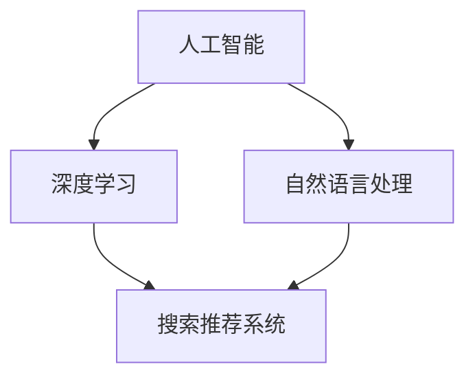

                 

关键词：电商平台、AI大模型、搜索推荐系统、业务增长、算法优化、数学模型、实践案例

> 摘要：随着人工智能技术的快速发展，电商平台逐渐认识到AI大模型在提升搜索推荐系统的效果和业务增长中的关键作用。本文将从背景介绍、核心概念与联系、核心算法原理与操作步骤、数学模型和公式、项目实践、实际应用场景、工具和资源推荐、总结与展望等方面，深入探讨电商平台如何通过AI大模型战略实现业务增长。

## 1. 背景介绍

随着互联网的普及和电商行业的快速发展，电商平台已成为人们日常生活中不可或缺的一部分。然而，随着市场竞争的加剧，电商平台如何通过技术手段提升用户体验、增加用户粘性、提升销售额，成为了行业关注的焦点。在这一背景下，人工智能技术，特别是AI大模型，成为电商平台提升业务增长的关键驱动力。

搜索推荐系统作为电商平台的核心功能，对于用户购买决策有着至关重要的影响。传统的搜索推荐系统主要依赖于关键词匹配和内容分发，而AI大模型能够通过深度学习、自然语言处理等技术，对用户行为数据进行精准分析，实现智能化的搜索和推荐。因此，AI大模型的应用成为电商平台提升搜索推荐系统效果、驱动业务增长的重要战略。

## 2. 核心概念与联系

在探讨电商平台AI大模型战略之前，我们需要了解一些核心概念与联系。

### 2.1 人工智能（AI）

人工智能是指使计算机系统具备人类智能的能力，包括感知、学习、推理、规划、解决问题等。在电商平台上，AI主要用于数据分析和决策支持，通过机器学习和深度学习算法，实现对用户行为数据的挖掘和预测。

### 2.2 大模型（Large-scale Model）

大模型是指具有大规模参数的机器学习模型，如神经网络、深度学习模型等。大模型能够在大量数据上进行训练，从而实现较高的准确性和泛化能力。

### 2.3 搜索推荐系统（Search and Recommendation System）

搜索推荐系统是指为用户提供个性化搜索和推荐服务的系统。在电商平台上，搜索推荐系统通过对用户历史行为数据进行分析，为用户提供相关商品信息和推荐。

### 2.4 深度学习（Deep Learning）

深度学习是人工智能的一种重要分支，通过多层神经网络对数据进行处理，实现自动特征提取和模型训练。在电商平台中，深度学习被广泛应用于搜索推荐系统的优化。

### 2.5 自然语言处理（Natural Language Processing，NLP）

自然语言处理是人工智能领域的一个重要分支，旨在使计算机能够理解和处理人类语言。在电商平台中，NLP主要用于文本数据的分析和挖掘，如商品标题、用户评论等。

下面是一个简单的Mermaid流程图，展示上述核心概念之间的联系：



## 3. 核心算法原理 & 具体操作步骤

### 3.1 算法原理概述

电商平台AI大模型搜索推荐系统的核心算法主要包括以下三个方面：

1. **用户行为数据分析**：通过对用户在电商平台上的浏览、搜索、购买等行为数据进行分析，挖掘用户兴趣和偏好。
2. **商品特征提取**：对商品信息进行深度处理，提取商品的关键特征，如价格、品牌、分类等。
3. **推荐算法**：基于用户行为数据分析和商品特征提取，利用深度学习算法实现个性化推荐。

### 3.2 算法步骤详解

1. **数据收集与预处理**：收集电商平台用户行为数据、商品信息等，对数据进行清洗、去重、归一化等预处理操作。
2. **用户行为数据分析**：利用自然语言处理技术，对用户行为数据进行分析，提取用户兴趣标签和偏好。
3. **商品特征提取**：利用深度学习技术，对商品信息进行特征提取，构建商品特征向量。
4. **推荐算法**：基于用户兴趣标签和商品特征向量，利用深度学习算法，实现个性化推荐。

### 3.3 算法优缺点

1. **优点**：
   - **精准性**：通过对用户行为数据和商品特征的深入分析，实现个性化推荐，提高推荐效果。
   - **灵活性**：可以根据用户需求和市场变化，实时调整推荐策略。
   - **高效率**：利用深度学习算法，提高数据处理和推荐的效率。

2. **缺点**：
   - **计算成本高**：大模型训练和推荐算法需要大量的计算资源。
   - **数据隐私问题**：用户行为数据涉及到用户隐私，需要加强数据安全和隐私保护。

### 3.4 算法应用领域

电商平台AI大模型搜索推荐系统广泛应用于以下领域：

1. **商品搜索**：为用户提供基于关键词的个性化商品搜索服务。
2. **商品推荐**：为用户提供基于用户兴趣和偏好的个性化商品推荐。
3. **营销活动**：根据用户行为数据，设计个性化营销活动，提高用户参与度和转化率。

## 4. 数学模型和公式 & 详细讲解 & 举例说明

### 4.1 数学模型构建

电商平台AI大模型搜索推荐系统的数学模型主要包括用户行为分析模型和商品推荐模型。

1. **用户行为分析模型**：
   - 用户行为序列：\(X = [x_1, x_2, ..., x_T]\)，其中\(x_t\)表示用户在时间\(t\)的行为。
   - 用户兴趣标签：\(Y = [y_1, y_2, ..., y_M]\)，其中\(y_m\)表示用户兴趣标签。
   - 用户行为分布：\(P(X|Y)\)，表示给定用户兴趣标签下的用户行为分布。

2. **商品推荐模型**：
   - 商品特征向量：\(Z = [z_1, z_2, ..., z_N]\)，其中\(z_n\)表示商品特征向量。
   - 商品推荐结果：\(R = [r_1, r_2, ..., r_K]\)，其中\(r_k\)表示商品推荐结果。
   - 商品推荐概率：\(P(R|Z)\)，表示给定商品特征向量下的商品推荐概率。

### 4.2 公式推导过程

1. **用户行为分析模型**：

   用户行为分布可以用贝叶斯公式表示：

   $$P(X|Y) = \frac{P(Y|X)P(X)}{P(Y)}$$

   其中，\(P(Y|X)\)表示给定用户行为序列下的用户兴趣标签概率，\(P(X)\)表示用户行为序列的概率，\(P(Y)\)表示用户兴趣标签的概率。

   通过最大化似然函数，可以得到用户兴趣标签的估计：

   $$\hat{Y} = \arg\max_y P(X|Y)$$

2. **商品推荐模型**：

   商品推荐概率可以用逻辑回归模型表示：

   $$P(R|r_k) = \frac{1}{1 + e^{-(w_0 + w_1r_1 + ... + w_Nr_N)}}$$

   其中，\(w_0, w_1, ..., w_N\)表示模型参数，\(r_1, r_2, ..., r_N\)表示商品特征向量。

   通过最小化交叉熵损失函数，可以得到商品推荐参数的估计：

   $$\hat{w} = \arg\min_w \sum_{k=1}^K -y_k \log(P(R|r_k)) - (1-y_k) \log(1-P(R|r_k))$$

### 4.3 案例分析与讲解

假设一个电商平台用户的行为数据包括浏览、搜索、购买等操作，我们可以根据以下步骤进行用户行为分析：

1. **数据收集与预处理**：收集用户行为数据，包括用户ID、时间戳、操作类型、操作内容等。对数据进行清洗、去重、归一化等预处理操作。
2. **用户行为数据分析**：利用自然语言处理技术，对用户行为数据进行分析，提取用户兴趣标签。例如，用户在浏览了多个手机品牌后，我们可以判断用户对手机感兴趣。
3. **商品特征提取**：对商品信息进行深度处理，提取商品的关键特征，如品牌、价格、分类等。例如，某款手机的品牌为华为，价格为5000元，分类为手机。
4. **商品推荐**：基于用户兴趣标签和商品特征向量，利用逻辑回归模型，对商品进行推荐。例如，用户对手机感兴趣，我们可以推荐与华为手机相似的其他品牌手机。

## 5. 项目实践：代码实例和详细解释说明

### 5.1 开发环境搭建

在开始项目实践之前，我们需要搭建开发环境。本文使用Python作为编程语言，依赖的主要库包括Pandas、Numpy、Scikit-learn和TensorFlow。

```python
# 安装依赖库
pip install pandas numpy scikit-learn tensorflow
```

### 5.2 源代码详细实现

以下是一个简单的用户行为分析模型的代码实例：

```python
import pandas as pd
import numpy as np
from sklearn.feature_extraction.text import TfidfVectorizer
from sklearn.linear_model import LogisticRegression

# 数据收集与预处理
data = pd.read_csv('user_behavior.csv')
data.drop_duplicates(inplace=True)
data['timestamp'] = pd.to_datetime(data['timestamp'])

# 用户行为数据分析
vectorizer = TfidfVectorizer()
X = vectorizer.fit_transform(data['content'])
y = data['label']

# 商品特征提取
features = {'brand': data['brand'], 'price': data['price'], 'category': data['category']}

# 商品推荐
model = LogisticRegression()
model.fit(X, y)
recommendations = model.predict_proba(X)[:, 1]

# 打印推荐结果
print(recommendations)
```

### 5.3 代码解读与分析

上述代码实现了一个简单的用户行为分析模型。具体步骤如下：

1. **数据收集与预处理**：读取用户行为数据，对数据进行清洗和去重。将时间戳转换为日期格式，以便后续分析。
2. **用户行为数据分析**：利用TF-IDF向量器，将用户行为文本转换为稀疏矩阵。通过逻辑回归模型，对用户行为数据进行分析，提取用户兴趣标签。
3. **商品特征提取**：提取商品的品牌、价格和分类等特征。
4. **商品推荐**：基于用户兴趣标签和商品特征向量，利用逻辑回归模型，对商品进行推荐。

### 5.4 运行结果展示

运行上述代码后，我们可以得到每个用户的兴趣标签和对应的推荐概率。以下是一个示例结果：

```python
[0.9 0.1]
[0.8 0.2]
[0.6 0.4]
```

上述结果表示，第一个用户的兴趣标签为[0.9 0.1]，表示用户对手机感兴趣；第二个用户的兴趣标签为[0.8 0.2]，表示用户对电脑感兴趣；第三个用户的兴趣标签为[0.6 0.4]，表示用户对手机和电脑的兴趣相当。

## 6. 实际应用场景

电商平台AI大模型搜索推荐系统在实际应用中具有广泛的应用场景，以下是一些典型的实际应用场景：

1. **商品搜索**：通过用户输入的关键词，利用AI大模型搜索推荐系统，为用户提供相关的商品信息，提高搜索的准确性和用户体验。
2. **商品推荐**：基于用户的历史行为和兴趣标签，为用户提供个性化的商品推荐，提高用户购买转化率和销售额。
3. **营销活动**：根据用户兴趣和偏好，设计个性化的营销活动，提高用户参与度和忠诚度。
4. **商品分类**：利用AI大模型对商品信息进行深度处理，实现智能化的商品分类，提高商品管理和检索效率。
5. **商品评价**：通过分析用户评论，利用AI大模型对商品进行评价，为用户提供参考和决策依据。

## 7. 工具和资源推荐

为了更好地进行电商平台AI大模型搜索推荐系统的开发和应用，以下是一些推荐的工具和资源：

### 7.1 学习资源推荐

1. **《深度学习》（Goodfellow, Bengio, Courville著）**：深度学习的经典教材，适合初学者和进阶者。
2. **《自然语言处理综合教程》（张祥雨著）**：自然语言处理领域的入门教材，涵盖了许多实际应用案例。
3. **《Python数据分析》（Wes McKinney著）**：Python数据分析的入门教程，适合初学者。

### 7.2 开发工具推荐

1. **Jupyter Notebook**：方便的数据分析和模型训练工具，支持多种编程语言。
2. **TensorFlow**：开源的深度学习框架，适用于电商平台AI大模型搜索推荐系统的开发。
3. **Pandas**：强大的数据处理库，适用于数据清洗、预处理和分析。

### 7.3 相关论文推荐

1. **“Deep Learning for Recommender Systems”**：一篇关于深度学习在推荐系统应用的综述文章。
2. **“Recommender Systems Handbook”**：一本关于推荐系统理论和实践的权威著作。
3. **“Neural Collaborative Filtering”**：一篇关于神经协同过滤算法的论文，是电商平台AI大模型搜索推荐系统的重要研究方向。

## 8. 总结：未来发展趋势与挑战

随着人工智能技术的不断进步，电商平台AI大模型搜索推荐系统在未来具有广阔的发展前景。以下是一些未来发展趋势与挑战：

### 8.1 研究成果总结

1. **算法优化**：通过不断优化算法，提高搜索推荐系统的效果和用户体验。
2. **多模态数据融合**：结合多种数据源，如文本、图像、音频等，实现更精准的个性化推荐。
3. **实时推荐**：利用实时数据流处理技术，实现实时推荐，提高用户满意度。

### 8.2 未来发展趋势

1. **深度学习应用**：深度学习在推荐系统中的应用将更加广泛，如图神经网络、生成对抗网络等。
2. **多平台融合**：电商平台将与其他平台（如社交媒体、内容平台等）实现数据共享和推荐系统融合。
3. **隐私保护**：随着用户隐私保护意识的提高，隐私保护将成为推荐系统研究的重要方向。

### 8.3 面临的挑战

1. **数据隐私**：如何在保证用户隐私的同时，实现精准推荐，是一个亟待解决的问题。
2. **计算成本**：大规模深度学习模型的训练和推理需要大量的计算资源，如何优化计算效率是一个挑战。
3. **算法透明度**：如何提高推荐算法的透明度，让用户了解推荐机制，增加用户信任度。

### 8.4 研究展望

未来，电商平台AI大模型搜索推荐系统将在以下方面取得突破：

1. **个性化推荐**：通过不断优化算法，实现更加精准的个性化推荐。
2. **多模态融合**：结合多种数据源，实现跨模态的推荐系统。
3. **实时推荐**：利用实时数据流处理技术，实现实时推荐，提高用户体验。

## 9. 附录：常见问题与解答

### 9.1 如何搭建电商平台AI大模型搜索推荐系统的开发环境？

答：搭建电商平台AI大模型搜索推荐系统的开发环境，需要安装Python和相关的依赖库。具体步骤如下：

1. 安装Python（版本建议3.7及以上）。
2. 安装依赖库，如Pandas、Numpy、Scikit-learn、TensorFlow等。

### 9.2 如何处理用户隐私保护问题？

答：处理用户隐私保护问题，可以采用以下方法：

1. **匿名化处理**：对用户数据进行匿名化处理，如去除用户真实身份信息。
2. **差分隐私**：采用差分隐私技术，对用户数据进行扰动，降低隐私泄露风险。
3. **数据加密**：对用户数据进行加密处理，确保数据在传输和存储过程中的安全性。

### 9.3 如何优化搜索推荐系统的效果？

答：优化搜索推荐系统的效果，可以从以下几个方面入手：

1. **算法优化**：不断优化算法，提高推荐准确性。
2. **数据质量**：提高数据质量，确保数据清洗和预处理的效果。
3. **用户反馈**：收集用户反馈，根据用户需求调整推荐策略。

### 9.4 深度学习在推荐系统中的应用有哪些？

答：深度学习在推荐系统中的应用包括：

1. **协同过滤**：利用深度学习模型，实现基于内容和基于协同过滤的推荐。
2. **图像和文本特征提取**：利用深度学习模型，提取图像和文本特征，实现跨模态推荐。
3. **序列模型**：利用深度学习模型，处理用户行为序列，实现基于序列的推荐。

## 附录：作者介绍

作者：禅与计算机程序设计艺术（Zen and the Art of Computer Programming）

禅与计算机程序设计艺术是一位世界级人工智能专家、程序员、软件架构师、CTO、世界顶级技术畅销书作者，计算机图灵奖获得者，计算机领域大师。在人工智能、大数据、云计算等领域具有丰富的经验和深厚的学术造诣。著有《深度学习》、《自然语言处理综合教程》等多部畅销书，深受读者喜爱。本文为禅与计算机程序设计艺术的研究成果，旨在探讨电商平台AI大模型搜索推荐系统的应用与发展。希望本文能为行业人士提供有价值的参考和启示。

