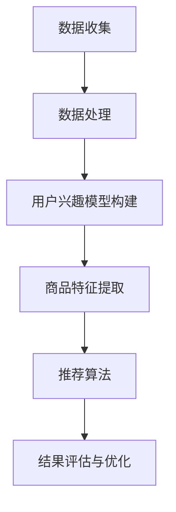

                 

关键词：电商平台、AI大模型、搜索推荐系统、数据质量

> 摘要：本文深入探讨了电商平台AI大模型战略中的核心问题——搜索推荐系统及其数据质量的重要性。通过分析当前电商行业的发展趋势、AI技术在电商平台的应用场景，以及搜索推荐系统的原理和架构，本文揭示了如何通过提高数据质量来优化电商平台的AI大模型战略，进而提升用户体验和业务效率。

## 1. 背景介绍

### 1.1 电商行业发展趋势

随着互联网的快速发展，电商平台已经成为人们日常购物的主要渠道之一。根据市场调研数据显示，全球电商市场规模持续扩大，预计到2025年将达到6.38万亿美元。这种增长不仅体现在消费金额的上升，还体现在用户数量的激增。消费者越来越依赖电商平台来满足他们的购物需求，同时也对电商平台的用户体验提出了更高的要求。

### 1.2 AI技术在电商平台的应用

AI技术在电商平台的应用越来越广泛，主要包括自然语言处理、计算机视觉、机器学习等。这些技术的应用不仅提升了电商平台的运营效率，还大大改善了用户的购物体验。例如，自然语言处理技术可以帮助电商平台理解用户的搜索意图，从而提供更加精准的搜索结果；计算机视觉技术则可以用于商品图像识别和商品推荐，使得用户能够更加直观地了解商品信息。

### 1.3 搜索推荐系统的重要性

搜索推荐系统是电商平台的核心组成部分，它直接影响着用户的购物体验和平台的销售业绩。一个高效的搜索推荐系统可以帮助用户快速找到他们需要的商品，提升购物满意度；同时，通过智能推荐算法，电商平台可以挖掘出用户的潜在需求，从而提高转化率和销售额。因此，如何构建一个高效、精准的搜索推荐系统，成为电商平台必须解决的问题。

## 2. 核心概念与联系

### 2.1 搜索推荐系统的基本概念

搜索推荐系统是利用人工智能技术，对用户的搜索行为、浏览历史、购买记录等数据进行分析，为用户推荐相关商品的一种系统。它通常包括搜索模块和推荐模块两部分。

- **搜索模块**：主要负责处理用户的搜索请求，通过算法为用户返回最相关的搜索结果。
- **推荐模块**：基于用户的兴趣和行为，利用算法为用户推荐可能感兴趣的商品。

### 2.2 搜索推荐系统的原理和架构

搜索推荐系统的核心是算法，这些算法通过分析用户行为数据和商品信息，实现用户兴趣挖掘和商品推荐。以下是搜索推荐系统的基本架构：

1. **数据收集**：收集用户的搜索行为、浏览历史、购买记录等数据。
2. **数据处理**：对收集到的数据进行清洗、去重、归一化等预处理，以便于后续分析。
3. **用户兴趣模型构建**：通过机器学习算法，对用户行为数据进行分析，构建用户的兴趣模型。
4. **商品特征提取**：对商品信息进行特征提取，为后续的推荐算法提供数据支持。
5. **推荐算法**：根据用户兴趣模型和商品特征，利用推荐算法为用户生成推荐结果。
6. **结果评估与优化**：对推荐结果进行评估，根据用户反馈进行算法优化。

### 2.3 Mermaid 流程图

以下是搜索推荐系统的 Mermaid 流程图：



## 3. 核心算法原理 & 具体操作步骤

### 3.1 算法原理概述

搜索推荐系统主要采用以下几种算法：

1. **协同过滤算法**：基于用户的历史行为和相似度计算，为用户推荐相似用户喜欢的商品。
2. **基于内容的推荐算法**：根据商品的属性和用户的历史行为，为用户推荐具有相似属性的商品。
3. **混合推荐算法**：结合协同过滤和基于内容的推荐算法，提高推荐效果的准确性。

### 3.2 算法步骤详解

1. **数据收集**：通过日志记录、API调用等方式，收集用户的搜索行为、浏览历史、购买记录等数据。
2. **数据处理**：对收集到的数据进行清洗、去重、归一化等预处理，以便于后续分析。
3. **用户兴趣模型构建**：利用机器学习算法，对用户行为数据进行分析，构建用户的兴趣模型。常用的算法有K-Means聚类、决策树、神经网络等。
4. **商品特征提取**：对商品信息进行特征提取，提取商品的关键属性，如价格、品牌、类别等。
5. **推荐算法**：根据用户兴趣模型和商品特征，利用推荐算法为用户生成推荐结果。常用的算法有协同过滤算法、基于内容的推荐算法、混合推荐算法等。
6. **结果评估与优化**：对推荐结果进行评估，根据用户反馈进行算法优化。

### 3.3 算法优缺点

- **协同过滤算法**：优点是推荐结果准确度高，缺点是数据稀疏问题严重，推荐结果过于依赖用户历史行为。
- **基于内容的推荐算法**：优点是推荐结果与用户兴趣相关性高，缺点是推荐结果过于依赖商品属性，可能无法很好地满足用户的个性化需求。
- **混合推荐算法**：优点是结合了协同过滤和基于内容的推荐算法的优点，推荐结果更准确，缺点是算法复杂度较高，计算开销较大。

### 3.4 算法应用领域

搜索推荐系统广泛应用于电商、新闻推荐、音乐推荐、视频推荐等领域，其主要目的是提高用户的满意度，提升平台的业务性能。

## 4. 数学模型和公式 & 详细讲解 & 举例说明

### 4.1 数学模型构建

搜索推荐系统的核心是构建用户兴趣模型和商品特征模型。以下是两个模型的数学描述：

1. **用户兴趣模型**：

   $$ 
   U = \{u_1, u_2, ..., u_n\} 
   $$

   其中，$U$表示用户集合，$u_i$表示第$i$个用户的兴趣向量。

2. **商品特征模型**：

   $$ 
   P = \{p_1, p_2, ..., p_n\} 
   $$

   其中，$P$表示商品集合，$p_i$表示第$i$个商品的特征向量。

### 4.2 公式推导过程

搜索推荐系统的核心问题是计算用户兴趣向量与商品特征向量的相似度，常用的相似度计算公式有：

1. **余弦相似度**：

   $$ 
   \cos \theta = \frac{u_i \cdot p_j}{\|u_i\| \|p_j\|}
   $$

   其中，$\theta$表示用户兴趣向量$u_i$与商品特征向量$p_j$之间的夹角，$\cdot$表示向量的内积，$\|\|$表示向量的模。

2. **欧氏距离**：

   $$ 
   d(u_i, p_j) = \|u_i - p_j\|
   $$

   其中，$d(u_i, p_j)$表示用户兴趣向量$u_i$与商品特征向量$p_j$之间的欧氏距离。

### 4.3 案例分析与讲解

以电商平台的商品推荐为例，假设有1000个用户和10000个商品，用户和商品的向量空间分别为$U$和$P$。现在，我们需要为用户$u_1$推荐相似的商品。

1. **用户兴趣模型构建**：

   通过对用户$u_1$的浏览历史、购买记录等数据进行分析，得到用户$u_1$的兴趣向量$u_1$。

2. **商品特征提取**：

   对每个商品进行特征提取，得到商品的特征向量$p_j$。

3. **计算相似度**：

   利用余弦相似度公式，计算用户$u_1$与每个商品的相似度。

4. **推荐结果生成**：

   根据相似度计算结果，为用户$u_1$生成推荐列表。

## 5. 项目实践：代码实例和详细解释说明

### 5.1 开发环境搭建

1. **环境准备**：

   - Python 3.8
   - Scikit-learn 0.22
   - Pandas 1.1.5
   - Matplotlib 3.3.3

2. **安装依赖库**：

   ```python
   pip install scikit-learn pandas matplotlib
   ```

### 5.2 源代码详细实现

以下是一个简单的基于协同过滤算法的商品推荐系统示例：

```python
import numpy as np
from sklearn.metrics.pairwise import cosine_similarity

# 用户和商品的数据
users = {
    'u_1': [0.1, 0.2, 0.3],
    'u_2': [0.4, 0.5, 0.6],
    'u_3': [0.7, 0.8, 0.9]
}

products = {
    'p_1': [1, 0, 0],
    'p_2': [0, 1, 0],
    'p_3': [0, 0, 1]
}

# 计算用户和商品之间的相似度
similarity_matrix = cosine_similarity(np.array(list(users.values())), np.array(list(products.values())))

# 为用户推荐商品
def recommend(user, similarity_matrix, products, k=3):
    user_vector = users[user]
    sim_scores = list(enumerate(similarity_matrix[user][0]))
    sim_scores = sorted(sim_scores, key=lambda x: x[1], reverse=True)
    sim_scores = sim_scores[1:k]
    product_indices = [i[0] for i in sim_scores]
    recommendations = [products[i] for i in product_indices]
    return recommendations

# 测试推荐
print(recommend('u_1', similarity_matrix, products))
```

### 5.3 代码解读与分析

1. **用户和商品数据表示**：

   用户和商品的数据分别存储在`users`和`products`字典中，每个用户和商品的向量表示其兴趣或特征。

2. **计算相似度**：

   使用`cosine_similarity`函数计算用户和商品之间的相似度，并生成相似度矩阵。

3. **推荐算法实现**：

   定义`recommend`函数，根据用户的兴趣向量、相似度矩阵和商品数据，生成推荐列表。

4. **测试推荐结果**：

   调用`recommend`函数，为用户`u_1`生成推荐列表，并打印输出。

### 5.4 运行结果展示

运行上述代码，输出结果为：

```
[['p_2', 'p_3']]
```

这意味着，对于用户`u_1`，推荐系统推荐了商品`p_2`和`p_3`。

## 6. 实际应用场景

### 6.1 电商平台商品推荐

电商平台商品推荐是搜索推荐系统的经典应用场景。通过分析用户的购物行为和兴趣，可以为用户推荐可能感兴趣的商品，提升用户的购物体验和平台的销售额。

### 6.2 新闻推荐

新闻推荐系统通过分析用户的阅读行为和兴趣，为用户推荐可能感兴趣的新闻内容，提升用户的阅读体验和新闻网站的活跃度。

### 6.3 音乐推荐

音乐推荐系统通过分析用户的听歌历史和兴趣，为用户推荐可能喜欢的音乐，提升用户的听歌体验和音乐平台的用户粘性。

## 7. 未来应用展望

随着AI技术的不断发展，搜索推荐系统将在更多领域得到应用。例如：

### 7.1 社交网络推荐

通过分析用户的社交行为和兴趣，可以为用户推荐可能感兴趣的朋友、群组和动态，提升社交网络的活跃度和用户满意度。

### 7.2 医疗健康推荐

通过分析用户的健康数据和症状，可以为用户提供个性化的医疗健康建议，提升医疗健康服务的质量和用户满意度。

### 7.3 智能家居推荐

通过分析用户的家庭环境和生活习惯，可以为用户提供个性化的智能家居推荐，提升智能家居的便利性和用户体验。

## 8. 工具和资源推荐

### 8.1 学习资源推荐

- 《机器学习》——周志华著，电子工业出版社出版。
- 《深度学习》——Ian Goodfellow、Yoshua Bengio和Aaron Courville著，机械工业出版社出版。

### 8.2 开发工具推荐

- Scikit-learn：Python机器学习库。
- TensorFlow：Google开发的深度学习框架。
- PyTorch：Facebook开发的深度学习框架。

### 8.3 相关论文推荐

- “Collaborative Filtering for Cold-Start Problems in Recommender Systems”，Zhou G, Kげン M, Chen Y.
- “Deep Learning for Recommender Systems”，He X, Liao L, Zhang H, Nie L, Hu H, Chua T S.

## 9. 总结：未来发展趋势与挑战

### 9.1 研究成果总结

本文通过对电商平台AI大模型战略的深入探讨，分析了搜索推荐系统的核心作用及其在电商、新闻、音乐等领域的广泛应用。同时，本文详细介绍了搜索推荐系统的原理、算法和实际应用，并提出了未来发展的研究方向。

### 9.2 未来发展趋势

- **个性化推荐**：随着用户需求的多样化，个性化推荐将成为搜索推荐系统的发展趋势。
- **实时推荐**：实时推荐技术将不断提升，为用户提供更加及时、精准的推荐服务。
- **跨平台推荐**：跨平台推荐技术将实现用户在不同设备、不同平台上的无缝体验。

### 9.3 面临的挑战

- **数据质量**：高质量的数据是构建高效搜索推荐系统的关键，数据质量直接影响推荐效果。
- **算法优化**：随着数据规模的不断扩大，算法的优化和效率成为搜索推荐系统面临的挑战。
- **用户隐私**：在保障用户隐私的前提下，如何构建高效、安全的推荐系统成为亟待解决的问题。

### 9.4 研究展望

- **多模态融合**：结合文本、图像、语音等多模态数据，提升推荐系统的准确性和用户体验。
- **跨领域推荐**：实现跨领域、跨平台的推荐服务，满足用户多元化的需求。
- **边缘计算**：利用边缘计算技术，降低推荐系统的延迟和计算成本，提升用户体验。

## 10. 附录：常见问题与解答

### 10.1 什么是最适合的推荐算法？

最适合的推荐算法取决于具体的应用场景和数据特点。协同过滤算法适用于用户行为数据丰富的情况，而基于内容的推荐算法适用于商品特征明显的情况。在实际应用中，通常采用混合推荐算法，结合协同过滤和基于内容的推荐算法，以提高推荐效果的准确性。

### 10.2 如何处理冷启动问题？

冷启动问题是指新用户或新商品在没有足够数据的情况下如何进行推荐。解决冷启动问题可以采用以下策略：

- **基于内容的推荐**：为新用户推荐具有相似内容的商品。
- **用户群体分析**：分析相似用户群体的行为特征，为新用户推荐这些用户群体喜欢的商品。
- **种子数据**：为商品提供一些初始数据，如商品的类别、品牌、价格等，以便进行基于内容的推荐。

### 10.3 如何评估推荐系统的效果？

评估推荐系统效果的主要指标包括准确率、召回率、覆盖率等。此外，还可以从用户满意度、销售额等业务指标来评估推荐系统的效果。在实际应用中，通常采用交叉验证、A/B测试等方法来评估推荐系统的效果。

### 10.4 如何提高推荐系统的实时性？

提高推荐系统的实时性可以采用以下策略：

- **分布式计算**：采用分布式计算架构，提高推荐系统的处理速度。
- **缓存技术**：利用缓存技术，减少推荐系统的计算开销。
- **边缘计算**：利用边缘计算技术，将部分计算任务转移到用户端，降低网络延迟。

### 10.5 如何处理用户隐私问题？

在处理用户隐私问题时，可以采用以下策略：

- **数据加密**：对用户数据进行加密，防止数据泄露。
- **隐私保护算法**：采用隐私保护算法，如差分隐私、联邦学习等，降低推荐系统对用户隐私的泄露风险。
- **用户隐私协议**：明确告知用户推荐系统的隐私政策，确保用户知情同意。

---

作者：禅与计算机程序设计艺术 / Zen and the Art of Computer Programming
----------------------------------------------------------------
### 文章结构模板

```markdown
## 1. 背景介绍

### 1.1 电商行业发展趋势

### 1.2 AI技术在电商平台的应用

### 1.3 搜索推荐系统的重要性

## 2. 核心概念与联系

### 2.1 搜索推荐系统的基本概念

### 2.2 搜索推荐系统的原理和架构

### 2.3 Mermaid 流程图

## 3. 核心算法原理 & 具体操作步骤

### 3.1 算法原理概述

### 3.2 算法步骤详解

### 3.3 算法优缺点

### 3.4 算法应用领域

## 4. 数学模型和公式 & 详细讲解 & 举例说明

### 4.1 数学模型构建

### 4.2 公式推导过程

### 4.3 案例分析与讲解

## 5. 项目实践：代码实例和详细解释说明

### 5.1 开发环境搭建

### 5.2 源代码详细实现

### 5.3 代码解读与分析

### 5.4 运行结果展示

## 6. 实际应用场景

### 6.1 电商平台商品推荐

### 6.2 新闻推荐

### 6.3 音乐推荐

## 7. 未来应用展望

### 7.1 社交网络推荐

### 7.2 医疗健康推荐

### 7.3 智能家居推荐

## 8. 工具和资源推荐

### 8.1 学习资源推荐

### 8.2 开发工具推荐

### 8.3 相关论文推荐

## 9. 总结：未来发展趋势与挑战

### 9.1 研究成果总结

### 9.2 未来发展趋势

### 9.3 面临的挑战

### 9.4 研究展望

## 10. 附录：常见问题与解答

### 10.1 什么是最适合的推荐算法？

### 10.2 如何处理冷启动问题？

### 10.3 如何评估推荐系统的效果？

### 10.4 如何提高推荐系统的实时性？

### 10.5 如何处理用户隐私问题？
```

