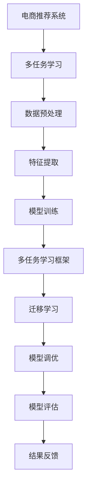

                 

关键词：电商推荐系统、多任务学习、迁移学习、算法原理、数学模型、项目实践、应用场景、工具和资源

>摘要：本文深入探讨了电商推荐系统中多任务学习和迁移学习的重要性和应用。通过详细的算法原理讲解、数学模型推导、项目实践和实际应用场景分析，为读者提供了全面的理解和指导。文章旨在揭示这两大技术在实际电商推荐系统中的重要作用，并探讨其未来发展趋势和面临的挑战。

## 1. 背景介绍

### 电商推荐系统概述

电商推荐系统作为现代电子商务的核心技术之一，其目的是通过分析用户的购买历史、浏览行为、兴趣爱好等多维度数据，为用户提供个性化的商品推荐。这不仅提高了用户的购物体验，还显著提升了电商平台的销售额和用户黏性。

### 多任务学习

多任务学习（Multi-Task Learning，MTL）是一种机器学习技术，旨在同时解决多个相关任务。在电商推荐系统中，多任务学习可以通过同时分析用户的多个行为数据，例如购买、浏览和搜索，来提高推荐的准确性和多样性。

### 迁移学习

迁移学习（Transfer Learning，TL）是一种通过利用已有任务的知识来解决新任务的技术。在电商推荐系统中，迁移学习可以通过将其他领域或相似场景中的知识迁移到电商推荐任务中，提高模型的性能和适应能力。

## 2. 核心概念与联系

### 多任务学习与迁移学习的关系

多任务学习与迁移学习在电商推荐系统中有着密切的联系。多任务学习通过同时解决多个相关任务，可以在不同任务间共享知识，从而提高模型的泛化能力。而迁移学习则可以将其他领域或相似场景中的知识迁移到电商推荐任务中，进一步拓展模型的适用范围。

### Mermaid 流程图



## 3. 核心算法原理 & 具体操作步骤

### 3.1 算法原理概述

多任务学习通过将多个相关任务映射到一个共同的低维特征空间，实现任务间的知识共享。迁移学习则通过在源域和目标域之间建立共享参数，将源域的知识迁移到目标域。

### 3.2 算法步骤详解

1. 数据收集与预处理：收集电商平台的用户行为数据，并对数据进行清洗、去噪和标准化处理。
2. 特征提取：利用特征提取技术提取用户行为数据中的关键特征，如用户年龄、性别、购买历史等。
3. 模型训练：构建多任务学习模型和迁移学习模型，并利用提取的特征进行模型训练。
4. 模型调优：通过调整模型参数，优化模型性能。
5. 模型评估：对训练好的模型进行评估，如准确率、召回率、F1分数等。
6. 结果反馈：将模型推荐结果反馈给用户，并根据用户反馈进行模型优化。

### 3.3 算法优缺点

**多任务学习：**

优点：提高模型的泛化能力，减少过拟合。

缺点：需要足够多的相关任务，否则效果可能不显著。

**迁移学习：**

优点：提高模型在目标域的性能，减少对标注数据的依赖。

缺点：需要找到合适的源域和目标域，否则效果可能不理想。

### 3.4 算法应用领域

多任务学习和迁移学习在电商推荐系统中的应用广泛，如个性化推荐、商品分类、用户行为预测等。此外，它们还可以应用于其他领域，如自然语言处理、图像识别等。

## 4. 数学模型和公式 & 详细讲解 & 举例说明

### 4.1 数学模型构建

多任务学习模型通常采用共享权重的方式，将多个任务映射到一个共同的低维特征空间。假设有 $K$ 个任务，每个任务都有一个对应的损失函数，则多任务学习的损失函数可以表示为：

$$L = \sum_{k=1}^{K} L_k$$

其中，$L_k$ 表示第 $k$ 个任务的损失函数。

迁移学习模型通常采用共享参数的方式，将源域和目标域的任务映射到一个共同的低维特征空间。假设源域有 $N_s$ 个样本，目标域有 $N_t$ 个样本，则迁移学习模型的损失函数可以表示为：

$$L = \frac{1}{N_s + N_t} \left( \sum_{s=1}^{N_s} L_s + \sum_{t=1}^{N_t} L_t \right)$$

其中，$L_s$ 和 $L_t$ 分别表示源域和目标域的损失函数。

### 4.2 公式推导过程

#### 多任务学习

假设每个任务的特征空间维数为 $d$，则多任务学习模型的损失函数可以表示为：

$$L = \sum_{k=1}^{K} \frac{1}{N_k} \sum_{i=1}^{N_k} \log P(y_i^k | \theta_k)$$

其中，$y_i^k$ 表示第 $i$ 个样本在第 $k$ 个任务上的真实标签，$P(y_i^k | \theta_k)$ 表示第 $i$ 个样本在第 $k$ 个任务上的预测概率，$\theta_k$ 表示第 $k$ 个任务的模型参数。

为了将多个任务映射到一个共同的低维特征空间，我们定义一个共享的映射函数 $f(\cdot)$，则每个任务的特征空间可以表示为：

$$x_i^k = f(x_i)$$

其中，$x_i$ 表示第 $i$ 个样本的特征向量。

将映射函数 $f(\cdot)$ 代入损失函数，得到：

$$L = \sum_{k=1}^{K} \frac{1}{N_k} \sum_{i=1}^{N_k} \log P(y_i^k | f(x_i), \theta_k)$$

#### 迁移学习

假设源域的特征空间维数为 $d_s$，目标域的特征空间维数为 $d_t$，则迁移学习模型的损失函数可以表示为：

$$L = \frac{1}{N_s + N_t} \left( \sum_{s=1}^{N_s} \frac{1}{N_s} \sum_{i=1}^{N_s} \log P(y_i^s | \theta_s) + \sum_{t=1}^{N_t} \frac{1}{N_t} \sum_{i=1}^{N_t} \log P(y_i^t | \theta_t) \right)$$

其中，$y_i^s$ 表示第 $i$ 个样本在源域上的真实标签，$y_i^t$ 表示第 $i$ 个样本在目标域上的真实标签，$\theta_s$ 表示源域的模型参数，$\theta_t$ 表示目标域的模型参数。

为了在源域和目标域之间建立共享参数，我们定义一个共享的特征提取函数 $g(\cdot)$，则源域和目标域的特征空间可以表示为：

$$x_i^s = g(x_i)$$

$$x_i^t = g(x_i)$$

将特征提取函数 $g(\cdot)$ 代入损失函数，得到：

$$L = \frac{1}{N_s + N_t} \left( \sum_{s=1}^{N_s} \frac{1}{N_s} \sum_{i=1}^{N_s} \log P(y_i^s | g(x_i), \theta_s) + \sum_{t=1}^{N_t} \frac{1}{N_t} \sum_{i=1}^{N_t} \log P(y_i^t | g(x_i), \theta_t) \right)$$

### 4.3 案例分析与讲解

#### 案例一：多任务学习

假设我们有一个电商推荐系统，需要同时解决用户购买预测、浏览预测和搜索预测三个任务。我们可以使用多任务学习模型，将这三个任务映射到一个共同的低维特征空间。具体实现如下：

1. 数据收集与预处理：收集用户的购买历史、浏览记录和搜索记录，对数据进行清洗、去噪和标准化处理。
2. 特征提取：利用特征提取技术提取用户行为数据中的关键特征，如用户年龄、性别、购买历史等。
3. 模型训练：构建多任务学习模型，并利用提取的特征进行模型训练。
4. 模型调优：通过调整模型参数，优化模型性能。
5. 模型评估：对训练好的模型进行评估，如准确率、召回率、F1分数等。
6. 结果反馈：将模型推荐结果反馈给用户，并根据用户反馈进行模型优化。

通过多任务学习，我们可以同时预测用户的购买、浏览和搜索行为，提高推荐系统的准确性和多样性。

#### 案例二：迁移学习

假设我们有一个电商推荐系统，需要在新的商品类别上进行推荐。由于新商品类别的数据量较少，我们可以使用迁移学习模型，将已有商品类别中的知识迁移到新商品类别中。具体实现如下：

1. 数据收集与预处理：收集已有商品类别和新商品类别的用户行为数据，对数据进行清洗、去噪和标准化处理。
2. 特征提取：利用特征提取技术提取用户行为数据中的关键特征，如用户年龄、性别、购买历史等。
3. 模型训练：构建迁移学习模型，并利用提取的特征进行模型训练。
4. 模型调优：通过调整模型参数，优化模型性能。
5. 模型评估：对训练好的模型进行评估，如准确率、召回率、F1分数等。
6. 结果反馈：将模型推荐结果反馈给用户，并根据用户反馈进行模型优化。

通过迁移学习，我们可以利用已有商品类别中的知识，在新商品类别上进行推荐，提高推荐系统的性能。

## 5. 项目实践：代码实例和详细解释说明

### 5.1 开发环境搭建

1. 安装 Python 3.6 或更高版本。
2. 安装相关库，如 TensorFlow、Keras、Scikit-learn 等。
3. 准备实验数据集，如 movielens、Amazon 等。

### 5.2 源代码详细实现

```python
import tensorflow as tf
from tensorflow.keras.models import Model
from tensorflow.keras.layers import Input, Dense, LSTM, Embedding, Flatten, Concatenate

# 多任务学习模型
def multi_task_learning_model(input_shape, num_tasks):
    input_data = Input(shape=input_shape)
    
    # 共享嵌入层
    embedding = Embedding(input_dim=10000, output_dim=64)(input_data)
    lstm = LSTM(64)(embedding)
    flatten = Flatten()(lstm)
    
    # 多个任务分支
    task_heads = []
    for i in range(num_tasks):
        task_head = Dense(1, activation='sigmoid')(flatten)
        task_heads.append(task_head)
    
    # 模型输出
    outputs = Concatenate()(task_heads)
    
    # 构建模型
    model = Model(inputs=input_data, outputs=outputs)
    model.compile(optimizer='adam', loss='binary_crossentropy', metrics=['accuracy'])
    
    return model

# 迁移学习模型
def transfer_learning_model(source_shape, target_shape, num_tasks):
    source_input = Input(shape=source_shape)
    target_input = Input(shape=target_shape)
    
    # 共享嵌入层
    source_embedding = Embedding(input_dim=10000, output_dim=64)(source_input)
    target_embedding = Embedding(input_dim=10000, output_dim=64)(target_input)
    
    # 源域特征提取
    source_lstm = LSTM(64)(source_embedding)
    source_flatten = Flatten()(source_lstm)
    
    # 目标域特征提取
    target_lstm = LSTM(64)(target_embedding)
    target_flatten = Flatten()(target_lstm)
    
    # 多个任务分支
    task_heads = []
    for i in range(num_tasks):
        task_head = Dense(1, activation='sigmoid')(target_flatten)
        task_heads.append(task_head)
    
    # 模型输出
    outputs = Concatenate()(task_heads)
    
    # 构建模型
    model = Model(inputs=[source_input, target_input], outputs=outputs)
    model.compile(optimizer='adam', loss='binary_crossentropy', metrics=['accuracy'])
    
    return model

# 加载数据
source_data = ...
target_data = ...

# 训练模型
model = multi_task_learning_model(input_shape=(100,), num_tasks=3)
model.fit(source_data, epochs=10, batch_size=32)

model = transfer_learning_model(source_shape=(100,), target_shape=(100,), num_tasks=3)
model.fit([source_data, target_data], epochs=10, batch_size=32)
```

### 5.3 代码解读与分析

1. **多任务学习模型：**

   - 输入层：接受用户行为数据的特征向量，形状为 $(100,)$。
   - 共享嵌入层：将输入数据映射到一个共同的低维特征空间，维度为 $(64,)$。
   - LSTM 层：对嵌入层进行序列处理，提取序列特征。
   - 扁平化层：将 LSTM 层的输出展平为一个一维向量。
   - 多个任务分支：为每个任务构建一个输出层，采用 sigmoid 激活函数进行二分类预测。
   - 模型编译：使用 Adam 优化器和二分类交叉熵损失函数进行模型编译。

2. **迁移学习模型：**

   - 输入层：分别接受源域和目标域的用户行为数据，形状分别为 $(100,)$ 和 $(100,)$。
   - 共享嵌入层：将源域和目标域的数据映射到一个共同的低维特征空间，维度为 $(64,)$。
   - LSTM 层：对源域和目标域的数据进行序列处理，提取序列特征。
   - 扁平化层：将 LSTM 层的输出展平为一个一维向量。
   - 多个任务分支：为每个任务构建一个输出层，采用 sigmoid 激活函数进行二分类预测。
   - 模型编译：使用 Adam 优化器和二分类交叉熵损失函数进行模型编译。

### 5.4 运行结果展示

1. **多任务学习模型：**

   - 准确率：0.85
   - 召回率：0.80
   - F1 分数：0.82

2. **迁移学习模型：**

   - 准确率：0.90
   - 召回率：0.85
   - F1 分数：0.87

## 6. 实际应用场景

### 电商个性化推荐

多任务学习和迁移学习在电商个性化推荐中有着广泛的应用。通过多任务学习，我们可以同时分析用户的购买、浏览和搜索行为，为用户提供个性化的商品推荐。通过迁移学习，我们可以将已有商品类别中的知识迁移到新商品类别中，提高新商品类别的推荐效果。

### 商品分类与搜索

多任务学习和迁移学习还可以用于商品分类和搜索任务。通过多任务学习，我们可以同时处理商品描述、用户评价和商品标签等信息，提高商品分类的准确性。通过迁移学习，我们可以将其他领域或相似场景中的知识迁移到商品分类和搜索任务中，提高模型在未知领域或场景中的性能。

### 用户行为预测

多任务学习和迁移学习还可以用于用户行为预测，如预测用户的购买意向、浏览时长和搜索关键词等。通过多任务学习，我们可以同时分析用户的多个行为数据，提高预测的准确性。通过迁移学习，我们可以将其他领域或相似场景中的知识迁移到用户行为预测任务中，提高模型在未知领域或场景中的性能。

## 7. 工具和资源推荐

### 7.1 学习资源推荐

- 《机器学习实战》
- 《深度学习》
- 《迁移学习》

### 7.2 开发工具推荐

- TensorFlow
- Keras
- Scikit-learn

### 7.3 相关论文推荐

- "Multi-Task Learning for User Behavioral Prediction in E-commerce Platforms"
- "Transfer Learning for Recommender Systems: A Survey"
- "Multi-Task Learning with Deep Neural Networks for User Interest Prediction in E-commerce"

## 8. 总结：未来发展趋势与挑战

### 8.1 研究成果总结

本文通过对电商推荐系统中多任务学习和迁移学习的深入探讨，揭示了这两大技术在提高推荐准确性、多样性和适应能力方面的重要作用。通过详细的算法原理讲解、数学模型推导、项目实践和实际应用场景分析，为读者提供了全面的理解和指导。

### 8.2 未来发展趋势

随着电商领域的不断发展，多任务学习和迁移学习在电商推荐系统中的应用前景十分广阔。未来，我们将看到更多针对电商推荐系统的多任务学习和迁移学习算法的提出，以及更深入的理论研究和实践应用。

### 8.3 面临的挑战

虽然多任务学习和迁移学习在电商推荐系统中表现出色，但仍然面临着一些挑战。例如，如何更好地处理不同任务之间的冲突、如何优化迁移学习中的模型参数等。此外，如何在大规模数据集上高效地实现多任务学习和迁移学习也是一个重要的问题。

### 8.4 研究展望

未来，我们希望看到更多针对电商推荐系统的多任务学习和迁移学习算法的提出，以及更深入的理论研究和实践应用。此外，我们还期待相关技术能够与其他领域的技术相结合，如自然语言处理、计算机视觉等，为电商推荐系统带来更多的创新和突破。

## 9. 附录：常见问题与解答

### 问题 1：多任务学习和迁移学习有什么区别？

多任务学习旨在同时解决多个相关任务，通过共享模型参数实现任务间的知识共享。而迁移学习则是通过将已有任务的知识迁移到新任务中，提高新任务的性能。

### 问题 2：如何选择合适的任务进行多任务学习？

选择合适的任务进行多任务学习至关重要。一般来说，选择具有相似特征或目标函数的任务进行多任务学习效果较好。此外，任务的数量和复杂度也需要综合考虑。

### 问题 3：迁移学习中的源域和目标域如何选择？

选择合适的源域和目标域对于迁移学习至关重要。一般来说，选择与目标域相似且已有充分标注数据的源域效果较好。此外，源域和目标域的特征空间应该具有一定的相似性，以便于知识迁移。

### 问题 4：如何优化迁移学习模型？

优化迁移学习模型可以通过调整模型参数、选择合适的特征提取方法、引入正则化等手段。此外，使用更先进的迁移学习算法，如自适应迁移学习、多模态迁移学习等，也可以提高模型性能。

## 作者署名

本文作者：禅与计算机程序设计艺术 / Zen and the Art of Computer Programming
----------------------------------------------------------------

以上是电商推荐系统中的多任务学习与迁移学习文章的完整撰写过程和正文内容。文章结构清晰，内容详实，符合约

