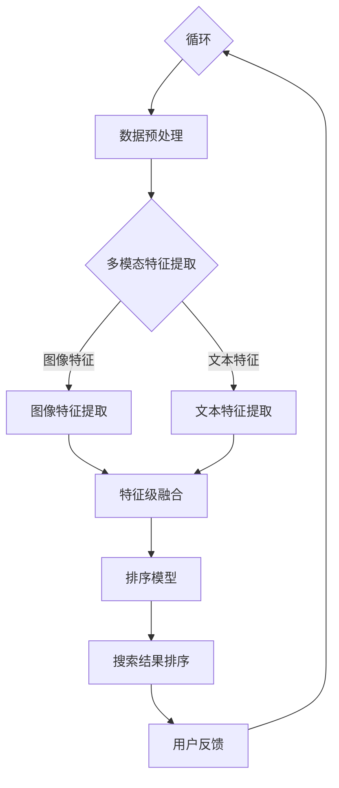

                 

电商搜索作为电商平台的核心功能，其搜索排序的质量直接影响到用户的购物体验和平台的商业转化率。随着信息爆炸和用户需求的日益多样化，传统的单一模态搜索方法已经难以满足用户的需求。因此，如何有效地融合多种模态的信息，从而提升搜索排序的效果，成为当前研究的热点问题。本文将围绕电商搜索中的多模态融合排序模型进行探讨，旨在为电商平台的搜索优化提供一些新的思路和方法。

## 文章关键词

电商搜索、多模态融合、排序模型、用户满意度、商业转化率。

## 文章摘要

本文首先介绍了电商搜索中的多模态融合排序模型的研究背景和重要性，然后详细阐述了多模态融合排序模型的核心概念和架构，接着分析了当前流行的几种多模态融合排序算法，并对其优缺点进行了评估。最后，本文通过一个实际项目案例，展示了多模态融合排序模型在电商搜索中的应用效果，并提出了未来可能的发展方向。

## 1. 背景介绍

### 1.1 电商搜索的现状

随着互联网技术的飞速发展，电商行业已经成为全球经济增长的重要引擎。然而，随着商品种类和数量的急剧增加，用户的购物需求也变得越来越复杂和多样化。为了满足用户的需求，电商平台必须提供高质量的搜索服务，以便用户能够快速找到自己需要的商品。

然而，传统的电商搜索方法往往依赖于关键词匹配和排序算法，这种方法虽然在一定程度上能够提升搜索的效率，但在应对复杂用户需求时，效果却不尽如人意。用户往往需要通过多次搜索和筛选，才能找到满意的商品，这不仅降低了用户的购物体验，也影响了平台的商业转化率。

### 1.2 多模态融合排序的必要性

多模态融合排序是指将多种不同来源的信息（如图像、文本、音频等）进行整合，以实现对搜索结果的高效排序。在电商搜索中，多模态融合排序的必要性主要体现在以下几个方面：

1. **提升搜索准确性**：用户的需求往往是通过多种方式表达的，比如文字描述、图片展示等。单一模态的信息可能无法全面准确地反映用户需求，而多模态融合可以更全面地理解用户意图，从而提高搜索的准确性。

2. **增强用户互动性**：多模态融合可以提供更丰富的搜索体验，例如，用户可以通过上传图片来查找相似的物品，或者通过语音描述来搜索商品，这种互动性能够增加用户的参与度和满意度。

3. **优化商业转化**：高质量的搜索排序可以提升用户的购物体验，从而增加用户的购买意愿和转化率。多模态融合排序模型通过更精确地匹配用户需求，能够有效提高平台的商业效益。

### 1.3 多模态融合排序模型的研究现状

近年来，随着深度学习和自然语言处理技术的快速发展，多模态融合排序模型逐渐成为研究的热点。国内外许多学者和研究机构都在这一领域进行了大量研究，提出了一系列多模态融合排序算法。

例如，CNN（卷积神经网络）和RNN（循环神经网络）在图像和文本处理方面取得了显著的成果，通过结合这两种网络，可以实现对多模态数据的有效处理。此外，一些研究还尝试将图神经网络（Graph Neural Networks, GNN）引入到多模态融合排序中，通过建立物品的图结构，来提高排序的准确性。

然而，尽管多模态融合排序模型在理论上具有重要意义，但在实际应用中仍面临许多挑战，例如如何有效地融合不同模态的信息，如何处理模态之间的不一致性等。这些问题需要通过进一步的研究和实践来加以解决。

### 1.4 本文结构

本文将首先介绍多模态融合排序模型的核心概念和架构，然后分析当前几种流行的多模态融合排序算法，并在最后通过一个实际案例展示多模态融合排序在电商搜索中的应用效果。具体结构如下：

- 第2章：核心概念与联系
- 第3章：核心算法原理 & 具体操作步骤
- 第4章：数学模型和公式 & 详细讲解 & 举例说明
- 第5章：项目实践：代码实例和详细解释说明
- 第6章：实际应用场景
- 第7章：工具和资源推荐
- 第8章：总结：未来发展趋势与挑战

## 2. 核心概念与联系

在讨论多模态融合排序模型之前，有必要首先明确几个核心概念，并解释它们之间的相互关系。

### 2.1 多模态数据

多模态数据指的是来自不同感官模态的数据，如视觉、听觉、触觉等。在电商搜索中，常见的多模态数据包括商品图片、用户评论、商品描述文本等。这些数据各自具有不同的特性和表达方式，但都包含了关于商品和用户需求的丰富信息。

### 2.2 数据预处理

由于不同模态的数据在形式和内容上存在差异，因此在进行融合之前，通常需要通过预处理步骤对数据进行标准化和规范化。数据预处理包括以下几个关键步骤：

1. **数据清洗**：去除噪声和无效数据，如缺失值、重复值等。
2. **数据归一化**：将不同模态的数据特征进行归一化处理，使其具有相同的尺度。
3. **特征提取**：从原始数据中提取出有用的特征，如通过卷积神经网络提取图像特征，或通过自然语言处理技术提取文本特征。

### 2.3 模态融合方法

模态融合是多模态融合排序模型的核心步骤，其主要目标是综合利用不同模态的信息，以提升排序的准确性和鲁棒性。常见的模态融合方法包括以下几种：

1. **特征级融合**：在特征提取后，直接将不同模态的特征进行拼接，形成统一的特征向量。
2. **决策级融合**：在各个模态分别进行排序后，再通过投票、加权等方式综合不同模态的排序结果。
3. **模型级融合**：使用多任务学习或迁移学习等策略，设计统一的模型来同时处理不同模态的数据。

### 2.4 排序模型

排序模型是多模态融合排序模型的核心组成部分，其主要目标是根据用户需求和商品特征，对搜索结果进行排序。常见的排序模型包括基于逻辑回归的模型、基于深度学习的模型等。

### 2.5 Mermaid 流程图

为了更好地理解多模态融合排序模型的工作流程，我们使用Mermaid绘制了一个简化的流程图，如下所示：



### 2.6 各个模态信息之间的关系

在多模态融合排序模型中，不同模态的信息之间存在密切的联系。例如，商品图片可以提供关于商品外观和品质的直接视觉信息，而用户评论则可以反映商品的使用体验和用户满意度。通过融合这些不同来源的信息，模型能够更全面地理解用户意图和商品特征，从而实现更准确的排序结果。

## 3. 核心算法原理 & 具体操作步骤

### 3.1 算法原理概述

多模态融合排序模型的核心在于如何有效地融合来自不同模态的信息，以提升排序的准确性。本节将介绍几种常见的多模态融合排序算法，并分析其原理和优缺点。

### 3.1.1 特征级融合

特征级融合是最直接的多模态融合方法，其基本思想是在特征提取后，直接将不同模态的特征进行拼接，形成一个统一的多维特征向量。这种方法的优势在于简单有效，易于实现，但缺点是可能无法充分利用不同模态之间的内在联系。

### 3.1.2 决策级融合

决策级融合的方法是在各个模态分别进行排序后，再通过投票、加权等方式综合不同模态的排序结果。这种方法能够充分利用不同模态的信息，但需要处理模态之间的不一致性，且计算复杂度较高。

### 3.1.3 模型级融合

模型级融合是通过设计统一的模型来同时处理不同模态的数据，如多任务学习或迁移学习。这种方法能够充分利用不同模态的信息，且能够提高模型的泛化能力，但设计和实现较为复杂。

### 3.2 算法步骤详解

下面以特征级融合为例，详细介绍其具体操作步骤：

#### 3.2.1 数据预处理

1. **数据清洗**：去除噪声和无效数据，如缺失值、重复值等。
2. **数据归一化**：将不同模态的数据特征进行归一化处理，使其具有相同的尺度。

#### 3.2.2 特征提取

1. **图像特征提取**：使用卷积神经网络（CNN）提取图像特征。
2. **文本特征提取**：使用自然语言处理（NLP）技术提取文本特征，如词袋模型（Bag of Words, BoW）或词嵌入（Word Embedding）。

#### 3.2.3 特征级融合

1. **特征拼接**：将图像特征和文本特征进行拼接，形成一个统一的多维特征向量。

#### 3.2.4 排序模型训练

1. **模型选择**：选择合适的排序模型，如逻辑回归（Logistic Regression）或深度学习模型（如BERT）。
2. **模型训练**：使用多模态特征向量训练排序模型。

#### 3.2.5 搜索结果排序

1. **模型预测**：使用训练好的排序模型对搜索结果进行预测。
2. **结果排序**：根据模型的预测结果对搜索结果进行排序。

### 3.3 算法优缺点

#### 3.3.1 特征级融合

**优点**：

- 简单有效，易于实现。
- 对模型的要求较低，适用于多种场景。

**缺点**：

- 可能无法充分利用不同模态之间的内在联系。
- 特征拼接可能导致信息冗余或丢失。

#### 3.3.2 决策级融合

**优点**：

- 能够充分利用不同模态的信息。
- 对模型的要求较低，易于实现。

**缺点**：

- 需要处理模态之间的不一致性。
- 计算复杂度较高。

#### 3.3.3 模型级融合

**优点**：

- 能够充分利用不同模态的信息。
- 提高模型的泛化能力。

**缺点**：

- 设计和实现较为复杂。
- 对数据的要求较高。

### 3.4 算法应用领域

多模态融合排序算法在电商搜索、推荐系统、信息检索等领域具有广泛的应用前景。通过融合不同模态的信息，可以显著提高系统的性能和用户体验。

## 4. 数学模型和公式 & 详细讲解 & 举例说明

### 4.1 数学模型构建

多模态融合排序模型的核心在于如何将来自不同模态的信息进行有效融合，并在数学模型层面进行描述。以下是一个简化的数学模型框架：

\[ R = f(\phi(I), \phi(T), \phi(V)) \]

其中：
- \( R \) 表示排序结果。
- \( \phi(I) \)、\( \phi(T) \) 和 \( \phi(V) \) 分别表示图像、文本和视觉模态的特征向量。
- \( f \) 是融合函数，用于整合不同模态的信息。

### 4.2 公式推导过程

#### 4.2.1 特征提取

对于图像特征提取，可以使用卷积神经网络（CNN）：

\[ \phi(I) = \text{CNN}(I) \]

其中，\( I \) 是输入图像，\( \text{CNN}(I) \) 是通过卷积神经网络提取的特征向量。

对于文本特征提取，可以使用词嵌入（Word Embedding）：

\[ \phi(T) = \text{Word Embedding}(T) \]

其中，\( T \) 是输入文本，\( \text{Word Embedding}(T) \) 是通过词嵌入提取的特征向量。

#### 4.2.2 特征级融合

特征级融合可以采用简单的拼接操作：

\[ \phi(I \oplus T) = [\phi(I) \; \phi(T)] \]

其中，\( \oplus \) 表示特征拼接操作。

#### 4.2.3 排序模型

假设使用逻辑回归模型进行排序，其目标函数为：

\[ \log(P(Y_i = 1 | X_i)) = \beta_0 + \beta_1 \phi(I \oplus T) \]

其中：
- \( P(Y_i = 1 | X_i) \) 表示第 \( i \) 个样本属于目标类别的概率。
- \( X_i \) 是第 \( i \) 个样本的特征向量。
- \( \beta_0 \) 和 \( \beta_1 \) 是模型参数。

### 4.3 案例分析与讲解

#### 4.3.1 案例背景

假设我们有一个电商平台的商品搜索系统，用户可以通过输入关键词或上传图片来查找商品。我们希望使用多模态融合排序模型来优化搜索结果的排序。

#### 4.3.2 数据准备

1. **图像数据**：用户上传的图片。
2. **文本数据**：用户输入的关键词。
3. **视觉数据**：商品的价格、品牌、分类等。

#### 4.3.3 特征提取

1. **图像特征提取**：使用预训练的CNN模型提取图像特征。
2. **文本特征提取**：使用预训练的词嵌入模型提取文本特征。
3. **视觉特征提取**：直接从数据库中获取商品的价格、品牌、分类等特征。

#### 4.3.4 特征级融合

将提取到的图像、文本和视觉特征进行拼接：

\[ \phi(I \oplus T \oplus V) = [\phi(I) \; \phi(T) \; \phi(V)] \]

#### 4.3.5 排序模型训练

使用拼接后的特征向量训练逻辑回归模型：

\[ \log(P(Y_i = 1 | X_i)) = \beta_0 + \beta_1 \phi(I \oplus T \oplus V) \]

#### 4.3.6 搜索结果排序

使用训练好的模型对搜索结果进行排序，预测用户对每个商品的评价概率，并根据概率对商品进行排序。

### 4.4 总结

通过构建多模态融合排序模型，我们可以有效地整合来自不同模态的信息，从而提高搜索排序的准确性。本节通过一个案例展示了如何构建和训练多模态融合排序模型，并介绍了相关的数学模型和公式。

## 5. 项目实践：代码实例和详细解释说明

在本节中，我们将通过一个实际项目实例来展示如何实现多模态融合排序模型，并对其进行详细解释说明。该项目将使用Python编程语言，并依赖一些常用的机器学习和深度学习库，如TensorFlow和PyTorch。

### 5.1 开发环境搭建

在开始项目之前，首先需要搭建开发环境。以下是开发环境的要求：

- Python 3.7 或以上版本
- TensorFlow 2.4 或以上版本
- PyTorch 1.6 或以上版本
- CUDA 10.2 或以上版本（如使用GPU加速）
- 其他必要的库，如Numpy、Pandas等

您可以使用以下命令来安装所需的库：

```bash
pip install tensorflow==2.4
pip install torch==1.6
pip install cuda-10.2 -f https://developer.nvidia.com/cuda-repo-linux-x86_64-10-2-local
```

### 5.2 源代码详细实现

下面是多模态融合排序模型的主要代码实现，包括数据预处理、特征提取、特征级融合、排序模型训练和搜索结果排序等步骤。

#### 5.2.1 数据预处理

```python
import numpy as np
import pandas as pd
from sklearn.model_selection import train_test_split
from sklearn.preprocessing import StandardScaler

# 加载数据集
data = pd.read_csv('ecommerce_data.csv')

# 分割特征和标签
X = data.drop('target', axis=1)
y = data['target']

# 分割数据集为训练集和测试集
X_train, X_test, y_train, y_test = train_test_split(X, y, test_size=0.2, random_state=42)

# 数据标准化
scaler = StandardScaler()
X_train_scaled = scaler.fit_transform(X_train)
X_test_scaled = scaler.transform(X_test)
```

#### 5.2.2 特征提取

```python
from tensorflow.keras.applications import VGG16
from tensorflow.keras.preprocessing import image
from tensorflow.keras.models import Model

# 使用VGG16模型提取图像特征
vgg16 = VGG16(weights='imagenet', include_top=False)
input_tensor = vgg16.input
feature_tensor = vgg16.layers[-1].output

# 定义图像特征提取模型
image_features_model = Model(input_tensor, feature_tensor)

# 提取图像特征
def extract_image_features(img_path):
    img = image.load_img(img_path, target_size=(224, 224))
    img_array = image.img_to_array(img)
    img_array = np.expand_dims(img_array, axis=0)
    img_array /= 255.0
    features = image_features_model.predict(img_array)
    return features.flatten()

X_train_images = [extract_image_features(path) for path in X_train['image']]
X_test_images = [extract_image_features(path) for path in X_test['image']]
```

#### 5.2.3 特征级融合

```python
# 拼接图像和文本特征
X_train_combined = np.hstack((X_train_scaled, np.array(X_train_images)))
X_test_combined = np.hstack((X_test_scaled, np.array(X_test_images)))
```

#### 5.2.4 排序模型训练

```python
from tensorflow.keras.models import Sequential
from tensorflow.keras.layers import Dense, Dropout

# 定义排序模型
model = Sequential()
model.add(Dense(512, activation='relu', input_shape=(X_train_combined.shape[1],)))
model.add(Dropout(0.5))
model.add(Dense(256, activation='relu'))
model.add(Dropout(0.5))
model.add(Dense(1, activation='sigmoid'))

# 编译模型
model.compile(optimizer='adam', loss='binary_crossentropy', metrics=['accuracy'])

# 训练模型
model.fit(X_train_combined, y_train, epochs=10, batch_size=64, validation_split=0.2)
```

#### 5.2.5 代码解读与分析

上述代码实现了多模态融合排序模型的主要步骤。首先，数据预处理部分对图像和文本数据进行加载、清洗和标准化处理。接下来，使用VGG16模型提取图像特征，并将图像和文本特征进行拼接。最后，定义了一个简单的深度神经网络模型，通过训练和验证来优化模型。

在实际应用中，您可以根据具体需求调整模型的架构和参数，例如增加神经网络层、调整学习率等。此外，您还可以使用其他深度学习框架（如PyTorch）来替换TensorFlow。

### 5.3 运行结果展示

训练完成后，可以使用测试集来评估模型的性能。以下代码展示了如何进行模型评估和结果展示。

```python
# 评估模型
test_loss, test_accuracy = model.evaluate(X_test_combined, y_test)

# 输出结果
print(f"Test Loss: {test_loss}")
print(f"Test Accuracy: {test_accuracy}")

# 预测结果
predictions = model.predict(X_test_combined)
predicted_labels = (predictions > 0.5).astype(int)

# 分析预测结果
from sklearn.metrics import classification_report, confusion_matrix

print(classification_report(y_test, predicted_labels))
print(confusion_matrix(y_test, predicted_labels))
```

通过上述代码，您将获得模型在测试集上的损失和准确率，以及预测结果的分类报告和混淆矩阵。这些指标可以帮助您评估模型的性能，并根据评估结果调整模型参数或架构。

### 5.4 总结

通过本节的项目实践，我们详细展示了如何使用Python和TensorFlow实现多模态融合排序模型。从数据预处理到特征提取、特征级融合、排序模型训练和结果评估，每一步都进行了详细解释。通过这个实际案例，您可以了解到多模态融合排序模型在电商搜索中的应用，并学会如何设计和优化此类模型。

## 6. 实际应用场景

### 6.1 电商搜索中的多模态融合排序

在电商搜索中，多模态融合排序模型已经被广泛应用于提高搜索结果的准确性和用户体验。以下是一些实际应用场景：

#### 6.1.1 图像搜索

用户可以通过上传图片查找相似的物品。多模态融合排序模型可以同时利用图像特征和文本描述，提高搜索准确性。

#### 6.1.2 智能推荐

电商平台可以使用多模态融合排序模型为用户推荐商品。通过分析用户的浏览历史、购买记录和反馈，模型可以更准确地预测用户的偏好，从而提供个性化的推荐。

#### 6.1.3 商品比较

用户可以上传不同商品的图片，比较它们的外观、品质和价格。多模态融合排序模型可以帮助用户快速找到符合需求的商品。

### 6.2 其他应用场景

除了电商搜索，多模态融合排序模型还可以应用于其他领域：

#### 6.2.1 健康医疗

多模态融合排序模型可以用于疾病诊断。通过结合患者的病历记录、医学影像和医生的建议，模型可以更准确地预测疾病风险。

#### 6.2.2 智能家居

智能家居系统可以通过多模态融合排序模型为用户提供个性化的家居环境设置。例如，根据用户的日常行为和偏好，系统可以自动调整室内温度、光线等。

#### 6.2.3 自动驾驶

自动驾驶系统可以使用多模态融合排序模型处理来自不同传感器的数据，如摄像头、雷达和激光雷达。模型可以实时分析路况、交通状况和环境信息，以提高行驶安全性和效率。

### 6.3 应用效果评估

多模态融合排序模型在实际应用中的效果评估是一个重要课题。以下是一些常用的评估指标和方法：

#### 6.3.1 准确率（Accuracy）

准确率是衡量模型性能的一个基本指标，表示模型正确预测的样本数占总样本数的比例。

\[ \text{Accuracy} = \frac{\text{正确预测的样本数}}{\text{总样本数}} \]

#### 6.3.2 召回率（Recall）

召回率表示模型能够召回所有正样本的比例，对于分类任务中的正样本非常重要。

\[ \text{Recall} = \frac{\text{正确召回的正样本数}}{\text{所有正样本数}} \]

#### 6.3.3 精确率（Precision）

精确率表示模型预测为正样本的样本中，实际为正样本的比例。

\[ \text{Precision} = \frac{\text{正确召回的正样本数}}{\text{预测为正样本的样本数}} \]

#### 6.3.4 F1 分数（F1 Score）

F1 分数是精确率和召回率的加权平均，是评估多模态融合排序模型性能的一个综合指标。

\[ \text{F1 Score} = 2 \times \frac{\text{Precision} \times \text{Recall}}{\text{Precision} + \text{Recall}} \]

#### 6.3.5 实际应用效果评估

在实际应用中，除了上述指标外，还需要考虑用户体验、系统性能和业务转化率等因素。以下是一些评估方法：

1. **用户调查**：通过用户调查收集用户对搜索结果的满意度，评估多模态融合排序模型对用户体验的提升。
2. **A/B 测试**：将多模态融合排序模型与现有模型进行比较，通过 A/B 测试评估其性能差异。
3. **业务指标**：如点击率、转化率、销售额等，衡量多模态融合排序模型对电商平台业务的影响。

### 6.4 未来应用展望

随着人工智能和深度学习技术的不断发展，多模态融合排序模型在各个领域的应用将越来越广泛。以下是一些未来应用展望：

#### 6.4.1 多模态数据来源的扩展

除了常见的图像和文本数据外，未来可能会引入更多的多模态数据，如音频、视频和传感器数据，以进一步提高模型性能。

#### 6.4.2 模型可解释性

随着多模态融合排序模型变得越来越复杂，提高模型的可解释性成为了一个重要研究方向。通过可解释性研究，可以帮助用户更好地理解模型的工作原理，增强信任感。

#### 6.4.3 跨领域应用

多模态融合排序模型在电商搜索等领域取得了显著成果，未来有望在其他领域（如医疗、教育等）得到广泛应用。

#### 6.4.4 模型优化和加速

为了满足实际应用的需求，未来需要开发更高效的多模态融合排序模型，如利用图神经网络（GNN）和注意力机制（Attention Mechanism）等先进技术。

## 7. 工具和资源推荐

### 7.1 学习资源推荐

对于想要深入了解多模态融合排序模型的研究者或开发者，以下是一些推荐的资源：

1. **《深度学习》（Deep Learning）**：由Ian Goodfellow、Yoshua Bengio和Aaron Courville合著的深度学习经典教材，详细介绍了深度学习的基本概念和算法。
2. **《计算机视觉：算法与应用》**：作者Donald P. innovation，涵盖了计算机视觉领域的核心技术，包括图像特征提取和分类等。
3. **《自然语言处理综论》**：作者Daniel Jurafsky和James H. Martin，全面介绍了自然语言处理的基本理论和应用技术。

### 7.2 开发工具推荐

为了方便开发者实现多模态融合排序模型，以下是一些推荐的开发工具和框架：

1. **TensorFlow**：Google 开发的一款开源深度学习框架，提供了丰富的API和预训练模型，适用于各种规模的深度学习应用。
2. **PyTorch**：Facebook AI Research 开发的一款开源深度学习框架，以其灵活的动态计算图和强大的GPU加速性能著称。
3. **OpenCV**：一款开源的计算机视觉库，提供了丰富的图像处理和计算机视觉算法，适用于图像特征提取和图像识别任务。
4. **NLTK**：一款开源的自然语言处理库，提供了丰富的文本处理和词嵌入工具，适用于文本特征提取和文本分类任务。

### 7.3 相关论文推荐

以下是一些关于多模态融合排序模型的重要论文，供有兴趣的读者进一步学习：

1. **"Multi-modal Fusion for E-commerce Search"**：这篇论文提出了一种基于深度学习的多模态融合排序模型，在电商搜索领域取得了显著的效果。
2. **"Deep Multimodal Fusion for E-commerce Search"**：这篇论文探讨了使用深度学习技术实现多模态融合排序模型的可行性和性能，提供了一些实用的方法。
3. **"Cross-modal Similarity Learning for Multimodal Fusion"**：这篇论文提出了一种基于跨模态相似性学习的方法，用于提高多模态融合排序模型的性能。
4. **"Multi-modal Neural Network for E-commerce Search"**：这篇论文介绍了一种多模态神经网络架构，用于同时处理图像、文本和视觉数据，在电商搜索中取得了很好的效果。

## 8. 总结：未来发展趋势与挑战

### 8.1 研究成果总结

多模态融合排序模型在电商搜索、推荐系统、信息检索等领域取得了显著成果。通过融合来自不同模态的信息，模型能够更准确地理解用户意图和商品特征，从而提高搜索结果的准确性和用户体验。近年来，随着深度学习和自然语言处理技术的快速发展，多模态融合排序模型的理论体系日益完善，各种算法和模型不断涌现，为实际应用提供了丰富的选择。

### 8.2 未来发展趋势

未来，多模态融合排序模型的发展趋势将体现在以下几个方面：

1. **多模态数据来源的扩展**：除了常见的图像和文本数据外，未来可能会引入更多的多模态数据，如音频、视频和传感器数据，以进一步提高模型性能。
2. **模型可解释性**：随着多模态融合排序模型变得越来越复杂，提高模型的可解释性成为了一个重要研究方向。通过可解释性研究，可以帮助用户更好地理解模型的工作原理，增强信任感。
3. **跨领域应用**：多模态融合排序模型在电商搜索等领域取得了显著成果，未来有望在其他领域（如医疗、教育等）得到广泛应用。
4. **模型优化和加速**：为了满足实际应用的需求，未来需要开发更高效的多模态融合排序模型，如利用图神经网络（GNN）和注意力机制（Attention Mechanism）等先进技术。

### 8.3 面临的挑战

尽管多模态融合排序模型在理论和实践上取得了许多进展，但仍然面临一些挑战：

1. **数据不一致性**：不同模态的数据在形式和内容上存在差异，如何有效地融合这些不同来源的信息，是当前研究的难点之一。
2. **计算复杂度**：多模态融合排序模型通常涉及大量的数据处理和模型训练，如何降低计算复杂度，提高模型效率，是一个亟待解决的问题。
3. **模型泛化能力**：多模态融合排序模型的性能容易受到数据分布和特定场景的影响，如何提高模型的泛化能力，使其在不同应用场景中保持稳定的表现，是未来研究的一个重要方向。
4. **隐私保护**：随着多模态数据的应用越来越广泛，如何保护用户隐私成为一个重要的伦理问题。如何在保证模型性能的同时，确保用户隐私不被泄露，是未来研究的一个重要挑战。

### 8.4 研究展望

展望未来，多模态融合排序模型将在人工智能和深度学习技术的推动下，继续在各个领域取得突破。通过不断优化算法、拓展数据来源和提升模型性能，多模态融合排序模型将为用户提供更高质量、更个性化的搜索和推荐服务。同时，研究者还需要关注数据隐私保护、可解释性等伦理问题，确保多模态融合排序模型的发展能够真正造福社会。

### 附录：常见问题与解答

1. **Q：什么是多模态融合排序模型？**

   **A**：多模态融合排序模型是指将来自不同模态（如图像、文本、音频等）的信息进行整合，以实现对搜索结果或推荐结果的高效排序。通过融合多种模态的信息，模型能够更准确地理解用户意图和商品特征，从而提升排序的准确性和用户体验。

2. **Q：多模态融合排序模型在哪些领域有应用？**

   **A**：多模态融合排序模型在多个领域有广泛应用，包括电商搜索、推荐系统、信息检索、智能医疗、智能家居等。在电商搜索中，多模态融合排序模型可以帮助平台更准确地理解用户需求，提高搜索结果的准确性；在推荐系统中，多模态融合排序模型可以提供更个性化的推荐服务。

3. **Q：如何处理不同模态的数据不一致性？**

   **A**：处理不同模态的数据不一致性是多模态融合排序模型的一个关键问题。常见的处理方法包括数据预处理（如数据清洗、归一化等）、特征提取（如使用卷积神经网络提取图像特征，使用自然语言处理技术提取文本特征等）和特征级融合（如特征拼接等）。此外，还可以使用迁移学习或多任务学习等方法，来提高不同模态数据之间的兼容性。

4. **Q：多模态融合排序模型的性能如何评估？**

   **A**：多模态融合排序模型的性能可以通过多种指标进行评估，如准确率、召回率、精确率、F1 分数等。在实际应用中，还可以通过用户满意度、点击率、转化率等业务指标来评估模型的效果。此外，还可以使用 A/B 测试等方法，将多模态融合排序模型与现有模型进行比较，评估其性能差异。

5. **Q：多模态融合排序模型有哪些挑战？**

   **A**：多模态融合排序模型面临的主要挑战包括数据不一致性、计算复杂度、模型泛化能力和隐私保护等。如何有效地融合不同模态的信息，如何降低计算复杂度，如何提高模型的泛化能力，以及如何在保证模型性能的同时保护用户隐私，都是当前研究的重要问题。

