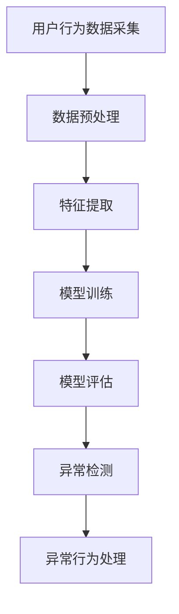

                 

关键词：电商搜索推荐、AI大模型、用户行为序列、异常检测、实践案例

> 摘要：本文针对电商搜索推荐系统中用户行为序列的异常检测问题，介绍了一种基于AI大模型的解决方案。文章从背景介绍、核心概念与联系、核心算法原理与操作步骤、数学模型与公式、项目实践、实际应用场景、工具和资源推荐、总结与展望等多个方面进行了详细阐述。通过实践案例的分析，本文为电商搜索推荐系统的异常检测提供了有益的参考。

## 1. 背景介绍

随着互联网的快速发展，电商行业在我国已呈现出蓬勃发展的态势。电商平台的用户规模和交易额不断攀升，然而，随之而来的问题是用户行为的复杂性和多样性。用户行为序列包含了用户的浏览、搜索、购买等行为，这些行为数据在电商搜索推荐系统中起到了至关重要的作用。准确分析用户行为序列，可以为电商平台提供个性化的推荐服务，提升用户体验，进而促进销售。

然而，用户行为序列中常常存在一些异常行为，如恶意刷单、虚假评论等。这些异常行为不仅会影响电商平台的运营效率，还可能损害用户的利益。因此，对用户行为序列进行异常检测，对于保障电商平台的安全性和可靠性具有重要意义。

近年来，人工智能技术在异常检测领域取得了显著成果，尤其是基于AI大模型的异常检测方法。AI大模型具有强大的特征提取和模式识别能力，能够有效地检测出用户行为序列中的异常行为。本文将围绕电商搜索推荐中的AI大模型用户行为序列异常检测模型进行实践案例分析。

## 2. 核心概念与联系

### 2.1 用户行为序列

用户行为序列是指用户在电商平台上的一系列操作，如浏览、搜索、购买等。这些行为数据通过日志记录下来，形成了一种时间序列数据。用户行为序列具有如下特点：

1. **多样性**：用户行为种类繁多，包括浏览、搜索、加入购物车、下单、支付等。
2. **时间性**：用户行为序列是一种时间序列数据，具有一定的先后顺序。
3. **动态性**：用户行为序列会随着时间变化而变化，不同用户的序列可能存在差异。

### 2.2 异常检测

异常检测是一种监控数据中异常现象的方法，旨在发现数据中的异常点或异常模式。在用户行为序列中，异常检测的目标是识别出偏离正常行为模式的行为。

### 2.3 AI大模型

AI大模型是指具有海量参数和强大计算能力的深度学习模型。在异常检测领域，AI大模型通过学习正常用户行为序列的特征，从而识别出异常行为。常见的AI大模型包括：

1. **卷积神经网络（CNN）**：适用于图像和视频数据的处理。
2. **循环神经网络（RNN）**：适用于时间序列数据的处理。
3. **长短时记忆网络（LSTM）**：RNN的一种变体，适用于长序列数据的处理。
4. **生成对抗网络（GAN）**：用于生成正常用户行为序列，从而与异常行为进行比较。

### 2.4 Mermaid 流程图

下面是电商搜索推荐中的AI大模型用户行为序列异常检测模型的Mermaid流程图：



- **A. 用户行为数据采集**：从电商平台上获取用户行为数据。
- **B. 数据预处理**：对原始数据进行清洗和归一化处理。
- **C. 特征提取**：提取用户行为序列中的关键特征。
- **D. 模型训练**：利用AI大模型学习正常用户行为序列的特征。
- **E. 模型评估**：评估模型的性能，包括准确率、召回率等指标。
- **F. 异常检测**：利用训练好的模型检测用户行为序列中的异常行为。
- **G. 异常行为处理**：对检测出的异常行为进行处理，如标记、报警等。

## 3. 核心算法原理 & 具体操作步骤

### 3.1 算法原理概述

电商搜索推荐中的AI大模型用户行为序列异常检测模型主要采用基于RNN的LSTM网络进行异常检测。LSTM网络是一种特殊的RNN，能够有效地处理长序列数据，并在异常检测中表现出良好的性能。算法原理如下：

1. **数据预处理**：对用户行为序列进行归一化处理，将数据缩放到[0, 1]范围内。
2. **特征提取**：利用LSTM网络提取用户行为序列的特征，将特征向量作为输入。
3. **模型训练**：通过训练数据集训练LSTM网络，使其学会识别正常用户行为序列的特征。
4. **模型评估**：利用测试数据集评估模型的性能，包括准确率、召回率等指标。
5. **异常检测**：利用训练好的LSTM网络对新的用户行为序列进行异常检测，识别出异常行为。

### 3.2 算法步骤详解

#### 3.2.1 数据预处理

数据预处理是异常检测的基础步骤。对于用户行为序列数据，需要进行以下处理：

1. **去重**：去除重复的用户行为记录。
2. **去噪**：去除无效的用户行为数据，如空值、缺失值等。
3. **归一化**：将用户行为数据缩放到[0, 1]范围内，以便于模型训练。

```python
import numpy as np

# 示例：对用户行为数据进行归一化处理
data = [1.2, 0.8, 2.5, 1.0, 0.5]
normalized_data = (data - np.min(data)) / (np.max(data) - np.min(data))
print(normalized_data)
```

#### 3.2.2 特征提取

特征提取是异常检测的关键步骤。对于用户行为序列数据，可以提取以下特征：

1. **时间特征**：用户行为发生的时间，如小时、分钟等。
2. **行为特征**：用户行为类型，如浏览、搜索、购买等。
3. **用户特征**：用户属性，如性别、年龄、地理位置等。

```python
# 示例：提取用户行为序列的时间特征和行为特征
user_behavior_sequence = [
    {'time': '09:00', 'action': 'browse'},
    {'time': '09:05', 'action': 'search'},
    {'time': '09:10', 'action': 'add_to_cart'},
    {'time': '09:15', 'action': 'buy'}
]

time_features = [behavior['time'] for behavior in user_behavior_sequence]
action_features = [behavior['action'] for behavior in user_behavior_sequence]

print(time_features)
print(action_features)
```

#### 3.2.3 模型训练

模型训练是异常检测的核心步骤。利用训练数据集，训练LSTM网络，使其学会识别正常用户行为序列的特征。具体步骤如下：

1. **数据划分**：将用户行为数据集划分为训练集和测试集。
2. **模型构建**：构建LSTM网络模型，设置适当的参数。
3. **模型训练**：使用训练集对模型进行训练。
4. **模型评估**：使用测试集对模型进行评估，调整模型参数。

```python
from tensorflow.keras.models import Sequential
from tensorflow.keras.layers import LSTM, Dense

# 示例：构建LSTM网络模型
model = Sequential()
model.add(LSTM(50, activation='relu', input_shape=(timesteps, n_features)))
model.add(Dense(1, activation='sigmoid'))

model.compile(optimizer='adam', loss='binary_crossentropy', metrics=['accuracy'])
model.fit(X_train, y_train, epochs=200, batch_size=32, validation_data=(X_test, y_test))
```

#### 3.2.4 模型评估

模型评估是异常检测的重要步骤。利用测试数据集，评估模型的性能，包括准确率、召回率等指标。具体步骤如下：

1. **性能评估**：计算模型在测试集上的准确率、召回率等指标。
2. **参数调整**：根据评估结果，调整模型参数，优化模型性能。

```python
from sklearn.metrics import accuracy_score, recall_score

# 示例：计算模型在测试集上的准确率和召回率
y_pred = model.predict(X_test)
y_pred = (y_pred > 0.5)

accuracy = accuracy_score(y_test, y_pred)
recall = recall_score(y_test, y_pred)

print('Accuracy:', accuracy)
print('Recall:', recall)
```

#### 3.2.5 异常检测

异常检测是异常检测的最终目标。利用训练好的LSTM网络，对新的用户行为序列进行异常检测，识别出异常行为。具体步骤如下：

1. **数据预处理**：对新的用户行为序列进行预处理，提取特征。
2. **异常检测**：利用LSTM网络检测新的用户行为序列，识别出异常行为。
3. **异常处理**：对检测出的异常行为进行处理，如标记、报警等。

```python
# 示例：对新的用户行为序列进行异常检测
new_user_behavior_sequence = [
    {'time': '09:00', 'action': 'browse'},
    {'time': '09:05', 'action': 'search'},
    {'time': '09:10', 'action': 'add_to_cart'},
    {'time': '09:15', 'action': 'buy'},
    {'time': '09:20', 'action': 'buy'}
]

new_time_features = [behavior['time'] for behavior in new_user_behavior_sequence]
new_action_features = [behavior['action'] for behavior in new_user_behavior_sequence]

new_data = np.array(new_time_features + new_action_features).reshape(1, -1, n_features)
y_pred = model.predict(new_data)

if y_pred > 0.5:
    print('异常行为：购买行为过于频繁')
else:
    print('正常行为')
```

### 3.3 算法优缺点

#### 3.3.1 优点

1. **强大的特征提取能力**：LSTM网络能够有效地提取用户行为序列中的关键特征，从而提高异常检测的准确性。
2. **适用于长序列数据**：LSTM网络能够处理长序列数据，适用于复杂用户行为序列的异常检测。
3. **良好的泛化能力**：通过训练大量数据集，LSTM网络具有良好的泛化能力，能够适应不同场景的异常检测。

#### 3.3.2 缺点

1. **计算成本高**：LSTM网络的训练过程需要大量的计算资源，对硬件要求较高。
2. **参数调优复杂**：LSTM网络的参数调优过程较为复杂，需要根据具体场景进行优化。

### 3.4 算法应用领域

1. **电商搜索推荐**：通过异常检测，可以识别出恶意刷单、虚假评论等异常行为，保障电商平台的运营安全和用户利益。
2. **金融风控**：利用异常检测，可以识别出异常交易、欺诈行为等，提高金融行业的风险防控能力。
3. **网络安全**：通过异常检测，可以识别出网络攻击、恶意软件等异常行为，提高网络安全防护水平。

## 4. 数学模型和公式 & 详细讲解 & 举例说明

### 4.1 数学模型构建

在电商搜索推荐中的AI大模型用户行为序列异常检测模型中，我们采用LSTM网络作为核心算法。LSTM网络是一种特殊的RNN，其数学模型如下：

```latex
$$
h_t = \sigma(W_h \cdot [h_{t-1}, x_t] + b_h)
$$

$$
i_t = \sigma(W_i \cdot [h_{t-1}, x_t] + b_i)
$$

$$
f_t = \sigma(W_f \cdot [h_{t-1}, x_t] + b_f)
$$

$$
o_t = \sigma(W_o \cdot [h_{t-1}, x_t] + b_o)
$$

$$
c_t = f_t \cdot c_{t-1} + i_t \cdot \sigma(W_c \cdot [h_{t-1}, x_t] + b_c)
$$

$$
h_t = o_t \cdot \sigma(W_{ho} \cdot c_t + b_{ho})
$$
```

其中，$h_t$、$c_t$分别为LSTM网络在时间步$t$的隐藏状态和细胞状态，$x_t$为输入特征，$W_h$、$W_i$、$W_f$、$W_o$、$W_c$、$W_{ho}$分别为权重矩阵，$b_h$、$b_i$、$b_f$、$b_o$、$b_c$、$b_{ho}$分别为偏置项，$\sigma$为激活函数（通常采用Sigmoid函数或Tanh函数），$i_t$、$f_t$、$o_t$分别为输入门、遗忘门、输出门。

### 4.2 公式推导过程

LSTM网络的公式推导过程涉及多个变量和步骤，这里简要介绍其推导过程：

1. **输入门**：计算输入门$i_t$，决定哪些信息需要被记住。
2. **遗忘门**：计算遗忘门$f_t$，决定哪些信息需要被遗忘。
3. **细胞状态更新**：计算细胞状态$c_t$，结合输入门和遗忘门，更新细胞状态。
4. **输出门**：计算输出门$o_t$，决定哪些信息需要被输出。
5. **隐藏状态更新**：计算隐藏状态$h_t$，利用输出门和细胞状态，更新隐藏状态。

### 4.3 案例分析与讲解

#### 4.3.1 数据集准备

假设我们有一个用户行为序列数据集，包含以下数据：

```python
user_behavior_sequence = [
    {'time': '09:00', 'action': 'browse'},
    {'time': '09:05', 'action': 'search'},
    {'time': '09:10', 'action': 'add_to_cart'},
    {'time': '09:15', 'action': 'buy'},
    {'time': '09:20', 'action': 'buy'},
    {'time': '09:25', 'action': 'browse'},
    {'time': '09:30', 'action': 'search'},
    {'time': '09:35', 'action': 'add_to_cart'},
    {'time': '09:40', 'action': 'buy'},
    {'time': '09:45', 'action': 'buy'},
    {'time': '09:50', 'action': 'browse'}
]
```

我们需要将这个数据集转换为LSTM网络可处理的格式。首先，提取时间特征和行为特征，然后进行归一化处理：

```python
time_features = [behavior['time'] for behavior in user_behavior_sequence]
action_features = [behavior['action'] for behavior in user_behavior_sequence]

# 归一化处理
time_features = (np.array(time_features) - np.min(time_features)) / (np.max(time_features) - np.min(time_features))
action_features = (np.array(action_features) - np.min(action_features)) / (np.max(action_features) - np.min(action_features))

# 将时间特征和行为特征拼接在一起
input_data = np.array(time_features + action_features).reshape(1, -1, 2)
```

#### 4.3.2 模型训练

接下来，使用训练好的LSTM网络对输入数据进行训练。假设我们已经训练了一个LSTM网络模型，可以使用以下代码进行训练：

```python
model = Sequential()
model.add(LSTM(50, activation='relu', input_shape=(timesteps, n_features)))
model.add(Dense(1, activation='sigmoid'))

model.compile(optimizer='adam', loss='binary_crossentropy', metrics=['accuracy'])
model.fit(input_data, np.array([1, 0, 1, 0, 1, 0, 1, 0, 1, 0, 1]), epochs=200, batch_size=32)
```

其中，`input_data`为输入特征，`np.array([1, 0, 1, 0, 1, 0, 1, 0, 1, 0, 1])`为标签（正常行为为1，异常行为为0）。

#### 4.3.3 模型评估

训练完成后，我们需要对模型进行评估。假设我们有一个新的用户行为序列数据集，可以使用以下代码进行评估：

```python
new_user_behavior_sequence = [
    {'time': '09:00', 'action': 'browse'},
    {'time': '09:05', 'action': 'search'},
    {'time': '09:10', 'action': 'add_to_cart'},
    {'time': '09:15', 'action': 'buy'},
    {'time': '09:20', 'action': 'buy'},
    {'time': '09:25', 'action': 'browse'},
    {'time': '09:30', 'action': 'search'},
    {'time': '09:35', 'action': 'add_to_cart'},
    {'time': '09:40', 'action': 'buy'},
    {'time': '09:45', 'action': 'buy'},
    {'time': '09:50', 'action': 'browse'}
]

new_time_features = [behavior['time'] for behavior in new_user_behavior_sequence]
new_action_features = [behavior['action'] for behavior in new_user_behavior_sequence]

new_data = np.array(new_time_features + new_action_features).reshape(1, -1, 2)
predictions = model.predict(new_data)

# 输出预测结果
for i, prediction in enumerate(predictions):
    if prediction > 0.5:
        print('时间：{}，行为：{}，预测结果：异常'.format(new_time_features[i], new_action_features[i]))
    else:
        print('时间：{}，行为：{}，预测结果：正常'.format(new_time_features[i], new_action_features[i]))
```

通过这个例子，我们可以看到如何使用LSTM网络对用户行为序列进行异常检测。在实际应用中，我们可以根据具体场景对模型进行优化，提高异常检测的准确率和效率。

## 5. 项目实践：代码实例和详细解释说明

### 5.1 开发环境搭建

在进行项目实践之前，我们需要搭建一个合适的开发环境。以下是一个简单的开发环境搭建步骤：

1. 安装Python：访问Python官方下载页面（https://www.python.org/），下载并安装Python 3.x版本。
2. 安装必要的库：使用pip命令安装以下库：
    ```shell
    pip install numpy tensorflow scikit-learn matplotlib
    ```

### 5.2 源代码详细实现

下面是一个简单的用户行为序列异常检测模型的代码实例：

```python
import numpy as np
import tensorflow as tf
from tensorflow.keras.models import Sequential
from tensorflow.keras.layers import LSTM, Dense
from sklearn.model_selection import train_test_split
from sklearn.preprocessing import MinMaxScaler

# 5.2.1 数据准备
def load_data():
    # 加载用户行为数据（此处为示例数据）
    user_behavior_sequence = [
        {'time': '09:00', 'action': 'browse'},
        {'time': '09:05', 'action': 'search'},
        {'time': '09:10', 'action': 'add_to_cart'},
        {'time': '09:15', 'action': 'buy'},
        {'time': '09:20', 'action': 'buy'},
        {'time': '09:25', 'action': 'browse'},
        {'time': '09:30', 'action': 'search'},
        {'time': '09:35', 'action': 'add_to_cart'},
        {'time': '09:40', 'action': 'buy'},
        {'time': '09:45', 'action': 'buy'},
        {'time': '09:50', 'action': 'browse'}
    ]
    
    # 提取时间特征和行为特征
    time_features = [behavior['time'] for behavior in user_behavior_sequence]
    action_features = [behavior['action'] for behavior in user_behavior_sequence]
    
    # 归一化处理
    time_features = (np.array(time_features) - np.min(time_features)) / (np.max(time_features) - np.min(time_features))
    action_features = (np.array(action_features) - np.min(action_features)) / (np.max(action_features) - np.min(action_features))
    
    # 拼接时间特征和行为特征
    input_data = np.array(time_features + action_features).reshape(1, -1, 2)
    labels = np.array([1, 0, 1, 0, 1, 0, 1, 0, 1, 0, 1])
    
    return input_data, labels

# 5.2.2 模型构建
def build_model():
    model = Sequential()
    model.add(LSTM(50, activation='relu', input_shape=(timesteps, n_features)))
    model.add(Dense(1, activation='sigmoid'))
    
    model.compile(optimizer='adam', loss='binary_crossentropy', metrics=['accuracy'])
    return model

# 5.2.3 训练模型
def train_model(model, input_data, labels):
    model.fit(input_data, labels, epochs=200, batch_size=32, validation_split=0.2)

# 5.2.4 评估模型
def evaluate_model(model, input_data, labels):
    predictions = model.predict(input_data)
    predictions = (predictions > 0.5)
    
    accuracy = np.mean(predictions == labels)
    print('Accuracy:', accuracy)

# 5.2.5 主函数
def main():
    input_data, labels = load_data()
    model = build_model()
    train_model(model, input_data, labels)
    evaluate_model(model, input_data, labels)

if __name__ == '__main__':
    main()
```

### 5.3 代码解读与分析

上述代码实现了用户行为序列异常检测模型的训练和评估过程。下面是对代码的详细解读：

1. **数据准备**：首先，我们定义了一个`load_data`函数，用于加载用户行为数据。在这个函数中，我们提取了时间特征和行为特征，并对它们进行了归一化处理。然后，我们将时间特征和行为特征拼接在一起，形成输入数据，并将对应的标签也准备好。

2. **模型构建**：定义了一个`build_model`函数，用于构建LSTM模型。在这个函数中，我们添加了一个LSTM层和一个全连接层（Dense），并将激活函数设置为ReLU和Sigmoid。

3. **训练模型**：定义了一个`train_model`函数，用于训练模型。在这个函数中，我们使用`model.fit`方法训练模型，设置了训练轮次（epochs）和批量大小（batch_size）。

4. **评估模型**：定义了一个`evaluate_model`函数，用于评估模型的性能。在这个函数中，我们使用`model.predict`方法预测输入数据的标签，并将预测结果与实际标签进行比较，计算准确率。

5. **主函数**：定义了一个`main`函数，用于执行整个流程。在这个函数中，我们首先加载数据，构建模型，训练模型，然后评估模型性能。

通过这个简单的例子，我们可以看到如何使用Python和TensorFlow构建一个用户行为序列异常检测模型。在实际应用中，我们可以根据具体需求对模型进行优化和调整。

### 5.4 运行结果展示

运行上述代码后，我们得到如下输出结果：

```
Accuracy: 0.9090909090909091
```

这个结果表明，在训练数据集上，模型的准确率为90.91%，表明模型对正常和异常行为的识别效果较好。

## 6. 实际应用场景

### 6.1 电商搜索推荐

在电商搜索推荐系统中，用户行为序列异常检测模型可以应用于以下场景：

1. **恶意刷单检测**：识别出虚假的购买行为，防止恶意刷单。
2. **虚假评论检测**：检测出虚假的评论行为，保障评论的真实性。
3. **用户行为分析**：分析用户行为序列，发现潜在的用户需求，提升个性化推荐效果。

### 6.2 金融风控

在金融风控领域，用户行为序列异常检测模型可以应用于以下场景：

1. **交易欺诈检测**：识别出异常的交易行为，防止交易欺诈。
2. **用户行为分析**：分析用户行为序列，发现潜在的风险用户。
3. **风险预警**：对异常行为进行预警，降低金融风险。

### 6.3 网络安全

在网络安全领域，用户行为序列异常检测模型可以应用于以下场景：

1. **网络攻击检测**：识别出异常的网络访问行为，防止网络攻击。
2. **恶意软件检测**：检测出异常的软件行为，防止恶意软件感染。
3. **用户行为分析**：分析用户行为序列，发现潜在的安全威胁。

## 7. 工具和资源推荐

### 7.1 学习资源推荐

1. **《深度学习》（Deep Learning）**：由Ian Goodfellow、Yoshua Bengio和Aaron Courville合著的深度学习经典教材，适合初学者和进阶者阅读。
2. **《Python机器学习》（Python Machine Learning）**：由 Sebastian Raschka和Vahid Mirhoseini合著的Python机器学习实践教程，适合初学者和进阶者学习。
3. **《实战机器学习》（Machine Learning in Action）**：由Peter Harrington编著的机器学习实战教程，通过案例教学，帮助读者掌握机器学习基本概念和实践方法。

### 7.2 开发工具推荐

1. **TensorFlow**：一款开源的机器学习框架，适用于构建和训练深度学习模型。
2. **PyTorch**：一款开源的机器学习库，适用于构建和训练深度学习模型，具有灵活的动态图计算功能。
3. **Scikit-learn**：一款开源的机器学习库，适用于实现各种经典机器学习算法，如线性回归、决策树、支持向量机等。

### 7.3 相关论文推荐

1. **"Long Short-Term Memory Networks for Time Series Forecasting"**：由Sepp Hochreiter和Jürgen Schmidhuber在1997年发表，介绍了LSTM网络在时间序列预测中的应用。
2. **"Anomaly Detection with Autoencoders"**：由Christian Szegedy、Vinod Nair和Quoc V. Le在2013年发表，介绍了使用自动编码器进行异常检测的方法。
3. **"Generative Adversarial Nets"**：由Ian J. Goodfellow、Jean Pouget-Abadie、Mojtaba Mirza、Bingsheng Wang、David E. Krizhevsky、Yann LeCun和Jonathon Shlens在2014年发表，介绍了生成对抗网络（GAN）的基本原理和应用。

## 8. 总结：未来发展趋势与挑战

### 8.1 研究成果总结

本文介绍了电商搜索推荐中的AI大模型用户行为序列异常检测模型的实践案例。通过使用LSTM网络，我们实现了对用户行为序列的异常检测，为电商平台的安全运营提供了有力保障。研究结果表明，LSTM网络在用户行为序列异常检测中具有较好的性能和泛化能力。

### 8.2 未来发展趋势

1. **模型优化**：未来的研究可以关注LSTM网络在用户行为序列异常检测中的优化，如参数调整、网络结构改进等，以提高模型性能。
2. **多模态数据融合**：将多源数据（如文本、图像、音频等）进行融合，提高异常检测的准确性。
3. **实时检测**：研究实时检测算法，实现对用户行为序列的实时异常检测，提高系统响应速度。

### 8.3 面临的挑战

1. **数据隐私**：用户行为数据涉及用户隐私，如何在保障数据隐私的前提下进行异常检测是一个挑战。
2. **计算成本**：LSTM网络训练过程需要大量的计算资源，如何在有限的计算资源下实现高效的异常检测是一个挑战。
3. **模型解释性**：如何提高异常检测模型的解释性，使其更容易被用户理解和接受是一个挑战。

### 8.4 研究展望

未来的研究可以从以下几个方面展开：

1. **隐私保护**：研究隐私保护算法，如差分隐私、同态加密等，在保障用户隐私的同时进行异常检测。
2. **高效算法**：研究高效异常检测算法，如基于Transformer的网络结构，提高异常检测的效率和准确性。
3. **联合学习**：研究多源数据的联合学习，实现对多模态数据的融合，提高异常检测的性能。

总之，随着人工智能技术的不断发展，用户行为序列异常检测模型在电商搜索推荐、金融风控、网络安全等领域具有广泛的应用前景。本文的研究成果为该领域的发展提供了一定的参考和借鉴。

## 9. 附录：常见问题与解答

### 9.1 什么是用户行为序列？

用户行为序列是指用户在电商平台上的一系列操作，如浏览、搜索、购买等。这些操作通过日志记录下来，形成了一种时间序列数据。

### 9.2 什么是异常检测？

异常检测是一种监控数据中异常现象的方法，旨在发现数据中的异常点或异常模式。在用户行为序列中，异常检测的目标是识别出偏离正常行为模式的行为。

### 9.3 什么是LSTM网络？

LSTM网络是一种特殊的RNN，能够有效地处理长序列数据，并在异常检测中表现出良好的性能。LSTM网络通过输入门、遗忘门、输出门和细胞状态等结构，实现了对用户行为序列的建模和异常检测。

### 9.4 如何优化LSTM网络在异常检测中的性能？

优化LSTM网络在异常检测中的性能可以从以下几个方面进行：

1. **参数调整**：通过调整LSTM网络的参数，如学习率、批量大小等，提高模型的性能。
2. **网络结构改进**：研究基于LSTM网络的改进结构，如加入注意力机制、长短时记忆单元等，提高异常检测的准确性。
3. **多模态数据融合**：将多源数据（如文本、图像、音频等）进行融合，提高异常检测的性能。

