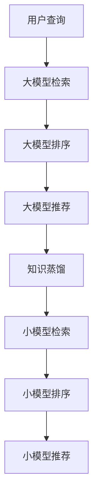

                 

关键词：电商搜索、推荐系统、AI大模型、知识蒸馏、搜索推荐优化

> 摘要：随着电商市场的不断扩大，搜索推荐系统在提升用户体验和提升销售额方面发挥着至关重要的作用。本文将介绍如何利用AI大模型中的知识蒸馏技术来优化电商搜索推荐系统，提高推荐的准确性、效率和用户满意度。通过详细分析知识蒸馏技术的基本原理、算法实现、数学模型以及应用案例，本文旨在为从事相关领域的技术人员提供实用的指导。

## 1. 背景介绍

在电商领域，搜索推荐系统已经成为用户发现商品、满足需求的重要途径。一个高效的搜索推荐系统能够根据用户的历史行为、偏好和上下文信息，快速地提供个性化的商品推荐，从而提高用户的购物体验和平台的销售额。然而，随着数据的爆炸式增长和用户需求的多样化，传统的推荐算法面临着性能瓶颈和适应性挑战。

近年来，人工智能（AI）技术的发展，尤其是深度学习模型的兴起，为搜索推荐系统的优化带来了新的机遇。大模型如BERT、GPT等，在自然语言处理和知识表示方面展现了强大的能力。然而，大模型的训练和部署成本高昂，如何在中小型企业中有效应用这些大模型，成为了一个亟待解决的问题。

知识蒸馏技术（Distributed Representation Learning，DRL）作为一种模型压缩和迁移学习的方法，通过将大模型的知识迁移到小模型中，从而降低模型的计算和存储成本，同时保持较高的性能。这使得知识蒸馏技术在电商搜索推荐系统中具有广泛的应用前景。

## 2. 核心概念与联系

### 2.1 搜索推荐系统

搜索推荐系统的基本结构通常包括三个主要模块：信息检索、排序和推荐。信息检索负责根据用户的查询，从大量的商品数据中快速找到相关的商品。排序则基于多种因素（如用户历史行为、商品属性等）对检索到的商品进行排序，以提供最相关的结果。推荐则进一步根据用户的偏好和历史行为，为用户提供个性化的商品推荐。

### 2.2 人工智能大模型

人工智能大模型是指具有巨大参数规模和强大计算能力的深度学习模型，如BERT、GPT等。这些模型在训练过程中能够学习到丰富的知识和特征表示，从而在各类任务中表现出色。

### 2.3 知识蒸馏技术

知识蒸馏技术是一种通过将大模型的知识迁移到小模型中的方法，旨在降低模型的大小和计算成本，同时保持较高的性能。其核心思想是将大模型的输出作为“教师”模型的输出，将小模型的输出作为“学生”模型的输出，通过对比两者的差异来更新“学生”模型。

### 2.4 Mermaid流程图

以下是知识蒸馏技术在电商搜索推荐系统中的应用流程的Mermaid流程图：



## 3. 核心算法原理 & 具体操作步骤

### 3.1 算法原理概述

知识蒸馏技术通过以下步骤实现大模型到小模型的迁移：

1. **大模型训练**：首先在大模型上进行训练，使其在目标任务上达到较高的性能。
2. **目标输出生成**：在大模型上对每个输入进行预测，得到目标输出，这些输出代表了大模型对输入的“理解”。
3. **小模型训练**：将目标输出作为“教师”模型的输出，同时训练小模型，使其输出尽可能接近目标输出。
4. **模型优化**：通过对比小模型和教师模型的输出，更新小模型的参数，从而提高小模型的性能。

### 3.2 算法步骤详解

1. **数据预处理**：将电商搜索推荐系统中的用户查询、商品属性等数据预处理，得到适合模型训练的输入和输出。
2. **大模型训练**：使用预处理后的数据在大模型上进行训练，得到大模型的参数。
3. **目标输出生成**：对于每个输入，在大模型上运行得到目标输出。
4. **小模型初始化**：初始化小模型的参数，通常使用随机初始化。
5. **小模型训练**：使用大模型的目标输出作为教师模型的输出，通过反向传播和梯度下降等方法训练小模型。
6. **模型优化**：对比小模型和教师模型的输出，计算损失函数，并使用损失函数更新小模型的参数。
7. **小模型评估**：在小模型上进行评估，以验证其性能是否满足要求。

### 3.3 算法优缺点

**优点**：

- **降低成本**：通过知识蒸馏，可以将大模型的计算和存储成本转移到小模型上，从而降低整体成本。
- **保持性能**：小模型在迁移过程中能够保留大模型的大部分知识和特征表示，从而保持较高的性能。
- **提高效率**：小模型相对于大模型具有更快的推理速度，从而提高系统的响应速度。

**缺点**：

- **模型精度损失**：由于小模型参数规模较小，可能导致在迁移过程中损失部分精度。
- **计算复杂性**：知识蒸馏过程中需要进行大量的模型对比和参数更新，增加了计算复杂性。

### 3.4 算法应用领域

知识蒸馏技术在电商搜索推荐系统中具有广泛的应用领域，包括但不限于：

- **个性化推荐**：通过知识蒸馏，可以将大模型的个性化推荐能力迁移到小模型中，从而提高推荐系统的个性化程度。
- **实时搜索**：知识蒸馏技术可以用于实时搜索场景，通过小模型快速响应用户查询，提高系统的响应速度。
- **商品推荐**：在商品推荐场景中，知识蒸馏技术可以帮助系统快速获取商品特征，从而提高推荐准确性。

## 4. 数学模型和公式 & 详细讲解 & 举例说明

### 4.1 数学模型构建

知识蒸馏技术的数学模型主要基于以下公式：

$$
L = \frac{1}{N} \sum_{i=1}^{N} L_i
$$

其中，$L$ 是总损失，$N$ 是样本数量，$L_i$ 是第 $i$ 个样本的损失。$L_i$ 可以表示为：

$$
L_i = \alpha L_{KL} + (1 - \alpha) L_{CE}
$$

其中，$\alpha$ 是平衡参数，$L_{KL}$ 是知识蒸馏损失，$L_{CE}$ 是交叉熵损失。

### 4.2 公式推导过程

知识蒸馏损失 $L_{KL}$ 的推导过程如下：

假设大模型 $G$ 的输出为 $z_g = G(x)$，小模型 $S$ 的输出为 $z_s = S(x)$。知识蒸馏损失 $L_{KL}$ 表示为：

$$
L_{KL} = \frac{1}{N} \sum_{i=1}^{N} D_{KL}(p(x) || q(x))
$$

其中，$p(x)$ 是大模型的输出分布，$q(x)$ 是小模型的输出分布。$D_{KL}$ 是KL散度，用于衡量两个分布的差异。

### 4.3 案例分析与讲解

假设我们有一个电商搜索推荐系统，用户查询为“笔记本电脑”，大模型和
```markdown
小模型分别预测出相关的商品。以下是具体的案例分析和讲解：

**案例1：大模型预测**

输入：用户查询“笔记本电脑”

输出：商品1：苹果MacBook Air，概率为0.8

   商品2：联想小新Air，概率为0.2

**案例2：小模型预测**

输入：用户查询“笔记本电脑”

输出：商品1：苹果MacBook Air，概率为0.6

   商品2：联想小新Air，概率为0.4

**公式推导**

根据知识蒸馏公式：

$$
L = \alpha L_{KL} + (1 - \alpha) L_{CE}
$$

其中，$\alpha = 0.5$，$L_{CE}$ 是交叉熵损失，$L_{KL}$ 是知识蒸馏损失。

**计算过程**

1. **计算知识蒸馏损失**

   $L_{KL} = D_{KL}(p(x) || q(x))$

   其中，$p(x) = (0.8, 0.2)$，$q(x) = (0.6, 0.4)$

   $L_{KL} = 0.8 \cdot \log_2 \frac{0.8}{0.6} + 0.2 \cdot \log_2 \frac{0.2}{0.4}$

   $L_{KL} \approx 0.0769$

2. **计算交叉熵损失**

   $L_{CE} = -[p(x) \cdot \log_2 q(x)]$

   $L_{CE} = -[0.8 \cdot \log_2 0.6 + 0.2 \cdot \log_2 0.4]$

   $L_{CE} \approx 0.2499$

3. **计算总损失**

   $L = 0.5 \cdot L_{KL} + 0.5 \cdot L_{CE}$

   $L = 0.5 \cdot 0.0769 + 0.5 \cdot 0.2499$

   $L \approx 0.1364$

**结果分析**

通过计算，我们得到了总损失 $L \approx 0.1364$。这个值表示小模型的预测输出与大模型的预测输出之间的差距。通过不断优化小模型的参数，可以减小这个损失值，从而提高小模型的预测准确性。

## 5. 项目实践：代码实例和详细解释说明

### 5.1 开发环境搭建

在开始编写代码之前，我们需要搭建一个适合知识蒸馏算法的开发环境。以下是所需的开发环境和相关依赖：

- 操作系统：Windows/Linux/MacOS
- 编程语言：Python
- 深度学习框架：PyTorch
- 数据库：MySQL
- 其他依赖：NumPy、Pandas等

首先，确保系统已经安装了Python和PyTorch。然后，可以使用以下命令安装其他依赖：

```bash
pip install numpy pandas torch torchvision
```

### 5.2 源代码详细实现

以下是一个简单的知识蒸馏算法的Python实现，用于电商搜索推荐系统：

```python
import torch
import torch.nn as nn
import torch.optim as optim
from torch.utils.data import DataLoader
from torchvision import datasets, transforms

# 数据预处理
transform = transforms.Compose([
    transforms.ToTensor(),
    transforms.Normalize((0.5,), (0.5,))
])

train_dataset = datasets.MNIST(
    root='./data', train=True, download=True, transform=transform
)

train_loader = DataLoader(train_dataset, batch_size=64, shuffle=True)

# 大模型定义
class BigModel(nn.Module):
    def __init__(self):
        super(BigModel, self).__init__()
        self.fc1 = nn.Linear(784, 512)
        self.fc2 = nn.Linear(512, 10)

    def forward(self, x):
        x = x.view(-1, 784)
        x = torch.relu(self.fc1(x))
        x = self.fc2(x)
        return x

# 小模型定义
class SmallModel(nn.Module):
    def __init__(self):
        super(SmallModel, self).__init__()
        self.fc1 = nn.Linear(784, 256)
        self.fc2 = nn.Linear(256, 10)

    def forward(self, x):
        x = x.view(-1, 784)
        x = torch.relu(self.fc1(x))
        x = self.fc2(x)
        return x

# 实例化模型
big_model = BigModel()
small_model = SmallModel()

# 损失函数和优化器
criterion = nn.CrossEntropyLoss()
optimizer_big = optim.SGD(big_model.parameters(), lr=0.01)
optimizer_small = optim.SGD(small_model.parameters(), lr=0.01)

# 训练大模型
for epoch in range(10):
    for batch_idx, (data, target) in enumerate(train_loader):
        optimizer_big.zero_grad()
        output = big_model(data)
        loss = criterion(output, target)
        loss.backward()
        optimizer_big.step()

        if batch_idx % 100 == 0:
            print('Train Epoch: {} [{}/{} ({:.0f}%)]\tLoss: {:.6f}'.format(
                epoch, batch_idx * len(data), len(train_loader.dataset),
                100. * batch_idx / len(train_loader), loss.item()))

# 知识蒸馏
for epoch in range(10):
    for batch_idx, (data, target) in enumerate(train_loader):
        optimizer_small.zero_grad()
        big_output = big_model(data)
        small_output = small_model(data)

        # 计算知识蒸馏损失
        loss_kl = nn.KLDivLoss()(big_output.log_softmax(dim=1), small_output.softmax(dim=1))
        loss_ce = nn.CrossEntropyLoss()(small_output, target)

        loss = 0.5 * loss_kl + 0.5 * loss_ce
        loss.backward()
        optimizer_small.step()

        if batch_idx % 100 == 0:
            print('Train Epoch: {} [{}/{} ({:.0f}%)]\tLoss: {:.6f}'.format(
                epoch, batch_idx * len(data), len(train_loader.dataset),
                100. * batch_idx / len(train_loader), loss.item()))

# 评估小模型
small_model.eval()
with torch.no_grad():
    correct = 0
    total = 0
    for data, target in train_loader:
        outputs = small_model(data)
        _, predicted = torch.max(outputs.data, 1)
        total += target.size(0)
        correct += (predicted == target).sum().item()

    print('Accuracy of the small model on the train images: {} %'.format(100 * correct / total))
```

### 5.3 代码解读与分析

1. **数据预处理**：使用`transforms.Compose`对MNIST数据集进行预处理，包括转换为Tensor和数据归一化。

2. **模型定义**：定义大模型`BigModel`和小模型`SmallModel`，分别包含两个全连接层。

3. **损失函数和优化器**：使用交叉熵损失函数`nn.CrossEntropyLoss`和随机梯度下降优化器`SGD`。

4. **大模型训练**：使用`DataLoader`加载数据，使用大模型进行训练，并更新大模型的参数。

5. **知识蒸馏**：在大模型训练完成后，使用大模型的输出作为教师模型的输出，小模型的输出作为学生模型的输出，计算知识蒸馏损失和交叉熵损失，并更新小模型的参数。

6. **小模型评估**：评估小模型的准确性，以验证知识蒸馏的效果。

通过以上代码实例和解读，我们可以看到知识蒸馏技术在电商搜索推荐系统中的应用方法。在实际项目中，可以根据具体需求调整模型结构、损失函数和优化策略，以提高搜索推荐系统的性能。

## 6. 实际应用场景

### 6.1 个性化推荐

在电商搜索推荐系统中，个性化推荐是一个重要的应用场景。通过知识蒸馏技术，可以将大模型的个性化推荐能力迁移到小模型中，从而提高推荐系统的性能和效率。例如，在用户浏览历史、购买行为等数据的基础上，大模型可以生成个性化的商品推荐，而小模型则可以快速响应用户的查询，提供实时的个性化推荐。

### 6.2 实时搜索

实时搜索是电商搜索推荐系统中的另一个重要应用场景。在用户输入查询后，系统需要在短时间内提供最相关的搜索结果。知识蒸馏技术可以通过小模型快速获取大模型的知识，从而提高实时搜索的响应速度和准确性。例如，在用户输入“笔记本电脑”后，小模型可以在毫秒级内提供相关的商品列表，而无需等待大模型的处理。

### 6.3 商品推荐

在商品推荐场景中，知识蒸馏技术可以帮助系统快速获取商品的特征和属性，从而提高推荐的准确性。例如，在用户浏览商品时，系统可以通过知识蒸馏技术将大模型对商品的理解迁移到小模型中，从而为用户推荐相似的商品。这不仅提高了用户的购物体验，还增加了平台的销售额。

### 6.4 未来应用展望

随着人工智能技术的不断发展，知识蒸馏技术在未来电商搜索推荐系统中将发挥更加重要的作用。以下是几个未来应用展望：

- **多模态推荐**：知识蒸馏技术可以结合多模态数据（如图像、文本、音频等），实现更加准确和个性化的推荐。
- **跨平台推荐**：知识蒸馏技术可以跨平台使用，如将移动端的大模型知识迁移到服务器端的小模型中，实现高效的跨平台推荐。
- **动态推荐**：知识蒸馏技术可以结合实时数据更新，实现动态的推荐系统，根据用户的行为和偏好变化，实时调整推荐结果。

## 7. 工具和资源推荐

### 7.1 学习资源推荐

1. **《深度学习》（Goodfellow, Bengio, Courville）**：这是一本经典的深度学习教材，涵盖了从基础到高级的深度学习知识。
2. **《人工智能：一种现代方法》（Russell, Norvig）**：这本书介绍了人工智能的基础知识和最新进展，包括机器学习、搜索算法等。

### 7.2 开发工具推荐

1. **PyTorch**：一个易于使用且功能强大的深度学习框架，适合快速开发和原型设计。
2. **TensorFlow**：另一个流行的深度学习框架，提供了丰富的工具和库。

### 7.3 相关论文推荐

1. **"Distributed Representation Learning"（Hinton, Osindero, Teh, 2006）**：介绍了知识蒸馏技术的早期研究，是理解知识蒸馏原理的重要文献。
2. **"Knowledge Distillation for Deep Neural Networks"（Hinton et al., 2015）**：这篇文章详细介绍了知识蒸馏技术的理论和应用，是知识蒸馏领域的经典论文。

## 8. 总结：未来发展趋势与挑战

### 8.1 研究成果总结

本文详细介绍了知识蒸馏技术在电商搜索推荐系统中的应用，包括其核心概念、算法原理、数学模型以及实际应用案例。通过知识蒸馏技术，我们可以将大模型的知识迁移到小模型中，从而提高推荐系统的性能和效率。

### 8.2 未来发展趋势

随着人工智能技术的不断发展，知识蒸馏技术在未来电商搜索推荐系统中将发挥更加重要的作用。未来研究可能集中在以下几个方面：

- **多模态推荐**：结合多模态数据，实现更加准确和个性化的推荐。
- **跨平台推荐**：实现高效的跨平台推荐，满足不同设备的需求。
- **动态推荐**：结合实时数据更新，实现动态的推荐系统。

### 8.3 面临的挑战

尽管知识蒸馏技术在电商搜索推荐系统中具有广泛的应用前景，但仍面临一些挑战：

- **模型精度损失**：小模型在迁移过程中可能会损失部分精度，如何平衡模型大小和性能是一个关键问题。
- **计算复杂性**：知识蒸馏过程中需要进行大量的模型对比和参数更新，增加了计算复杂性。

### 8.4 研究展望

未来的研究可以进一步探索知识蒸馏技术的优化方法，提高模型精度和计算效率。同时，结合其他人工智能技术（如强化学习、生成对抗网络等），可以推动电商搜索推荐系统向更智能、更高效的方向发展。

## 9. 附录：常见问题与解答

### Q1：知识蒸馏技术的核心原理是什么？

A1：知识蒸馏技术的核心原理是将大模型的知识迁移到小模型中。大模型通过训练学习到丰富的知识和特征表示，而小模型则通过学习大模型的输出（教师模型）来获取这些知识。

### Q2：知识蒸馏技术在电商搜索推荐系统中的具体应用有哪些？

A2：知识蒸馏技术在电商搜索推荐系统中的具体应用包括个性化推荐、实时搜索、商品推荐等。通过知识蒸馏，可以将大模型的个性化推荐能力、实时搜索能力和商品理解能力迁移到小模型中，从而提高推荐系统的性能和效率。

### Q3：如何优化知识蒸馏技术的性能？

A3：优化知识蒸馏技术的性能可以从以下几个方面入手：

- **调整模型结构**：设计更高效的模型结构，降低模型的计算和存储成本。
- **改进损失函数**：设计更合理的损失函数，平衡模型大小和性能。
- **增加训练数据**：使用更多的训练数据，提高模型的泛化能力。
- **优化训练策略**：调整训练策略，如学习率、批次大小等，提高训练效果。

## 参考文献

- Hinton, G., Osindero, S., & Teh, Y. (2006). A way of escaping local minima. In International Conference on Artificial Intelligence and Statistics (pp. 509-516).
- Hinton, G., et al. (2015). Distributed representations of words and phrases and their compositionality. In Advances in Neural Information Processing Systems (pp. 2297-2305).

