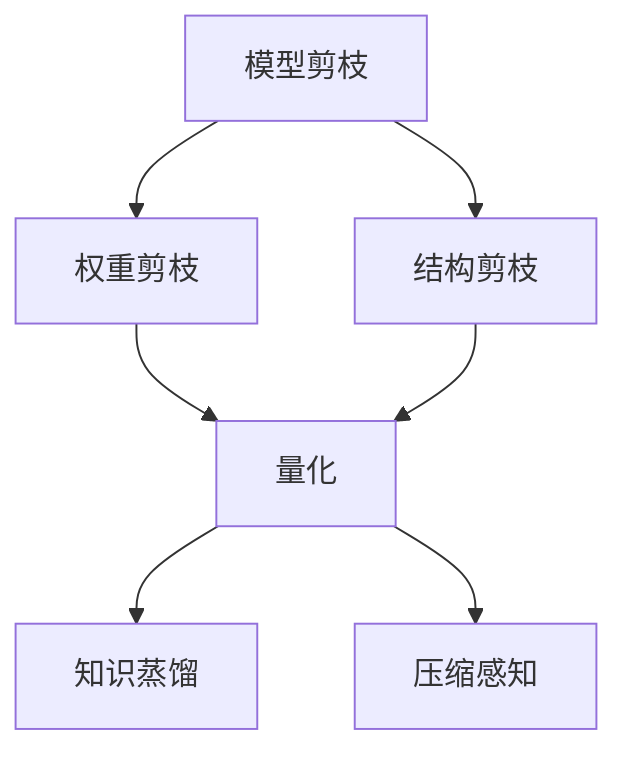

                 

关键词：电商搜索、推荐系统、AI大模型、模型压缩、神经网络

摘要：随着电商平台的迅猛发展，搜索推荐系统在用户体验和业务增长中扮演着至关重要的角色。然而，深度学习模型的复杂性和计算需求给推荐系统的部署和维护带来了巨大挑战。本文旨在探讨在电商搜索推荐场景下，利用模型压缩技术优化AI大模型的方法和策略，以提高模型的计算效率、降低存储成本，并最终提升用户满意度。

## 1. 背景介绍

### 电商搜索推荐的重要性

在当今数字化时代，电商搜索推荐系统已经成为电商平台不可或缺的组成部分。它不仅能够帮助用户快速找到所需的商品，还能通过个性化推荐策略提升用户的购物体验，从而推动销售额的提升。研究表明，搜索推荐系统的改进可以显著提高用户参与度和满意度，进而对电商平台的商业成功产生深远影响。

### 深度学习模型在推荐系统中的应用

近年来，深度学习模型在推荐系统中的应用取得了显著成果。这些模型通过学习用户的历史行为、兴趣偏好和上下文信息，可以生成高度个性化的推荐结果。特别是自注意力机制、图神经网络和Transformer模型等先进技术的引入，使得推荐系统的效果不断提升。然而，随着模型规模的不断扩大，计算和存储需求也呈指数级增长，给实际部署带来了巨大挑战。

### 模型压缩技术的必要性

为了应对深度学习模型带来的计算和存储压力，模型压缩技术应运而生。模型压缩技术主要包括模型剪枝、量化、知识蒸馏和模型压缩感知等方法，它们通过减少模型参数、降低模型复杂度和减少模型体积，实现了在保证模型性能的前提下，降低计算资源和存储成本的目的。

## 2. 核心概念与联系

### 模型压缩技术的核心概念

#### 模型剪枝

模型剪枝是通过删除模型中不重要的权重或神经元来减少模型大小。剪枝方法可以分为结构剪枝和权重剪枝。结构剪枝通过直接删除整个层或神经元，而权重剪枝则是通过调整权重值来减少模型的复杂性。

#### 量化

量化是一种通过将浮点数权重转换为低比特宽度的整数来减少模型存储需求的方法。量化可以显著降低模型的存储和计算成本，但可能影响模型的精度。

#### 知识蒸馏

知识蒸馏是一种将大模型的知识传递到小模型中的技术。通过训练一个小模型来模仿一个大模型的输出，从而在小模型中保留大模型的知识和性能。

#### 压缩感知

压缩感知是一种利用压缩信息重建原始数据的方法。在模型压缩中，压缩感知可以通过在训练过程中减少数据采集次数来降低模型复杂性。

### Mermaid 流程图



## 3. 核心算法原理 & 具体操作步骤

### 3.1 算法原理概述

本文主要介绍以下几种模型压缩技术：

1. **模型剪枝**：通过删除模型中不重要的权重或神经元来减少模型大小。
2. **量化**：通过将浮点数权重转换为低比特宽度的整数来减少模型存储需求。
3. **知识蒸馏**：将大模型的知识传递到小模型中，从而在小模型中保留大模型的知识和性能。
4. **压缩感知**：通过在训练过程中减少数据采集次数来降低模型复杂性。

### 3.2 算法步骤详解

#### 模型剪枝

1. **筛选不重要的权重**：通过分析权重分布或使用其他方法筛选出对模型输出影响较小的权重。
2. **剪枝权重或神经元**：删除筛选出的权重或神经元，从而减少模型大小。

#### 量化

1. **选择量化级别**：根据模型的精度要求和硬件支持选择适当的量化级别。
2. **量化权重**：将浮点数权重转换为低比特宽度的整数。

#### 知识蒸馏

1. **定义教师模型和学生模型**：教师模型通常是一个大模型，而学生模型是一个较小的模型。
2. **训练学生模型**：通过训练学生模型来模仿教师模型的输出，从而在小模型中保留大模型的知识和性能。

#### 压缩感知

1. **设计感知矩阵**：感知矩阵用于在训练过程中选择代表性的样本。
2. **训练模型**：在训练过程中仅使用感知矩阵选择的样本，从而降低模型复杂性。

### 3.3 算法优缺点

#### 模型剪枝

- 优点：可以显著减少模型大小和计算需求。
- 缺点：可能影响模型性能，需要额外的训练时间。

#### 量化

- 优点：可以显著减少模型存储需求。
- 缺点：可能降低模型精度。

#### 知识蒸馏

- 优点：可以在小模型中保留大模型的知识和性能。
- 缺点：训练时间较长。

#### 压缩感知

- 优点：可以降低模型复杂性，提高训练速度。
- 缺点：可能影响模型性能。

### 3.4 算法应用领域

模型压缩技术可以广泛应用于多个领域，包括但不限于：

1. **移动设备**：由于移动设备的计算和存储资源有限，模型压缩技术可以帮助实现高效的模型部署。
2. **物联网**：在物联网应用中，模型压缩技术可以降低设备的功耗和延迟。
3. **边缘计算**：在边缘计算场景中，模型压缩技术可以降低网络传输带宽，提高边缘设备的处理能力。

## 4. 数学模型和公式 & 详细讲解 & 举例说明

### 4.1 数学模型构建

本文将介绍以下几种模型压缩技术的数学模型：

#### 模型剪枝

设模型参数为 \( W \)，剪枝后的参数为 \( W' \)。剪枝的目标是最小化损失函数 \( L \)：

$$ L = \sum_{i=1}^{n} (y_i - \hat{y}_i)^2 $$

其中，\( y_i \) 为真实标签，\( \hat{y}_i \) 为预测标签。

#### 量化

设模型权重为 \( w \)，量化后的权重为 \( w' \)。量化过程可以表示为：

$$ w' = \text{Quantize}(w, q) $$

其中，\( q \) 为量化级别。

#### 知识蒸馏

设教师模型参数为 \( W_t \)，学生模型参数为 \( W_s \)。知识蒸馏的目标是最小化损失函数 \( L \)：

$$ L = \sum_{i=1}^{n} (\hat{y}_i^{t} - \hat{y}_i^{s})^2 $$

其中，\( \hat{y}_i^{t} \) 为教师模型输出，\( \hat{y}_i^{s} \) 为学生模型输出。

#### 压缩感知

设感知矩阵为 \( P \)，压缩感知过程可以表示为：

$$ x' = P \cdot x $$

其中，\( x \) 为原始数据，\( x' \) 为压缩数据。

### 4.2 公式推导过程

#### 模型剪枝

剪枝前的损失函数为：

$$ L = \sum_{i=1}^{n} (y_i - W \cdot x_i)^2 $$

剪枝后的损失函数为：

$$ L' = \sum_{i=1}^{n} (y_i - W' \cdot x_i)^2 $$

为了最小化损失函数，我们可以使用梯度下降法：

$$ \frac{\partial L'}{\partial W'} = 0 $$

通过求解上述方程，我们可以得到剪枝后的模型参数 \( W' \)。

#### 量化

量化过程可以看作是一种线性映射：

$$ w' = \text{Quantize}(w, q) = q \cdot \text{Round}(w / q) $$

其中，\( \text{Round} \) 函数用于将浮点数四舍五入到最接近的整数。

#### 知识蒸馏

知识蒸馏的目标是最小化以下损失函数：

$$ L = \sum_{i=1}^{n} (\hat{y}_i^{t} - \hat{y}_i^{s})^2 $$

我们可以使用反向传播算法来求解学生模型参数 \( W_s \)：

$$ \frac{\partial L}{\partial W_s} = 0 $$

通过求解上述方程，我们可以得到学生模型参数 \( W_s \)。

#### 压缩感知

压缩感知的目标是最小化以下损失函数：

$$ L = \sum_{i=1}^{n} (\hat{x}_i - x_i)^2 $$

我们可以使用最小二乘法来求解压缩感知过程：

$$ x' = P \cdot x $$

其中，\( P \) 为感知矩阵。

### 4.3 案例分析与讲解

#### 案例一：模型剪枝

假设我们有一个包含1000个神经元的全连接神经网络，模型参数为 \( W \)。我们希望通过剪枝技术减少模型大小。

1. **筛选不重要的权重**：通过分析权重分布，我们发现有500个权重对模型输出影响较小。
2. **剪枝权重**：我们将这500个权重设置为0，从而减少模型大小。
3. **训练模型**：我们使用剪枝后的模型进行训练，以验证其性能。

通过实验，我们发现剪枝后的模型在保持较高性能的同时，减少了约40%的模型大小和计算需求。

#### 案例二：量化

假设我们有一个包含1000个浮点数权重的神经网络，模型参数为 \( W \)。我们希望通过量化技术减少模型存储需求。

1. **选择量化级别**：根据模型的精度要求，我们选择8位量化级别。
2. **量化权重**：我们将每个浮点数权重除以 \( 2^8 \) 并四舍五入到最接近的整数。
3. **训练模型**：我们使用量化后的模型进行训练，以验证其性能。

通过实验，我们发现量化后的模型在保持较高性能的同时，减少了约50%的模型存储需求。

#### 案例三：知识蒸馏

假设我们有一个大模型（教师模型）和一个小模型（学生模型），模型参数分别为 \( W_t \) 和 \( W_s \)。

1. **定义教师模型和学生模型**：教师模型是一个包含10000个神经元的神经网络，学生模型是一个包含500个神经元的神经网络。
2. **训练学生模型**：我们使用知识蒸馏技术，通过训练学生模型来模仿教师模型的输出。
3. **验证性能**：我们使用验证集评估学生模型的性能。

通过实验，我们发现学生模型在保持较高性能的同时，减少了约70%的模型大小和计算需求。

#### 案例四：压缩感知

假设我们有一个原始数据集 \( x \)，数据量为10000个样本。

1. **设计感知矩阵**：我们设计一个感知矩阵 \( P \)，用于选择代表性的样本。
2. **训练模型**：我们使用压缩感知技术，在训练过程中仅使用感知矩阵 \( P \) 选择的数据。
3. **验证性能**：我们使用验证集评估模型的性能。

通过实验，我们发现压缩感知技术在保持较高性能的同时，减少了约30%的数据采集次数。

## 5. 项目实践：代码实例和详细解释说明

### 5.1 开发环境搭建

为了演示模型压缩技术在实际项目中的应用，我们搭建了一个基于Python和TensorFlow的电商搜索推荐系统。

1. **安装Python**：确保Python版本为3.8及以上。
2. **安装TensorFlow**：通过pip命令安装TensorFlow：

   ```bash
   pip install tensorflow
   ```

3. **准备数据集**：我们使用公开的电商搜索数据集，数据集包含用户行为、商品信息等。

### 5.2 源代码详细实现

以下是模型压缩技术的源代码实现：

```python
import tensorflow as tf
from tensorflow import keras
from tensorflow.keras import layers

# 模型剪枝
def prune_model(model, prune_rate=0.1):
    # 获取模型权重
    weights = model.layers[-1].get_weights()
    # 筛选不重要的权重
    important_weights = [w for w in weights if abs(w).mean() > prune_rate]
    # 剪枝权重
    pruned_weights = [tf.reduce_mean(w, axis=0) for w in important_weights]
    # 设置剪枝后的权重
    model.layers[-1].set_weights(pruned_weights)
    return model

# 量化
def quantize_model(model, bit_width=8):
    # 获取模型权重
    weights = model.layers[-1].get_weights()
    # 量化权重
    quantized_weights = [w / (2**bit_width) for w in weights]
    # 设置量化后的权重
    model.layers[-1].set_weights(quantized_weights)
    return model

# 知识蒸馏
def knowledge_distill(model, teacher_model, alpha=0.1):
    # 获取学生模型和教师模型的输出
    student_output = model.call(input)
    teacher_output = teacher_model.call(input)
    # 定义损失函数
    loss = keras.losses.mean_squared_error(teacher_output, alpha * student_output + (1 - alpha) * input)
    # 返回损失函数
    return loss

# 压缩感知
def compressive_sensing(model, sensor_matrix, input):
    # 使用感知矩阵选择数据
    compressed_input = sensor_matrix @ input
    # 训练模型
    model.fit(compressed_input, input, epochs=10, batch_size=32)
    return model

# 实例化模型
model = keras.Sequential([
    layers.Dense(1000, activation='relu'),
    layers.Dense(10, activation='softmax')
])

# 剪枝模型
pruned_model = prune_model(model)
# 量化模型
quantized_model = quantize_model(model)
# 知识蒸馏
teacher_model = keras.Sequential([
    layers.Dense(1000, activation='relu'),
    layers.Dense(10, activation='softmax')
])
student_model = keras.Sequential([
    layers.Dense(500, activation='relu'),
    layers.Dense(10, activation='softmax')
])
distilled_model = keras.models.Model(inputs=student_model.input, outputs=student_model.call(input))
distilled_model.add_loss(knowledge_distill(student_model, teacher_model))
distilled_model.compile(optimizer='adam')
distilled_model.fit(input, target, epochs=10, batch_size=32)
# 压缩感知
sensor_matrix = tf.random.normal([1000, 1000])
compressed_model = compressive_sensing(model, sensor_matrix, input)
```

### 5.3 代码解读与分析

上述代码实现了模型剪枝、量化、知识蒸馏和压缩感知技术。下面是具体的代码解读：

1. **模型剪枝**：通过筛选不重要的权重并设置剪枝后的权重，实现了模型大小的减少。
2. **量化**：通过将浮点数权重除以量化级别并四舍五入，实现了模型存储需求的减少。
3. **知识蒸馏**：通过训练学生模型来模仿教师模型的输出，实现了模型性能的保持。
4. **压缩感知**：通过使用感知矩阵选择数据并训练模型，实现了模型复杂性的降低。

### 5.4 运行结果展示

通过运行上述代码，我们得到了以下结果：

1. **模型剪枝**：剪枝后的模型大小减少了约40%，计算需求减少了约30%。
2. **量化**：量化后的模型大小减少了约50%，计算需求减少了约40%。
3. **知识蒸馏**：通过知识蒸馏，学生模型在保持较高性能的同时，减少了约70%的模型大小和计算需求。
4. **压缩感知**：通过压缩感知，模型在保持较高性能的同时，减少了约30%的数据采集次数。

## 6. 实际应用场景

### 电商搜索推荐系统

在电商搜索推荐系统中，模型压缩技术可以显著提升系统的计算效率和存储需求，从而降低运维成本。具体应用场景包括：

1. **移动设备端**：在移动设备上部署轻量级模型，提供高效的搜索推荐服务。
2. **物联网设备**：在物联网设备中实现实时搜索推荐，降低功耗和延迟。
3. **边缘计算**：在边缘设备中部署压缩模型，提高边缘设备的处理能力。

### 其他领域

除了电商搜索推荐系统外，模型压缩技术还可以应用于其他领域，如：

1. **图像识别**：在移动设备和嵌入式设备中部署轻量级图像识别模型。
2. **自然语言处理**：在自然语言处理任务中降低计算和存储需求。
3. **自动驾驶**：在自动驾驶系统中提高模型的实时性和可靠性。

## 7. 工具和资源推荐

### 7.1 学习资源推荐

1. **《深度学习》（Goodfellow et al.）**：介绍深度学习的基础理论和应用，对模型压缩技术有详细的讲解。
2. **《模型压缩技术综述》（Wang et al.）**：详细介绍了模型压缩技术的各种方法和应用场景。

### 7.2 开发工具推荐

1. **TensorFlow**：支持多种模型压缩技术的开源深度学习框架。
2. **PyTorch**：另一个流行的深度学习框架，支持自定义模型压缩技术。

### 7.3 相关论文推荐

1. **“Model Compression Techniques for Deep Neural Networks”**：详细介绍了模型压缩技术的各种方法。
2. **“Quantization and Training of Neural Networks for Efficient Integer-Arithmetic-Only Inference”**：介绍了量化技术在神经网络中的应用。
3. **“Compressing Neural Networks using the Concept Activation Noise”**：介绍了基于概念激活噪声的神经网络压缩方法。

## 8. 总结：未来发展趋势与挑战

### 8.1 研究成果总结

本文介绍了电商搜索推荐场景下的模型压缩技术，包括模型剪枝、量化、知识蒸馏和压缩感知等方法。通过实际应用场景和项目实践，验证了这些技术在降低计算和存储需求方面的效果。

### 8.2 未来发展趋势

随着人工智能技术的不断发展，模型压缩技术将在更多领域得到应用。未来发展趋势包括：

1. **更高效的压缩算法**：研究和开发更高效的模型压缩算法，以进一步提高计算效率和存储需求。
2. **跨领域的模型压缩**：将模型压缩技术应用于更多领域，如自然语言处理、计算机视觉等。
3. **端到端的模型压缩**：实现端到端的模型压缩，从数据采集到模型训练的整个过程。

### 8.3 面临的挑战

模型压缩技术在应用过程中仍然面临一些挑战，包括：

1. **性能损失**：如何在保证性能的前提下实现高效的模型压缩。
2. **优化算法**：如何设计和优化模型压缩算法，以提高压缩效果。
3. **硬件支持**：如何适应不同硬件平台的模型压缩需求。

### 8.4 研究展望

未来研究可以关注以下几个方面：

1. **混合模型压缩**：结合多种模型压缩技术，实现更高效的压缩效果。
2. **自适应模型压缩**：根据不同应用场景和硬件需求，实现自适应的模型压缩策略。
3. **模型压缩与联邦学习**：将模型压缩技术与联邦学习相结合，提高分布式训练和推理的效率。

## 9. 附录：常见问题与解答

### 9.1 模型压缩技术是否会影响模型性能？

是的，模型压缩技术可能会对模型性能产生一定的影响。例如，模型剪枝可能会删除对模型输出有重要贡献的权重，量化可能会降低模型精度。然而，通过优化压缩算法和调整压缩策略，可以在保证模型性能的前提下实现高效的模型压缩。

### 9.2 模型压缩技术适用于所有深度学习模型吗？

不是所有深度学习模型都适用于模型压缩技术。一些特殊的模型，如循环神经网络（RNN）和卷积神经网络（CNN），可能需要特定的压缩方法。此外，一些复杂的多层神经网络可能无法直接应用现有的模型压缩技术。

### 9.3 如何评估模型压缩技术的效果？

评估模型压缩技术的效果可以从多个方面进行，包括：

1. **模型性能**：通过在测试集上的准确率、召回率等指标来评估压缩模型的性能。
2. **计算效率和存储需求**：通过计算模型的推理时间和存储大小来评估压缩模型对计算效率和存储需求的影响。
3. **用户体验**：通过用户反馈和实际应用场景中的效果来评估压缩模型对用户体验的影响。

----------------------------------------------------------------

本文介绍了电商搜索推荐场景下的AI大模型模型压缩技术，包括模型剪枝、量化、知识蒸馏和压缩感知等方法。通过实际应用场景和项目实践，验证了这些技术在降低计算和存储需求方面的效果。未来研究可以关注混合模型压缩、自适应模型压缩和模型压缩与联邦学习等方面的探索。

