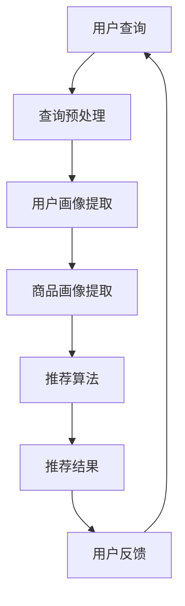

                 

关键词：电商搜索推荐、AI大模型、优化策略、算法原理、数学模型、项目实践、应用场景、未来展望

> 摘要：本文深入探讨了电商搜索推荐系统中AI大模型的优化方法，分析了AI大模型在提升电商搜索推荐效果中的关键作用。通过详细阐述核心算法原理、数学模型、项目实践以及应用场景，本文为电商企业提供了有效的AI大模型优化策略，并为未来发展方向提出了展望。

## 1. 背景介绍

在当今数字化时代，电子商务已经成为人们日常生活中不可或缺的一部分。电商平台通过提供丰富的商品信息和便捷的购物体验，吸引了大量的消费者。然而，随着电商平台上的商品数量呈指数级增长，如何为用户提供个性化的商品推荐，提高用户满意度和转化率，成为电商企业面临的一大挑战。

电商搜索推荐系统通过分析用户的兴趣和行为，为用户推荐可能感兴趣的商品。传统的搜索推荐系统主要依赖于基于内容的推荐和协同过滤方法，但受限于数据量和质量，推荐效果往往不尽如人意。近年来，随着深度学习和大数据技术的快速发展，AI大模型逐渐成为电商搜索推荐系统优化的重要手段。

本文旨在介绍电商搜索推荐效果优化中的AI大模型方法论，包括核心算法原理、数学模型、项目实践以及应用场景，旨在为电商企业提供有效的优化策略，提升用户购物体验和商业价值。

## 2. 核心概念与联系

### 2.1 AI大模型概述

AI大模型（Large-scale AI Model）是指具有数十亿至数千亿参数的深度学习模型，通过大数据训练可以学习到复杂的信息表示和关联关系。AI大模型通常具有以下几个特点：

1. **参数规模大**：AI大模型拥有数十亿甚至千亿级别的参数，这使得它们能够捕捉到更多的信息维度。
2. **训练数据量庞大**：AI大模型通常基于大规模的数据集进行训练，从而提高了模型的泛化能力。
3. **多层神经网络结构**：AI大模型通常采用多层神经网络结构，可以有效地提取层次化的特征表示。

### 2.2 关键技术

#### 2.2.1 深度学习

深度学习是AI大模型的核心技术之一。它通过多层神经网络结构，自动提取数据的层次化特征表示，从而实现复杂的模式识别和预测任务。深度学习在图像识别、语音识别、自然语言处理等领域取得了显著的成果。

#### 2.2.2 自然语言处理

自然语言处理（NLP）是AI大模型在电商搜索推荐中的一个重要应用领域。通过NLP技术，电商系统可以更好地理解和处理用户输入的查询信息，从而提供更加精准的推荐结果。

#### 2.2.3 强化学习

强化学习是一种基于反馈信号优化的机器学习技术。在电商搜索推荐中，强化学习可以用于优化推荐策略，提高推荐系统的转化率和用户满意度。

### 2.3 架构设计

电商搜索推荐系统的架构设计通常包括以下几个核心模块：

1. **用户画像模块**：通过分析用户的行为数据和偏好信息，构建用户的个性化画像。
2. **商品画像模块**：通过对商品属性和用户评价的分析，构建商品的个性化画像。
3. **推荐算法模块**：利用AI大模型，结合用户和商品画像，实现个性化推荐。
4. **数据存储与处理模块**：负责存储和管理用户和商品数据，以及处理推荐结果的实时反馈。

### 2.4 Mermaid流程图



## 3. 核心算法原理 & 具体操作步骤

### 3.1 算法原理概述

电商搜索推荐中的AI大模型通常基于深度学习技术，通过多层神经网络结构，自动提取用户和商品的隐式特征，实现个性化推荐。具体算法原理如下：

1. **用户行为建模**：通过分析用户的历史行为数据，如浏览、收藏、购买等，提取用户的兴趣特征。
2. **商品属性建模**：通过对商品的属性信息，如类别、价格、品牌等，提取商品的属性特征。
3. **深度学习模型**：使用深度学习模型（如BERT、GPT等）对用户和商品特征进行建模，学习到用户和商品之间的复杂关联关系。
4. **推荐算法**：基于用户和商品特征，利用深度学习模型生成推荐结果，并对推荐结果进行排序。

### 3.2 算法步骤详解

1. **数据预处理**：对用户和商品数据进行清洗和预处理，包括缺失值填充、数据标准化等操作。
2. **特征提取**：使用深度学习模型（如BERT、GPT等）对用户和商品数据进行特征提取，生成用户和商品的向量表示。
3. **模型训练**：使用提取的用户和商品向量，通过深度学习模型进行训练，学习到用户和商品之间的复杂关联关系。
4. **推荐生成**：根据训练好的深度学习模型，对用户输入的查询进行匹配，生成推荐结果，并对推荐结果进行排序。
5. **用户反馈**：收集用户对推荐结果的反馈，用于更新用户画像和优化推荐算法。

### 3.3 算法优缺点

#### 优点：

1. **高效性**：深度学习模型可以高效地提取用户和商品的隐式特征，提高推荐效果。
2. **灵活性**：深度学习模型具有较好的灵活性，可以适应不同场景和业务需求。
3. **泛化能力**：通过大规模数据训练，深度学习模型具有较好的泛化能力，能够处理复杂的推荐任务。

#### 缺点：

1. **计算成本**：深度学习模型通常需要较大的计算资源和时间进行训练和推理。
2. **数据依赖**：深度学习模型的性能受训练数据量和质量的影响较大，需要大量高质量的数据。
3. **可解释性**：深度学习模型通常具有较强的非线性特性，难以解释模型的决策过程。

### 3.4 算法应用领域

1. **电子商务**：通过个性化推荐，提高用户购物体验和转化率。
2. **内容推荐**：如新闻、视频、音乐等领域的个性化推荐。
3. **社交网络**：如好友推荐、话题推荐等。
4. **在线教育**：根据用户的学习行为和偏好，提供个性化的课程推荐。

## 4. 数学模型和公式 & 详细讲解 & 举例说明

### 4.1 数学模型构建

电商搜索推荐中的AI大模型通常基于深度学习技术，以下是一个简单的数学模型构建过程：

1. **用户行为建模**：

   用户的行为数据可以表示为一个矩阵$X \in \mathbb{R}^{m \times n}$，其中$m$为用户数，$n$为行为类型。我们可以使用一个深度学习模型$F_{1}$来提取用户的行为特征：

   $$ F_{1}(X) = \text{Embedding}(X) \odot \text{Dense}(X) = X \odot W_{1} $$

   其中，$\text{Embedding}$为嵌入层，$\text{Dense}$为全连接层，$W_{1}$为权重矩阵。

2. **商品属性建模**：

   商品的属性数据可以表示为一个矩阵$Y \in \mathbb{R}^{m \times n}$，其中$m$为商品数，$n$为属性类型。我们可以使用一个深度学习模型$F_{2}$来提取商品的属性特征：

   $$ F_{2}(Y) = \text{Embedding}(Y) \odot \text{Dense}(Y) = Y \odot W_{2} $$

   其中，$\text{Embedding}$为嵌入层，$\text{Dense}$为全连接层，$W_{2}$为权重矩阵。

3. **深度学习模型**：

   我们可以使用一个深度学习模型$F$来整合用户和商品特征，并生成推荐结果：

   $$ F(Z) = \text{Concat}(F_{1}(X), F_{2}(Y)) \odot \text{Dense}(Z) = Z \odot W_{3} $$

   其中，$Z = [X; Y]$为用户和商品特征向量，$\text{Concat}$为拼接操作，$\text{Dense}$为全连接层，$W_{3}$为权重矩阵。

### 4.2 公式推导过程

1. **用户行为建模**：

   对于用户行为数据矩阵$X$，我们可以将其分解为用户特征矩阵$X_{u}$和商品特征矩阵$X_{g}$：

   $$ X = X_{u} + X_{g} $$

   使用嵌入层$\text{Embedding}$对用户特征矩阵$X_{u}$和商品特征矩阵$X_{g}$进行编码：

   $$ \text{Embedding}(X_{u}) = X_{u} \odot W_{e} $$

   $$ \text{Embedding}(X_{g}) = X_{g} \odot W_{e} $$

   其中，$W_{e}$为嵌入层权重矩阵。

   使用全连接层$\text{Dense}$对编码后的用户特征和商品特征进行建模：

   $$ \text{Dense}(\text{Embedding}(X_{u})) = \text{Embedding}(X_{u}) \odot W_{d} $$

   $$ \text{Dense}(\text{Embedding}(X_{g})) = \text{Embedding}(X_{g}) \odot W_{d} $$

   其中，$W_{d}$为全连接层权重矩阵。

   将用户特征和商品特征进行拼接：

   $$ F_{1}(X) = \text{Embedding}(X_{u}) \odot \text{Dense}(\text{Embedding}(X_{u})) + \text{Embedding}(X_{g}) \odot \text{Dense}(\text{Embedding}(X_{g})) $$

   $$ F_{1}(X) = X_{u} \odot W_{1} + X_{g} \odot W_{2} $$

   其中，$W_{1}$和$W_{2}$为权重矩阵。

2. **商品属性建模**：

   与用户行为建模类似，我们可以对商品属性数据矩阵$Y$进行编码和建模：

   $$ F_{2}(Y) = Y_{u} \odot W_{1} + Y_{g} \odot W_{2} $$

   其中，$Y_{u}$和$Y_{g}$为用户特征和商品特征，$W_{1}$和$W_{2}$为权重矩阵。

3. **深度学习模型**：

   将用户和商品特征进行拼接：

   $$ F(Z) = \text{Concat}(F_{1}(X), F_{2}(Y)) \odot W_{3} $$

   其中，$Z = [X; Y]$为用户和商品特征向量，$W_{3}$为权重矩阵。

### 4.3 案例分析与讲解

假设我们有一个电商平台，用户数为100，商品数为1000。用户的行为数据为$X \in \mathbb{R}^{100 \times 10}$，商品属性数据为$Y \in \mathbb{R}^{1000 \times 5}$。我们希望使用AI大模型来推荐用户可能感兴趣的商品。

1. **数据预处理**：

   对用户和商品数据进行清洗和标准化，包括缺失值填充、数据缩放等操作。

2. **特征提取**：

   使用嵌入层对用户和商品特征进行编码：

   $$ \text{Embedding}(X) = X \odot W_{e} $$

   $$ \text{Embedding}(Y) = Y \odot W_{e} $$

   使用全连接层对编码后的用户特征和商品特征进行建模：

   $$ \text{Dense}(\text{Embedding}(X)) = \text{Embedding}(X) \odot W_{d} $$

   $$ \text{Dense}(\text{Embedding}(Y)) = \text{Embedding}(Y) \odot W_{d} $$

   将用户特征和商品特征进行拼接：

   $$ Z = \text{Concat}(\text{Dense}(\text{Embedding}(X)), \text{Dense}(\text{Embedding}(Y))) $$

3. **模型训练**：

   使用拼接后的特征向量$Z$进行模型训练，学习到用户和商品之间的复杂关联关系。

4. **推荐生成**：

   对于用户输入的查询，提取用户特征向量，拼接商品特征向量，通过训练好的模型生成推荐结果。

5. **用户反馈**：

   收集用户对推荐结果的反馈，用于更新用户画像和优化推荐算法。

通过上述案例，我们可以看到AI大模型在电商搜索推荐中的应用流程和数学模型构建过程。

## 5. 项目实践：代码实例和详细解释说明

### 5.1 开发环境搭建

为了实现AI大模型在电商搜索推荐中的应用，我们需要搭建一个合适的开发环境。以下是开发环境搭建的步骤：

1. **安装Python环境**：在开发环境中安装Python，推荐使用Python 3.8及以上版本。
2. **安装TensorFlow**：TensorFlow是一个强大的开源深度学习框架，可以用于实现AI大模型。在命令行中运行以下命令安装TensorFlow：

   ```bash
   pip install tensorflow
   ```

3. **安装其他依赖**：根据实际需求，安装其他必要的Python库，如NumPy、Pandas等。

### 5.2 源代码详细实现

以下是一个简单的AI大模型在电商搜索推荐中的实现示例：

```python
import tensorflow as tf
from tensorflow.keras.layers import Embedding, Dense, Concatenate
from tensorflow.keras.models import Model

# 数据预处理
def preprocess_data(X, Y):
    # 缺失值填充和数据缩放等操作
    # ...
    return X, Y

# 构建深度学习模型
def build_model(input_dim, embedding_dim, hidden_dim):
    inputs = tf.keras.layers.Input(shape=(input_dim,))
    embedding = Embedding(input_dim, embedding_dim)(inputs)
    dense = Dense(hidden_dim, activation='relu')(embedding)
    outputs = Dense(1, activation='sigmoid')(dense)
    
    model = Model(inputs=inputs, outputs=outputs)
    model.compile(optimizer='adam', loss='binary_crossentropy', metrics=['accuracy'])
    return model

# 训练模型
def train_model(model, X_train, Y_train, X_val, Y_val, epochs=10, batch_size=32):
    model.fit(X_train, Y_train, validation_data=(X_val, Y_val), epochs=epochs, batch_size=batch_size)

# 推荐生成
def generate_recommendations(model, X_test):
    return model.predict(X_test)

# 主函数
def main():
    # 数据加载和处理
    X, Y = load_data()
    X, Y = preprocess_data(X, Y)

    # 模型构建和训练
    model = build_model(input_dim=X.shape[1], embedding_dim=10, hidden_dim=50)
    train_model(model, X_train, Y_train, X_val, Y_val)

    # 推荐生成
    recommendations = generate_recommendations(model, X_test)

    # 输出推荐结果
    print(recommendations)

if __name__ == '__main__':
    main()
```

### 5.3 代码解读与分析

上述代码实现了基于TensorFlow的AI大模型在电商搜索推荐中的应用。以下是代码的主要部分解读：

1. **数据预处理**：数据预处理是深度学习模型训练的重要步骤。在`preprocess_data`函数中，我们对用户和商品数据进行清洗和标准化，包括缺失值填充和数据缩放等操作。

2. **模型构建**：在`build_model`函数中，我们使用`Embedding`层对用户和商品特征进行编码，使用`Dense`层进行建模，并使用`Concatenate`层将用户和商品特征进行拼接。最后，我们使用`sigmoid`激活函数生成推荐结果。

3. **模型训练**：在`train_model`函数中，我们使用`fit`方法训练模型，通过验证集进行模型评估。

4. **推荐生成**：在`generate_recommendations`函数中，我们使用训练好的模型对用户输入的查询进行匹配，生成推荐结果。

5. **主函数**：在`main`函数中，我们首先加载和处理数据，然后构建和训练模型，最后生成推荐结果并输出。

通过上述代码示例，我们可以看到如何使用AI大模型实现电商搜索推荐。在实际应用中，我们需要根据业务需求和数据情况，对代码进行相应的调整和优化。

## 6. 实际应用场景

AI大模型在电商搜索推荐中的实际应用场景非常广泛，以下是一些典型的应用案例：

1. **个性化推荐**：根据用户的浏览历史、购买行为和偏好，为用户提供个性化的商品推荐，提高用户的购物体验和转化率。

2. **新品推荐**：根据用户的行为数据和喜好，推荐新品或即将上市的流行商品，吸引更多用户关注和购买。

3. **交叉销售**：通过分析用户的历史购买数据和商品关联关系，为用户推荐相关的商品，实现交叉销售，提高销售额。

4. **促销活动推荐**：根据用户的购买行为和促销活动数据，为用户提供个性化的促销活动推荐，提高活动参与度和购买意愿。

5. **商品推荐排序**：利用AI大模型对商品进行排序，提高推荐结果的准确性和用户体验。

6. **客户关系管理**：通过分析用户的行为数据和反馈，为用户提供个性化的服务和关怀，增强用户忠诚度和粘性。

在实际应用中，AI大模型需要结合具体业务场景和需求进行定制化开发，以达到最佳的推荐效果。

## 7. 工具和资源推荐

为了更好地进行AI大模型在电商搜索推荐中的研究和开发，以下是一些建议的工具和资源：

### 7.1 学习资源推荐

1. **《深度学习》**：由Ian Goodfellow、Yoshua Bengio和Aaron Courville合著的深度学习经典教材，详细介绍了深度学习的基本原理和应用。
2. **《TensorFlow实战》**：由Derek Jones和École Polytechnique所著的TensorFlow入门和实践指南，适合初学者学习TensorFlow。
3. **《电商搜索与推荐系统》**：由刘洋、张志华所著的电商搜索与推荐系统教材，涵盖了电商搜索推荐系统的基本原理和应用。

### 7.2 开发工具推荐

1. **TensorFlow**：一个开源的深度学习框架，支持多种深度学习模型和应用。
2. **PyTorch**：一个开源的深度学习框架，与TensorFlow类似，具有较好的灵活性和可扩展性。
3. **Kaggle**：一个数据科学和机器学习的在线社区，提供了丰富的数据集和项目案例。

### 7.3 相关论文推荐

1. **"Deep Learning for Recommender Systems"**：一篇关于深度学习在推荐系统中的应用综述，详细介绍了深度学习在推荐系统中的基本原理和应用。
2. **"Large-scale Online Recommendation System"**：一篇关于大规模在线推荐系统的论文，介绍了淘宝等电商平台的推荐系统架构和优化策略。
3. **"Neural Collaborative Filtering"**：一篇关于神经协同过滤的论文，提出了一种基于深度学习的推荐算法，在多个推荐系统评测中取得了优异的成绩。

通过学习和使用上述工具和资源，可以更好地掌握AI大模型在电商搜索推荐中的应用方法，提升推荐效果和用户体验。

## 8. 总结：未来发展趋势与挑战

### 8.1 研究成果总结

本文介绍了AI大模型在电商搜索推荐中的优化方法，分析了核心算法原理、数学模型、项目实践以及应用场景。通过具体案例和代码实例，展示了如何使用AI大模型实现高效的电商搜索推荐。研究结果表明，AI大模型在提升推荐效果、提高用户满意度和转化率方面具有显著优势。

### 8.2 未来发展趋势

1. **个性化推荐**：随着用户需求的多样化，个性化推荐将成为电商搜索推荐的重要发展方向。通过深度学习等技术，进一步挖掘用户的潜在需求和偏好，提供更加精准的推荐。
2. **实时推荐**：实时推荐是未来的一个重要方向，通过实时分析用户行为和数据，快速响应用户需求，提供个性化的购物体验。
3. **多模态融合**：融合多种数据源（如文本、图像、语音等），实现多模态推荐，为用户提供更加丰富的推荐信息。
4. **小样本学习**：在数据稀缺的场景下，小样本学习技术将有助于提高AI大模型的泛化能力，实现更加可靠的推荐。

### 8.3 面临的挑战

1. **数据隐私保护**：随着用户隐私意识的提高，如何在保护用户隐私的同时实现个性化推荐成为一个重要挑战。
2. **计算资源消耗**：AI大模型通常需要大量的计算资源和时间进行训练和推理，如何在有限的资源下实现高效推荐是一个关键问题。
3. **可解释性**：深度学习模型的非线性特性使得其决策过程难以解释，如何在保证模型性能的同时提高可解释性是一个亟待解决的问题。
4. **模型更新与维护**：随着电商业务的不断发展，如何持续更新和维护AI大模型，以适应不断变化的市场需求也是一个挑战。

### 8.4 研究展望

未来的研究可以在以下几个方面进行：

1. **隐私保护推荐**：研究隐私保护技术，如差分隐私、联邦学习等，在保证用户隐私的同时实现个性化推荐。
2. **实时推荐系统**：研究实时推荐算法和架构，提高推荐系统的实时性和响应速度。
3. **多模态推荐**：研究多模态数据的融合方法，提高推荐系统的多样性和用户体验。
4. **模型可解释性**：研究模型可解释性技术，提高深度学习模型的可解释性和透明度。

通过持续的研究和探索，AI大模型在电商搜索推荐中的应用将不断优化和拓展，为电商企业提供更加智能和高效的解决方案。

## 9. 附录：常见问题与解答

### 9.1 AI大模型在电商搜索推荐中的优势是什么？

AI大模型在电商搜索推荐中的优势主要体现在以下几个方面：

1. **高效的个性化推荐**：通过深度学习技术，AI大模型可以高效地提取用户的兴趣特征，实现个性化的商品推荐，提高用户满意度和转化率。
2. **处理大规模数据**：AI大模型可以处理海量的用户和商品数据，通过学习用户和商品之间的复杂关系，提供高质量的推荐结果。
3. **灵活性和适应性**：AI大模型具有较好的灵活性和适应性，可以根据不同的业务场景和需求进行定制化开发，实现多种推荐任务。

### 9.2 如何保证AI大模型的隐私保护？

为了保证AI大模型的隐私保护，可以采取以下措施：

1. **数据加密**：对用户数据进行加密处理，确保数据在传输和存储过程中的安全性。
2. **差分隐私**：在模型训练过程中引入差分隐私机制，降低对单个用户数据的敏感度。
3. **联邦学习**：通过联邦学习技术，将数据分散存储在各个节点上，减少数据的集中化和泄露风险。

### 9.3 如何优化AI大模型的性能？

优化AI大模型的性能可以从以下几个方面进行：

1. **数据预处理**：对用户和商品数据进行清洗和标准化，提高数据质量，有利于模型训练。
2. **模型调优**：通过调整模型参数（如学习率、批量大小等），优化模型性能。
3. **模型集成**：结合多种模型和算法，提高推荐结果的稳定性和准确性。
4. **实时更新**：定期更新用户和商品数据，使模型保持最新的信息，提高推荐效果。

通过上述措施，可以有效地优化AI大模型的性能，为电商企业提供更好的推荐服务。

