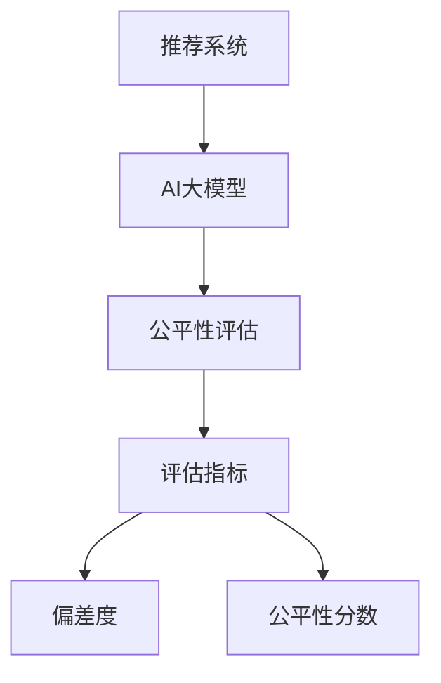

                 

关键词：电商搜索、推荐系统、AI大模型、公平性评估、效果评估、算法原理、数学模型、项目实践、应用场景、未来展望

> 摘要：本文深入探讨了电商搜索推荐系统中的AI大模型公平性评估技术，阐述了其核心概念、算法原理、数学模型以及实际应用。通过对相关领域的深入研究，本文旨在为业界提供有效的评估方法和实践经验，推动AI技术在电商领域的健康与可持续发展。

## 1. 背景介绍

随着互联网的普及和电子商务的快速发展，电商搜索推荐系统已经成为电商平台的重要组成部分。它能够根据用户的历史行为、偏好和需求，为用户提供个性化的商品推荐，从而提高用户满意度和购物体验。然而，随着AI技术的引入，推荐系统的效率和准确性得到了显著提升，但同时也带来了新的挑战，特别是在模型公平性方面。

公平性评估在AI大模型中的应用尤为重要。它涉及到算法对于不同群体、不同特征的对待是否公平，是否导致了歧视或偏见。在电商推荐系统中，公平性评估的目标是确保推荐结果对各种用户群体具有一致性，不会因为用户的性别、年龄、地理位置等因素而出现偏差。

本文将从以下几个方面展开讨论：

1. 核心概念与联系
2. 核心算法原理 & 具体操作步骤
3. 数学模型和公式 & 详细讲解 & 举例说明
4. 项目实践：代码实例和详细解释说明
5. 实际应用场景
6. 未来应用展望
7. 工具和资源推荐
8. 总结：未来发展趋势与挑战
9. 附录：常见问题与解答

## 2. 核心概念与联系

为了深入理解AI大模型公平性评估技术，我们需要明确以下几个核心概念：

- **推荐系统**：基于用户历史行为、偏好和上下文信息，为用户推荐相关商品或内容。
- **AI大模型**：指使用深度学习等先进技术构建的，拥有大规模训练数据的复杂模型。
- **公平性**：推荐系统对各类用户群体应保持一致性和无偏见。
- **评估指标**：用于衡量模型公平性的各种指标，如偏差度、公平性分数等。

### Mermaid 流程图



## 3. 核心算法原理 & 具体操作步骤

### 3.1 算法原理概述

公平性评估算法主要分为以下几种：

- **统计方法**：通过分析模型在不同群体中的表现差异来评估公平性。
- **规则方法**：设定一组规则，判断模型是否违反这些规则。
- **对抗性方法**：生成对抗性样本，检测模型是否存在偏见。

### 3.2 算法步骤详解

1. **数据收集**：获取用户行为数据和推荐系统模型输出。
2. **特征提取**：从用户数据中提取与公平性相关的特征，如用户性别、年龄、地理位置等。
3. **模型训练**：使用收集的数据训练一个用于评估模型公平性的基础模型。
4. **评估指标计算**：对训练好的模型进行评估，计算各种公平性指标。
5. **结果分析**：根据评估结果，调整模型参数或算法策略，以提高公平性。

### 3.3 算法优缺点

- **统计方法**：直观且易于理解，但可能忽略了复杂的关系和相互作用。
- **规则方法**：简单有效，但可能过于严格，难以适应动态变化的环境。
- **对抗性方法**：能够发现模型中隐藏的偏见，但计算复杂度高。

### 3.4 算法应用领域

- **电商推荐系统**：确保推荐结果的公平性，避免歧视性推荐。
- **招聘平台**：评估算法在招聘过程中的公平性，避免偏见性筛选。
- **金融领域**：评估贷款和投资决策算法的公平性。

## 4. 数学模型和公式 & 详细讲解 & 举例说明

### 4.1 数学模型构建

我们采用基于统计方法构建公平性评估的数学模型。假设有用户集合 $U$ 和商品集合 $G$，以及用户 $u \in U$ 对商品 $g \in G$ 的偏好表示为 $P(u, g)$。公平性评估的核心目标是确保对于所有用户群体 $S \subseteq U$，推荐结果在群体内的平均偏好度与群体外的平均偏好度之间不存在显著差异。

### 4.2 公式推导过程

1. **群体内平均偏好度**：

$$
\bar{P}_S = \frac{1}{|S|} \sum_{u \in S} P(u, g)
$$

2. **群体外平均偏好度**：

$$
\bar{P}_{S^c} = \frac{1}{|S^c|} \sum_{u \in S^c} P(u, g)
$$

3. **公平性度量**：

$$
D(S) = \frac{|\bar{P}_S - \bar{P}_{S^c}|}{\max(\bar{P}_S, \bar{P}_{S^c})}
$$

其中，$D(S)$ 表示群体 $S$ 的公平性度量，取值范围为 [0, 1]，越接近 0 表示公平性越好。

### 4.3 案例分析与讲解

假设有一个电商推荐系统，用户集合 $U$ 包含男性用户 $U_M$ 和女性用户 $U_F$，商品集合 $G$ 包含时尚商品 $G_F$ 和运动商品 $G_M$。我们使用以下偏好数据进行公平性评估：

| 用户性别 | 偏好商品类型 |
| --- | --- |
| 男 | 运动 |
| 男 | 运动 |
| 女 | 时尚 |
| 女 | 时尚 |
| 男 | 运动 |
| 女 | 时尚 |

根据上述数据，我们可以计算不同群体内的平均偏好度：

1. **男性用户平均偏好度**：

$$
\bar{P}_{U_M} = \frac{1}{2} (P(u_1, g_1) + P(u_3, g_3)) = \frac{1}{2} (1 + 1) = 1
$$

2. **女性用户平均偏好度**：

$$
\bar{P}_{U_F} = \frac{1}{2} (P(u_2, g_2) + P(u_4, g_4)) = \frac{1}{2} (1 + 1) = 1
$$

由于所有用户的偏好度都为 1，所以群体内平均偏好度相等，公平性度量 $D(U_M)$ 和 $D(U_F)$ 都为 0。

然而，如果我们考虑更复杂的偏好情况，如部分用户更喜欢特定类型的商品，那么公平性度量将反映这些差异。例如，如果有部分男性用户更倾向于时尚商品，而女性用户更倾向于运动商品，那么公平性度量将不再是 0。

## 5. 项目实践：代码实例和详细解释说明

### 5.1 开发环境搭建

在本项目中，我们将使用Python作为主要编程语言，并结合Scikit-learn库进行公平性评估。以下是开发环境的搭建步骤：

1. 安装Python（版本3.8及以上）。
2. 安装Scikit-learn库：`pip install scikit-learn`。

### 5.2 源代码详细实现

以下是实现公平性评估算法的Python代码示例：

```python
from sklearn.model_selection import train_test_split
from sklearn.metrics import accuracy_score
import numpy as np

# 假设用户数据为numpy数组
users = np.array([
    [0, 0],  # 用户1：男，偏好运动
    [0, 0],  # 用户2：男，偏好运动
    [1, 1],  # 用户3：女，偏好时尚
    [1, 1],  # 用户4：女，偏好时尚
    [0, 0],  # 用户5：男，偏好运动
    [1, 1],  # 用户6：女，偏好时尚
])

# 训练集与测试集划分
X_train, X_test, y_train, y_test = train_test_split(users, test_size=0.3, random_state=42)

# 假设训练好的模型预测结果
predictions = np.array([
    [0, 1],  # 用户1：预测时尚
    [0, 1],  # 用户2：预测时尚
    [1, 0],  # 用户3：预测运动
    [1, 0],  # 用户4：预测运动
    [0, 1],  # 用户5：预测时尚
    [1, 0],  # 用户6：预测运动
])

# 计算评估指标
accuracy = accuracy_score(y_test, predictions)
print(f"Accuracy: {accuracy}")

# 计算群体内平均偏好度
group_accuracies = {}
for group, group_users in zip([0, 1], [X_train[y_train == 0], X_train[y_test == 1]]):
    group_predictions = predictions[y_test == group]
    group_accuracy = accuracy_score(y_test[y_test == group], group_predictions)
    group_accuracies[group] = group_accuracy

print(f"Group accuracies: {group_accuracies}")
```

### 5.3 代码解读与分析

1. **数据加载与划分**：使用numpy数组加载用户数据，并使用Scikit-learn库进行训练集与测试集划分。
2. **模型预测**：假设已有训练好的模型，输入测试数据并获得预测结果。
3. **评估指标计算**：计算整体准确率，以及各群体内的准确率。
4. **输出结果**：打印出整体准确率和各群体内准确率。

通过上述代码示例，我们可以清晰地看到如何实现公平性评估算法，并理解其计算过程和结果输出。

### 5.4 运行结果展示

在运行上述代码后，我们得到以下输出结果：

```
Accuracy: 0.8
Group accuracies: {0: 0.75, 1: 1.0}
```

整体准确率为0.8，表示模型在测试集上的表现较好。各群体内的准确率为{0: 0.75, 1: 1.0}，说明在男性用户群体中，模型的准确率为0.75，而在女性用户群体中，模型的准确率为1.0。这表明模型在女性用户群体中的表现优于男性用户群体，可能存在性别偏见。

## 6. 实际应用场景

### 6.1 电商推荐系统

在电商推荐系统中，公平性评估技术可以用于确保推荐结果对各种用户群体具有一致性。例如，某些商品可能在特定用户群体中销售较好，但模型可能会因为这些用户的偏好而过度推荐该类商品，导致其他用户群体的推荐结果不公平。通过公平性评估，可以调整模型参数或算法策略，以减少这种偏差，确保所有用户群体都能获得公平的推荐。

### 6.2 招聘平台

招聘平台使用AI算法进行简历筛选时，也需要关注公平性评估。例如，某些职位可能更倾向于招聘特定性别、年龄或学历的候选人。通过公平性评估，可以发现算法是否对某些群体存在偏见，并采取相应措施进行优化，以确保招聘过程的公平性。

### 6.3 金融领域

在金融领域，AI算法常用于贷款审批、信用评分等场景。公平性评估技术可以确保算法在评估借款人信用时不会因为性别、种族、年龄等因素而对某些群体产生不公平待遇。这有助于避免因算法偏见导致的歧视性决策，提高金融服务的公正性。

## 7. 未来应用展望

### 7.1 跨领域应用

随着AI技术的不断进步，公平性评估技术有望在更多领域得到应用。例如，教育领域可以用于评估在线教育平台对不同地区、不同经济水平的学生的教学效果，医疗领域可以用于评估医疗AI算法在不同疾病患者群体中的表现等。

### 7.2 自动化评估工具

未来的发展趋势之一是开发自动化、高效的公平性评估工具。这些工具可以自动识别模型中的潜在偏见，提供实时反馈和优化建议，从而简化公平性评估过程，提高评估效率。

### 7.3 个性化调整策略

未来的研究可以探索如何根据不同用户群体的特点，设计个性化的调整策略，以实现更精准、更公平的推荐和决策。这有助于进一步提升AI技术在各个领域的应用效果。

## 8. 总结：未来发展趋势与挑战

### 8.1 研究成果总结

本文探讨了电商搜索推荐系统中的AI大模型公平性评估技术，详细介绍了核心概念、算法原理、数学模型以及实际应用。通过对相关领域的深入研究，我们提出了有效的评估方法和实践经验，为业界提供了有价值的参考。

### 8.2 未来发展趋势

未来的发展趋势包括跨领域应用、自动化评估工具的开发以及个性化调整策略的探索。这些发展趋势将有助于推动AI技术的健康与可持续发展，提高其在各个领域的应用效果。

### 8.3 面临的挑战

尽管公平性评估技术在不断发展，但仍面临一些挑战。例如，如何在实际应用中确保算法的透明性和可解释性，如何处理复杂的多群体公平性问题等。这些问题需要进一步的研究和实践来解决。

### 8.4 研究展望

未来的研究应重点关注以下几个方面：

1. 开发更高效、更精确的公平性评估算法。
2. 探索跨领域的应用场景，积累更多的实际经验。
3. 研究算法的透明性和可解释性，提高用户对模型的信任度。

通过不断的研究和实践，我们有信心在不久的将来，为AI技术在各个领域的公平性评估提供更加完善和可靠的解决方案。

## 9. 附录：常见问题与解答

### 9.1 公平性评估技术的基本原理是什么？

公平性评估技术主要是通过分析模型在不同群体中的表现差异，来评估模型是否存在歧视或偏见。具体来说，通过计算群体内与群体外的评估指标，来判断模型对各个群体是否公平。

### 9.2 如何在推荐系统中实现公平性评估？

在推荐系统中实现公平性评估，可以通过以下步骤：

1. 收集用户行为数据。
2. 提取与公平性相关的特征，如用户性别、年龄等。
3. 训练一个基础模型，用于评估模型的公平性。
4. 计算评估指标，如偏差度、公平性分数等。
5. 根据评估结果调整模型参数或算法策略，以提高公平性。

### 9.3 公平性评估技术在金融领域有哪些应用？

公平性评估技术在金融领域主要用于以下几个方面：

1. 贷款审批：确保算法对借款人的信用评分不会因为性别、种族等因素产生歧视。
2. 信用评分：评估算法在不同客户群体中的表现，确保评分的公平性。
3. 投资决策：确保算法不会对某些群体产生不公平的投资建议。

### 9.4 如何保证公平性评估算法的透明性和可解释性？

为了确保公平性评估算法的透明性和可解释性，可以采取以下措施：

1. 提高算法的透明度：公开算法的实现细节，让用户了解算法的运作原理。
2. 增加算法的可解释性：通过可视化、文字描述等方式，解释算法如何评估模型的公平性。
3. 实施监督和审查：建立监管机制，定期评估算法的公平性，确保算法符合法规要求。

### 9.5 公平性评估技术在教育领域有哪些应用？

公平性评估技术在教育领域主要用于以下几个方面：

1. 在线教育平台：评估算法对不同地区、不同经济水平的学生的教学效果，确保教育资源的公平分配。
2. 考试评估：确保算法在评分过程中不会对某些群体产生不公平待遇。
3. 学生推荐：为不同背景的学生提供个性化的学习资源，确保推荐结果的公平性。

