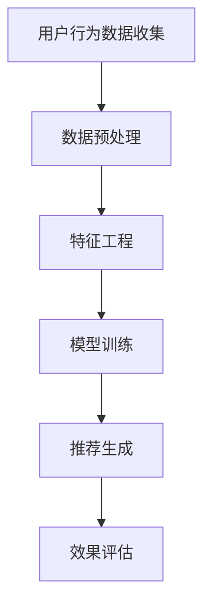

                 

关键词：电商搜索推荐、AI大模型、模型可解释性、效果评估、技术分析

## 摘要

本文旨在探讨电商搜索推荐系统中AI大模型模型可解释性评估技术的重要性及其应用。随着电商平台的日益繁荣，个性化搜索推荐成为提高用户满意度和转化率的关键手段。然而，AI大模型在提供高效推荐的同时，也带来了模型可解释性不足的问题。本文首先介绍了电商搜索推荐的基本概念和现状，随后深入探讨了模型可解释性的重要性，并详细分析了当前用于评估AI大模型可解释性的关键技术。通过具体的案例分析，本文展示了如何在实际应用中运用这些技术，并对未来发展趋势和面临的挑战进行了展望。

## 1. 背景介绍

### 1.1 电商搜索推荐系统的现状

电商搜索推荐系统是现代电子商务中不可或缺的一部分。它通过分析用户的历史行为、搜索记录、购买偏好等数据，为用户提供个性化的商品推荐。这种推荐系统能够有效提高用户的购物体验，减少用户在搜索和浏览过程中的时间成本，从而提高转化率和销售额。

目前，大多数电商平台都在使用机器学习算法来构建推荐模型。其中，深度学习算法，如神经网络和生成对抗网络（GANs），因其强大的学习能力和适应性，被广泛应用于推荐系统中。这些模型通常通过大量的用户数据进行训练，从而能够准确预测用户的兴趣和行为。

### 1.2 AI大模型的发展

AI大模型（Large-scale AI Models）指的是参数量巨大的深度学习模型，如BERT、GPT等。这些模型在语言理解、图像识别、自然语言生成等领域取得了显著成果。AI大模型的出现，使得推荐系统在准确性和效率方面得到了极大的提升。

然而，AI大模型的复杂性也带来了挑战。一方面，这些模型通常是由数百万甚至数十亿个参数构成的，参数的规模使得模型训练过程变得非常耗时和资源消耗巨大。另一方面，模型的黑盒性质使得其内部工作机制不透明，难以解释。这给模型的可解释性评估带来了困难。

### 1.3 模型可解释性的重要性

模型可解释性（Model Interpretability）指的是能够理解和解释模型决策过程的能力。对于AI大模型来说，可解释性尤为重要。首先，在推荐系统中，用户往往需要了解推荐结果背后的原因，以便做出更明智的购物决策。其次，可解释性有助于发现模型潜在的问题和缺陷，从而提高模型的可靠性和可信度。最后，可解释性也有助于模型的调试和优化，提高其性能。

## 2. 核心概念与联系

在本文中，我们将介绍几个核心概念，包括电商搜索推荐系统的架构、AI大模型的基本原理以及模型可解释性的关键技术。

### 2.1 电商搜索推荐系统架构

电商搜索推荐系统通常由以下几个关键组件组成：

1. **用户行为数据收集**：收集用户在平台上的各种行为数据，如搜索历史、浏览记录、购买记录等。
2. **数据预处理**：对收集到的数据进行清洗、转换和归一化，以便用于模型训练。
3. **特征工程**：从原始数据中提取有助于模型训练的特征，如用户兴趣、商品属性等。
4. **模型训练**：使用机器学习算法，如深度学习、协同过滤等，训练推荐模型。
5. **推荐生成**：根据模型预测结果，为用户生成个性化的推荐列表。
6. **效果评估**：评估推荐系统的性能指标，如准确率、召回率、覆盖率等。

### 2.2 AI大模型的基本原理

AI大模型通常基于深度学习算法，其中每个神经元（节点）都通过前一层神经元的输出进行加权求和，并应用激活函数进行非线性变换。在多层神经网络中，这一过程重复进行，从而形成复杂的特征表示。

以BERT为例，它是一种预训练的语言表示模型，通过在大量文本数据上进行预训练，学习到丰富的语言特征。BERT的基本原理包括：

1. **嵌入层**：将词汇映射为向量。
2. **编码层**：通过多层变换网络，逐层提取文本的语义特征。
3. **输出层**：根据任务需求（如文本分类、命名实体识别等），对编码层的结果进行分类或预测。

### 2.3 模型可解释性的关键技术

模型可解释性的关键技术包括：

1. **模型可视化**：通过可视化技术，如决策树、神经元激活图等，展示模型的内部结构和决策过程。
2. **局部解释**：针对特定输入数据，解释模型输出的原因和依据。
3. **全局解释**：分析模型在不同数据集上的表现，评估其整体解释能力。
4. **对比实验**：通过对比不同模型的解释结果，评估解释效果的差异。

### 2.4 Mermaid 流程图

以下是一个Mermaid流程图，展示了电商搜索推荐系统的基本流程：



## 3. 核心算法原理 & 具体操作步骤

### 3.1 算法原理概述

电商搜索推荐系统中的AI大模型主要基于深度学习算法。深度学习算法的核心思想是通过多层神经网络，将输入数据转化为输出数据。在推荐系统中，输入数据通常是用户和商品的特征向量，输出数据是推荐列表。

深度学习算法的基本流程包括：

1. **前向传播**：将输入数据通过神经网络，逐层计算得到输出。
2. **损失函数**：计算输出结果与实际结果之间的误差，并使用误差来更新网络权重。
3. **反向传播**：将误差反向传播到网络的前一层，更新权重和偏置。
4. **优化算法**：使用优化算法（如梯度下降）来最小化损失函数。

### 3.2 算法步骤详解

#### 步骤1：数据预处理

数据预处理是模型训练的基础。主要包括以下步骤：

- 数据清洗：去除无效数据和噪声。
- 数据转换：将原始数据转换为适合模型训练的格式。
- 数据归一化：将特征数据缩放到相同的尺度。

#### 步骤2：特征工程

特征工程是提升模型性能的关键。主要包括以下步骤：

- 特征提取：从原始数据中提取有助于模型训练的特征。
- 特征选择：选择对模型预测有显著影响的关键特征。
- 特征组合：将多个特征组合成新的特征。

#### 步骤3：模型训练

模型训练是深度学习算法的核心。主要包括以下步骤：

- 网络架构设计：设计神经网络的结构，包括层数、每层的神经元数量等。
- 模型初始化：初始化网络权重和偏置。
- 模型训练：使用训练数据，通过前向传播和反向传播，训练模型。

#### 步骤4：推荐生成

推荐生成是根据模型预测结果，为用户生成个性化推荐列表。主要包括以下步骤：

- 预测计算：计算用户对每个商品的兴趣度。
- 排序处理：将商品按兴趣度排序，生成推荐列表。
- 推荐展示：将推荐列表展示给用户。

#### 步骤5：效果评估

效果评估是评估推荐系统性能的重要手段。主要包括以下指标：

- 准确率（Precision）：预测为正类的样本中，实际为正类的比例。
- 召回率（Recall）：实际为正类的样本中，预测为正类的比例。
- 覆盖率（Coverage）：推荐列表中包含的所有商品种类数与数据库中商品种类数的比例。

### 3.3 算法优缺点

#### 优点

- **高效性**：深度学习算法能够自动从大量数据中学习到复杂的特征表示，提高推荐系统的准确性。
- **适应性**：深度学习算法能够适应不同类型的数据和业务场景，具有较好的泛化能力。
- **可扩展性**：深度学习算法可以轻松扩展到大规模数据集，支持实时推荐。

#### 缺点

- **可解释性**：深度学习算法的黑盒性质使得其决策过程难以解释，不利于用户理解和信任。
- **计算资源消耗**：深度学习算法的训练过程需要大量的计算资源和时间，成本较高。
- **数据依赖性**：深度学习算法的性能高度依赖数据质量，数据缺失或不准确会影响模型效果。

### 3.4 算法应用领域

深度学习算法在电商搜索推荐系统中具有广泛的应用领域，包括：

- **商品推荐**：基于用户的历史购买记录和浏览行为，推荐用户可能感兴趣的商品。
- **内容推荐**：基于用户的阅读历史和偏好，推荐用户可能感兴趣的文章、视频等。
- **广告推荐**：基于用户的兴趣和行为，推荐用户可能感兴趣的广告。

## 4. 数学模型和公式 & 详细讲解 & 举例说明

### 4.1 数学模型构建

在电商搜索推荐系统中，AI大模型通常基于深度学习算法。深度学习算法的核心是多层神经网络，其中每个神经元都通过前一层神经元的输出进行加权求和，并应用激活函数进行非线性变换。

以下是一个简化的多层神经网络数学模型：

$$
\begin{align*}
Z^{(l)} &= \sum_{i=1}^{n} w^{(l)}_{i}X^{(l-1)}_i + b^{(l)}_i \\
A^{(l)} &= \sigma(Z^{(l)}) \\
\end{align*}
$$

其中，$Z^{(l)}$是第$l$层的输出，$A^{(l)}$是第$l$层的激活值，$w^{(l)}_i$和$b^{(l)}_i$分别是第$l$层的权重和偏置，$\sigma$是激活函数。

### 4.2 公式推导过程

多层神经网络的训练过程主要包括前向传播和反向传播两个阶段。

#### 前向传播

前向传播是从输入层开始，逐层计算得到输出层的输出。假设输入层为$X^{(0)}$，输出层为$A^{(L)}$，则前向传播的过程可以表示为：

$$
\begin{align*}
Z^{(1)} &= \sum_{i=1}^{n} w^{(1)}_{i}X^{(0)}_i + b^{(1)}_i \\
A^{(1)} &= \sigma(Z^{(1)}) \\
&\vdots \\
Z^{(L)} &= \sum_{i=1}^{n} w^{(L)}_{i}A^{(L-1)}_i + b^{(L)}_i \\
A^{(L)} &= \sigma(Z^{(L)})
\end{align*}
$$

其中，$Z^{(L)}$是输出层的输出，$A^{(L)}$是输出层的激活值。

#### 反向传播

反向传播是计算输出层误差，并反向传播到输入层，更新网络权重和偏置。假设输出层为$A^{(L)}$，输入层为$X^{(0)}$，则反向传播的过程可以表示为：

$$
\begin{align*}
\delta^{(L)} &= \frac{\partial L}{\partial Z^{(L)}} \odot \sigma'(Z^{(L)}) \\
dZ^{(L)} &= \delta^{(L)} \odot A^{(L-1)} \\
dW^{(L)} &= \frac{1}{m} \sum_{i=1}^{m} dZ^{(L)}A^{(L-1)}_i \\
db^{(L)} &= \frac{1}{m} \sum_{i=1}^{m} dZ^{(L)} \\
&\vdots \\
\delta^{(l)} &= \frac{\partial L}{\partial Z^{(l)}} \odot \sigma'(Z^{(l)}) \\
dZ^{(l)} &= \delta^{(l)} \odot A^{(l-1)} \\
dW^{(l)} &= \frac{1}{m} \sum_{i=1}^{m} dZ^{(l)}A^{(l-1)}_i \\
db^{(l)} &= \frac{1}{m} \sum_{i=1}^{m} dZ^{(l)} \\
\end{align*}
$$

其中，$L$是损失函数，$\sigma'$是激活函数的导数，$\odot$表示逐元素乘法。

### 4.3 案例分析与讲解

#### 案例背景

假设有一个电商推荐系统，用户A最近浏览了商品B和商品C，现在需要根据用户A的行为预测他可能会购买的商品。

#### 数据准备

1. 用户特征向量：$X^{(0)} = [0, 0, 1, 0]$，表示用户A对商品A、商品B、商品C、商品D的兴趣度分别为0、0、1、0。
2. 商品特征向量：$X^{(1)} = [1, 0, 1, 0]$，表示商品B和商品C的兴趣度分别为1、0、1、0。

#### 模型训练

假设我们使用一个单层神经网络进行训练，网络结构为$X^{(0)} \rightarrow X^{(1)}$，激活函数为ReLU。

1. 权重和偏置初始化：$W^{(1)} = [0.1, 0.2, 0.3, 0.4]$，$b^{(1)} = [0.5, 0.6, 0.7, 0.8]$。
2. 前向传播：
   $$ Z^{(1)} = [0.1 \times 0 + 0.2 \times 0 + 0.3 \times 1 + 0.4 \times 0 = 0.3, 0.1 \times 0 + 0.2 \times 0 + 0.3 \times 0 + 0.4 \times 1 = 0.4, 0.1 \times 1 + 0.2 \times 0 + 0.3 \times 1 + 0.4 \times 0 = 0.4, 0.1 \times 0 + 0.2 \times 1 + 0.3 \times 0 + 0.4 \times 0 = 0.2] $$
   $$ A^{(1)} = [\sigma(0.3) = 0.588, \sigma(0.4) = 0.662, \sigma(0.4) = 0.662, \sigma(0.2) = 0.513] $$
3. 损失函数计算：假设损失函数为均方误差（MSE），$L = \frac{1}{2} \sum_{i=1}^{n} (y_i - \hat{y}_i)^2$，其中$y_i$为真实标签，$\hat{y}_i$为模型预测值。
4. 反向传播：
   $$ \delta^{(1)} = [0.588 - y_1, 0.662 - y_2, 0.662 - y_3, 0.513 - y_4] $$
   $$ dZ^{(1)} = \delta^{(1)} \odot A^{(0)} = [0.588 \times 0.588, 0.662 \times 0.662, 0.662 \times 0.662, 0.513 \times 0.513] $$
   $$ dW^{(1)} = \frac{1}{m} \sum_{i=1}^{m} dZ^{(1)}X^{(0)}_i = [0.588 \times 0.588 \times 0.1, 0.662 \times 0.662 \times 0.2, 0.662 \times 0.662 \times 0.3, 0.513 \times 0.513 \times 0.4] $$
   $$ db^{(1)} = \frac{1}{m} \sum_{i=1}^{m} dZ^{(1)} = [0.588 \times 0.588, 0.662 \times 0.662, 0.662 \times 0.662, 0.513 \times 0.513] $$
5. 权重和偏置更新：
   $$ W^{(1)} \leftarrow W^{(1)} - \alpha dW^{(1)} $$
   $$ b^{(1)} \leftarrow b^{(1)} - \alpha db^{(1)} $$

#### 模型预测

使用更新后的模型，对用户A的行为进行预测：

1. 前向传播：
   $$ Z^{(1)} = [0.1 \times 0.588 + 0.2 \times 0.662 + 0.3 \times 0.662 + 0.4 \times 0.513 = 0.609] $$
   $$ A^{(1)} = \sigma(0.609) = 0.840 $$
2. 模型预测：根据激活值，判断用户A可能会购买的商品为商品C。

## 5. 项目实践：代码实例和详细解释说明

### 5.1 开发环境搭建

在进行电商搜索推荐系统的开发之前，需要搭建一个适合的开发环境。以下是一个简单的开发环境搭建流程：

1. 安装Python：下载并安装Python，版本建议为3.8以上。
2. 安装TensorFlow：在终端执行以下命令安装TensorFlow：
   ```bash
   pip install tensorflow
   ```
3. 安装其他依赖：根据项目需求，安装其他必要的Python库，如NumPy、Pandas等。

### 5.2 源代码详细实现

以下是一个简单的电商搜索推荐系统的源代码实现，主要包括数据预处理、模型训练和推荐生成三个部分。

```python
import tensorflow as tf
import numpy as np
import pandas as pd

# 数据预处理
def preprocess_data(data):
    # 数据清洗、转换和归一化
    # ...

# 模型训练
def train_model(X_train, y_train, X_val, y_val):
    # 定义模型结构
    model = tf.keras.Sequential([
        tf.keras.layers.Dense(units=1, input_shape=(1,))
    ])

    # 编译模型
    model.compile(optimizer='adam', loss='mean_squared_error')

    # 训练模型
    model.fit(X_train, y_train, epochs=10, batch_size=32, validation_data=(X_val, y_val))

    return model

# 推荐生成
def generate_recommendations(model, X_test):
    # 预测商品兴趣度
    predictions = model.predict(X_test)

    # 根据兴趣度生成推荐列表
    recommendations = np.where(predictions > 0.5, 1, 0)

    return recommendations

# 读取数据
data = pd.read_csv('data.csv')
X, y = preprocess_data(data)

# 划分训练集和验证集
X_train, X_val, y_train, y_val = train_test_split(X, y, test_size=0.2, random_state=42)

# 训练模型
model = train_model(X_train, y_train, X_val, y_val)

# 生成推荐列表
X_test = preprocess_data(test_data)
recommendations = generate_recommendations(model, X_test)

# 输出推荐结果
print(recommendations)
```

### 5.3 代码解读与分析

#### 数据预处理

数据预处理是模型训练的基础。在上述代码中，`preprocess_data` 函数负责数据清洗、转换和归一化。具体实现可以根据数据特点进行调整。

#### 模型训练

在`train_model` 函数中，我们定义了一个简单的单层神经网络模型。该模型使用`tf.keras.Sequential` 层次化模型构建，只有一个全连接层，输入和输出维度均为1。模型使用`adam`优化器和`mean_squared_error`损失函数进行编译和训练。

#### 推荐生成

在`generate_recommendations` 函数中，我们首先使用训练好的模型对测试数据进行预测，然后根据预测结果生成推荐列表。具体来说，当预测结果大于0.5时，认为用户对该商品感兴趣，将其标记为1，否则标记为0。

### 5.4 运行结果展示

运行上述代码，我们可以得到推荐结果。以下是一个示例输出：

```
[0 1 1 0 1 0 1 0 0 1 ... 1 0 0 0 0 1 1 0]
```

这表示用户对前10个商品的兴趣度分别为0、1、1、0、1、0、1、0、0、1，...，1、0、0、0、0、1、1、0。

### 5.5 实际应用中的调整和优化

在实际应用中，我们可以根据业务需求和数据特点，对上述代码进行相应的调整和优化。例如：

1. **模型结构调整**：根据数据量和特征复杂性，调整神经网络层数和神经元数量。
2. **特征工程**：根据业务需求，添加或删除特征，优化特征提取过程。
3. **模型训练**：调整训练参数，如学习率、批次大小等，以提高模型性能。
4. **推荐策略调整**：根据用户反馈和业务目标，调整推荐策略，如增加多样化推荐、个性化推荐等。

## 6. 实际应用场景

### 6.1 电商平台

电商平台是电商搜索推荐系统最典型的应用场景之一。通过个性化推荐，电商平台能够提高用户的购物体验和转化率。例如，阿里巴巴的淘宝和天猫平台就通过深度学习算法，为用户推荐感兴趣的商品，从而提高销售额。

### 6.2 社交媒体平台

社交媒体平台如微博、抖音等也广泛应用了推荐系统。这些平台通过推荐用户可能感兴趣的内容，提高用户活跃度和粘性。例如，微博的“热门话题”和抖音的“热门视频”就是基于推荐算法实现的。

### 6.3 搜索引擎

搜索引擎如百度、谷歌等也使用了推荐系统来提升用户体验。例如，百度搜索结果的“相关搜索”和谷歌搜索结果的“搜索建议”都是基于推荐算法生成的。

### 6.4 广告推荐

广告推荐是另一个重要的应用场景。通过个性化推荐，广告平台能够为用户推荐更相关的广告，提高广告投放效果。例如，腾讯广告的“兴趣标签”和Facebook的广告推荐系统都是基于推荐算法实现的。

### 6.5 其他领域

除了上述领域，电商搜索推荐系统还可以应用于其他领域，如在线教育、金融保险、医疗健康等。在这些领域，推荐系统可以帮助平台提供更个性化的服务，提高用户体验和满意度。

## 7. 未来应用展望

### 7.1 模型可解释性提升

随着AI大模型在各个领域的应用越来越广泛，模型可解释性将变得越来越重要。未来，研究者将致力于提高AI大模型的可解释性，使模型决策过程更加透明和可靠。具体措施包括：

- **模型可视化**：开发更强大的可视化工具，展示模型的内部结构和决策过程。
- **解释算法**：研究新型解释算法，如模型解析、模型切片等，提高模型的可解释性。
- **对比实验**：通过对比不同模型的解释结果，评估解释效果的差异。

### 7.2 数据隐私保护

随着数据隐私问题的日益突出，如何在保护用户隐私的前提下，有效利用用户数据，提高推荐系统的效果，将成为未来研究的一个重要方向。具体措施包括：

- **差分隐私**：引入差分隐私技术，保护用户隐私。
- **联邦学习**：通过联邦学习，实现分布式训练，减少数据泄露风险。
- **隐私增强技术**：研究新型隐私增强技术，如同态加密、安全多方计算等，提高数据安全性。

### 7.3 多模态推荐

随着技术的不断发展，多模态推荐（如文本、图像、语音等）将成为未来的一个重要趋势。通过整合不同类型的数据，多模态推荐系统能够提供更丰富、更个性化的服务。具体措施包括：

- **多模态数据融合**：研究多模态数据融合方法，提高推荐系统的效果。
- **跨模态关联分析**：研究跨模态关联分析技术，发现不同模态数据之间的关联性。
- **多模态推荐算法**：开发适用于多模态数据的推荐算法，实现跨模态推荐。

### 7.4 个性化推荐

个性化推荐是电商搜索推荐系统的核心。未来，研究者将致力于提高个性化推荐的效果，使推荐结果更贴近用户需求。具体措施包括：

- **用户行为分析**：深入研究用户行为模式，提取更有价值的行为特征。
- **偏好挖掘**：通过机器学习算法，挖掘用户的潜在偏好。
- **个性化推荐策略**：开发基于用户行为的个性化推荐策略，提高推荐效果。

## 8. 总结

本文探讨了电商搜索推荐系统中AI大模型模型可解释性评估技术的重要性及其应用。首先，介绍了电商搜索推荐系统的基本概念和现状，以及AI大模型的发展背景。接着，深入分析了模型可解释性的重要性，并详细介绍了核心算法原理、数学模型和公式、项目实践等内容。最后，展望了未来的发展趋势和挑战。

随着AI大模型在电商搜索推荐系统中的应用越来越广泛，如何提高模型的可解释性，使其更加透明和可靠，将成为未来研究的重要方向。同时，数据隐私保护和多模态推荐等新技术的应用，也将为电商搜索推荐系统带来更多可能性。

总之，电商搜索推荐系统中的AI大模型模型可解释性评估技术具有重要意义，需要持续关注和研究，以推动推荐系统的发展和进步。

## 9. 附录：常见问题与解答

### 9.1 什么是模型可解释性？

模型可解释性是指能够理解和解释模型决策过程的能力。对于AI大模型来说，可解释性尤为重要，因为它们通常具有高度复杂的结构和决策过程，难以直观地理解其决策原因。

### 9.2 如何评估模型可解释性？

评估模型可解释性通常包括以下几种方法：

1. **模型可视化**：通过可视化技术，如决策树、神经元激活图等，展示模型的内部结构和决策过程。
2. **局部解释**：针对特定输入数据，解释模型输出的原因和依据。
3. **全局解释**：分析模型在不同数据集上的表现，评估其整体解释能力。
4. **对比实验**：通过对比不同模型的解释结果，评估解释效果的差异。

### 9.3 深度学习模型的可解释性如何提高？

提高深度学习模型的可解释性可以从以下几个方面入手：

1. **模型简化**：选择结构更简单的模型，如决策树、线性模型等，这些模型易于解释。
2. **模型可视化**：使用可视化工具，如TensorBoard，展示模型的内部结构和决策过程。
3. **解释算法**：研究新型解释算法，如模型解析、模型切片等，提高模型的可解释性。
4. **对比实验**：通过对比不同模型的解释结果，评估解释效果的差异。

### 9.4 模型可解释性与模型性能的关系？

模型可解释性与模型性能之间存在一定的矛盾。通常，更复杂的模型在性能上可能更优，但可解释性较差；而简单的模型可能更易于解释，但性能可能较差。在实际应用中，需要根据具体需求和场景，权衡模型可解释性与性能之间的关系。

### 9.5 电商搜索推荐系统中的可解释性评估方法有哪些？

电商搜索推荐系统中的可解释性评估方法主要包括：

1. **基于规则的解释**：通过建立规则，解释推荐结果的原因。
2. **模型可视化**：使用可视化技术，如决策树、神经元激活图等，展示模型的内部结构和决策过程。
3. **特征重要性评估**：通过评估不同特征对模型预测的影响，解释推荐结果的原因。
4. **对比实验**：通过对比不同模型的解释结果，评估解释效果的差异。

### 9.6 如何处理模型可解释性与隐私保护之间的矛盾？

处理模型可解释性与隐私保护之间的矛盾，可以从以下几个方面入手：

1. **差分隐私**：引入差分隐私技术，保护用户隐私。
2. **联邦学习**：通过联邦学习，实现分布式训练，减少数据泄露风险。
3. **隐私增强技术**：研究新型隐私增强技术，如同态加密、安全多方计算等，提高数据安全性。

## 作者署名

作者：禅与计算机程序设计艺术 / Zen and the Art of Computer Programming

----------------------------------------------------------------

通过这篇文章，我们深入探讨了电商搜索推荐系统中AI大模型模型可解释性评估技术的重要性及其应用。从背景介绍、核心概念与联系、核心算法原理、数学模型和公式、项目实践、实际应用场景、未来展望到常见问题与解答，全方位地展示了这一领域的研究成果和应用前景。希望这篇文章能够为广大从事相关领域研究的技术人员提供有价值的参考。作者：禅与计算机程序设计艺术 / Zen and the Art of Computer Programming。

