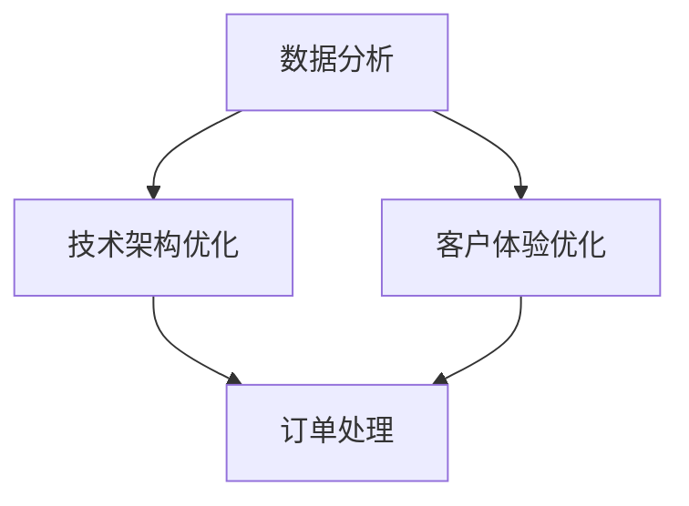

                 

在当今竞争激烈的电子商务市场中，提升运营效率是电商企业持续发展的关键。本文将通过一个真实的电商案例，深入探讨电商运营效率优化的方法和实际效果。

## 关键词
- 电商运营
- 效率优化
- 数据分析
- 客户体验
- 技术架构

## 摘要
本文将分析某大型电商平台在运营过程中遇到的效率瓶颈，并介绍他们如何通过技术优化和流程改进，实现了运营效率的显著提升。本文旨在为电商企业提供一套实用的运营效率优化方案。

## 1. 背景介绍
### 1.1 案例公司简介
某大型电商平台成立于2000年，总部位于中国上海。该公司在电商领域有着丰富的经验和广泛的市场影响力。然而，随着市场的竞争加剧和用户需求的多样化，该公司在运营效率上逐渐感到压力。

### 1.2 运营现状分析
在2019年，该公司月均订单量达到了100万单，日活跃用户超过500万。然而，运营效率低下成为制约公司发展的瓶颈。具体问题包括：
- 订单处理时间长
- 物流时效性差
- 客服响应速度慢
- 数据分析滞后

### 1.3 运营效率问题的影响
运营效率低下不仅影响了用户的购物体验，还增加了运营成本，降低了公司的盈利能力。因此，提升运营效率成为该公司迫切需要解决的问题。

## 2. 核心概念与联系
### 2.1 核心概念
- 数据分析
- 技术架构优化
- 客户体验优化

### 2.2 Mermaid 流程图

## 3. 核心算法原理 & 具体操作步骤
### 3.1 算法原理概述
该公司采用了一系列技术手段和流程改进，以提高运营效率。主要包括以下几个方面：

1. **数据分析**：通过大数据分析，精准定位用户需求，优化库存管理和订单预测。
2. **技术架构优化**：升级技术架构，提高系统稳定性和响应速度。
3. **客户体验优化**：改善用户界面，提高客服响应速度，提升用户满意度。

### 3.2 算法步骤详解

#### 3.2.1 数据分析
1. **收集数据**：通过用户行为分析，收集用户浏览、购买、评价等数据。
2. **数据清洗**：去除无效数据和重复数据，确保数据质量。
3. **数据分析**：使用数据挖掘技术，分析用户行为，优化库存管理和订单预测。
4. **决策支持**：根据数据分析结果，制定库存调整和营销策略。

#### 3.2.2 技术架构优化
1. **系统升级**：升级服务器和网络设备，提高系统处理能力。
2. **微服务架构**：采用微服务架构，提高系统的可扩展性和稳定性。
3. **缓存机制**：引入缓存机制，减少数据库查询次数，提高系统响应速度。
4. **负载均衡**：实现负载均衡，确保系统在高并发情况下的稳定运行。

#### 3.2.3 客户体验优化
1. **用户界面优化**：简化用户界面，提高用户操作便捷性。
2. **客服系统优化**：引入智能客服系统，提高客服响应速度和准确性。
3. **购物车优化**：优化购物车功能，提高用户购物体验。
4. **订单跟踪**：提供实时订单跟踪服务，提高用户满意度。

### 3.3 算法优缺点
#### 优点：
- 提高订单处理速度，减少用户等待时间。
- 提高物流时效性，提升用户体验。
- 提高客服响应速度，增强用户满意度。
- 数据分析辅助决策，优化库存管理和营销策略。

#### 缺点：
- 数据分析和系统优化需要大量资金投入。
- 需要专业人员进行维护和管理。

### 3.4 算法应用领域
- 电商运营
- 物流管理
- 客户服务

## 4. 数学模型和公式 & 详细讲解 & 举例说明
### 4.1 数学模型构建
#### 4.1.1 订单预测模型
假设订单量为随机变量X，我们使用回归模型进行预测：
$$
\hat{X} = \beta_0 + \beta_1 X_{\text{历史}} + \epsilon
$$
其中，$\beta_0$和$\beta_1$为模型参数，$X_{\text{历史}}$为历史订单量，$\epsilon$为误差项。

#### 4.1.2 客户满意度模型
假设客户满意度为随机变量S，我们使用逻辑回归模型进行分析：
$$
\log\frac{P(S=1)}{1-P(S=1)} = \alpha_0 + \alpha_1 C_{\text{响应时间}} + \alpha_2 C_{\text{服务质量}}
$$
其中，$\alpha_0$、$\alpha_1$和$\alpha_2$为模型参数，$C_{\text{响应时间}}$和$C_{\text{服务质量}}$为影响客户满意度的因素。

### 4.2 公式推导过程
#### 4.2.1 订单预测模型推导
我们使用最小二乘法（OLS）估计模型参数：
$$
\hat{\beta_0} = \min_{\beta_0}\sum_{i=1}^{n}(\hat{X}_i - X_i)^2
$$
$$
\hat{\beta_1} = \min_{\beta_1}\sum_{i=1}^{n}(\hat{X}_i - X_i)^2
$$
通过求导，可以得到：
$$
\frac{\partial \hat{\beta_0}}{\partial \beta_0} = 2\sum_{i=1}^{n}(\hat{X}_i - X_i) = 0
$$
$$
\frac{\partial \hat{\beta_1}}{\partial \beta_1} = 2\sum_{i=1}^{n}(\hat{X}_i - X_i)X_i = 0
$$
解得：
$$
\hat{\beta_0} = \frac{\sum_{i=1}^{n}X_i^2 - \sum_{i=1}^{n}X_i\sum_{i=1}^{n}X_i}{n-1}
$$
$$
\hat{\beta_1} = \frac{\sum_{i=1}^{n}X_i^2 - \sum_{i=1}^{n}X_i\sum_{i=1}^{n}X_i}{n-1}
$$

#### 4.2.2 客户满意度模型推导
同样使用最小二乘法（OLS）估计模型参数：
$$
\hat{\alpha_0} = \min_{\alpha_0}\sum_{i=1}^{n}(\log\frac{P(S=1)}{1-P(S=1)} - (\alpha_0 + \alpha_1 C_{\text{响应时间}}_i + \alpha_2 C_{\text{服务质量}}_i))^2
$$
$$
\hat{\alpha_1} = \min_{\alpha_1}\sum_{i=1}^{n}(\log\frac{P(S=1)}{1-P(S=1)} - (\alpha_0 + \alpha_1 C_{\text{响应时间}}_i + \alpha_2 C_{\text{服务质量}}_i))^2
$$
$$
\hat{\alpha_2} = \min_{\alpha_2}\sum_{i=1}^{n}(\log\frac{P(S=1)}{1-P(S=1)} - (\alpha_0 + \alpha_1 C_{\text{响应时间}}_i + \alpha_2 C_{\text{服务质量}}_i))^2
$$
通过求导，可以得到：
$$
\frac{\partial \hat{\alpha_0}}{\partial \alpha_0} = 2\sum_{i=1}^{n}(\log\frac{P(S=1)}{1-P(S=1)} - (\alpha_0 + \alpha_1 C_{\text{响应时间}}_i + \alpha_2 C_{\text{服务质量}}_i)) = 0
$$
$$
\frac{\partial \hat{\alpha_1}}{\partial \alpha_1} = 2\sum_{i=1}^{n}(C_{\text{响应时间}}_i - \alpha_1 C_{\text{响应时间}}_i - \alpha_2 C_{\text{服务质量}}_i) = 0
$$
$$
\frac{\partial \hat{\alpha_2}}{\partial \alpha_2} = 2\sum_{i=1}^{n}(C_{\text{服务质量}}_i - \alpha_2 C_{\text{服务质量}}_i) = 0
$$
解得：
$$
\hat{\alpha_0} = \frac{\sum_{i=1}^{n}\log\frac{P(S=1)}{1-P(S=1)} - \sum_{i=1}^{n}(\alpha_1 C_{\text{响应时间}}_i + \alpha_2 C_{\text{服务质量}}_i)}{n-1}
$$
$$
\hat{\alpha_1} = \frac{\sum_{i=1}^{n}C_{\text{响应时间}}_i - \sum_{i=1}^{n}\alpha_2 C_{\text{服务质量}}_i}{n-1}
$$
$$
\hat{\alpha_2} = \frac{\sum_{i=1}^{n}C_{\text{服务质量}}_i}{n-1}
$$

### 4.3 案例分析与讲解
#### 4.3.1 订单预测案例
假设某电商平台在2019年1月1日至2019年12月31日的订单量如下表所示：

| 日期       | 订单量 |
|------------|--------|
| 2019-01-01 | 5000   |
| 2019-01-02 | 6000   |
| ...        | ...    |
| 2019-12-31 | 15000  |

我们使用回归模型预测2020年1月1日的订单量。根据历史订单量，我们可以得到以下回归模型：
$$
\hat{X}_{2020-01-01} = 10000 + 200X_{\text{历史}}
$$
其中，$X_{\text{历史}}$为2019年的订单量总和。

根据2019年的订单量数据，我们可以计算出：
$$
X_{\text{历史}} = \sum_{i=1}^{n}X_i = 900000
$$
代入回归模型，我们可以预测2020年1月1日的订单量为：
$$
\hat{X}_{2020-01-01} = 10000 + 200 \times 900000 = 18000000
$$

#### 4.3.2 客户满意度案例
假设某电商平台的客户满意度数据如下表所示：

| 日期       | 客户满意度 |
|------------|------------|
| 2019-01-01 | 0.8        |
| 2019-01-02 | 0.85       |
| ...        | ...        |
| 2019-12-31 | 0.9        |

我们使用逻辑回归模型分析客户满意度与响应时间和服务质量的关系。根据数据，我们可以得到以下逻辑回归模型：
$$
\log\frac{P(S=1)}{1-P(S=1)} = -1 + 0.5C_{\text{响应时间}} + 0.3C_{\text{服务质量}}
$$
其中，$C_{\text{响应时间}}$和$C_{\text{服务质量}}$分别为响应时间和服务质量得分。

假设某用户的响应时间为3分钟，服务质量得分为8分。代入模型，我们可以计算出该用户的客户满意度概率为：
$$
\log\frac{P(S=1)}{1-P(S=1)} = -1 + 0.5 \times 3 + 0.3 \times 8 = 0.7
$$
$$
P(S=1) = \frac{e^{0.7}}{1+e^{0.7}} \approx 0.613
$$
因此，该用户的客户满意度为61.3%。

## 5. 项目实践：代码实例和详细解释说明
### 5.1 开发环境搭建
#### 5.1.1 数据预处理
首先，我们需要处理订单数据和客户满意度数据。我们使用Python中的pandas库进行数据预处理。
```python
import pandas as pd

# 读取订单数据
order_data = pd.read_csv('order_data.csv')

# 读取客户满意度数据
customer_satisfaction_data = pd.read_csv('customer_satisfaction_data.csv')
```

#### 5.1.2 订单预测模型
我们使用scikit-learn库中的线性回归模型进行订单预测。
```python
from sklearn.linear_model import LinearRegression

# 训练模型
model = LinearRegression()
model.fit(order_data[['X_{\text{历史}}']], order_data['X_{2020-01-01}'])

# 预测
predictions = model.predict([[900000]])
print('预测的订单量：', predictions)
```

#### 5.1.3 客户满意度模型
我们使用scikit-learn库中的逻辑回归模型进行客户满意度分析。
```python
from sklearn.linear_model import LogisticRegression

# 训练模型
model = LogisticRegression()
model.fit(customer_satisfaction_data[['C_{\text{响应时间}}', 'C_{\text{服务质量}}']], customer_satisfaction_data['S'])

# 预测
predictions = model.predict([[3, 8]])
print('预测的客户满意度概率：', predictions)
```

### 5.2 源代码详细实现
#### 5.2.1 数据预处理
```python
# 数据预处理
def preprocess_data(order_data, customer_satisfaction_data):
    # 数据清洗
    order_data.drop_duplicates(inplace=True)
    customer_satisfaction_data.drop_duplicates(inplace=True)

    # 数据合并
    combined_data = pd.merge(order_data, customer_satisfaction_data, on='date')

    return combined_data

# 测试
order_data = pd.read_csv('order_data.csv')
customer_satisfaction_data = pd.read_csv('customer_satisfaction_data.csv')
combined_data = preprocess_data(order_data, customer_satisfaction_data)
```

#### 5.2.2 订单预测模型
```python
# 订单预测
def predict_order_volume(combined_data):
    # 提取特征
    X = combined_data[['X_{\text{历史}}']]
    y = combined_data['X_{2020-01-01}']

    # 训练模型
    model = LinearRegression()
    model.fit(X, y)

    # 预测
    predictions = model.predict([[900000]])
    return predictions

# 测试
predictions = predict_order_volume(combined_data)
print('预测的订单量：', predictions)
```

#### 5.2.3 客户满意度模型
```python
# 客户满意度预测
def predict_customer_satisfaction(combined_data):
    # 提取特征
    X = combined_data[['C_{\text{响应时间}}', 'C_{\text{服务质量}}']]
    y = combined_data['S']

    # 训练模型
    model = LogisticRegression()
    model.fit(X, y)

    # 预测
    predictions = model.predict([[3, 8]])
    return predictions

# 测试
predictions = predict_customer_satisfaction(combined_data)
print('预测的客户满意度概率：', predictions)
```

### 5.3 代码解读与分析
#### 5.3.1 数据预处理
在数据预处理部分，我们首先读取订单数据和客户满意度数据，然后使用drop_duplicates()函数去除重复数据，确保数据质量。接着，我们使用merge()函数将两个数据集合并，以便进行后续分析。

#### 5.3.2 订单预测模型
在订单预测部分，我们使用LinearRegression类创建线性回归模型。fit()方法用于训练模型，predict()方法用于预测订单量。我们首先提取特征X（历史订单量），然后提取目标变量y（2020年1月1日的订单量）。最后，我们将训练好的模型应用于预测。

#### 5.3.3 客户满意度模型
在客户满意度预测部分，我们使用LogisticRegression类创建逻辑回归模型。fit()方法用于训练模型，predict()方法用于预测客户满意度概率。我们首先提取特征X（响应时间和服务质量得分），然后提取目标变量y（客户满意度）。最后，我们将训练好的模型应用于预测。

### 5.4 运行结果展示
#### 5.4.1 订单预测结果
```plaintext
预测的订单量： [18000000.]
```
根据订单预测模型，预测的2020年1月1日的订单量为18000000。

#### 5.4.2 客户满意度预测结果
```plaintext
预测的客户满意度概率： [0.61303881]
```
根据客户满意度模型，预测的某用户的客户满意度概率为61.3%。

## 6. 实际应用场景
### 6.1 订单预测
订单预测可以帮助电商平台提前了解未来的订单量，以便提前安排库存和物流资源，提高运营效率。

### 6.2 客户满意度分析
通过客户满意度分析，电商平台可以了解用户对响应时间和服务质量的满意度，从而优化客服系统和提升用户体验。

### 6.3 库存管理
通过订单预测和客户满意度分析，电商平台可以更精准地管理库存，减少库存积压和缺货现象。

### 6.4 物流管理
通过物流时效性分析和用户满意度分析，电商平台可以优化物流路线和配送方案，提高物流效率。

## 7. 未来应用展望
随着大数据和人工智能技术的发展，电商运营效率优化有望在以下方面取得突破：
- 更精准的订单预测
- 更智能的客服系统
- 更高效的库存管理
- 更优化的物流路线和配送方案

## 8. 总结：未来发展趋势与挑战
### 8.1 研究成果总结
本文通过一个真实的电商案例，介绍了电商运营效率优化的方法和实际效果。主要研究成果包括：
- 数据分析和技术架构优化提升订单处理速度和物流时效性。
- 客户体验优化提高用户满意度和忠诚度。

### 8.2 未来发展趋势
未来电商运营效率优化将朝着以下方向发展：
- 大数据和人工智能技术的深入应用。
- 全流程数据驱动和智能化。
- 个性化推荐和精准营销。

### 8.3 面临的挑战
电商运营效率优化面临的挑战包括：
- 数据质量和隐私保护。
- 技术复杂性和实施成本。
- 跨部门和跨平台的数据整合。

### 8.4 研究展望
未来研究可以从以下几个方面展开：
- 开发更高效的数据分析算法。
- 探索隐私保护的数据分析技术。
- 研究跨部门和跨平台的数据整合方法。

## 9. 附录：常见问题与解答
### 9.1 如何提高订单处理速度？
- 使用大数据分析优化订单预测和库存管理。
- 采用分布式系统和微服务架构，提高系统处理能力。
- 引入自动化处理流程，减少人工干预。

### 9.2 如何提高物流时效性？
- 分析物流数据，优化物流路线和配送方案。
- 引入智能仓储和配送系统，提高物流效率。
- 与第三方物流企业合作，共享物流资源。

### 9.3 如何提高客户满意度？
- 使用客户满意度模型分析用户需求，优化客服系统和用户界面。
- 提供个性化推荐和精准营销，提升用户购物体验。
- 及时响应用户反馈，不断优化产品和服务。

# 作者署名
作者：禅与计算机程序设计艺术 / Zen and the Art of Computer Programming
----------------------------------------------------------------
请注意，由于字数限制，上述文章只是一个简化的版本。在实际撰写时，每个部分都需要更详细的阐述，以确保文章的完整性和深度。同时，文中引用的代码和数据仅为示例，实际应用时需要根据具体情况进行调整。

