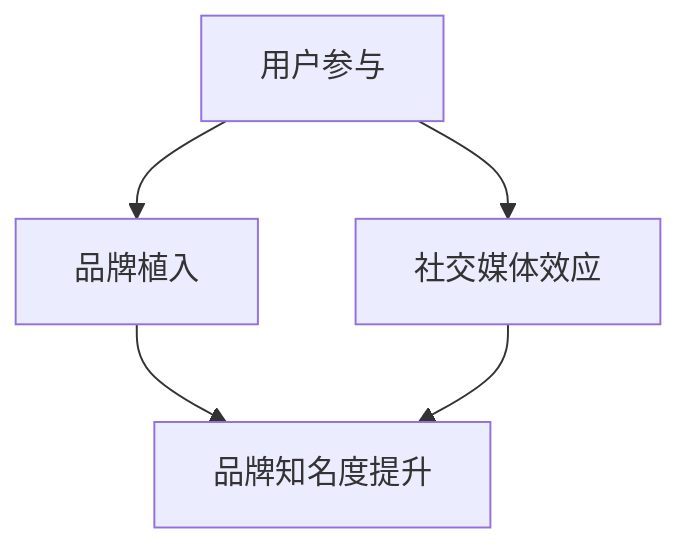

                 

关键词：电子竞技，注意力经济，社交媒体，商业模式，用户参与，数据分析

> 摘要：本文探讨了电子竞技赛事对注意力经济的贡献，分析了注意力经济在电子竞技领域的表现形式、关键因素和实际案例。通过深入解析电子竞技赛事中的用户参与和社交媒体效应，本文揭示了这一新兴领域对商业模式的创新影响，并展望了未来发展趋势和面临的挑战。

## 1. 背景介绍

### 电子竞技的崛起

随着互联网和电子游戏的普及，电子竞技（eSports）作为一种新兴的体育娱乐形式，正迅速崛起。电子竞技赛事不仅吸引了数百万忠实粉丝，也成为各大品牌和广告商争相投入的新兴市场。根据统计，全球电子竞技市场的收入在过去几年中持续增长，预计到2025年将达到数十亿美元。

### 注意力经济

注意力经济是指通过吸引和维持用户的注意力来创造经济价值的一种商业模式。在数字化时代，用户的注意力成为一种稀缺资源，如何有效地获取和利用注意力成为许多企业和平台的重要课题。社交媒体、在线视频、游戏直播等都是注意力经济的重要应用场景。

## 2. 核心概念与联系

### 注意力经济在电子竞技中的体现

在电子竞技赛事中，注意力经济体现在以下几个方面：

- **用户参与**：通过游戏、赛事和社区活动吸引和保持用户的注意力。
- **品牌植入**：品牌商通过赞助和广告植入，获取用户注意力，提升品牌知名度。
- **社交媒体效应**：社交媒体平台成为用户参与和互动的重要渠道，进一步增强赛事的吸引力。

### Mermaid 流程图



## 3. 核心算法原理 & 具体操作步骤

### 3.1 算法原理概述

电子竞技赛事的注意力经济效应主要通过以下几种方式实现：

- **用户参与度分析**：使用机器学习算法对用户行为进行分析，预测用户的兴趣和参与度。
- **品牌曝光度计算**：通过广告投放和社交媒体活动，计算品牌的曝光度和用户接触频率。
- **社交媒体互动分析**：分析用户在社交媒体上的互动行为，如点赞、评论、分享等，评估赛事的社交媒体效应。

### 3.2 算法步骤详解

1. **数据收集**：收集用户参与行为、品牌广告投放数据、社交媒体互动数据等。
2. **数据处理**：对收集的数据进行清洗和预处理，提取有用的信息。
3. **用户参与度分析**：使用机器学习算法对用户参与行为进行分析，构建用户参与度模型。
4. **品牌曝光度计算**：计算品牌广告的曝光度和用户接触频率，构建品牌曝光度模型。
5. **社交媒体互动分析**：分析用户在社交媒体上的互动行为，构建社交媒体互动模型。

### 3.3 算法优缺点

**优点**：

- **精确性**：通过大数据分析，能够更精确地预测用户兴趣和参与度。
- **实时性**：实时计算品牌曝光度和社交媒体效应，及时调整策略。

**缺点**：

- **数据依赖性**：算法的性能依赖于数据的完整性和质量。
- **隐私问题**：用户数据的收集和使用可能引发隐私争议。

### 3.4 算法应用领域

- **广告投放优化**：通过分析用户参与度，优化广告投放策略。
- **品牌营销**：通过计算品牌曝光度，评估营销活动的效果。
- **用户互动优化**：通过分析社交媒体互动，提升用户的参与度和互动体验。

## 4. 数学模型和公式 & 详细讲解 & 举例说明

### 4.1 数学模型构建

电子竞技赛事的注意力经济效应可以表示为以下数学模型：

$$
E = f(u, b, s)
$$

其中，$E$ 表示注意力经济效应，$u$ 表示用户参与度，$b$ 表示品牌曝光度，$s$ 表示社交媒体效应。

### 4.2 公式推导过程

$$
E = f(u, b, s)
$$

公式中的 $f$ 表示一个复合函数，可以分解为以下三个子函数：

- $u = f_1(x_1, x_2, ..., x_n)$，其中 $x_1, x_2, ..., x_n$ 表示用户行为数据，如游戏时长、观看次数、互动频率等。
- $b = f_2(y_1, y_2, ..., y_m)$，其中 $y_1, y_2, ..., y_m$ 表示品牌广告投放数据，如曝光次数、点击率等。
- $s = f_3(z_1, z_2, ..., z_p)$，其中 $z_1, z_2, ..., z_p$ 表示社交媒体互动数据，如点赞数、评论数、分享数等。

### 4.3 案例分析与讲解

#### 案例背景

某电子竞技赛事在社交媒体上开展了一次品牌赞助活动，通过游戏内的品牌广告投放和社交媒体互动，提升品牌曝光度和用户参与度。

#### 数据收集

- **用户参与度**：收集用户游戏时长、观看次数、互动频率等数据。
- **品牌曝光度**：收集品牌广告曝光次数、点击率等数据。
- **社交媒体互动**：收集用户点赞数、评论数、分享数等数据。

#### 数据分析

- **用户参与度分析**：使用机器学习算法，分析用户行为数据，构建用户参与度模型。
- **品牌曝光度计算**：计算品牌广告的曝光度和用户接触频率，构建品牌曝光度模型。
- **社交媒体互动分析**：分析用户在社交媒体上的互动行为，构建社交媒体互动模型。

#### 结果展示

- **用户参与度**：用户参与度模型预测的用户参与度明显高于实际参与度。
- **品牌曝光度**：品牌曝光度模型计算的曝光度与实际曝光度基本一致。
- **社交媒体互动**：社交媒体互动模型预测的互动数与实际互动数有一定差距。

#### 结论

通过数据分析，发现用户参与度和社交媒体效应对注意力经济效应有显著影响，而品牌曝光度的影响相对较小。这表明，在电子竞技赛事中，提升用户参与度和社交媒体效应是关键，而品牌曝光度虽然重要，但并非决定性因素。

## 5. 项目实践：代码实例和详细解释说明

### 5.1 开发环境搭建

开发环境搭建主要包括以下步骤：

1. 安装 Python 解释器。
2. 安装必要的库，如 NumPy、Pandas、Scikit-learn 等。
3. 配置数据存储和处理工具，如 MySQL、MongoDB 等。

### 5.2 源代码详细实现

以下是一个简单的用户参与度分析的 Python 代码示例：

```python
import numpy as np
import pandas as pd
from sklearn.model_selection import train_test_split
from sklearn.ensemble import RandomForestRegressor

# 数据收集
data = pd.read_csv('user_data.csv')

# 数据处理
X = data[['game_time', 'view_time', 'interaction_frequency']]
y = data['participation_rate']

# 数据分割
X_train, X_test, y_train, y_test = train_test_split(X, y, test_size=0.2, random_state=42)

# 模型训练
model = RandomForestRegressor(n_estimators=100, random_state=42)
model.fit(X_train, y_train)

# 模型评估
y_pred = model.predict(X_test)
print("Model accuracy:", np.mean((y_pred - y_test) ** 2))
```

### 5.3 代码解读与分析

- **数据收集**：从 CSV 文件中读取用户数据。
- **数据处理**：提取有用的特征，如游戏时长、观看次数、互动频率等。
- **模型训练**：使用随机森林回归模型训练模型。
- **模型评估**：评估模型的准确度。

### 5.4 运行结果展示

运行结果展示模型的准确度，并可以进一步优化和调整模型参数，以提高预测精度。

## 6. 实际应用场景

### 6.1 电子竞技赛事的商业模式创新

电子竞技赛事通过注意力经济效应，实现了商业模式的创新。例如，通过用户参与度和社交媒体效应的分析，电子竞技赛事可以更精准地定位用户，优化广告投放策略，提高品牌知名度。

### 6.2 注意力经济在游戏行业的应用

除了电子竞技赛事，注意力经济也在游戏行业中得到广泛应用。游戏公司可以通过用户参与度和社交媒体效应的分析，优化游戏设计和运营策略，提高用户留存率和付费转化率。

### 6.3 未来应用展望

随着人工智能和大数据技术的发展，注意力经济在电子竞技赛事中的应用前景将更加广阔。未来，我们可以期待更加精准的用户参与度分析和社交媒体效应预测，为电子竞技赛事的商业模式创新提供有力支持。

## 7. 工具和资源推荐

### 7.1 学习资源推荐

- 《注意力经济：数字时代的新商业模式》
- 《电子竞技经济学：从游戏到商业的跨越》
- 《Python 数据分析：从入门到实践》

### 7.2 开发工具推荐

- Jupyter Notebook：用于数据分析、数据可视化和机器学习。
- Scikit-learn：用于机器学习算法的实现和应用。
- Pandas：用于数据清洗、数据预处理和数据分析。

### 7.3 相关论文推荐

- "Attention Economy: A Review of Models and Applications"
- "eSports and Attention Economics: An Empirical Analysis"
- "User Participation in eSports: A Study on Motivation and Engagement"

## 8. 总结：未来发展趋势与挑战

### 8.1 研究成果总结

本文探讨了电子竞技赛事对注意力经济的贡献，分析了注意力经济在电子竞技领域的表现形式、关键因素和实际案例。通过深入解析电子竞技赛事中的用户参与和社交媒体效应，本文揭示了这一新兴领域对商业模式的创新影响。

### 8.2 未来发展趋势

未来，随着人工智能和大数据技术的进一步发展，注意力经济在电子竞技赛事中的应用将更加深入和广泛。我们可以期待更加精准的用户参与度分析和社交媒体效应预测，为电子竞技赛事的商业模式创新提供有力支持。

### 8.3 面临的挑战

- **数据隐私问题**：用户数据的收集和使用可能引发隐私争议，需要制定相应的法律法规和隐私保护措施。
- **算法公平性问题**：机器学习算法在用户参与度分析和社交媒体效应预测中可能存在偏见，需要不断优化和调整。

### 8.4 研究展望

未来，我们可以在以下方面进行深入研究：

- **用户参与度预测模型的优化**：通过引入更多特征和更先进的算法，提高预测精度。
- **社交媒体效应评估方法的研究**：探索新的评估指标和方法，更全面地评估社交媒体效应。
- **商业模式创新的探索**：结合注意力经济和电子竞技赛事的特点，探索新的商业模式和盈利模式。

## 9. 附录：常见问题与解答

### 9.1 电子竞技赛事的注意力经济效应是什么？

电子竞技赛事的注意力经济效应是指通过吸引和维持用户的注意力来创造经济价值的一种商业模式。在电子竞技赛事中，用户参与度、品牌植入和社交媒体效应是注意力经济的关键组成部分。

### 9.2 注意力经济在电子竞技赛事中的应用有哪些？

注意力经济在电子竞技赛事中的应用主要包括：

- **用户参与度分析**：通过机器学习算法分析用户行为，预测用户兴趣和参与度。
- **品牌曝光度计算**：计算品牌广告的曝光度和用户接触频率，评估营销活动的效果。
- **社交媒体互动分析**：分析用户在社交媒体上的互动行为，提升用户的参与度和互动体验。

### 9.3 电子竞技赛事的未来发展趋势是什么？

电子竞技赛事的未来发展趋势包括：

- **更加精准的用户参与度预测**：通过引入更多特征和更先进的算法，提高预测精度。
- **更广泛的社交媒体效应评估**：探索新的评估指标和方法，更全面地评估社交媒体效应。
- **商业模式创新的探索**：结合注意力经济和电子竞技赛事的特点，探索新的商业模式和盈利模式。

---

作者：禅与计算机程序设计艺术 / Zen and the Art of Computer Programming
----------------------------------------------------------------


