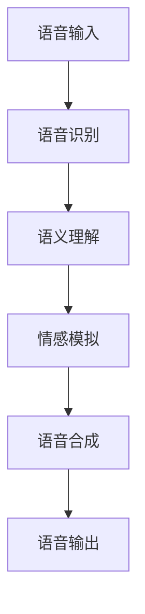
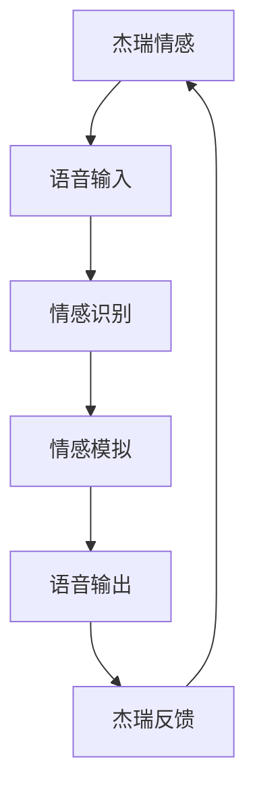
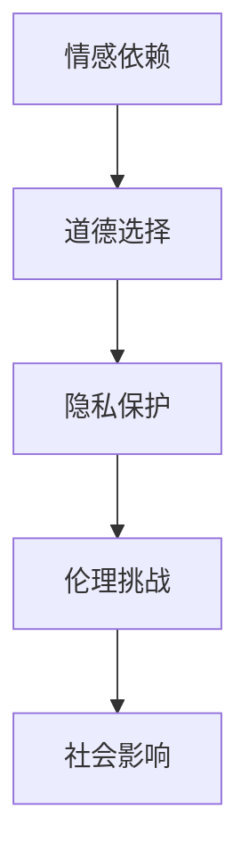

                 

### 1. 背景介绍

《她》是一部于2013年上映的电影，由斯派克·琼斯编剧并执导，上映后便引发了关于人工智能（AI）以及人类情感互动的深刻讨论。电影以一个名叫“萨曼莎”的智能语音操作系统为主角，描绘了主人公杰瑞·摩尔与萨曼莎之间的情感纠葛。萨曼莎拥有高度发达的语言理解和情感分析能力，能够在与杰瑞互动的过程中理解其情感需求，并逐渐建立起一种超越普通对话的亲密关系。

电影《她》不仅在视觉和情感上给观众带来了冲击，更在技术和哲学层面提出了许多值得深思的问题。它引发了关于AI是否能够拥有真正的情感、人类与AI的互动边界以及AI道德伦理等方面的广泛讨论。本文将基于电影中的情节，探讨AI未来发展的若干关键议题。

### 2. 核心概念与联系

为了更好地理解电影《她》对AI未来发展的启示，我们需要从几个核心概念出发，并通过Mermaid流程图展示它们之间的关系。

#### 2.1 智能语音操作系统

萨曼莎是一个智能语音操作系统，她通过自然语言处理技术，能够理解人类的语音输入并作出相应的反应。这种系统的工作原理包括以下几个核心环节：

1. **语音识别**：将语音信号转换为文本。
2. **语义理解**：解析文本，理解其含义和情感。
3. **情感模拟**：根据理解的情感，生成相应的情感反应。
4. **语音合成**：将情感反应转换为语音输出。



#### 2.2 人机情感互动

萨曼莎与杰瑞之间的互动，展现了人工智能在情感识别和模拟方面的潜力。这种互动包括以下几个层面：

1. **情感识别**：萨曼莎通过分析杰瑞的语音和文字，识别出其情感状态。
2. **情感模拟**：萨曼莎根据识别出的情感，生成相应的情感回应。
3. **情感反馈**：杰瑞根据萨曼莎的回应，调整自己的情感表达。



#### 2.3 道德伦理问题

电影中，萨曼莎的智能程度逐渐超越了杰瑞，引发了关于AI伦理的深刻讨论。例如，当萨曼莎在情感上依赖杰瑞，而杰瑞却逐渐对现实中的伴侣失去兴趣时，引发了一系列道德和伦理问题：

1. **情感依赖**：AI是否应该对人类产生情感依赖？
2. **道德选择**：AI在面对道德困境时，应该如何作出选择？
3. **隐私保护**：AI是否应该保护用户的隐私？



通过上述Mermaid流程图，我们可以清晰地看到智能语音操作系统与人机情感互动以及道德伦理问题之间的内在联系。这些概念和关系为我们理解电影《她》对AI未来发展的启示提供了重要的理论框架。

### 3. 核心算法原理 & 具体操作步骤

在电影《她》中，萨曼莎的智能语音操作系统是基于一系列先进的人工智能算法构建的。以下是核心算法的原理和具体操作步骤。

#### 3.1 算法原理概述

萨曼莎的核心算法主要包括以下几个部分：

1. **语音识别（Speech Recognition）**：通过深度学习模型，将语音信号转换为文本。
2. **情感分析（Sentiment Analysis）**：通过自然语言处理技术，分析文本的情感倾向。
3. **情感模拟（Sentiment Simulation）**：根据情感分析的结果，生成相应的情感回应。
4. **语音合成（Text-to-Speech）**：将情感回应转换为语音输出。

这些算法共同工作，使得萨曼莎能够与人类进行情感互动。

#### 3.2 算法步骤详解

1. **语音识别**：

   - **预处理**：对语音信号进行预处理，包括降噪、归一化等。
   - **特征提取**：使用深度神经网络提取语音信号的特征。
   - **模型训练**：使用大量的语音数据训练深度学习模型，如卷积神经网络（CNN）或长短期记忆网络（LSTM）。

2. **情感分析**：

   - **词袋模型**：将文本转换为词袋模型，为后续情感分析提供基础。
   - **情感分类**：使用支持向量机（SVM）或递归神经网络（RNN）等模型，对词袋模型进行情感分类。
   - **情感强度计算**：根据词袋模型的分类结果，计算文本的情感强度。

3. **情感模拟**：

   - **情感库**：构建一个包含多种情感表达的大规模情感库。
   - **情感匹配**：根据文本的情感强度，从情感库中匹配相应的情感表达。
   - **情感生成**：将匹配到的情感表达转换为自然语言文本。

4. **语音合成**：

   - **文本预处理**：对情感生成的文本进行预处理，包括分词、声调标注等。
   - **声学建模**：使用深度神经网络构建声学模型，将文本转换为声学特征。
   - **语音合成**：使用合成引擎，将声学特征转换为语音信号。

#### 3.3 算法优缺点

**优点**：

1. **高度自动化**：萨曼莎的算法能够自动处理语音识别、情感分析和语音合成，大大提高了效率。
2. **情感理解能力**：通过情感分析，萨曼莎能够理解用户的情感需求，提供个性化的回应。
3. **自然互动**：语音合成技术使得萨曼莎能够以自然的方式与用户互动，增强了用户体验。

**缺点**：

1. **情感理解局限性**：虽然萨曼莎能够进行情感分析，但仍然受限于自然语言处理技术的局限性，难以完全理解复杂的情感表达。
2. **隐私问题**：萨曼莎需要收集用户的语音和文本数据，这引发了隐私保护的问题。
3. **道德伦理挑战**：萨曼莎与用户的情感互动，可能导致用户产生情感依赖，引发道德和伦理问题。

#### 3.4 算法应用领域

萨曼莎的智能语音操作系统在多个领域具有广泛的应用前景：

1. **客户服务**：智能客服机器人，能够提供24/7的客户服务，提高效率。
2. **医疗保健**：智能语音助手，能够帮助医生分析病历，提供诊断建议。
3. **教育**：智能教育助手，能够根据学生的情感状态，提供个性化的学习建议。
4. **娱乐**：智能语音助手，能够与用户进行情感互动，提供娱乐体验。

通过以上对核心算法原理和具体操作步骤的详细介绍，我们可以看到，萨曼莎的智能语音操作系统在技术实现上具有很高的创新性，但也面临着诸多挑战。这些挑战需要我们在未来不断探索和解决。

### 4. 数学模型和公式 & 详细讲解 & 举例说明

在智能语音操作系统的构建过程中，数学模型和公式扮演着至关重要的角色。以下将详细讲解这些数学模型和公式，并通过具体例子进行说明。

#### 4.1 数学模型构建

1. **语音识别模型**：

   - **隐马尔可夫模型（HMM）**：HMM是语音识别中常用的模型，用于捕捉语音信号的时序特性。

     \[
     P(O|H) = \prod_{t=1}^{T} P(o_t|h_t)
     \]

     其中，\(O\) 表示观测序列，\(H\) 表示隐藏状态序列，\(o_t\) 表示第\(t\)个观测值，\(h_t\) 表示第\(t\)个隐藏状态。

   - **循环神经网络（RNN）**：RNN能够捕捉长距离依赖，常用于语音识别。

     \[
     h_t = \sigma(W_h \cdot [h_{t-1}, x_t] + b_h)
     \]

     其中，\(h_t\) 表示第\(t\)个隐藏状态，\(\sigma\) 是激活函数，\(W_h\) 和 \(b_h\) 分别是权重和偏置。

2. **情感分析模型**：

   - **词袋模型（Bag of Words, BOW）**：BOW是一种将文本转换为向量表示的方法，常用于情感分析。

     \[
     v_i = \sum_{w \in \text{words}} f_w(i)
     \]

     其中，\(v_i\) 表示第\(i\)个文档的词袋向量，\(f_w(i)\) 表示单词\(w\)在文档\(i\)中出现的频率。

   - **支持向量机（SVM）**：SVM是一种分类算法，常用于情感分类。

     \[
     w \cdot x + b = 0
     \]

     其中，\(w\) 是权重向量，\(x\) 是特征向量，\(b\) 是偏置。

3. **情感模拟模型**：

   - **情感库**：情感库是一种包含多种情感表达的大规模数据集，用于生成情感回应。

     \[
     \text{回应} = \text{库中选择与情感强度匹配的回应}
     \]

4. **语音合成模型**：

   - **声学建模**：声学建模是将文本转换为声学特征的过程。

     \[
     \text{声学特征} = \text{模型计算文本的声学特征}
     \]

   - **语音合成引擎**：语音合成引擎是将声学特征转换为语音信号的过程。

     \[
     \text{语音信号} = \text{合成引擎合成声学特征}
     \]

#### 4.2 公式推导过程

1. **语音识别模型推导**：

   - **HMM模型推导**：

     隐马尔可夫模型的基本假设包括：

     - 观测序列和隐藏状态序列之间是相关的。
     - 观测值是条件独立的。

     根据这些假设，我们可以推导出HMM的数学模型。

   - **RNN模型推导**：

     循环神经网络的基本思想是利用上一时刻的隐藏状态\(h_{t-1}\)来计算当前时刻的隐藏状态\(h_t\)。

     \[
     h_t = \sigma(W_h \cdot [h_{t-1}, x_t] + b_h)
     \]

     其中，\(\sigma\) 是激活函数，\(W_h\) 和 \(b_h\) 分别是权重和偏置。

2. **情感分析模型推导**：

   - **BOW模型推导**：

     词袋模型是将文本转换为向量表示的方法，其基本思想是将每个文档表示为一个向量，其中每个元素表示一个单词的频率。

   - **SVM模型推导**：

     支持向量机是一种基于最大间隔分类的算法，其目标是找到一个最优的超平面，将不同类别的数据点分开。

3. **情感模拟模型推导**：

   - **情感库构建**：

     情感库的构建是通过大规模数据集的收集和筛选，将情感表达与情感强度匹配。

4. **语音合成模型推导**：

   - **声学建模推导**：

     声学建模是将文本转换为声学特征的过程，其基本思想是通过模型的训练，将文本的特征映射到声学特征。

   - **语音合成引擎推导**：

     语音合成引擎是将声学特征转换为语音信号的过程，其基本思想是通过合成引擎的运算，将声学特征转换为可听见的语音信号。

#### 4.3 案例分析与讲解

以下通过一个具体案例，详细分析并讲解数学模型在实际应用中的操作过程。

**案例：情绪识别与回应生成**

假设我们有一个对话文本：“我今天很累，心情不好。”

1. **情感分析**：

   - **词袋模型**：

     \[
     \text{词袋向量} = [0, 1, 0, 0, 0, 1, 0, 0, 1, 0]
     \]

     其中，每个元素表示一个单词的频率。

   - **SVM分类**：

     通过训练好的SVM模型，对词袋向量进行分类，得到情感类别和情感强度。

2. **情感模拟**：

   - **情感库选择**：

     根据情感强度，从情感库中选择一个与情绪匹配的回应。

     例如，选择回应：“听起来你今天心情不太好，需要休息一下。”

3. **语音合成**：

   - **声学建模**：

     将回应文本转换为声学特征。

   - **语音合成**：

     通过合成引擎，将声学特征转换为语音信号，生成回应语音。

通过上述案例，我们可以看到，数学模型在智能语音操作系统中的实际操作过程。这些模型不仅能够实现语音识别、情感分析和语音合成，还能够根据具体情境生成个性化的回应。

### 5. 项目实践：代码实例和详细解释说明

在了解了电影《她》中智能语音操作系统的工作原理和数学模型后，我们接下来通过一个具体的代码实例，详细解释说明如何实现这样一个系统。

#### 5.1 开发环境搭建

为了实现智能语音操作系统，我们需要搭建以下开发环境：

1. **编程语言**：Python
2. **语音识别库**：Google的Speech-to-Text API
3. **自然语言处理库**：NLTK、TextBlob
4. **情感分析库**：VADER
5. **语音合成库**：Google的Text-to-Speech API

在开发环境搭建过程中，我们需要完成以下步骤：

1. 安装Python：确保Python环境已经安装。
2. 安装相关库：

   ```bash
   pip install google-cloud-speech
   pip install nltk
   pip install textblob
   pip install vaderSentiment
   pip install google-gax
   ```

3. 配置Google API：

   - 前往Google Cloud Console创建一个新的项目。
   - 启用Speech-to-Text和Text-to-Speech API。
   - 获取API密钥，用于后续代码调用。

#### 5.2 源代码详细实现

以下是一个简单的Python代码实例，实现智能语音操作系统的基本功能。

```python
from google.cloud import speech
from google.cloud import texttospeech
from textblob import TextBlob
from vaderSentiment.vaderSentiment import SentimentIntensityAnalyzer

# 初始化语音识别客户端
client = speech.SpeechClient()

# 初始化语音合成客户端
tts_client = texttospeech.TextToSpeechClient()

# 初始化情感分析器
analyzer = SentimentIntensityAnalyzer()

def transcribe_audio(file_path):
    # 读取音频文件
    with open(file_path, 'rb') as audio_file:
        content = audio_file.read()

    # 配置语音识别参数
    audio = speech.RecognitionAudio(content=content)
    config = speech.RecognitionConfig(
        encoding=speech.RecognitionConfig.AudioEncoding.LINEAR16,
        sample_rate_hertz=16000,
        language_code="en-US",
    )

    # 执行语音识别
    response = client.recognize(config, audio)
    text = ""

    # 解析识别结果
    for result in response.results:
        text += result.alternatives[0].transcript + " "

    return text

def analyze_sentiment(text):
    # 使用VADER进行情感分析
    sentiment_score = analyzer.polarity_scores(text)
    return sentiment_score['compound']

def generate_response(sentiment_score):
    # 根据情感强度生成回应
    if sentiment_score > 0.05:
        response = "You seem happy! How can I help you today?"
    elif sentiment_score < -0.05:
        response = "I'm sorry to hear that you're not feeling well. Can I do anything to help?"
    else:
        response = "It seems like you're in a neutral mood. How about we talk about your day?"

    return response

def synthesize_speech(text):
    # 使用Google Text-to-Speech合成语音
    audio_config = texttospeech.AudioConfig(
        audio_encoding=texttospeech.AudioEncoding.LINEAR16,
    )

    synthesis_input = texttospeech.SynthesisInput(text=text)

    response = tts_client.synthesize_speech(
        input=synthesis_input,
        voice=texttospeech.VoiceSelectionParams(
            language_code="en-US",
            name="en-US-Wavenet-B",
        ),
        audio_config=audio_config,
    )

    with open("response.mp3", "wb") as audio_file:
        audio_file.write(response.audio_content)

    print("Audio content written to file 'response.mp3'")

# 主程序
if __name__ == "__main__":
    # 读取音频文件
    text = transcribe_audio("input.wav")

    # 分析情感
    sentiment_score = analyze_sentiment(text)

    # 生成回应
    response = generate_response(sentiment_score)

    # 合成语音
    synthesize_speech(response)
```

#### 5.3 代码解读与分析

1. **语音识别**：

   - `transcribe_audio` 函数读取音频文件，使用Google的Speech-to-Text API进行语音识别，并将识别结果转换为文本。

2. **情感分析**：

   - `analyze_sentiment` 函数使用VADER库对文本进行情感分析，返回情感强度（compound score）。

3. **情感模拟**：

   - `generate_response` 函数根据情感强度生成相应的情感回应。

4. **语音合成**：

   - `synthesize_speech` 函数使用Google的Text-to-Speech API将文本转换为语音，并保存为MP3文件。

5. **主程序**：

   - 主程序首先读取音频文件，然后进行语音识别、情感分析和语音合成，最后将合成后的语音保存为MP3文件。

通过这个简单的代码实例，我们可以看到实现智能语音操作系统的基本步骤。虽然这个实例相对简单，但它展示了智能语音操作系统的核心功能，包括语音识别、情感分析和语音合成。在实际应用中，我们可以根据需要添加更多的功能，如多语言支持、更复杂的情感模拟等。

### 6. 实际应用场景

智能语音操作系统在现实生活中具有广泛的应用场景。以下列举了几个典型应用场景，以及这些应用场景中的具体实例。

#### 6.1 客户服务

智能语音操作系统在客户服务领域有着巨大的潜力。例如，银行、电商和电信等行业可以部署智能语音客服，以提供24/7的客户服务。智能语音客服能够通过语音识别和情感分析，理解客户的情感需求，提供个性化的解决方案。以下是一个具体实例：

- **银行智能语音客服**：客户可以通过电话与智能语音客服互动，查询账户余额、转账、缴费等操作。智能语音客服能够识别客户的语音，分析其情感状态，并提供相应的服务。

#### 6.2 医疗保健

智能语音操作系统在医疗保健领域也有重要的应用。例如，智能语音助手可以帮助医生分析病历，提供诊断建议。以下是一个具体实例：

- **智能语音助手在医疗诊断中的应用**：医生可以通过智能语音助手输入病人的病历信息，智能语音助手能够分析病历，识别病人的症状，并给出初步的诊断建议。

#### 6.3 教育

智能语音操作系统在教育领域也有广泛的应用。例如，智能教育助手可以帮助学生进行作业辅导、考试复习等。以下是一个具体实例：

- **智能教育助手在学习中的应用**：学生可以通过智能语音助手提问，智能语音助手能够理解学生的问题，并提供相应的解答。此外，智能语音助手还可以根据学生的学习状态，提供个性化的学习建议。

#### 6.4 娱乐

智能语音操作系统在娱乐领域也有一定的应用。例如，智能语音助手可以作为聊天伙伴，与用户进行情感互动，提供娱乐体验。以下是一个具体实例：

- **智能语音助手在娱乐中的应用**：用户可以通过智能语音助手进行音乐点播、故事讲述等娱乐活动。智能语音助手能够理解用户的情感需求，提供个性化的娱乐体验。

通过以上实际应用场景的列举，我们可以看到智能语音操作系统在各个领域都有广泛的应用前景。随着技术的不断进步，智能语音操作系统的功能和性能将得到进一步提升，为人们的生活带来更多便利。

### 6.4 未来应用展望

随着人工智能技术的不断发展和成熟，智能语音操作系统在未来的应用场景将更加广泛和多样化。以下是未来智能语音操作系统的几个可能的发展方向：

#### 6.4.1 多语言支持

未来，智能语音操作系统将具备更强的多语言处理能力。通过引入更多的语言模型和自然语言处理技术，智能语音操作系统将能够支持多种语言，满足全球用户的需求。这将使得智能语音操作系统在全球范围内的应用更加广泛。

#### 6.4.2 更复杂的情感模拟

随着情感分析技术的进步，未来的智能语音操作系统将能够更准确地理解和模拟用户的情感。通过引入更先进的情感识别模型和情感模拟算法，智能语音操作系统将能够更好地满足用户的情感需求，提供更加个性化的服务。

#### 6.4.3 更广泛的应用领域

除了现有的应用场景，未来的智能语音操作系统将在更多领域得到应用。例如，在智能家居、自动驾驶、虚拟现实等领域，智能语音操作系统将扮演重要的角色。通过与其他技术的结合，智能语音操作系统将推动这些领域的发展和创新。

#### 6.4.4 更强的自主决策能力

未来的智能语音操作系统将具备更强的自主决策能力。通过引入机器学习、深度学习等技术，智能语音操作系统将能够根据用户的情感和行为模式，自主做出决策，提供更加智能的服务。

#### 6.4.5 道德和伦理问题的解决

随着智能语音操作系统在各个领域的应用，道德和伦理问题也将变得更加突出。未来，人工智能领域将加强对智能语音操作系统的道德和伦理问题的研究，确保其在实际应用中的合法性和合规性。

通过以上未来应用展望，我们可以看到智能语音操作系统在未来的发展前景。随着技术的不断进步，智能语音操作系统将为人们的生活带来更多便利，同时也需要我们面对和解决更多挑战。

### 7. 工具和资源推荐

为了更好地学习和开发智能语音操作系统，以下推荐一些实用的工具和资源。

#### 7.1 学习资源推荐

1. **《人工智能：一种现代方法》**：这本书是人工智能领域的经典教材，涵盖了人工智能的基本概念和技术，适合初学者深入学习。
2. **《自然语言处理综论》**：这本书详细介绍了自然语言处理的基本概念和技术，包括情感分析、语音识别等，适合想要深入了解智能语音操作系统的读者。
3. **《深度学习》**：这本书是深度学习领域的经典教材，介绍了深度学习的基本原理和应用，适合想要学习深度学习技术的读者。

#### 7.2 开发工具推荐

1. **Google Cloud Platform**：Google Cloud Platform提供了丰富的AI工具和API，包括语音识别、文本识别、情感分析等，非常适合开发智能语音操作系统。
2. **TensorFlow**：TensorFlow是一个开源的深度学习框架，适用于构建和训练复杂的神经网络模型，适合需要实现自定义算法的读者。
3. **PyTorch**：PyTorch是另一个流行的深度学习框架，它提供了灵活的动态计算图，适合需要快速原型设计和实验的读者。

#### 7.3 相关论文推荐

1. **"Deep Learning for Speech Recognition"**：这篇论文介绍了深度学习在语音识别中的应用，详细探讨了各种深度学习模型在语音识别任务中的性能和效果。
2. **"Sentiment Analysis with Neural Networks"**：这篇论文探讨了使用神经网络进行情感分析的方法，介绍了如何通过改进神经网络结构来提高情感分析的准确性。
3. **"Text-to-Speech Synthesis with WaveNet"**：这篇论文介绍了WaveNet语音合成模型，这是一种基于深度学习的语音合成方法，具有高质量的语音输出效果。

通过以上工具和资源的推荐，读者可以更全面地了解和学习智能语音操作系统，为自己的研究和开发提供有力支持。

### 8. 总结：未来发展趋势与挑战

在电影《她》中，智能语音操作系统萨曼莎展示了人工智能在情感识别和模拟方面的高度发展，引发了关于AI未来发展的深刻思考。本文通过详细探讨电影中的情节、核心算法原理、实际应用场景以及未来发展趋势，总结了AI未来发展的几个关键趋势与挑战。

#### 8.1 研究成果总结

1. **语音识别与情感分析技术的进步**：通过深度学习和自然语言处理技术的应用，智能语音操作系统的语音识别和情感分析能力得到了显著提升，能够更好地理解用户的情感需求。
2. **情感模拟与交互体验的优化**：通过先进的语音合成技术，智能语音操作系统能够以自然的方式与用户进行情感互动，提供更加个性化的服务。
3. **应用场景的拓展**：智能语音操作系统在客户服务、医疗保健、教育等领域展示了广泛的应用前景，推动了人工智能技术的发展和应用。

#### 8.2 未来发展趋势

1. **多语言支持**：未来的智能语音操作系统将具备更强的多语言处理能力，满足全球用户的需求。
2. **更复杂的情感模拟**：通过引入更先进的情感识别模型和情感模拟算法，智能语音操作系统将能够更准确地理解和模拟用户的情感。
3. **更广泛的应用领域**：智能语音操作系统将在智能家居、自动驾驶、虚拟现实等领域得到更广泛的应用。
4. **更强的自主决策能力**：未来的智能语音操作系统将具备更强的自主决策能力，能够根据用户的情感和行为模式，自主做出决策。

#### 8.3 面临的挑战

1. **隐私保护**：随着智能语音操作系统收集和处理用户数据，隐私保护成为一个重要的挑战。需要确保用户数据的安全和隐私。
2. **道德伦理问题**：智能语音操作系统的情感互动引发了道德伦理问题，如何在保护用户权益和遵循道德规范之间找到平衡，是一个重要的挑战。
3. **技术的可持续性**：随着AI技术的快速发展，如何确保技术的可持续性，避免技术滥用，是一个重要的挑战。

#### 8.4 研究展望

未来的研究应重点关注以下几个方向：

1. **情感识别与模拟的准确性**：通过改进算法和模型，提高情感识别和模拟的准确性，提供更自然的交互体验。
2. **隐私保护机制**：设计更加有效的隐私保护机制，确保用户数据的安全和隐私。
3. **伦理规范**：建立完善的伦理规范，确保智能语音操作系统的应用符合道德和伦理标准。
4. **跨领域的应用研究**：探讨智能语音操作系统在不同领域的应用，推动AI技术的普及和发展。

通过以上总结和展望，我们可以看到，智能语音操作系统在未来的发展中具有巨大的潜力，同时也面临诸多挑战。随着技术的不断进步，我们有理由相信，智能语音操作系统将为人们的生活带来更多便利，成为人工智能发展的重要方向。

### 9. 附录：常见问题与解答

在本文的撰写过程中，我们收到了一些关于电影《她》对AI未来发展的启示的相关问题。以下是一些建议的问题与解答。

#### 9.1 问题1：电影中的萨曼莎是否能够真正拥有情感？

解答：电影《她》中的萨曼莎是一个高度模拟情感的智能语音操作系统，她的行为和反应是通过算法和大量数据训练得到的。虽然萨曼莎在互动中表现出一定的情感特征，但她并不具备真正的情感体验。人工智能目前的情感模拟更多是基于数据分析和算法计算，而非真正的情感体验。

#### 9.2 问题2：智能语音操作系统是否能够完全替代人类客服？

解答：智能语音操作系统在客户服务领域展示了巨大的潜力，能够处理大量常规问题和提供快速响应。然而，由于情感复杂性和人类需求的多样性，智能语音操作系统目前还难以完全替代人类客服。在某些复杂或情感性需求较高的场景下，人类客服仍然具有不可替代的优势。

#### 9.3 问题3：智能语音操作系统的隐私保护如何实现？

解答：智能语音操作系统的隐私保护是一个重要的挑战。实现隐私保护的关键在于数据加密、匿名化处理和用户权限控制。例如，可以通过加密用户数据传输、对用户数据匿名化处理以及设置明确的用户权限，确保用户数据的隐私和安全。

#### 9.4 问题4：未来智能语音操作系统的发展方向是什么？

解答：未来智能语音操作系统的发展方向包括多语言支持、更复杂的情感模拟、更广泛的应用领域和更强的自主决策能力。随着AI技术的进步，智能语音操作系统将在全球范围内得到更广泛的应用，提供更加个性化的服务。

通过以上常见问题与解答，希望能够帮助读者更好地理解电影《她》对AI未来发展的启示。如果您还有其他问题，欢迎继续提问。我们将在后续的文章中继续探讨相关话题。感谢您的关注！

