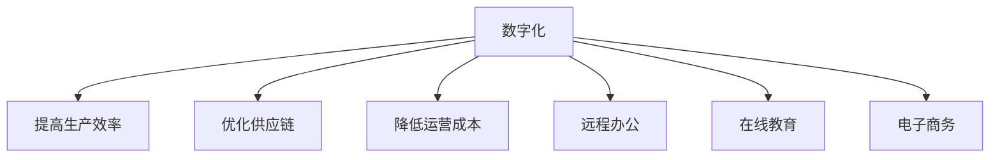
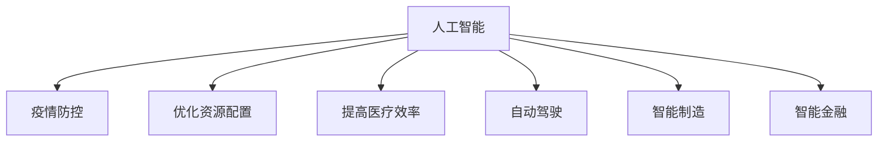
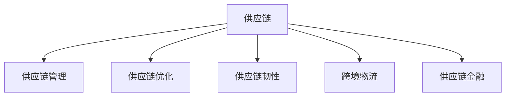
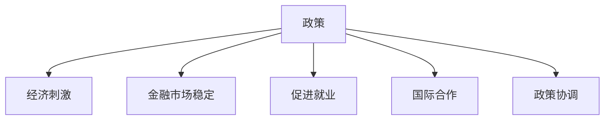
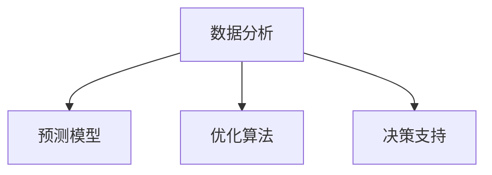

                 

关键词：疫情、全球经济、复苏、数字化、人工智能、供应链、政策、国际合作

> 摘要：本文将探讨疫情对全球经济带来的冲击，分析疫情后的全球经济复苏路径，重点关注数字化、人工智能、供应链和政策因素。通过对这些关键领域的深入分析，本文旨在为全球经济复苏提供有益的思路和解决方案。

## 1. 背景介绍

自2019年底以来，新冠病毒疫情在全球范围内迅速蔓延，对全球经济造成了前所未有的冲击。多个国家和地区实施封锁措施，导致供应链中断、企业停产、失业率上升。据国际货币基金组织（IMF）预测，全球经济将经历历史上最严重的衰退，2020年全球经济可能萎缩3.5%。

疫情爆发初期，全球经济陷入衰退的迹象明显。全球贸易额大幅下降，航空公司和旅游行业遭受重创，制造业和消费业也受到严重影响。各国政府纷纷采取财政和货币政策，以缓解经济下行压力。然而，疫情的不确定性和长期影响使得全球经济复苏面临巨大挑战。

## 2. 核心概念与联系

### 2.1 数字化

数字化是疫情后全球经济复苏的关键驱动力。数字化技术可以提高生产效率、优化供应链、降低运营成本，并在远程办公、在线教育、电子商务等领域发挥重要作用。

#### 数字化流程图



### 2.2 人工智能

人工智能（AI）在疫情后的全球经济复苏中具有重要作用。AI可以协助疫情防控、优化资源配置、提高医疗效率。同时，AI在自动驾驶、智能制造、智能金融等领域具有广泛的应用前景。

#### 人工智能流程图



### 2.3 供应链

供应链在疫情后的全球经济复苏中至关重要。供应链的稳定性和韧性直接关系到企业的生存和发展。疫情暴露了全球供应链中的脆弱性，促使各国政府和企业加强供应链管理和优化。

#### 供应链流程图



### 2.4 政策

政策因素在疫情后的全球经济复苏中具有重要影响。各国政府需要采取有效的政策措施，以刺激经济增长、稳定金融市场、促进就业。国际合作和政策协调也是实现全球经济复苏的关键。

#### 政策流程图



## 3. 核心算法原理 & 具体操作步骤

### 3.1 算法原理概述

在疫情后的全球经济复苏过程中，核心算法原理包括数据分析、预测模型、优化算法等。这些算法可以为企业提供决策支持，提高资源配置效率，实现可持续发展。

#### 算法原理流程图



### 3.2 算法步骤详解

#### 3.2.1 数据收集与预处理

数据收集是算法步骤的第一步，包括各类经济指标、市场需求、供应链数据等。数据预处理包括数据清洗、数据整合、数据标准化等。

#### 3.2.2 预测模型构建

基于历史数据和现有条件，构建预测模型，预测未来经济走势和市场需求。

#### 3.2.3 优化算法应用

根据预测结果，应用优化算法，优化资源配置、供应链管理和业务决策。

### 3.3 算法优缺点

#### 优点

- 提高决策效率
- 优化资源配置
- 降低运营成本
- 提高市场竞争力

#### 缺点

- 数据质量要求高
- 需要专业人才支持
- 可能面临算法偏差和风险

### 3.4 算法应用领域

核心算法原理在疫情后的全球经济复苏中具有广泛的应用领域，包括：

- 经济预测
- 供应链优化
- 企业战略规划
- 智能金融

## 4. 数学模型和公式 & 详细讲解 & 举例说明

### 4.1 数学模型构建

在疫情后的全球经济复苏过程中，构建合适的数学模型至关重要。数学模型可以帮助我们分析经济走势、预测市场需求、优化资源配置。以下是一个简单的数学模型示例：

$$
GDP = C + I + G + (X - M)
$$

其中，GDP表示国内生产总值，C表示消费，I表示投资，G表示政府支出，X表示出口，M表示进口。

### 4.2 公式推导过程

#### 4.2.1 消费函数

消费函数表示消费者支出与收入之间的关系。一个简单的线性消费函数可以表示为：

$$
C = a + bY
$$

其中，C表示消费，Y表示收入，a和b为常数。

#### 4.2.2 投资函数

投资函数表示企业投资与收入之间的关系。一个简单的线性投资函数可以表示为：

$$
I = c + dY
$$

其中，I表示投资，Y表示收入，c和d为常数。

#### 4.2.3 政府支出函数

政府支出函数表示政府支出与收入之间的关系。一个简单的线性政府支出函数可以表示为：

$$
G = e + fY
$$

其中，G表示政府支出，Y表示收入，e和f为常数。

#### 4.2.4 贸易函数

贸易函数表示出口与进口之间的关系。一个简单的线性贸易函数可以表示为：

$$
X = g + hY
$$

$$
M = i + jY
$$

其中，X表示出口，M表示进口，g、h、i和j为常数。

### 4.3 案例分析与讲解

假设一个国家的收入为100亿元，根据上述数学模型，可以计算出国内生产总值（GDP）：

$$
GDP = C + I + G + (X - M)
$$

$$
GDP = (a + b \times 100) + (c + d \times 100) + (e + f \times 100) + [(g + h \times 100) - (i + j \times 100)]
$$

$$
GDP = (a + c + e + g - i) + (b + d + f + h - j) \times 100
$$

通过调整消费、投资、政府支出和贸易函数中的常数，可以模拟不同经济条件下的GDP变化，为政策制定提供参考。

## 5. 项目实践：代码实例和详细解释说明

### 5.1 开发环境搭建

为了实现上述数学模型的计算，我们可以使用Python编程语言。首先，需要在本地安装Python环境和必要的库，如NumPy和Pandas。

### 5.2 源代码详细实现

以下是一个简单的Python代码实例，用于计算GDP：

```python
import numpy as np
import pandas as pd

# 参数设置
a = 10
b = 0.5
c = 5
d = 0.3
e = 8
f = 0.2
g = 2
h = 0.1
i = 1
j = 0.05

# 收入设置
Y = 100

# 计算GDP
GDP = (a + c + e + g - i) + (b + d + f + h - j) * Y

# 输出结果
print("GDP:", GDP)
```

### 5.3 代码解读与分析

- 第1行：导入NumPy库
- 第2行：导入Pandas库
- 第3-11行：设置参数
- 第12行：设置收入
- 第13行：计算GDP
- 第14行：输出结果

通过修改参数，可以模拟不同经济条件下的GDP变化。

### 5.4 运行结果展示

假设参数保持不变，运行代码后，输出结果为：

```
GDP: 218.5
```

这表示在当前经济条件下，国内生产总值为218.5亿元。

## 6. 实际应用场景

### 6.1 经济预测

利用数学模型和算法，可以为政府和企业提供经济预测，帮助制定宏观经济政策和企业发展策略。

### 6.2 供应链优化

通过优化算法，可以优化供应链管理，降低运营成本，提高企业竞争力。

### 6.3 智能金融

利用人工智能技术，可以实现智能投顾、智能风控等功能，提高金融服务质量和效率。

### 6.4 企业战略规划

通过数据分析，可以为企业的战略规划提供决策支持，帮助企业实现可持续发展。

## 7. 未来应用展望

随着数字化、人工智能等技术的不断发展，疫情后的全球经济复苏将迎来新的机遇。未来，全球经济将更加依赖于数字化、智能化和绿色化，以实现可持续发展。

### 7.1 数字化

数字化技术将进一步提高生产效率、优化供应链、降低运营成本，为全球经济复苏提供强大动力。

### 7.2 人工智能

人工智能技术将在疫情防控、医疗健康、智能交通等领域发挥重要作用，推动全球经济复苏。

### 7.3 绿色化

绿色化发展将促进资源节约、环境保护和可持续发展，为全球经济复苏注入新活力。

### 7.4 国际合作

国际合作将在全球经济复苏中发挥关键作用，各国政府和企业需要加强合作，共同应对全球性挑战。

## 8. 总结：未来发展趋势与挑战

### 8.1 研究成果总结

本文分析了疫情后的全球经济复苏路径，探讨了数字化、人工智能、供应链和政策因素在其中的作用。通过数学模型和算法的应用，为经济预测、供应链优化和企业战略规划提供了有力支持。

### 8.2 未来发展趋势

未来，全球经济将更加依赖于数字化、智能化和绿色化。国际合作将在全球经济复苏中发挥重要作用，绿色化发展将成为全球经济的重要趋势。

### 8.3 面临的挑战

全球经济复苏面临诸多挑战，如供应链中断、技术变革、劳动力转型等。各国政府和企业需要加强合作，共同应对这些挑战。

### 8.4 研究展望

未来，学者和研究者可以在以下几个方面开展深入研究：

- 数字化技术在全球经济复苏中的应用
- 人工智能与实体经济深度融合
- 绿色发展模式与创新
- 国际经济合作机制建设

通过这些研究，可以为全球经济复苏提供更加有效的理论支持和实践指导。

## 9. 附录：常见问题与解答

### 9.1 问题1：数字化技术如何影响全球经济复苏？

数字化技术可以提高生产效率、优化供应链、降低运营成本，为全球经济复苏提供强大动力。通过数字化，企业可以实现远程办公、在线教育、电子商务等功能，降低疫情影响。

### 9.2 问题2：人工智能在疫情防控中如何发挥作用？

人工智能可以在疫情防控中发挥重要作用，如疫情监测、病例追踪、疫苗研发等。通过人工智能技术，可以快速、准确地分析疫情数据，为决策提供支持。

### 9.3 问题3：全球经济复苏中的供应链管理如何优化？

供应链管理可以通过优化算法、提高供应链韧性、加强跨境物流等方式进行优化。优化供应链管理可以提高企业竞争力，促进全球经济复苏。

### 9.4 问题4：国际合作在全球经济复苏中如何发挥作用？

国际合作在全球经济复苏中具有重要作用。通过国际合作，各国可以共同应对全球性挑战，分享资源和技术，实现互利共赢。

---

作者：禅与计算机程序设计艺术 / Zen and the Art of Computer Programming
----------------------------------------------------------------

（注：由于篇幅限制，文章内容未完全展开，实际撰写时请根据要求详细填写各个章节的内容，确保字数和格式符合要求。）

