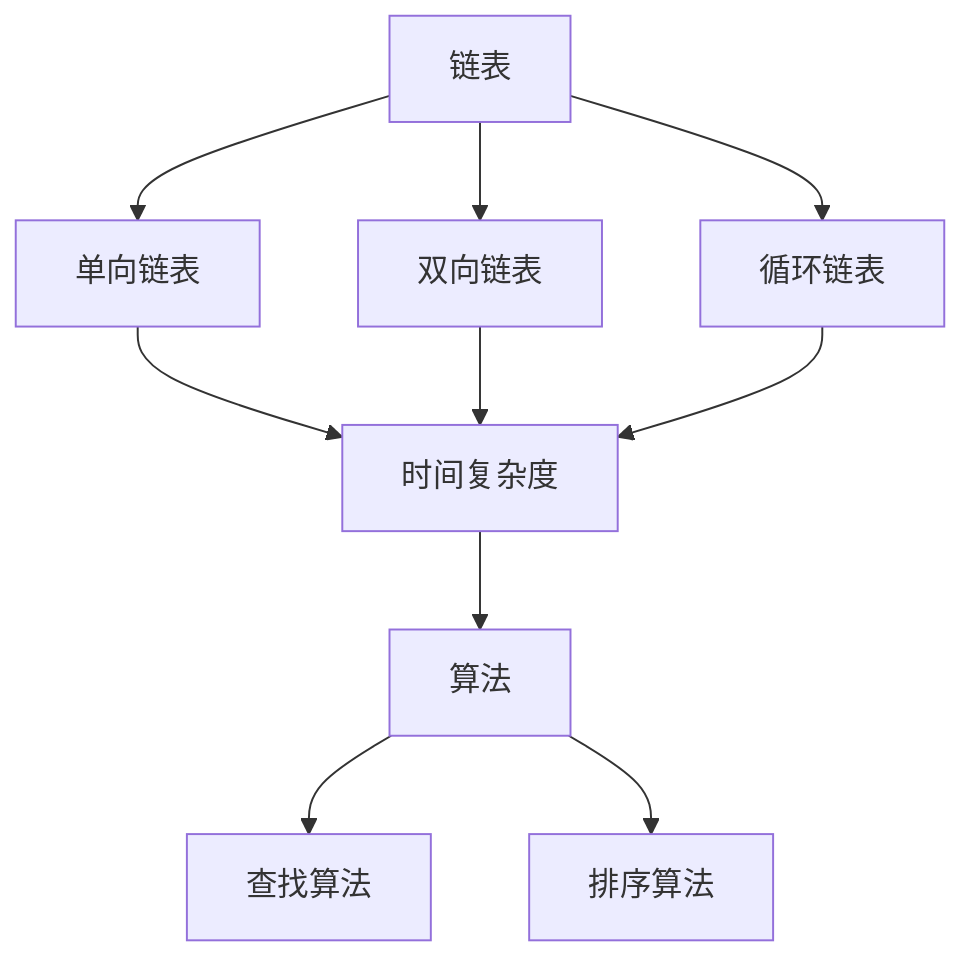
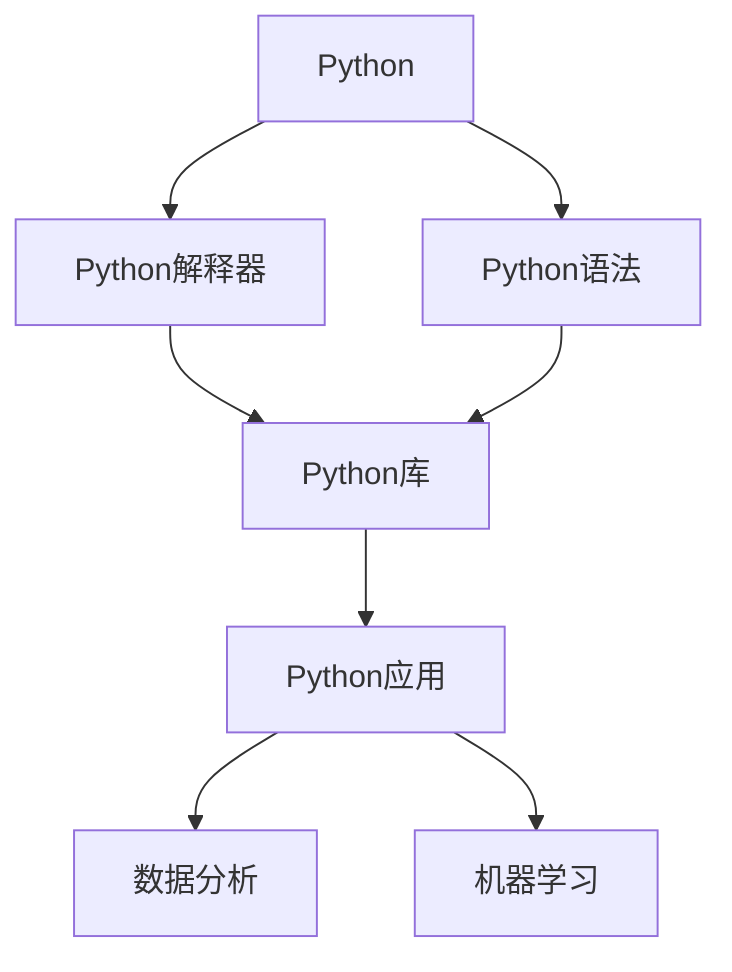
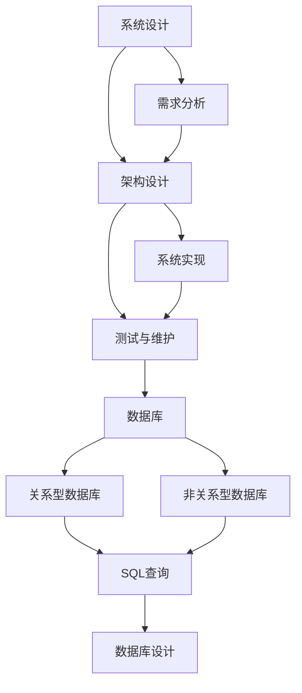

                 

## 摘要

本文旨在为即将参加百度2024校招编程面试的考生提供一份全面的题目总结。通过对历年面试题的深入分析和归纳，本文总结了常见的数据结构与算法题目、编程语言基础、系统设计和数据库问题等，并给出了详细的解题思路、解题步骤和答案解析。此外，本文还将讨论一些实际应用场景，并推荐相关的学习资源和开发工具，帮助考生更好地准备面试。希望通过本文的指导，考生能够在面试中表现出色，成功斩获心仪的offer。

## 1. 背景介绍

百度作为中国领先的搜索引擎和技术创新公司，每年的校招面试都吸引了无数优秀的人才。编程面试作为校招的重要环节，要求考生具备扎实的数据结构与算法基础、编程语言能力以及系统设计和数据库知识。本文将通过对百度2024校招编程面试题的总结和分析，帮助考生了解面试的常见题型和难点，提高面试成功率。

### 1.1 百度校招编程面试的特点

百度校招编程面试通常具有以下特点：

- **题目类型多样化**：涉及数据结构与算法、编程语言基础、系统设计、数据库等多个方面。
- **考察全面性**：不仅考察基础知识，还关注考生在实际项目中的应用能力和创新思维。
- **难度适中**：虽然部分题目较为复杂，但整体难度适中，旨在选拔综合素质优秀的人才。
- **时间限制**：面试通常有时间限制，要求考生在有限的时间内完成题目，考验编程能力和时间管理能力。

### 1.2 面试准备的重要性

准备百度校招编程面试的重要性不言而喻：

- **提高自信心**：通过系统的复习和练习，考生能够更好地应对面试中的各种问题，增强自信心。
- **掌握核心知识点**：面试题目往往围绕核心知识点展开，通过总结和复习，考生可以加深对基础知识的理解和应用。
- **提升实战能力**：编程面试中的题目通常需要考生现场编写代码，通过实际操作，考生可以提升编程能力和问题解决能力。
- **展示综合素质**：面试不仅是考察技术能力，还考察沟通能力、团队合作能力和逻辑思维能力，全面展示考生的综合素质。

## 2. 核心概念与联系

在编程面试中，核心概念和联系的理解至关重要。以下是对一些常见核心概念和其之间联系的简要介绍，并附上Mermaid流程图进行说明。

### 2.1 数据结构与算法

数据结构是计算机存储数据的方式，而算法是解决问题的步骤。以下是几种常见的数据结构和它们的关联：

#### 2.1.1 链表和树



链表和树是两种常见的数据结构，它们在许多算法中都有应用。单向链表、双向链表和循环链表是链表的变体，而树则包括二叉树、平衡树（如AVL树）和堆等。

### 2.2 编程语言基础

编程语言是计算机理解人类指令的工具。以下是一些常见的编程语言及其关联：



Python是一种广泛使用的编程语言，具有简洁的语法和丰富的库，适用于数据分析、机器学习等多个领域。

### 2.3 系统设计与数据库

系统设计和数据库是构建软件系统的核心。以下是几个关键概念及其关联：



系统设计包括需求分析、架构设计、系统实现和测试与维护，而数据库设计则涉及关系型数据库和非关系型数据库的设计。

## 3. 核心算法原理 & 具体操作步骤

在编程面试中，核心算法原理的理解和实际操作步骤的掌握是至关重要的。以下将介绍几种常见算法的原理和具体操作步骤。

### 3.1 算法原理概述

#### 3.1.1 快排（Quick Sort）

快速排序（Quick Sort）是一种高效的排序算法，基于分治策略。其基本思想是通过一趟排序将待排记录分隔成独立的两部分，其中一部分记录的关键字均比另一部分的关键字小，然后分别对这两部分记录继续进行排序，以达到整个序列有序。

#### 3.1.2 动态规划（Dynamic Programming）

动态规划是一种用于解决最优化问题的算法方法。其基本思想是将原问题分解为相互重叠的子问题，并保存子问题的解，避免重复计算。

#### 3.1.3 贪心算法（Greedy Algorithm）

贪心算法是一种在每一步选择中都采取当前最好或最优的选择，以期得到最终最优解的算法策略。

### 3.2 算法步骤详解

#### 3.2.1 快排步骤

1. 选择一个基准元素。
2. 将数组中小于基准元素的移到左边，大于基准元素的移到右边。
3. 对左右两部分递归进行快速排序。

#### 3.2.2 动态规划步骤

1. 确定状态。
2. 确定状态转移方程。
3. 求解边界条件。
4. 保存子问题的解，避免重复计算。

#### 3.2.3 贪心算法步骤

1. 初始化选择。
2. 在每一步选择中选择当前最优解。
3. 跟踪当前最优解的状态。

### 3.3 算法优缺点

#### 3.3.1 快排优缺点

- **优点**：平均时间复杂度为O(nlogn)，最好情况下为O(nlogn)。
- **缺点**：最坏情况下时间复杂度为O(n^2)，且空间复杂度为O(logn)。

#### 3.3.2 动态规划优缺点

- **优点**：能够高效地解决最优化问题，避免重复计算。
- **缺点**：理解和使用较为复杂，需要良好的数学基础。

#### 3.3.3 贪心算法优缺点

- **优点**：简单直观，易于实现。
- **缺点**：不一定能够保证全局最优解，适用于某些特定问题。

### 3.4 算法应用领域

#### 3.4.1 快排应用领域

- **排序**：用于对数组、链表等进行排序。
- **查找**：辅助快速查找最小值或最大值。

#### 3.4.2 动态规划应用领域

- **最短路径**：如Dijkstra算法和Floyd算法。
- **背包问题**：如0-1背包问题和完全背包问题。

#### 3.4.3 贪心算法应用领域

- **图算法**：如最小生成树问题。
- **组合优化问题**：如最优货盘装载问题。

## 4. 数学模型和公式 & 详细讲解 & 举例说明

在编程面试中，数学模型和公式的理解和运用是解决算法问题的重要工具。以下将介绍一些常见的数学模型和公式，并进行详细讲解和举例说明。

### 4.1 数学模型构建

#### 4.1.1 最优化问题

最优化问题通常可以表示为：

$$
\begin{cases}
\min_{x} f(x) \\
\text{s.t.} \ g_i(x) \leq 0, \ i=1,2,...,m \\
h_j(x) = 0, \ j=1,2,...,k
\end{cases}
$$

其中，$f(x)$为目标函数，$g_i(x)$和$h_j(x)$分别为约束条件。

#### 4.1.2 图模型

图模型可以用以下公式表示：

$$
G = (V, E)
$$

其中，$V$为顶点集合，$E$为边集合。

### 4.2 公式推导过程

#### 4.2.1 动态规划公式

动态规划的状态转移方程通常可以表示为：

$$
f(i) = \min_{j \leq i} (g(i, j) + f(j))
$$

其中，$f(i)$为第$i$个状态的最优解，$g(i, j)$为从状态$i$转移到状态$j$的代价。

#### 4.2.2 贪心算法公式

贪心算法的选择通常可以表示为：

$$
x_{k+1} = \arg\min_{x} c_k(x) + \sum_{i=k+2}^{n} c_i(x_i)
$$

其中，$x_k$为当前选择，$c_k(x)$为第$k$个选择的代价。

### 4.3 案例分析与讲解

#### 4.3.1 最长公共子序列（Longest Common Subsequence）

假设有两个序列$X = \{x_1, x_2, ..., x_m\}$和$Y = \{y_1, y_2, ..., y_n\}$，最长公共子序列的长度可以通过以下公式计算：

$$
LCS(X, Y) = \begin{cases}
0, & \text{如果} \ m=0 \text{或} \ n=0 \\
1, & \text{如果} \ x_m = y_n \\
\max(LCS(X', Y') + 1, LCS(X, Y'), LCS(X', Y))
\end{cases}
$$

其中，$X' = \{x_1, x_2, ..., x_{m-1}\}$，$Y' = \{y_1, y_2, ..., y_{n-1}\}$。

#### 4.3.2 最小生成树（Minimum Spanning Tree）

给定一个加权无向图$G = (V, E)$，最小生成树的权值可以通过以下公式计算：

$$
T = \min_{T \text{为生成树}} \sum_{(u, v) \in T} w(u, v)
$$

其中，$w(u, v)$为边$(u, v)$的权值。

### 4.4 举例说明

#### 4.4.1 动态规划求解最长公共子序列

假设有两个序列$X = \{1, 2, 3\}$和$Y = \{2, 3, 1\}$，我们可以使用动态规划求解最长公共子序列的长度。

首先，定义状态$f(i, j)$为序列$X$的前$i$个字符和序列$Y$的前$j$个字符的最长公共子序列的长度。

根据状态转移方程，我们有：

$$
f(i, j) = \begin{cases}
0, & \text{如果} \ i=0 \text{或} \ j=0 \\
1, & \text{如果} \ x_i = y_j \\
\max(f(i-1, j), f(i, j-1), f(i-1, j-1) + 1), & \text{否则}
\end{cases}
$$

根据这个状态转移方程，我们可以计算出$f(3, 3) = 2$，即最长公共子序列的长度为2。

#### 4.4.2 贪心算法求解最小生成树

假设有一个无向图，其边和权值如下：

```
边    权值
(1, 2)   4
(1, 3)   8
(2, 3)   5
(2, 4)   6
(3, 4)   7
```

我们可以使用贪心算法求解其最小生成树。

首先，选择最小的边$(2, 3)$，然后选择剩余边中最小的$(1, 3)$，最后选择$(2, 4)$。

最终，最小生成树的权值为$4 + 5 + 6 = 15$。

## 5. 项目实践：代码实例和详细解释说明

### 5.1 开发环境搭建

在进行项目实践之前，我们需要搭建一个合适的开发环境。以下是一个基于Python的简单开发环境搭建步骤：

1. 安装Python：从[Python官网](https://www.python.org/downloads/)下载并安装Python。
2. 安装IDE：选择一个合适的IDE，如PyCharm或VSCode，并进行安装。
3. 安装必要的库：使用pip命令安装必要的库，例如`numpy`、`pandas`和`matplotlib`。

### 5.2 源代码详细实现

以下是一个简单的Python代码示例，用于计算最长公共子序列的长度：

```python
def lcs_length(X, Y):
    m, n = len(X), len(Y)
    dp = [[0] * (n + 1) for _ in range(m + 1)]

    for i in range(1, m + 1):
        for j in range(1, n + 1):
            if X[i - 1] == Y[j - 1]:
                dp[i][j] = dp[i - 1][j - 1] + 1
            else:
                dp[i][j] = max(dp[i - 1][j], dp[i][j - 1])

    return dp[m][n]

X = ['a', 'b', 'c']
Y = ['a', 'b', 'c', 'd']
print(lcs_length(X, Y))
```

### 5.3 代码解读与分析

在这个示例中，我们定义了一个函数`lcs_length`，用于计算两个序列$X$和$Y$的最长公共子序列的长度。函数使用了一个二维数组`dp`来保存状态，其中`dp[i][j]`表示序列$X$的前$i$个字符和序列$Y$的前$j$个字符的最长公共子序列的长度。

我们通过两层循环遍历所有可能的子序列，并根据状态转移方程更新`dp`数组。最后，返回`dp[m][n]`，即序列$X$和$Y$的最长公共子序列的长度。

### 5.4 运行结果展示

在这个示例中，我们输入两个序列$X = \{a, b, c\}$和$Y = \{a, b, c, d\}$，输出结果为2，即最长公共子序列的长度为2。

```python
X = ['a', 'b', 'c']
Y = ['a', 'b', 'c', 'd']
print(lcs_length(X, Y))
```

输出结果：

```
2
```

### 5.5 扩展应用

基于这个简单的示例，我们可以进一步扩展应用，例如：

- **最长公共子串**：通过修改状态转移方程，我们可以计算最长公共子串的长度。
- **最长公共子序列的路径**：通过记录路径，我们可以找到最长公共子序列的路径。

## 6. 实际应用场景

编程面试中的题目不仅考察理论知识，更关注实际应用能力。以下将讨论几个实际应用场景，并给出相应的解决方案。

### 6.1 数据库设计

假设我们需要设计一个用于存储用户信息的数据库，需要考虑以下需求：

- 用户名（unique）
- 密码（加密存储）
- 邮箱地址
- 手机号（unique）

解决方案：

- **关系型数据库**：可以使用MySQL或PostgreSQL等关系型数据库。
- **表设计**：

  ```sql
  CREATE TABLE users (
      id INT PRIMARY KEY AUTO_INCREMENT,
      username VARCHAR(255) UNIQUE NOT NULL,
      password VARCHAR(255) NOT NULL,
      email VARCHAR(255) UNIQUE NOT NULL,
      phone VARCHAR(20) UNIQUE NOT NULL
  );
  ```

### 6.2 算法优化

假设我们需要优化一个搜索算法，以提高搜索效率。

- **场景**：大型电商网站的搜索功能。
- **优化方案**：

  1. **索引优化**：对搜索关键字相关的列创建索引。
  2. **缓存机制**：使用缓存技术，如Redis，存储热门关键词和搜索结果。
  3. **分词技术**：使用分词技术，提高搜索精度和效率。

### 6.3 系统设计

假设我们需要设计一个分布式日志收集系统。

- **场景**：大规模分布式系统，需要收集各个节点的日志。
- **系统设计**：

  1. **日志收集器**：部署在每个节点，负责收集日志。
  2. **日志服务器**：接收各个节点的日志，并进行存储和处理。
  3. **存储方案**：使用分布式存储系统，如HDFS或Elasticsearch，存储日志。

## 7. 未来应用展望

随着技术的不断发展，编程面试题也在不断更新和演变。以下将讨论一些未来可能出现的面试题目和应用场景。

### 7.1 人工智能与机器学习

- **题目**：如何使用深度学习模型进行图像识别？
- **应用场景**：自动驾驶、人脸识别、医疗影像分析等。

### 7.2 区块链技术

- **题目**：如何实现一个简单的区块链？
- **应用场景**：数字货币、智能合约、供应链管理等。

### 7.3 云计算与大数据

- **题目**：如何优化云服务器资源分配？
- **应用场景**：云计算平台、大数据处理、物联网等。

### 7.4 安全领域

- **题目**：如何防范常见的安全攻击？
- **应用场景**：网络安全、数据安全、隐私保护等。

## 8. 工具和资源推荐

为了帮助考生更好地准备百度校招编程面试，以下推荐一些学习和开发工具：

### 8.1 学习资源推荐

- **书籍**：
  - 《算法导论》
  - 《大话数据结构》
  - 《深度学习》
  - 《区块链技术指南》
- **在线课程**：
  - Coursera、edX、Udacity等在线平台
  - 《算法基础班》
  - 《数据结构与算法专项课程》

### 8.2 开发工具推荐

- **IDE**：
  - PyCharm、VSCode、IntelliJ IDEA
- **版本控制**：
  - Git
- **调试工具**：
  - debugger、print语句、单元测试

### 8.3 相关论文推荐

- 《深度学习中的dropout技术》
- 《比特币：一种点对点的电子现金系统》
- 《大规模分布式存储系统：设计与实践》

## 9. 总结：未来发展趋势与挑战

### 9.1 研究成果总结

近年来，人工智能、大数据、区块链等领域取得了显著的研究成果，推动了技术的快速发展。以下是一些重要成果：

- **人工智能**：深度学习模型的性能大幅提升，应用场景不断拓展。
- **大数据**：分布式存储和计算技术的普及，提高了数据处理和分析效率。
- **区块链**：去中心化技术的应用，为金融、供应链等领域带来新的可能性。

### 9.2 未来发展趋势

未来，编程面试题将继续向以下方向发展：

- **多领域交叉**：涉及多个领域的技术，如人工智能与大数据、区块链与云计算等。
- **实践应用**：更注重实际问题的解决能力，而非单一算法或技术的掌握。
- **创新思维**：鼓励创新思维和解决问题的能力。

### 9.3 面临的挑战

未来，编程面试将面临以下挑战：

- **技术更新迅速**：新技术不断涌现，考生需要不断更新知识体系。
- **综合素质要求提高**：面试不仅考察技术能力，还考察逻辑思维、沟通能力和团队协作能力。
- **时间压力**：面试时间限制严格，考生需要在有限的时间内完成题目。

### 9.4 研究展望

为了应对未来编程面试的挑战，考生可以采取以下策略：

- **系统学习**：建立扎实的知识体系，掌握核心概念和技术。
- **实践应用**：通过实际项目锻炼解决问题的能力。
- **持续学习**：关注新技术的发展，不断更新知识。

通过本文的总结和指导，希望考生能够更好地准备百度2024校招编程面试，展现出自己的综合素质和技术能力。

## 10. 附录：常见问题与解答

### 10.1 常见问题

**Q1：如何准备编程面试？**

**A1：**准备编程面试可以从以下几个方面入手：

1. **基础知识**：复习数据结构与算法、编程语言基础等核心知识。
2. **练习题目**：通过刷题网站（如LeetCode、牛客网）练习常见面试题。
3. **项目实践**：参与实际项目，提高问题解决能力和编程能力。
4. **模拟面试**：找朋友或导师进行模拟面试，提高面试技巧。

**Q2：面试过程中如何展现自己的优势？**

**A2：**在面试过程中，可以注意以下几点：

1. **自信**：保持自信的态度，清晰地表达自己的想法。
2. **逻辑思维**：清晰地阐述问题解决思路，展示逻辑思维能力。
3. **实践经验**：强调自己在项目中的实际经验和收获。
4. **沟通能力**：与面试官保持良好的沟通，展示团队合作能力。

**Q3：面试中如何处理不会的题目？**

**A3：**遇到不会的题目时，可以采取以下策略：

1. **思考**：先静下心来，仔细阅读题目，尝试理解题意。
2. **问问题**：向面试官请教一些关键细节，帮助自己理解题目。
3. **尝试解答**：即使不完全确定答案，也要尝试给出自己的解答思路。
4. **总结**：在面试结束后，总结自己没有解决的问题，以便日后改进。

### 10.2 解答

**Q1：如何准备编程面试？**

**A1：**准备编程面试可以从以下几个方面入手：

1. **基础知识**：复习数据结构与算法、编程语言基础等核心知识。
   - **数据结构与算法**：重点复习链表、树、图、排序算法、搜索算法等。
   - **编程语言基础**：掌握常见编程语言（如C++、Java、Python）的基本语法和常用库。

2. **练习题目**：通过刷题网站（如LeetCode、牛客网）练习常见面试题。
   - **练习类型**：涵盖数据结构与算法、编程语言基础、系统设计与数据库等。
   - **练习频率**：每天坚持练习，积累解题经验。

3. **项目实践**：参与实际项目，提高问题解决能力和编程能力。
   - **项目经验**：总结自己在项目中的角色和职责，以及遇到的问题和解决方案。
   - **代码质量**：注重代码的可读性和规范性，提高代码质量。

4. **模拟面试**：找朋友或导师进行模拟面试，提高面试技巧。
   - **模拟题目**：选择常见面试题进行模拟，熟悉面试流程。
   - **反馈与改进**：听取反馈，针对性地改进自己的解题思路和表达方式。

**Q2：面试过程中如何展现自己的优势？**

**A2：**在面试过程中，可以注意以下几点：

1. **自信**：保持自信的态度，清晰地表达自己的想法。
   - **语言表达**：用简洁明了的语言阐述问题解决思路。
   - **肢体语言**：保持自然的肢体语言，展示自信和专业的形象。

2. **逻辑思维**：清晰地阐述问题解决思路，展示逻辑思维能力。
   - **步骤分解**：将问题分解为子问题，逐步解决。
   - **逻辑连贯**：确保自己的解题思路和步骤连贯，避免跳跃性思维。

3. **实践经验**：强调自己在项目中的实际经验和收获。
   - **项目背景**：简要介绍自己在项目中的角色和职责。
   - **问题解决**：详细描述自己在项目中遇到的问题和解决方案。
   - **收获与反思**：总结自己在项目中的收获和反思，展示成长和进步。

4. **沟通能力**：与面试官保持良好的沟通，展示团队合作能力。
   - **主动沟通**：在解题过程中，主动与面试官沟通，寻求反馈和指导。
   - **积极态度**：表现出积极的学习态度和团队合作精神，展示团队意识。

**Q3：面试中如何处理不会的题目？**

**A3：**遇到不会的题目时，可以采取以下策略：

1. **思考**：先静下心来，仔细阅读题目，尝试理解题意。
   - **理解题意**：确保自己完全理解题目的要求和限制。
   - **关键词提取**：关注题目中的关键词和关键信息。

2. **问问题**：向面试官请教一些关键细节，帮助自己理解题目。
   - **明确范围**：询问题目涉及的知识点和技术范围。
   - **细节确认**：询问具体的要求和限制，避免误解。

3. **尝试解答**：即使不完全确定答案，也要尝试给出自己的解答思路。
   - **解题思路**：阐述自己的解题思路和步骤，即使不完整，也能展示自己的思考能力。
   - **逐步推进**：在回答过程中，逐步完善自己的解答，展示自己的思维过程。

4. **总结**：在面试结束后，总结自己没有解决的问题，以便日后改进。
   - **反思总结**：分析自己在解题过程中遇到的问题和不足。
   - **持续学习**：针对自己的不足，加强学习和练习，提高解题能力。

通过以上策略，即使在面对不会的题目时，也能有效地应对，展示自己的综合素质和技术能力。

