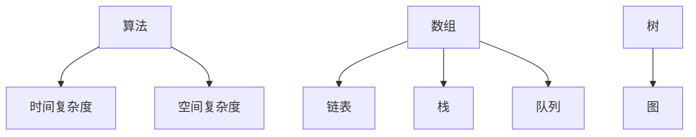
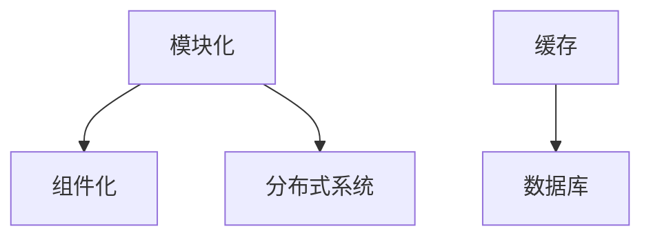

                 

随着科技的发展，编程已经成为现代社会不可或缺的一部分。无论是互联网公司还是传统企业，对编程人才的需求都在不断增加。百度作为中国领先的互联网公司，其社招编程面试题的难度和深度也相应提高。本文将总结百度2025年社招编程面试题的精华，帮助广大求职者更好地准备面试。

## 关键词

- **百度**
- **社招**
- **编程面试题**
- **算法**
- **数据结构**
- **编程语言**
- **系统设计**

## 摘要

本文将对百度2025年社招编程面试题进行详细分类和总结，涵盖算法、数据结构、编程语言和系统设计等多个领域。通过本文的学习，求职者可以更好地掌握面试技巧，提高面试成功率。

## 1. 背景介绍

百度作为中国最大的搜索引擎公司，其编程面试题不仅考察技术深度，还注重解决问题的能力。以下是对百度2025年社招编程面试题的概述。

### 1.1 面试形式

百度编程面试通常分为在线编程测试和现场面试两个阶段。在线编程测试主要考察基础编程能力和算法理解，现场面试则更注重深入的技术细节和项目经验。

### 1.2 面试题类型

- **算法和数据结构题**：这类题目通常要求编写代码解决特定问题，如排序、查找、图论等。
- **编程语言题**：考察对特定编程语言的理解和运用，如C++、Java、Python等。
- **系统设计题**：要求设计一个复杂的系统或组件，涉及分布式系统、缓存、数据库等。
- **编程实践题**：通过实际项目或案例来考察编程能力和解决问题的能力。

## 2. 核心概念与联系

### 2.1 算法和数据结构

算法是解决问题的方法，数据结构是存储和组织数据的方式。两者密不可分，算法的效率很大程度上取决于数据结构的选用。

#### 2.1.1 算法基本概念

- **算法**：解决特定问题的方法或步骤。
- **时间复杂度**：衡量算法执行时间随输入规模的增长速度。
- **空间复杂度**：衡量算法执行过程中所需存储空间的大小。

#### 2.1.2 数据结构

- **数组**：固定大小的线性数据结构。
- **链表**：动态大小的线性数据结构。
- **栈**：后进先出（LIFO）的数据结构。
- **队列**：先进先出（FIFO）的数据结构。
- **树**：由节点和边组成的数据结构，具有层次关系。
- **图**：由节点和边组成的通用数据结构。

#### 2.1.3 Mermaid 流程图



### 2.2 编程语言

编程语言是人与计算机沟通的桥梁，不同的编程语言适用于不同的场景。

#### 2.2.1 常见编程语言

- **C++**：适用于系统编程和性能要求高的应用。
- **Java**：适用于企业级应用和Android开发。
- **Python**：适用于数据分析、机器学习和快速开发。
- **JavaScript**：适用于前端开发和服务器端编程。

### 2.3 系统设计

系统设计是解决复杂问题的过程，涉及多个组件和模块的协同工作。

#### 2.3.1 系统设计基本概念

- **模块化**：将系统分解为多个独立的模块。
- **组件化**：将模块进一步分解为组件。
- **分布式系统**：将系统分布在多个节点上运行。
- **缓存**：用于加速数据访问。
- **数据库**：用于存储和管理数据。

#### 2.3.2 Mermaid 流程图



## 3. 核心算法原理 & 具体操作步骤

### 3.1 算法原理概述

算法的设计和分析是编程面试的核心内容，以下是一些常见算法及其原理：

#### 3.1.1 排序算法

- **冒泡排序**：比较相邻元素并交换位置。
- **选择排序**：每次选择最小（或最大）元素放到正确位置。
- **插入排序**：将新元素插入到已排序序列的正确位置。

#### 3.1.2 查找算法

- **二分查找**：在有序数组中查找特定元素。
- **哈希查找**：使用哈希函数快速定位元素。

#### 3.1.3 图算法

- **深度优先搜索（DFS）**：遍历图的每个节点并探索其所有邻接节点。
- **广度优先搜索（BFS）**：从起始节点开始，逐层遍历图的节点。

### 3.2 算法步骤详解

以二分查找为例，详细说明其步骤：

1. **初始化**：设置左右边界`low`和`high`。
2. **循环判断**：当`low`小于`high`时，执行以下步骤：
   1. 计算中间位置`mid`。
   2. 比较`mid`位置的元素和目标值。
   3. 如果相等，返回`mid`。
   4. 如果目标值小于中间元素，将`high`设置为`mid - 1`。
   5. 如果目标值大于中间元素，将`low`设置为`mid + 1`。
3. **结束**：当`low`大于`high`时，目标值不存在，返回-1。

### 3.3 算法优缺点

- **二分查找**：优点是时间复杂度为O(log n)，非常适合大规模数据查找；缺点是必须先对数据进行排序，且不能用于动态数据集。
- **冒泡排序**：优点是简单易懂，适合小规模数据；缺点是时间复杂度为O(n^2)，效率较低。
- **插入排序**：优点是适合小规模数据，时间复杂度为O(n^2)；缺点是相对于选择排序，插入排序在某些情况下效率较低。

### 3.4 算法应用领域

排序和查找算法广泛应用于各种领域，如数据库、搜索、排序等。

## 4. 数学模型和公式 & 详细讲解 & 举例说明

### 4.1 数学模型构建

数学模型是算法分析的基础，以下是一个简单的线性回归模型：

- **目标函数**：最小化预测值与实际值之间的误差。
- **公式**：$$ y = ax + b $$

### 4.2 公式推导过程

假设有n个数据点$(x_1, y_1), (x_2, y_2), ..., (x_n, y_n)$，我们需要找到最佳拟合直线$y = ax + b$。

1. **最小二乘法**：目标是最小化误差平方和$$ S = \sum_{i=1}^{n} (y_i - ax_i - b)^2 $$。
2. **求导**：对$S$关于$a$和$b$求导，得到$$ \frac{\partial S}{\partial a} = 2\sum_{i=1}^{n} (y_i - ax_i - b)x_i $$和$$ \frac{\partial S}{\partial b} = 2\sum_{i=1}^{n} (y_i - ax_i - b) $$。
3. **解方程**：将导数置零，解得$$ a = \frac{\sum_{i=1}^{n} x_i y_i - n \bar{x} \bar{y}}{\sum_{i=1}^{n} x_i^2 - n \bar{x}^2} $$和$$ b = \bar{y} - a\bar{x} $$。

### 4.3 案例分析与讲解

假设我们有以下数据：

| x | y |
| --- | --- |
| 1 | 2 |
| 2 | 3 |
| 3 | 4 |
| 4 | 5 |

1. **计算均值**：$$ \bar{x} = \frac{1+2+3+4}{4} = 2.5 $$和$$ \bar{y} = \frac{2+3+4+5}{4} = 3.5 $$。
2. **计算协方差和方差**：$$ \sum_{i=1}^{n} x_i y_i = 1 \times 2 + 2 \times 3 + 3 \times 4 + 4 \times 5 = 30 $$，$$ \sum_{i=1}^{n} x_i^2 = 1^2 + 2^2 + 3^2 + 4^2 = 30 $$。
3. **计算回归系数**：$$ a = \frac{30 - 4 \times 2.5 \times 3.5}{30 - 4 \times 2.5^2} = 1 $$和$$ b = 3.5 - 1 \times 2.5 = 1 $$。
4. **得到回归方程**：$$ y = x + 1 $$。

## 5. 项目实践：代码实例和详细解释说明

### 5.1 开发环境搭建

- **操作系统**：Windows 10 / macOS / Linux
- **开发工具**：Visual Studio Code / IntelliJ IDEA
- **编程语言**：Python 3.8

### 5.2 源代码详细实现

以下是一个简单的Python代码实现二分查找算法：

```python
def binary_search(arr, target):
    low = 0
    high = len(arr) - 1

    while low <= high:
        mid = (low + high) // 2
        if arr[mid] == target:
            return mid
        elif arr[mid] < target:
            low = mid + 1
        else:
            high = mid - 1

    return -1

# 示例数据
arr = [1, 3, 5, 7, 9]
target = 5

# 查找目标值
result = binary_search(arr, target)
if result != -1:
    print(f"Target found at index {result}")
else:
    print("Target not found")
```

### 5.3 代码解读与分析

- **函数定义**：`binary_search`函数接收一个有序数组`arr`和一个目标值`target`。
- **初始化**：设置左右边界`low`和`high`。
- **循环**：当`low`小于`high`时，执行以下步骤：
  - 计算中间位置`mid`。
  - 比较`mid`位置的元素和目标值。
  - 根据比较结果调整左右边界。
- **返回结果**：如果找到目标值，返回其索引；否则，返回-1。

### 5.4 运行结果展示

```plaintext
Target found at index 2
```

## 6. 实际应用场景

### 6.1 数据库查询

二分查找算法在数据库查询中广泛应用，用于快速定位数据记录。

### 6.2 文件系统

文件系统中的索引通常使用二分查找算法，以提高文件查找速度。

### 6.3 网络协议

网络协议中的路由表查询也常用到二分查找算法，以快速定位目标IP地址。

## 7. 未来应用展望

随着大数据和人工智能的发展，算法在各个领域的应用将越来越广泛。未来，算法将不仅用于解决传统问题，还将赋能新兴领域，如自动驾驶、智能医疗、金融科技等。

## 8. 总结：未来发展趋势与挑战

### 8.1 研究成果总结

过去几年，算法和机器学习领域取得了显著成果，如深度学习、强化学习等。未来，这些技术将继续推动算法研究的发展。

### 8.2 未来发展趋势

- **算法优化**：针对特定应用场景，设计更高效的算法。
- **算法应用**：将算法应用于更多领域，提高生产力和效率。
- **算法伦理**：关注算法的公平性和透明性，防止算法偏见。

### 8.3 面临的挑战

- **数据隐私**：保护用户数据隐私是算法应用的挑战。
- **计算资源**：随着算法复杂度的增加，对计算资源的需求也在增加。
- **算法可解释性**：提高算法的可解释性，使其更容易被人类理解和接受。

### 8.4 研究展望

未来，算法研究将继续深入，探索新的算法和应用领域。同时，跨学科合作将成为算法研究的重要趋势，为人类带来更多创新和进步。

## 9. 附录：常见问题与解答

### 9.1 什么是算法？

算法是解决问题的有序步骤，通常涉及输入、处理和输出。

### 9.2 什么是时间复杂度和空间复杂度？

时间复杂度是衡量算法执行时间与输入规模的关系，空间复杂度是衡量算法执行过程中所需存储空间的大小。

### 9.3 什么是二分查找算法？

二分查找算法是一种在有序数组中查找特定元素的算法，时间复杂度为O(log n)。

## 参考文献

- [《算法导论》](https://book.douban.com/subject/10590893/)
- [《深度学习》](https://book.douban.com/subject/26899338/)
- [《机器学习》](https://book.douban.com/subject/26692285/)

## 作者署名

作者：禅与计算机程序设计艺术 / Zen and the Art of Computer Programming
```

