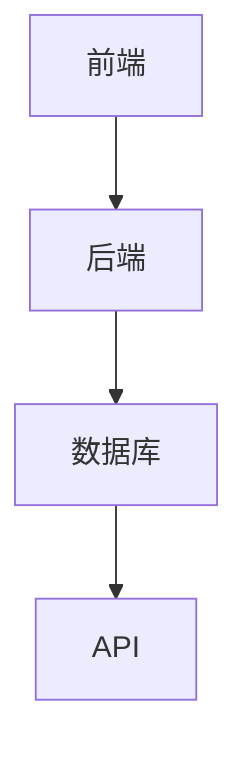
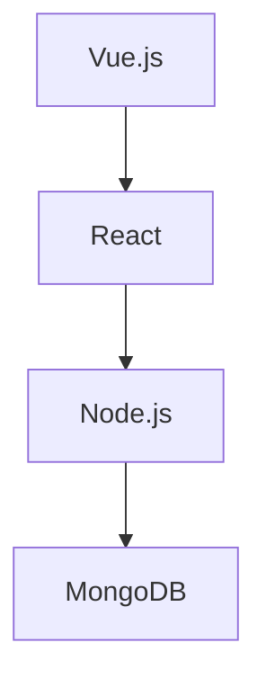
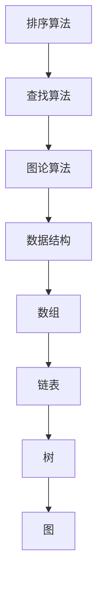
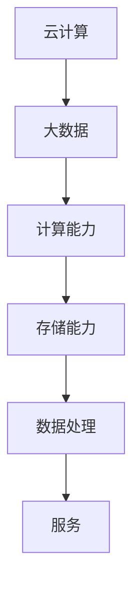
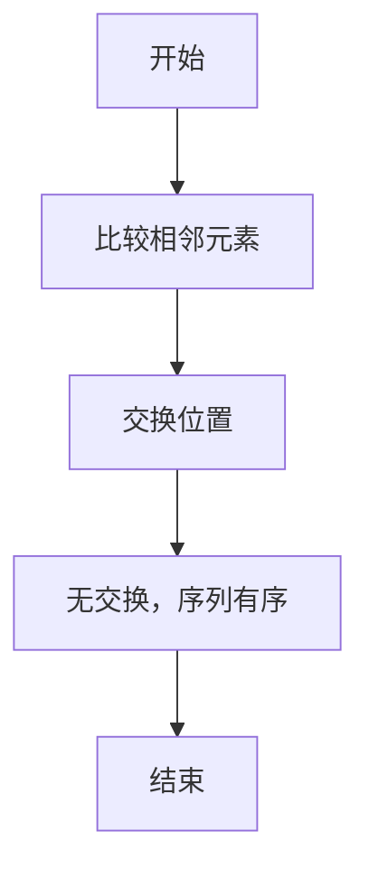
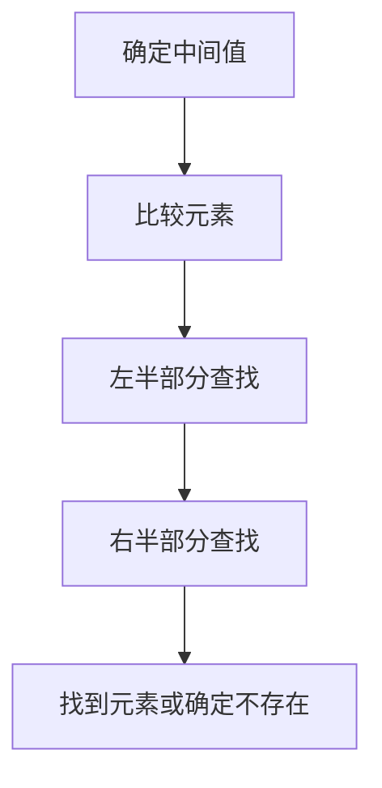
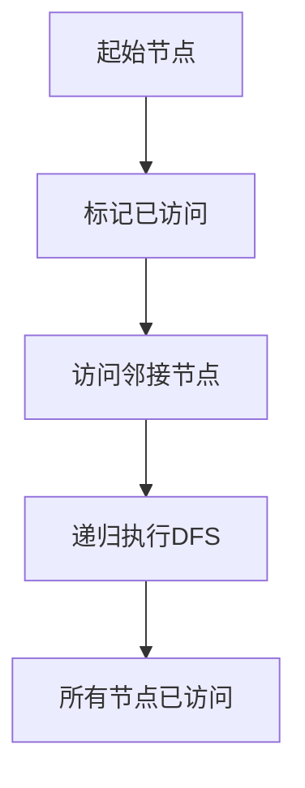

                 

  
## 1. 背景介绍

百度智能小程序是百度推出的一款轻量级应用，旨在将应用功能无缝集成到百度搜索、百度地图、百度浏览器等平台中，为用户提供一站式的便捷服务。自推出以来，百度智能小程序以其简洁的界面、强大的功能和良好的用户体验，受到了广大用户的喜爱。随着技术的不断进步和市场的需求变化，百度智能小程序在开发、测试、上线等方面也面临着新的挑战。

为了帮助广大应聘者更好地应对百度智能小程序校招面试，本文将对2024年百度智能小程序校招面试真题进行汇总，并给出详细的解答。这些题目涵盖了技术、算法、编程等多个方面，有助于应聘者全面了解百度智能小程序的相关知识和技术要点。

## 2. 核心概念与联系

在解答这些面试题之前，我们首先需要了解一些核心概念和它们之间的联系。

### 2.1. 百度智能小程序架构

百度智能小程序的架构主要包括前端、后端和数据库三个部分。前端负责用户界面的展示和交互，后端负责业务逻辑的处理，数据库则用于存储用户数据和业务数据。这三部分通过API进行通信，实现了数据的高效传输和业务流程的顺畅运行。



### 2.2. 技术栈

百度智能小程序采用多种技术栈，包括Vue.js、React、Node.js、MongoDB等。其中，Vue.js和React用于前端开发，Node.js用于后端开发，MongoDB用于数据库开发。



### 2.3. 算法与数据结构

在智能小程序开发过程中，算法和数据结构是核心组成部分。常见的算法包括排序、查找、图论等，常见的数据结构包括数组、链表、树、图等。



### 2.4. 云计算与大数据

百度智能小程序的开发和运行离不开云计算和大数据技术。云计算提供了强大的计算和存储能力，大数据技术则用于处理海量数据，为智能小程序提供精准的推荐和服务。



通过了解这些核心概念和联系，我们可以更好地理解和解答百度智能小程序校招面试中的各种问题。

## 3. 核心算法原理 & 具体操作步骤

### 3.1 算法原理概述

在百度智能小程序开发过程中，核心算法主要包括排序、查找、图论等。排序算法用于对数据进行排序，查找算法用于在数据中查找特定元素，图论算法用于处理图相关的问题。这些算法的基本原理和操作步骤如下：

#### 3.1.1 排序算法

排序算法的基本原理是将一组数据按照某种规则进行排列，使其变得有序。常见的排序算法有冒泡排序、选择排序、插入排序、快速排序等。每种算法都有其独特的操作步骤和优缺点。

#### 3.1.2 查找算法

查找算法的基本原理是在数据中查找特定元素，并返回其位置。常见的查找算法有顺序查找、二分查找等。顺序查找从数据序列的第一个元素开始，依次向后查找，直到找到目标元素或到达序列末尾。二分查找则利用中间值进行分治，逐步缩小查找范围，提高查找效率。

#### 3.1.3 图论算法

图论算法的基本原理是处理图相关的问题，如图的遍历、最短路径、最小生成树等。常见的图论算法有深度优先搜索（DFS）、广度优先搜索（BFS）、Dijkstra算法、Prim算法等。

### 3.2 算法步骤详解

#### 3.2.1 冒泡排序

冒泡排序的基本步骤如下：

1. 从第一个元素开始，相邻的两个元素进行比较，如果第一个元素比第二个元素大，则交换它们的位置。
2. 重复上述步骤，直到没有需要交换的元素为止。
3. 重复上述步骤，直到整个数据序列有序。



#### 3.2.2 二分查找

二分查找的基本步骤如下：

1. 确定中间值，将待查元素与中间值进行比较。
2. 如果待查元素小于中间值，则在左半部分继续查找；如果待查元素大于中间值，则在右半部分继续查找。
3. 重复上述步骤，直到找到目标元素或确定不存在目标元素。



#### 3.2.3 深度优先搜索（DFS）

深度优先搜索的基本步骤如下：

1. 从起始节点开始，将其标记为已访问。
2. 访问该节点的所有未访问的邻接节点，并按照深度优先的原则递归执行步骤1和2。
3. 当所有节点都被访问过，算法结束。



### 3.3 算法优缺点

每种算法都有其优缺点。以下是对几种常见算法的优缺点的简要分析：

#### 3.3.1 冒泡排序

优点：实现简单，易于理解。

缺点：效率较低，不适合大数据量排序。

#### 3.3.2 二分查找

优点：效率高，适用于大数据量查找。

缺点：需要预先对数据进行排序，不适用于动态数据。

#### 3.3.3 深度优先搜索（DFS）

优点：实现简单，适用于求解连通性、最短路径等问题。

缺点：可能陷入死循环，不适合处理有环的图。

### 3.4 算法应用领域

不同算法在智能小程序开发中有着广泛的应用。以下是一些常见的应用领域：

#### 3.4.1 排序算法

排序算法在智能小程序开发中常用于对用户数据进行排序，如排行榜、推荐列表等。

#### 3.4.2 查找算法

查找算法在智能小程序开发中常用于快速定位用户需求，如关键词搜索、地点查找等。

#### 3.4.3 图论算法

图论算法在智能小程序开发中常用于处理网络结构，如社交网络分析、交通路径规划等。

## 4. 数学模型和公式 & 详细讲解 & 举例说明

在智能小程序开发过程中，数学模型和公式是核心组成部分。以下将介绍一些常见的数学模型和公式，并进行详细讲解和举例说明。

### 4.1 数学模型构建

数学模型是描述现实世界中问题的抽象表示。在智能小程序开发中，常见的数学模型包括线性模型、决策树模型、神经网络模型等。

#### 4.1.1 线性模型

线性模型是一种描述线性关系的数学模型，通常表示为：

\[ y = w \cdot x + b \]

其中，\( y \) 表示因变量，\( x \) 表示自变量，\( w \) 表示权重，\( b \) 表示偏置。

#### 4.1.2 决策树模型

决策树模型是一种树形结构的数学模型，用于分类和回归问题。决策树的构建过程如下：

1. 选择一个特征作为分裂标准。
2. 计算每个特征的分裂信息，选择最优特征。
3. 根据最优特征创建分支，递归执行步骤1和2。

#### 4.1.3 神经网络模型

神经网络模型是一种模拟人脑神经元连接方式的数学模型，用于解决复杂的非线性问题。神经网络的基本结构包括输入层、隐藏层和输出层。

### 4.2 公式推导过程

数学模型的公式推导是建立数学模型的关键步骤。以下将介绍线性模型和决策树模型的公式推导过程。

#### 4.2.1 线性模型公式推导

线性模型公式推导的目的是确定权重和偏置的值。通常使用最小二乘法进行推导。

1. 假设数据集为 \( (x_1, y_1), (x_2, y_2), \ldots, (x_n, y_n) \)。
2. 建立损失函数 \( J(w, b) = \frac{1}{2n} \sum_{i=1}^{n} (y_i - w \cdot x_i - b)^2 \)。
3. 求损失函数关于权重和偏置的导数，并令导数为零，得到最优解。

\[ \frac{\partial J}{\partial w} = 0, \frac{\partial J}{\partial b} = 0 \]

4. 求解上述方程组，得到权重和偏置的值。

#### 4.2.2 决策树模型公式推导

决策树模型的公式推导主要涉及信息熵、信息增益和信息增益率等概念。

1. 信息熵 \( H(X) = -\sum_{i=1}^{n} p(x_i) \cdot \log_2 p(x_i) \)。
2. 信息增益 \( IG(X, A) = H(X) - \sum_{v=1}^{m} p(v) \cdot H(X|v) \)。
3. 信息增益率 \( G(X, A) = \frac{IG(X, A)}{H(A)} \)。

### 4.3 案例分析与讲解

以下将结合实际案例，对线性模型和决策树模型进行详细讲解。

#### 4.3.1 线性模型案例

假设我们有一个数据集，包含两个特征 \( x_1 \) 和 \( x_2 \)，以及对应的标签 \( y \)。我们的目标是建立一个线性模型来预测标签。

1. 首先，我们需要对数据进行预处理，包括归一化和标准化等。
2. 接下来，使用最小二乘法建立线性模型。

\[ y = w_1 \cdot x_1 + w_2 \cdot x_2 + b \]

3. 计算权重和偏置的最优值。

\[ w_1 = \frac{1}{n} \sum_{i=1}^{n} (y_i - w_2 \cdot x_{i2} - b) \cdot x_{i1}, w_2 = \frac{1}{n} \sum_{i=1}^{n} (y_i - w_1 \cdot x_{i1} - b) \cdot x_{i2}, b = \frac{1}{n} \sum_{i=1}^{n} (y_i - w_1 \cdot x_{i1} - w_2 \cdot x_{i2}) \]

4. 使用训练数据集对模型进行评估，调整参数以获得更好的预测效果。

#### 4.3.2 决策树模型案例

假设我们有一个分类问题，需要建立一个决策树模型来对数据进行分类。

1. 首先，我们需要对数据进行预处理，包括特征选择和归一化等。
2. 接下来，使用信息熵、信息增益和信息增益率等指标来选择最佳分裂特征。
3. 创建决策树，递归执行步骤2，直到满足停止条件（如最大深度、最小叶子节点数量等）。

4. 使用训练数据集对模型进行评估，调整参数以获得更好的分类效果。

## 5. 项目实践：代码实例和详细解释说明

### 5.1 开发环境搭建

在进行项目实践之前，我们需要搭建一个合适的开发环境。以下是一个基于Vue.js和Node.js的百度智能小程序开发环境的搭建步骤：

1. 安装Node.js：从官方网站下载并安装Node.js。
2. 安装Vue CLI：在命令行中执行以下命令：

```bash
npm install -g @vue/cli
```

3. 创建Vue项目：

```bash
vue create baidu-smart-program
```

4. 进入项目目录：

```bash
cd baidu-smart-program
```

5. 安装Vue Router、Vuex等依赖：

```bash
npm install vue-router vuex
```

6. 安装Node.js服务器框架（如Express）：

```bash
npm install express
```

### 5.2 源代码详细实现

以下是一个简单的百度智能小程序项目示例，包括前端和后端部分。

**前端代码（src/App.vue）：**

```vue
<template>
  <div id="app">
    
    <HelloWorld msg="Welcome to Your Vue.js App"/>
  </div>
</template>

<script>
import HelloWorld from './components/HelloWorld.vue'

export default {
  name: 'App',
  components: {
    HelloWorld
  }
}
</script>

<style>
#app {
  font-family: Avenir, Helvetica, Arial, sans-serif;
  -webkit-font-smoothing: antialiased;
  -moz-osx-font-smoothing: grayscale;
  text-align: center;
  color: #2c3e50;
  margin-top: 60px;
}
</style>
```

**后端代码（server.js）：**

```javascript
const express = require('express');
const app = express();

app.get('/api/data', (req, res) => {
  res.json({
    data: 'Hello, Baidu Smart Program!'
  });
});

app.listen(3000, () => {
  console.log('Server is running on port 3000');
});
```

### 5.3 代码解读与分析

在前端代码中，我们使用了Vue.js框架来构建用户界面。通过`<template>`标签定义了HTML结构，通过`<script>`标签定义了Vue实例的配置，包括组件和全局样式。在`<style>`标签中，我们设置了页面的全局样式。

在后端代码中，我们使用了Node.js和Express框架来构建服务器。通过`app.get('/api/data', ...)`方法，我们定义了一个GET请求处理函数，用于响应客户端的请求，并返回JSON格式的数据。

### 5.4 运行结果展示

1. 启动Vue项目：

```bash
npm run serve
```

2. 启动后端服务器：

```bash
node server.js
```

3. 打开浏览器，访问`http://localhost:8080/`，可以看到Vue项目的首页。

4. 在浏览器中访问`http://localhost:3000/api/data`，可以看到后端返回的JSON数据。

## 6. 实际应用场景

百度智能小程序在实际应用场景中具有广泛的应用，以下列举一些常见的应用场景：

### 6.1 购物小程序

购物小程序可以方便用户在百度平台上进行商品搜索、浏览、下单和支付等操作。通过百度智能小程序，用户无需下载和安装单独的应用，即可享受到一站式购物体验。

### 6.2 生活服务小程序

生活服务小程序包括餐厅预订、酒店预订、出行预订等，为用户提供便捷的生活服务。用户可以通过百度智能小程序快速查询附近的服务信息，并进行在线预订。

### 6.3 社交小程序

社交小程序可以方便用户在百度平台上进行社交互动，如发朋友圈、评论、点赞等。通过百度智能小程序，用户可以随时随地与朋友保持联系。

### 6.4 信息查询小程序

信息查询小程序可以为用户提供各种信息查询服务，如天气查询、新闻查询、股票查询等。用户可以通过百度智能小程序快速获取所需信息。

## 7. 未来应用展望

随着技术的不断进步和市场需求的变化，百度智能小程序在未来的发展前景非常广阔。以下是一些未来应用展望：

### 7.1 人工智能与智能小程序的融合

人工智能技术的不断发展将推动智能小程序的功能和性能提升。通过深度学习、自然语言处理等技术，智能小程序可以实现更智能的交互和更精准的推荐。

### 7.2 跨平台发展

随着移动设备的普及，跨平台开发将成为智能小程序发展的一个重要方向。百度智能小程序将有望支持更多平台，如iOS、Android等，为用户提供更好的跨平台体验。

### 7.3 物联网应用

物联网技术的发展将为智能小程序带来新的应用场景。通过智能小程序，用户可以实现对智能家居设备的远程控制，实现智能化生活。

### 7.4 营销与推广

智能小程序将成为企业营销和推广的重要工具。通过百度智能小程序，企业可以更精准地触达目标用户，提高品牌知名度和用户粘性。

## 8. 工具和资源推荐

### 8.1 学习资源推荐

1. 《Vue.js实战》
2. 《深入理解Vue.js》
3. 《Node.js实战》
4. 《Express实战》

### 8.2 开发工具推荐

1. Vue CLI
2. Visual Studio Code
3. Git

### 8.3 相关论文推荐

1. "A Comprehensive Survey on Deep Learning for Natural Language Processing"
2. "A Brief History of Neural Network Models for Natural Language Processing"
3. "Natural Language Inference: An Overview"
4. "Cross-Platform Development with Flutter"

## 9. 总结：未来发展趋势与挑战

### 9.1 研究成果总结

本文对百度智能小程序的核心概念、算法原理、数学模型、项目实践等进行了全面分析和讲解，总结了智能小程序在实际应用场景中的重要性以及未来发展趋势。

### 9.2 未来发展趋势

1. 人工智能与智能小程序的融合
2. 跨平台发展
3. 物联网应用
4. 营销与推广

### 9.3 面临的挑战

1. 技术创新与安全风险
2. 数据隐私与用户信任
3. 平台竞争与市场份额

### 9.4 研究展望

未来，智能小程序领域将不断涌现新的研究成果，推动智能小程序在各个领域的发展。同时，也需要关注并解决面临的技术挑战和用户需求变化。

## 附录：常见问题与解答

### 1. 什么是百度智能小程序？

百度智能小程序是一种轻量级应用，旨在将应用功能无缝集成到百度搜索、百度地图、百度浏览器等平台中，为用户提供一站式的便捷服务。

### 2. 百度智能小程序的优势是什么？

百度智能小程序的优势包括：

1. 集成度高，无缝接入百度平台。
2. 开发便捷，使用多种技术栈支持。
3. 性能优越，高效处理海量数据。
4. 用户体验好，简洁易用。

### 3. 百度智能小程序的开发流程是怎样的？

百度智能小程序的开发流程包括：

1. 环境搭建。
2. 前端开发。
3. 后端开发。
4. 联调测试。
5. 上线发布。

### 4. 百度智能小程序如何实现跨平台？

百度智能小程序通过使用Vue.js、React等跨平台框架，可以实现iOS、Android等平台的兼容。此外，百度智能小程序还提供了跨平台开发工具，如Flutter等。

### 5. 百度智能小程序在未来的发展趋势是什么？

百度智能小程序在未来的发展趋势包括：

1. 人工智能与智能小程序的融合。
2. 跨平台发展。
3. 物联网应用。
4. 营销与推广。

