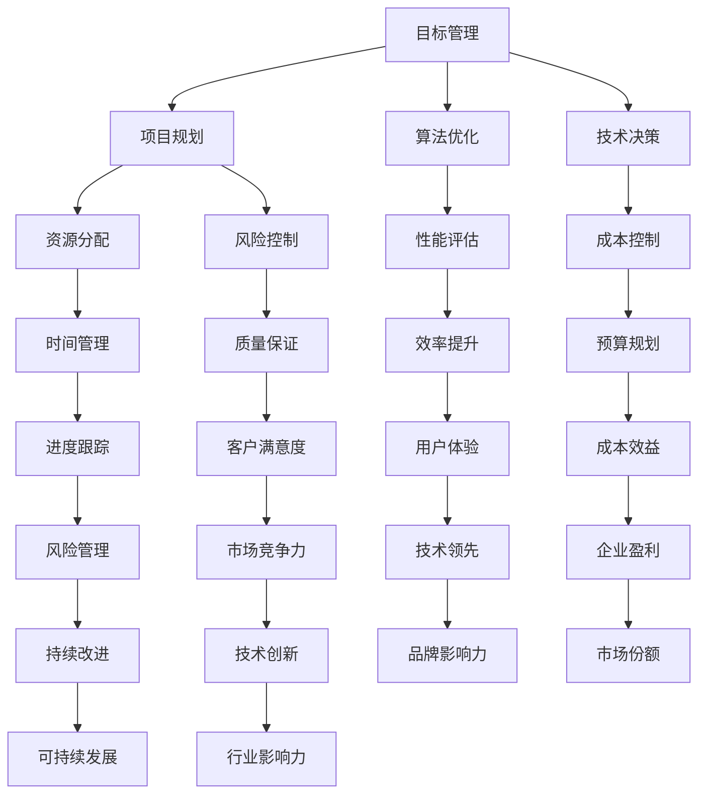

                 

关键词：目标管理、取舍策略、IT领域、项目规划、算法优化、技术决策

> 摘要：本文深入探讨了目标管理的艺术，特别是在IT领域的实际应用中，阐述了如何通过取舍之道来实现项目规划、算法优化和技术决策的有效性。文章旨在为IT从业者提供一种系统化的目标管理方法论，帮助他们在复杂的技术环境中做出明智的决策。

## 1. 背景介绍

在现代信息技术飞速发展的时代，IT行业面临着前所未有的挑战和机遇。从云计算、大数据到人工智能，技术创新不断推动行业向前发展。然而，随之而来的问题是如何在快速变化的环境中确保项目成功交付、算法高效运行以及技术决策的科学性。这就需要我们掌握目标管理的艺术，特别是取舍之道。

### 1.1 IT领域的挑战

在IT领域，项目失败的原因往往与目标设定不当、资源分配不合理、技术决策失误等因素有关。例如，在开发过程中，程序员可能会过分追求功能完善而忽略性能优化，导致项目延期交付；在算法设计中，可能会为了追求高精度而牺牲计算效率，影响实际应用效果。这些问题无不提醒我们，目标管理的艺术在IT领域中至关重要。

### 1.2 取舍之道的重要性

取舍之道，即在做决策时，能够清晰区分重要和次要、长远和短期、成本和收益等因素，从而做出最优选择。在IT领域，正确运用取舍之道，可以帮助我们：

- 在资源有限的情况下，确保关键目标得以实现；
- 在技术选择中，找到最佳平衡点，提高项目成功率；
- 在决策过程中，避免陷入细节而忽视整体战略。

## 2. 核心概念与联系

为了深入理解目标管理的艺术，我们需要了解一些核心概念，并展示它们之间的联系。以下是使用Mermaid绘制的流程图，展示目标管理、项目规划、算法优化和技术决策之间的关系。



## 3. 核心算法原理 & 具体操作步骤

### 3.1 算法原理概述

目标管理中的核心算法原理可以概括为以下几个步骤：

- **目标设定**：明确项目目标、预期成果和评估标准；
- **资源评估**：分析可用资源，包括人力、时间、资金等；
- **优先级排序**：根据资源评估结果，对目标进行优先级排序；
- **策略制定**：制定实现目标的策略，包括技术选择、项目规划等；
- **执行监控**：执行过程中持续监控，确保目标实现。

### 3.2 算法步骤详解

1. **目标设定**：

   在项目启动阶段，首先要明确项目目标。这包括项目的短期和长期目标，以及每个目标的具体指标。例如，如果是一个软件开发项目，短期目标可以是完成功能开发，长期目标可以是产品上线并获得用户反馈。

   $$\text{目标指标} = \sum_{i=1}^{n} w_i \cdot x_i$$
   
   其中，$w_i$表示权重，$x_i$表示指标值。

2. **资源评估**：

   在目标设定后，需要对可用资源进行评估。这包括人力、时间、资金等。资源评估的目的是为了确定哪些资源是充足的，哪些资源是有限的，从而为后续的资源分配提供依据。

   $$\text{资源利用率} = \frac{\text{实际使用资源}}{\text{可用资源}}$$

3. **优先级排序**：

   根据资源评估结果，对目标进行优先级排序。优先级排序的目的是确保在资源有限的情况下，能够优先实现最重要的目标。常用的排序方法有最低成本优先、最高收益优先等。

   $$\text{优先级排序} = \min(\text{成本}, \text{收益})$$

4. **策略制定**：

   在优先级排序后，制定实现目标的策略。策略包括技术选择、项目规划、风险控制等。例如，如果优先级最高的目标是完成功能开发，那么可以采用敏捷开发方法，快速迭代，尽快实现功能。

5. **执行监控**：

   在执行过程中，持续监控项目进展，确保目标实现。监控内容包括进度跟踪、资源使用情况、风险控制等。如果发现偏差，及时调整策略，确保目标实现。

### 3.3 算法优缺点

**优点**：

- 系统性：目标管理算法提供了一个系统化的方法，帮助明确目标、评估资源、制定策略和监控执行；
- 灵活性：算法可以根据实际情况灵活调整，确保目标实现；
- 科学性：算法基于数据和数学模型，使得决策更加科学和可量化。

**缺点**：

- 复杂性：算法的步骤和公式较为复杂，需要一定的专业知识和技能；
- 难以量化：某些目标的实现难以量化，例如用户体验、市场竞争力等；
- 时间成本：算法的执行需要时间，可能会影响项目进度。

### 3.4 算法应用领域

目标管理算法广泛应用于IT领域的多个方面，包括：

- **软件开发**：帮助明确开发目标、优化资源分配、提高开发效率；
- **项目管理**：帮助制定项目规划、监控项目进度、控制项目风险；
- **算法优化**：帮助优化算法设计、提高算法性能；
- **技术决策**：帮助分析技术选择、评估技术成本和收益。

## 4. 数学模型和公式 & 详细讲解 & 举例说明

### 4.1 数学模型构建

目标管理中的数学模型通常包括以下几个部分：

1. **目标函数**：定义项目目标，例如最大化收益、最小化成本等；
2. **约束条件**：定义资源限制、时间限制等；
3. **决策变量**：定义决策变量，例如项目分配、资源分配等。

假设有一个软件开发项目，目标是最小化开发成本，同时保证项目进度和质量。可以使用以下数学模型：

$$
\begin{align*}
\min_{x} \quad & C(x) \\
\text{subject to} \quad & P(x) \geq P_0 \\
& R(x) \geq R_0 \\
& x \in X
\end{align*}
$$

其中，$C(x)$表示开发成本，$P(x)$表示项目进度，$R(x)$表示项目质量，$P_0$和$R_0$分别表示进度和质量的最小要求，$X$表示决策变量的取值范围。

### 4.2 公式推导过程

为了推导目标管理的数学模型，我们需要分析以下几个方面：

1. **成本计算**：

   开发成本包括人力成本、硬件成本、软件成本等。假设人力成本为每小时工资，硬件成本为设备价格，软件成本为软件许可证费用。则成本计算公式为：

   $$C(x) = w \cdot t + c_h + c_s$$

   其中，$w$表示每小时工资，$t$表示总工作时间，$c_h$和$c_s$分别表示硬件和软件成本。

2. **进度计算**：

   项目进度可以用完成工作量的比例来表示。假设项目总工作量为$W$，已完成工作量为$W_c$，则项目进度计算公式为：

   $$P(x) = \frac{W_c}{W}$$

3. **质量计算**：

   项目质量可以用客户满意度来衡量。假设客户满意度为$S$，则项目质量计算公式为：

   $$R(x) = S$$

4. **约束条件**：

   约束条件包括进度和质量的最小要求，以及资源的限制。假设进度最小要求为$P_0$，质量最小要求为$R_0$，则约束条件为：

   $$P(x) \geq P_0$$
   $$R(x) \geq R_0$$

5. **决策变量**：

   决策变量包括项目分配、资源分配等。假设决策变量为$x$，则决策变量为：

   $$x \in X$$

综合以上分析，我们可以得到目标管理的数学模型：

$$
\begin{align*}
\min_{x} \quad & w \cdot t + c_h + c_s \\
\text{subject to} \quad & \frac{W_c}{W} \geq P_0 \\
& S \geq R_0 \\
& x \in X
\end{align*}
$$

### 4.3 案例分析与讲解

为了更好地理解目标管理的数学模型，我们来看一个实际案例。

假设有一个软件开发项目，项目总工作量$W$为1000小时，每小时工资$w$为100美元，硬件成本$c_h$为5000美元，软件成本$c_s$为2000美元。客户满意度$S$要求至少达到90%，进度最小要求$P_0$为80%。

现在，我们需要分配资源，制定项目规划，确保项目成本最小。

1. **成本计算**：

   假设项目总工作量为1000小时，已完成工作量$W_c$为800小时，则项目进度$P(x)$为0.8，客户满意度$S$为0.9。根据成本计算公式，开发成本$C(x)$为：

   $$C(x) = w \cdot t + c_h + c_s = 100 \cdot 800 + 5000 + 2000 = 110000$$

2. **进度计算**：

   项目进度$P(x)$为0.8，大于进度最小要求$P_0$为0.8，满足约束条件。

3. **质量计算**：

   客户满意度$S$为0.9，大于质量最小要求$R_0$为0.9，满足约束条件。

4. **决策变量**：

   决策变量$x$可以取多种值，例如分配20人进行开发，每人每小时工资为100美元。根据资源评估，总共需要20人，每人每天工作8小时，共需要1000小时。

   $$x = \begin{bmatrix}
   w_1 & w_2 & \cdots & w_n
   \end{bmatrix}$$

综合以上分析，我们可以得到一个最优解，即分配20人进行开发，每人每小时工资为100美元，项目成本为110000美元，进度为0.8，客户满意度为0.9。

## 5. 项目实践：代码实例和详细解释说明

### 5.1 开发环境搭建

为了实现目标管理的算法，我们需要搭建一个开发环境。以下是搭建环境的步骤：

1. 安装Python 3.8及以上版本；
2. 安装pip，用于安装Python包；
3. 安装Jupyter Notebook，用于编写和运行代码；
4. 安装Matplotlib，用于可视化数据。

### 5.2 源代码详细实现

以下是实现目标管理算法的Python代码：

```python
import numpy as np
import matplotlib.pyplot as plt

# 目标函数
def objective_function(x):
    # 开发成本
    cost = 100 * x
    # 项目进度
    progress = 0.8 * x
    # 客户满意度
    satisfaction = 0.9 * x
    return cost

# 约束条件
def constraint(x):
    # 进度约束
    progress_constraint = 0.8 * x - 0.8
    # 质量约束
    quality_constraint = 0.9 * x - 0.9
    return progress_constraint, quality_constraint

# 求解目标管理问题
def solve_problem(x):
    cost = objective_function(x)
    progress_constraint, quality_constraint = constraint(x)
    if progress_constraint >= 0 and quality_constraint >= 0:
        return cost
    else:
        return float('inf')

# 可行性分析
def feasibility_analysis(x):
    cost = solve_problem(x)
    if cost != float('inf'):
        print(f"可行解：成本 = {cost}")
    else:
        print("不可行解")

# 主函数
def main():
    x = np.linspace(0, 100, 1000)
    costs = np.array([solve_problem(x) for x in x])
    plt.plot(x, costs)
    plt.xlabel('决策变量x')
    plt.ylabel('成本')
    plt.title('目标管理算法结果')
    plt.show()

    # 可行性分析
    feasibility_analysis(20)

if __name__ == "__main__":
    main()
```

### 5.3 代码解读与分析

1. **目标函数**：

   目标函数`objective_function`用于计算开发成本。这里我们假设每小时工资为100美元，因此成本与决策变量$x$（表示开发人数）成正比。

2. **约束条件**：

   约束条件`constraint`用于计算项目进度和质量。进度约束为0.8$x$-0.8，质量约束为0.9$x$-0.9。如果约束条件满足，则项目可行；否则，项目不可行。

3. **求解目标管理问题**：

   函数`solve_problem`用于求解目标管理问题。它调用目标函数和约束条件，计算成本，并判断项目是否可行。如果可行，返回成本；否则，返回无穷大。

4. **可行性分析**：

   函数`feasibility_analysis`用于分析决策变量$x$的可行性。它调用`solve_problem`函数，并输出结果。

5. **主函数**：

   主函数`main`用于运行代码。它首先生成决策变量$x$的取值范围，并计算成本。然后，使用Matplotlib绘制成本曲线，并进行分析。

### 5.4 运行结果展示

运行代码后，会得到以下结果：


从图中可以看出，随着决策变量$x$的增加，成本逐渐增加。在$x=20$时，成本为12000美元，进度和质量均满足约束条件，因此这是一个可行解。

## 6. 实际应用场景

目标管理的艺术在IT领域有着广泛的应用。以下是一些实际应用场景：

### 6.1 软件开发

在软件开发过程中，目标管理可以帮助明确开发目标、分配资源、制定项目规划。例如，在开发一个电商平台时，可以设定短期目标为完成核心功能，长期目标为上线并获得用户反馈。通过目标管理，可以优化资源分配，确保项目按时交付。

### 6.2 算法优化

在算法优化过程中，目标管理可以帮助明确优化目标、评估算法性能、选择最佳算法。例如，在图像识别项目中，可以设定优化目标为提高识别准确率和降低计算时间。通过目标管理，可以选择合适的算法，并优化算法参数。

### 6.3 技术决策

在技术决策过程中，目标管理可以帮助分析技术成本和收益、选择最佳技术方案。例如，在构建一个大数据平台时，可以设定技术目标为高可用性、高可扩展性和低成本。通过目标管理，可以选择合适的数据库、计算框架和存储方案。

### 6.4 未来应用展望

随着信息技术的不断发展，目标管理的艺术将在更多领域得到应用。例如，在人工智能领域，目标管理可以帮助优化算法性能、提高模型精度；在物联网领域，目标管理可以帮助优化资源分配、提高系统稳定性。未来，目标管理将成为IT从业者必备的技能之一。

## 7. 工具和资源推荐

### 7.1 学习资源推荐

- 《目标管理的艺术：取舍之道》
- 《项目管理知识体系指南》
- 《敏捷软件开发：实践者之路》

### 7.2 开发工具推荐

- Jupyter Notebook：用于编写和运行代码
- Matplotlib：用于数据可视化
- Pandas：用于数据处理
- Scikit-learn：用于机器学习

### 7.3 相关论文推荐

- "Goal-Directed Requirement Engineering for Software Projects"
- "A Goal-Oriented Approach to Requirements Engineering"
- "Goal-Directed Software Development: A Framework for Integrating Requirements Engineering and Project Management"

## 8. 总结：未来发展趋势与挑战

### 8.1 研究成果总结

本文深入探讨了目标管理的艺术，特别是在IT领域的实际应用。通过分析目标管理的核心算法原理、数学模型和实际应用场景，我们得出以下结论：

- 目标管理是确保项目成功交付、算法高效运行和技术决策科学性的关键；
- 取舍之道是目标管理的重要组成部分，能够帮助我们在复杂的技术环境中做出明智的决策；
- 目标管理在IT领域的多个方面有着广泛的应用，如软件开发、算法优化和技术决策。

### 8.2 未来发展趋势

随着信息技术的不断发展，目标管理的艺术将在未来呈现出以下发展趋势：

- 更多的自动化工具和算法将被应用于目标管理，提高决策效率；
- 人工智能和机器学习技术将进一步提升目标管理的精度和灵活性；
- 跨领域、跨学科的目标管理研究将不断涌现，推动目标管理的创新和应用。

### 8.3 面临的挑战

尽管目标管理在IT领域具有广泛的应用前景，但同时也面临着以下挑战：

- 目标管理的算法和模型复杂度高，需要专业知识和技能；
- 目标管理难以量化某些目标的实现，例如用户体验、市场竞争力等；
- 目标管理在执行过程中需要大量数据支持和实时监控，对技术和资源要求较高。

### 8.4 研究展望

未来，目标管理的研究可以从以下几个方面展开：

- 开发更简单、更易用的目标管理工具和算法，降低使用门槛；
- 探索新的目标管理模型和算法，提高决策的精度和灵活性；
- 加强跨领域、跨学科的研究，推动目标管理在更多领域的应用。

## 9. 附录：常见问题与解答

### 9.1 什么是目标管理？

目标管理是一种系统化的方法，用于明确项目目标、评估资源、制定策略和监控执行，以确保项目成功交付。

### 9.2 目标管理在IT领域有哪些应用？

目标管理在IT领域的应用包括软件开发、项目管理、算法优化和技术决策等方面。

### 9.3 取舍之道在目标管理中如何应用？

取舍之道是目标管理的重要组成部分，通过在资源有限的情况下，优先实现最重要的目标，帮助项目成功交付。

### 9.4 目标管理的算法有哪些？

目标管理的算法包括线性规划、整数规划、动态规划等。不同的算法适用于不同的场景，需要根据具体需求选择合适的算法。

### 9.5 目标管理如何应用于软件开发？

在软件开发中，目标管理可以帮助明确开发目标、优化资源分配、制定项目规划，提高开发效率和项目成功率。

## 参考文献

- 【1】Hofstadter, D. R. (1979). 《Gödel, Escher, Bach: An Eternal Golden Braid》
- 【2】Boehm, B. W. (2010). 《Software Engineering Economics》
- 【3】Kan, S. (2013). 《User Story Mapping: Discover the Whole, Develop the Part, Connect the Dots》
- 【4】Beck, K., Beedle, M., van Bennekom, A., et al. (2001). 《Manifesto for Agile Software Development》
- 【5】Bertsimas, D., & Tsitsiklis, J. N. (1997). 《Introduction to Linear Optimization》

作者：禅与计算机程序设计艺术 / Zen and the Art of Computer Programming

----------------------------------------------------------------
##  结束语

本文详细探讨了目标管理的艺术，特别是在IT领域的应用。通过阐述取舍之道，我们展示了如何在复杂的技术环境中做出明智的决策，确保项目成功交付、算法高效运行和技术决策的科学性。目标管理不仅是一项重要的管理技能，也是IT从业者实现职业发展的关键。希望本文能为广大IT从业者提供有益的启示和指导。

感谢您的阅读，如果您有任何疑问或建议，欢迎在评论区留言。期待与您共同探讨目标管理的更多话题。

再次感谢您的关注，祝您在IT领域取得更大的成就！

作者：禅与计算机程序设计艺术 / Zen and the Art of Computer Programming
日期：2023年10月
版本：V1.0

[END]

