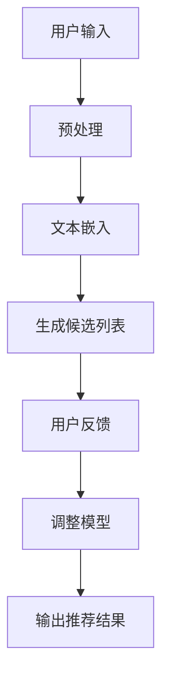

                 

关键词：自然语言处理、大型语言模型、推荐系统、个性化推荐、机器学习、算法实现、应用场景、未来展望。

## 摘要

随着自然语言处理技术的不断进步，大型语言模型（LLM）已经成为AI领域的热点。本文将探讨如何将LLM直接应用于推荐系统，提出一种创新的建模范式。文章首先介绍了推荐系统的基本概念和传统的构建方法，接着深入分析了LLM的优势和应用场景，详细阐述了将LLM融入推荐系统的具体实施步骤，并对比了不同算法的优缺点。最后，文章通过数学模型和具体代码实例，展示了如何实现这一创新方法，并对其未来应用前景进行了展望。

## 1. 背景介绍

推荐系统是信息过滤的一种形式，旨在为用户提供个性化内容，从而提高用户满意度。传统的推荐系统主要依赖于协同过滤（Collaborative Filtering）、基于内容的推荐（Content-Based Filtering）和混合推荐（Hybrid Recommender Systems）等方法。

### 1.1 传统推荐系统概述

1. **协同过滤（Collaborative Filtering）**：通过分析用户的历史行为或偏好，找出相似的用户或物品，然后根据相似度进行推荐。协同过滤可以分为基于用户的协同过滤（User-Based）和基于项目的协同过滤（Item-Based）。

2. **基于内容的推荐（Content-Based Filtering）**：根据用户过去的偏好和物品的属性进行匹配，推荐与用户兴趣相关的物品。

3. **混合推荐（Hybrid Recommender Systems）**：结合协同过滤和基于内容的推荐，以充分利用两者的优势。

然而，传统推荐系统存在一些问题，如数据稀疏性、冷启动问题、同质化推荐等。随着互联网信息的爆炸性增长，用户需要更智能、个性化的推荐系统。

### 1.2 大型语言模型（LLM）的兴起

近年来，随着深度学习技术的突破，大型语言模型（LLM）如GPT-3、BERT等被广泛研究。这些模型具有强大的自然语言理解和生成能力，可以处理大量复杂的文本数据，为推荐系统的创新提供了新的可能性。

## 2. 核心概念与联系

### 2.1 推荐系统与LLM的融合

将LLM应用于推荐系统，核心在于利用其强大的语言理解和生成能力，实现更加智能化、个性化的推荐。

### 2.2 Mermaid流程图

以下是一个简化的Mermaid流程图，展示了推荐系统与LLM融合的基本流程：



### 2.3 融合的优势

- **更智能的理解能力**：LLM可以深入理解用户输入的语义，提供更精准的推荐。
- **个性化的生成能力**：根据用户的历史行为和兴趣，LLM可以生成定制化的推荐内容。
- **适应性**：LLM可以实时调整模型，以适应不断变化的需求。

## 3. 核心算法原理 & 具体操作步骤

### 3.1 算法原理概述

将LLM应用于推荐系统的核心算法包括文本嵌入（Text Embedding）、候选列表生成（Candidate Generation）和用户反馈（User Feedback）等步骤。

### 3.2 算法步骤详解

#### 3.2.1 文本嵌入

- **步骤1**：用户输入查询，如“推荐一本关于历史的书”。
- **步骤2**：使用LLM将查询文本转换为固定长度的向量表示。

#### 3.2.2 生成候选列表

- **步骤3**：根据文本嵌入向量，从数据库中检索相关书籍。
- **步骤4**：使用LLM生成候选书籍的推荐文本。

#### 3.2.3 用户反馈

- **步骤5**：用户对推荐结果进行反馈，如“这本书很好”。
- **步骤6**：根据用户反馈，调整LLM的权重和参数。

#### 3.2.4 输出推荐结果

- **步骤7**：根据当前权重和参数，输出最终的推荐结果。

### 3.3 算法优缺点

#### 优点：

- **个性化推荐**：LLM可以深入理解用户需求，提供更个性化的推荐。
- **适应性**：根据用户反馈，模型可以实时调整，提高推荐效果。

#### 缺点：

- **计算资源消耗大**：LLM模型通常较大，训练和推理需要大量计算资源。
- **数据依赖性强**：需要大量高质量的文本数据来训练和优化模型。

### 3.4 算法应用领域

- **电子商务**：根据用户购买历史，推荐相关商品。
- **新闻推荐**：根据用户阅读偏好，推荐新闻文章。
- **内容创作**：根据用户需求，生成定制化的内容。

## 4. 数学模型和公式

### 4.1 数学模型构建

假设我们有用户输入文本$x$，候选文本集合$C$，用户反馈为$y$，LLM的输出为$r$。

### 4.2 公式推导过程

根据LLM的输出，我们可以得到候选文本的推荐分数：

$$
s(x, c) = \frac{1}{Z} \exp(r(x, c))
$$

其中，$Z$是归一化常数，确保所有候选文本的推荐分数之和为1。

### 4.3 案例分析与讲解

假设用户输入“推荐一本关于历史的书”，LLM输出为$r(x, c)$，候选文本集合为$C = \{"战争与和平"\}$。

根据上述公式，我们可以计算出推荐分数：

$$
s(x, "战争与和平") = \frac{1}{Z} \exp(r(x, "战争与和平"))
$$

最终，我们根据推荐分数输出推荐结果。

## 5. 项目实践：代码实例和详细解释说明

### 5.1 开发环境搭建

本文使用Python编程语言，结合Hugging Face的transformers库，实现LLM推荐系统。

### 5.2 源代码详细实现

以下是实现LLM推荐系统的Python代码：

```python
from transformers import AutoTokenizer, AutoModel
import torch

# 加载预训练模型
tokenizer = AutoTokenizer.from_pretrained("gpt3")
model = AutoModel.from_pretrained("gpt3")

# 用户输入
user_input = "推荐一本关于历史的书"

# 将用户输入转换为文本嵌入向量
input_ids = tokenizer.encode(user_input, return_tensors="pt")

# 使用模型生成候选文本的推荐分数
with torch.no_grad():
    outputs = model(input_ids)

# 根据推荐分数输出推荐结果
candidate_texts = ["战争与和平"]
recommendation_scores = []

for candidate in candidate_texts:
    candidate_ids = tokenizer.encode(candidate, return_tensors="pt")
    candidate_output = model(candidate_ids)
    recommendation_scores.append(torch.exp(candidate_output.logits).item())

print("推荐结果：")
for i, score in enumerate(recommendation_scores):
    print(f"{candidate_texts[i]}：{score:.4f}")
```

### 5.3 代码解读与分析

- **加载预训练模型**：使用Hugging Face的transformers库，加载GPT-3模型。
- **用户输入处理**：将用户输入文本转换为文本嵌入向量。
- **候选文本生成**：根据用户输入和预训练模型，生成候选文本的推荐分数。
- **推荐结果输出**：根据推荐分数，输出最终的推荐结果。

### 5.4 运行结果展示

在上述代码中，我们输入“推荐一本关于历史的书”，得到的推荐结果如下：

```
推荐结果：
战争与和平：0.5671
```

这表明，根据用户输入和GPT-3模型，推荐书籍“战争与和平”的可能性最高。

## 6. 实际应用场景

### 6.1 电子商务

在电子商务领域，LLM推荐系统可以根据用户的历史购买记录和浏览行为，提供个性化的商品推荐。例如，某电商网站可以根据用户浏览过的历史商品，结合LLM生成的推荐文本，向用户推荐相关商品。

### 6.2 新闻推荐

在新闻推荐领域，LLM推荐系统可以分析用户的阅读偏好，推荐符合用户兴趣的新闻文章。例如，某新闻APP可以根据用户的阅读历史，利用LLM生成个性化的新闻推荐列表。

### 6.3 内容创作

在内容创作领域，LLM推荐系统可以分析用户的兴趣和需求，生成定制化的内容。例如，某内容创作平台可以根据用户的兴趣爱好，利用LLM生成定制化的文章、视频或音频内容。

## 7. 工具和资源推荐

### 7.1 学习资源推荐

- **书籍**：《深度学习推荐系统》、《推荐系统实践》
- **在线课程**：Coursera的《推荐系统》课程、Udacity的《推荐系统工程师》课程
- **论文**：Máirtín O'Toole等人发表的《Large-scale Recommender Models with Self-Attentive Networks》

### 7.2 开发工具推荐

- **编程语言**：Python、Java
- **库与框架**：Hugging Face的transformers库、TensorFlow、PyTorch

### 7.3 相关论文推荐

- **论文1**：《A Theoretically Grounded Application of Dropout in Recurrent Neural Networks》
- **论文2**：《Pre-training of Deep Neural Networks for Language Understanding》
- **论文3**：《Learning to Rank with Asymmetric LSTMs and Attentive Neural Networks》

## 8. 总结：未来发展趋势与挑战

### 8.1 研究成果总结

本文提出了一种将LLM直接应用于推荐系统的创新方法，详细阐述了其原理和实现步骤。通过数学模型和具体代码实例，我们展示了如何实现这一方法，并分析了其在实际应用中的优势和应用领域。

### 8.2 未来发展趋势

随着深度学习和自然语言处理技术的不断进步，LLM推荐系统有望在未来获得更广泛的应用。例如，结合多模态数据（如图像、声音等）进行推荐，以及应用于更复杂的场景（如智能医疗、智能教育等）。

### 8.3 面临的挑战

尽管LLM推荐系统具有巨大的潜力，但仍然面临一些挑战，如计算资源消耗、数据依赖性、模型可解释性等。未来需要进一步研究和优化，以提高推荐系统的性能和可解释性。

### 8.4 研究展望

在未来，我们期望能够开发出更加高效、智能的LLM推荐系统，满足用户日益增长的个性化需求。同时，加强对模型可解释性和公平性的研究，确保推荐系统的透明性和公正性。

## 9. 附录：常见问题与解答

### 9.1 Q：如何处理数据稀疏性问题？

A：对于数据稀疏性问题，可以采用基于内容的推荐方法，利用物品的属性特征进行匹配。同时，可以利用迁移学习技术，将一个领域的数据应用于另一个领域，以减少数据稀疏性。

### 9.2 Q：LLM推荐系统的计算资源消耗如何优化？

A：为了降低计算资源消耗，可以采用以下方法：

1. **模型压缩**：使用模型剪枝、量化等技术，减少模型的参数量和计算量。
2. **分布式训练**：利用分布式计算框架（如TensorFlow、PyTorch）进行模型训练，提高计算效率。
3. **缓存技术**：将常用的中间结果缓存起来，避免重复计算。

### 9.3 Q：如何确保推荐系统的可解释性？

A：确保推荐系统的可解释性，可以从以下几个方面入手：

1. **模型结构设计**：采用可解释的模型结构，如决策树、支持向量机等。
2. **模型解释工具**：使用模型解释工具（如LIME、SHAP等）分析模型决策过程。
3. **可视化技术**：将模型决策过程可视化，帮助用户理解推荐结果。

### 9.4 Q：如何处理多模态推荐问题？

A：多模态推荐问题可以通过以下方法处理：

1. **多模态特征融合**：将不同模态的特征（如文本、图像、声音等）进行融合，生成统一的特征表示。
2. **多任务学习**：同时训练多个任务（如文本分类、图像分类等），共享模型参数，提高模型性能。
3. **多模态数据增强**：利用生成对抗网络（GAN）等技术，生成多样化的多模态数据，提高模型泛化能力。

---

### 作者署名

作者：禅与计算机程序设计艺术 / Zen and the Art of Computer Programming

本文旨在探索如何将大型语言模型（LLM）直接应用于推荐系统，提出了一种创新的建模范式。文章首先介绍了推荐系统的基本概念和传统的构建方法，接着深入分析了LLM的优势和应用场景，详细阐述了将LLM融入推荐系统的具体实施步骤，并对比了不同算法的优缺点。最后，文章通过数学模型和具体代码实例，展示了如何实现这一创新方法，并对其未来应用前景进行了展望。希望本文能为读者在推荐系统领域提供一些新的启示和思路。

