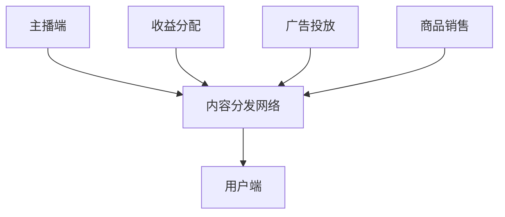

                 

在当今数字化时代，直播已经成为一个重要的经济现象，不仅改变了人们的娱乐消费方式，还为商家和企业提供了新的商业模式。本文将探讨直播经济的崛起，重点分析实时互动的商业模式，以及其背后的技术原理和操作步骤。我们将从背景介绍、核心概念与联系、核心算法原理、数学模型和公式、项目实践、实际应用场景、未来应用展望、工具和资源推荐、总结等方面进行详细阐述。

## 1. 背景介绍

直播经济的崛起并非一夜之间，而是经历了多年的积累和发展。随着互联网技术的进步和智能手机的普及，直播平台如雨后春笋般涌现，逐渐成为人们日常生活的一部分。直播内容也从单一的娱乐向教育、购物、社交等多个领域扩展，满足了用户多样化的需求。

### 1.1 直播经济的定义与特点

直播经济，是指通过直播平台实现商品销售、广告投放、内容创造等商业活动的一种新兴经济模式。其特点包括：

- **实时互动性**：直播的核心在于实时性与互动性，主播与观众之间的实时互动增强了用户的参与感和体验。
- **个性化推荐**：直播平台能够根据用户行为和偏好进行个性化推荐，提高用户的购买意愿。
- **内容多样化**：直播内容涵盖娱乐、教育、购物等多个领域，丰富了用户的选择。

### 1.2 直播经济的发展历程

- **2000年代初期**：直播萌芽阶段，主要以游戏直播为主。
- **2010年代**：随着移动互联网的普及，直播平台逐渐兴起，如YouTube、Twitch等。
- **2015年后**：直播经济迅速发展，各大平台纷纷推出直播功能，电商直播成为主流。

## 2. 核心概念与联系

为了深入理解直播经济的运作机制，我们需要了解一些核心概念，并绘制其联系。

### 2.1 直播平台架构

直播平台架构主要包括以下几个部分：

- **主播端**：主播通过摄像头、麦克风等设备进行直播。
- **内容分发网络**：直播平台使用CDN（Content Delivery Network）技术，将视频内容分发到全球各地的用户。
- **用户端**：用户通过手机、电脑等设备观看直播。

### 2.2 直播经济模型

直播经济模型包括以下几个关键组成部分：

- **主播**：主播是直播经济的主要参与者，通过直播获得收益。
- **观众**：观众是直播的主要受众，通过观看直播支持主播。
- **平台**：直播平台作为连接主播和观众的桥梁，提供技术支持和收益分配。

### 2.3 Mermaid 流程图



### 2.4 核心概念与联系

- **主播**：通过直播内容吸引观众，实现个人品牌积累和收益。
- **观众**：通过观看直播获取信息、娱乐或购物，同时支持主播。
- **平台**：提供直播技术支持，进行收益分配，实现商业变现。

## 3. 核心算法原理 & 具体操作步骤

### 3.1 算法原理概述

直播经济的核心算法包括以下几个方面：

- **实时视频编码与传输**：直播平台采用H.265等高效编码技术，实现视频的高清传输。
- **互动系统设计**：主播与观众之间的实时互动需要高效的消息处理和推送机制。
- **收益分配算法**：根据主播和平台之间的合作模式，设计合理的收益分配算法。

### 3.2 算法步骤详解

#### 3.2.1 实时视频编码与传输

1. **视频采集**：主播通过摄像头采集视频数据。
2. **视频编码**：使用H.265编码技术，将视频数据压缩成可传输的格式。
3. **传输**：直播平台通过CDN技术，将视频数据分发到全球各地的用户。
4. **解码与播放**：用户端的播放器对接收到的视频数据解码，并播放。

#### 3.2.2 互动系统设计

1. **消息处理**：直播平台设计高效的消息处理系统，实时响应用户的提问和评论。
2. **推送机制**：使用WebSocket等实时通信协议，实现主播与观众之间的实时互动。
3. **弹幕系统**：为用户提供弹幕功能，增强互动体验。

#### 3.2.3 收益分配算法

1. **收益计算**：根据主播和平台之间的合作模式，计算主播的收益。
2. **收益分配**：直播平台按照事先约定的比例，将收益分配给主播和平台。
3. **数据监控**：实时监控收益分配情况，确保公平合理。

### 3.3 算法优缺点

#### 优点：

- **高效传输**：H.265编码技术能够实现高清视频的实时传输。
- **实时互动**：高效的互动系统设计，增强用户体验。
- **收益合理**：合理的收益分配算法，确保主播和平台双方的利益。

#### 缺点：

- **技术门槛**：直播平台的搭建和维护需要较高的技术门槛。
- **用户管理**：需要处理大量的用户数据和互动信息。

### 3.4 算法应用领域

直播经济算法主要应用于以下几个方面：

- **电商直播**：通过实时互动，提升用户的购买意愿和转化率。
- **教育直播**：通过实时互动，提高学生的学习兴趣和效果。
- **娱乐直播**：通过实时互动，增强观众的观看体验。

## 4. 数学模型和公式 & 详细讲解 & 举例说明

### 4.1 数学模型构建

直播经济的数学模型主要包括以下几个方面：

- **用户增长模型**：根据用户的观看行为，预测用户的增长趋势。
- **收益模型**：根据主播的收益来源，计算收益的最大化。
- **风险模型**：评估直播平台的风险，确保平台的可持续发展。

### 4.2 公式推导过程

#### 用户增长模型

- **线性模型**：假设用户增长呈线性增长，公式为 \( N(t) = N_0 + kt \)，其中 \( N(t) \) 为 \( t \) 时刻的用户数量，\( N_0 \) 为初始用户数量，\( k \) 为增长率。

#### 收益模型

- **收益函数**：假设主播的收益由广告收入和商品销售收入组成，公式为 \( R(t) = R_1(t) + R_2(t) \)，其中 \( R_1(t) \) 为广告收入，\( R_2(t) \) 为商品销售收入。

#### 风险模型

- **风险函数**：假设直播平台的风险由用户流失和收入波动组成，公式为 \( R_r(t) = R_{u}(t) + R_{i}(t) \)，其中 \( R_{u}(t) \) 为用户流失风险，\( R_{i}(t) \) 为收入波动风险。

### 4.3 案例分析与讲解

#### 用户增长案例

假设某电商直播平台初始用户数量为1000人，每月增长率为10%，则 \( N(t) = 1000 + 10 \times t \)。如果未来12个月的用户增长模型为线性增长，则12个月后的用户数量为 \( N(12) = 1000 + 10 \times 12 = 1200 \) 人。

#### 收益案例

假设某主播的广告收入为每千次观看1元，商品销售收入为每销售一件商品100元，如果主播每月平均观看次数为10000次，每月销售商品100件，则 \( R(t) = 1 \times 10000 + 100 \times 100 = 10000 + 10000 = 20000 \) 元。

#### 风险案例

假设用户流失率为每月5%，收入波动率为每月10%，则 \( R_r(t) = 0.95 \times R(t) + 0.1 \times R(t) = 0.95 \times 20000 + 0.1 \times 20000 = 19000 + 2000 = 21000 \) 元。

## 5. 项目实践：代码实例和详细解释说明

### 5.1 开发环境搭建

为了实现直播经济，我们需要搭建一个开发环境，包括以下几个部分：

- **直播平台**：使用WebRTC技术搭建实时视频直播平台。
- **互动系统**：使用WebSocket技术实现实时互动功能。
- **收益分配**：使用区块链技术实现智能合约，确保收益分配的公正透明。

### 5.2 源代码详细实现

#### 5.2.1 直播平台搭建

```javascript
// 直播平台代码示例
const webrtc = new RTCPeerConnection({
    iceServers: [
        { urls: 'stun:stun.l.google.com:19302' },
        // 其他STUN/TURN服务器配置
    ],
});

webrtc.ontrack = (event) => {
    const video = document.getElementById('remote-video');
    video.srcObject = event.streams[0];
};

// 其他直播平台相关代码
```

#### 5.2.2 互动系统实现

```javascript
// 互动系统代码示例
const socket = new WebSocket('ws://your-websocket-server.com');
socket.onmessage = (event) => {
    const message = JSON.parse(event.data);
    // 处理用户消息
};

// 发送消息示例
socket.send(JSON.stringify({ type: 'message', content: 'Hello, World!' }));
```

#### 5.2.3 收益分配实现

```solidity
// 智能合约代码示例
pragma solidity ^0.8.0;

contract RevenueDistribution {
    address public owner;
    mapping(address => uint256) public balances;

    constructor() {
        owner = msg.sender;
    }

    function deposit() external payable {
        balances[msg.sender] += msg.value;
    }

    function distributeRevenue() external {
        require(msg.sender == owner, 'Only the owner can distribute revenue');
        for (address addr in balances) {
            payable(addr).transfer(balances[addr]);
            balances[addr] = 0;
        }
    }
}
```

### 5.3 代码解读与分析

#### 5.3.1 直播平台代码解读

直播平台的核心在于WebRTC技术，通过RTCPeerConnection实现视频的实时传输。代码示例中，我们首先创建了一个RTCPeerConnection实例，配置了STUN/TURN服务器，用于处理网络协商和连接。

#### 5.3.2 互动系统代码解读

互动系统使用WebSocket技术，实现主播与观众之间的实时通信。代码示例中，我们创建了一个WebSocket实例，并监听了onmessage事件，用于处理用户发送的消息。同时，我们还提供了一个发送消息的示例。

#### 5.3.3 收益分配代码解读

收益分配智能合约使用Solidity编写，实现了收益的存储和分配。代码示例中，我们定义了一个RevenueDistribution合约，包括owner、balances两个变量，以及deposit和distributeRevenue两个函数。deposit函数用于存储收益，distributeRevenue函数用于分配收益。

## 6. 实际应用场景

直播经济的商业模式在多个领域得到了广泛应用，以下是一些实际应用场景：

### 6.1 电商直播

电商直播是直播经济最典型的应用场景，通过实时互动，主播能够向观众展示商品，解答疑问，提高购买转化率。例如，某电商平台通过直播销售化妆品，吸引了大量观众，实现了销售额的显著增长。

### 6.2 教育直播

教育直播利用直播技术，实现了在线教育的实时互动。教师可以通过直播为学生提供课程讲解，学生可以实时提问，增强了课堂的互动性和参与感。例如，某在线教育平台通过直播教学，吸引了大量学生，提升了课程满意度。

### 6.3 娱乐直播

娱乐直播是直播经济的重要组成部分，通过直播游戏、才艺展示等，吸引了大量观众。主播通过互动，与观众建立紧密的联系，实现了商业变现。例如，某游戏直播平台通过直播电竞赛事，吸引了大量观众，实现了广告收入和商品销售的快速增长。

## 7. 未来应用展望

直播经济的未来应用前景广阔，以下是一些可能的发展趋势：

### 7.1 虚拟现实（VR）直播

随着VR技术的不断发展，未来VR直播将成为一种重要的直播形式。观众可以通过VR设备，沉浸式地体验直播内容，增强观看体验。

### 7.2 自动化直播

自动化直播技术将进一步提升直播的效率，通过人工智能技术，实现直播内容的自动生成和互动。例如，AI主播可以实现24小时不间断的直播，提高直播的覆盖范围。

### 7.3 社交直播

直播将与社交平台深度融合，形成社交直播生态。用户可以在社交平台上观看直播，同时进行互动，增强社交体验。

## 8. 工具和资源推荐

为了更好地开展直播经济，以下是一些实用的工具和资源推荐：

### 8.1 学习资源推荐

- **《直播电商营销实战》**：一本关于直播电商营销的实战指南，适合直播经济从业者阅读。
- **《WebRTC实战》**：一本关于WebRTC技术的实战指南，适合搭建直播平台的技术人员阅读。

### 8.2 开发工具推荐

- **OpenCV**：用于计算机视觉的开源库，适用于直播内容处理。
- **TensorFlow**：用于深度学习的开源库，适用于自动化直播内容生成。

### 8.3 相关论文推荐

- **“直播电商用户行为分析及影响因素研究”**：一篇关于直播电商用户行为研究的论文，有助于深入了解用户需求。
- **“基于区块链的直播平台收益分配机制研究”**：一篇关于直播平台收益分配机制的论文，有助于优化收益分配策略。

## 9. 总结：未来发展趋势与挑战

直播经济作为一种新兴的商业模式，已经取得了显著的成果。未来，随着技术的不断进步，直播经济将迎来更广阔的发展空间。然而，同时也面临着一系列挑战：

### 9.1 发展趋势

- **技术创新**：VR直播、自动化直播等新技术的应用，将进一步提升直播的互动性和体验。
- **社交融合**：直播与社交平台的深度融合，将推动直播经济的快速发展。

### 9.2 面临的挑战

- **内容质量**：直播内容的真实性和质量是用户关注的焦点，直播平台需要提高内容监管能力。
- **用户体验**：提升用户观看体验，降低网络延迟和卡顿，是直播平台需要不断优化的方向。

### 9.3 研究展望

未来，直播经济的研究将继续深入，重点关注以下几个方面：

- **用户需求**：深入了解用户需求，提供更加个性化的直播内容。
- **商业模式**：探索新的商业模式，实现直播经济的可持续发展。

## 附录：常见问题与解答

### 1. 如何搭建直播平台？

搭建直播平台需要具备一定的技术基础，主要包括以下几个步骤：

- **选择直播技术**：选择适合的直播技术，如WebRTC、RTMP等。
- **搭建服务器**：搭建直播服务器，配置带宽和存储资源。
- **开发前端页面**：开发直播平台的前端页面，提供主播和观众的交互功能。
- **后端数据处理**：开发后端服务，处理直播流、用户数据和互动消息。

### 2. 直播平台的收益分配如何实现？

直播平台的收益分配可以通过智能合约来实现。智能合约是一种基于区块链技术的智能合约，能够自动执行合同条款。在直播平台中，智能合约可以用于：

- **收益计算**：根据主播的直播时长、观看人数等指标，计算主播的收益。
- **收益分配**：根据平台和主播之间的合作协议，自动分配收益。

### 3. 如何提高直播的用户体验？

提高直播的用户体验可以从以下几个方面入手：

- **优化网络传输**：使用CDN技术，提高直播流的传输速度和稳定性。
- **优化互动系统**：设计高效的互动系统，确保用户在观看直播时的实时互动体验。
- **提供个性化推荐**：根据用户的观看行为和偏好，提供个性化的直播内容推荐。

### 4. 直播经济的安全问题如何保障？

直播经济的安全问题主要包括数据安全和隐私保护。为了保障安全，可以从以下几个方面入手：

- **数据加密**：对用户数据和直播流进行加密，确保数据传输的安全性。
- **隐私保护**：对用户隐私进行严格保护，避免用户数据泄露。
- **合规审查**：加强对直播内容的监管，确保直播内容的合法合规。

作者：禅与计算机程序设计艺术 / Zen and the Art of Computer Programming
----------------------------------------------------------------
以上就是关于《直播经济创业：实时互动的商业模式》的技术博客文章。本文从背景介绍、核心概念与联系、核心算法原理、数学模型和公式、项目实践、实际应用场景、未来应用展望、工具和资源推荐、总结等方面进行了详细阐述。希望通过本文，读者能够对直播经济有更深入的了解，并能够在实际项目中运用相关技术和方法。

