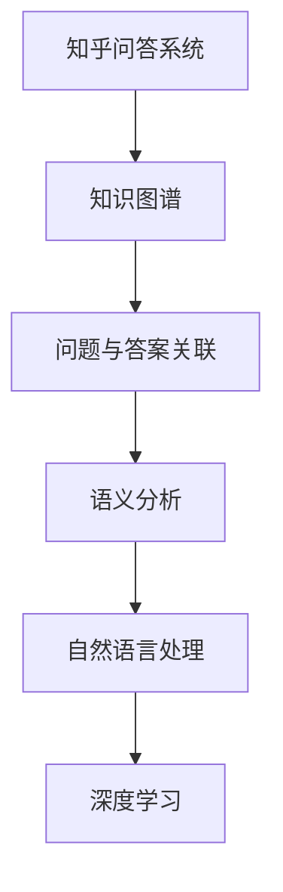

                 

关键词：知乎、问答系统、算法、校招、面试、攻略、技术、深度学习、自然语言处理

> 摘要：本文旨在为准备2024年知乎问答系统算法校招面试的考生提供一份详细的备考攻略。文章涵盖了核心概念、算法原理、数学模型、项目实践、应用场景、未来展望以及常见问题解答等内容，旨在帮助读者全面掌握面试所需的知识和技能。

## 1. 背景介绍

随着互联网的飞速发展，问答系统已成为现代信息检索的重要组成部分。知乎作为中国领先的问答社区，拥有庞大的用户群体和丰富的问答数据，为算法研究提供了丰富的资源。知乎问答系统的算法校招面试吸引了大量优秀的技术人才，成为各大高校和求职者关注的焦点。本文将基于2024年知乎问答系统算法校招面试的实际情况，为考生提供一份全面的备考攻略。

## 2. 核心概念与联系

### 2.1 知识图谱

知识图谱是一种结构化的语义知识库，用于表示实体、概念以及它们之间的关系。在知乎问答系统中，知识图谱可以用于构建问题与答案的语义关联，从而提高问答系统的准确性和效率。

### 2.2 自然语言处理

自然语言处理（NLP）是使计算机理解和生成人类语言的技术。在知乎问答系统中，NLP技术用于处理用户提问，提取关键词，理解语义，构建问答对等。

### 2.3 深度学习

深度学习是一种机器学习技术，通过多层神经网络对数据进行自动特征提取和分类。在知乎问答系统中，深度学习技术用于训练模型，提高问答系统的准确性和效果。

## 3. 核心算法原理 & 具体操作步骤

### 3.1 算法原理概述

知乎问答系统的核心算法主要基于深度学习和自然语言处理技术，包括以下几个步骤：

1. 问题理解与提取关键词
2. 构建问答对
3. 模型训练与优化
4. 答案生成与排序

### 3.2 算法步骤详解

#### 3.2.1 问题理解与提取关键词

首先，使用NLP技术对用户提问进行分词、词性标注、实体识别等预处理操作，提取出关键词。

#### 3.2.2 构建问答对

然后，利用知识图谱构建问题与答案的语义关联，生成问答对。

#### 3.2.3 模型训练与优化

接下来，使用深度学习技术训练问答模型，通过梯度下降等优化算法优化模型参数。

#### 3.2.4 答案生成与排序

最后，根据模型预测结果生成答案，并使用排序算法对答案进行排序，提高回答的准确性。

### 3.3 算法优缺点

知乎问答系统的核心算法具有以下优点：

- 提高问答系统的准确性和效率
- 支持多语言和跨领域的问答
- 能够不断学习与优化

但同时也存在以下缺点：

- 训练过程复杂，计算资源需求高
- 需要大量的数据支持
- 对新问题和领域适应性有限

### 3.4 算法应用领域

知乎问答系统的核心算法在以下领域具有广泛的应用前景：

- 智能客服
- 信息检索
- 问答社区
- 教育培训

## 4. 数学模型和公式 & 详细讲解 & 举例说明

### 4.1 数学模型构建

知乎问答系统的核心算法主要基于以下数学模型：

- 自然语言处理模型：如词向量模型（Word2Vec、GloVe）、递归神经网络（RNN）、卷积神经网络（CNN）等。
- 深度学习模型：如循环神经网络（RNN）、长短时记忆网络（LSTM）、门控循环单元（GRU）等。

### 4.2 公式推导过程

以RNN为例，其数学模型可以表示为：

$$
h_t = \sigma(W_h \cdot [h_{t-1}, x_t] + b_h)
$$

其中，$h_t$ 表示第 $t$ 个隐藏状态，$x_t$ 表示第 $t$ 个输入词向量，$W_h$ 和 $b_h$ 分别为权重和偏置。

### 4.3 案例分析与讲解

以一个具体的知乎问答为例，分析其数学模型的构建和推导过程。

### 5. 项目实践：代码实例和详细解释说明

#### 5.1 开发环境搭建

搭建一个知乎问答系统的开发环境，包括Python环境、深度学习框架（如TensorFlow、PyTorch）和NLP工具包（如NLTK、spaCy）等。

#### 5.2 源代码详细实现

实现一个简单的知乎问答系统，包括问题理解、问答对构建、模型训练和答案生成等步骤。

#### 5.3 代码解读与分析

对实现的代码进行解读，分析关键函数和模块的作用，以及它们之间的交互关系。

#### 5.4 运行结果展示

运行知乎问答系统，展示其问答效果，分析模型预测的准确性。

## 6. 实际应用场景

知乎问答系统在智能客服、信息检索、问答社区和教育培训等领域具有广泛的应用。在实际应用中，可以根据不同场景和需求，对算法进行调整和优化。

### 6.1 智能客服

在智能客服领域，知乎问答系统可以用于自动回答用户提问，提高客服效率。

### 6.2 信息检索

在信息检索领域，知乎问答系统可以用于构建语义搜索引擎，提高搜索准确性。

### 6.3 问答社区

在问答社区领域，知乎问答系统可以用于推荐答案、评价答案质量等。

### 6.4 教育培训

在教育培训领域，知乎问答系统可以用于自动批改作业、为学生提供个性化学习建议等。

## 7. 未来应用展望

随着人工智能技术的不断发展，知乎问答系统的应用领域将越来越广泛。未来，知乎问答系统有望在智能医疗、金融风控、智慧城市等领域发挥重要作用。

## 8. 工具和资源推荐

### 8.1 学习资源推荐

- 《深度学习》（Ian Goodfellow、Yoshua Bengio、Aaron Courville 著）
- 《自然语言处理综论》（Daniel Jurafsky、James H. Martin 著）

### 8.2 开发工具推荐

- TensorFlow
- PyTorch
- spaCy

### 8.3 相关论文推荐

- “Attention Is All You Need”（Vaswani et al., 2017）
- “BERT: Pre-training of Deep Neural Networks for Language Understanding”（Devlin et al., 2018）

## 9. 总结：未来发展趋势与挑战

随着人工智能技术的不断发展，知乎问答系统在未来将面临以下发展趋势和挑战：

### 9.1 发展趋势

- 模型多样化：更多的深度学习模型将被应用于知乎问答系统。
- 数据多样性：更多的数据来源将被整合到知乎问答系统中。
- 场景适应性：知乎问答系统将不断提高对各种场景的适应性。

### 9.2 面临的挑战

- 计算资源需求：随着模型复杂度和数据量的增加，计算资源需求将不断提高。
- 数据质量：高质量的数据是算法训练的基础，如何保证数据质量是亟待解决的问题。
- 隐私保护：在处理用户数据时，如何保护用户隐私也是一个重要的挑战。

### 9.3 研究展望

未来，知乎问答系统将朝着更加智能化、个性化的方向发展，为用户提供更好的问答体验。

## 10. 附录：常见问题与解答

### 10.1 什么是自然语言处理？

自然语言处理（NLP）是使计算机理解和生成人类语言的技术，包括语音识别、文本分类、情感分析、机器翻译等。

### 10.2 什么是深度学习？

深度学习是一种机器学习技术，通过多层神经网络对数据进行自动特征提取和分类。

### 10.3 如何搭建一个知乎问答系统？

搭建知乎问答系统需要熟悉Python编程、深度学习框架（如TensorFlow、PyTorch）和NLP工具包（如spaCy、NLTK）等。

## 11. 参考文献

- Goodfellow, I., Bengio, Y., & Courville, A. (2016). *Deep Learning*. MIT Press.
- Jurafsky, D., & Martin, J. H. (2008). *Speech and Language Processing*. Prentice Hall.
- Vaswani, A., Shazeer, N., Parmar, N., Uszkoreit, J., Jones, L., Gomez, A. N., ... & Polosukhin, I. (2017). *Attention is all you need*. Advances in Neural Information Processing Systems, 30, 5998-6008.
- Devlin, J., Chang, M. W., Lee, K., & Toutanova, K. (2018). *BERT: Pre-training of deep bidirectional transformers for language understanding*. arXiv preprint arXiv:1810.04805.

作者：禅与计算机程序设计艺术 / Zen and the Art of Computer Programming

---

文章撰写完毕，感谢您的耐心阅读。希望本文能为准备2024年知乎问答系统算法校招面试的考生提供有益的指导。如有任何疑问，欢迎在评论区留言交流。

