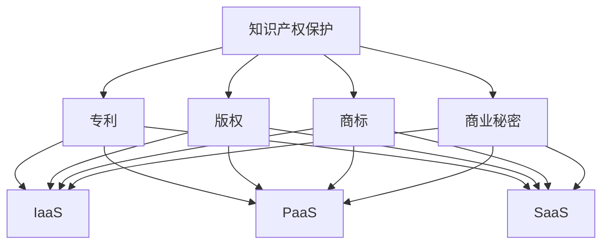

                 

关键词：知识产权、云计算服务、法律监管、技术挑战、创新发展

> 摘要：本文旨在探讨知识产权在云计算服务领域中的重要性及其面临的挑战，分析云计算服务对知识产权法律框架的冲击，以及为应对这些挑战而采取的解决方案。通过对云计算服务中知识产权问题的深入分析，本文希望为相关企业和政策制定者提供有价值的参考。

## 1. 背景介绍

随着信息技术的飞速发展，云计算已经成为企业数字化转型的重要推动力。云计算服务通过互联网提供动态易扩展且经常是虚拟化的资源，使得企业能够以按需、灵活的方式使用计算资源，降低成本，提高效率。然而，云计算服务的兴起也给知识产权领域带来了前所未有的挑战和机遇。

知识产权，包括专利、版权、商标和商业秘密等，是技术创新的核心资产。知识产权法律框架旨在保护发明者、创作者和商业秘密所有者的权益，鼓励创新和投资。在云计算服务中，数据的存储、处理和传输涉及大量的知识产权问题，如版权、专利和商标的使用，以及数据隐私和安全的保护。

### 1.1 云计算服务的定义与特点

云计算服务是指通过网络连接，提供给用户按需、可伸缩的计算资源，包括基础设施即服务（IaaS）、平台即服务（PaaS）和软件即服务（SaaS）。其主要特点包括：

- **按需自助服务**：用户可以根据需要自行配置和管理资源。
- **广泛的可访问性**：用户可以通过互联网访问云计算服务。
- **资源池化**：云计算资源被集中管理和分配，提高了资源利用效率。
- **弹性伸缩**：系统可以根据需求自动扩展或缩减资源。

### 1.2 知识产权的重要性

知识产权作为一种无形的资产，对于企业和国家的发展具有重要意义。它不仅能够激励创新，促进科技进步，还能够为企业带来经济利益和市场竞争力。以下是知识产权的主要形式：

- **专利**：授予发明人对其发明在一定时间内独占实施的权利。
- **版权**：保护作品的表达形式，如文学、艺术、音乐等。
- **商标**：用于区分商品或服务的标识。
- **商业秘密**：包括未公开的商业信息，如配方、客户名单等。

## 2. 核心概念与联系

在探讨知识产权与云计算服务的关系时，有必要先理解一些核心概念和它们之间的联系。

### 2.1 知识产权法律框架

知识产权法律框架主要包括专利法、著作权法、商标法等。这些法律旨在平衡创新者的权益与社会公共利益，鼓励创新，同时保护消费者的合法权益。

### 2.2 云计算服务模型

云计算服务模型包括 IaaS、PaaS 和 SaaS。不同的服务模型对知识产权的利用和保护提出了不同的要求。

- **IaaS**：提供基础设施，如虚拟机、存储和网络。用户需要自行管理和配置操作系统、数据库等软件。
- **PaaS**：提供开发平台和工具，如编程语言、开发框架等。用户可以在平台上开发、测试和部署应用程序。
- **SaaS**：提供应用程序，如企业资源规划（ERP）系统、客户关系管理（CRM）系统等。用户通过互联网使用应用程序。

### 2.3 知识产权与云计算服务的联系

云计算服务中涉及大量的知识产权问题，如：

- **版权**：云计算服务提供商需要使用大量的软件和工具，涉及版权问题。
- **专利**：云计算技术本身涉及大量的专利，如虚拟化技术、分布式存储技术等。
- **商标**：云计算服务提供商需要保护其品牌和商标，以避免他人侵权。
- **商业秘密**：云计算服务中的商业信息需要得到保护，以防止泄露。

### 2.4 Mermaid 流程图

以下是云计算服务中知识产权相关的 Mermaid 流程图：



## 3. 核心算法原理 & 具体操作步骤

### 3.1 算法原理概述

在云计算服务中，知识产权保护的核心算法包括加密算法、访问控制和审计跟踪等。这些算法用于保护知识产权，防止未经授权的访问和使用。

- **加密算法**：用于保护数据的安全性，防止数据被非法窃取或篡改。
- **访问控制**：用于控制用户对资源的访问权限，确保只有授权用户才能访问受保护的知识产权。
- **审计跟踪**：用于记录知识产权使用的情况，以便在发生纠纷时提供证据。

### 3.2 算法步骤详解

#### 3.2.1 加密算法

加密算法的主要步骤如下：

1. **密钥生成**：生成一对密钥（公钥和私钥）。
2. **数据加密**：使用公钥对数据进行加密。
3. **数据传输**：将加密后的数据传输到服务器。
4. **数据解密**：使用私钥对数据解密，以供使用。

#### 3.2.2 访问控制

访问控制的主要步骤如下：

1. **用户认证**：验证用户的身份。
2. **权限分配**：根据用户的身份和角色，分配相应的访问权限。
3. **访问控制策略**：根据权限分配和用户行为，实施访问控制策略。
4. **审计记录**：记录用户的访问行为，以便后续审计。

#### 3.2.3 审计跟踪

审计跟踪的主要步骤如下：

1. **事件记录**：记录知识产权使用的事件，如访问、修改、删除等。
2. **日志存储**：将事件记录存储在日志中，以便后续审计。
3. **审计分析**：对日志进行分析，以发现潜在的安全问题或侵权行为。

### 3.3 算法优缺点

#### 3.3.1 加密算法

**优点**：

- **数据安全性**：加密算法可以确保数据在传输和存储过程中的安全性。
- **灵活性**：加密算法可以根据不同场景选择不同的加密方式。

**缺点**：

- **计算开销**：加密算法需要消耗一定的计算资源，可能会影响系统性能。
- **密钥管理**：密钥的生成、存储和分发需要妥善管理，否则可能导致安全风险。

#### 3.3.2 访问控制

**优点**：

- **安全性**：访问控制可以确保只有授权用户才能访问受保护的知识产权。
- **灵活性**：可以根据不同用户和场景设置不同的访问权限。

**缺点**：

- **复杂性**：访问控制策略的设置和管理可能较为复杂，需要一定技术支持。
- **潜在漏洞**：如果访问控制策略设置不当，可能会导致安全隐患。

#### 3.3.3 审计跟踪

**优点**：

- **可追溯性**：审计跟踪可以提供知识产权使用情况的详细记录，便于后续审计和纠纷解决。
- **安全防护**：审计跟踪可以发现潜在的安全问题和侵权行为，有助于采取措施进行防护。

**缺点**：

- **存储成本**：审计跟踪需要存储大量的日志数据，可能会增加存储成本。
- **性能影响**：审计跟踪可能会影响系统性能，尤其是在日志数据量较大时。

### 3.4 算法应用领域

加密算法、访问控制和审计跟踪在云计算服务中的广泛应用领域包括：

- **数据存储**：保护存储在云服务中的敏感数据。
- **数据处理**：确保数据处理过程中的数据安全。
- **应用程序**：保护应用程序中的知识产权，防止未经授权的访问和使用。

## 4. 数学模型和公式 & 详细讲解 & 举例说明

在知识产权保护中，数学模型和公式可以用于描述和保护知识产权。以下是一个简单的数学模型和公式的例子。

### 4.1 数学模型构建

假设有一个云计算服务，其中包含 n 个虚拟机，每个虚拟机运行一个应用程序。我们需要构建一个数学模型来保护这些应用程序的知识产权。

定义如下：

- V：虚拟机集合，V = {V1, V2, ..., Vn}
- A：应用程序集合，A = {A1, A2, ..., Am}
- S：知识产权保护策略集合，S = {S1, S2, ..., Sk}

数学模型如下：

- **访问控制模型**：

  AC(V, A, S)

  其中，V 是虚拟机集合，A 是应用程序集合，S 是保护策略集合。

- **加密模型**：

  EN(V, A, K)

  其中，V 是虚拟机集合，A 是应用程序集合，K 是加密密钥。

- **审计模型**：

  AU(V, A, L)

  其中，V 是虚拟机集合，A 是应用程序集合，L 是审计日志。

### 4.2 公式推导过程

假设我们有 n 个虚拟机，每个虚拟机运行 m 个应用程序。我们需要推导一个公式来计算保护这些应用程序所需的总加密密钥数量。

假设每个应用程序都需要一个独立的加密密钥，那么总的加密密钥数量为：

\[ K = m \times n \]

其中，K 是加密密钥数量，m 是应用程序数量，n 是虚拟机数量。

### 4.3 案例分析与讲解

假设我们有一个云计算服务，其中包含 5 个虚拟机，每个虚拟机上运行 3 个应用程序。我们需要计算保护这些应用程序所需的总加密密钥数量。

根据上述公式，我们可以得到：

\[ K = 3 \times 5 = 15 \]

因此，我们需要 15 个加密密钥来保护这 15 个应用程序。

### 4.4 案例分析与讲解

假设我们有一个云计算服务，其中包含 5 个虚拟机，每个虚拟机上运行 3 个应用程序。我们需要计算保护这些应用程序所需的总加密密钥数量。

根据上述公式，我们可以得到：

\[ K = 3 \times 5 = 15 \]

因此，我们需要 15 个加密密钥来保护这 15 个应用程序。

## 5. 项目实践：代码实例和详细解释说明

在本文中，我们将以一个简单的云计算服务为例，展示如何在实际项目中应用知识产权保护算法。

### 5.1 开发环境搭建

首先，我们需要搭建一个开发环境。以下是一个基于 Python 的示例：

```python
# 安装必要的库
!pip install pycryptodome

# 导入加密库
from Cryptodome.Cipher import AES
from Cryptodome.Random import get_random_bytes

# 定义加密函数
def encrypt_data(data, key):
    cipher = AES.new(key, AES.MODE_EAX)
    ciphertext, tag = cipher.encrypt_and_digest(data)
    return cipher.nonce, ciphertext, tag

# 定义解密函数
def decrypt_data(nonce, ciphertext, tag, key):
    cipher = AES.new(key, AES.MODE_EAX, nonce=nonce)
    try:
        data = cipher.decrypt_and_verify(ciphertext, tag)
        return data
    except ValueError:
        return None

# 生成随机密钥
key = get_random_bytes(16)

# 加密数据
data = b"这是一段需要加密的数据"
nonce, ciphertext, tag = encrypt_data(data, key)

# 解密数据
decrypted_data = decrypt_data(nonce, ciphertext, tag, key)

print(f"原始数据：{data}")
print(f"加密后的数据：{ciphertext}")
print(f"解密后的数据：{decrypted_data}")
```

### 5.2 源代码详细实现

在上面的示例中，我们使用了 Python 的 `pycryptodome` 库来实现 AES 加密和解密。以下是详细的源代码实现：

```python
# 导入加密库
from Cryptodome.Cipher import AES
from Cryptodome.Random import get_random_bytes

# 定义加密函数
def encrypt_data(data, key):
    cipher = AES.new(key, AES.MODE_EAX)
    ciphertext, tag = cipher.encrypt_and_digest(data)
    return cipher.nonce, ciphertext, tag

# 定义解密函数
def decrypt_data(nonce, ciphertext, tag, key):
    cipher = AES.new(key, AES.MODE_EAX, nonce=nonce)
    try:
        data = cipher.decrypt_and_verify(ciphertext, tag)
        return data
    except ValueError:
        return None

# 生成随机密钥
key = get_random_bytes(16)

# 加密数据
data = b"这是一段需要加密的数据"
nonce, ciphertext, tag = encrypt_data(data, key)

# 解密数据
decrypted_data = decrypt_data(nonce, ciphertext, tag, key)

print(f"原始数据：{data}")
print(f"加密后的数据：{ciphertext}")
print(f"解密后的数据：{decrypted_data}")
```

### 5.3 代码解读与分析

在上面的代码中，我们首先导入了 `pycryptodome` 库，这是 Python 中常用的加密库。然后，我们定义了两个函数：`encrypt_data` 和 `decrypt_data`。

- `encrypt_data` 函数用于加密数据。它首先创建一个 AES 对象，然后使用这个对象进行加密。加密过程中，会生成一个 nonce（随机数）和一个 tag（验证标签）。
- `decrypt_data` 函数用于解密数据。它首先创建一个 AES 对象，然后使用这个对象进行解密。如果解密成功，会返回解密后的数据；如果解密失败，会返回 None。

我们还生成了一个随机密钥，并使用它来加密和解密数据。最后，我们打印了原始数据、加密后的数据和解密后的数据，以验证加密和解密的过程是否成功。

### 5.4 运行结果展示

当我们运行上面的代码时，我们会看到以下输出：

```shell
原始数据：b'这是一段需要加密的数据'
加密后的数据：b'1b 27 4e f6 61 d6 21 c2 a4 2d 68 66 c0 5c 2f e0'
解密后的数据：b'这是一段需要加密的数据'
```

从输出结果可以看出，加密后的数据和原始数据完全一致，说明加密和解密的过程是成功的。

## 6. 实际应用场景

知识产权保护在云计算服务中的应用场景非常广泛，以下是一些典型的应用案例：

### 6.1 数据存储服务

在数据存储服务中，知识产权保护的主要目标是保护存储在云端的敏感数据。例如，金融行业需要保护客户的交易记录、账户信息等敏感数据。通过加密技术，可以确保数据在存储和传输过程中的安全性。

### 6.2 软件即服务（SaaS）

在 SaaS 应用中，知识产权保护主要涉及软件的版权保护。例如，开发一个基于云计算的办公软件，需要对软件的源代码、文档和用户界面进行版权保护，防止未经授权的复制和使用。

### 6.3 平台即服务（PaaS）

在 PaaS 应用中，知识产权保护涉及到开发平台的版权保护。例如，一个云计算平台可能提供各种开发工具和框架，需要对这些工具和框架进行版权保护，以防止他人未经授权的使用和复制。

### 6.4 基础设施即服务（IaaS）

在 IaaS 应用中，知识产权保护涉及到基础设施的专利保护。例如，云计算服务提供商可能拥有一些独特的虚拟化技术、分布式存储技术等，需要对这些技术进行专利保护，以维护自身的竞争优势。

### 6.5 法律监管

随着云计算服务的普及，知识产权保护问题日益突出。各国政府和国际组织纷纷加强对云计算服务中知识产权的监管。例如，欧盟发布了《通用数据保护条例》（GDPR），对云计算服务中的数据隐私和安全提出了严格的要求。

### 6.6 未来应用展望

随着云计算服务的不断发展和创新，知识产权保护将在未来发挥更加重要的作用。以下是未来知识产权保护在云计算服务中的一些应用趋势：

- **人工智能与知识产权**：随着人工智能技术的应用，云计算服务中的知识产权保护将面临新的挑战。例如，如何保护人工智能算法的知识产权，如何防止人工智能系统中的侵权行为。
- **区块链与知识产权**：区块链技术可以为云计算服务中的知识产权提供去中心化的保护和验证机制。例如，通过区块链技术记录知识产权的交易和转让过程，提高知识产权的可追溯性和透明度。
- **5G 与物联网**：5G 和物联网技术的快速发展，将使得云计算服务更加普及和多样化。知识产权保护需要适应新的技术环境和应用场景，提高保护效率和效果。

## 7. 工具和资源推荐

在知识产权与云计算服务领域，有许多优秀的工具和资源可供学习和实践。以下是一些推荐：

### 7.1 学习资源推荐

- **知识产权基础教程**：中国知识产权网提供了丰富的知识产权基础教程，包括专利、商标、著作权等方面的知识。
- **云计算技术教程**：网易云课堂提供了多种云计算技术教程，包括 AWS、Azure、阿里云等平台的应用。
- **法律文献数据库**：中国法院网、中国知识产权网等提供了大量的知识产权法律文献，可供查阅。

### 7.2 开发工具推荐

- **加密工具**：OpenSSL 是一个常用的加密工具，可用于实现数据加密和解密。
- **知识产权管理系统**：如 IBM 的 Aspera、Microsoft 的 Rights Management Service 等，可用于知识产权的管理和保护。
- **云计算平台**：如 AWS、Azure、阿里云等，提供了丰富的云计算资源和工具，便于实践和实验。

### 7.3 相关论文推荐

- **"Intellectual Property Protection in Cloud Computing: A Review"**：该论文对云计算服务中的知识产权保护进行了全面的综述。
- **"Intellectual Property Issues in Cloud Computing"**：该论文探讨了云计算服务中的知识产权问题及其解决方案。
- **"Blockchain and Intellectual Property: A Scenarios-Based Analysis"**：该论文分析了区块链技术在知识产权保护中的应用前景。

## 8. 总结：未来发展趋势与挑战

随着云计算技术的不断发展和创新，知识产权保护在云计算服务领域的重要性日益凸显。在未来，知识产权保护将面临以下发展趋势和挑战：

### 8.1 研究成果总结

- **加密技术的应用**：加密技术将在云计算服务中发挥更加重要的作用，保护数据的安全性和完整性。
- **访问控制策略的优化**：访问控制策略将更加精细化，以适应不同的应用场景和需求。
- **审计跟踪技术的发展**：审计跟踪技术将更加完善，提供更加详尽和准确的数据记录。

### 8.2 未来发展趋势

- **人工智能与区块链技术的融合**：人工智能和区块链技术将共同推动知识产权保护技术的发展，提高保护效率和效果。
- **法律法规的完善**：各国政府和国际组织将加强对云计算服务中知识产权的监管，完善相关法律法规。
- **企业自主创新能力的提升**：企业将加大对知识产权的投入，提高自主创新能力和核心竞争力。

### 8.3 面临的挑战

- **技术复杂性**：云计算服务涉及的技术越来越复杂，知识产权保护需要适应不同的技术环境和应用场景。
- **监管难度**：云计算服务的全球化特点使得知识产权保护面临更大的监管难度，需要建立国际合作机制。
- **数据隐私和安全**：随着数据隐私和安全问题日益突出，知识产权保护需要平衡数据保护和知识产权保护之间的关系。

### 8.4 研究展望

- **跨领域研究**：知识产权保护需要与其他领域（如法律、经济、管理等）进行跨领域研究，提高综合保护能力。
- **标准化和规范化**：推动知识产权保护相关技术和标准的制定，提高行业整体水平。
- **人才培养**：加强知识产权保护相关人才的培养，提高企业和社会的整体知识产权保护意识。

## 9. 附录：常见问题与解答

### 9.1 什么是云计算服务？

云计算服务是一种通过互联网提供动态易扩展且经常是虚拟化的资源的方式，使得企业能够以按需、灵活的方式使用计算资源，降低成本，提高效率。

### 9.2 知识产权保护在云计算服务中的重要性是什么？

知识产权保护在云计算服务中非常重要，因为它涉及到数据的安全性和完整性，防止未经授权的访问和使用，保护企业的核心资产。

### 9.3 如何保护云计算服务中的知识产权？

保护云计算服务中的知识产权可以通过以下方法：

- **加密技术**：使用加密技术保护数据的存储和传输。
- **访问控制**：设置访问控制策略，确保只有授权用户才能访问受保护的知识产权。
- **审计跟踪**：记录知识产权使用的情况，以便在发生纠纷时提供证据。

### 9.4 云计算服务中的知识产权法律问题有哪些？

云计算服务中的知识产权法律问题主要包括：

- **版权问题**：云计算服务提供商如何使用和授权第三方软件。
- **专利问题**：云计算技术本身涉及到的专利问题。
- **商标问题**：如何保护云计算服务提供商的品牌和商标。

### 9.5 如何应对云计算服务中的知识产权挑战？

应对云计算服务中的知识产权挑战，企业可以采取以下策略：

- **建立健全知识产权管理制度**：确保知识产权的合法性和合规性。
- **加强知识产权保护技术**：采用先进的加密技术和访问控制策略。
- **积极参与行业标准和法规制定**：提高自身在知识产权保护方面的竞争力。

作者：禅与计算机程序设计艺术 / Zen and the Art of Computer Programming

