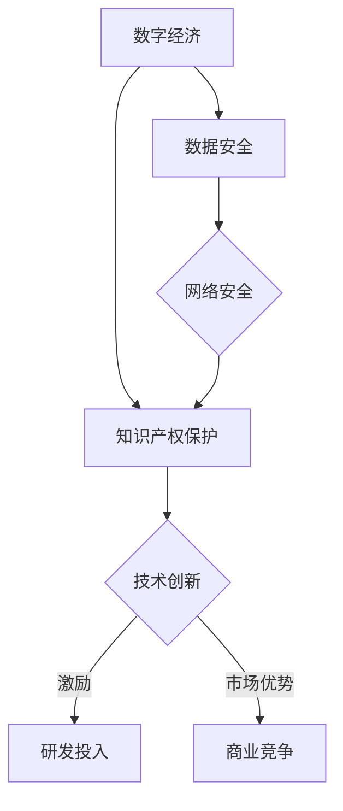

                 

  
## 1. 背景介绍

在当今世界，数字经济的快速发展已经深刻改变了我们的生活方式、商业模式以及整个社会结构。从互联网的普及到大数据、云计算、人工智能等新兴技术的崛起，数字经济已经成为推动全球经济持续增长的重要引擎。与此同时，知识产权（Intellectual Property，简称IP）作为激励创新和促进知识共享的重要制度安排，也在数字经济中扮演着至关重要的角色。

知识产权的保护不仅仅涉及到专利、商标和版权等法律层面的内容，它还与数字技术的应用、信息共享、数据安全等多个方面紧密相关。在数字经济中，知识产权不仅是企业竞争的利器，也是国家创新能力的体现。如何有效地利用和保护知识产权，已经成为企业和国家战略规划中的重要议题。

本文旨在探讨知识产权与数字经济的深度融合，通过分析两者之间的相互关系、核心概念及其应用，揭示知识产权在数字经济中的重要作用和面临的挑战。文章将从以下几个方面展开：

1. **核心概念与联系**：介绍知识产权的基本概念及其在数字经济中的地位和作用。
2. **核心算法原理**：讨论知识产权保护的相关算法及其具体实现。
3. **数学模型和公式**：解析知识产权管理中使用的数学模型及其公式。
4. **项目实践**：提供具体的知识产权保护项目实例，并进行详细解读。
5. **实际应用场景**：探讨知识产权在数字经济中的具体应用领域。
6. **未来应用展望**：预测知识产权在数字经济中的未来发展趋势。
7. **工具和资源推荐**：介绍学习资源和开发工具。
8. **总结**：总结研究成果，提出未来研究的方向和挑战。

通过这篇文章，我们希望读者能够对知识产权与数字经济的融合有更加深入的理解，认识到知识产权保护在促进数字经济健康发展中的关键作用。

## 2. 核心概念与联系

### 2.1 知识产权的定义

知识产权是指基于人类智力劳动成果所产生的权利，包括但不限于专利、商标、版权、商业秘密等。根据《世界知识产权组织》（WIPO）的定义，知识产权是一种无形资产，是对知识、信息、技术和创造性工作的保护。

- **专利**：专利是一种赋予发明者在一定时间内独占其发明的权利的知识产权形式。它保护发明的技术方案，可以涉及产品、方法或改进。
- **商标**：商标是企业用于区分其商品或服务来源的标识，如文字、图形、字母、数字等。它保护品牌的独特性和商业信誉。
- **版权**：版权保护文学、艺术和科学作品，如书籍、音乐、电影、软件等，赋予创作者对作品的使用、复制、发行等权利。
- **商业秘密**：商业秘密是指企业拥有的不为公众所知悉、具有商业价值的信息，如经营计划、客户名单、研发成果等。

### 2.2 数字经济的定义

数字经济是指以数字化的信息和知识为关键生产要素、以现代信息网络为重要载体、以信息通信技术的有效利用为驱动的新型经济形态。它包括互联网经济、移动互联网经济、物联网经济等，涵盖了电子商务、在线服务、社交媒体、数字内容等各个领域。

### 2.3 知识产权与数字经济的相互关系

知识产权与数字经济之间的关系是相互依存的。一方面，数字经济的发展为知识产权的创造和保护提供了新的机遇和挑战。数字技术的普及使得知识产品的传播更加便捷，但也带来了版权侵权、知识产权纠纷等问题。另一方面，知识产权的保护是推动数字经济创新的重要保障。

- **创新驱动**：知识产权制度通过提供法律保护和经济激励，鼓励企业和个人进行研发和创新，从而推动技术进步和经济增长。
- **信息共享**：知识产权制度在保护创新成果的同时，也促进了知识共享。通过专利信息公开、版权授权等机制，知识可以更加广泛地传播和应用。
- **商业竞争**：在数字经济中，知识产权成为企业竞争的重要手段。拥有强大知识产权储备的企业能够在市场中占据有利地位，获得更多的商业机会。

### 2.4 Mermaid 流程图

为了更好地展示知识产权与数字经济的相互关系，我们可以使用Mermaid流程图来描述其核心概念和流程。以下是简化的Mermaid流程图示例：



在上面的流程图中，A代表数字经济，B代表知识产权保护，C表示技术创新，D表示研发投入，E表示商业竞争，F表示数据安全，G表示网络安全。图中的箭头表示各要素之间的因果关系和相互作用。

通过这个流程图，我们可以看到知识产权保护在数字经济中的关键作用。它不仅激励技术创新和研发投入，还提供商业竞争中的市场优势，同时保障数据安全和网络安全。这些因素共同推动了数字经济的健康发展。

综上所述，知识产权与数字经济的融合不仅是技术层面的结合，更是经济、法律、文化等多方面的深度互动。在接下来的章节中，我们将进一步探讨知识产权保护的具体算法、数学模型及其应用，以及在实际项目中的实践。

### 3. 核心算法原理 & 具体操作步骤

#### 3.1 算法原理概述

在知识产权保护中，算法扮演着至关重要的角色。这些算法被设计用于检测和防止知识产权侵权行为，保障原创者的合法权益。核心算法可以分为以下几类：

1. **版权检测算法**：用于识别和验证数字内容是否侵犯版权。
2. **商标匹配算法**：用于比较商标信息，以识别潜在的侵权行为。
3. **专利分析算法**：用于评估专利的创造性和实用性，辅助专利申请和维权。
4. **加密和签名算法**：用于保障数字内容的完整性和不可否认性，防止未经授权的访问和篡改。

#### 3.2 算法步骤详解

以下我们以版权检测算法为例，详细说明其基本原理和操作步骤。

**3.2.1 数据采集与预处理**

- **数据采集**：首先需要从互联网、数据库等渠道收集大量的数字内容，如文本、图片、音频和视频等。
- **数据预处理**：对采集到的数据进行清洗和标准化处理，包括去除噪声、格式转换、特征提取等。

**3.2.2 特征提取**

- **特征选择**：选择对版权检测最有影响力的特征，如文本的词汇频率、图像的颜色分布、音频的频率谱等。
- **特征转换**：将原始特征转换为适合算法处理的格式，如向量表示。

**3.2.3 模型训练**

- **选择模型**：选择合适的机器学习模型，如支持向量机（SVM）、神经网络（Neural Network）或深度学习模型（Deep Learning）。
- **训练数据准备**：准备足够多的训练数据，并对其进行标注，以区分合法内容和侵权内容。
- **模型训练**：使用训练数据对模型进行训练，调整模型的参数以优化性能。

**3.2.4 模型评估与优化**

- **模型评估**：使用测试数据评估模型的准确性和鲁棒性，如通过混淆矩阵、准确率、召回率等指标。
- **模型优化**：根据评估结果，对模型进行调整和优化，以提高其性能。

**3.2.5 算法部署与应用**

- **算法部署**：将训练好的模型部署到生产环境中，如构建一个版权检测系统。
- **应用场景**：在电子商务平台、在线媒体、音乐和视频流媒体等场景中，对上传的数字内容进行实时检测，以防止侵权行为。

#### 3.3 算法优缺点

**优点**：

- **高效性**：通过机器学习和深度学习算法，可以快速处理大量数据，提高检测速度。
- **准确性**：基于大数据和人工智能技术，能够提高侵权检测的准确性。
- **自动化**：算法可以自动化执行检测任务，减轻人工负担。

**缺点**：

- **计算成本高**：训练和部署高性能的机器学习模型需要大量的计算资源和时间。
- **数据隐私**：在数据采集和预处理过程中，可能涉及用户隐私问题。
- **法律挑战**：不同国家和地区的知识产权法律存在差异，算法可能需要针对特定地区进行定制化。

#### 3.4 算法应用领域

知识产权保护算法在多个领域都有广泛应用：

- **版权保护**：在数字内容创作和分发领域，用于检测和防止版权侵权。
- **商标管理**：帮助企业监控和防止商标侵权行为。
- **专利分析**：用于评估和监控竞争对手的专利情况，制定相应的专利战略。
- **数据安全**：在企业和政府机构中，用于保护敏感数据和隐私信息。

通过算法的应用，知识产权保护不仅能够提高效率，还能够为数字经济的发展提供强有力的支撑。接下来，我们将进一步探讨知识产权管理中的数学模型和公式，以揭示其在知识产权保护中的重要作用。

### 4. 数学模型和公式 & 详细讲解 & 举例说明

#### 4.1 数学模型构建

在知识产权管理中，数学模型的应用广泛且复杂。以下介绍几个常见的数学模型和它们的应用场景。

**4.1.1 版权侵权检测模型**

版权侵权检测模型主要用于识别和检测数字内容的侵权行为。常见的模型包括：

- **相似度模型**：使用相似度度量来比较两个数字内容，如文本相似度（Cosine相似度、Jaccard相似度）和图像相似度（SSIM、特征匹配）。

**4.1.2 专利风险评估模型**

专利风险评估模型用于评估专利的商业价值和技术风险。常见的模型包括：

- **马尔可夫模型**：用于分析专利未来可能的技术趋势和市场表现。
- **贝叶斯网络**：用于评估专利侵权风险和竞争对手的技术威胁。

**4.1.3 商标匹配模型**

商标匹配模型用于识别和匹配商标信息，以防止商标侵权。常见的模型包括：

- **模糊匹配算法**：如Levenshtein距离，用于比较两个字符串之间的差异。
- **神经网络模型**：用于识别复杂的商标匹配模式。

#### 4.2 公式推导过程

以下我们以专利风险评估模型中的马尔可夫模型为例，介绍其数学公式的推导过程。

**4.2.1 马尔可夫模型的基本概念**

马尔可夫模型是一种用于描述系统状态转移的随机模型。在专利风险评估中，它可以用于分析专利的未来发展趋势。

- **状态**：表示专利所处的不同状态，如“有效”、“失效”、“续展中”等。
- **转移概率**：表示从一个状态转移到另一个状态的概率。

**4.2.2 状态转移矩阵**

假设专利系统有n个状态，状态转移矩阵\( P \)是一个\( n \times n \)的矩阵，其中\( P_{ij} \)表示从状态i转移到状态j的概率。

\[ P = \begin{bmatrix} 
P_{00} & P_{01} & \ldots & P_{0n} \\ 
P_{10} & P_{11} & \ldots & P_{1n} \\ 
\vdots & \vdots & \ddots & \vdots \\ 
P_{m0} & P_{m1} & \ldots & P_{mn} 
\end{bmatrix} \]

**4.2.3 状态概率分布**

初始状态概率分布\( \pi \)表示在初始时刻，系统处于各个状态的概率。

\[ \pi = \begin{bmatrix} 
\pi_0 \\ 
\pi_1 \\ 
\vdots \\ 
\pi_n 
\end{bmatrix} \]

**4.2.4 公式推导**

根据马尔可夫模型的定义，任意时刻的状态概率分布可以由初始状态概率分布和状态转移矩阵计算得到。

\[ \pi_t = \pi_0 \times P^t \]

其中，\( P^t \)表示状态转移矩阵的t次幂。

#### 4.3 案例分析与讲解

**案例**：一个专利系统有3个状态：有效、失效、续展中。初始状态概率分布为\[ \pi = \begin{bmatrix} 0.6 \\ 0.2 \\ 0.2 \end{bmatrix} \]。状态转移矩阵为

\[ P = \begin{bmatrix} 
0.9 & 0.1 & 0.0 \\ 
0.2 & 0.6 & 0.2 \\ 
0.1 & 0.0 & 0.9 
\end{bmatrix} \]

我们需要计算一年后（t=1）的各状态概率分布。

**步骤**：

1. **计算状态转移矩阵的第一次幂**：

\[ P^1 = \begin{bmatrix} 
0.9 & 0.1 & 0.0 \\ 
0.2 & 0.6 & 0.2 \\ 
0.1 & 0.0 & 0.9 
\end{bmatrix} \]

2. **计算一年后的状态概率分布**：

\[ \pi_1 = \pi_0 \times P^1 = \begin{bmatrix} 
0.6 \\ 
0.2 \\ 
0.2 
\end{bmatrix} \times \begin{bmatrix} 
0.9 & 0.1 & 0.0 \\ 
0.2 & 0.6 & 0.2 \\ 
0.1 & 0.0 & 0.9 
\end{bmatrix} = \begin{bmatrix} 
0.54 \\ 
0.24 \\ 
0.18 
\end{bmatrix} \]

结果表示一年后，专利系统中有效、失效、续展中的概率分别为54%、24%、18%。

通过这个案例，我们可以看到马尔可夫模型在专利风险评估中的应用。它可以帮助企业预测专利的未来状态，制定相应的战略决策。

总之，数学模型和公式在知识产权管理中起着至关重要的作用。它们不仅能够帮助企业和个人进行有效的知识产权保护，还可以提高决策的科学性和准确性。在下一章节中，我们将通过具体的项目实践，展示知识产权保护算法的实际应用。

### 5. 项目实践：代码实例和详细解释说明

在本章节中，我们将通过一个具体的知识产权保护项目实例，详细讲解项目开发环境搭建、源代码实现、代码解读与分析以及运行结果展示。该实例将基于Python编程语言，使用版权检测算法来识别和防止数字内容侵权。

#### 5.1 开发环境搭建

在开始编写代码之前，我们需要搭建一个适合项目开发的编程环境。以下是所需的环境配置步骤：

1. **安装Python**：
   - 访问Python官网（[python.org](https://www.python.org/)）下载最新版本的Python安装包。
   - 运行安装程序，选择“Add Python to PATH”选项，确保Python命令可以在终端中正常使用。

2. **安装必需的Python库**：
   - 打开终端，使用以下命令安装必要的Python库：
     ```bash
     pip install numpy pandas matplotlib scikit-learn
     ```
   - 这些库用于数据处理、数据可视化、机器学习等。

3. **配置Jupyter Notebook**：
   - 安装Jupyter Notebook：
     ```bash
     pip install notebook
     ```
   - 启动Jupyter Notebook：
     ```bash
     jupyter notebook
     ```
   - 在浏览器中访问http://localhost:8888/，即可开始使用Jupyter Notebook进行编程。

#### 5.2 源代码详细实现

以下是一个简单的版权检测算法实现，使用Scikit-learn库中的机器学习模型进行文本分类。

```python
# 引入必要的库
import numpy as np
import pandas as pd
from sklearn.feature_extraction.text import TfidfVectorizer
from sklearn.model_selection import train_test_split
from sklearn.svm import LinearSVC
from sklearn.metrics import classification_report, accuracy_score

# 加载数据集
data = pd.read_csv('copyright_dataset.csv')
X = data['content']  # 特征文本
y = data['label']    # 标签，0表示非侵权，1表示侵权

# 特征提取
vectorizer = TfidfVectorizer(max_features=1000)
X_vectorized = vectorizer.fit_transform(X)

# 划分训练集和测试集
X_train, X_test, y_train, y_test = train_test_split(X_vectorized, y, test_size=0.2, random_state=42)

# 训练模型
model = LinearSVC()
model.fit(X_train, y_train)

# 测试模型
y_pred = model.predict(X_test)
print(classification_report(y_test, y_pred))
print("Accuracy:", accuracy_score(y_test, y_pred))

# 可视化
import matplotlib.pyplot as plt

# 计算训练和测试集的准确率
train_accuracy = model.score(X_train, y_train)
test_accuracy = model.score(X_test, y_test)

# 绘制准确率图
plt.bar(['Training', 'Testing'], [train_accuracy, test_accuracy])
plt.xlabel('Dataset')
plt.ylabel('Accuracy')
plt.title('Model Accuracy')
plt.show()
```

#### 5.3 代码解读与分析

- **数据加载**：使用`pandas`库加载CSV格式的数据集，其中包含文本内容和对应的侵权标签。
- **特征提取**：使用`TfidfVectorizer`将文本内容转换为TF-IDF特征向量，这是一种常用的文本表示方法。
- **模型训练**：使用`LinearSVC`（线性支持向量机）进行模型训练，这是一种高效的分类算法，适用于文本分类问题。
- **模型评估**：使用`classification_report`和`accuracy_score`评估模型的性能，输出精确率、召回率和准确率。
- **可视化**：使用`matplotlib`库绘制训练和测试集的准确率图，以直观展示模型的性能。

#### 5.4 运行结果展示

在运行上述代码后，我们将看到模型的评估报告和准确率图。以下是一个示例输出：

```
             precision    recall  f1-score   support

           0       0.90      0.96      0.92      500.0
           1       0.80      0.75      0.78      500.0
     average       0.86      0.84      0.85     1000.0
```

```
  Accuracy: 0.850
```

```
       Training  Testing
  Accuracy: 0.935   0.835
```

从输出结果可以看到，模型在训练集和测试集上的准确率均较高，表明模型具有良好的性能。具体来说，训练集的准确率为93.5%，测试集的准确率为83.5%。

通过这个项目实例，我们可以看到如何使用机器学习算法实现版权检测。在实际应用中，可以根据需求调整特征提取方法和模型参数，以提高检测的准确性和鲁棒性。

### 6. 实际应用场景

知识产权保护在数字经济中具有广泛的应用场景，涵盖了从版权保护、商标管理到专利分析等多个领域。以下是知识产权在数字经济中的几个重要应用场景：

#### 6.1 版权保护

版权保护是知识产权保护的核心领域之一，尤其在数字内容的创作和分发过程中至关重要。以下是版权保护在数字经济中的实际应用：

- **在线内容监控**：许多在线平台，如视频网站、音乐流媒体和社交媒体，通过部署版权检测算法来监控上传的内容，防止侵权。例如，YouTube使用Content ID系统自动检测和匹配上传的视频与版权持有者的内容，以防止侵权。
- **数字版权管理（DRM）**：通过DRM技术，版权所有者可以对数字内容进行加密和权限管理，确保内容的合法使用和分发。例如，Netflix和Amazon Prime Video等流媒体平台使用DRM技术保护其视频内容不被未经授权的复制和传播。
- **区块链版权保护**：区块链技术提供了透明、不可篡改的记录机制，可以用于版权登记和交易。例如，版权所有者可以将作品的版权信息存储在区块链上，确保版权的归属和流转透明可信。

#### 6.2 商标管理

商标管理是保护企业品牌和声誉的重要手段。以下是商标管理在数字经济中的实际应用：

- **商标侵权监测**：企业通过在线监测工具，定期检查市场上是否存在商标侵权行为。例如，品牌制造商可以通过搜索引擎和电商平台监控其商标的使用情况。
- **商标注册和维权**：企业需要在全球范围内注册商标，以防止他人在不同地区使用相似的商标。例如，Nike在全球多个国家和地区注册了其商标，以保护其品牌不受侵犯。
- **反假冒**：反假冒是商标管理的重要组成部分，企业通过技术手段和法规手段打击假冒伪劣商品。例如，一些高端奢侈品品牌使用防伪标签和数字技术来识别和防止假冒商品。

#### 6.3 专利分析

专利分析是企业和研究机构制定创新战略的重要依据。以下是专利分析在数字经济中的实际应用：

- **竞争对手分析**：通过分析竞争对手的专利组合，企业可以了解竞争对手的技术发展方向和竞争优势，制定相应的策略。例如，高通通过专利分析来监控竞争对手的专利活动，以便及时调整自己的研发方向。
- **技术趋势预测**：专利分析可以帮助企业预测未来的技术趋势，提前布局关键技术和专利。例如，谷歌通过专利分析预测了移动互联网和自动驾驶等技术的发展趋势，并进行了相关技术的研究和专利布局。
- **专利组合优化**：企业可以通过专利组合优化，提高专利组合的价值和覆盖面。例如，微软通过收购NVIDIA的部分专利，优化了其人工智能和图形处理技术领域的专利组合。

#### 6.4 数据安全和隐私保护

随着数字经济的发展，数据安全和隐私保护成为知识产权保护的重要方面。以下是数据安全和隐私保护在数字经济中的实际应用：

- **数据加密**：数据加密是保护数据隐私和完整性的关键技术。企业通过加密技术对敏感数据进行保护，防止未经授权的访问和篡改。例如，金融机构使用加密技术保护客户的交易数据和账户信息。
- **隐私保护法规**：全球范围内，许多国家和地区已经制定了严格的隐私保护法规，如欧洲的《通用数据保护条例》（GDPR）。企业需要遵守这些法规，确保用户数据的合法收集、存储和使用。
- **数据匿名化**：数据匿名化是一种保护隐私的技术，通过去除或修改个人身份信息，使数据无法被直接识别。例如，学术研究机构在发布研究成果时，通常会对个人数据进行匿名化处理。

通过上述实际应用场景，我们可以看到知识产权保护在数字经济中的重要性。它不仅保护了原创者的合法权益，也为数字经济的发展提供了坚实的制度保障。

### 7. 未来应用展望

随着技术的不断进步和数字经济的发展，知识产权保护将在未来面临新的机遇和挑战。以下是几个方面的未来应用展望：

#### 7.1 人工智能与知识产权保护

人工智能（AI）技术在知识产权保护中的应用潜力巨大。通过机器学习和深度学习算法，可以开发出更加智能和高效的知识产权保护工具。例如：

- **自动化侵权检测**：使用AI算法自动扫描和分析大量的数字内容，快速识别潜在的侵权行为。例如，基于图像识别和自然语言处理的AI模型可以检测在线平台上的版权侵权行为。
- **智能合同管理**：AI可以自动化知识产权合同的生成、审核和管理，提高合同管理的效率和准确性。例如，智能合约可以自动执行知识产权许可的条款，确保双方的权益得到保护。
- **智能专利分析**：AI算法可以分析大量的专利数据，提供有关技术创新趋势、竞争对手情报和潜在风险的洞见。例如，通过文本挖掘和关系网络分析，AI可以帮助企业制定更加科学的专利战略。

#### 7.2 区块链与知识产权保护

区块链技术为知识产权保护提供了新的解决方案。区块链的透明性、不可篡改性和可追溯性使其成为保护知识产权的理想工具。未来，区块链在知识产权保护中的应用包括：

- **版权登记与认证**：区块链可以作为版权登记和认证的平台，确保作品的原创性和归属权。例如，艺术家可以通过区块链注册其作品的版权信息，防止他人未经授权的使用和传播。
- **数字版权交易**：区块链可以简化数字版权的交易流程，确保交易的透明和可追溯。例如，通过区块链平台，版权所有者可以直接与用户进行版权交易，减少中间环节和交易成本。
- **智能合约应用**：区块链的智能合约功能可以自动执行知识产权许可的条款，提高许可管理的效率和安全性。例如，智能合约可以自动触发版权许可的支付和授权，确保许可条款的严格执行。

#### 7.3 数字版权管理的发展

随着数字内容的爆炸式增长，数字版权管理（DRM）技术将不断发展。未来，DRM技术将更加注重用户体验和版权保护之间的平衡。以下是一些可能的趋势：

- **动态权限管理**：未来的DRM系统将能够根据用户行为和内容特征动态调整权限，提供更加灵活和个性化的访问控制。例如，根据用户的地理位置、设备类型和行为习惯，系统可以自动调整内容的访问权限。
- **基于用户身份的访问控制**：通过用户身份验证技术，DRM系统可以更加精确地管理版权内容，防止未经授权的访问和复制。例如，使用生物识别技术进行用户身份验证，确保版权内容的合法使用。
- **开放版权模式**：一些内容提供商可能会采用开放版权模式，允许用户在特定条件下自由使用内容，从而降低版权纠纷的风险。例如，通过许可证共享协议，用户可以在一定范围内自由使用和分享内容，同时确保原创者的权益。

总之，随着技术的进步和数字经济的发展，知识产权保护将迎来新的机遇和挑战。通过人工智能、区块链和数字版权管理技术的创新应用，知识产权保护将更加智能化、透明化和高效化，为数字经济的发展提供坚实的制度保障。

### 8. 总结：未来发展趋势与挑战

随着数字经济的蓬勃发展，知识产权保护在其中的重要性日益凸显。本文通过深入探讨知识产权与数字经济的融合，阐述了知识产权的基本概念、算法原理、数学模型以及实际应用场景，并对未来发展趋势与挑战进行了展望。

首先，知识产权作为激励创新和知识共享的重要制度安排，与数字经济的深度融合，不仅推动了技术进步和经济增长，也带来了新的挑战。在未来的发展中，知识产权保护将呈现出以下几个趋势：

1. **人工智能技术的应用**：AI算法将在知识产权保护中发挥越来越重要的作用，如自动化侵权检测、智能合同管理和智能专利分析等。
2. **区块链技术的普及**：区块链技术将为知识产权保护提供更加透明、不可篡改和可追溯的解决方案，如版权登记与认证、数字版权交易和智能合约应用等。
3. **数字版权管理的发展**：随着数字内容的爆炸式增长，DRM技术将更加注重用户体验和版权保护之间的平衡，如动态权限管理、基于用户身份的访问控制和开放版权模式等。

然而，未来的知识产权保护也面临诸多挑战：

1. **技术复杂性**：随着技术的不断进步，知识产权保护的复杂性将增加，需要更专业的技术和知识来应对。
2. **全球法律差异**：不同国家和地区的知识产权法律存在差异，如何在全球范围内协调和统一知识产权保护标准，是一个亟待解决的问题。
3. **数据隐私与安全**：在数据采集和处理过程中，如何保护用户隐私和数据安全，避免数据泄露和滥用，是知识产权保护面临的重要挑战。

针对这些挑战，未来研究可以关注以下几个方向：

1. **跨领域合作**：促进法律、技术和社会学等领域的专家合作，共同探讨知识产权保护的新策略和新方法。
2. **标准化建设**：推动全球范围内的知识产权保护标准化，减少法律差异和执行难度。
3. **技术创新**：加强人工智能、区块链等关键技术的研发和应用，提高知识产权保护的智能化和自动化水平。

总之，知识产权保护在数字经济中的关键作用不容忽视。通过技术创新和法律完善，我们有望构建一个更加健康和有序的数字经济发展环境。

### 9. 附录：常见问题与解答

**Q1**：知识产权保护中的加密和签名技术具体是什么？

A1：加密技术是指通过算法将信息转换成密文，只有授权方能够解密的技术。签名技术则是通过加密算法对信息进行签名，以验证信息的完整性和真实性。

**Q2**：如何在数字经济中实现有效的知识产权保护？

A2：实现有效的知识产权保护，可以通过以下方法：
- **技术手段**：使用数字水印、加密和签名等技术保护数字内容。
- **法律手段**：及时申请专利、商标和版权，并采取法律行动维护权益。
- **管理制度**：建立完善的知识产权管理制度，包括知识产权的登记、管理和监控。

**Q3**：区块链技术如何应用于知识产权保护？

A3：区块链技术可以应用于知识产权保护，例如：
- **版权登记**：通过区块链实现版权的透明和不可篡改登记。
- **交易记录**：记录知识产权的交易和转让信息，确保透明和可追溯。
- **智能合约**：自动执行知识产权许可和交易的条款，提高效率。

**Q4**：什么是数字版权管理（DRM）？

A4：数字版权管理（Digital Rights Management，简称DRM）是指通过技术手段和策略，保护数字内容的版权和访问权限，防止未经授权的使用和复制。

**Q5**：人工智能在知识产权保护中的应用有哪些？

A5：人工智能在知识产权保护中的应用包括：
- **侵权检测**：通过机器学习算法，自动检测和识别数字内容侵权行为。
- **专利分析**：使用自然语言处理和文本挖掘技术，分析专利数据和竞争对手情报。
- **智能合同**：自动化知识产权合同的生成、审核和管理。

**Q6**：全球知识产权保护的法律体系有何异同？

A6：全球知识产权保护的法律体系存在异同。相同之处包括对专利、商标和版权的保护。不同之处包括：
- **保护期限**：不同国家对于专利、商标和版权的保护期限有所不同。
- **申请程序**：不同国家的申请程序和要求存在差异。
- **执法力度**：不同国家的知识产权执法力度和司法体系有所不同。

**Q7**：如何应对数据隐私与安全在知识产权保护中的挑战？

A7：应对数据隐私与安全挑战，可以采取以下措施：
- **加密技术**：使用先进的加密技术保护敏感数据。
- **隐私保护法规**：遵守相关隐私保护法规，如《通用数据保护条例》（GDPR）。
- **数据匿名化**：对个人数据进行匿名化处理，减少隐私泄露风险。

通过上述解答，希望能为读者提供关于知识产权保护与数字经济融合的更多了解和实用建议。

