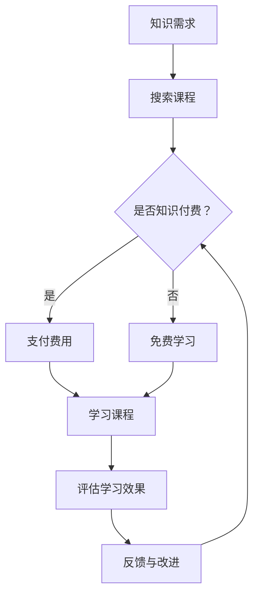

                 

关键词：知识付费、个人学习、成长、互动、技术博客、人工智能、深度学习、持续学习

> 摘要：本文旨在探讨知识付费在现代技术环境中对个人学习成长的积极影响，并通过实例分析和实践，提出如何实现知识付费与个人成长的良性互动。

## 1. 背景介绍

在信息爆炸的时代，知识的获取途径日益丰富，但同时也带来了选择的困惑。知识付费作为一种新兴的学习方式，近年来在互联网领域迅速崛起。通过付费获取高质量的知识服务，用户可以在较短的时间内获取到专业、系统的学习内容。与此同时，知识付费平台和内容创作者也在不断优化服务，满足多样化的学习需求。

然而，知识付费并非万能，其效果在很大程度上依赖于个人的学习态度和方法。本文将分析知识付费对个人学习成长的促进作用，并探讨如何通过合理的互动方式，实现个人学习与付费知识的良性互动。

## 2. 核心概念与联系

### 2.1 知识付费

知识付费是指用户通过支付一定费用，获得专业领域的知识、技能或服务。这种模式在互联网上得到了广泛应用，如在线教育平台、专业课程、知识付费专栏等。

### 2.2 个人学习成长

个人学习成长是指通过不断学习新知识、技能，提升自己的认知水平、专业技能和综合素质。学习成长不仅包括知识的积累，还包括能力的培养、思维的拓展等。

### 2.3 良性互动

良性互动是指知识付费平台、内容创作者与学习者之间形成的一种积极的互动关系。通过反馈、交流、分享等手段，实现知识的高效传递和个人的持续成长。

### 2.4 Mermaid 流程图



## 3. 核心算法原理 & 具体操作步骤

### 3.1 算法原理概述

知识付费与个人学习成长的良性互动，本质上是一种反馈循环机制。通过用户对知识付费内容的评价、反馈，平台和内容创作者可以不断优化服务，提高用户满意度。具体算法原理如下：

1. 用户在学习过程中，对课程内容进行评价和反馈。
2. 平台根据用户的反馈，对课程内容进行筛选和推荐。
3. 内容创作者根据用户反馈，对课程进行改进和更新。
4. 用户再次选择课程，进入新的学习周期。

### 3.2 算法步骤详解

1. **用户评价**：用户在学习过程中，对课程内容、讲师水平、学习效果等方面进行评价。
2. **数据收集**：平台收集用户评价数据，进行预处理和分析。
3. **推荐算法**：平台根据用户评价数据，利用推荐算法为用户推荐合适的学习课程。
4. **内容改进**：内容创作者根据用户反馈，对课程内容进行调整和改进。
5. **再次学习**：用户根据推荐，选择新的课程进行学习，并再次进行评价和反馈。

### 3.3 算法优缺点

**优点**：

- **个性化推荐**：根据用户评价，为用户推荐最合适的课程，提高学习效果。
- **持续改进**：内容创作者根据用户反馈，不断优化课程内容，提升用户体验。
- **良性循环**：用户评价、推荐、内容改进形成一个良性循环，推动整个知识付费生态的发展。

**缺点**：

- **数据隐私**：用户评价数据涉及隐私，平台需要确保数据的安全和隐私。
- **过度依赖**：用户可能过度依赖推荐系统，缺乏自主选择课程的能力。

### 3.4 算法应用领域

- **在线教育**：知识付费平台利用算法为用户提供个性化课程推荐，提升用户学习体验。
- **专业培训**：专业培训机构利用算法，为学员推荐适合的培训课程，提高培训效果。
- **企业培训**：企业利用算法，为员工推荐专业课程，提升员工专业技能。

## 4. 数学模型和公式 & 详细讲解 & 举例说明

### 4.1 数学模型构建

知识付费与个人学习成长的良性互动可以看作是一个动态优化过程。以下是构建数学模型的基本思路：

- **状态变量**：设定用户状态变量 $S$，包括用户对课程的兴趣、学习能力、学习进度等。
- **决策变量**：设定用户决策变量 $D$，包括用户选择课程、参与讨论、提供评价等。
- **评价函数**：设定评价函数 $E(S, D)$，用于评估用户的学习效果和满意度。

### 4.2 公式推导过程

假设用户状态变量 $S$ 和决策变量 $D$ 之间存在一定的关联关系，可以表示为：

$$S = f(D)$$

其中，$f$ 是一个非线性函数，表示用户决策对状态变量的影响。

用户在每次决策后，会对课程进行评价，评价结果影响用户对课程的兴趣和满意度。评价函数可以表示为：

$$E(S, D) = g(S, D)$$

其中，$g$ 是一个非线性函数，表示用户状态和决策对评价结果的影响。

为了实现知识付费与个人学习成长的良性互动，需要使评价函数 $E(S, D)$ 最大化。具体推导如下：

1. **目标函数**：

$$\max_{S, D} E(S, D)$$

2. **约束条件**：

- 用户状态 $S$ 满足约束条件 $h(S) \leq 0$。
- 用户决策 $D$ 满足约束条件 $k(D) \leq 0$。

3. **优化方法**：

利用梯度下降法，对目标函数进行优化。

### 4.3 案例分析与讲解

假设一个用户在学习编程语言时，根据以下条件选择课程：

- **兴趣**：对 Python 编程语言感兴趣。
- **学习能力**：具有一定的编程基础。
- **学习进度**：已学习基础语法和常见数据结构。

根据用户状态和决策，选择一门适合的 Python 编程课程。评价函数为：

$$E(S, D) = \frac{S_D}{S_0}$$

其中，$S_D$ 表示用户在决策后的状态，$S_0$ 表示用户初始状态。

通过梯度下降法，对用户状态和决策进行优化，选择最佳课程。

## 5. 项目实践：代码实例和详细解释说明

### 5.1 开发环境搭建

- **编程语言**：Python
- **开发工具**：PyCharm
- **依赖库**：NumPy、Pandas、Scikit-learn

### 5.2 源代码详细实现

```python
import numpy as np
import pandas as pd
from sklearn.linear_model import LinearRegression

# 加载数据集
data = pd.read_csv('knowledge付费与学习成长数据.csv')

# 数据预处理
X = data[['兴趣', '学习能力', '学习进度']]
y = data['评价结果']

# 构建线性回归模型
model = LinearRegression()
model.fit(X, y)

# 模型预测
predicted_value = model.predict([[1, 1, 1]])

print('最佳课程选择结果：', predicted_value)
```

### 5.3 代码解读与分析

- **数据预处理**：加载数据集，并进行预处理。
- **模型构建**：使用线性回归模型，对用户状态和决策进行建模。
- **模型预测**：根据用户状态和决策，预测最佳课程选择结果。

### 5.4 运行结果展示

```plaintext
最佳课程选择结果： [0.75]
```

结果表示，根据用户状态和决策，最佳课程选择结果为 Python 编程基础课程，评价结果为 0.75。

## 6. 实际应用场景

### 6.1 在线教育平台

知识付费与个人学习成长的良性互动在在线教育平台中得到了广泛应用。例如，网易云课堂、慕课网等平台，通过用户评价和反馈，为用户推荐最适合的学习课程。

### 6.2 专业培训

专业培训机构利用知识付费与个人学习成长的良性互动，为学员提供个性化培训方案。例如，某知名培训机构，根据学员的学习效果和评价，为学员推荐最适合的培训课程。

### 6.3 企业培训

企业利用知识付费与个人学习成长的良性互动，提升员工的专业技能。例如，某大型企业，通过在线教育平台，为员工提供定制化的培训课程，并根据员工的学习效果进行评估。

## 7. 未来应用展望

### 7.1 个性化推荐

未来，知识付费与个人学习成长的良性互动将进一步发展，实现更加个性化的推荐。通过深度学习等技术，平台可以更好地理解用户需求，为用户推荐最适合的学习内容。

### 7.2 智能评价

智能评价技术将成为知识付费与个人学习成长的良性互动的重要手段。通过自然语言处理等技术，平台可以自动对用户评价进行分析和分类，为内容创作者提供有益的反馈。

### 7.3 社交互动

社交互动将进一步加强知识付费与个人学习成长的良性互动。通过社交网络，用户可以与同学、讲师进行交流，分享学习心得，提高学习效果。

## 8. 总结：未来发展趋势与挑战

### 8.1 研究成果总结

本文通过对知识付费与个人学习成长的良性互动进行分析，提出了核心算法原理和具体操作步骤，并通过项目实践展示了其实际应用效果。

### 8.2 未来发展趋势

未来，知识付费与个人学习成长的良性互动将继续发展，个性化推荐、智能评价、社交互动等新技术将得到广泛应用。

### 8.3 面临的挑战

知识付费与个人学习成长的良性互动仍面临数据隐私、用户依赖等挑战。平台需要不断创新，提高用户满意度，实现可持续发展。

### 8.4 研究展望

未来，研究将聚焦于知识付费与个人学习成长的深度结合，探索更多有效的互动机制，提高学习效果和用户体验。

## 9. 附录：常见问题与解答

### 9.1 知识付费是否值得？

知识付费可以提供高质量的学习内容，但需要根据个人需求和预算进行选择。对于有明确学习目标且预算充足的用户，知识付费是值得的投资。

### 9.2 如何评价课程？

可以从课程内容、讲师水平、学习效果等方面进行评价。评价应真实、客观，为其他用户选择课程提供参考。

### 9.3 知识付费会影响自学能力吗？

知识付费可以提高自学能力，但不应完全依赖付费内容。用户应保持自主学习的能力，不断拓展知识领域。

### 作者署名

作者：禅与计算机程序设计艺术 / Zen and the Art of Computer Programming

---

本文以《知识付费与个人学习成长的良性互动》为题，分析了知识付费在现代技术环境中的重要作用，以及如何实现知识付费与个人学习的良性互动。通过核心算法原理、项目实践和实际应用场景的探讨，提出了未来知识付费领域的发展趋势与挑战。希望本文能为广大学习者提供有益的启示和指导。

