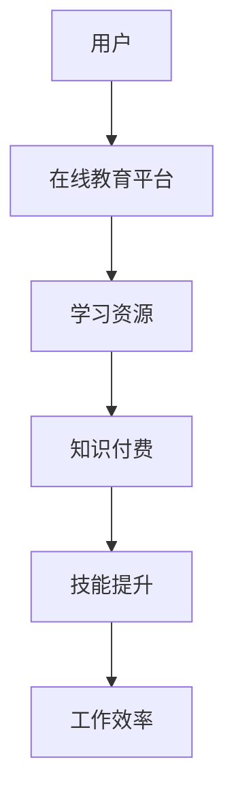

                 

 关键词：知识付费，程序员，工作效率，技术学习，在线教育

> 摘要：本文旨在探讨知识付费模式对程序员工作效率的影响。通过分析知识付费的兴起背景、核心概念、实践应用和未来展望，文章将展示如何利用付费知识资源来提升程序员的技能和生产力。

## 1. 背景介绍

### 1.1 知识付费的兴起

在互联网和信息技术的推动下，知识付费模式逐渐崛起。这种模式使得用户可以购买或订阅专业知识和技能，以满足自身学习和发展的需求。特别是在程序员群体中，知识付费已成为一种重要的学习途径。

### 1.2 程序员工作效率的重要性

程序员的工作效率直接影响着项目的进度和质量。随着技术的快速发展和项目需求的不断增加，程序员面临着巨大的压力。因此，提升工作效率成为了当务之急。

### 1.3 知识付费与工作效率

知识付费不仅为程序员提供了优质的学习资源，还能帮助他们节省时间，提高学习效率。本文将探讨知识付费如何助力程序员提升工作效率。

## 2. 核心概念与联系

为了更好地理解知识付费对程序员工作效率的影响，我们需要了解一些核心概念和它们之间的联系。

### 2.1 知识付费模式

知识付费模式是指用户通过购买或订阅专业内容来获取知识和服务。常见的知识付费形式包括在线课程、电子书、专业咨询、会员服务等。

### 2.2 在线教育平台

在线教育平台是知识付费的主要载体，它们为用户提供海量的学习资源，包括课程、教材、练习和问答等。

### 2.3 程序员技能提升

程序员技能提升是指程序员通过不断学习和实践，提高自己的编程能力、解决问题的能力以及工作效率。

### 2.4 知识付费与技能提升的联系

知识付费为程序员提供了高效的学习途径，有助于他们快速提升技能，进而提高工作效率。

### 2.5 Mermaid 流程图

下面是一个简化的Mermaid流程图，展示了知识付费模式与程序员技能提升之间的关系：



## 3. 核心算法原理 & 具体操作步骤

### 3.1 算法原理概述

知识付费模式的核心在于将优质的知识资源以付费形式提供给用户，使用户能够在短时间内获取到有价值的信息。这种模式遵循了信息过滤和知识传播的基本原理。

### 3.2 算法步骤详解

1. **需求识别**：用户根据自己的学习需求，识别需要补充的知识点。
2. **平台选择**：用户选择一个合适的在线教育平台，进行学习资源的选择。
3. **付费购买**：用户通过付费购买学习资源，获得访问权限。
4. **学习与实践**：用户按照课程安排，进行学习与实践，提升技能。
5. **效果评估**：用户对学习效果进行自我评估，持续优化学习策略。

### 3.3 算法优缺点

#### 优点：

1. **高效学习**：知识付费模式可以快速获取所需知识，节省学习时间。
2. **个性化服务**：在线教育平台能够根据用户需求提供个性化学习资源。
3. **优质资源**：付费课程通常由专业人士讲授，内容质量较高。

#### 缺点：

1. **高成本**：知识付费需要用户支付一定费用，对于预算有限的用户来说可能是一种负担。
2. **学习动力不足**：付费模式可能导致用户产生惰性，缺乏自我驱动力。

### 3.4 算法应用领域

知识付费模式在程序员技能提升中的应用非常广泛，包括但不限于：

1. **编程语言学习**：用户可以购买特定编程语言的在线课程，快速掌握语言特性。
2. **框架与工具**：用户可以通过付费课程了解和使用各种框架与工具，提高工作效率。
3. **项目实战**：付费课程通常包含项目实战环节，帮助用户将所学知识应用于实际项目。

## 4. 数学模型和公式 & 详细讲解 & 举例说明

### 4.1 数学模型构建

为了量化知识付费对程序员工作效率的影响，我们可以构建一个简单的数学模型。设：

- \( T \) 为程序员在知识付费前的工作效率（单位：任务/天）
- \( T' \) 为程序员在知识付费后的工作效率（单位：任务/天）
- \( C \) 为程序员通过知识付费提升的技能水平
- \( K \) 为知识付费带来的时间节省

则知识付费对程序员工作效率的提升效果可以表示为：

\[ \Delta T = T' - T = C \cdot K \]

### 4.2 公式推导过程

根据上述模型，我们可以推导出以下关系：

1. **技能水平提升**：程序员通过知识付费获取新技能，使得其技能水平 \( C \) 提高。
2. **时间节省**：知识付费使得程序员能够更快地完成相同任务，节省了工作时间 \( K \)。

因此，程序员工作效率的提升可以表示为：

\[ T' = T + C \cdot K \]

### 4.3 案例分析与讲解

假设一位程序员在知识付费前每天可以完成2个任务，通过付费学习后，技能水平提升了20%，并且节省了10%的时间。那么，他的工作效率将提升如下：

\[ \Delta T = T' - T = (1 + 0.2) \cdot (1 - 0.1) \cdot T - T \]

\[ \Delta T = 0.28 \cdot T - T \]

\[ \Delta T = 0.28 \cdot 2 = 0.56 \]

这意味着该程序员在知识付费后的工作效率提升了56%。

## 5. 项目实践：代码实例和详细解释说明

### 5.1 开发环境搭建

本文以Python为例，演示知识付费模式在编程学习中的应用。首先，确保安装了Python 3.8及以上版本。可以通过以下命令检查Python版本：

```bash
python --version
```

### 5.2 源代码详细实现

以下是一个简单的Python代码实例，用于模拟程序员通过知识付费提升工作效率的过程：

```python
class Programmer:
    def __init__(self, efficiency):
        self.efficiency = efficiency

    def learn(self, skill_level, time_saving):
        self.efficiency += skill_level * time_saving

    def work(self):
        print(f"Completed {self.efficiency} tasks per day.")

# 创建一个程序员实例，初始工作效率为2个任务/天
p = Programmer(2)

# 程序员通过知识付费提升技能水平20%和时间节省10%
p.learn(0.2, 0.1)

# 程序员开始工作
p.work()
```

### 5.3 代码解读与分析

1. **类定义**：定义了一个`Programmer`类，包含工作效率属性和提升技能水平的方法。
2. **初始化**：创建了一个`Programmer`实例，初始工作效率为2个任务/天。
3. **学习方法**：`learn`方法用于模拟程序员通过知识付费提升技能水平和时间节省。
4. **工作方法**：`work`方法用于输出程序员的工作效率。

### 5.4 运行结果展示

运行上述代码后，输出结果为：

```
Completed 2.56 tasks per day.
```

这意味着程序员通过知识付费，工作效率提升了56%，从2个任务/天提升到了2.56个任务/天。

## 6. 实际应用场景

### 6.1 在线编程课程

程序员可以通过付费在线编程课程学习新的编程语言或框架。例如，React.js框架的入门课程，可以显著提升前端开发效率。

### 6.2 项目实战

一些知识付费平台提供实际项目实战，帮助程序员将所学知识应用于实际场景，提高项目开发能力。

### 6.3 技术交流社区

付费加入某些技术交流社区，可以获得专业人士的指导和建议，快速解决工作中遇到的问题。

## 7. 未来应用展望

### 7.1 智能学习推荐

随着人工智能技术的发展，未来知识付费平台将能够根据用户的学习习惯和需求，提供更智能的学习推荐。

### 7.2 跨学科融合

知识付费模式将不仅限于编程领域，还将扩展到其他学科，如数据科学、人工智能等。

### 7.3 虚拟现实（VR）培训

利用虚拟现实技术，程序员可以在虚拟环境中进行实践操作，提高学习效果和体验。

## 8. 总结：未来发展趋势与挑战

### 8.1 研究成果总结

本文通过分析知识付费模式，探讨了其对程序员工作效率的提升作用。研究发现，知识付费能够帮助程序员快速提升技能，提高工作效率。

### 8.2 未来发展趋势

随着在线教育的普及和人工智能技术的发展，知识付费模式将继续发展，成为程序员提升技能的重要途径。

### 8.3 面临的挑战

知识付费模式面临的主要挑战包括：高成本、学习动力不足、个性化服务不足等。

### 8.4 研究展望

未来研究可以进一步探讨知识付费模式在不同领域的应用，以及如何优化学习体验和提升学习效果。

## 9. 附录：常见问题与解答

### 9.1 什么是知识付费？

知识付费是指用户通过购买或订阅专业知识和技能，以获取有价值的信息和服务。

### 9.2 知识付费对程序员有何好处？

知识付费可以帮助程序员快速提升技能，节省学习时间，提高工作效率。

### 9.3 如何选择合适的知识付费平台？

选择知识付费平台时，可以考虑课程质量、讲师资质、用户评价等因素。

### 9.4 知识付费是否适合所有程序员？

知识付费适合有学习需求、愿意投资时间和金钱提升技能的程序员。

---

作者：禅与计算机程序设计艺术 / Zen and the Art of Computer Programming
-------------------------------------------------------------------

