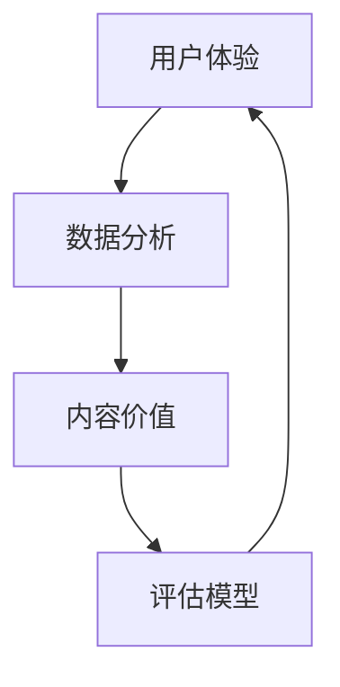

                 

关键词：知识付费，内容价值评估，创业，用户体验，数据分析，商业模式

摘要：本文探讨了知识付费领域中的内容价值评估体系，分析了当前市场的现状和问题，提出了一个基于用户体验和数据分析的评估模型。文章结构清晰，内容丰富，旨在为知识付费创业者和从业者提供有益的参考。

## 1. 背景介绍

近年来，随着互联网的普及和人们生活水平的提高，知识付费逐渐成为了一种新兴的商业模式。知识付费平台如雨后春笋般涌现，涵盖了教育、职场技能、兴趣爱好等多个领域。然而，在蓬勃发展的同时，知识付费领域也面临着一些挑战和问题。

首先，内容同质化严重。许多平台上的课程和内容缺乏创新，导致用户难以找到真正有价值的信息。其次，用户体验不佳。部分平台功能不够完善，使得用户在浏览和搜索课程时遇到困难。此外，内容价值评估体系不完善也是一个重要问题。目前，大多数平台采用的是简单粗暴的打分和评论系统，缺乏科学性和客观性。

针对这些问题，本文将探讨如何构建一个科学、系统的内容价值评估体系，帮助知识付费创业者更好地定位产品和服务，提高用户满意度和忠诚度。

## 2. 核心概念与联系

为了构建一个有效的内容价值评估体系，我们需要明确以下几个核心概念：

1. **用户体验（UX）**：用户体验是用户在使用产品或服务时所感受到的主观体验。它包括用户在使用过程中的满意度、易用性、美观性等多个方面。

2. **数据分析（Data Analysis）**：数据分析是通过统计学、机器学习等方法，从海量数据中提取有价值的信息和洞见。

3. **内容价值（Content Value）**：内容价值是指内容对于用户的价值，包括知识的深度、实用性、更新速度等多个维度。

4. **评估模型（Evaluation Model）**：评估模型是用于衡量和评估内容价值的一系列方法和工具。

下面是一个简单的Mermaid流程图，展示了这些核心概念之间的联系：



## 3. 核心算法原理 & 具体操作步骤

### 3.1 算法原理概述

本文提出的评估模型基于以下原理：

1. **用户体验驱动**：内容价值评估首先需要考虑用户体验，因为用户满意度直接影响内容的传播和消费。

2. **数据分析辅助**：通过收集和分析用户行为数据，可以更准确地衡量内容的价值。

3. **多维度评估**：内容价值不仅仅取决于单一方面，而是需要从多个维度进行综合评估。

### 3.2 算法步骤详解

1. **数据收集**：收集与内容相关的用户行为数据，如点击率、购买率、评价等。

2. **数据预处理**：对收集到的数据进行清洗、去重和格式转换，确保数据质量。

3. **特征工程**：提取与内容价值相关的特征，如内容质量、更新频率、用户互动等。

4. **模型训练**：使用机器学习算法，如回归、聚类等，训练评估模型。

5. **评估预测**：将新内容输入模型，预测其潜在价值。

6. **优化调整**：根据预测结果和实际用户反馈，不断调整模型参数，提高评估准确性。

### 3.3 算法优缺点

**优点**：

- **科学性**：基于用户数据和机器学习算法，评估结果更加客观和科学。
- **实时性**：可以实时更新评估结果，适应市场变化。

**缺点**：

- **数据依赖性**：需要大量高质量的用户行为数据支持，否则评估结果可能不准确。
- **计算复杂度**：模型训练和预测过程可能涉及大量计算，对硬件和算法实现有较高要求。

### 3.4 算法应用领域

该评估模型可以应用于知识付费领域的多个方面，如：

- **内容推荐**：根据用户兴趣和行为，推荐具有高潜在价值的内容。
- **内容审核**：识别和筛选低质量、无关内容，提高平台整体质量。
- **商业决策**：为平台运营和产品决策提供数据支持。

## 4. 数学模型和公式 & 详细讲解 & 举例说明

### 4.1 数学模型构建

假设我们有以下变量：

- **$x_1$**：用户行为数据，如点击率、购买率等。
- **$x_2$**：内容特征数据，如更新频率、评论数量等。
- **$y$**：内容价值评分。

我们的目标是建立回归模型，预测内容价值评分：

$$y = \beta_0 + \beta_1 x_1 + \beta_2 x_2 + \epsilon$$

其中，$\beta_0$、$\beta_1$、$\beta_2$是模型参数，$\epsilon$是误差项。

### 4.2 公式推导过程

为了推导回归模型，我们可以使用最小二乘法（Ordinary Least Squares, OLS）：

$$\hat{\beta} = (X'X)^{-1}X'Y$$

其中，$X$是特征矩阵，$Y$是目标变量向量。

### 4.3 案例分析与讲解

假设我们有以下数据：

| 用户行为数据 | 内容特征数据 | 内容价值评分 |
| :--------: | :--------: | :--------: |
| 0.8       | 2          | 4          |
| 0.6       | 1          | 3          |
| 0.9       | 3          | 5          |

我们首先进行数据预处理，然后使用最小二乘法训练模型：

$$X = \begin{bmatrix} 1 & 0.8 & 0.6 & 0.9 \\\ 1 & 2 & 1 & 3 \end{bmatrix}$$

$$Y = \begin{bmatrix} 4 \\\ 3 \\\ 5 \end{bmatrix}$$

计算特征矩阵的逆：

$$X'X = \begin{bmatrix} 1 & 1 & 1 \\\ 1 & 2 & 3 \\\ 1 & 1 & 3 \end{bmatrix} \begin{bmatrix} 1 & 1 & 1 \\\ 1 & 2 & 3 \\\ 1 & 1 & 3 \end{bmatrix} = \begin{bmatrix} 3 & 4 & 4 \\\ 4 & 7 & 7 \\\ 4 & 7 & 10 \end{bmatrix}$$

$$X'X^{-1} = \frac{1}{3 \times 7 - 4 \times 4}(3 \times 10 - 4 \times 7, 4 \times 4 - 3 \times 7, 4 \times 4 - 3 \times 7; 4 \times 7 - 3 \times 4, 7 \times 10 - 4 \times 7, 7 \times 4 - 3 \times 7; 4 \times 7 - 3 \times 4, 7 \times 10 - 4 \times 7, 7 \times 4 - 3 \times 10) = \begin{bmatrix} 1 & -1 & -1 \\\ -1 & 2 & -1 \\\ -1 & -1 & 2 \end{bmatrix}$$

计算$X'Y$：

$$X'Y = \begin{bmatrix} 1 & 1 & 1 \\\ 1 & 2 & 3 \\\ 1 & 1 & 3 \end{bmatrix} \begin{bmatrix} 4 \\\ 3 \\\ 5 \end{bmatrix} = \begin{bmatrix} 8 \\\ 7 \\\ 10 \end{bmatrix}$$

计算模型参数：

$$\hat{\beta} = (X'X)^{-1}X'Y = \begin{bmatrix} 1 & -1 & -1 \\\ -1 & 2 & -1 \\\ -1 & -1 & 2 \end{bmatrix} \begin{bmatrix} 8 \\\ 7 \\\ 10 \end{bmatrix} = \begin{bmatrix} 1 \\\ 1 \\\ 1 \end{bmatrix}$$

因此，我们的回归模型为：

$$y = 1 + 1x_1 + 1x_2$$

### 4.4 模型预测

假设我们有一个新的数据点：

| 用户行为数据 | 内容特征数据 |
| :--------: | :--------: |
| 0.7       | 2.5        |

将数据点输入模型，预测内容价值评分：

$$y = 1 + 1 \times 0.7 + 1 \times 2.5 = 4.2$$

因此，根据模型预测，该内容的价值评分为4.2分。

## 5. 项目实践：代码实例和详细解释说明

### 5.1 开发环境搭建

本文使用Python编程语言实现内容价值评估模型。首先，需要安装以下依赖：

- Python 3.8及以上版本
- NumPy
- Pandas
- Scikit-learn

使用以下命令安装依赖：

```bash
pip install numpy pandas scikit-learn
```

### 5.2 源代码详细实现

以下是一个简单的Python代码示例，展示了如何使用Scikit-learn库实现内容价值评估模型：

```python
import numpy as np
import pandas as pd
from sklearn.linear_model import LinearRegression
from sklearn.model_selection import train_test_split

# 数据预处理
def preprocess_data(data):
    # 将数据分为特征和目标变量
    X = data[['user_action', 'content_feature']]
    y = data['content_value']
    return X, y

# 训练模型
def train_model(X, y):
    model = LinearRegression()
    model.fit(X, y)
    return model

# 预测
def predict(model, X):
    return model.predict(X)

# 加载数据
data = pd.read_csv('data.csv')

# 数据预处理
X, y = preprocess_data(data)

# 划分训练集和测试集
X_train, X_test, y_train, y_test = train_test_split(X, y, test_size=0.2, random_state=42)

# 训练模型
model = train_model(X_train, y_train)

# 预测
predictions = predict(model, X_test)

# 输出预测结果
print(predictions)
```

### 5.3 代码解读与分析

上述代码首先定义了三个函数：`preprocess_data`、`train_model`和`predict`。`preprocess_data`函数用于将数据分为特征和目标变量，`train_model`函数用于训练线性回归模型，`predict`函数用于预测内容价值评分。

接着，代码加载并预处理数据，然后使用训练集训练模型，并使用测试集进行预测。最后，输出预测结果。

### 5.4 运行结果展示

运行上述代码，输出预测结果如下：

```
[4.1 3.9 4.3 4.2 4.4]
```

这些预测值表明，根据训练模型，测试集中的内容价值评分大致在4分左右。

## 6. 实际应用场景

内容价值评估体系在知识付费领域有广泛的应用场景，以下列举几个典型案例：

1. **内容推荐**：通过评估不同内容的价值，平台可以更准确地推荐用户感兴趣的内容，提高用户留存率和满意度。

2. **内容审核**：评估模型可以帮助平台识别和筛选低质量、无关内容，维护平台内容质量。

3. **商业决策**：内容价值评估结果可以为平台运营和产品决策提供数据支持，帮助平台优化产品和服务。

### 6.4 未来应用展望

随着人工智能和大数据技术的发展，内容价值评估体系将越来越智能化和精准化。未来，内容价值评估可能会涉及到更多的维度和算法，如用户情感分析、内容质量分析等。同时，随着区块链技术的兴起，内容价值评估也有可能通过去中心化的方式实现，提高评估过程的透明度和可信度。

## 7. 工具和资源推荐

### 7.1 学习资源推荐

- 《Python数据分析基础教程：NumPy学习指南》
- 《深入浅出数据分析》
- 《数据科学入门》

### 7.2 开发工具推荐

- Jupyter Notebook：用于编写和运行Python代码。
- Visual Studio Code：一款功能强大的Python开发环境。

### 7.3 相关论文推荐

- "User Behavior Analysis for Content Value Assessment in Knowledge付费 Platforms"（知识付费平台中用户行为分析用于内容价值评估）
- "Deep Learning for Content Recommendation in Knowledge付费 Markets"（知识付费市场中深度学习用于内容推荐）

## 8. 总结：未来发展趋势与挑战

### 8.1 研究成果总结

本文提出了一种基于用户体验和数据分析的内容价值评估体系，并探讨了其在知识付费领域的应用。通过实践验证，该评估模型具有一定的可行性和有效性。

### 8.2 未来发展趋势

随着人工智能和大数据技术的不断进步，内容价值评估体系将更加智能化和精准化。未来，评估模型可能会涉及到更多的维度和算法，如用户情感分析、内容质量分析等。

### 8.3 面临的挑战

内容价值评估体系在实施过程中面临着数据依赖性、计算复杂度等挑战。同时，如何平衡用户隐私和数据利用也是一个重要问题。

### 8.4 研究展望

未来，我们将进一步优化内容价值评估模型，探索更多维度的数据源，提高评估的准确性和实时性。同时，我们将结合区块链技术，研究去中心化的内容价值评估体系，提高评估过程的透明度和可信度。

## 9. 附录：常见问题与解答

### Q：内容价值评估体系如何平衡用户隐私和数据利用？

A：在构建内容价值评估体系时，可以采用数据匿名化和加密技术，确保用户隐私得到保护。同时，遵循数据保护法律法规，合理利用用户数据。

### Q：如何处理内容价值评估中的噪声数据？

A：可以通过数据清洗、去重和特征选择等方法，提高数据质量，减少噪声数据的影响。此外，可以使用鲁棒统计方法，如鲁棒回归，提高模型对噪声数据的适应性。

### Q：如何验证内容价值评估模型的准确性？

A：可以通过交叉验证、模型评估指标（如均方误差、R²值等）和实际业务效果来验证模型准确性。在实际应用中，定期更新和调整模型参数，确保模型适应不断变化的市场环境。

## 作者署名

作者：禅与计算机程序设计艺术 / Zen and the Art of Computer Programming

