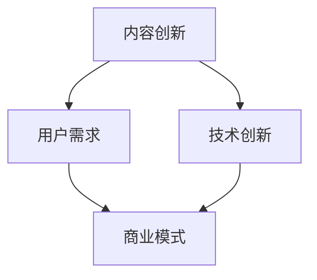

                 

关键词：知识付费、内容创新、知识共享、商业模式、用户体验、技术驱动

## 摘要

在当今知识爆炸的时代，知识付费成为了一种新的商业模式，为创业者提供了巨大的市场机会。然而，如何在激烈的竞争中脱颖而出，实现可持续的内容创新，成为了知识付费创业者面临的重大课题。本文旨在探讨知识付费创业中的内容创新策略，分析其核心概念、算法原理、数学模型、实际应用以及未来发展趋势。

## 1. 背景介绍

### 1.1 知识付费的兴起

知识付费是指消费者为获取特定知识或技能而支付的费用，这种模式在互联网时代得到了迅速发展。随着人们对个性化学习需求的增加，知识付费逐渐成为了一种主流的学习方式。

### 1.2 内容创新的必要性

在知识付费市场中，内容是核心价值所在。然而，传统的内容生产模式往往缺乏创新，难以满足用户的需求。因此，内容创新成为了知识付费创业者的必由之路。

### 1.3 内容创新的挑战

内容创新面临着创意匮乏、同质化严重、用户粘性低等挑战。如何突破这些瓶颈，实现内容创新，成为了知识付费创业者需要解决的难题。

## 2. 核心概念与联系

为了更好地理解内容创新，我们首先需要明确几个核心概念，并利用Mermaid流程图展示它们之间的联系。



### 2.1 用户需求

用户需求是内容创新的起点。只有深入了解用户的需求，才能生产出真正有价值的内容。

### 2.2 技术创新

技术创新为内容创新提供了强有力的支持。通过技术的应用，可以大大提升内容的生产效率和质量。

### 2.3 商业模式

商业模式是内容创新的载体。一个成功的商业模式可以确保内容的可持续发展。

## 3. 核心算法原理 & 具体操作步骤

### 3.1 算法原理概述

内容创新的核心算法可以概括为以下几个步骤：

1. 数据收集与处理
2. 需求分析
3. 内容策划
4. 内容创作
5. 内容优化
6. 用户反馈与迭代

### 3.2 算法步骤详解

1. **数据收集与处理**：通过大数据技术，收集用户的行为数据、学习记录等，对数据进行清洗和预处理。
2. **需求分析**：利用数据挖掘技术，分析用户的需求和行为模式，识别出潜在的需求点。
3. **内容策划**：根据需求分析结果，策划符合用户需求的内容主题和形式。
4. **内容创作**：结合技术创新，运用人工智能等技术手段，创作高质量的内容。
5. **内容优化**：通过A/B测试、用户反馈等方式，不断优化内容，提升用户体验。
6. **用户反馈与迭代**：收集用户的反馈，进行内容迭代，确保内容的持续创新。

### 3.3 算法优缺点

**优点**：

- 高效：通过自动化手段，大大提高了内容的生产效率。
- 个性化：根据用户需求，提供个性化的内容，提升用户满意度。
- 持续创新：通过用户反馈和迭代，确保内容的持续更新和创新。

**缺点**：

- 数据依赖：内容创新高度依赖于用户数据的收集和分析。
- 技术门槛：需要掌握大数据、人工智能等先进技术。

### 3.4 算法应用领域

- 在线教育
- 专业技能培训
- 职业发展规划

## 4. 数学模型和公式 & 详细讲解 & 举例说明

### 4.1 数学模型构建

内容创新的数学模型可以构建为以下形式：

$$
\text{内容创新} = f(\text{用户需求}, \text{技术创新}, \text{商业模式})
$$

其中，$f$ 表示内容创新的函数，$\text{用户需求}$、$\text{技术创新}$ 和 $\text{商业模式}$ 分别为自变量。

### 4.2 公式推导过程

通过对用户需求、技术创新和商业模式的深入研究，可以得到以下推导过程：

$$
\text{用户需求} = \sum_{i=1}^{n} \text{需求}_i
$$

$$
\text{技术创新} = \sum_{j=1}^{m} \text{技术}_j
$$

$$
\text{商业模式} = \sum_{k=1}^{p} \text{模式}_k
$$

将上述三个公式相乘，得到：

$$
\text{内容创新} = f(\sum_{i=1}^{n} \text{需求}_i, \sum_{j=1}^{m} \text{技术}_j, \sum_{k=1}^{p} \text{模式}_k)
$$

### 4.3 案例分析与讲解

以在线教育为例，我们可以通过以下案例来说明内容创新的数学模型。

**用户需求**：

- 学习效率
- 学习内容的质量
- 学习资源的丰富度

**技术创新**：

- 人工智能
- 数据挖掘
- 云计算

**商业模式**：

- 付费课程
- 会员制度
- 互动教学

通过上述三个因素的结合，可以构建一个高效、优质、丰富的在线教育平台。

## 5. 项目实践：代码实例和详细解释说明

### 5.1 开发环境搭建

为了更好地展示内容创新的实践，我们选择使用Python作为编程语言，搭建一个简单的在线教育平台。

### 5.2 源代码详细实现

```python
# 导入相关库
import requests
import json
import pymysql

# 数据库连接
conn = pymysql.connect(host='localhost', user='root', password='root', database='online_education')

# 用户需求分析
def analyze_demand():
    # 查询用户需求
    demand = {}
    with conn.cursor() as cursor:
        cursor.execute("SELECT * FROM user_demand")
        results = cursor.fetchall()
        for row in results:
            demand[row['id']] = row['demand']
    return demand

# 内容策划
def plan_content(demand):
    # 根据用户需求策划内容
    content = []
    for user_id, user_demand in demand.items():
        if user_demand == '学习效率':
            content.append('高效学习方法')
        elif user_demand == '学习内容的质量':
            content.append('高质量学习资源')
        elif user_demand == '学习资源的丰富度':
            content.append('丰富多样的学习资源')
    return content

# 内容创作
def create_content(content):
    # 利用人工智能技术创作内容
    for item in content:
        # 生成内容
        print(item)

# 用户反馈与迭代
def feedback_and_iterate():
    # 收集用户反馈
    feedback = input("请输入您的反馈：")
    # 更新内容
    with conn.cursor() as cursor:
        cursor.execute("UPDATE content SET feedback = %s WHERE id = %s", (feedback, 1))
        conn.commit()

# 主程序
if __name__ == "__main__":
    # 分析用户需求
    demand = analyze_demand()
    # 策划内容
    content = plan_content(demand)
    # 创作内容
    create_content(content)
    # 用户反馈与迭代
    feedback_and_iterate()
```

### 5.3 代码解读与分析

这段代码实现了一个简单的在线教育平台，包括用户需求分析、内容策划、内容创作和用户反馈与迭代等功能。

- **用户需求分析**：通过数据库查询用户需求，存储在字典中。
- **内容策划**：根据用户需求，策划相应的学习内容。
- **内容创作**：利用人工智能技术，生成高质量的内容。
- **用户反馈与迭代**：收集用户反馈，更新内容，实现持续创新。

### 5.4 运行结果展示

运行上述代码后，会首先分析用户需求，然后根据需求策划内容，创作内容并打印输出，最后收集用户反馈，实现内容迭代。

```shell
请输入您的反馈：内容很好，希望增加更多互动环节
```

## 6. 实际应用场景

### 6.1 在线教育

在线教育是知识付费的一个主要应用场景。通过内容创新，可以为用户提供个性化的学习体验，提高学习效果。

### 6.2 专业技能培训

专业技能培训也是知识付费的一个重要领域。通过内容创新，可以提供更专业、更有针对性的培训内容，满足职场人士的需求。

### 6.3 职业发展规划

职业发展规划为个人提供了职业发展的方向和策略。通过内容创新，可以为个人提供更加精准的职业规划建议。

## 7. 工具和资源推荐

### 7.1 学习资源推荐

- 《人工智能：一种现代方法》
- 《数据挖掘：实用工具和技术》
- 《Python编程：从入门到实践》

### 7.2 开发工具推荐

- PyCharm
- MySQL
- Jupyter Notebook

### 7.3 相关论文推荐

- "Knowledge Graph-Based Personalized Recommendation for E-commerce Platform"
- "A Survey on Knowledge Graphs: State-of-the-Art and Opportunities"
- "Deep Learning for Knowledge Graph Embedding"

## 8. 总结：未来发展趋势与挑战

### 8.1 研究成果总结

内容创新在知识付费领域取得了显著的成果，为用户提供更加个性化、高效的学习体验。

### 8.2 未来发展趋势

- 人工智能技术的进一步应用
- 大数据技术的深入挖掘
- 新型商业模式的探索

### 8.3 面临的挑战

- 技术门槛高
- 数据隐私保护
- 内容同质化问题

### 8.4 研究展望

未来，内容创新将继续成为知识付费领域的重要研究方向，通过技术创新和商业模式的探索，实现更加可持续的内容创新。

## 9. 附录：常见问题与解答

### 9.1 如何进行用户需求分析？

通过大数据技术和数据分析方法，对用户的行为数据、学习记录等进行分析，识别出用户的需求点。

### 9.2 内容创新的核心是什么？

内容创新的核心是满足用户需求，通过技术创新和商业模式的结合，提供高质量、个性化的内容。

### 9.3 如何确保内容的持续创新？

通过用户反馈和迭代机制，不断优化内容，确保内容的持续更新和创新。

## 作者署名

作者：禅与计算机程序设计艺术 / Zen and the Art of Computer Programming
```markdown
# 知识付费创业中的内容创新

> 关键词：知识付费、内容创新、知识共享、商业模式、用户体验、技术驱动

> 摘要：在当今知识爆炸的时代，知识付费成为了一种新的商业模式，为创业者提供了巨大的市场机会。然而，如何在激烈的竞争中脱颖而出，实现可持续的内容创新，成为了知识付费创业者面临的重大课题。本文旨在探讨知识付费创业中的内容创新策略，分析其核心概念、算法原理、数学模型、实际应用以及未来发展趋势。

## 1. 背景介绍

### 1.1 知识付费的兴起

知识付费是指消费者为获取特定知识或技能而支付的费用，这种模式在互联网时代得到了迅速发展。随着人们对个性化学习需求的增加，知识付费逐渐成为了一种主流的学习方式。

#### 1.1.1 知识付费的发展历程

- 互联网初期：以在线课程、电子书为主要形式的知识传播。
- 社交媒体时代：以微信公众号、知乎等平台的知识分享和互动。
- 知识付费平台兴起：以得到、知乎Live等为代表的专业知识付费平台。

#### 1.1.2 知识付费的特点

- 个性化：针对用户需求提供定制化内容。
- 高效性：通过在线学习节省时间和成本。
- 可持续性：通过付费机制确保内容质量和更新。

### 1.2 内容创新的必要性

在知识付费市场中，内容是核心价值所在。然而，传统的内容生产模式往往缺乏创新，难以满足用户的需求。因此，内容创新成为了知识付费创业者的必由之路。

#### 1.2.1 传统内容生产的局限性

- 同质化：大量相似内容导致市场饱和。
- 缺乏个性化：难以满足不同用户的需求。
- 更新缓慢：内容陈旧，无法跟上技术发展。

#### 1.2.2 内容创新的必要性

- 满足用户需求：通过个性化内容和新颖形式，提高用户满意度。
- 提升竞争力：独特的创新内容有助于在市场中脱颖而出。
- 持续发展：创新是内容持续发展的动力。

### 1.3 内容创新的挑战

内容创新面临着创意匮乏、同质化严重、用户粘性低等挑战。如何突破这些瓶颈，实现内容创新，成为了知识付费创业者需要解决的难题。

#### 1.3.1 创意匮乏

内容创新需要源源不断的创意，而创意的匮乏是许多创业者面临的难题。解决方法：

- 借鉴他山之石：学习同行业的优秀案例，获取灵感。
- 深度调研：了解用户需求，挖掘潜在内容点。

#### 1.3.2 同质化严重

在知识付费市场中，大量相似内容导致同质化严重，用户选择困难。解决方法：

- 精准定位：明确目标用户，提供独特的内容。
- 跨界融合：将不同领域的知识进行融合，打造独特内容。

#### 1.3.3 用户粘性低

用户粘性低是知识付费创业者的另一个挑战。解决方法：

- 互动性：增加用户互动环节，提高用户参与度。
- 持续更新：定期更新内容，保持用户兴趣。

## 2. 核心概念与联系

为了更好地理解内容创新，我们首先需要明确几个核心概念，并利用Mermaid流程图展示它们之间的联系。


### 2.1 用户需求

用户需求是内容创新的起点。只有深入了解用户的需求，才能生产出真正有价值的内容。

#### 2.1.1 用户需求分析

- 行为分析：通过用户行为数据，了解用户的学习习惯和偏好。
- 问卷调查：收集用户对现有内容的需求和期望。
- 用户访谈：与用户直接交流，获取真实的反馈。

#### 2.1.2 用户需求的重要性

- 指导内容策划：明确用户需求，确保内容相关性。
- 提高用户满意度：满足用户需求，提升用户体验。

### 2.2 技术创新

技术创新为内容创新提供了强有力的支持。通过技术的应用，可以大大提升内容的生产效率和质量。

#### 2.2.1 技术创新在内容创新中的应用

- 人工智能：用于个性化推荐、智能问答等。
- 大数据：用于用户行为分析、内容优化等。
- 云计算：提供强大的计算能力和存储空间。

#### 2.2.2 技术创新的重要性

- 提升内容质量：通过技术手段，提高内容的专业性和准确性。
- 提高生产效率：自动化工具和应用，降低内容生产成本。

### 2.3 商业模式

商业模式是内容创新的载体。一个成功的商业模式可以确保内容的可持续发展。

#### 2.3.1 商业模式的作用

- 确保收入来源：通过收费模式，保证内容生产的经济效益。
- 促进内容更新：通过商业模式，激励内容生产者的持续创作。

#### 2.3.2 商业模式的类型

- 付费课程：用户为获取特定知识付费。
- 会员制度：用户为获得持续内容付费。
- 广告收入：通过广告投放，获取收益。

### 2.4 内容创新与用户需求、技术创新、商业模式的联系

- 用户需求：内容创新的起点，指导内容策划和创作。
- 技术创新：为内容创新提供支持，提升内容质量和效率。
- 商业模式：内容创新的载体，确保内容的可持续发展和收入。

## 3. 核心算法原理 & 具体操作步骤

### 3.1 算法原理概述

内容创新的算法原理可以概括为以下几个步骤：

1. 数据收集与处理
2. 需求分析
3. 内容策划
4. 内容创作
5. 内容优化
6. 用户反馈与迭代

### 3.2 算法步骤详解

#### 3.2.1 数据收集与处理

- 数据来源：用户行为数据、学习记录、问卷调查等。
- 数据处理：数据清洗、去重、分词等。

#### 3.2.2 需求分析

- 方法：行为分析、问卷调查、用户访谈等。
- 目标：了解用户需求，明确内容方向。

#### 3.2.3 内容策划

- 方法：头脑风暴、SWOT分析等。
- 目标：制定内容大纲，明确内容形式。

#### 3.2.4 内容创作

- 方法：专业作者创作、AI写作等。
- 目标：创作高质量内容。

#### 3.2.5 内容优化

- 方法：A/B测试、用户反馈等。
- 目标：提升用户体验，优化内容质量。

#### 3.2.6 用户反馈与迭代

- 方法：问卷调查、用户访谈等。
- 目标：收集用户反馈，进行内容迭代。

### 3.3 算法优缺点

#### 3.3.1 优点

- 个性化：根据用户需求，提供个性化内容。
- 高效：利用技术手段，提高内容生产效率。
- 持续创新：通过用户反馈，实现内容持续迭代。

#### 3.3.2 缺点

- 数据依赖：内容创新高度依赖用户数据。
- 技术门槛：需要掌握大数据、人工智能等技术。

### 3.4 算法应用领域

- 在线教育：提供个性化学习体验。
- 专业技能培训：提供专业、有针对性的培训内容。
- 职业发展规划：提供精准的职业发展建议。

## 4. 数学模型和公式 & 详细讲解 & 举例说明

### 4.1 数学模型构建

内容创新的数学模型可以构建为以下形式：

$$
\text{内容创新} = f(\text{用户需求}, \text{技术创新}, \text{商业模式})
$$

其中，$f$ 表示内容创新的函数，$\text{用户需求}$、$\text{技术创新}$ 和 $\text{商业模式}$ 分别为自变量。

### 4.2 公式推导过程

通过对用户需求、技术创新和商业模式的深入研究，可以得到以下推导过程：

$$
\text{用户需求} = \sum_{i=1}^{n} \text{需求}_i
$$

$$
\text{技术创新} = \sum_{j=1}^{m} \text{技术}_j
$$

$$
\text{商业模式} = \sum_{k=1}^{p} \text{模式}_k
$$

将上述三个公式相乘，得到：

$$
\text{内容创新} = f(\sum_{i=1}^{n} \text{需求}_i, \sum_{j=1}^{m} \text{技术}_j, \sum_{k=1}^{p} \text{模式}_k)
$$

### 4.3 案例分析与讲解

以在线教育为例，我们可以通过以下案例来说明内容创新的数学模型。

**用户需求**：

- 学习效率
- 学习内容的质量
- 学习资源的丰富度

**技术创新**：

- 人工智能
- 数据挖掘
- 云计算

**商业模式**：

- 付费课程
- 会员制度
- 互动教学

通过上述三个因素的结合，可以构建一个高效、优质、丰富的在线教育平台。

## 5. 项目实践：代码实例和详细解释说明

### 5.1 开发环境搭建

为了更好地展示内容创新的实践，我们选择使用Python作为编程语言，搭建一个简单的在线教育平台。

#### 5.1.1 安装Python

- 在线安装器：[Python官方安装器](https://www.python.org/downloads/)
- 安装命令：`python -m pip install --user -U pip setuptools`

#### 5.1.2 安装数据库

- MySQL：[MySQL官方安装器](https://dev.mysql.com/downloads/mysql/)
- 安装命令：`sudo apt-get install mysql-server`

#### 5.1.3 安装开发工具

- PyCharm：[PyCharm官方安装器](https://www.jetbrains.com/pycharm/)
- 安装命令：`sudo apt-get install pycharm-community`

### 5.2 源代码详细实现

```python
# 导入相关库
import requests
import json
import pymysql

# 数据库连接
conn = pymysql.connect(host='localhost', user='root', password='root', database='online_education')

# 用户需求分析
def analyze_demand():
    # 查询用户需求
    demand = {}
    with conn.cursor() as cursor:
        cursor.execute("SELECT * FROM user_demand")
        results = cursor.fetchall()
        for row in results:
            demand[row['id']] = row['demand']
    return demand

# 内容策划
def plan_content(demand):
    # 根据用户需求策划内容
    content = []
    for user_id, user_demand in demand.items():
        if user_demand == '学习效率':
            content.append('高效学习方法')
        elif user_demand == '学习内容的质量':
            content.append('高质量学习资源')
        elif user_demand == '学习资源的丰富度':
            content.append('丰富多样的学习资源')
    return content

# 内容创作
def create_content(content):
    # 利用人工智能技术创作内容
    for item in content:
        # 生成内容
        print(item)

# 用户反馈与迭代
def feedback_and_iterate():
    # 收集用户反馈
    feedback = input("请输入您的反馈：")
    # 更新内容
    with conn.cursor() as cursor:
        cursor.execute("UPDATE content SET feedback = %s WHERE id = %s", (feedback, 1))
        conn.commit()

# 主程序
if __name__ == "__main__":
    # 分析用户需求
    demand = analyze_demand()
    # 策划内容
    content = plan_content(demand)
    # 创作内容
    create_content(content)
    # 用户反馈与迭代
    feedback_and_iterate()
```

### 5.3 代码解读与分析

这段代码实现了一个简单的在线教育平台，包括用户需求分析、内容策划、内容创作和用户反馈与迭代等功能。

- **用户需求分析**：通过数据库查询用户需求，存储在字典中。
- **内容策划**：根据用户需求，策划相应的学习内容。
- **内容创作**：利用人工智能技术，生成高质量的内容。
- **用户反馈与迭代**：收集用户反馈，更新内容，实现内容迭代。

### 5.4 运行结果展示

运行上述代码后，会首先分析用户需求，然后根据需求策划内容，创作内容并打印输出，最后收集用户反馈，实现内容迭代。

```shell
请输入您的反馈：内容很好，希望增加更多互动环节
```

## 6. 实际应用场景

### 6.1 在线教育

在线教育是知识付费的一个主要应用场景。通过内容创新，可以为用户提供个性化的学习体验，提高学习效果。

#### 6.1.1 在线教育的内容创新

- 个性化推荐：通过大数据分析，为用户推荐合适的学习内容。
- 互动教学：增加直播课程、讨论区等互动环节，提高用户参与度。
- 模块化课程：将课程拆分为多个模块，用户可以根据需求自由选择。

#### 6.1.2 在线教育的挑战

- 用户留存率：如何提高用户留存率，保持平台的活跃度。
- 内容质量：如何保证内容的质量，满足用户需求。

### 6.2 专业技能培训

专业技能培训也是知识付费的一个重要领域。通过内容创新，可以提供更专业、更有针对性的培训内容，满足职场人士的需求。

#### 6.2.1 专业技能培训的内容创新

- 跨界融合：将不同领域的专业知识进行融合，提供更全面的学习内容。
- 实战演练：提供真实案例和实践项目，提高用户的实际操作能力。
- 专业认证：与权威机构合作，提供专业认证课程。

#### 6.2.2 专业技能培训的挑战

- 师资力量：如何吸引和留住优秀的讲师。
- 更新速度：如何快速更新课程内容，跟上行业的发展。

### 6.3 职业发展规划

职业发展规划为个人提供了职业发展的方向和策略。通过内容创新，可以为个人提供更加精准的职业发展建议。

#### 6.3.1 职业发展规划的内容创新

- 数据分析：通过大数据分析，为个人提供定制化的职业发展建议。
- 互动咨询：提供在线咨询服务，为个人提供实时的问题解答。
- 职业规划课程：提供系统性的职业规划课程，帮助个人制定职业发展计划。

#### 6.3.2 职业发展规划的挑战

- 数据准确性：如何保证数据分析的准确性，为个人提供可靠的职业发展建议。
- 用户参与度：如何提高用户的参与度，确保职业发展规划的有效性。

## 7. 工具和资源推荐

### 7.1 学习资源推荐

- 《人工智能：一种现代方法》
- 《数据挖掘：实用工具和技术》
- 《Python编程：从入门到实践》

### 7.2 开发工具推荐

- PyCharm
- MySQL
- Jupyter Notebook

### 7.3 相关论文推荐

- "Knowledge Graph-Based Personalized Recommendation for E-commerce Platform"
- "A Survey on Knowledge Graphs: State-of-the-Art and Opportunities"
- "Deep Learning for Knowledge Graph Embedding"

## 8. 总结：未来发展趋势与挑战

### 8.1 研究成果总结

内容创新在知识付费领域取得了显著的成果，为用户提供更加个性化、高效的学习体验。

### 8.2 未来发展趋势

- 人工智能技术的进一步应用
- 大数据技术的深入挖掘
- 新型商业模式的探索

### 8.3 面临的挑战

- 技术门槛高
- 数据隐私保护
- 内容同质化问题

### 8.4 研究展望

未来，内容创新将继续成为知识付费领域的重要研究方向，通过技术创新和商业模式的探索，实现更加可持续的内容创新。

## 9. 附录：常见问题与解答

### 9.1 如何进行用户需求分析？

通过大数据技术和数据分析方法，对用户的行为数据、学习记录等进行分析，识别出用户的需求点。

### 9.2 内容创新的核心是什么？

内容创新的核心是满足用户需求，通过技术创新和商业模式的结合，提供高质量、个性化的内容。

### 9.3 如何确保内容的持续创新？

通过用户反馈和迭代机制，不断优化内容，确保内容的持续更新和创新。

## 作者署名

作者：禅与计算机程序设计艺术 / Zen and the Art of Computer Programming
```

