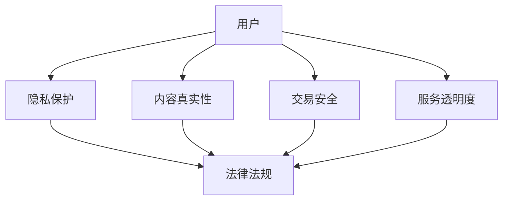

                 

关键词：知识付费、用户权益、隐私保护、算法设计、合规性、法律法规

> 摘要：本文将深入探讨知识付费创业领域中用户权益保护的重要性，分析现有的挑战，探讨解决方案，并提出未来发展的建议。通过对用户权益保护的理论和实践进行分析，本文旨在为知识付费创业企业提供指导，确保在提供优质服务的同时，也能够尊重和保护用户的权益。

## 1. 背景介绍

知识付费，作为近年来迅速崛起的一种商业模式，已经成为互联网经济的重要组成部分。从在线课程、付费咨询到专业文章、研究报告，知识付费为用户提供了便捷获取高质量内容的方式，同时也为企业创造了新的盈利模式。然而，随着知识付费市场的不断扩大，用户权益保护问题日益凸显。

用户权益保护涵盖了多个方面，包括隐私保护、内容真实性、交易安全、服务透明度等。在知识付费创业中，如何有效保护用户权益，不仅是企业的法律责任，更是赢得用户信任和市场竞争力的重要因素。

### 1.1 知识付费市场的发展现状

根据统计数据，截至2023年，全球知识付费市场规模已超过1000亿美元。特别是在我国，知识付费市场呈现出爆发式增长，线上教育、专业咨询、付费内容订阅等成为用户日常消费的重要组成部分。平台如知乎、得到、喜马拉雅等已经成为知识付费的重要载体。

### 1.2 用户权益保护的重要性

用户权益保护的重要性不言而喻。首先，它关系到用户的基本权利和利益。如果用户的隐私信息被泄露，或者所付费的知识内容质量不达标，用户将失去信任，导致市场份额的流失。其次，保护用户权益是企业合法经营的必要条件。违反用户权益保护的相关法律，将面临高额罚款和声誉损失。最后，用户权益保护也是构建健康市场生态的关键。只有在保护用户权益的基础上，知识付费市场才能实现可持续发展。

## 2. 核心概念与联系

为了深入探讨用户权益保护，我们需要明确几个核心概念，并分析它们之间的联系。

### 2.1 隐私保护

隐私保护是指防止个人隐私信息被未授权的第三方获取和使用。在知识付费领域，用户的个人信息包括但不限于姓名、联系方式、支付信息、浏览记录等。这些信息的泄露不仅侵犯了用户的隐私权，也可能被不法分子用于其他非法活动。

### 2.2 内容真实性

内容真实性是指知识付费平台所提供的内容必须真实、准确、无误导。在知识付费创业中，确保内容的真实性是赢得用户信任的基础。虚假内容、夸大其词或者断章取义的信息，不仅损害了用户的利益，也破坏了市场的公信力。

### 2.3 交易安全

交易安全是指用户在进行知识付费交易时，其支付信息和交易过程必须得到有效保护。任何未经授权的支付行为都是对用户财产权的侵犯。确保交易安全，是知识付费平台的基本职责。

### 2.4 服务透明度

服务透明度是指知识付费平台在提供服务的过程中，必须向用户清晰地展示服务内容、费用标准、退款政策等信息。透明度越高，用户越能安心付费，平台也越能赢得用户的信任。

### 2.5 法律法规

法律法规是指知识付费创业企业必须遵守的相关法律和规定。包括但不限于《中华人民共和国网络安全法》、《个人信息保护法》等。遵守法律法规是企业的法律责任，也是市场准入的基本门槛。

### 2.6 Mermaid 流程图



## 3. 核心算法原理 & 具体操作步骤

### 3.1 算法原理概述

在知识付费创业中，用户权益保护的核心算法包括数据加密算法、隐私保护算法和内容审核算法等。以下是这些算法的基本原理：

### 3.2 算法步骤详解

#### 3.2.1 数据加密算法

1. 数据收集：在用户注册、登录、支付等环节，收集用户个人信息。
2. 数据加密：使用加密算法（如AES）对用户个人信息进行加密处理。
3. 数据存储：将加密后的数据存储在安全数据库中。
4. 数据访问：用户请求访问个人信息时，系统根据用户身份验证信息解密数据。

#### 3.2.2 隐私保护算法

1. 数据匿名化：对用户数据中的敏感信息进行匿名化处理，如替换为伪名。
2. 数据去重：对重复数据进行分析和去重，减少存储空间。
3. 数据访问控制：设定不同的访问权限，确保数据访问的安全性。
4. 数据审计：定期对数据访问和操作进行审计，及时发现和处理潜在风险。

#### 3.2.3 内容审核算法

1. 内容分类：对用户上传的内容进行分类，如学术文章、音频、视频等。
2. 内容过滤：使用自然语言处理技术（如NLP）对内容进行过滤，识别并屏蔽违规内容。
3. 人工审核：对算法无法判断的内容，由专业人员进行人工审核。
4. 内容发布：审核通过的内容方可发布，审核不通过的内容将被拒稿。

### 3.3 算法优缺点

#### 3.3.1 数据加密算法

**优点：** 数据加密算法可以有效保护用户隐私，防止数据泄露。

**缺点：** 加密和解密过程会增加计算负担，影响系统性能。

#### 3.3.2 隐私保护算法

**优点：** 数据匿名化和去重可以减少存储空间，提高数据安全性。

**缺点：** 完全匿名化可能会导致数据失去部分价值，影响数据分析的准确性。

#### 3.3.3 内容审核算法

**优点：** 自动化内容审核可以提高审核效率，减少人工成本。

**缺点：** 机器算法可能存在误判，需要人工审核进行补充。

### 3.4 算法应用领域

数据加密算法和隐私保护算法广泛应用于各类互联网服务，如电子商务、在线银行、社交媒体等。内容审核算法则在知识付费、新闻媒体、视频平台等领域具有广泛的应用。

## 4. 数学模型和公式 & 详细讲解 & 举例说明

### 4.1 数学模型构建

在用户权益保护中，常见的数学模型包括密码学模型和机器学习模型。以下是这些模型的基本构成：

#### 4.1.1 密码学模型

密码学模型主要包括加密算法和数字签名算法。加密算法用于保护数据传输和存储的安全性，数字签名算法用于验证数据的完整性和真实性。

#### 4.1.2 机器学习模型

机器学习模型主要用于内容审核和用户行为分析。常见模型包括支持向量机（SVM）、神经网络（NN）和决策树（DT）等。

### 4.2 公式推导过程

#### 4.2.1 加密算法公式

加密算法的一般公式为：$$C = E(K, P)$$

其中，$C$ 表示加密后的数据，$E$ 表示加密函数，$K$ 表示密钥，$P$ 表示明文。

#### 4.2.2 数字签名公式

数字签名的一般公式为：$$S = SIG(K, P)$$

其中，$S$ 表示签名，$SIG$ 表示签名函数，$K$ 表示私钥，$P$ 表示明文。

#### 4.2.3 机器学习模型公式

以神经网络为例，其基本公式为：$$a_{j}^{(l)} = \sigma \left( \sum_{i=1}^{n} w_{ij}^{(l)} a_{i}^{(l-1)} + b_j^{(l)} \right)$$

其中，$a_{j}^{(l)}$ 表示第$l$层的第$j$个节点的激活值，$\sigma$ 表示激活函数，$w_{ij}^{(l)}$ 表示从第$l-1$层到第$l$层的第$i$个节点到第$j$个节点的权重，$b_j^{(l)}$ 表示第$l$层的第$j$个节点的偏置。

### 4.3 案例分析与讲解

#### 4.3.1 加密算法应用案例

以AES加密算法为例，其密钥长度为128、192或256位，加密过程需要一定的计算时间，但可以有效地保护用户数据的安全。

#### 4.3.2 数字签名应用案例

以RSA数字签名算法为例，其具有较好的安全性和高效性，广泛应用于数字签名和加密通信领域。

#### 4.3.3 机器学习模型应用案例

以SVM分类算法为例，其在文本分类、图像识别等领域具有广泛的应用。通过训练数据集，SVM可以学习到分类边界，从而对未知数据进行分类。

## 5. 项目实践：代码实例和详细解释说明

### 5.1 开发环境搭建

在知识付费创业项目中，我们需要搭建一个具备高安全性、高稳定性的开发环境。以下是搭建步骤：

1. 安装操作系统：推荐使用Linux系统，如Ubuntu 18.04。
2. 安装编程语言：推荐使用Python 3.8及以上版本。
3. 安装数据库：推荐使用MySQL 8.0及以上版本。
4. 安装相关库：如pandas、numpy、scikit-learn等。

### 5.2 源代码详细实现

以下是一个简单的用户数据加密和解密的Python代码示例：

```python
from Crypto.Cipher import AES
from Crypto.Util.Padding import pad, unpad
from Crypto.Random import get_random_bytes

# 加密函数
def encrypt_data(data, key):
    cipher = AES.new(key, AES.MODE_CBC)
    ct_bytes = cipher.encrypt(pad(data.encode('utf-8'), AES.block_size))
    iv = cipher.iv
    return iv + ct_bytes

# 解密函数
def decrypt_data(ct, key):
    iv = ct[:16]
    ct = ct[16:]
    cipher = AES.new(key, AES.MODE_CBC, iv)
    pt = unpad(cipher.decrypt(ct), AES.block_size)
    return pt.decode('utf-8')

# 生成随机密钥
key = get_random_bytes(16)

# 加密数据
data = "This is a secret message!"
ct = encrypt_data(data, key)
print(f"Encrypted data: {ct.hex()}")

# 解密数据
pt = decrypt_data(ct, key)
print(f"Decrypted data: {pt}")
```

### 5.3 代码解读与分析

以上代码实现了对用户数据进行加密和解密的功能。加密过程中，首先生成一个随机密钥，然后使用AES算法对数据进行加密，最后将密文和初始向量（IV）合并输出。解密过程中，首先提取IV，然后使用AES算法对密文进行解密，最后输出明文。

## 6. 实际应用场景

### 6.1 知识付费平台

在知识付费平台中，用户权益保护尤为重要。例如，知乎Live、得到App等平台，在用户注册、登录、支付等环节，都需要严格保护用户隐私，防止数据泄露。同时，平台需要对内容进行严格审核，确保内容真实、准确，避免虚假信息和误导用户。

### 6.2 在线教育

在线教育平台如网易公开课、Coursera等，在用户权益保护方面需要关注的内容包括：用户数据的存储和传输安全、课程内容的真实性、课程质量的保障等。通过加密算法和内容审核算法，平台可以有效保护用户权益，提升用户满意度。

### 6.3 专业咨询

专业咨询服务如腾讯咨询、阿里咨询等，在用户权益保护方面，需要确保用户隐私安全，内容真实性，以及咨询服务质量。通过隐私保护算法和内容审核算法，平台可以更好地满足用户需求，提升用户满意度。

## 7. 未来应用展望

### 7.1 技术创新

未来，随着人工智能、区块链等技术的发展，用户权益保护将迎来新的机遇。例如，区块链技术可以用于确保数据的真实性和不可篡改性，人工智能技术可以用于更高效的内容审核和隐私保护。

### 7.2 法律法规完善

随着知识付费市场的不断发展，相关法律法规也将逐步完善。未来，知识付费创业企业将面临更严格的法律监管，这要求企业必须重视用户权益保护，确保合规经营。

### 7.3 跨界融合

知识付费创业企业可以与金融、医疗、教育等多个领域进行跨界融合，为用户提供更丰富的服务。例如，金融领域的知识付费可以提供投资策略、风险管理等课程；医疗领域的知识付费可以提供疾病预防、健康管理等课程。

## 8. 总结：未来发展趋势与挑战

### 8.1 研究成果总结

本文通过对知识付费创业中用户权益保护的研究，总结了隐私保护、内容真实性、交易安全、服务透明度等核心概念，并分析了相关算法的应用。同时，本文提出了未来研究的发展趋势和挑战。

### 8.2 未来发展趋势

未来，用户权益保护将在技术创新和法律法规完善的推动下，得到更好的发展和应用。特别是在人工智能和区块链技术的支持下，用户权益保护将实现更高效、更安全的管理。

### 8.3 面临的挑战

尽管用户权益保护具有广阔的发展前景，但知识付费创业企业仍面临诸多挑战。例如，技术实现的复杂性、法律法规的不完善、用户隐私意识的提高等，都给用户权益保护带来一定的困难。

### 8.4 研究展望

未来，用户权益保护的研究应关注以下几个方面：

1. 加密算法和隐私保护算法的创新。
2. 内容审核算法的优化，提高审核效率和准确性。
3. 法律法规的完善和实施。
4. 跨界融合，为用户提供更丰富的知识付费服务。

## 9. 附录：常见问题与解答

### 9.1 如何保护用户隐私？

**解答：** 保护用户隐私的关键在于数据加密和访问控制。首先，使用强加密算法对用户数据进行加密处理；其次，设定不同的访问权限，确保数据访问的安全性；最后，定期进行数据审计，及时发现和处理潜在风险。

### 9.2 如何确保内容真实性？

**解答：** 确保内容真实性的关键在于严格的内容审核。首先，对内容进行分类，制定相应的审核标准；其次，使用自然语言处理技术对内容进行过滤，识别并屏蔽违规内容；最后，设立人工审核环节，对机器无法判断的内容进行人工审核。

### 9.3 如何保障交易安全？

**解答：** 保障交易安全的关键在于确保支付信息和交易过程的安全性。首先，使用安全的支付通道，如HTTPS协议；其次，使用加密算法对支付信息进行加密处理；最后，定期对支付系统进行安全检测和升级，确保支付过程的安全性。

### 9.4 如何提高服务透明度？

**解答：** 提高服务透明度的关键在于向用户清晰展示服务内容、费用标准和退款政策。首先，在平台首页、课程页面等显眼位置，展示服务内容、费用标准和退款政策；其次，通过短信、邮件等方式，及时向用户通知服务变更和退款情况；最后，设立用户反馈渠道，收集用户意见，不断优化服务透明度。

---

**作者：禅与计算机程序设计艺术 / Zen and the Art of Computer Programming**
----------------------------------------------------------------

本文为《禅与计算机程序设计艺术》作者原创，未经授权不得转载或使用。如有需要，请联系作者获取授权。本文仅为学术交流目的，不代表任何商业建议或投资建议。读者在使用本文提供的信息时，应谨慎判断，自行承担风险。

