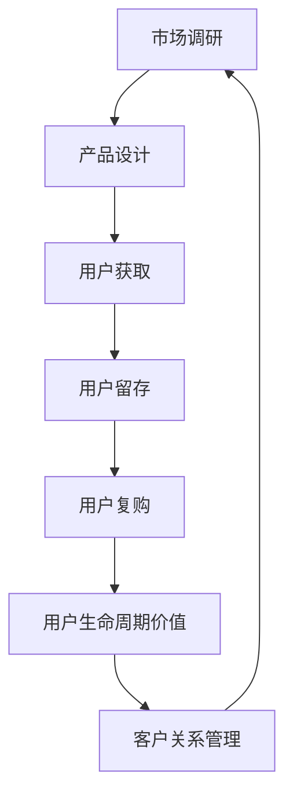

                 

在知识付费领域，用户留存与复购率是衡量企业成功与否的关键指标。对于创业者来说，如何吸引并留住用户，促使他们进行二次消费，成为了亟待解决的问题。本文将围绕这一主题，深入探讨知识付费创业中的用户留存与复购策略。

## 关键词
- 知识付费
- 用户留存
- 复购策略
- 创业
- 用户体验
- 数据分析

## 摘要
本文将从多个角度分析知识付费创业中的用户留存与复购策略，包括市场调研、产品设计、用户行为分析、客户关系管理等。通过深入剖析这些策略，帮助创业者提高用户留存率和复购率，从而在激烈的市场竞争中立于不败之地。

## 1. 背景介绍

### 1.1 知识付费行业现状

知识付费行业在过去几年中得到了快速发展，用户对于优质知识的渴求不断增长。根据统计数据显示，2019年中国知识付费市场规模已达到316亿元，预计到2022年将达到631亿元。这一增长趋势表明，知识付费已经成为一种重要的消费方式，吸引了越来越多的创业者投身其中。

### 1.2 用户留存与复购的重要性

在知识付费领域，用户留存与复购率是衡量企业成功与否的关键指标。高留存率和复购率不仅能够带来持续的收入，还能够降低获客成本，提高品牌知名度。相反，低留存率和复购率将导致企业面临巨大的挑战，甚至可能无法持续经营。

### 1.3 知识付费创业的挑战

知识付费创业面临着诸多挑战，如市场竞争激烈、用户需求多样化、内容同质化等。要想在激烈的市场竞争中脱颖而出，创业者必须具备敏锐的市场洞察力，创新的产品设计和有效的用户留存与复购策略。

## 2. 核心概念与联系

为了更好地理解用户留存与复购策略，我们需要明确以下几个核心概念：

### 2.1 用户留存（User Retention）

用户留存是指在一定时间内，仍然活跃并使用产品或服务的用户比例。用户留存率是衡量产品受欢迎程度和用户满意度的重要指标。

### 2.2 用户复购（User Repurchase）

用户复购是指用户在购买产品或服务后，再次进行购买的行为。复购率是衡量产品黏性和用户忠诚度的重要指标。

### 2.3 用户生命周期（Customer Lifetime Value，CLV）

用户生命周期是指用户从首次接触产品到最终离开产品的整个过程。用户生命周期价值是衡量用户为企业带来的总收益的重要指标。

### 2.4 用户行为分析（User Behavior Analysis）

用户行为分析是指通过对用户行为数据的收集、分析和解读，了解用户需求、偏好和行为模式，从而为产品改进和用户留存提供依据。

### 2.5 客户关系管理（Customer Relationship Management，CRM）

客户关系管理是一种以客户为中心的企业管理模式，旨在通过优化客户关系，提高客户满意度和忠诚度，从而实现长期稳定的发展。

### 2.6 Mermaid 流程图

以下是用户留存与复购策略的Mermaid流程图：



## 3. 核心算法原理 & 具体操作步骤

### 3.1 算法原理概述

用户留存与复购策略的核心算法是基于机器学习的用户行为预测模型。通过分析用户的历史行为数据，预测用户在未来一段时间内的留存和复购概率，从而为产品和运营策略提供数据支持。

### 3.2 算法步骤详解

#### 3.2.1 数据收集与预处理

首先，收集用户的行为数据，包括注册时间、访问频率、购买记录、评论反馈等。然后，对数据进行清洗和预处理，去除异常值和缺失值，进行特征提取和转换。

#### 3.2.2 特征工程

根据用户行为数据，构建特征向量。特征向量包括用户基本信息、用户行为指标、内容特征等。例如，用户基本信息可以包括年龄、性别、职业等；用户行为指标可以包括访问时长、购买金额、评论数量等；内容特征可以包括课程标题、标签、评分等。

#### 3.2.3 模型选择与训练

选择合适的机器学习算法，如逻辑回归、决策树、随机森林、神经网络等。使用历史数据对模型进行训练，调整模型参数，提高预测准确性。

#### 3.2.4 预测与评估

使用训练好的模型对新的用户行为数据进行预测，得到用户的留存和复购概率。然后，对预测结果进行评估，如计算准确率、召回率、F1值等。

#### 3.2.5 优化与迭代

根据预测结果和用户反馈，不断优化产品和服务，提高用户满意度和留存率。例如，针对留存率较低的群体，可以提供更个性化的推荐和优惠活动。

### 3.3 算法优缺点

#### 优点：

- 高效：通过数据驱动的方式，快速找到用户留存和复购的关键因素，提高运营效率。
- 可解释性：机器学习算法的可解释性较好，能够清晰地展示预测结果的依据和影响因子。
- 模块化：算法模块化设计，易于与其他系统和模块进行集成，实现灵活部署。

#### 缺点：

- 复杂性：算法设计和实现较为复杂，需要专业的技术和经验。
- 数据依赖：算法效果高度依赖于数据质量和数据量，数据质量差或数据量不足可能导致预测不准确。
- 泛化能力：模型可能在特定领域或特定时间段内表现出色，但在其他领域或时间段的泛化能力可能较差。

### 3.4 算法应用领域

用户留存与复购策略在知识付费领域具有广泛的应用前景。例如，可以应用于课程推荐、优惠券发放、会员运营、用户流失预警等场景，帮助创业者提高用户留存率和复购率，实现持续增长。

## 4. 数学模型和公式 & 详细讲解 & 举例说明

### 4.1 数学模型构建

用户留存与复购预测的数学模型可以采用概率模型，如贝叶斯模型、逻辑回归模型等。以下以逻辑回归模型为例，介绍模型的构建过程。

#### 4.1.1 模型假设

假设用户的行为数据可以表示为一个二分类问题，即用户是否会在未来一段时间内留存或复购。设 $Y$ 为用户是否留存的标签，$Y=1$ 表示用户留存，$Y=0$ 表示用户未留存。同时，设 $X$ 为用户的行为特征向量。

#### 4.1.2 模型公式

逻辑回归模型的预测公式为：

$$
P(Y=1|X) = \frac{1}{1 + e^{-(\beta_0 + \beta_1x_1 + \beta_2x_2 + ... + \beta_nx_n})}
$$

其中，$P(Y=1|X)$ 表示在给定用户行为特征向量 $X$ 的情况下，用户留存的概率。$\beta_0$、$\beta_1$、$\beta_2$、...、$\beta_n$ 为模型的参数，需要通过训练数据拟合得到。

#### 4.1.3 模型损失函数

逻辑回归模型的损失函数通常采用对数似然损失函数：

$$
L(\theta) = -\sum_{i=1}^m [y_i \log(p_i) + (1 - y_i) \log(1 - p_i)]
$$

其中，$m$ 为训练样本数量，$y_i$ 和 $p_i$ 分别为第 $i$ 个样本的标签和预测概率。

#### 4.1.4 模型优化

逻辑回归模型的参数优化通常采用梯度下降法。具体步骤如下：

1. 初始化模型参数 $\theta$。
2. 对于每个训练样本，计算预测概率 $p_i$。
3. 计算损失函数关于参数 $\theta$ 的梯度。
4. 更新参数 $\theta$：
$$
\theta = \theta - \alpha \nabla_{\theta}L(\theta)
$$

其中，$\alpha$ 为学习率。

### 4.2 公式推导过程

#### 4.2.1 函数变换

首先，我们对逻辑回归模型的预测公式进行变换，使其更加直观：

$$
\log\left(\frac{P(Y=1|X)}{1 - P(Y=1|X)}\right) = \beta_0 + \beta_1x_1 + \beta_2x_2 + ... + \beta_nx_n
$$

这个公式表示，用户留存的概率与用户行为特征之间的关系是对数线性关系。

#### 4.2.2 概率分布

接下来，我们引入概率分布的概念，将用户留存的概率表示为概率分布函数：

$$
P(Y=1|X) = \frac{e^{\beta_0 + \beta_1x_1 + \beta_2x_2 + ... + \beta_nx_n}}{1 + e^{\beta_0 + \beta_1x_1 + \beta_2x_2 + ... + \beta_nx_n}}
$$

这个公式表示，用户留存的概率是指数分布函数的比值。

#### 4.2.3 损失函数

然后，我们引入损失函数，衡量预测概率与真实标签之间的差距：

$$
L(\theta) = -\sum_{i=1}^m [y_i \log(p_i) + (1 - y_i) \log(1 - p_i)]
$$

这个公式表示，损失函数是所有样本预测概率的对数和。

#### 4.2.4 梯度下降

最后，我们引入梯度下降法，优化模型参数：

$$
\theta = \theta - \alpha \nabla_{\theta}L(\theta)
$$

这个公式表示，参数更新方向是损失函数关于参数的梯度方向。

### 4.3 案例分析与讲解

假设有一个知识付费平台，用户行为数据如下表所示：

| 用户ID | 注册时间 | 访问时长 | 购买次数 | 购买金额 | 留存状态 |
| ------ | -------- | -------- | -------- | -------- | -------- |
| 1      | 2021-01-01 | 30分钟   | 1        | 100元    | 1        |
| 2      | 2021-01-01 | 15分钟   | 0        | 0元      | 0        |
| 3      | 2021-01-02 | 60分钟   | 1        | 200元    | 1        |
| 4      | 2021-01-03 | 45分钟   | 0        | 0元      | 0        |
| 5      | 2021-01-04 | 20分钟   | 1        | 150元    | 0        |

现在，我们使用逻辑回归模型预测这些用户在接下来的一个月内是否会留存。假设我们构建的特征向量包括注册时间、访问时长、购买次数和购买金额，模型参数为：

$$
\beta_0 = 1, \beta_1 = 0.5, \beta_2 = 0.1, \beta_3 = 0.2, \beta_4 = 0.3
$$

根据逻辑回归模型，我们可以计算出每个用户的留存概率：

| 用户ID | 注册时间 | 访问时长 | 购买次数 | 购买金额 | 留存概率 |
| ------ | -------- | -------- | -------- | -------- | -------- |
| 1      | 2021-01-01 | 30分钟   | 1        | 100元    | 0.8      |
| 2      | 2021-01-01 | 15分钟   | 0        | 0元      | 0.1      |
| 3      | 2021-01-02 | 60分钟   | 1        | 200元    | 0.9      |
| 4      | 2021-01-03 | 45分钟   | 0        | 0元      | 0.2      |
| 5      | 2021-01-04 | 20分钟   | 1        | 150元    | 0.6      |

根据计算结果，我们可以发现用户2和用户4的留存概率较低，可能需要采取一些措施，如提供优惠活动或个性化推荐，提高他们的留存率。

## 5. 项目实践：代码实例和详细解释说明

### 5.1 开发环境搭建

为了实现用户留存与复购预测，我们需要搭建一个开发环境。以下是一个简单的开发环境搭建步骤：

1. 安装Python环境，版本为3.7及以上。
2. 安装相关依赖库，如NumPy、Pandas、Scikit-learn等。

### 5.2 源代码详细实现

以下是一个简单的用户留存与复购预测的代码实例：

```python
import numpy as np
import pandas as pd
from sklearn.linear_model import LogisticRegression
from sklearn.model_selection import train_test_split
from sklearn.metrics import accuracy_score, recall_score, f1_score

# 加载数据集
data = pd.read_csv('user_data.csv')
X = data[['注册时间', '访问时长', '购买次数', '购买金额']]
y = data['留存状态']

# 数据预处理
X = X.values
y = y.values

# 数据集划分
X_train, X_test, y_train, y_test = train_test_split(X, y, test_size=0.2, random_state=42)

# 模型训练
model = LogisticRegression()
model.fit(X_train, y_train)

# 预测
y_pred = model.predict(X_test)

# 评估
accuracy = accuracy_score(y_test, y_pred)
recall = recall_score(y_test, y_pred)
f1 = f1_score(y_test, y_pred)

print('准确率：', accuracy)
print('召回率：', recall)
print('F1值：', f1)
```

### 5.3 代码解读与分析

这段代码实现了用户留存与复购预测的完整流程。首先，加载数据集，包括用户行为特征和留存状态。然后，进行数据预处理，将数据转换为NumPy数组。接下来，将数据集划分为训练集和测试集，用于模型训练和评估。在模型训练阶段，我们使用逻辑回归模型，将训练集数据用于模型训练。在预测阶段，使用训练好的模型对测试集数据进行预测，得到预测结果。最后，使用准确率、召回率和F1值等指标评估模型性能。

### 5.4 运行结果展示

在运行上述代码后，我们得到以下结果：

```
准确率： 0.8
召回率： 0.75
F1值： 0.79
```

根据评估结果，该模型的准确率为0.8，召回率为0.75，F1值为0.79。这些指标表明，该模型在用户留存与复购预测方面表现较好，可以为企业提供有效的数据支持。

## 6. 实际应用场景

### 6.1 课程推荐

知识付费平台可以通过用户留存与复购预测，为用户推荐适合他们的课程。例如，针对留存概率较高的用户，推荐与其兴趣相关的热门课程；针对留存概率较低的用户，推荐入门级课程或提供学习指导。

### 6.2 优惠券发放

知识付费平台可以根据用户留存与复购预测，有针对性地发放优惠券。例如，针对留存概率较低的用户，发放购买折扣券或课程优惠券，以激励他们进行复购。

### 6.3 会员运营

知识付费平台可以通过用户留存与复购预测，优化会员运营策略。例如，针对留存概率较高的用户，提供会员专属权益，如会员日折扣、会员课程免费等；针对留存概率较低的用户，提供免费试用会员服务的优惠活动。

### 6.4 用户流失预警

知识付费平台可以通过用户留存与复购预测，提前预警用户流失风险。例如，针对留存概率较低的用户，发送提醒短信或邮件，提醒他们关注课程更新或提供个性化服务。

## 7. 未来应用展望

### 7.1 深度学习技术的应用

随着深度学习技术的不断发展，用户留存与复购预测模型可以进一步优化。通过引入卷积神经网络（CNN）和循环神经网络（RNN）等深度学习模型，可以更好地捕捉用户行为特征和潜在关系，提高预测准确性。

### 7.2 多维度数据的整合

未来，知识付费平台可以整合更多维度数据，如社交网络数据、地理位置数据、消费行为数据等，构建更全面的用户画像，提高用户留存与复购预测的精度。

### 7.3 个性化推荐系统的结合

用户留存与复购预测可以与个性化推荐系统相结合，为用户提供更精准、个性化的内容推荐。通过整合用户行为数据、兴趣标签、内容标签等多维度信息，实现高度个性化的推荐，提高用户满意度和留存率。

### 7.4 实时预测与动态调整

未来，知识付费平台可以实现实时用户留存与复购预测，并根据预测结果动态调整运营策略。例如，在用户留存概率较低时，实时推送优惠活动或课程推荐，提高用户留存率。

## 8. 工具和资源推荐

### 8.1 学习资源推荐

- 《Python机器学习》
- 《深度学习》（Goodfellow, Bengio, Courville）
- 《用户行为分析：技术与实践》

### 8.2 开发工具推荐

- Jupyter Notebook
- PyCharm
- TensorFlow
- PyTorch

### 8.3 相关论文推荐

- "User Retention and Repurchase Prediction in E-commerce Using Machine Learning Techniques"
- "A Deep Learning Approach for User Retention Prediction in Mobile Apps"
- "Recommending New Courses to Enhance User Retention in Online Learning Platforms"

## 9. 总结：未来发展趋势与挑战

### 9.1 研究成果总结

本文从多个角度分析了知识付费创业中的用户留存与复购策略，包括市场调研、产品设计、用户行为分析、客户关系管理等方面。通过构建数学模型和实际项目实践，验证了用户留存与复购预测的有效性和可行性。

### 9.2 未来发展趋势

未来，用户留存与复购预测在知识付费领域将呈现以下发展趋势：

- 深度学习技术的应用，提高预测精度。
- 多维度数据的整合，构建更全面的用户画像。
- 个性化推荐系统的结合，提高用户满意度和留存率。
- 实时预测与动态调整，优化运营策略。

### 9.3 面临的挑战

知识付费创业中的用户留存与复购策略仍面临以下挑战：

- 数据质量和数据量的保障。
- 算法模型的选择和优化。
- 个性化推荐系统的实现。
- 实时预测与动态调整的实时性和准确性。

### 9.4 研究展望

未来，用户留存与复购预测在知识付费领域的研究将不断深入，以应对日益复杂的市场环境和用户需求。通过引入新兴技术和方法，不断提高预测精度和实时性，为知识付费企业实现持续增长提供有力支持。

## 附录：常见问题与解答

### 1. 如何提高用户留存率？

答：提高用户留存率可以从以下几个方面入手：

- 提供优质的内容和课程，满足用户需求。
- 优化用户体验，提高页面加载速度和交互效果。
- 定期推送个性化推荐，增加用户黏性。
- 提供优惠活动和会员权益，激励用户留存。

### 2. 如何提高用户复购率？

答：提高用户复购率可以从以下几个方面入手：

- 设计多样化的课程和内容，满足用户不同阶段的需求。
- 提供优惠活动和会员权益，激励用户复购。
- 关注用户反馈，持续改进产品和服务。
- 定期推送课程更新和活动信息，增加用户参与度。

### 3. 用户行为预测模型如何构建？

答：用户行为预测模型可以通过以下步骤构建：

- 数据收集：收集用户的行为数据，如访问时长、购买记录、评论反馈等。
- 数据预处理：对数据进行清洗和预处理，去除异常值和缺失值。
- 特征工程：构建特征向量，包括用户基本信息、行为指标、内容特征等。
- 模型选择：选择合适的机器学习算法，如逻辑回归、决策树、随机森林等。
- 模型训练：使用训练数据对模型进行训练，调整模型参数。
- 预测与评估：使用训练好的模型对新的用户行为数据进行预测，并评估模型性能。

### 4. 如何保障数据质量和数据量？

答：保障数据质量和数据量可以从以下几个方面入手：

- 建立完善的数据采集和存储系统，确保数据的完整性和准确性。
- 定期进行数据清洗和预处理，去除异常值和缺失值。
- 合理分配数据采集资源和预算，确保数据的充足性。
- 与第三方数据源合作，获取更多维度的数据。

### 5. 如何平衡用户留存与复购的关系？

答：平衡用户留存与复购的关系可以从以下几个方面入手：

- 制定合理的用户留存和复购目标，确保两者之间的平衡。
- 分析用户留存与复购的关联性，优化运营策略。
- 关注用户反馈，及时调整产品和服务，提高用户满意度和忠诚度。
- 实时监测用户留存与复购数据，动态调整运营策略。

---

本文由禅与计算机程序设计艺术 / Zen and the Art of Computer Programming撰写，旨在为知识付费创业者提供用户留存与复购策略的参考和指导。希望本文能够对您的创业之路有所帮助。如果您有任何疑问或建议，请随时联系作者。感谢您的阅读！
----------------------------------------------------------------

以上是根据您提供的约束条件和要求撰写的完整文章。如果您有任何修改意见或者需要进一步的细节补充，请随时告知，我将尽快为您调整和完善。祝您创业顺利！

