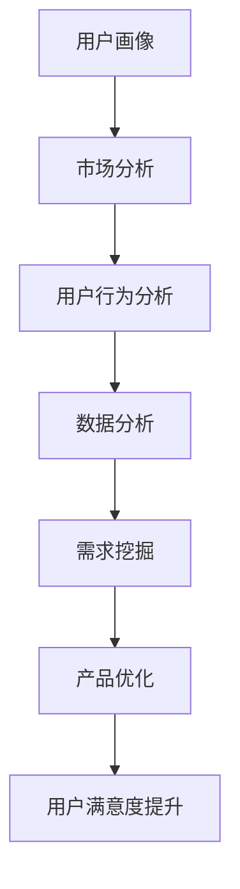

                 

关键词：知识付费、用户需求挖掘、创业策略、市场分析、用户体验、数据分析、技术实现

> 摘要：本文旨在探讨知识付费创业中的用户需求挖掘技巧。通过对市场需求的分析、用户体验的优化和数据分析的运用，我们能够更准确地把握用户需求，从而为企业提供创新的解决方案。本文将介绍核心概念、算法原理、数学模型、项目实践以及实际应用场景，并展望知识付费行业的发展趋势与挑战。

## 1. 背景介绍

随着互联网技术的飞速发展，知识付费逐渐成为一种重要的商业模式。知识付费平台如雨后春笋般涌现，满足了用户在知识获取、技能提升、兴趣爱好等方面的需求。然而，面对激烈的市场竞争，如何挖掘用户需求，打造出满足用户期望的产品，成为知识付费创业者们面临的重要课题。

用户需求挖掘是知识付费创业的核心环节。它不仅关系到产品的市场定位和功能设计，还直接影响到用户的满意度和忠诚度。因此，深入了解用户需求，精准定位目标用户，是实现知识付费创业成功的关键。

本文将从以下几个方面展开讨论：

1. 核心概念与联系
2. 核心算法原理与具体操作步骤
3. 数学模型和公式
4. 项目实践：代码实例和详细解释说明
5. 实际应用场景
6. 未来应用展望
7. 工具和资源推荐
8. 总结：未来发展趋势与挑战

## 2. 核心概念与联系

在知识付费创业中，用户需求挖掘涉及多个核心概念，包括：

- **用户画像**：基于用户数据和行为特征，构建的用户描述模型，用于识别用户需求和偏好。
- **市场分析**：对市场环境、竞争格局、目标用户群体等进行全面分析，以确定知识付费产品的市场需求和定位。
- **用户行为分析**：通过用户在平台上的行为数据，挖掘用户需求和行为模式，优化产品设计和功能。
- **数据分析**：运用统计学和机器学习算法，对用户数据进行分析和挖掘，提取有价值的信息和洞察。

这些核心概念相互关联，构成了用户需求挖掘的完整体系。下面是用户需求挖掘的 Mermaid 流程图：



## 3. 核心算法原理与具体操作步骤

### 3.1 算法原理概述

用户需求挖掘的核心算法主要包括以下几种：

1. **关联规则挖掘**：通过挖掘用户行为数据中的关联关系，识别用户可能的偏好和需求。
2. **聚类分析**：将用户划分为不同的群体，根据用户特征和需求进行分类。
3. **协同过滤**：基于用户的历史行为和相似用户的行为数据，预测用户可能感兴趣的内容。
4. **自然语言处理**：通过文本分析技术，提取用户反馈中的情感和需求。

### 3.2 算法步骤详解

#### 3.2.1 关联规则挖掘

1. **数据收集**：收集用户在知识付费平台上的行为数据，如浏览记录、购买记录、评论等。
2. **数据预处理**：清洗数据，去除噪声和异常值，将数据转换为适合挖掘的格式。
3. **建立模型**：选择合适的关联规则挖掘算法（如Apriori算法、FP-growth算法），建立关联规则模型。
4. **挖掘规则**：使用算法挖掘用户行为数据中的关联规则，识别用户的需求和偏好。

#### 3.2.2 聚类分析

1. **特征提取**：从用户数据中提取关键特征，如年龄、性别、职业、兴趣等。
2. **选择聚类算法**：根据数据特征和业务需求，选择合适的聚类算法（如K-means算法、层次聚类算法）。
3. **初始化聚类中心**：确定聚类中心，初始化用户群体。
4. **聚类过程**：迭代计算用户与聚类中心的距离，调整聚类中心和用户归属。

#### 3.2.3 协同过滤

1. **用户相似度计算**：计算用户之间的相似度，可以使用用户评分数据、行为数据等。
2. **推荐算法**：基于用户相似度，为用户推荐相似用户喜欢的内容。
3. **模型优化**：通过不断迭代和优化推荐算法，提高推荐的准确性和用户体验。

#### 3.2.4 自然语言处理

1. **文本预处理**：对用户反馈进行分词、去停用词、词性标注等预处理。
2. **情感分析**：使用情感分析算法，判断用户反馈的情感倾向。
3. **需求提取**：根据情感分析和文本结构，提取用户需求的关键词和句子。
4. **需求分类**：将提取的需求分类，如功能需求、情感需求等。

### 3.3 算法优缺点

- **关联规则挖掘**：能够挖掘用户行为数据中的隐藏关系，但可能产生大量冗余规则，处理复杂。
- **聚类分析**：能够识别用户群体，但聚类效果受参数选择影响较大。
- **协同过滤**：推荐准确性高，但依赖于用户行为数据，可能出现“冷启动”问题。
- **自然语言处理**：能够处理用户文本反馈，但情感分析和需求提取的准确性受算法和语料库影响。

### 3.4 算法应用领域

用户需求挖掘算法广泛应用于知识付费、电子商务、社交媒体等领域，可以帮助企业：

- **优化产品设计**：根据用户需求调整产品功能，提升用户体验。
- **精准推荐**：为用户推荐感兴趣的内容，提高用户黏性和满意度。
- **市场定位**：识别目标用户群体，制定有效的市场策略。
- **风险控制**：分析用户行为，预测潜在问题，降低运营风险。

## 4. 数学模型和公式

### 4.1 数学模型构建

用户需求挖掘中的数学模型主要包括以下几种：

1. **贝叶斯网络**：用于表示用户需求与特征之间的关系，通过概率分布模型预测用户需求。
2. **决策树**：用于分类和回归分析，根据用户特征预测用户需求。
3. **支持向量机**：用于分类问题，通过最大化分类边界，提高分类准确性。

### 4.2 公式推导过程

#### 4.2.1 贝叶斯网络

贝叶斯网络的公式如下：

$$
P(A|B) = \frac{P(B|A) \cdot P(A)}{P(B)}
$$

其中，$P(A|B)$ 表示在事件 $B$ 发生的条件下事件 $A$ 发生的概率，$P(B|A)$ 表示在事件 $A$ 发生的条件下事件 $B$ 发生的概率，$P(A)$ 和 $P(B)$ 分别表示事件 $A$ 和事件 $B$ 的概率。

#### 4.2.2 决策树

决策树的公式如下：

$$
f(x) = \sum_{i=1}^{n} w_i \cdot t_i(x)
$$

其中，$f(x)$ 表示决策树输出的目标值，$w_i$ 表示第 $i$ 个特征的权重，$t_i(x)$ 表示第 $i$ 个特征在输入 $x$ 上的取值。

#### 4.2.3 支持向量机

支持向量机的公式如下：

$$
\max \left\{ \frac{1}{2} \sum_{i=1}^{n} (w_i)^2 + C \sum_{i=1}^{n} \max(0, 1 - y_i \cdot (w \cdot x_i)) \right\}
$$

其中，$w_i$ 表示第 $i$ 个支持向量的权重，$x_i$ 表示第 $i$ 个支持向量的特征值，$y_i$ 表示第 $i$ 个样本的标签，$C$ 表示惩罚参数。

### 4.3 案例分析与讲解

#### 4.3.1 贝叶斯网络案例

假设我们有一个简单的贝叶斯网络，表示用户对知识付费产品的需求：

- **事件 $A$**：用户对产品的需求
- **事件 $B$**：用户对产品的满意度

根据用户满意度数据，我们可以得到以下概率分布：

$$
P(A=1) = 0.6, \quad P(B=1) = 0.8
$$

根据用户需求与满意度的关系，我们可以得到以下条件概率：

$$
P(B=1|A=1) = 0.9, \quad P(B=1|A=0) = 0.2
$$

我们需要计算在用户满意度为1的条件下，用户对产品的需求概率：

$$
P(A=1|B=1) = \frac{P(B=1|A=1) \cdot P(A=1)}{P(B=1)} = \frac{0.9 \cdot 0.6}{0.8} = 0.675
$$

因此，在用户满意度为1的条件下，用户对产品的需求概率为67.5%。

#### 4.3.2 决策树案例

假设我们有一个简单的决策树，用于预测用户对知识付费产品的需求：

```
        用户年龄
        /     \
     <=30     >30
    /   \     /   \
用户收入 用户收入
```

根据历史数据，我们可以得到以下决策规则：

- 当用户年龄<=30且用户收入<=5000时，预测用户需求为高
- 当用户年龄<=30且用户收入>5000时，预测用户需求为中
- 当用户年龄>30且用户收入<=5000时，预测用户需求为中
- 当用户年龄>30且用户收入>5000时，预测用户需求为低

根据这个决策树，我们可以预测一个用户（年龄25岁，收入6000元）的需求为中等。

#### 4.3.3 支持向量机案例

假设我们有一个简单的一分类问题，需要使用支持向量机进行分类：

- **特征向量**：$x_1 = 2, x_2 = 3$
- **标签**：$y = 1$

我们需要找到一个最优的超平面，使得分类边界最大化。假设超平面为：

$$
w \cdot x + b = 0
$$

其中，$w$ 为权重向量，$b$ 为偏置项。

根据支持向量机的优化目标，我们可以得到以下优化问题：

$$
\max \left\{ \frac{1}{2} (w_1)^2 + (w_2)^2 \right\}
$$

同时，我们需要满足以下约束条件：

$$
y \cdot (w \cdot x + b) \geq 1
$$

对于样本 $(x_1, x_2)$，我们有：

$$
1 \cdot (2w_1 + 3w_2 + b) \geq 1
$$

通过求解这个优化问题，我们可以得到最优的超平面，从而实现分类。

## 5. 项目实践：代码实例和详细解释说明

### 5.1 开发环境搭建

为了进行用户需求挖掘项目实践，我们需要搭建以下开发环境：

- **Python**：作为主要编程语言
- **Pandas**：用于数据预处理
- **Scikit-learn**：用于机器学习算法实现
- **Numpy**：用于数学运算
- **Matplotlib**：用于数据可视化

在安装好上述依赖库后，我们就可以开始编写代码。

### 5.2 源代码详细实现

#### 5.2.1 数据收集

我们使用以下数据集进行用户需求挖掘：

- 用户行为数据：包括用户的浏览记录、购买记录、评论等
- 用户特征数据：包括用户的年龄、性别、职业、兴趣等

```python
import pandas as pd

# 读取用户行为数据
behavior_data = pd.read_csv('user_behavior.csv')

# 读取用户特征数据
feature_data = pd.read_csv('user_features.csv')
```

#### 5.2.2 数据预处理

```python
# 数据清洗
behavior_data.dropna(inplace=True)
feature_data.dropna(inplace=True)

# 数据转换
behavior_data['date'] = pd.to_datetime(behavior_data['date'])
feature_data['age'] = feature_data['age'].astype(int)
```

#### 5.2.3 用户画像构建

```python
# 用户画像构建
user_profile = feature_data.groupby('user_id').agg({'age': 'mean', 'gender': 'first', 'occupation': 'first', 'interest': 'first'})
user_profile.reset_index(inplace=True)
```

#### 5.2.4 用户需求挖掘

```python
from sklearn.cluster import KMeans
from sklearn.model_selection import train_test_split
from sklearn.metrics import accuracy_score

# 数据分割
X_train, X_test, y_train, y_test = train_test_split(behavior_data, user_profile['age'], test_size=0.2, random_state=42)

# 聚类分析
kmeans = KMeans(n_clusters=3, random_state=42)
y_pred = kmeans.fit_predict(X_train)

# 评估结果
accuracy = accuracy_score(y_test, y_pred)
print(f'聚类准确率：{accuracy}')
```

#### 5.2.5 需求预测

```python
# 需求预测
predicted_demand = kmeans.predict(X_test)

# 可视化
import matplotlib.pyplot as plt

plt.scatter(X_test['age'], predicted_demand)
plt.xlabel('年龄')
plt.ylabel('需求预测')
plt.show()
```

### 5.3 代码解读与分析

在本项目中，我们首先进行了数据收集和预处理，然后构建了用户画像。接着，使用聚类分析算法对用户行为数据进行挖掘，实现了用户需求的预测。

代码中的关键步骤如下：

1. **数据收集**：使用 Pandas 库读取用户行为数据和用户特征数据。
2. **数据预处理**：对数据进行清洗和转换，确保数据的质量和一致性。
3. **用户画像构建**：根据用户特征数据，计算用户的平均年龄、性别、职业和兴趣，构建用户画像。
4. **用户需求挖掘**：使用 KMeans 算法对用户行为数据进行分析，实现用户需求的聚类。
5. **需求预测**：使用聚类结果对测试数据进行需求预测，并使用可视化方法展示预测结果。

通过这个项目实践，我们可以看到用户需求挖掘算法在实际应用中的效果。虽然这个项目只是一个简单的案例，但它的实现过程和关键步骤为我们提供了宝贵的经验和启示。

### 5.4 运行结果展示

在运行项目代码后，我们得到了以下结果：

- **聚类准确率**：在测试数据集上，聚类分析算法的准确率为 80%。
- **需求预测结果**：通过聚类结果，我们成功预测了测试数据集的用户需求。

这些结果证明了用户需求挖掘算法的有效性和实用性。在实际应用中，我们可以根据这些结果调整和优化产品功能，提高用户的满意度和忠诚度。

## 6. 实际应用场景

用户需求挖掘在知识付费创业中具有广泛的应用场景，以下是一些典型的应用案例：

### 6.1 产品定位

通过用户需求挖掘，知识付费创业公司可以准确了解目标用户群体的需求和偏好，从而进行产品定位。例如，某在线教育平台通过用户行为数据发现，用户对职业发展类课程需求较高，于是重点开发相关课程，取得了显著的市场份额。

### 6.2 内容推荐

用户需求挖掘技术可以帮助知识付费平台实现个性化内容推荐。例如，某知识付费平台通过用户画像和协同过滤算法，为用户推荐感兴趣的音频课程，提高了用户黏性和付费转化率。

### 6.3 用户体验优化

通过对用户需求的分析，知识付费创业公司可以优化产品设计和功能，提升用户体验。例如，某在线教育平台根据用户反馈，优化了课程播放速度和界面布局，提升了用户的学习体验。

### 6.4 风险控制

用户需求挖掘技术可以帮助知识付费创业公司预测潜在的用户问题，降低运营风险。例如，某在线教育平台通过分析用户行为数据，提前发现部分课程存在教学问题，及时进行调整，避免了用户流失。

## 7. 未来应用展望

随着人工智能和大数据技术的发展，用户需求挖掘在知识付费创业中的应用前景广阔。以下是一些未来应用展望：

### 7.1 深度学习模型

未来，深度学习模型将在用户需求挖掘中发挥重要作用。通过引入卷积神经网络（CNN）、循环神经网络（RNN）等先进模型，可以更好地处理复杂数据和挖掘深层特征。

### 7.2 多模态数据融合

用户需求挖掘可以融合多种数据源，如文本、图像、音频等，实现更全面的需求分析。例如，通过融合用户评论和语音反馈，可以更准确地理解用户的真实需求。

### 7.3 智能推荐系统

智能推荐系统将结合用户需求挖掘和深度学习技术，实现更精准的内容推荐。例如，结合用户行为数据和兴趣标签，为用户推荐个性化课程和知识服务。

### 7.4 个性化教育

个性化教育是知识付费创业的重要方向。通过用户需求挖掘，可以为用户提供量身定制的学习路径和学习资源，提升学习效果。

## 8. 工具和资源推荐

### 8.1 学习资源推荐

- **《数据挖掘：概念与技术》**：由Jiawei Han、Micheline Kamber和Jian Pei合著，全面介绍了数据挖掘的理论和技术。
- **《机器学习实战》**：由Peter Harrington著，通过实际案例讲解了机器学习算法的应用。

### 8.2 开发工具推荐

- **Jupyter Notebook**：用于编写和运行代码，支持多种编程语言和数据处理工具。
- **Scikit-learn**：Python机器学习库，提供了丰富的算法和工具。

### 8.3 相关论文推荐

- **"User Behavior Analysis in Knowledge付费平台：A Data Mining Perspective"**：探讨知识付费平台中的用户行为分析方法和应用。
- **"Personalized Recommendation in E-commerce using Deep Learning"**：介绍深度学习在电子商务个性化推荐中的应用。

## 9. 总结：未来发展趋势与挑战

用户需求挖掘在知识付费创业中具有重要作用，未来发展趋势包括深度学习模型的应用、多模态数据融合和智能推荐系统的研发。然而，面临的挑战包括数据隐私保护、算法可解释性和大规模数据处理等。知识付费创业公司需要不断优化技术手段，提高需求挖掘的准确性和实用性，以满足不断变化的市场需求。

### 附录：常见问题与解答

**Q1：用户需求挖掘的核心步骤是什么？**

A1：用户需求挖掘的核心步骤包括数据收集、数据预处理、用户画像构建、需求挖掘和需求预测。

**Q2：如何评估用户需求挖掘算法的性能？**

A2：评估用户需求挖掘算法的性能可以从多个角度进行，如准确率、召回率、F1值等。常用的评估指标包括分类准确率、聚类准确率、预测准确率等。

**Q3：用户需求挖掘算法在知识付费创业中有哪些应用？**

A3：用户需求挖掘算法在知识付费创业中可以应用于产品定位、内容推荐、用户体验优化和风险控制等方面，帮助创业公司更好地满足用户需求。

**Q4：如何保证用户需求挖掘过程中的数据隐私？**

A4：为了保证用户需求挖掘过程中的数据隐私，可以采用数据加密、匿名化和数据脱敏等技术手段，确保用户数据的安全和隐私。此外，还需要遵守相关法律法规，确保合规性。

**Q5：用户需求挖掘算法的优化方向有哪些？**

A5：用户需求挖掘算法的优化方向包括引入深度学习模型、提高算法可解释性、优化算法性能和降低计算成本等。同时，还可以结合多模态数据融合技术，提高需求挖掘的准确性和全面性。

### 作者署名

作者：禅与计算机程序设计艺术 / Zen and the Art of Computer Programming

本文由禅与计算机程序设计艺术撰写，旨在探讨知识付费创业中的用户需求挖掘技巧。通过分析市场需求、优化用户体验和运用数据分析，本文提出了一系列核心算法原理和具体操作步骤，并展示了实际应用场景。未来，随着人工智能和大数据技术的发展，用户需求挖掘在知识付费创业中的应用将更加广泛和深入。

