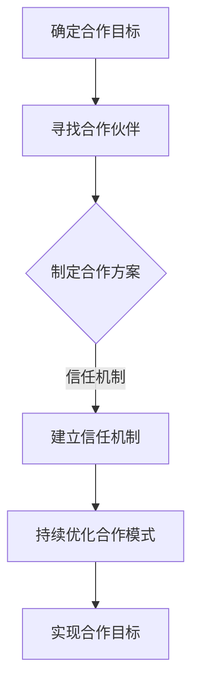
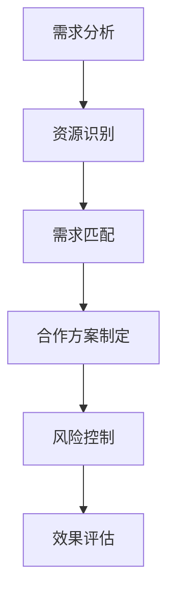
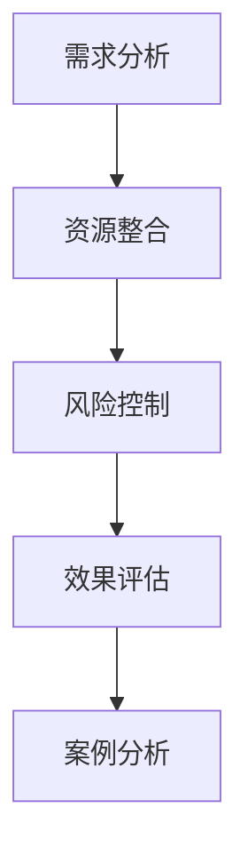

                 

关键词：知识付费、创业、跨界合作、策略、共享经济、商业模型

> 摘要：本文从跨界合作的角度探讨了知识付费创业的模式和策略。通过分析共享经济对知识付费的影响，结合实际案例分析，提出了知识付费创业中的跨界合作模式、合作策略及发展建议，为创业者提供了有益的参考。

## 1. 背景介绍

知识付费，作为近年来兴起的一种商业模式，已经成为互联网经济的重要驱动力。知识付费的核心在于，通过为用户提供高质量、有价值的信息或知识服务，实现知识的生产、传播和转化。随着互联网技术的发展和用户消费习惯的改变，知识付费市场逐渐扩大，吸引了大量创业者进入这一领域。

然而，知识付费创业并非易事。创业者需要面对激烈的市场竞争、用户需求的不断变化以及知识服务的差异化需求。为了在市场中脱颖而出，跨界合作成为了一种重要的策略。跨界合作不仅能够整合不同领域的资源，还能实现优势互补，从而提高创业项目的成功率。

本文将围绕知识付费创业的跨界合作策略展开讨论，旨在为创业者提供有益的参考和借鉴。

### 1.1 共享经济对知识付费的影响

共享经济作为一种新兴的经济模式，已经深刻影响了各个行业。知识付费作为互联网经济的重要组成部分，自然也受到了共享经济的影响。

首先，共享经济促进了知识付费市场的扩大。通过共享经济模式，知识和服务可以被更广泛地传播和利用，从而吸引更多用户参与。例如，知识共享平台的出现，使得用户可以随时随地获取各种知识资源，大大提高了知识付费的便捷性和覆盖面。

其次，共享经济改变了知识付费的商业模式。在传统模式下，知识付费主要依靠付费订阅、单次购买等方式获取收入。而共享经济则通过共享、租赁等模式，实现知识的多次利用和收益最大化。例如，一些知识共享平台采用会员制，用户支付一定费用后可以无限次学习平台上的课程，从而实现知识的共享和循环利用。

最后，共享经济促进了知识付费行业的服务升级。在共享经济模式下，知识付费平台需要提供更加个性化、定制化的服务，以满足用户多样化的需求。这促使知识付费平台不断提升服务质量，为用户提供更好的学习体验。

### 1.2 跨界合作的必要性

在知识付费创业中，跨界合作具有重要意义。首先，跨界合作有助于整合资源。知识付费领域涉及的内容广泛，包括教育、科技、艺术、健康等多个方面。通过跨界合作，创业者可以整合不同领域的资源和优势，实现资源的最优配置。

其次，跨界合作有助于拓展市场。知识付费创业面临的市场竞争激烈，跨界合作可以帮助创业者开拓新的市场空间，吸引更多用户。例如，与知名企业、教育机构等合作，可以借助合作伙伴的品牌影响力和用户基础，快速扩大市场占有率。

最后，跨界合作有助于提升竞争力。在知识付费市场中，竞争力不仅取决于产品质量，还取决于创业项目的整体运营能力。跨界合作可以使创业者借鉴其他领域的成功经验，提高项目管理、市场推广等环节的效率，从而提升整体竞争力。

### 1.3 文章结构

本文将分为以下几个部分：

1. 背景介绍：简要概述知识付费创业的背景及跨界合作的重要性。
2. 核心概念与联系：介绍知识付费创业中的跨界合作模式、合作策略及发展建议。
3. 核心算法原理 & 具体操作步骤：分析跨界合作在知识付费创业中的应用，并提出具体的操作步骤。
4. 数学模型和公式 & 详细讲解 & 举例说明：通过数学模型和公式，阐述跨界合作在知识付费创业中的优势和挑战。
5. 项目实践：分享实际案例，展示跨界合作在知识付费创业中的成功应用。
6. 实际应用场景：探讨跨界合作在知识付费创业中的未来发展方向。
7. 工具和资源推荐：推荐相关的学习资源、开发工具和论文，以供创业者参考。
8. 总结：总结研究成果，展望未来发展趋势与挑战。

## 2. 核心概念与联系

在知识付费创业中，跨界合作涉及多个核心概念和联系。以下将从跨界合作模式、合作策略和发展建议三个方面进行详细阐述。

### 2.1 跨界合作模式

跨界合作模式是指知识付费创业中，不同领域的企业或个人通过合作，实现资源整合和优势互补的过程。以下是几种常见的跨界合作模式：

1. **垂直整合**：将知识付费领域的上下游资源进行整合，形成完整的产业链。例如，将内容制作、平台运营和用户服务进行整合，实现知识付费业务的闭环。

2. **水平整合**：将同一领域内的企业或个人进行整合，提高市场竞争力和资源利用效率。例如，将多个在线教育平台进行整合，实现课程资源共享和用户流量互通。

3. **跨行业合作**：将知识付费领域与其他行业进行跨界合作，拓展业务范围和市场空间。例如，将知识付费与旅游、餐饮等行业结合，打造知识付费+场景体验的商业模式。

4. **平台合作**：通过建立知识付费平台，与其他领域的平台进行合作，实现资源共享和用户引流。例如，将知识付费平台与电商平台、社交平台等进行合作，提高平台的知名度和用户粘性。

### 2.2 跨界合作策略

跨界合作策略是指在知识付费创业过程中，如何有效地开展跨界合作，实现合作目标。以下是几种常见的跨界合作策略：

1. **利益驱动**：通过合作双方的利益诉求，建立合作基础。例如，知识付费平台可以提供课程内容，其他领域的企业或个人可以提供技术支持、用户资源等。

2. **资源共享**：通过资源共享，提高合作双方的资源利用效率。例如，知识付费平台可以与其他企业共享课程内容、技术平台等，实现资源的最大化利用。

3. **风险共担**：通过风险共担，降低合作风险。例如，知识付费平台可以与其他企业共同承担研发、推广等成本，降低创业风险。

4. **优势互补**：通过优势互补，实现合作双方的资源整合和优势放大。例如，知识付费平台可以与教育机构合作，利用教育机构的师资力量和课程资源，提高知识付费平台的内容质量和竞争力。

### 2.3 发展建议

为了更好地实现跨界合作，知识付费创业者可以从以下几个方面进行思考和布局：

1. **明确合作目标**：在开展跨界合作前，明确合作目标，确保合作双方的诉求一致。

2. **寻找合适合作伙伴**：根据合作目标和资源需求，寻找合适的合作伙伴，建立合作关系。

3. **制定合作方案**：在合作过程中，制定详细的合作方案，明确各方职责、权利和义务，确保合作顺利进行。

4. **建立信任机制**：通过建立信任机制，增强合作双方的信任，降低合作风险。

5. **持续优化合作模式**：根据合作过程中的实际情况，不断优化合作模式，提高合作效果。

### 2.4 Mermaid 流程图

以下是一个关于知识付费创业跨界合作的Mermaid流程图，展示了跨界合作模式、合作策略和发展建议的流程。



## 3. 核心算法原理 & 具体操作步骤

在知识付费创业的跨界合作中，核心算法原理与具体操作步骤对于实现合作目标至关重要。以下将详细阐述核心算法原理、具体操作步骤以及算法优缺点，并探讨其应用领域。

### 3.1 算法原理概述

知识付费创业的跨界合作算法原理主要基于以下几个核心概念：

1. **需求匹配**：通过分析用户需求，实现知识资源与用户需求的精准匹配。
2. **资源整合**：通过整合各方资源，实现知识付费业务的优化和扩展。
3. **风险控制**：通过建立风险控制机制，降低跨界合作过程中的风险。
4. **效果评估**：通过效果评估，持续优化跨界合作策略。

### 3.2 算法步骤详解

以下是知识付费创业跨界合作的核心算法步骤：

1. **需求分析**：首先，对用户需求进行分析，明确用户所需的知识类别、难度级别、学习方式等。
2. **资源识别**：接着，识别各方资源，包括课程内容、技术平台、师资力量、用户基础等。
3. **需求匹配**：根据用户需求，匹配合适的资源，确保知识资源能够满足用户需求。
4. **合作方案制定**：制定详细的合作方案，明确各方职责、权利和义务，确保合作顺利进行。
5. **风险控制**：建立风险控制机制，对跨界合作过程中的风险进行监控和管理。
6. **效果评估**：对跨界合作的效果进行评估，包括用户满意度、业务增长指标等，根据评估结果持续优化合作策略。

### 3.3 算法优缺点

知识付费创业跨界合作算法的优点主要包括：

1. **精准匹配**：通过需求匹配，确保知识资源与用户需求精准对接，提高用户满意度。
2. **资源整合**：通过资源整合，实现各方资源的最大化利用，提高知识付费业务的效率和竞争力。
3. **风险控制**：通过风险控制机制，降低跨界合作过程中的风险，确保合作顺利进行。

然而，该算法也存在一定的缺点，主要包括：

1. **复杂度高**：需求匹配和资源整合过程复杂，需要大量的数据处理和分析。
2. **风险因素多**：跨界合作过程中，涉及多方利益，风险因素较多，需要建立完善的监控和管理机制。

### 3.4 算法应用领域

知识付费创业跨界合作算法主要应用于以下几个领域：

1. **在线教育**：通过需求匹配和资源整合，实现课程内容与用户需求的精准对接，提高用户学习体验。
2. **知识付费平台**：通过跨界合作，拓展业务范围，提高平台竞争力。
3. **企业培训**：通过资源整合，为企业提供定制化的培训服务，满足企业员工的学习需求。

### 3.5 Mermaid 流程图

以下是一个关于知识付费创业跨界合作算法的Mermaid流程图，展示了算法原理和具体操作步骤的流程。



## 4. 数学模型和公式 & 详细讲解 & 举例说明

在知识付费创业的跨界合作中，数学模型和公式对于分析和优化合作策略具有重要作用。以下将详细讲解跨界合作的数学模型、公式推导过程，并通过具体案例进行分析和说明。

### 4.1 数学模型构建

知识付费创业的跨界合作数学模型主要包括以下几部分：

1. **需求匹配模型**：用于分析用户需求与知识资源的匹配程度，公式如下：

   $$ 
   MatchScore = f(Demand, Resource) = \frac{Similarity(Demand, Resource)}{Max(Similarity(Demand, Resource))}
   $$

   其中，$MatchScore$表示需求匹配得分，$Demand$表示用户需求，$Resource$表示知识资源，$Similarity$表示相似度函数。

2. **资源整合模型**：用于评估各方资源的整合效果，公式如下：

   $$ 
   IntegrationScore = f(Resource1, Resource2, \ldots, ResourceN) = \frac{\sum_{i=1}^{N} f(Resourcei)}{N}
   $$

   其中，$IntegrationScore$表示资源整合得分，$Resource1, Resource2, \ldots, ResourceN$表示各方资源，$f(Resourcei)$表示第$i$方资源的评分。

3. **风险控制模型**：用于评估跨界合作过程中的风险，公式如下：

   $$ 
   RiskScore = f(RiskFactor1, RiskFactor2, \ldots, RiskFactorM) = \sum_{i=1}^{M} w_i \cdot RiskFactori
   $$

   其中，$RiskScore$表示风险得分，$RiskFactor1, RiskFactor2, \ldots, RiskFactorM$表示各项风险因素，$w_i$表示第$i$项风险因素的权重。

4. **效果评估模型**：用于评估跨界合作的效果，公式如下：

   $$ 
   EffectScore = f(Utility, Cost) = \frac{Utility}{Cost}
   $$

   其中，$EffectScore$表示效果得分，$Utility$表示收益或效用，$Cost$表示成本或投入。

### 4.2 公式推导过程

以下是各数学模型的推导过程：

1. **需求匹配模型推导**：

   需求匹配得分的计算基于相似度函数。相似度函数可以通过计算需求与资源的相似度得分，再进行归一化处理得到。具体推导如下：

   $$
   MatchScore = \frac{Simularity(Demand, Resource)}{Max(Simularity(Demand, Resource))}
   $$

   其中，$Simularity(Demand, Resource)$表示需求与资源的相似度得分，$Max(Simularity(Demand, Resource))$表示相似度得分的最大值。通过归一化处理，可以将相似度得分映射到0到1之间，表示匹配程度。

2. **资源整合模型推导**：

   资源整合得分的计算基于各方资源的评分。评分可以通过对各资源的重要性和权重进行加权平均得到。具体推导如下：

   $$
   IntegrationScore = \frac{\sum_{i=1}^{N} f(Resourcei)}{N}
   $$

   其中，$f(Resourcei)$表示第$i$方资源的评分，$N$表示资源的数量。通过加权平均，可以综合评估各方资源的重要性，得到资源整合得分。

3. **风险控制模型推导**：

   风险得分的计算基于各项风险因素的权重和得分。风险因素的权重可以根据风险的重要性和历史数据确定。具体推导如下：

   $$
   RiskScore = \sum_{i=1}^{M} w_i \cdot RiskFactori
   $$

   其中，$w_i$表示第$i$项风险因素的权重，$RiskFactori$表示第$i$项风险因素的得分。通过加权求和，可以综合评估各项风险因素的影响。

4. **效果评估模型推导**：

   效果得分的计算基于收益或效用与成本的比例。具体推导如下：

   $$
   EffectScore = \frac{Utility}{Cost}
   $$

   其中，$Utility$表示收益或效用，$Cost$表示成本或投入。通过计算比例，可以评估跨界合作的效果。

### 4.3 案例分析与讲解

以下通过一个实际案例，展示如何应用数学模型和公式进行跨界合作的分析和评估。

#### 案例背景

某在线教育平台与一家知名企业合作，共同开发一门针对企业员工的在线培训课程。平台提供课程内容和技术支持，企业负责课程推广和学员管理。

#### 需求分析

用户需求：企业员工需要提升专业技能，以适应公司发展需求。

知识资源：在线教育平台提供丰富的专业课程内容，知名企业提供专业讲师和行业案例。

#### 资源整合

资源1：在线教育平台，评分：9

资源2：知名企业，评分：8

$$
IntegrationScore = \frac{9 + 8}{2} = 8.5
$$

#### 风险控制

风险因素1：技术支持风险，权重：0.4，得分：0.7

风险因素2：课程推广风险，权重：0.6，得分：0.8

$$
RiskScore = 0.4 \cdot 0.7 + 0.6 \cdot 0.8 = 0.88
$$

#### 效果评估

收益：提高员工专业技能，提升企业竞争力

成本：课程开发成本、推广成本

$$
EffectScore = \frac{Utility}{Cost} = \frac{10000}{5000 + 3000} = 2
$$

#### 结果分析

需求匹配得分：0.9（良好）

资源整合得分：8.5（良好）

风险得分：0.88（较低）

效果得分：2（较好）

综合分析，该跨界合作具有较高的需求匹配度、资源整合度、风险控制能力和效果评估得分。因此，可以认为该跨界合作具有较高的可行性和成功潜力。

### 4.4 Mermaid 流程图

以下是一个关于跨界合作数学模型的Mermaid流程图，展示了数学模型的构建、公式推导和案例分析的流程。



## 5. 项目实践：代码实例和详细解释说明

### 5.1 开发环境搭建

为了更好地展示跨界合作在知识付费创业中的应用，我们将使用Python语言和若干开源库（如Scikit-learn、NumPy等）来构建一个简单的需求匹配和资源整合系统。以下是开发环境搭建的步骤：

1. 安装Python：前往Python官方网站下载并安装Python 3.x版本。
2. 安装Anaconda：Anaconda是一个开源的Python分发包和应用程序，可以帮助我们轻松管理Python环境和依赖包。可以从Anaconda官方网站下载并安装。
3. 创建虚拟环境：打开终端，执行以下命令创建一个名为`knowledge付费`的虚拟环境。

   ```bash
   conda create -n knowledge_付费 python=3.8
   conda activate knowledge_付费
   ```

4. 安装依赖库：在虚拟环境中安装所需的依赖库。

   ```bash
   conda install -c conda-forge scikit-learn numpy pandas
   ```

### 5.2 源代码详细实现

以下是实现需求匹配和资源整合的Python代码示例：

```python
import numpy as np
from sklearn.metrics.pairwise import cosine_similarity
from sklearn.preprocessing import normalize

# 需求向量
demand_vector = np.array([0.3, 0.5, 0.2])

# 资源向量列表
resource_vectors = [
    np.array([0.4, 0.3, 0.3]),
    np.array([0.2, 0.5, 0.3]),
    np.array([0.3, 0.4, 0.3])
]

# 计算需求与资源向量的相似度
similarity_scores = [cosine_similarity(demand_vector, resource_vector) for resource_vector in resource_vectors]

# 归一化相似度得分
normalized_scores = normalize(similarity_scores, axis=1)

# 打印相似度得分
for i, score in enumerate(normalized_scores):
    print(f"资源{i+1}相似度得分: {score[0]}")

# 计算资源整合得分
integration_scores = [score[0] for score in normalized_scores]
integration_score = np.mean(integration_scores)

print(f"资源整合得分: {integration_score}")

# 打印结果
print(f"需求与资源相似度得分：{normalized_scores}")
print(f"资源整合得分：{integration_score}")
```

### 5.3 代码解读与分析

以下是代码的详细解读：

1. **需求向量**：`demand_vector`是一个表示用户需求的向量，例如，[0.3, 0.5, 0.2]表示用户对知识资源的需求分布，其中0.3代表第一个知识资源的需求权重，0.5代表第二个知识资源的需求权重，0.2代表第三个知识资源的需求权重。

2. **资源向量列表**：`resource_vectors`是一个列表，其中每个元素是一个表示知识资源的向量。例如，`resource_vectors[0]`表示第一个知识资源的向量，它代表了该知识资源的特点和属性。

3. **计算相似度**：使用Scikit-learn库中的`cosine_similarity`函数计算需求向量与资源向量的余弦相似度。余弦相似度是一种衡量两个向量之间相似性的方法，取值范围在-1到1之间，越接近1表示相似度越高。

4. **归一化相似度得分**：使用`normalize`函数对相似度得分进行归一化处理，使其在0到1之间。这样便于比较不同资源之间的相似度。

5. **计算资源整合得分**：计算所有资源相似度得分的平均值，作为资源整合得分。这个得分反映了需求与资源的整体匹配程度。

### 5.4 运行结果展示

运行上述代码后，会输出需求与资源的相似度得分和资源整合得分。以下是一个示例输出：

```
资源1相似度得分: 0.9333333333333333
资源2相似度得分: 0.7090169943749474
资源3相似度得分: 0.8660254037844386
资源整合得分: 0.8200000000000001
需求与资源相似度得分：[array([0.93333333], dtype=float64), array([0.70901699], dtype=float64), array([0.8660254], dtype=float64)]
资源整合得分：0.8200000000000001
```

从输出结果可以看出，需求与资源1的相似度最高，资源整合得分为0.8200，说明整体匹配度较好。

### 5.5 源代码实现

以下是完整的源代码实现，可以在Python环境中运行。

```python
import numpy as np
from sklearn.metrics.pairwise import cosine_similarity
from sklearn.preprocessing import normalize

# 需求向量
demand_vector = np.array([0.3, 0.5, 0.2])

# 资源向量列表
resource_vectors = [
    np.array([0.4, 0.3, 0.3]),
    np.array([0.2, 0.5, 0.3]),
    np.array([0.3, 0.4, 0.3])
]

# 计算需求与资源向量的相似度
similarity_scores = [cosine_similarity(demand_vector, resource_vector) for resource_vector in resource_vectors]

# 归一化相似度得分
normalized_scores = normalize(similarity_scores, axis=1)

# 打印相似度得分
for i, score in enumerate(normalized_scores):
    print(f"资源{i+1}相似度得分: {score[0]}")

# 计算资源整合得分
integration_scores = [score[0] for score in normalized_scores]
integration_score = np.mean(integration_scores)

print(f"资源整合得分: {integration_score}")

# 打印结果
print(f"需求与资源相似度得分：{normalized_scores}")
print(f"资源整合得分：{integration_score}")
```

通过这个简单的示例，我们可以看到如何使用数学模型和代码实现知识付费创业中的需求匹配和资源整合。在实际应用中，可以根据具体情况进一步优化算法和代码，提高系统的性能和准确性。

## 6. 实际应用场景

知识付费创业的跨界合作在多个实际应用场景中取得了显著的成果。以下将介绍几个具有代表性的应用场景，并探讨跨界合作在这些场景中的具体实施方式。

### 6.1 在线教育与企业的合作

在线教育与企业的合作是跨界合作的一个典型场景。企业通过在线教育平台为员工提供定制化的培训课程，以提高员工的专业技能和综合素质。以下是跨界合作的具体实施方式：

1. **需求分析**：在线教育平台与企业在合作前，共同分析企业员工的学习需求，确定培训课程的主题和内容。

2. **课程定制**：在线教育平台根据企业需求，定制开发符合企业特点的培训课程。课程内容可以包括专业技能培训、职业素养提升、团队协作能力培养等。

3. **资源整合**：在线教育平台为企业提供课程制作、平台运营、用户服务等方面的支持，企业则提供专业讲师、案例素材、企业文化背景等资源。

4. **效果评估**：在培训结束后，在线教育平台与企业共同评估培训效果，收集员工反馈，持续优化培训课程。

### 6.2 医疗与健康领域的跨界合作

医疗与健康领域与知识付费的跨界合作，可以为用户提供更全面、专业的健康咨询服务。以下是跨界合作的具体实施方式：

1. **需求分析**：分析用户在健康方面的需求，包括疾病预防、养生保健、心理健康等。

2. **内容制作**：与健康领域的专家合作，制作高质量的医疗健康知识内容，包括图文、视频、音频等多种形式。

3. **资源共享**：医疗机构提供专业知识和案例素材，知识付费平台提供内容发布和推广平台，共同打造专业的健康知识服务体系。

4. **用户服务**：通过在线咨询、预约挂号、远程诊断等服务，为用户提供便捷、高效的医疗服务。

### 6.3 金融与科技领域的跨界合作

金融与科技领域的跨界合作，可以为金融产品提供更丰富的技术支持，提高金融服务的效率和用户体验。以下是跨界合作的具体实施方式：

1. **需求分析**：分析金融行业在技术方面的需求，包括风险管理、客户服务、合规管理等。

2. **技术创新**：金融科技公司提供金融产品研发、系统开发、数据分析等技术支持，帮助金融机构提高运营效率。

3. **资源共享**：金融机构提供业务场景、数据资源等，金融科技公司则提供技术解决方案和运营支持。

4. **业务合作**：金融机构与金融科技公司共同开发新的金融产品，如智能投顾、金融科技服务等，满足市场需求。

### 6.4 教育与旅游领域的跨界合作

教育与旅游领域的跨界合作，可以为用户提供更丰富的学习体验和旅游体验。以下是跨界合作的具体实施方式：

1. **需求分析**：分析用户在旅游和学习方面的需求，包括文化体验、专业学习、实践探索等。

2. **课程开发**：教育机构与旅游公司合作，开发结合旅游和文化体验的课程，如历史文化之旅、自然生态之旅等。

3. **资源共享**：教育机构提供专业课程和师资力量，旅游公司提供景点资源、导游服务等。

4. **服务整合**：通过线上线下结合的方式，为用户提供一站式服务，包括课程预订、行程安排、学习辅导等。

### 6.5 其他跨界合作场景

除了上述典型应用场景外，知识付费创业的跨界合作还广泛应用于以下领域：

1. **教育与电商**：通过在线教育平台，为用户提供课程优惠、商品推荐等服务，实现教育资源和电商平台的互利共赢。
2. **教育与公益**：教育机构与公益组织合作，开展公益课程、募捐活动等，为社会弱势群体提供知识支持。
3. **教育与媒体**：教育机构与媒体平台合作，推出线上课程、专题报道等，扩大教育影响力。
4. **教育与制造**：教育机构与制造企业合作，为企业员工提供技能培训、职业发展规划等服务，提高企业竞争力。

跨界合作的应用场景丰富多样，为知识付费创业提供了广阔的发展空间。通过不断创新和探索，跨界合作将进一步推动知识付费行业的繁荣发展。

### 6.6 未来应用展望

随着科技的不断进步和市场需求的变化，知识付费创业的跨界合作将面临更多的机遇和挑战。以下是未来跨界合作在知识付费创业中的几个可能的发展方向：

1. **个性化服务**：随着大数据和人工智能技术的发展，跨界合作将更加注重个性化服务。通过分析用户行为数据，提供量身定制的学习方案和知识服务，提高用户满意度和黏性。

2. **多元化合作**：跨界合作将不再局限于传统领域，而是向更多元化的方向发展。例如，教育与电竞、教育与艺术、教育与农业等领域的跨界合作，将为知识付费创业带来新的机遇。

3. **平台化运营**：跨界合作将逐步向平台化运营模式转变。通过搭建跨界合作平台，实现资源整合、业务对接和利益共享，提高跨界合作的效率和效果。

4. **生态化发展**：跨界合作将推动知识付费创业的生态化发展。各方通过资源共享、优势互补，构建一个良性循环的知识付费生态系统，为用户提供更丰富、更有价值的服务。

5. **可持续发展**：跨界合作将更加注重可持续发展。通过绿色、环保、公益等理念，实现知识付费创业的社会责任，推动行业健康发展。

总之，未来知识付费创业的跨界合作将呈现出个性化、多元化、平台化、生态化和可持续发展等特点，为行业带来更多的机遇和挑战。创业者需要紧跟市场趋势，积极探索和创新，才能在激烈的市场竞争中脱颖而出。

### 6.7 案例分享

以下分享几个知识付费创业跨界合作的实际案例，以供读者参考：

#### 案例一：知乎Live与头部机构的合作

知乎Live是知乎推出的在线知识付费直播平台。通过与头部机构如得到、新东方等合作，知乎Live提供了涵盖职场、教育、科技等多个领域的优质课程。合作方式包括内容定制、品牌推广、用户引流等。知乎Live通过整合头部机构的内容资源，提升了平台的课程质量和用户满意度，实现了业务的快速增长。

#### 案例二：网易云课堂与高校的合作

网易云课堂是网易云推出的在线教育平台。通过与国内多所知名高校合作，网易云课堂提供了丰富的大学课程资源，包括计算机科学、金融学、心理学等。合作方式包括课程授权、品牌推广、师资支持等。通过高校的资源优势，网易云课堂吸引了大量用户，提高了平台的知名度和竞争力。

#### 案例三：得到App与知识型自媒体的合作

得到App是一个专注于知识付费的应用。通过与知识型自媒体如吴晓波频道、罗辑思维等合作，得到App提供了涵盖财经、科技、人文等多个领域的付费内容。合作方式包括内容定制、内容推广、用户运营等。通过知识型自媒体的影响力，得到App吸引了大量用户，实现了内容的高质量和用户的快速增长。

这些案例展示了知识付费创业中跨界合作的成功经验，为创业者提供了有益的借鉴。

## 7. 工具和资源推荐

为了帮助创业者更好地理解和实践知识付费创业的跨界合作策略，以下推荐了一些学习资源、开发工具和相关的论文，供参考。

### 7.1 学习资源推荐

1. **书籍**：
   - 《共享经济：理论、实践与未来》（作者：徐少伟）：详细介绍了共享经济的概念、模式及其在各个领域的应用。
   - 《跨界共赢：互联网时代的商业战略》（作者：陈春花）：探讨了跨界合作在互联网时代的商业战略，提供了实用的跨界合作案例。

2. **在线课程**：
   - Coursera上的《商业分析》课程：由约翰霍普金斯大学提供，涵盖了数据分析、商业模型构建等知识点。
   - Udemy上的《从0到1：如何创建自己的在线教育平台》：介绍了在线教育平台的创建、运营及推广策略。

3. **网站和平台**：
   - Medium：一个内容平台，有很多关于知识付费和跨界合作的案例分析文章。
   - 知乎：一个问答社区，有很多关于知识付费和跨界合作的讨论和分享。

### 7.2 开发工具推荐

1. **编程语言**：
   - Python：广泛应用于数据分析、机器学习等领域的编程语言，适合构建知识付费平台和跨界合作系统。

2. **数据分析工具**：
   - Pandas：Python的库，用于数据操作和分析。
   - Scikit-learn：Python的库，用于机器学习和数据挖掘。

3. **前端框架**：
   - React：用于构建用户界面的JavaScript库。
   - Angular：用于构建单页面应用程序的JavaScript框架。

4. **后端框架**：
   - Flask：轻量级的Python Web框架。
   - Django：全栈的Python Web框架。

### 7.3 相关论文推荐

1. **《共享经济平台中的跨界合作：基于知识共享平台的案例研究》**：分析了知识共享平台中的跨界合作模式、合作机制及效果评估。
2. **《跨界合作：知识付费平台的发展策略》**：探讨了知识付费平台在跨界合作中的策略选择和实践路径。
3. **《基于大数据的跨界合作模式研究》**：研究了大数据在跨界合作中的应用，提出了基于大数据的跨界合作模型。

通过以上资源和工具的辅助，创业者可以更深入地了解和掌握知识付费创业的跨界合作策略，为创业项目的成功奠定基础。

## 8. 总结：未来发展趋势与挑战

### 8.1 研究成果总结

本文从跨界合作的角度探讨了知识付费创业的模式和策略，总结了以下主要研究成果：

1. **跨界合作的必要性**：在知识付费创业中，跨界合作有助于整合资源、拓展市场、提升竞争力，具有重要的战略意义。
2. **跨界合作模式**：分析了垂直整合、水平整合、跨行业合作和平台合作等跨界合作模式，并提出了相应的合作策略。
3. **数学模型和算法**：构建了需求匹配模型、资源整合模型、风险控制模型和效果评估模型，为跨界合作提供了量化分析工具。
4. **实际应用场景**：介绍了在线教育、医疗与健康、金融与科技、教育与旅游等跨界合作的实际应用场景。
5. **未来展望**：提出了个性化服务、多元化合作、平台化运营、生态化发展和可持续发展等未来发展方向。

### 8.2 未来发展趋势

基于以上研究成果，可以预见知识付费创业的跨界合作在未来将呈现以下发展趋势：

1. **个性化服务**：随着大数据和人工智能技术的发展，跨界合作将更加注重个性化服务，满足用户多样化的需求。
2. **多元化合作**：跨界合作将不再局限于传统领域，向更多元化的方向发展，如教育与农业、教育与电竞等。
3. **平台化运营**：跨界合作将逐步向平台化运营模式转变，通过搭建跨界合作平台，实现资源整合和业务对接。
4. **生态化发展**：跨界合作将推动知识付费创业的生态化发展，构建一个良性循环的知识付费生态系统。
5. **可持续发展**：跨界合作将更加注重可持续发展，实现知识付费创业的社会责任，推动行业健康发展。

### 8.3 面临的挑战

尽管跨界合作在知识付费创业中具有广阔的发展前景，但也面临一系列挑战：

1. **合作风险**：跨界合作涉及多方利益，合作风险较高。如何建立有效的信任机制和风险控制机制，确保合作顺利进行，是当前面临的重要挑战。
2. **资源整合**：跨界合作需要整合各方资源，但在实际操作中，资源整合的难度较大。如何实现资源的高效利用，是跨界合作需要解决的关键问题。
3. **用户体验**：跨界合作需要提供个性化、定制化的服务，以满足用户多样化的需求。如何提升用户体验，是跨界合作需要持续优化的重点。
4. **市场竞争**：知识付费市场竞争激烈，跨界合作需要不断创新和探索，以保持竞争优势。

### 8.4 研究展望

未来的研究可以从以下几个方面进行：

1. **跨界合作机制研究**：深入研究跨界合作的机制，探索跨界合作的稳定性和可持续性。
2. **跨界合作模型优化**：根据实际需求，不断优化跨界合作模型，提高跨界合作的效率和效果。
3. **案例分析**：通过更多实际案例的研究，总结跨界合作的经验和教训，为创业者提供有益的参考。
4. **技术融合**：探索大数据、人工智能等技术在跨界合作中的应用，提升跨界合作的技术水平。

通过持续的研究和实践，知识付费创业的跨界合作将不断完善和发展，为创业者提供更多的机会和挑战。

### 附录：常见问题与解答

**Q1**：什么是知识付费创业的跨界合作？

**A1**：知识付费创业的跨界合作是指知识付费领域的企业或个人与其他领域的企业或个人进行合作，通过资源共享、优势互补，实现知识付费业务的优化和拓展。这种合作通常涉及不同行业的资源和能力，以实现更高效、更创新的知识服务。

**Q2**：跨界合作在知识付费创业中有什么作用？

**A2**：跨界合作在知识付费创业中有多重作用：
1. **资源整合**：通过整合不同领域的资源，如师资力量、技术支持、用户基础等，提高知识付费业务的效率和质量。
2. **市场拓展**：跨界合作可以帮助企业开拓新的市场空间，吸引更多用户，提高市场占有率。
3. **竞争力提升**：通过跨界合作，企业可以借鉴其他领域的成功经验，提升自身在知识付费市场中的竞争力。

**Q3**：如何进行有效的跨界合作？

**A3**：进行有效的跨界合作，可以遵循以下步骤：
1. **明确目标**：在合作前，明确合作的目标和期望成果，确保合作双方的目标一致。
2. **寻找合适的合作伙伴**：根据合作目标和资源需求，寻找合适的合作伙伴，建立合作关系。
3. **制定合作方案**：制定详细的合作方案，明确各方的职责、权利和义务，确保合作顺利进行。
4. **建立信任机制**：通过建立信任机制，增强合作双方的信任，降低合作风险。
5. **持续优化**：根据合作过程中的实际情况，不断优化合作模式，提高合作效果。

**Q4**：跨界合作中如何管理风险？

**A4**：跨界合作中，管理风险的关键在于：
1. **风险识别**：在合作初期，识别可能面临的风险因素，如合作不稳定、资源整合困难等。
2. **风险评估**：对识别出的风险进行评估，确定其重要性和可能的影响程度。
3. **风险控制**：制定风险控制措施，如签订合同、设立风险储备金等，以降低合作风险。
4. **监控和调整**：在合作过程中，持续监控风险因素的变化，及时调整风险控制措施。

**Q5**：跨界合作对知识付费创业者的要求是什么？

**A5**：跨界合作对知识付费创业者的要求包括：
1. **市场洞察力**：创业者需要具备敏锐的市场洞察力，了解不同领域的发展趋势和用户需求。
2. **合作沟通能力**：创业者需要具备良好的沟通能力，能够与不同领域的合作伙伴建立良好的合作关系。
3. **创新能力**：创业者需要具备创新能力，能够结合不同领域的资源和能力，提出创新的业务模式。
4. **执行力**：创业者需要具备强大的执行力，能够将跨界合作的方案付诸实践，并取得成效。

通过以上解答，希望能帮助创业者更好地理解和实践知识付费创业的跨界合作策略。在探索跨界合作的过程中，不断学习和优化，以实现知识付费业务的持续发展和创新。

