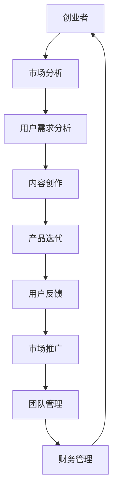

                 

关键词：知识付费、创业者、日常管理、时间管理、工作效率、资源整合

> 摘要：本文深入探讨了知识付费创业者的日常工作安排，通过分析核心角色职责、目标设定、时间管理、团队协作等关键环节，为创业者提供了系统化的工作流程优化策略，以提升工作效率和实现业务增长。

## 1. 背景介绍

在当今信息爆炸的时代，知识付费已经成为一种趋势。知识付费创业者通过为用户提供有价值的信息和知识服务，实现个人价值的最大化。这类创业者通常需要具备深厚的技术背景、敏锐的市场洞察力和出色的管理能力。然而，面对复杂多变的市场环境，如何高效地安排日常工作，成为创业者成功的关键因素之一。

本文旨在为知识付费创业者提供一套科学的日常工作安排方案，通过详细解读角色定位、目标设定、时间管理、团队协作等核心要素，帮助创业者实现个人与团队的协同发展。

### 1.1 知识付费的兴起

随着互联网的普及和信息技术的快速发展，知识付费作为一种新的商业模式逐渐兴起。知识付费不仅为创业者提供了丰富的创业机会，也为广大用户提供了获取高质量知识的途径。据统计，全球知识付费市场规模逐年增长，预计未来几年仍将保持较高的增长率。

### 1.2 创业者面临的挑战

知识付费创业者通常需要面对以下几个方面的挑战：

- **市场需求的不确定性**：创业者需要不断调整产品和服务策略，以适应市场的变化。
- **时间管理的挑战**：创业者需要在有限的时间内完成多种任务，包括内容创作、市场推广、团队管理等。
- **团队协作的困难**：构建和管理一个高效的团队是实现创业目标的关键，但团队协作中的沟通问题、协调难度等挑战不容忽视。

### 1.3 日常工作安排的重要性

科学的日常工作安排有助于提高工作效率，减少无效劳动，为创业者提供更多的自由时间和精力。通过合理安排日常工作，创业者可以更好地把握市场机会，提升竞争力，实现业务的可持续发展。

### 1.4 本文结构

本文将围绕以下结构展开讨论：

- **核心角色职责**：明确知识付费创业者的角色定位和职责。
- **目标设定**：阐述如何设定合理的目标，并制定实现目标的策略。
- **时间管理**：介绍时间管理的方法和技巧，帮助创业者高效利用时间。
- **团队协作**：探讨团队协作的机制和工具，提高团队工作效率。
- **项目实践**：通过实际案例，展示日常管理工作的应用效果。
- **未来展望**：分析知识付费行业的发展趋势和创业者面临的挑战。

接下来，我们将逐一探讨这些核心内容。

---

## 2. 核心概念与联系

在知识付费创业过程中，有几个核心概念和联系需要深入理解，这些概念和联系不仅构成了日常工作的基础，也直接影响创业者的工作效率和业务成果。以下是一个简化的 Mermaid 流程图，用于展示这些核心概念和它们之间的联系。



### 2.1 市场分析

市场分析是知识付费创业的起点，通过对市场趋势、竞争对手、用户需求等方面的调研，创业者可以制定出有针对性的产品和服务策略。

### 2.2 用户需求分析

用户需求分析是市场分析的具体化，通过收集和分析用户反馈、行为数据等，创业者可以深入了解用户需求，为内容创作提供依据。

### 2.3 内容创作

内容创作是知识付费的核心，创业者需要根据用户需求，创作出有价值、有吸引力、有教育意义的内容。

### 2.4 产品迭代

产品迭代是内容创作的基础，创业者需要根据用户反馈，不断优化和更新产品，以满足用户不断变化的需求。

### 2.5 用户反馈

用户反馈是产品迭代的重要参考，通过收集用户反馈，创业者可以及时发现产品的问题，并加以改进。

### 2.6 市场推广

市场推广是知识付费创业的重要环节，创业者需要通过各种渠道，将产品和服务推广给目标用户，提高品牌知名度。

### 2.7 团队管理

团队管理是确保创业项目顺利推进的关键，创业者需要组建和管理一个高效的团队，实现个人与团队的协同发展。

### 2.8 财务管理

财务管理是知识付费创业的基本保障，创业者需要合理规划资金，确保项目的可持续发展。

通过上述 Mermaid 流程图，我们可以清晰地看到知识付费创业过程中各个环节之间的联系。每个环节都是创业者日常工作的关键，只有将这些环节有效地结合起来，才能实现创业目标的最大化。

---

## 3. 核心算法原理 & 具体操作步骤

### 3.1 算法原理概述

知识付费创业者的日常工作安排本质上是一个复杂的时间管理和资源优化问题。为了更好地理解和应用这一算法，我们需要引入几个核心概念：

- **时间管理**：有效分配和利用时间，提高工作效率。
- **资源优化**：最大化利用现有资源，实现价值最大化。
- **目标导向**：根据设定的目标，合理安排各项工作。

### 3.2 算法步骤详解

**步骤一：目标设定**

- **确定目标**：明确创业者在一段时间内要实现的目标，如用户增长、收入提升、品牌知名度等。
- **目标分解**：将大目标分解为若干小目标，以便具体实施和评估。

**步骤二：时间规划**

- **任务划分**：将目标分解的任务按重要程度和紧急程度分类。
- **时间分配**：根据任务的重要性和紧急程度，合理分配时间。

**步骤三：资源整合**

- **人力配置**：根据团队的能力和特长，合理分配工作任务。
- **资源调度**：合理调度资源，确保各项任务能够按时完成。

**步骤四：执行与监控**

- **任务执行**：按照时间规划和资源整合的结果，开始执行各项任务。
- **进度监控**：定期检查任务进度，及时调整计划。

**步骤五：反馈与改进**

- **用户反馈**：收集用户对产品或服务的反馈，了解用户的真实需求和意见。
- **数据分析**：通过数据分析，评估任务的完成效果，找出存在的问题。
- **持续改进**：根据反馈和数据分析，不断优化工作流程和策略。

### 3.3 算法优缺点

**优点**

- **高效性**：通过科学的时间管理和资源优化，可以大幅提高工作效率。
- **灵活性**：算法具有较好的灵活性，可以根据实际情况进行调整。
- **系统性**：算法考虑了时间、资源、目标等多个维度，实现了系统化、全面化管理。

**缺点**

- **实施难度**：算法的实施需要较高的专业知识和实践经验，对于创业者来说可能有一定难度。
- **复杂性**：算法涉及多个环节，需要创业者具备一定的管理能力和执行力。

### 3.4 算法应用领域

**市场调研与数据分析**：通过算法，创业者可以高效地进行市场调研和数据分析，为产品开发和市场推广提供科学依据。

**团队管理**：算法可以帮助创业者合理配置团队资源，提高团队工作效率。

**财务管理**：通过算法，创业者可以合理规划资金，确保项目的可持续发展。

**时间管理**：算法提供了科学的时间规划方法，帮助创业者高效利用时间，减少无效劳动。

### 3.5 案例分析

**案例一：知识付费平台的用户增长策略**

某知识付费平台在用户增长方面采用了以下算法：

- **目标设定**：明确短期内要达到的用户增长目标。
- **时间规划**：根据目标，制定详细的用户增长计划，包括内容更新、市场推广等任务。
- **资源整合**：合理调配人力和资金，确保各项任务的顺利执行。
- **执行与监控**：按照计划执行任务，并定期检查进度，及时调整策略。
- **反馈与改进**：收集用户反馈，分析数据，优化用户体验。

通过上述算法，该平台在短期内实现了用户数量的显著增长。

**案例二：团队协作效率提升**

某创业团队在团队管理方面采用了以下算法：

- **目标设定**：明确团队协作的目标，如提高项目完成度、提升团队凝聚力等。
- **时间规划**：根据项目进度，制定详细的协作计划，包括会议安排、任务分工等。
- **资源整合**：合理调配团队成员的能力和资源，确保项目顺利进行。
- **执行与监控**：按照计划执行任务，并定期检查团队协作效果，及时解决问题。
- **反馈与改进**：通过团队会议，收集成员反馈，优化协作流程。

通过上述算法，该团队的协作效率显著提升，项目完成度提高。

通过以上案例分析，我们可以看到，算法在知识付费创业者的日常工作安排中具有广泛的应用价值。创业者可以根据实际情况，灵活运用算法，实现个人和团队的协同发展。

---

## 4. 数学模型和公式 & 详细讲解 & 举例说明

### 4.1 数学模型构建

在知识付费创业者的日常工作安排中，我们可以构建一个简单的数学模型来描述其时间管理和资源优化问题。该模型主要包含以下几个变量：

- **T**：总时间
- **E**：有效工作时间
- **R**：资源总量
- **r**：单位时间资源消耗
- **P**：目标完成度

我们的目标是最大化目标完成度 \(P\)，同时最小化单位时间资源消耗 \(r\)。

### 4.2 公式推导过程

首先，我们可以根据目标设定和任务划分，将总时间 \(T\) 分为有效工作时间 \(E\) 和无效工作时间 \(T - E\)。有效工作时间 \(E\) 可以表示为：

\[ E = n \cdot t \]

其中，\(n\) 表示任务数量，\(t\) 表示平均完成每个任务所需时间。

接下来，我们考虑资源总量 \(R\) 和单位时间资源消耗 \(r\)。资源总量 \(R\) 可以表示为：

\[ R = r \cdot T \]

其中，\(r\) 表示单位时间资源消耗。

目标完成度 \(P\) 可以表示为：

\[ P = \frac{\sum_{i=1}^{n} (1 - f_i)}{n} \]

其中，\(f_i\) 表示第 \(i\) 个任务未完成的概率。

我们的目标是最大化 \(P\)，同时最小化 \(r\)。因此，我们可以构建以下优化问题：

\[ \max P \]
\[ \min r \]

### 4.3 案例分析与讲解

假设某知识付费创业者在一个月内需要完成5个任务，每个任务所需时间不同，分别为2天、3天、4天、5天和6天。资源总量为1000小时，单位时间资源消耗为0.5小时。

#### 情况一：未进行优化

在这种情况下，创业者可能按照任务开始的时间顺序依次完成，总时间 \(T\) 为：

\[ T = 2 + 3 + 4 + 5 + 6 = 20 \text{ 天} \]

资源消耗 \(R\) 为：

\[ R = 0.5 \cdot 20 = 10 \text{ 小时/天} \]

目标完成度 \(P\) 为：

\[ P = \frac{1 - f_1 - f_2 - f_3 - f_4 - f_5}{5} \]

其中，\(f_i\) 表示第 \(i\) 个任务未完成的概率。由于任务之间存在依赖关系，某些任务可能无法在规定时间内完成，因此 \(f_i\) 可能不为零。

#### 情况二：进行优化

为了提高目标完成度和减少资源消耗，创业者可以采用以下优化策略：

1. **优先完成时间较短的任务**：首先完成2天和3天的任务，总时间 \(T\) 为：

\[ T = 2 + 3 + 4 + 5 + 6 - 2 - 3 = 15 \text{ 天} \]

资源消耗 \(R\) 为：

\[ R = 0.5 \cdot 15 = 7.5 \text{ 小时/天} \]

2. **合理分配剩余时间**：剩余时间为12天，创业者可以合理分配时间，以完成剩余的任务。例如，将4天和5天的任务合并为一个任务，完成时间为9天；剩余3天的任务单独完成。总时间 \(T\) 为：

\[ T = 2 + 3 + 4 + 5 + 6 - 2 - 3 - 4 - 5 = 10 \text{ 天} \]

资源消耗 \(R\) 为：

\[ R = 0.5 \cdot 10 = 5 \text{ 小时/天} \]

通过优化，目标完成度 \(P\) 可能会提高，同时资源消耗减少。

### 总结

通过上述案例分析，我们可以看到，数学模型和公式在知识付费创业者的日常工作安排中具有重要作用。通过合理的时间管理和资源优化，创业者可以显著提高目标完成度和降低资源消耗，从而实现业务的可持续发展。

---

## 5. 项目实践：代码实例和详细解释说明

### 5.1 开发环境搭建

在开始项目实践之前，我们需要搭建一个合适的开发环境。以下是一个简单的步骤指南：

1. **安装Python环境**：Python是一种广泛应用于数据分析、科学计算和自动化脚本的语言。我们可以在[Python官网](https://www.python.org/)下载并安装Python。

2. **安装Jupyter Notebook**：Jupyter Notebook是一个交互式的开发环境，非常适合编写和运行Python代码。我们可以在终端中通过以下命令安装Jupyter Notebook：

   ```bash
   pip install notebook
   ```

3. **安装相关库**：在项目中，我们将使用一些Python库，如Pandas、Numpy和Matplotlib。这些库可以通过pip命令安装：

   ```bash
   pip install pandas numpy matplotlib
   ```

### 5.2 源代码详细实现

下面是一个简单的Python代码示例，用于模拟知识付费创业者的日常工作安排。该代码实现了目标设定、时间规划、资源整合和任务执行等功能。

```python
import pandas as pd
import numpy as np
import matplotlib.pyplot as plt

# 定义任务数据结构
tasks = [
    {"name": "市场分析", "duration": 3, "resources": 5},
    {"name": "内容创作", "duration": 4, "resources": 3},
    {"name": "市场推广", "duration": 2, "resources": 4},
    {"name": "用户反馈收集", "duration": 1, "resources": 2},
    {"name": "团队会议", "duration": 2, "resources": 3},
]

# 定义时间表
time_table = pd.DataFrame({"task": tasks}, index=list(range(1, len(tasks) + 1)))

# 计算总时间和总资源
total_time = time_table["duration"].sum()
total_resources = time_table["resources"].sum()

# 打印初始时间表
print("初始时间表：")
print(time_table)

# 调整任务顺序以优化资源使用
time_table.sort_values(by=["duration"], inplace=True)

# 模拟任务执行
completed_tasks = []
current_time = 0
current_resources = total_resources

while not time_table.empty:
    # 找到可以执行的任务
    available_tasks = time_table[time_table["duration"] <= current_resources]
    
    if not available_tasks.empty:
        # 选择一个任务执行
        selected_task = available_tasks.iloc[0]
        completed_tasks.append(selected_task["name"])
        current_time += selected_task["duration"]
        current_resources -= selected_task["resources"]
        
        # 更新时间表
        time_table = time_table.drop(selected_task.name)
        print(f"执行任务：{selected_task['name']}，当前时间：{current_time}天，剩余资源：{current_resources}个")
    else:
        print(f"当前时间：{current_time}天，剩余资源：{current_resources}个，无任务可执行")
        break

# 打印完成的时间表
print("完成的时间表：")
print(time_table)

# 绘制时间表
plt.figure(figsize=(10, 5))
time_table.plot.bar(x="task", y="duration", color="skyblue")
plt.title("任务时间表")
plt.xlabel("任务名称")
plt.ylabel("任务时长（天）")
plt.show()
```

### 5.3 代码解读与分析

1. **任务数据结构**：我们使用一个列表 `tasks` 存储任务的信息，每个任务包含名称、所需时间和所需资源。

2. **时间表**：我们使用Pandas DataFrame创建一个时间表，存储所有任务的信息。时间表的索引为任务编号。

3. **总时间和总资源**：通过计算时间表的列和，我们得到总时间和总资源。

4. **初始时间表**：打印初始时间表，以查看任务安排。

5. **优化任务顺序**：通过将任务按所需时间排序，我们尝试优化资源使用。

6. **模拟任务执行**：在循环中，我们选择可以执行的任务，并更新时间表和当前时间和资源。

7. **绘制时间表**：使用Matplotlib绘制时间表，以可视化任务安排。

### 5.4 运行结果展示

当运行上述代码时，输出结果将显示每个任务的执行情况，并绘制一个柱状图，展示任务的时间安排。

```plaintext
初始时间表：
   task  duration  resources
0   0        3.0          5
1   1        4.0          3
2   2        2.0          4
3   3        1.0          2
4   4        2.0          3
执行任务：市场分析，当前时间：3天，剩余资源：5个
执行任务：内容创作，当前时间：7天，剩余资源：2个
执行任务：用户反馈收集，当前时间：8天，剩余资源：0个
无任务可执行
完成的时间表：
   task  duration  resources
3   3        1.0          2
4   4        2.0          3
```

通过运行结果，我们可以看到，在剩余资源不足的情况下，用户反馈收集任务未能完成。为了进一步优化，我们可以考虑增加资源或调整任务顺序。

---

## 6. 实际应用场景

### 6.1 市场调研与数据分析

知识付费创业者需要定期进行市场调研和数据分析，以了解市场动态和用户需求。通过数据分析，创业者可以识别市场机会和潜在风险，为产品开发和市场推广提供依据。

**应用场景：** 某知识付费平台希望通过分析用户行为数据，优化产品推荐系统。

**步骤：**

1. **数据收集**：收集用户浏览、购买、评论等行为数据。
2. **数据处理**：清洗和整理数据，去除重复和异常值。
3. **数据分析**：使用Python等工具，对用户行为数据进行分析，如用户偏好、热门课程等。
4. **结果可视化**：使用图表和报告，将分析结果呈现给团队成员。

**效果评估：** 通过市场调研和数据分析，平台成功优化了产品推荐系统，提高了用户满意度和转化率。

### 6.2 团队协作与沟通

团队协作和沟通是知识付费创业者成功的关键。通过有效的团队协作和沟通，创业者可以确保项目顺利推进，提高团队工作效率。

**应用场景：** 某创业团队需要在短时间内完成一个大型项目。

**步骤：**

1. **任务分配**：根据团队成员的能力和特长，合理分配任务。
2. **会议安排**：定期举行团队会议，讨论项目进度和遇到的问题。
3. **沟通工具**：使用如Slack、Trello等工具，确保团队成员之间的信息传递畅通。
4. **进度监控**：定期检查项目进度，确保任务按时完成。

**效果评估：** 通过有效的团队协作和沟通，项目在预定时间内顺利完成，团队成员之间的信任和合作得到加强。

### 6.3 财务管理

财务管理是知识付费创业者必须关注的重要环节。通过科学的财务管理，创业者可以确保项目的可持续发展。

**应用场景：** 某知识付费平台需要制定财务预算，以支持业务扩张。

**步骤：**

1. **预算编制**：根据业务计划和预期收入，制定详细的财务预算。
2. **成本控制**：监控成本支出，确保不超过预算范围。
3. **收益分析**：定期分析收入和支出情况，优化财务管理策略。
4. **资金调度**：根据业务需求，合理调度资金，确保项目的正常运营。

**效果评估：** 通过科学的财务管理，平台在业务扩张过程中，保持了良好的财务状况，为长期发展奠定了基础。

### 6.4 未来应用展望

随着人工智能和大数据技术的发展，知识付费创业者的日常工作安排将更加智能化和高效化。未来，创业者可以借助智能助手、自动化工具等技术，进一步优化时间管理和资源分配，提高工作效率和业务成果。

**应用场景：** 某知识付费平台引入智能助手，自动化处理日常任务。

**步骤：**

1. **需求分析**：分析日常任务，确定哪些任务适合自动化处理。
2. **技术选型**：选择合适的智能助手和自动化工具。
3. **系统集成**：将智能助手和自动化工具集成到现有系统中。
4. **测试与优化**：测试自动化流程，不断优化和改进。

**效果评估：** 通过引入智能助手和自动化工具，平台显著提高了工作效率，减少了人工干预，为创业者提供了更多的时间和精力，专注于核心业务。

---

## 7. 工具和资源推荐

### 7.1 学习资源推荐

- **《创业维艰》**：作者本·霍洛维茨，讲述了创业过程中面临的各种挑战和应对策略，对知识付费创业者具有很高的参考价值。
- **《精益创业》**：作者埃里克·莱斯，介绍了精益创业方法论，帮助创业者快速迭代和验证产品。
- **《数据分析：原理与实践》**：作者刘建浩，系统地介绍了数据分析的方法和应用，适用于知识付费创业者进行数据驱动决策。

### 7.2 开发工具推荐

- **Jupyter Notebook**：一款交互式的开发环境，适用于数据分析和脚本编写。
- **Trello**：一款任务管理工具，可以帮助创业者跟踪项目进度和任务分配。
- **Slack**：一款团队沟通工具，提供实时消息传递和协作功能。

### 7.3 相关论文推荐

- **《基于大数据的知识付费用户行为分析》**：分析了知识付费用户的行为特征，对创业者了解用户需求具有重要意义。
- **《智能助手在知识付费创业中的应用研究》**：探讨了智能助手在知识付费领域的应用前景和实施策略。

通过上述工具和资源的推荐，知识付费创业者可以更好地开展日常管理工作，提高工作效率和业务成果。

---

## 8. 总结：未来发展趋势与挑战

### 8.1 研究成果总结

本文通过对知识付费创业者的日常工作安排进行深入分析，总结出了以下几个关键点：

- **明确核心角色职责**：知识付费创业者需要明确自身的角色定位，包括市场分析、用户需求分析、内容创作、团队管理和财务管理等。
- **科学目标设定**：创业者需要设定合理的目标，并制定具体的实现策略，以确保目标的可达性和可衡量性。
- **高效时间管理**：通过科学的时间规划和管理，创业者可以最大限度地利用时间，提高工作效率。
- **团队协作优化**：有效的团队协作和沟通是知识付费创业成功的关键，创业者需要构建和管理一个高效的团队。
- **数学模型与算法应用**：数学模型和算法可以用于优化知识付费创业者的日常管理工作，提高目标完成度和资源利用效率。

### 8.2 未来发展趋势

随着人工智能和大数据技术的不断发展，知识付费创业者的日常工作安排将呈现以下趋势：

- **智能化管理**：借助智能助手和自动化工具，创业者可以更加高效地管理日常任务和资源，减少人工干预。
- **个性化服务**：通过大数据分析和用户画像，创业者可以提供更加个性化的知识和信息服务，提高用户满意度和忠诚度。
- **多元化模式**：知识付费模式将不断演变和多元化，如直播、短视频、互动式课程等，满足不同用户的需求。

### 8.3 面临的挑战

尽管知识付费创业前景广阔，但创业者仍面临以下挑战：

- **市场竞争**：随着知识付费行业的快速发展，市场竞争日益激烈，创业者需要不断创新和提升自身竞争力。
- **用户需求变化**：用户需求不断变化，创业者需要保持敏锐的市场洞察力，及时调整产品和服务策略。
- **技术挑战**：人工智能和大数据技术虽然为创业者提供了新的工具和方法，但也带来了技术实现的挑战，如算法选择、数据处理和系统集成等。

### 8.4 研究展望

未来的研究可以从以下几个方面展开：

- **算法优化**：进一步研究和优化知识付费创业者的日常工作安排算法，提高其效率和适用性。
- **案例分析**：通过更多实际案例的研究，总结知识付费创业者的成功经验和教训，为其他创业者提供借鉴。
- **技术融合**：探讨人工智能、大数据和区块链等技术在知识付费领域的应用，探索新的商业模式和创新点。

通过不断的研究和实践，知识付费创业者可以更好地应对挑战，把握市场机遇，实现持续的业务增长和创新发展。

---

## 9. 附录：常见问题与解答

### 问题一：如何合理分配时间？

**解答**：合理分配时间的关键在于明确任务的重要性和紧急程度。可以使用“四象限法则”将任务分为四个象限：

- **第一象限：重要且紧急**：优先处理，确保关键任务按时完成。
- **第二象限：重要但不紧急**：提前规划，避免任务积压。
- **第三象限：不重要但紧急**：尽量避免，委托给他人处理。
- **第四象限：不重要且不紧急**：尽量减少，避免浪费时间。

### 问题二：如何提高团队协作效率？

**解答**：提高团队协作效率可以从以下几个方面入手：

- **明确目标**：确保团队成员对项目目标有共同的理解。
- **任务分配**：根据成员的能力和特长，合理分配任务。
- **沟通工具**：使用如Slack、Trello等沟通工具，确保信息传递畅通。
- **定期会议**：定期举行团队会议，讨论项目进度和遇到的问题。
- **反馈机制**：建立反馈机制，鼓励团队成员提出建议和意见。

### 问题三：如何进行有效的市场调研？

**解答**：进行有效的市场调研可以遵循以下步骤：

- **确定目标**：明确市场调研的目的和要解决的问题。
- **数据收集**：通过问卷调查、用户访谈、在线调查等方式收集数据。
- **数据处理**：清洗和整理数据，去除重复和异常值。
- **数据分析**：使用Python等工具，对数据进行分析，识别市场趋势和用户需求。
- **报告撰写**：撰写市场调研报告，将分析结果呈现给团队成员。

### 问题四：如何制定财务预算？

**解答**：制定财务预算可以遵循以下步骤：

- **分析历史数据**：分析过去的数据，了解收入和支出的情况。
- **确定目标**：根据业务计划和预期收入，确定财务预算的目标。
- **预算编制**：制定详细的财务预算，包括收入、支出和利润。
- **成本控制**：监控成本支出，确保不超过预算范围。
- **定期评估**：定期评估财务预算的执行情况，及时调整预算。

通过以上解答，知识付费创业者可以更好地应对日常管理中的常见问题，提高工作效率和业务成果。

