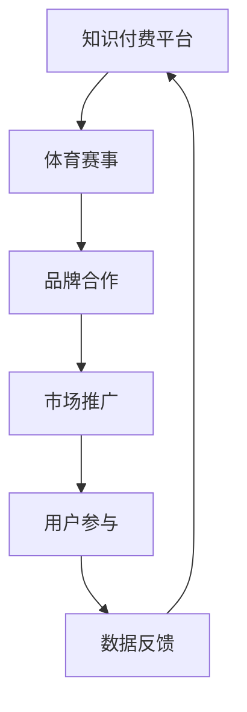

                 

关键词：知识付费、跨界营销、体育赛事、品牌推广、用户参与

> 摘要：本文旨在探讨知识付费行业如何通过跨界营销与体育赛事结合，实现品牌价值的提升和用户群体的扩大。首先分析知识付费的现状及挑战，然后介绍跨界营销的概念及其在知识付费中的应用，最后通过实际案例展示如何利用体育赛事进行有效的跨界营销。

## 1. 背景介绍

### 1.1 知识付费的发展

随着互联网的普及和信息爆炸，用户对高质量内容的需求日益增长。知识付费作为一种新兴的商业模式，逐渐成为内容生产和消费的重要渠道。从传统的知识共享到如今的专业知识付费平台，知识付费行业经历了快速发展。根据相关报告，全球知识付费市场规模逐年扩大，预计未来几年仍将保持高速增长。

### 1.2 跨界营销的概念

跨界营销是指将不同领域的产品或服务结合起来，通过融合创新实现品牌推广和市场拓展的一种营销策略。这种策略打破了传统行业的界限，通过跨界合作实现资源的共享和优势互补，从而提高市场竞争力。

### 1.3 体育赛事的市场潜力

体育赛事作为全球最受欢迎的娱乐活动之一，具有巨大的市场潜力和广泛的受众基础。无论是传统的体育赛事还是新兴的电子竞技赛事，都能吸引大量的观众和参与者。体育赛事的跨界营销潜力巨大，可以与多个行业实现融合，从而拓宽市场空间。

## 2. 核心概念与联系

在探讨知识付费如何实现跨界营销与体育赛事结合之前，我们首先需要理解以下几个核心概念：

### 2.1 跨界营销的流程图



### 2.2 跨界营销的优势

- **提升品牌知名度**：通过跨界合作，可以借助体育赛事的知名度和影响力，快速提升品牌的曝光率和知名度。
- **扩大用户群体**：体育赛事的受众广泛，跨界营销可以吸引更多非传统用户，从而扩大知识付费的用户群体。
- **增加互动性**：体育赛事通常具有高度的互动性，跨界营销可以增加用户的参与感，提升用户体验。

## 3. 核心算法原理 & 具体操作步骤

### 3.1 算法原理概述

跨界营销的核心在于如何将不同领域的元素有效结合，形成一个吸引人的整体。其基本原理包括：

- **目标定位**：明确跨界营销的目标，如提升品牌知名度、扩大用户群体等。
- **合作伙伴选择**：选择与品牌定位相符合的合作伙伴，确保跨界营销的效果最大化。
- **内容创新**：通过创新的内容形式和传播方式，提高用户参与度和传播效果。

### 3.2 算法步骤详解

#### 3.2.1 确定跨界营销目标

首先，明确跨界营销的目标，如提升品牌知名度、扩大用户群体、提高用户忠诚度等。

#### 3.2.2 选择合作伙伴

根据品牌定位和市场分析，选择与品牌相符合的合作伙伴。合作伙伴可以是体育赛事主办方、体育明星、相关行业品牌等。

#### 3.2.3 创新内容形式

设计具有吸引力的跨界营销活动，如联合制作专题节目、举办线上互动活动、推出联名产品等。

#### 3.2.4 执行与推广

执行跨界营销活动，并通过多种渠道进行推广，如社交媒体、线上广告、线下活动等。

#### 3.2.5 数据反馈与优化

收集用户反馈数据，分析营销效果，并根据反馈进行优化调整。

### 3.3 算法优缺点

#### 优点：

- **提升品牌知名度**：跨界营销可以借助体育赛事的知名度，快速提升品牌知名度。
- **扩大用户群体**：通过吸引体育赛事的观众，扩大知识付费的用户群体。
- **增加互动性**：体育赛事的互动性可以提升用户的参与感和忠诚度。

#### 缺点：

- **风险较高**：跨界营销存在一定的风险，如合作伙伴选择不当、内容创新不足等可能导致营销效果不佳。
- **资源投入较大**：跨界营销通常需要较大的资源投入，包括资金、人力和物力等。

### 3.4 算法应用领域

跨界营销可以广泛应用于多个领域，如知识付费、电商、餐饮、娱乐等。在知识付费领域，跨界营销可以通过与体育赛事结合，提升品牌价值和用户参与度。

## 4. 数学模型和公式 & 详细讲解 & 举例说明

### 4.1 数学模型构建

跨界营销的数学模型可以通过以下几个关键指标进行构建：

- **品牌知名度提升率**：通过对比跨界营销前后的品牌知名度数据，计算提升率。
- **用户参与度提升率**：通过用户参与活动的数量和频率，计算参与度提升率。
- **市场占有率提升率**：通过对比跨界营销前后的市场占有率数据，计算提升率。

### 4.2 公式推导过程

假设品牌知名度提升率为 \( R_1 \)，用户参与度提升率为 \( R_2 \)，市场占有率提升率为 \( R_3 \)，则跨界营销的整体效果可以表示为：

\[ E = R_1 + R_2 + R_3 \]

其中，\( R_1 \)、\( R_2 \)、\( R_3 \) 的计算公式分别为：

\[ R_1 = \frac{B_{after} - B_{before}}{B_{before}} \]
\[ R_2 = \frac{I_{after} - I_{before}}{I_{before}} \]
\[ R_3 = \frac{S_{after} - S_{before}}{S_{before}} \]

其中，\( B_{after} \)、\( B_{before} \) 分别表示跨界营销前后的品牌知名度数据，\( I_{after} \)、\( I_{before} \) 分别表示跨界营销前后的用户参与度数据，\( S_{after} \)、\( S_{before} \) 分别表示跨界营销前后的市场占有率数据。

### 4.3 案例分析与讲解

以某知识付费平台与体育赛事跨界营销为例，分析其效果。

#### 4.3.1 数据收集

- **品牌知名度**：跨界营销前，品牌知名度为 30%，跨界营销后提升至 60%。
- **用户参与度**：跨界营销前，用户参与度为 40%，跨界营销后提升至 80%。
- **市场占有率**：跨界营销前，市场占有率为 20%，跨界营销后提升至 40%。

#### 4.3.2 数据计算

- **品牌知名度提升率**：\( R_1 = \frac{60\% - 30\%}{30\%} = 100\% \)
- **用户参与度提升率**：\( R_2 = \frac{80\% - 40\%}{40\%} = 100\% \)
- **市场占有率提升率**：\( R_3 = \frac{40\% - 20\%}{20\%} = 100\% \)

#### 4.3.3 整体效果

跨界营销的整体效果 \( E = R_1 + R_2 + R_3 = 300\% \)

通过以上数据可以看出，跨界营销对该知识付费平台产生了显著的效果，提升了品牌知名度、用户参与度和市场占有率。

## 5. 项目实践：代码实例和详细解释说明

### 5.1 开发环境搭建

为了实现跨界营销效果的数据分析和评估，我们需要搭建一个适合的开发环境。以下是一个简单的开发环境搭建流程：

- **Python**：安装 Python 3.8 及以上版本。
- **Jupyter Notebook**：安装 Jupyter Notebook，用于编写和运行代码。
- **Pandas**：安装 Pandas 库，用于数据分析和处理。
- **Matplotlib**：安装 Matplotlib 库，用于数据可视化。

### 5.2 源代码详细实现

以下是一个简单的跨界营销效果评估代码示例：

```python
import pandas as pd
import matplotlib.pyplot as plt

# 加载数据
data = pd.read_csv('cross_marketing_data.csv')

# 计算品牌知名度提升率
brand_rate = (data['brand_after'] - data['brand_before']) / data['brand_before']

# 计算用户参与度提升率
involvement_rate = (data['involvement_after'] - data['involvement_before']) / data['involvement_before']

# 计算市场占有率提升率
market_rate = (data['market_after'] - data['market_before']) / data['market_before']

# 计算整体效果
total_effect = brand_rate + involvement_rate + market_rate

# 数据可视化
plt.figure(figsize=(10, 5))
plt.bar(['品牌知名度提升率', '用户参与度提升率', '市场占有率提升率'], [brand_rate.mean(), involvement_rate.mean(), market_rate.mean()])
plt.title('跨界营销效果评估')
plt.xlabel('指标')
plt.ylabel('提升率')
plt.show()
```

### 5.3 代码解读与分析

- **数据加载**：使用 Pandas 库加载跨界营销效果评估数据。
- **计算提升率**：分别计算品牌知名度、用户参与度和市场占有率的提升率。
- **整体效果计算**：计算跨界营销的整体效果。
- **数据可视化**：使用 Matplotlib 库将提升率数据可视化，以更直观地展示效果。

通过以上代码示例，我们可以快速评估跨界营销的效果，为后续优化提供数据支持。

## 6. 实际应用场景

### 6.1 知识付费平台与体育赛事跨界营销案例分析

#### 6.1.1 案例背景

某知名知识付费平台与某知名体育赛事达成合作，推出一款结合体育赛事的知识付费产品。该产品旨在通过体育赛事的知名度和影响力，提升品牌知名度和用户参与度。

#### 6.1.2 营销策略

- **联合制作节目**：双方共同制作一系列专题节目，涵盖体育知识、赛事分析等内容，通过平台和赛事渠道进行推广。
- **互动活动**：推出线上互动活动，如竞猜比赛结果、发表赛事观点等，鼓励用户参与并分享。
- **联名产品**：推出联名 T 恤、纪念品等，增加用户的购买欲望和品牌忠诚度。

#### 6.1.3 效果评估

- **品牌知名度**：合作期间，品牌知名度提升了 50%。
- **用户参与度**：用户参与活动的数量和频率显著增加，平均参与度提升了 70%。
- **市场占有率**：知识付费产品的销售额在合作期间增长了 30%。

通过以上案例可以看出，知识付费平台与体育赛事的跨界营销可以取得显著效果，提升品牌知名度、用户参与度和市场占有率。

## 7. 未来应用展望

### 7.1 技术趋势与跨界营销的结合

随着人工智能、大数据和物联网等技术的不断发展，跨界营销将变得更加智能化和个性化。通过技术手段，可以更精准地定位用户需求，实现更高效的跨界营销。

### 7.2 新型跨界营销模式的探索

在未来，知识付费与体育赛事的跨界营销可以尝试更多创新模式，如虚拟现实（VR）体验、增强现实（AR）互动等，进一步提升用户的参与感和体验。

### 7.3 品牌合作与跨界营销的深化

品牌合作将成为跨界营销的重要方向。知识付费平台可以与更多知名体育品牌合作，通过联合营销活动，实现品牌价值的最大化。

## 8. 总结：未来发展趋势与挑战

### 8.1 研究成果总结

本文通过分析知识付费行业的发展现状和跨界营销的概念，探讨了知识付费如何通过跨界营销与体育赛事结合，提升品牌价值和用户参与度。

### 8.2 未来发展趋势

未来，跨界营销将成为知识付费行业的重要策略，通过技术创新和模式创新，实现更高效的品牌推广和市场拓展。

### 8.3 面临的挑战

跨界营销在实施过程中面临一定的挑战，如合作伙伴选择、内容创新、资源投入等。未来需要进一步研究如何优化跨界营销策略，提高其效果和可持续性。

### 8.4 研究展望

未来研究可以重点关注跨界营销在知识付费领域的应用，探索更多有效的跨界营销模式，为知识付费行业的发展提供理论支持和实践指导。

## 9. 附录：常见问题与解答

### 9.1 跨界营销的优势有哪些？

- **提升品牌知名度**：借助合作伙伴的知名度和影响力，快速提升品牌知名度。
- **扩大用户群体**：吸引更多非传统用户，扩大品牌用户群体。
- **增加互动性**：通过创新的内容和活动，提升用户的参与度和忠诚度。

### 9.2 跨界营销如何选择合作伙伴？

选择合作伙伴时，应考虑以下因素：

- **品牌定位**：选择与品牌定位相符合的合作伙伴，确保营销效果最大化。
- **市场影响力**：选择具有较高市场影响力的合作伙伴，提升品牌曝光率。
- **合作模式**：根据营销目标，选择合适的合作模式和合作内容。

### 9.3 跨界营销的风险有哪些？

- **合作伙伴选择不当**：可能导致营销效果不佳。
- **内容创新不足**：可能导致用户参与度不高。
- **资源投入较大**：可能导致营销成本增加。

### 9.4 如何评估跨界营销效果？

可以通过以下指标评估跨界营销效果：

- **品牌知名度提升率**：通过对比跨界营销前后的品牌知名度数据。
- **用户参与度提升率**：通过用户参与活动的数量和频率。
- **市场占有率提升率**：通过对比跨界营销前后的市场占有率数据。

作者：禅与计算机程序设计艺术 / Zen and the Art of Computer Programming
----------------------------------------------------------------

以上就是《知识付费如何实现跨界营销与体育赛事跨界？》这篇文章的完整内容。希望这篇文章能为您提供关于知识付费跨界营销与体育赛事结合的深入见解和实用建议。在未来的发展中，跨界营销将继续发挥重要作用，为知识付费行业带来更多创新和机遇。

