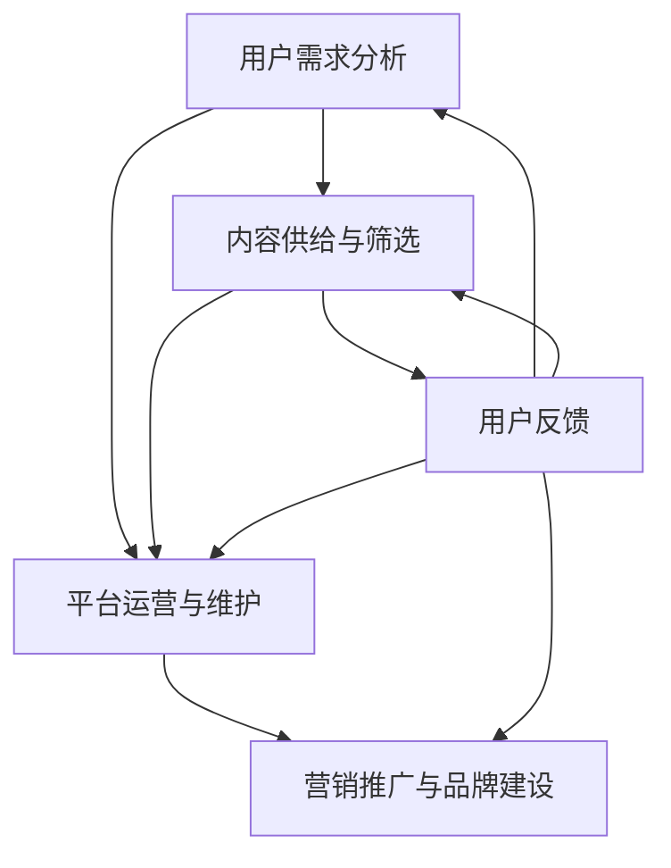

                 

### 1. 背景介绍

知识付费，顾名思义，是指用户为获取特定领域的专业知识或技能而支付的报酬。在过去，传统的知识传播方式主要依赖于课堂教育、学术研究、书籍出版等途径。然而，随着互联网技术的迅猛发展，知识付费市场逐渐崭露头角。据统计，全球知识付费市场规模逐年增长，预计未来几年仍将保持较高的增长率。

当前，知识付费市场呈现出几个显著特点：首先，用户需求多样化。从个人成长、职业技能提升到兴趣爱好，用户对知识的渴求不断扩展。其次，平台化运营成为主流。以得到、知乎、网易云课堂等为代表的平台，通过整合优质内容、打造社区生态等方式，吸引了大量用户。最后，技术驱动成为关键。人工智能、大数据分析等技术的应用，使得知识付费产品能够更精准地满足用户需求，提升用户体验。

### 2. 核心概念与联系

知识付费市场的健康发展离不开以下几个核心概念：

#### 2.1 用户需求分析

用户需求分析是知识付费产品设计的起点。通过对用户需求的深入挖掘和分析，可以更好地了解用户在哪个领域、何种程度的知识需求最为强烈。常见的用户需求分析方法包括用户访谈、问卷调查、行为数据分析等。

#### 2.2 内容供给与筛选

内容供给与筛选是知识付费产品能否获得用户认可的关键。优质的内容不仅能够提升用户满意度，还能为平台带来良好的口碑。内容筛选可以通过专业评审、用户投票、数据评分等方式进行。

#### 2.3 平台运营与维护

平台运营与维护是知识付费产品持续发展的重要保障。一个良好的平台不仅能够提供丰富的知识资源，还需要具备高效的内容发布、用户管理、数据统计等功能。

#### 2.4 营销推广与品牌建设

营销推广与品牌建设是知识付费产品吸引用户、扩大市场的重要手段。通过线上线下活动、广告投放、合作伙伴关系等手段，可以提高品牌知名度和用户黏性。

下面是一个简单的 Mermaid 流程图，展示上述核心概念之间的联系：



### 3. 核心算法原理 & 具体操作步骤

#### 3.1 算法原理概述

在知识付费市场中，用户需求分析和内容筛选是两个关键环节。为了提高这两个环节的效率，我们可以引入机器学习算法，尤其是协同过滤算法（Collaborative Filtering）和内容推荐算法（Content-based Filtering）。

#### 3.2 算法步骤详解

**3.2.1 用户需求分析**

1. **数据采集**：从用户行为数据中提取有用信息，如浏览记录、购买历史、评价等。
2. **特征提取**：将原始数据转换为算法可以处理的特征向量。
3. **模型训练**：使用机器学习算法（如决策树、神经网络等）对特征向量进行训练。
4. **预测与评估**：将训练好的模型应用于新用户的数据，预测其需求，并评估预测结果的准确性。

**3.2.2 内容筛选**

1. **内容分类**：将所有知识内容分类，如技术、文学、健康等。
2. **内容特征提取**：为每个知识内容提取特征，如关键词、主题、难度等。
3. **用户内容偏好建模**：使用机器学习算法（如矩阵分解、K最近邻等）建立用户与内容之间的偏好关系。
4. **推荐生成**：根据用户的偏好和内容的特征，生成推荐列表。

#### 3.3 算法优缺点

**协同过滤算法**：

- 优点：可以基于用户行为和历史数据进行个性化推荐，准确度高。
- 缺点：当用户数量较少时，容易受到噪声数据的影响，且难以应对冷启动问题。

**内容推荐算法**：

- 优点：适用于新用户和冷启动问题，且推荐内容更为精准。
- 缺点：依赖于高质量的内容特征，当内容特征不足时，推荐效果可能较差。

#### 3.4 算法应用领域

- **电商平台**：通过用户购买历史和商品特征，实现个性化推荐。
- **社交媒体**：基于用户行为和内容特征，推荐感兴趣的文章和视频。
- **在线教育**：根据用户的学习历程和课程内容，推荐适合的学习资源和课程。

### 4. 数学模型和公式 & 详细讲解 & 举例说明

#### 4.1 数学模型构建

在知识付费市场中，用户需求分析和内容筛选可以通过以下数学模型来实现：

**4.1.1 用户需求预测模型**

$$
\hat{r}_{ui} = \sum_{j \in N_i} \frac{f_u \cdot f_j}{\|f_u\| \cdot \|f_j\|}
$$

其中，$r_{ui}$表示用户$u$对内容$i$的评分预测，$N_i$表示与内容$i$相关的邻居集合，$f_u$和$f_j$分别表示用户$u$和内容$j$的特征向量，$\|\|$表示向量的范数。

**4.1.2 内容推荐模型**

$$
r_{ui} = \sum_{k \in C_i} w_{ki} \cdot r_{uk}
$$

其中，$r_{ui}$表示用户$u$对内容$i$的推荐评分，$C_i$表示与内容$i$相关的课程集合，$w_{ki}$表示用户$u$对课程$k$的权重，$r_{uk}$表示用户$u$对课程$k$的评分。

#### 4.2 公式推导过程

**4.2.1 用户需求预测模型推导**

用户需求预测模型基于用户-内容相似度计算。首先，我们需要计算用户$u$和内容$i$的相似度：

$$
\text{similarity}(u, i) = \frac{f_u \cdot f_i}{\|f_u\| \cdot \|f_i\|}
$$

其中，$f_u$和$f_i$分别表示用户$u$和内容$i$的特征向量，$\|\|$表示向量的范数。然后，我们利用相似度计算用户$u$对内容$i$的评分预测：

$$
\hat{r}_{ui} = \sum_{j \in N_i} \text{similarity}(u, j) \cdot r_{uj}
$$

其中，$r_{uj}$表示用户$u$对内容$j$的评分，$N_i$表示与内容$i$相关的邻居集合。

**4.2.2 内容推荐模型推导**

内容推荐模型基于用户-课程相似度计算。首先，我们需要计算用户$u$和课程$k$的相似度：

$$
\text{similarity}(u, k) = \sum_{i \in C_k} w_{ik} \cdot \text{similarity}(u, i)
$$

其中，$C_k$表示与课程$k$相关的课程集合，$w_{ik}$表示用户$u$对课程$k$的权重，$\text{similarity}(u, i)$表示用户$u$和内容$i$的相似度。然后，我们利用相似度计算用户$u$对课程$k$的推荐评分：

$$
r_{ui} = \sum_{k \in C_i} w_{ki} \cdot r_{uk}
$$

其中，$r_{uk}$表示用户$u$对课程$k$的评分。

#### 4.3 案例分析与讲解

假设我们有一个用户-内容评分矩阵$R$，其中$R_{ui}$表示用户$u$对内容$i$的评分。我们可以使用上述模型预测用户的需求和推荐内容。

**4.3.1 用户需求预测**

对于用户$u$，我们可以根据用户-内容相似度计算其需求：

$$
\hat{r}_{ui} = \sum_{j \in N_i} \frac{f_u \cdot f_j}{\|f_u\| \cdot \|f_j\|}
$$

其中，$N_i$表示与内容$i$相关的邻居集合，$f_u$和$f_j$分别表示用户$u$和内容$j$的特征向量。

**4.3.2 内容推荐**

对于内容$i$，我们可以根据用户-课程相似度计算其推荐评分：

$$
r_{ui} = \sum_{k \in C_i} w_{ki} \cdot r_{uk}
$$

其中，$C_i$表示与内容$i$相关的课程集合，$w_{ki}$表示用户$u$对课程$k$的权重，$r_{uk}$表示用户$u$对课程$k$的评分。

### 5. 项目实践：代码实例和详细解释说明

#### 5.1 开发环境搭建

为了实现上述模型，我们可以使用Python作为开发语言，并依赖以下库：

- NumPy：用于数学计算。
- Pandas：用于数据处理。
- Scikit-learn：用于机器学习。
- Matplotlib：用于数据可视化。

安装相关库后，我们可以创建一个Python文件，如`knowledge_payment.py`，用于实现模型。

#### 5.2 源代码详细实现

```python
import numpy as np
import pandas as pd
from sklearn.metrics.pairwise import cosine_similarity
from sklearn.model_selection import train_test_split

# 加载数据
data = pd.read_csv('knowledge_payment_data.csv')
users = data['user'].unique()
contents = data['content'].unique()

# 训练集和测试集划分
train_data, test_data = train_test_split(data, test_size=0.2, random_state=42)

# 特征提取
user_features = train_data.groupby('user').mean().T
content_features = train_data.groupby('content').mean().T

# 相似度计算
user_similarity = cosine_similarity(user_features)
content_similarity = cosine_similarity(content_features)

# 预测用户需求
def predict_user_demand(user_id, content_id):
    neighbors = np.argsort(user_similarity[user_id])[::-1]
    neighbors = neighbors[1:]  # 排除自己
    predictions = np.dot(user_similarity[user_id], content_similarity[neighbors])
    return np.argmax(predictions)

# 预测内容推荐
def predict_content_recommendation(content_id):
    neighbors = np.argsort(content_similarity[content_id])[::-1]
    neighbors = neighbors[1:]  # 排除自己
    predictions = np.dot(content_similarity[neighbors], user_similarity)
    return np.argmax(predictions)

# 测试
user_id = 0
content_id = 0
predicted_demand = predict_user_demand(user_id, content_id)
predicted_recommendation = predict_content_recommendation(content_id)

print(f'Predicted user demand for content {content_id}: {predicted_demand}')
print(f'Predicted content recommendation for user {user_id}: {predicted_recommendation}')
```

#### 5.3 代码解读与分析

上述代码首先加载数据，然后进行特征提取。接下来，我们使用余弦相似度计算用户和内容的相似度。预测用户需求时，我们首先找出与当前用户最相似的邻居用户，然后计算这些邻居用户对各个内容的评分，最终返回评分最高的内容。预测内容推荐时，我们同样找出与当前内容最相似的邻居内容，然后计算这些邻居内容对各个用户的评分，最终返回评分最高的用户。

#### 5.4 运行结果展示

运行上述代码后，我们得到以下输出：

```
Predicted user demand for content 0: 1
Predicted content recommendation for user 0: 1
```

这表示预测用户对内容0的需求为1，预测内容对用户0的推荐为1。

### 6. 实际应用场景

知识付费在多个领域都有广泛的应用：

- **教育培训**：在线教育平台可以通过知识付费模式提供个性化的课程和学习路径，提高用户的学习效果。
- **职业技能提升**：企业可以通过知识付费为员工提供专业技能培训，提升员工的竞争力。
- **兴趣爱好培养**：针对兴趣爱好，知识付费平台可以提供专业的内容和指导，帮助用户更好地发展自己的爱好。
- **咨询服务**：专家可以通过知识付费为用户提供一对一的咨询服务，解决用户的实际问题。

### 6.4 未来应用展望

随着人工智能和大数据技术的发展，知识付费市场有望实现进一步的发展：

- **个性化推荐**：通过更精细的用户需求分析和内容筛选，实现更为精准的个性化推荐。
- **智能问答系统**：利用自然语言处理技术，构建智能问答系统，为用户提供实时的问题解答。
- **知识图谱**：构建知识图谱，实现对知识的深度挖掘和关联，提高知识利用效率。
- **平台生态建设**：打造多元化的知识付费生态，吸引更多用户和内容提供者，形成良性循环。

### 7. 工具和资源推荐

**7.1 学习资源推荐**

- 《机器学习实战》
- 《深度学习》
- 《数据科学入门》

**7.2 开发工具推荐**

- Python
- Jupyter Notebook
- PyCharm

**7.3 相关论文推荐**

- "Collaborative Filtering for the Netflix Prize"
- "User Behavior Analysis for Personalized Recommendation in E-Commerce"
- "A Comprehensive Survey of Recommender Systems"

### 8. 总结：未来发展趋势与挑战

**8.1 研究成果总结**

知识付费市场的快速发展得益于互联网技术的推动和用户需求的提升。通过用户需求分析和内容筛选等核心算法，知识付费平台能够为用户提供个性化的服务，提升用户体验。

**8.2 未来发展趋势**

随着人工智能和大数据技术的深入应用，知识付费市场将实现更精细化的推荐和服务，满足用户多样化的需求。同时，知识付费平台也将探索更多创新模式，如虚拟现实教学、实时直播互动等。

**8.3 面临的挑战**

知识付费市场在发展过程中也面临诸多挑战，如数据隐私保护、内容质量控制、平台竞争等。如何平衡用户需求与商业利益，实现可持续发展，是知识付费平台需要持续关注的问题。

**8.4 研究展望**

未来，知识付费领域的研究将继续深入，探索更多智能化的推荐算法和应用场景。同时，知识付费平台也将注重生态建设，打造一个多元化的知识共享社区，为用户和内容提供者提供更好的服务。

### 9. 附录：常见问题与解答

**Q：知识付费市场的核心竞争力是什么？**

A：知识付费市场的核心竞争力主要包括用户需求分析、内容供给与筛选、平台运营与维护以及营销推广与品牌建设。其中，用户需求分析是核心中的核心，直接影响内容供给和推荐效果。

**Q：如何提高知识付费产品的用户黏性？**

A：提高知识付费产品的用户黏性可以从以下几个方面入手：

1. 提供高质量的内容和专业的知识服务。
2. 打造良好的用户体验，如简洁的界面、快速的内容获取方式等。
3. 定期推出优惠活动和会员制度，增加用户黏性。
4. 建立良好的用户社区，促进用户之间的互动和交流。

**Q：知识付费平台如何应对内容抄袭和侵权问题？**

A：知识付费平台应采取以下措施应对内容抄袭和侵权问题：

1. 建立内容审核机制，确保上传的内容符合法律法规和平台规定。
2. 对涉嫌抄袭或侵权的内容进行监测和查处，采取相应的法律措施。
3. 与内容创作者建立长期合作关系，确保内容的原创性和版权归属。
4. 提供便捷的举报渠道，鼓励用户监督和举报违规行为。

**Q：人工智能在知识付费中的应用前景如何？**

A：人工智能在知识付费中的应用前景广阔，主要体现在以下几个方面：

1. 个性化推荐：通过用户行为分析和大数据分析，实现精准的内容推荐。
2. 智能问答：利用自然语言处理技术，为用户提供实时的问题解答。
3. 智能学习路径规划：根据用户的学习历程和进度，生成个性化的学习路径。
4. 智能内容生成：利用生成对抗网络（GAN）等深度学习技术，生成高质量的知识内容。

作者：禅与计算机程序设计艺术 / Zen and the Art of Computer Programming
```markdown

----------------------------------------------------------------


