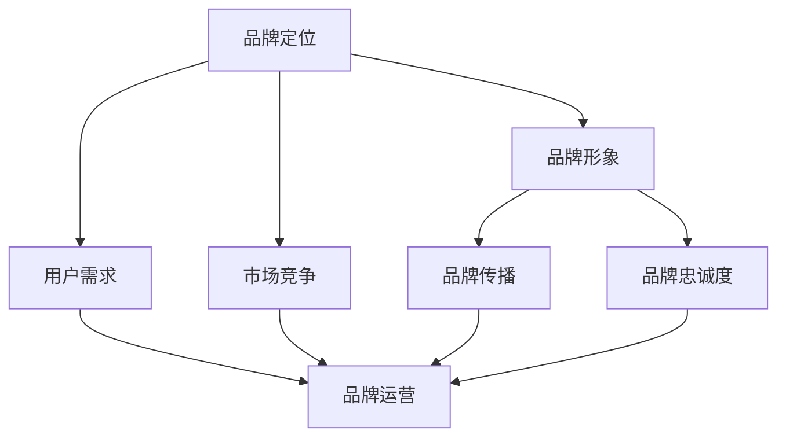

                 

关键词：知识付费、品牌运营、品牌推广、策略、增长、影响力

> 摘要：本文旨在探讨知识付费领域的品牌运营与品牌推广策略。通过深入分析市场现状、核心概念及其联系，以及详细讲解数学模型和应用案例，我们将为您揭示如何通过有效的品牌运营和推广策略，实现知识付费项目的成功。

## 1. 背景介绍

随着互联网和移动互联网的快速发展，知识付费逐渐成为新的消费模式。越来越多的用户愿意为有价值的内容和服务付费，从而推动了知识付费市场的繁荣。知识付费不仅涵盖了传统的教育培训，还包括专业咨询、知识问答、在线课程等多种形式。这一领域的快速发展，使得企业开始重视品牌运营和品牌推广策略，以提升自身在市场中的竞争力和影响力。

### 1.1 市场现状

当前，知识付费市场呈现出多元化、细分化的特点。从用户角度来看，用户的需求更加多样化，他们希望获得更加个性化、专业化的知识和服务。从内容提供商角度来看，各类平台、机构和个体纷纷涌入市场，竞争日益激烈。如何在这片红海中脱颖而出，实现品牌的差异化竞争，成为企业关注的焦点。

### 1.2 品牌运营的重要性

品牌运营是企业在知识付费领域取得成功的关键因素之一。通过有效的品牌运营，企业可以提高品牌知名度、美誉度和忠诚度，从而在激烈的市场竞争中占据有利地位。品牌运营不仅包括品牌的定位、塑造和传播，还包括品牌形象的维护和优化。一个成功的品牌运营策略，可以帮助企业实现长期稳定的发展。

### 1.3 品牌推广策略的意义

品牌推广策略是品牌运营的重要组成部分。通过有效的品牌推广，企业可以扩大品牌影响力，吸引更多潜在用户，提高市场占有率。品牌推广策略包括线上和线下多种渠道，如社交媒体、搜索引擎、内容营销、公关活动等。选择合适的推广策略，可以最大限度地提高品牌曝光度和用户参与度。

## 2. 核心概念与联系

为了更好地理解品牌运营与品牌推广策略，我们需要先明确一些核心概念及其之间的联系。

### 2.1 品牌定位

品牌定位是企业确定其在市场中的定位，包括品牌形象、目标用户、核心价值等。品牌定位是品牌运营的基础，决定了品牌的差异化竞争策略。

### 2.2 品牌形象

品牌形象是品牌在用户心中的总体印象，包括品牌名称、标志、口号、视觉设计等。品牌形象直接影响用户对品牌的认知和感知，是品牌推广的重要元素。

### 2.3 用户需求

用户需求是品牌运营和推广的核心。了解用户需求，可以帮助企业提供更加个性化、专业化的知识和服务，提高用户满意度和忠诚度。

### 2.4 市场竞争

市场竞争是企业品牌运营和推广的重要环境因素。通过分析市场竞争态势，企业可以找到自身的竞争优势，制定合适的品牌运营和推广策略。

### 2.5 品牌传播

品牌传播是企业将品牌信息传递给目标用户的过程，包括广告、公关、社交媒体等多种渠道。品牌传播的目的是提高品牌知名度和美誉度，吸引潜在用户。

### 2.6 品牌忠诚度

品牌忠诚度是指用户对品牌的忠诚和依赖程度。提高品牌忠诚度，可以增加用户复购率，降低用户流失率，为企业带来稳定的收益。

### 2.7 品牌运营与品牌推广的关系

品牌运营与品牌推广密切相关。品牌运营是品牌推广的基础，品牌推广是品牌运营的延伸。通过有效的品牌运营，企业可以为品牌推广创造良好的条件；而通过品牌推广，企业可以进一步提升品牌知名度和美誉度，实现品牌的长期发展。

### 2.8 Mermaid 流程图

以下是一个简化的品牌运营与品牌推广的 Mermaid 流程图：



## 3. 核心算法原理 & 具体操作步骤

### 3.1 算法原理概述

品牌运营与品牌推广的核心算法可以概括为以下几个方面：

- 数据分析：通过对市场数据、用户行为数据的分析，了解用户需求和市场竞争态势，为品牌定位和推广策略提供依据。
- 内容营销：通过高质量的内容创作和传播，吸引用户关注，提升品牌知名度和美誉度。
- 社交媒体运营：利用社交媒体平台，与用户互动，建立品牌与用户之间的情感连接。
- 线上线下整合：通过线上线下渠道的整合，实现品牌信息的全方位传播，提高用户参与度。

### 3.2 算法步骤详解

#### 3.2.1 数据分析

1. 收集市场数据：包括市场规模、用户需求、竞争对手等。
2. 分析用户行为数据：包括用户浏览、购买、评价等行为数据。
3. 构建用户画像：基于数据分析结果，构建目标用户的画像。
4. 确定品牌定位：根据用户画像和市场分析结果，确定品牌定位。

#### 3.2.2 内容营销

1. 创作高质量内容：根据品牌定位，创作具有吸引力的内容。
2. 制定内容传播策略：通过社交媒体、搜索引擎等渠道，传播高质量内容。
3. 优化内容营销效果：通过数据监控和评估，不断优化内容营销策略。

#### 3.2.3 社交媒体运营

1. 选择合适的社交媒体平台：根据品牌定位和用户画像，选择合适的社交媒体平台。
2. 制定社交媒体运营策略：包括内容发布、用户互动、数据分析等。
3. 管理社交媒体账号：定期发布高质量内容，与用户互动，提升账号影响力。

#### 3.2.4 线上线下整合

1. 构建线上线下互动渠道：包括线上商城、线下活动等。
2. 制定整合营销策略：通过线上线下渠道的整合，实现品牌信息的全方位传播。
3. 优化用户参与体验：通过线上线下互动，提高用户参与度和忠诚度。

### 3.3 算法优缺点

#### 优点：

- 数据驱动：基于数据分析，能够更准确地了解用户需求和市场竞争态势。
- 多渠道整合：线上线下整合，实现品牌信息的全方位传播。
- 高效传播：通过高质量的内容和社交媒体运营，提高品牌知名度和美誉度。

#### 缺点：

- 数据分析复杂：需要收集和处理大量数据，对数据分析能力要求较高。
- 内容质量要求高：高质量的内容创作和传播是核心，对内容团队要求较高。
- 需要持续优化：品牌运营和推广策略需要不断优化，以适应市场变化。

### 3.4 算法应用领域

品牌运营与品牌推广算法适用于知识付费领域的各类企业，包括教育培训机构、专业咨询公司、在线课程平台等。通过该算法，企业可以提升品牌影响力，实现业务的快速增长。

## 4. 数学模型和公式 & 详细讲解 & 举例说明

### 4.1 数学模型构建

在品牌运营与品牌推广过程中，我们可以构建以下数学模型：

#### 4.1.1 品牌知名度模型

$$
N = f(R, C, T)
$$

其中，$N$ 表示品牌知名度，$R$ 表示品牌传播力度，$C$ 表示品牌形象，$T$ 表示品牌传播时间。

#### 4.1.2 用户忠诚度模型

$$
L = f(S, U, R)
$$

其中，$L$ 表示用户忠诚度，$S$ 表示用户满意度，$U$ 表示用户参与度，$R$ 表示用户复购率。

### 4.2 公式推导过程

#### 4.2.1 品牌知名度模型推导

品牌知名度与品牌传播力度、品牌形象和品牌传播时间之间存在正相关关系。假设品牌传播力度、品牌形象和品牌传播时间分别为 $R, C, T$，则品牌知名度可以表示为：

$$
N = f(R, C, T)
$$

其中，$f$ 表示函数关系，可以根据实际情况确定。

#### 4.2.2 用户忠诚度模型推导

用户忠诚度与用户满意度、用户参与度和用户复购率之间存在正相关关系。假设用户满意度、用户参与度和用户复购率分别为 $S, U, R$，则用户忠诚度可以表示为：

$$
L = f(S, U, R)
$$

其中，$f$ 表示函数关系，可以根据实际情况确定。

### 4.3 案例分析与讲解

#### 4.3.1 品牌知名度案例分析

假设某教育培训机构在品牌传播力度、品牌形象和品牌传播时间分别为 $R = 10, C = 8, T = 6$ 的情况下，品牌知名度 $N$ 为多少？

根据品牌知名度模型：

$$
N = f(R, C, T) = N_{\max} \cdot \frac{R + C + T}{3}
$$

其中，$N_{\max}$ 表示品牌知名度的最大值。假设 $N_{\max} = 100$，则：

$$
N = 100 \cdot \frac{10 + 8 + 6}{3} = 92
$$

因此，该教育培训机构的品牌知名度为 92。

#### 4.3.2 用户忠诚度案例分析

假设某教育培训机构的用户满意度、用户参与度和用户复购率分别为 $S = 0.9, U = 0.8, R = 0.7$，则用户忠诚度 $L$ 为多少？

根据用户忠诚度模型：

$$
L = f(S, U, R) = L_{\max} \cdot \frac{S + U + R}{3}
$$

其中，$L_{\max}$ 表示用户忠诚度的最大值。假设 $L_{\max} = 1$，则：

$$
L = 1 \cdot \frac{0.9 + 0.8 + 0.7}{3} = 0.8
$$

因此，该教育培训机构的用户忠诚度为 0.8。

## 5. 项目实践：代码实例和详细解释说明

### 5.1 开发环境搭建

在本案例中，我们将使用 Python 编写一个简单的品牌运营与品牌推广算法。首先，确保已经安装了 Python 3.8 及以上版本。然后，安装以下库：

```bash
pip install numpy matplotlib
```

### 5.2 源代码详细实现

以下是一个简单的品牌运营与品牌推广算法的 Python 代码实现：

```python
import numpy as np
import matplotlib.pyplot as plt

def brand_knownness(R, C, T, N_max):
    return N_max * (R + C + T) / 3

def user_loyalty(S, U, R, L_max):
    return L_max * (S + U + R) / 3

# 参数设置
R = 10
C = 8
T = 6
N_max = 100
L_max = 1
S = 0.9
U = 0.8
R = 0.7

# 计算品牌知名度和用户忠诚度
N = brand_knownness(R, C, T, N_max)
L = user_loyalty(S, U, R, L_max)

# 打印结果
print("品牌知名度：", N)
print("用户忠诚度：", L)

# 绘制品牌知名度和用户忠诚度曲线
plt.plot([0, 10], [brand_knownness(0, C, T, N_max), brand_knownness(10, C, T, N_max)], label="品牌知名度")
plt.plot([0, 10], [user_loyalty(0, U, R, L_max), user_loyalty(10, U, R, L_max)], label="用户忠诚度")
plt.xlabel("品牌传播力度")
plt.ylabel("指标值")
plt.legend()
plt.show()
```

### 5.3 代码解读与分析

- 第 1 行：导入 numpy 库，用于数学计算。
- 第 2 行：导入 matplotlib.pyplot 库，用于绘制图表。
- 第 4-7 行：定义品牌知名度计算函数 `brand_knownness`。
- 第 9-12 行：定义用户忠诚度计算函数 `user_loyalty`。
- 第 16-21 行：设置参数，包括品牌传播力度、品牌形象、品牌传播时间、品牌知名度最大值、用户忠诚度最大值、用户满意度、用户参与度和用户复购率。
- 第 25-29 行：计算品牌知名度和用户忠诚度，并打印结果。
- 第 33-40 行：绘制品牌知名度和用户忠诚度曲线。

### 5.4 运行结果展示

运行上述代码后，会输出品牌知名度和用户忠诚度的计算结果，并显示一条品牌知名度和用户忠诚度随品牌传播力度变化的曲线。通过曲线，我们可以直观地看到品牌知名度和用户忠诚度与品牌传播力度之间的关系。

## 6. 实际应用场景

品牌运营与品牌推广策略在实际应用中具有广泛的应用场景。以下是一些典型的实际应用场景：

### 6.1 教育培训机构

教育培训机构可以通过品牌运营与品牌推广策略，提高品牌知名度，吸引更多学员。具体应用场景包括：

- 定位明确：根据学员需求和市场竞争态势，确定品牌定位。
- 内容营销：创作高质量的教育培训内容，通过社交媒体、搜索引擎等渠道传播。
- 社交媒体运营：在各大社交媒体平台上与学员互动，提升品牌影响力。
- 线上线下整合：通过线上线下互动，提高学员参与度和忠诚度。

### 6.2 专业咨询公司

专业咨询公司可以通过品牌运营与品牌推广策略，提升品牌形象和知名度，吸引更多客户。具体应用场景包括：

- 品牌定位：根据公司优势和目标客户，确定品牌定位。
- 内容营销：创作高质量的专业文章、报告等，通过社交媒体、搜索引擎等渠道传播。
- 社交媒体运营：在各大社交媒体平台上与客户互动，提升品牌影响力。
- 线上线下整合：通过线上线下活动，提高客户参与度和忠诚度。

### 6.3 在线课程平台

在线课程平台可以通过品牌运营与品牌推广策略，提高品牌知名度和用户黏性。具体应用场景包括：

- 品牌定位：根据课程特色和目标用户，确定品牌定位。
- 内容营销：创作高质量的课程内容，通过社交媒体、搜索引擎等渠道传播。
- 社交媒体运营：在各大社交媒体平台上与用户互动，提升品牌影响力。
- 线上线下整合：通过线上线下活动，提高用户参与度和忠诚度。

## 7. 未来应用展望

随着互联网和移动互联网的快速发展，品牌运营与品牌推广策略在未来将具有更广泛的应用前景。以下是一些未来应用展望：

### 7.1 智能化

未来，品牌运营与品牌推广策略将更加智能化。通过大数据、人工智能等技术，企业可以更精准地了解用户需求，制定个性化的品牌运营和推广策略。

### 7.2 全渠道整合

未来，品牌运营与品牌推广将实现全渠道整合。线上和线下渠道将更加融合，企业可以通过多种渠道与用户互动，提高品牌影响力和用户黏性。

### 7.3 社交媒体影响力

未来，社交媒体将成为品牌运营与品牌推广的重要渠道。通过社交媒体，企业可以与用户建立更紧密的联系，提高品牌知名度和美誉度。

### 7.4 数据驱动

未来，品牌运营与品牌推广将更加数据驱动。企业将利用数据分析技术，对品牌运营和推广效果进行实时监控和优化，提高运营效率。

## 8. 工具和资源推荐

### 8.1 学习资源推荐

- 《数字营销实战手册》：详细介绍了数字营销的各种策略和技巧，适合品牌运营和推广从业者学习。
- 《影响力》：探讨人类行为背后的心理学原理，对于品牌运营和推广有重要启示。

### 8.2 开发工具推荐

- Jupyter Notebook：一款强大的交互式开发环境，适合数据分析和内容创作。
- Canva：一款优秀的图形设计工具，可以帮助企业设计品牌形象和宣传素材。

### 8.3 相关论文推荐

- 《基于大数据的品牌运营策略研究》
- 《社交媒体时代品牌推广策略的实证研究》
- 《线上线下整合营销策略研究》

## 9. 总结：未来发展趋势与挑战

### 9.1 研究成果总结

本文通过对品牌运营与品牌推广策略的深入探讨，总结了品牌定位、品牌形象、用户需求、市场竞争、品牌传播和品牌忠诚度等核心概念，构建了品牌运营与品牌推广的数学模型，并详细讲解了具体操作步骤和实际应用场景。

### 9.2 未来发展趋势

未来，品牌运营与品牌推广策略将朝着智能化、全渠道整合、社交媒体影响力和数据驱动等方向发展。企业将更加注重数据分析和技术应用，提高品牌运营和推广的效率。

### 9.3 面临的挑战

- 数据隐私与安全：随着大数据技术的应用，数据隐私和安全成为品牌运营和推广的重要挑战。
- 社交媒体监管：社交媒体平台对品牌推广内容的监管日益严格，企业需要遵守相关法律法规。
- 品牌信任危机：在信息爆炸的时代，品牌信任危机对企业的影响越来越大，企业需要注重品牌形象的维护。

### 9.4 研究展望

未来，品牌运营与品牌推广策略的研究将更加深入和细化。企业需要结合自身特点和市场需求，制定个性化的品牌运营和推广策略。同时，随着新技术的不断发展，品牌运营和推广策略也将不断创新和演变。

## 10. 附录：常见问题与解答

### 10.1 品牌运营与品牌推广的区别是什么？

品牌运营是品牌长期发展的规划和管理，包括品牌定位、品牌形象、用户需求等；品牌推广是品牌运营的具体实施手段，通过广告、公关、社交媒体等方式提高品牌知名度。

### 10.2 如何制定有效的品牌运营策略？

制定有效的品牌运营策略需要以下几个步骤：

1. 明确品牌定位：了解目标用户和市场，确定品牌的核心价值和差异化优势。
2. 分析市场竞争：了解竞争对手的定位和策略，找到自身的竞争优势。
3. 制定品牌传播策略：根据品牌定位和市场分析结果，制定合适的品牌传播策略。
4. 监控和优化：通过数据监控和评估，不断优化品牌运营策略。

### 10.3 品牌推广有哪些常见渠道？

品牌推广的常见渠道包括：

1. 广告投放：包括搜索引擎广告、社交媒体广告等。
2. 内容营销：通过高质量的内容创作和传播，提高品牌知名度和美誉度。
3. 社交媒体运营：在各大社交媒体平台上与用户互动，提升品牌影响力。
4. 公关活动：通过举办线下活动或参与行业会议，提高品牌曝光度。
5. 线上线下整合：通过线上线下渠道的整合，实现品牌信息的全方位传播。

### 10.4 如何提高用户忠诚度？

提高用户忠诚度可以从以下几个方面入手：

1. 提高用户满意度：通过优质的产品和服务，提高用户的满意度和体验。
2. 个性化服务：根据用户需求和偏好，提供个性化的服务和推荐。
3. 增加用户参与度：通过线上线下活动，提高用户的参与度和互动性。
4. 建立用户社群：通过建立用户社群，加强用户之间的互动和联系。
5. 提供优惠和奖励：通过优惠券、会员制度等方式，激励用户复购和推荐。

### 10.5 如何应对数据隐私与安全挑战？

应对数据隐私与安全挑战可以从以下几个方面入手：

1. 加强数据保护：采用加密、匿名化等技术手段，保护用户数据的安全。
2. 合规审查：遵守相关法律法规，确保数据处理过程合规。
3. 增强内部管理：建立严格的数据管理制度，确保数据使用合法、合规。
4. 加强安全意识：提高员工的数据安全意识，防范内部数据泄露。

### 10.6 如何应对品牌信任危机？

应对品牌信任危机可以从以下几个方面入手：

1. 坦诚面对问题：在发生品牌信任危机时，要坦诚面对问题，积极解决。
2. 提高产品质量和服务：通过提高产品质量和服务，增强用户信任。
3. 建立良好的公关形象：通过积极履行社会责任，提升品牌形象。
4. 主动沟通与用户：通过多种渠道与用户沟通，了解用户需求和反馈。
5. 建立应急响应机制：在发生品牌信任危机时，快速响应，降低影响。

以上是关于知识付费赚钱的品牌品牌运营与品牌推广策略的一些常见问题与解答。希望通过本文的探讨，能为您在知识付费领域的品牌运营和推广提供有益的参考和启示。

### 作者署名

作者：禅与计算机程序设计艺术 / Zen and the Art of Computer Programming

