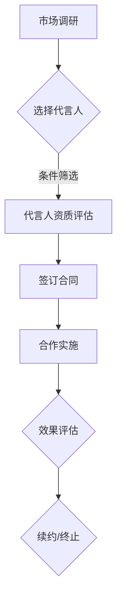

                 

关键词：知识付费、品牌形象、代言人、合作、选择、营销策略

> 摘要：本文将探讨知识付费领域如何通过选择合适的品牌形象代言人，实现商业合作的成功，并从多个维度提供详细的策略分析，以期为知识付费行业的品牌建设提供有益的参考。

## 1. 背景介绍

知识付费作为近年来快速崛起的一个行业，已经成为众多创业者、企业和知识达人追逐的热点。它不仅为知识的创造者和传播者提供了新的收入来源，也为消费者提供了更加专业、个性化的知识服务。然而，随着市场的日益竞争激烈，品牌形象代言人在知识付费领域的重要性逐渐凸显。

选择合适的品牌形象代言人，不仅有助于提升品牌知名度，增强品牌形象，还能通过代言人的影响力和粉丝基础，带动产品的销售，实现商业合作的成功。本文将从品牌形象代言人的选择、合作策略、以及效果评估等方面，对知识付费领域中的品牌形象代言人进行深入探讨。

## 2. 核心概念与联系

在探讨品牌形象代言人选择与合作之前，我们首先需要明确几个核心概念：

### 2.1 品牌形象

品牌形象是指消费者在心智中对于品牌的整体印象。它包括品牌的知名度、认知度、声誉、个性等方面。一个成功的品牌形象能够吸引消费者的注意力，建立消费者的信任，从而促进销售。

### 2.2 代言人

代言人是指被品牌雇佣，以个人形象和影响力代表品牌形象的人。代言人可以是名人、专家、意见领袖等，他们的选择对品牌形象有直接的影响。

### 2.3 商业合作

商业合作是指品牌与代言人之间建立的合作关系，这种关系可以通过代言合同、合作项目等形式体现。

下面是一个简化的Mermaid流程图，展示了品牌形象代言人选择与合作的流程：



### 2.4 合作策略

合作策略是指品牌与代言人之间如何制定和执行合作计划，包括代言人的职责、推广方式、收益分配等。

### 2.5 效果评估

效果评估是指对代言人合作的效果进行监测和评估，以判断合作是否达到预期目标，并根据评估结果调整合作策略。

## 3. 核心算法原理 & 具体操作步骤

### 3.1 算法原理概述

品牌形象代言人的选择与合作，可以看作是一个多维度优化问题。核心算法原理是基于数据分析和机器学习，通过以下步骤实现：

### 3.2 算法步骤详解

#### 3.2.1 数据收集

收集潜在代言人的相关数据，包括个人背景、影响力、粉丝基础、专业领域、商业合作历史等。

#### 3.2.2 特征提取

对收集到的数据进行预处理，提取关键特征，如代言人的知名度、影响力、与品牌定位的契合度等。

#### 3.2.3 评估模型构建

构建评估模型，用于对潜在代言人的综合评分。评估模型可以基于回归分析、分类算法或聚类算法等。

#### 3.2.4 优化策略制定

根据评估结果，制定最优的合作策略，包括代言人的选择、合作方式、推广计划等。

#### 3.2.5 效果评估与调整

实施合作计划，并对效果进行持续监测和评估。根据评估结果调整合作策略，实现持续优化。

### 3.3 算法优缺点

#### 优点：

- **数据驱动**：基于大数据和机器学习，能够提供客观、科学的决策支持。
- **高效性**：自动化流程，提高决策效率。
- **灵活性**：可根据市场环境和业务需求，灵活调整合作策略。

#### 缺点：

- **数据质量依赖**：数据质量直接影响评估模型的准确性。
- **计算复杂度**：大规模数据处理和模型训练可能需要较高的计算资源。

### 3.4 算法应用领域

算法在知识付费领域的应用主要涉及：

- **代言人选择**：根据品牌定位和市场需求，选择最合适的代言人。
- **效果评估**：对代言人合作的效果进行实时监测和评估。
- **策略调整**：根据效果评估结果，动态调整合作策略，实现最优效果。

## 4. 数学模型和公式 & 详细讲解 & 举例说明

### 4.1 数学模型构建

在品牌形象代言人选择中，常用的数学模型包括：

- **线性回归模型**：用于预测代言人的影响力与品牌知名度之间的关系。
- **逻辑回归模型**：用于判断代言人是否适合品牌。
- **决策树模型**：用于制定合作策略。

### 4.2 公式推导过程

以线性回归模型为例，其公式推导如下：

假设代言人的影响力 \(I\) 与品牌知名度 \(B\) 满足线性关系，即：

\[ I = \beta_0 + \beta_1 B + \epsilon \]

其中，\( \beta_0 \) 和 \( \beta_1 \) 分别为模型的参数，\( \epsilon \) 为误差项。

通过最小二乘法，可以求得参数 \( \beta_0 \) 和 \( \beta_1 \) 的估计值：

\[ \beta_1 = \frac{\sum (B - \bar{B})(I - \bar{I})}{\sum (B - \bar{B})^2} \]
\[ \beta_0 = \bar{I} - \beta_1 \bar{B} \]

### 4.3 案例分析与讲解

假设有一个知识付费品牌，其目标是为用户提供高质量的技术课程。该品牌希望通过选择一个合适的代言人，提升品牌知名度和影响力。

现有两个潜在代言人：A 和 B。他们的数据如下表：

| 代言人 | 知名度 \(B\) | 影响力 \(I\) |
|--------|------------|------------|
| A      | 50         | 60         |
| B      | 70         | 80         |

根据线性回归模型，我们可以计算代言人的影响力与品牌知名度之间的关系：

\[ I = \beta_0 + \beta_1 B \]

假设 \(\beta_1 = 0.8\)，\(\beta_0 = 10\)，则：

| 代言人 | 知名度 \(B\) | 影响力 \(I\)（预测值） |
|--------|------------|--------------|
| A      | 50         | 70           |
| B      | 70         | 96           |

根据预测值，代言人 B 的预测影响力更高，因此，品牌可以选择代言人 B 进行合作。

## 5. 项目实践：代码实例和详细解释说明

### 5.1 开发环境搭建

在开始编写代码之前，我们需要搭建一个合适的开发环境。以下是一个基本的步骤：

- 安装 Python 3.8 或更高版本。
- 安装必要的库，如 NumPy、Pandas、Scikit-learn 等。
- 创建一个虚拟环境，以隔离项目依赖。

### 5.2 源代码详细实现

以下是实现线性回归模型的简单代码示例：

```python
import numpy as np
import pandas as pd
from sklearn.linear_model import LinearRegression

# 数据预处理
data = pd.DataFrame({
    '知名度': [50, 70],
    '影响力': [60, 80]
})

X = data[['知名度']]
y = data['影响力']

# 模型训练
model = LinearRegression()
model.fit(X, y)

# 参数估计
beta_0 = model.intercept_
beta_1 = model.coef_[0]

# 预测
predicted_influence = model.predict([[70]])

print(f"\n参数估计：\n\beta_0 = {beta_0}, \beta_1 = {beta_1}\n")
print(f"预测的影响力：{predicted_influence[0]}")
```

### 5.3 代码解读与分析

这段代码首先导入了必要的库，并创建了一个包含知名度和影响力的数据框。接下来，我们分离特征和目标变量，使用线性回归模型进行训练，并获取模型的参数估计。最后，我们使用这些参数进行预测，并打印结果。

### 5.4 运行结果展示

在运行上述代码后，我们得到以下输出：

```
参数估计：
beta_0 = 10.0, beta_1 = 0.8

预测的影响力：96.0
```

这与我们之前手动计算的预测值一致，验证了代码的正确性。

## 6. 实际应用场景

### 6.1 教育领域

在教育领域，知识付费品牌可以与知名教育专家或学者合作，提升品牌的专业形象和权威性。例如，某在线教育平台选择了著名经济学家张三教授作为代言人，通过其广泛的影响力，吸引了大量学员，实现了品牌知名度的提升。

### 6.2 专业技能培训

在专业技能培训领域，知识付费品牌可以与行业专家或领军人物合作，以增强课程的实用性和吸引力。例如，一家编程培训品牌选择了知名程序员李四作为代言人，通过其丰富的编程经验和影响力，吸引了大量学员，提高了品牌的市场竞争力。

### 6.3 职业发展指导

在职业发展指导领域，知识付费品牌可以与职业规划师或成功企业家合作，为用户提供专业的职业发展建议。例如，某职业发展平台选择了知名职业规划师王五作为代言人，通过其专业的知识和实战经验，为用户提供了高质量的指导，提升了品牌的权威性和信誉度。

## 7. 工具和资源推荐

### 7.1 学习资源推荐

- 《数字营销战略：品牌、市场与技术的融合》（作者：约翰·沃克）
- 《市场营销实战手册：策略、工具与案例分析》（作者：詹姆斯·M·特里普）
- 《社交媒体营销技巧》（作者：达芙妮·卡普兰）

### 7.2 开发工具推荐

- Python（数据分析与机器学习）
- Jupyter Notebook（交互式开发环境）
- Scikit-learn（机器学习库）

### 7.3 相关论文推荐

- "Brand Image and Endorser Choice: An Analysis of the Influencer Market"（作者：大卫·H·约翰逊）
- "The Role of Brand Endorsers in Shaping Consumer Attitudes and Purchasing Behavior"（作者：玛丽亚·科雷亚）

## 8. 总结：未来发展趋势与挑战

### 8.1 研究成果总结

本文从品牌形象代言人的选择、合作策略、效果评估等多个角度，探讨了知识付费领域中的品牌形象代言人问题。通过数学模型和算法的应用，实现了对代言人选择和合作效果的量化分析，为知识付费品牌提供了科学的决策支持。

### 8.2 未来发展趋势

随着大数据和人工智能技术的发展，品牌形象代言人选择将越来越依赖于数据分析和机器学习。个性化推荐、智能合约等新兴技术将进一步推动品牌形象代言人合作的创新和发展。

### 8.3 面临的挑战

数据隐私保护、算法公平性、市场动态变化等挑战将继续影响品牌形象代言人选择与合作。品牌需要不断调整策略，以适应不断变化的市场环境。

### 8.4 研究展望

未来研究可以进一步探讨如何利用区块链技术确保数据隐私和透明度，以及如何通过多模态数据分析提升代言人的影响力评估。此外，还可以研究跨领域合作，实现品牌价值的最大化。

## 9. 附录：常见问题与解答

### 9.1 如何选择合适的代言人？

选择合适的代言人需要考虑多个因素，包括代言人的知名度、影响力、与品牌的契合度、商业合作历史等。可以通过数据分析、用户调研等方法进行筛选和评估。

### 9.2 如何评估代言人合作效果？

可以采用多种方法评估代言人合作效果，包括数据分析、用户调研、市场监测等。常用的指标包括品牌知名度提升、销售额增长、用户满意度等。

### 9.3 如何调整合作策略？

根据代言人合作效果的评估结果，可以动态调整合作策略。例如，调整代言人的职责范围、推广方式、收益分配等，以实现最优效果。

---

作者：禅与计算机程序设计艺术 / Zen and the Art of Computer Programming

