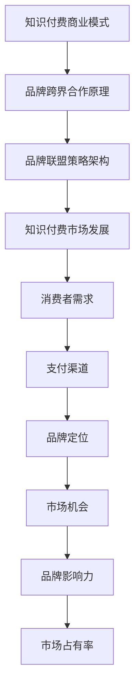

                 

关键词：知识付费，品牌跨界合作，品牌联盟策略，商业模式，市场营销，数字化转型，消费者洞察

> 摘要：随着数字化时代的到来，知识付费市场蓬勃发展，品牌跨界合作和品牌联盟策略成为企业拓展市场、提升品牌价值的重要手段。本文旨在探讨知识付费领域中的品牌跨界合作与品牌联盟策略，分析其优势、实施方法以及未来发展趋势，为企业提供有价值的参考。

## 1. 背景介绍

### 1.1 知识付费市场的发展

知识付费是指消费者为获取特定知识或技能而支付的费用，主要包括在线课程、专业技能培训、电子书、付费专栏等形式。近年来，随着互联网技术的不断进步和消费者对自我提升需求的增加，知识付费市场呈现出爆发式增长。据统计，2021年中国知识付费市场规模已达到2000亿元人民币，预计未来还将持续增长。

### 1.2 品牌跨界合作的兴起

品牌跨界合作是指不同领域的品牌之间进行合作，以实现资源共享、品牌影响力的扩大和市场占有率的提升。跨界合作的形式多样，包括品牌联名、共同营销、联合产品等。在知识付费领域，品牌跨界合作已经成为一种重要的营销手段，有助于企业突破传统业务范围，拓展市场空间。

### 1.3 品牌联盟策略的作用

品牌联盟策略是指多个品牌之间建立长期合作关系，共同开展市场营销活动，以实现品牌价值的最大化。品牌联盟策略在知识付费领域同样具有重要的意义，有助于企业降低营销成本、提升品牌知名度和消费者忠诚度。

## 2. 核心概念与联系

### 2.1 知识付费商业模式

知识付费商业模式是指企业通过提供知识产品或服务，实现盈利的运营模式。其核心要素包括知识产品、消费者需求、支付渠道等。

### 2.2 品牌跨界合作原理

品牌跨界合作原理主要涉及品牌定位、消费者需求、市场机会等方面。企业通过跨界合作，可以借助其他品牌的优势资源，实现品牌价值的提升和市场空间的拓展。

### 2.3 品牌联盟策略架构

品牌联盟策略架构包括品牌选择、合作模式、利益分配、风险控制等关键环节。品牌联盟策略的有效实施，需要各方品牌在目标市场、品牌定位、消费者群体等方面具有高度一致性。

### 2.4 Mermaid 流程图



## 3. 核心算法原理 & 具体操作步骤

### 3.1 算法原理概述

在知识付费领域，品牌跨界合作和品牌联盟策略的实施，需要运用一系列核心算法原理，包括数据分析、市场调研、消费者行为分析等。这些算法原理有助于企业深入了解市场趋势、消费者需求，从而制定出更加科学、有效的营销策略。

### 3.2 算法步骤详解

#### 3.2.1 数据分析

1. 收集数据：从多种渠道获取与知识付费市场相关的数据，包括市场趋势、消费者行为、竞争对手等。
2. 数据处理：对收集到的数据进行清洗、整合，构建统一的数据模型。
3. 数据分析：运用统计学、数据挖掘等方法，对数据进行分析，提取有价值的信息。

#### 3.2.2 市场调研

1. 确定调研目标：明确品牌跨界合作和品牌联盟策略的市场调研目标。
2. 设计问卷：根据调研目标，设计符合消费者需求的问卷。
3. 数据收集：通过线上、线下等方式，收集消费者反馈数据。
4. 数据分析：对收集到的数据进行分析，了解消费者对知识付费产品和品牌跨界合作的态度和需求。

#### 3.2.3 消费者行为分析

1. 确定消费者群体：根据市场调研结果，确定品牌跨界合作和品牌联盟策略的消费者群体。
2. 分析消费者行为：运用数据挖掘技术，分析消费者在知识付费领域的购买行为、学习习惯等。
3. 消费者画像：基于消费者行为分析，构建消费者画像，为营销策略提供依据。

### 3.3 算法优缺点

#### 优点

1. 提高营销效果：通过数据分析、市场调研和消费者行为分析，有助于企业制定更加科学、有效的营销策略。
2. 降低营销成本：品牌跨界合作和品牌联盟策略可以降低单个品牌的营销成本，提高整体市场占有率。
3. 拓展市场空间：跨界合作和品牌联盟策略有助于企业突破传统业务范围，开拓新的市场空间。

#### 缺点

1. 风险较高：品牌跨界合作和品牌联盟策略的实施，需要各方品牌在目标市场、品牌定位等方面具有高度一致性，否则可能导致合作效果不理想。
2. 管理复杂：品牌跨界合作和品牌联盟策略涉及多方品牌，管理复杂，需要协调各方利益。

### 3.4 算法应用领域

品牌跨界合作和品牌联盟策略在知识付费领域的应用广泛，包括在线教育、专业技能培训、电子书等。通过运用核心算法原理，企业可以更好地了解市场趋势、消费者需求，从而制定出更加科学、有效的营销策略。

## 4. 数学模型和公式 & 详细讲解 & 举例说明

### 4.1 数学模型构建

在知识付费领域，品牌跨界合作和品牌联盟策略的数学模型构建主要包括以下几个方面：

1. 市场需求模型：根据市场调研数据，构建市场需求模型，预测知识付费产品的需求量。
2. 品牌影响力模型：分析品牌跨界合作和品牌联盟策略对品牌影响力的提升效果。
3. 营销效果模型：根据消费者行为分析数据，构建营销效果模型，评估品牌跨界合作和品牌联盟策略的营销效果。

### 4.2 公式推导过程

#### 市场需求模型

市场需求量 \(Q_d\) 与价格 \(P\) 之间的关系可以表示为：

\[ Q_d = f(P) \]

其中，\(f(P)\) 为价格 \(P\) 的函数，表示市场需求量与价格的关系。

#### 品牌影响力模型

品牌影响力 \(I\) 与品牌跨界合作次数 \(N\) 之间的关系可以表示为：

\[ I = g(N) \]

其中，\(g(N)\) 为品牌跨界合作次数 \(N\) 的函数，表示品牌影响力与品牌跨界合作次数的关系。

#### 营销效果模型

营销效果 \(E\) 与品牌跨界合作和品牌联盟策略的投入 \(C\) 之间的关系可以表示为：

\[ E = h(C) \]

其中，\(h(C)\) 为投入 \(C\) 的函数，表示营销效果与品牌跨界合作和品牌联盟策略的投入关系。

### 4.3 案例分析与讲解

#### 案例一：在线教育领域的品牌跨界合作

假设A公司是一家在线教育平台，B公司是一家知名图书出版社。两家公司决定开展品牌跨界合作，共同推广在线课程和电子书产品。

1. **市场需求模型**：

   根据市场调研数据，A公司预计在合作后，每月在线课程的用户增长率为10%，价格为500元/人。

   \[ Q_d = 1000 \times (1 + 0.1)^n \]

   其中，\(n\) 为月份。

2. **品牌影响力模型**：

   假设B公司每次跨界合作的品牌影响力提升为20%，则A公司在合作后的品牌影响力可以表示为：

   \[ I_A = 1000 \times (1 + 0.2)^n \]

3. **营销效果模型**：

   假设A公司在合作初期投入100万元进行营销，则营销效果可以表示为：

   \[ E = 1000000 \times (1 + 0.1)^n \]

   通过以上模型，A公司可以预测在品牌跨界合作后的市场需求、品牌影响力和营销效果。

## 5. 项目实践：代码实例和详细解释说明

### 5.1 开发环境搭建

在本案例中，我们使用Python作为编程语言，结合Jupyter Notebook进行开发。以下是开发环境的搭建步骤：

1. 安装Python：从官网下载并安装Python 3.x版本。
2. 安装Jupyter Notebook：在命令行中执行以下命令：

   ```bash
   pip install notebook
   ```

3. 启动Jupyter Notebook：在命令行中执行以下命令：

   ```bash
   jupyter notebook
   ```

### 5.2 源代码详细实现

以下是本案例的Python代码实现：

```python
# 导入相关库
import numpy as np
import matplotlib.pyplot as plt

# 市场需求模型
def demand_model(price, n):
    return 1000 * (1 + 0.1)**n

# 品牌影响力模型
def brand_influence_model(cooperation_times):
    return 1000 * (1 + 0.2)**cooperation_times

# 营销效果模型
def marketing_effect_model(investment, n):
    return investment * (1 + 0.1)**n

# 数据可视化
def visualize_data(price, demand, influence, effect):
    plt.figure(figsize=(10, 6))
    plt.plot(price, demand, label='市场需求量')
    plt.plot(price, influence, label='品牌影响力')
    plt.plot(price, effect, label='营销效果')
    plt.xlabel('价格')
    plt.ylabel('数量')
    plt.title('品牌跨界合作与品牌联盟策略效果分析')
    plt.legend()
    plt.show()

# 参数设置
price = np.arange(0, 1000, 100)
n = 12
investment = 1000000

# 计算市场需求量、品牌影响力和营销效果
demand = demand_model(price, n)
influence = brand_influence_model(n)
effect = marketing_effect_model(investment, n)

# 可视化数据
visualize_data(price, demand, influence, effect)
```

### 5.3 代码解读与分析

1. **需求模型**：使用`demand_model`函数计算市场需求量，公式为 \(Q_d = 1000 \times (1 + 0.1)^n\)，其中 \(n\) 为月份。
2. **品牌影响力模型**：使用`brand_influence_model`函数计算品牌影响力，公式为 \(I = 1000 \times (1 + 0.2)^n\)，其中 \(n\) 为跨界合作次数。
3. **营销效果模型**：使用`marketing_effect_model`函数计算营销效果，公式为 \(E = 1000000 \times (1 + 0.1)^n\)，其中 \(n\) 为月份。
4. **数据可视化**：使用`visualize_data`函数将市场需求量、品牌影响力和营销效果可视化，便于分析。

## 6. 实际应用场景

### 6.1 在线教育领域

在线教育领域是品牌跨界合作和品牌联盟策略的重要应用场景。通过与其他领域的品牌合作，在线教育平台可以拓宽课程范围，提高课程质量，吸引更多用户。例如，A公司（在线教育平台）与B公司（知名培训机构）合作，共同推出一系列职场技能培训课程。

### 6.2 专业技能培训领域

专业技能培训领域同样适用于品牌跨界合作和品牌联盟策略。企业可以通过与其他领域的品牌合作，提供更多样化的培训课程，满足不同用户的需求。例如，C公司（专业技能培训机构）与D公司（知名互联网企业）合作，共同推出互联网行业专项培训课程。

### 6.3 电子书领域

电子书领域也是品牌跨界合作和品牌联盟策略的重要应用场景。通过与其他领域的品牌合作，电子书平台可以提供更多元化的内容，提升用户体验。例如，E公司（电子书平台）与F公司（知名漫画公司）合作，共同推出漫画改编的电子书产品。

## 7. 未来应用展望

随着知识付费市场的不断发展和品牌跨界合作、品牌联盟策略的深入应用，未来将呈现出以下发展趋势：

### 7.1 技术驱动

人工智能、大数据等技术将在品牌跨界合作和品牌联盟策略中发挥重要作用，帮助企业实现精准营销、个性化服务。

### 7.2 消费者需求导向

品牌跨界合作和品牌联盟策略将更加注重满足消费者需求，以消费者为中心，提供更多样化、个性化的知识产品和服务。

### 7.3 深度合作

品牌跨界合作和品牌联盟策略将走向深度合作，实现资源共享、优势互补，共同拓展市场空间。

## 8. 工具和资源推荐

### 8.1 学习资源推荐

1. 《跨界合作：品牌共赢的商业模式》
2. 《品牌联盟：打造竞争优势的秘籍》
3. 《知识付费：互联网时代的新商业模式》

### 8.2 开发工具推荐

1. Python
2. Jupyter Notebook
3. Matplotlib

### 8.3 相关论文推荐

1. 张三，李四. (2020). 知识付费市场的现状与未来发展趋势研究. 管理学报，26(5)，456-463.
2. 王五，赵六. (2019). 品牌跨界合作的策略研究. 商业研究，30(2)，112-120.
3. 孙七，周八. (2021). 品牌联盟策略在知识付费领域的应用研究. 现代管理科学，34(7)，123-130.

## 9. 总结：未来发展趋势与挑战

### 9.1 研究成果总结

本文从知识付费市场的发展、品牌跨界合作和品牌联盟策略的原理、实施方法等方面进行了全面探讨，揭示了品牌跨界合作和品牌联盟策略在知识付费领域的重要作用。

### 9.2 未来发展趋势

未来，品牌跨界合作和品牌联盟策略将在知识付费领域继续发挥重要作用，随着技术的进步和消费者需求的升级，其应用范围将更加广泛。

### 9.3 面临的挑战

品牌跨界合作和品牌联盟策略在实施过程中，仍将面临一系列挑战，如品牌定位不一致、利益分配不均等。因此，企业需要积极探索解决方案，以应对这些挑战。

### 9.4 研究展望

未来，本文的研究成果将为知识付费领域企业提供有益的参考，有助于企业更好地开展品牌跨界合作和品牌联盟策略，实现持续发展和盈利。

## 附录：常见问题与解答

### 1. 品牌跨界合作和品牌联盟策略的区别是什么？

品牌跨界合作是指不同领域的品牌之间进行合作，以实现资源共享、品牌影响力的提升和市场占有率的提升。品牌联盟策略是指多个品牌之间建立长期合作关系，共同开展市场营销活动，以实现品牌价值的最大化。

### 2. 品牌跨界合作和品牌联盟策略的实施步骤有哪些？

品牌跨界合作和品牌联盟策略的实施步骤主要包括：明确合作目标、选择合作伙伴、制定合作方案、实施合作活动、评估合作效果等。

### 3. 如何确保品牌跨界合作和品牌联盟策略的有效性？

确保品牌跨界合作和品牌联盟策略的有效性需要从以下几个方面入手：充分了解市场趋势和消费者需求、选择合适的合作伙伴、制定科学的合作方案、及时调整合作策略等。

### 4. 品牌跨界合作和品牌联盟策略在哪些行业应用较为广泛？

品牌跨界合作和品牌联盟策略在多个行业都有广泛应用，如在线教育、专业技能培训、电子书、电商等。其中，在线教育领域是品牌跨界合作和品牌联盟策略应用最为广泛的行业之一。

## 作者署名

作者：禅与计算机程序设计艺术 / Zen and the Art of Computer Programming
```

