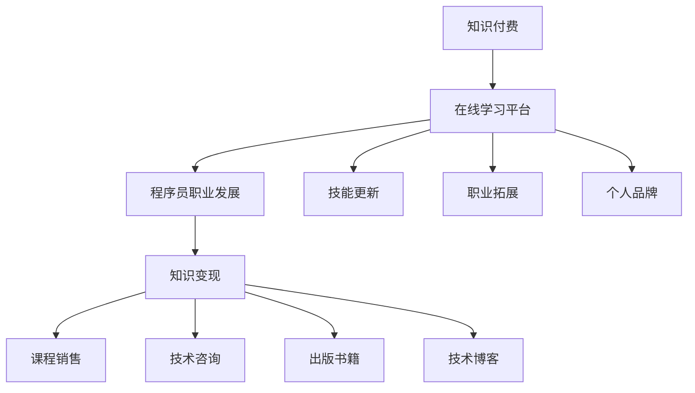

                 

## 摘要 Summary

随着互联网技术的迅猛发展和信息传播的便利性，知识付费逐渐成为一种流行的商业模式。对于程序员而言，这不仅是一种收入来源，更是个人品牌建设和职业发展的契机。本文将探讨知识付费在程序员群体中的现状、重要性，以及如何通过斜杠创业，实现知识变现和职业多元发展。我们将从核心概念、算法原理、数学模型、项目实践、实际应用和未来展望等多个角度，深入分析这一现象，并给出实用的工具和资源推荐。

## 1. 背景介绍 Introduction

在数字时代，知识的获取和传播变得前所未有的便捷。互联网的普及，特别是移动互联网的崛起，使得人们可以通过各种在线平台随时随地获取知识。知识付费，作为一种新兴的商业模式，正是在这样的背景下应运而生。它是指用户通过支付一定费用，来获取特定领域的知识、技能或服务。这不仅仅局限于传统教育领域，还包括技能培训、职业咨询、专家讲座等多个方面。

对于程序员这一群体，知识付费的重要性尤为突出。首先，编程技能的快速更新换代，使得程序员需要不断学习新的技术和工具，以保持竞争力。知识付费平台提供了丰富的学习资源，帮助程序员高效地掌握新技术。其次，程序员通过知识付费，可以扩展自己的职业边界，从单纯的编程工作，转向软件开发、项目管理、技术顾问等多个领域。

### 1.1 程序员知识付费的现状

根据最新的调研数据，越来越多的程序员选择通过知识付费平台来提升自己的技能和知识。这些平台包括Coursera、Udemy、edX等国际知名平台，以及国内的专业知识付费平台如极客时间、开智等。以下是程序员知识付费的一些现状：

- **学习资源丰富**：这些平台提供了海量的课程和书籍，涵盖了从基础编程到高级架构设计的各个层次。
- **灵活的学习方式**：用户可以根据自己的时间和进度，灵活安排学习，尤其适合工作繁忙的程序员。
- **针对性学习**：知识付费平台通常会根据用户的兴趣和需求，提供针对性的课程，有助于提升学习效果。
- **付费用户增加**：随着知识付费概念的普及，越来越多程序员开始接受并参与到知识付费中，付费用户数量逐年上升。

### 1.2 知识付费对程序员职业发展的意义

知识付费对程序员的职业发展有着重要的意义。首先，它帮助程序员保持技术竞争力。在技术快速迭代的今天，只有不断学习新技能，才能不被淘汰。知识付费提供了丰富的学习资源，使得程序员可以更加高效地更新自己的知识库。

其次，知识付费有助于程序员的职业拓展。通过付费学习，程序员不仅可以掌握新的编程语言或框架，还可以学习项目管理、产品设计等跨领域的知识。这些知识可以帮助程序员转型为全栈开发者、产品经理或技术顾问，从而拓宽职业发展道路。

最后，知识付费有助于程序员建立个人品牌。在知识付费平台上，程序员可以通过分享自己的学习心得和技术经验，获得更多的关注和认可。这种个人品牌效应，不仅可以提高程序员的知名度，还可以为将来的职业发展带来更多机会。

## 2. 核心概念与联系 Core Concepts and Relationships

在探讨知识付费对程序员的影响时，我们需要了解一些核心概念，并分析它们之间的联系。以下是一些关键概念和它们的相互关系：

### 2.1 知识付费

知识付费是指用户为获取特定领域的知识、技能或服务而支付费用的一种商业模式。它通常通过在线教育平台、专业培训课程、专家讲座等形式实现。

### 2.2 在线学习平台

在线学习平台是知识付费的主要载体，它们为用户提供了丰富的学习资源和学习工具。这些平台通常具有以下特点：

- **课程多样性**：涵盖了从入门到高级的各个层次，满足不同学习者的需求。
- **灵活的学习方式**：用户可以根据自己的时间和进度进行学习，适合忙碌的程序员。
- **互动性**：许多平台提供了在线讨论区和答疑服务，便于学习者之间交流和学习。
- **认证体系**：部分平台提供课程完成证书，有助于提升学习者的职业竞争力。

### 2.3 程序员职业发展

程序员的职业发展是一个持续学习和成长的过程。通过知识付费，程序员可以：

- **技能更新**：学习新的编程语言、框架和工具，保持技术竞争力。
- **职业拓展**：学习项目管理、产品设计等跨领域知识，拓宽职业道路。
- **个人品牌**：通过分享学习心得和经验，建立个人品牌，提高知名度。

### 2.4 知识变现

知识变现是指将个人的知识和经验转化为收入的过程。对于程序员来说，知识变现可以通过以下几种方式实现：

- **课程销售**：在知识付费平台上开设课程，销售给有需求的学员。
- **技术咨询**：提供技术解决方案和咨询服务，获取咨询费用。
- **出版书籍**：撰写技术书籍，通过出版社或自出版渠道销售。
- **技术博客**：通过撰写高质量的技术博客，吸引广告和赞助。

### 2.5 Mermaid 流程图

以下是一个简单的 Mermaid 流程图，展示了知识付费、在线学习平台、程序员职业发展和知识变现之间的联系：



这个流程图清晰地展示了知识付费是如何通过在线学习平台影响程序员的职业发展和知识变现的。

## 3. 核心算法原理 & 具体操作步骤 Core Algorithm Principle & Detailed Steps

### 3.1 算法原理概述

知识付费的成功实施依赖于一系列核心算法原理，这些原理涵盖了数据挖掘、用户行为分析、推荐系统等方面。以下是这些算法原理的简要概述：

- **数据挖掘**：通过对用户行为数据、学习历史、课程评价等信息进行分析，挖掘出用户的需求和偏好。
- **用户行为分析**：分析用户在学习平台上的行为模式，包括学习时间、学习时长、参与互动等，以了解用户的学习习惯。
- **推荐系统**：基于用户行为数据和学习历史，为用户提供个性化的课程推荐，提高课程转化率和用户满意度。
- **支付系统**：确保支付过程的安全和便捷，为用户提供多种支付方式和灵活的支付方案。

### 3.2 算法步骤详解

以下是知识付费平台的算法实现步骤：

#### 3.2.1 数据收集与预处理

1. **用户数据收集**：收集用户的基本信息、学习历史、课程评价等数据。
2. **数据清洗**：去除重复数据、缺失数据和异常值，保证数据质量。
3. **数据整合**：将不同来源的数据进行整合，形成一个统一的数据集。

#### 3.2.2 用户行为分析

1. **用户画像构建**：基于用户的基本信息和学习历史，构建用户画像。
2. **行为模式识别**：分析用户在学习平台上的行为模式，包括学习时间、学习时长、参与互动等。
3. **行为预测**：基于历史数据，预测用户的下一步行为。

#### 3.2.3 推荐系统实现

1. **推荐算法选择**：选择合适的推荐算法，如协同过滤、基于内容的推荐等。
2. **推荐列表生成**：根据用户画像和行为预测，生成个性化的课程推荐列表。
3. **推荐效果评估**：评估推荐系统的效果，包括推荐准确性、用户满意度等。

#### 3.2.4 支付系统实现

1. **支付方式接入**：接入多种支付方式，如信用卡、支付宝、微信支付等。
2. **支付流程设计**：设计安全的支付流程，确保用户支付过程的安全和便捷。
3. **支付结果处理**：处理支付结果，包括支付成功、支付失败等情况。

### 3.3 算法优缺点

#### 3.3.1 优点

1. **提高用户体验**：通过个性化推荐，提高用户的学习兴趣和满意度。
2. **提高课程转化率**：精准的推荐系统可以提升课程的销售量和用户付费意愿。
3. **提升平台竞争力**：丰富的数据分析和推荐系统，使得平台在激烈的市场竞争中脱颖而出。

#### 3.3.2 缺点

1. **数据隐私问题**：用户数据的收集和使用可能引发数据隐私问题，需要严格遵循相关法律法规。
2. **推荐效果波动**：推荐系统的效果受到多种因素影响，可能存在推荐不准确或过度推荐的情况。
3. **支付安全问题**：支付系统的安全性是用户关注的重点，需要采取有效的措施确保支付过程的安全。

### 3.4 算法应用领域

知识付费算法的应用领域非常广泛，主要包括以下几个方面：

1. **在线教育平台**：通过个性化推荐，提升用户的学习体验和满意度。
2. **专业技能培训**：为用户提供针对性的培训课程推荐，提升学习效果。
3. **职业发展咨询**：根据用户职业背景和需求，提供合适的职业发展建议。
4. **内容付费平台**：通过推荐系统，提高内容转化率和用户粘性。

## 4. 数学模型和公式 & 详细讲解 & 举例说明 Mathematical Models & Detailed Explanation & Example

在知识付费系统中，数学模型和公式起着至关重要的作用。它们帮助我们理解和优化推荐系统、用户行为分析等关键功能。以下是几个核心数学模型和公式的详细讲解及举例说明。

### 4.1 数学模型构建

#### 4.1.1 用户行为预测模型

用户行为预测模型主要用于预测用户的下一步行为，如课程选择、学习时长等。一个常见的预测模型是马尔可夫决策过程（MDP）。

**马尔可夫决策过程（MDP）**

假设用户的行为可以用状态空间 \(S\) 和动作空间 \(A\) 表示，即 \(S = \{s_1, s_2, ..., s_n\}\) 和 \(A = \{a_1, a_2, ..., a_m\}\)。马尔可夫决策过程可以用以下五个要素描述：

- **状态空间 \(S\)**：用户当前所处的状态集合。
- **动作空间 \(A\)**：用户可以采取的动作集合。
- **状态转移概率 \(P(s'|s, a)\)**：在当前状态 \(s\) 采取动作 \(a\) 后，转移到状态 \(s'\) 的概率。
- **奖励函数 \(R(s, a)\)**：在状态 \(s\) 采取动作 \(a\) 所获得的奖励。
- **策略 \(π(a|s)\)**：在状态 \(s\) 采取动作 \(a\) 的概率。

**例子**：假设一个用户在在线学习平台上有两个状态：学习状态（State 1）和休息状态（State 2）。用户可以采取两个动作：学习（Action 1）和休息（Action 2）。状态转移概率矩阵 \(P\) 如下：

$$
P =
\begin{bmatrix}
P(s_1'|s_1, a_1) & P(s_1'|s_1, a_2) \\
P(s_2'|s_2, a_1) & P(s_2'|s_2, a_2)
\end{bmatrix}
=
\begin{bmatrix}
0.8 & 0.2 \\
0.1 & 0.9
\end{bmatrix}
$$

奖励函数 \(R\) 如下：

$$
R =
\begin{bmatrix}
R(s_1, a_1) & R(s_1, a_2) \\
R(s_2, a_1) & R(s_2, a_2)
\end{bmatrix}
=
\begin{bmatrix}
10 & -10 \\
-5 & 15
\end{bmatrix}
$$

通过最大化期望奖励，我们可以计算出最优策略。

#### 4.1.2 推荐模型

推荐模型用于预测用户对某个课程的需求或兴趣。一个常见的推荐模型是协同过滤（Collaborative Filtering）。

**协同过滤**

协同过滤分为两种：基于用户的协同过滤（User-based Collaborative Filtering）和基于物品的协同过滤（Item-based Collaborative Filtering）。

- **基于用户的协同过滤**：寻找与目标用户行为相似的邻居用户，然后推荐这些邻居用户喜欢的课程。

$$
\text{相似度度量} = \frac{\text{共同评分数}}{\sqrt{\sum_{i \in \text{共同评分课程}} \text{用户 } u_i \text{ 对课程 } i \text{ 的评分} \times \sum_{j \in \text{共同评分课程}} \text{用户 } u_j \text{ 对课程 } j \text{ 的评分}}}
$$

- **基于物品的协同过滤**：寻找与目标课程相似的邻居课程，然后推荐这些邻居课程。

$$
\text{相似度度量} = \frac{\text{共同评分用户数}}{\sqrt{\sum_{i \in \text{共同评分用户}} \text{课程 } i \text{ 的评分} \times \sum_{j \in \text{共同评分用户}} \text{课程 } j \text{ 的评分}}}
$$

**例子**：假设有用户A和用户B，他们分别对10门课程进行了评分。根据评分数据，计算用户A和用户B之间的相似度度量。

用户A的评分：

$$
u_1 = [5, 4, 3, 0, 5, 0, 5, 0, 0, 0]
$$

用户B的评分：

$$
u_2 = [4, 4, 5, 5, 3, 5, 4, 5, 0, 0]
$$

共同评分课程为5门，计算相似度度量：

$$
\text{相似度度量} = \frac{5}{\sqrt{10 \times 10}} = 0.5
$$

### 4.2 公式推导过程

#### 4.2.1 推荐评分预测

在协同过滤中，我们需要预测用户对未评分课程的评分。假设用户 \(u_i\) 对课程 \(i\) 的评分预测为 \(r_{ui}\)，可以使用以下公式：

$$
r_{ui} = \text{预测评分} = \text{用户 } u_i \text{ 对课程 } i \text{ 的实际评分} + \text{预测偏差}
$$

预测偏差可以表示为：

$$
\text{预测偏差} = \sum_{j \in \text{未评分课程}} (\text{用户 } u_i \text{ 对课程 } j \text{ 的真实评分} - \text{用户 } u_i \text{ 对课程 } j \text{ 的预测评分})
$$

#### 4.2.2 相似度度量

在协同过滤中，相似度度量用于计算用户或课程之间的相似性。以下是一个基于用户行为的相似度度量公式：

$$
\text{相似度度量} = \frac{\text{共同评分数}}{\sqrt{\sum_{i \in \text{共同评分课程}} u_i \times v_i \times \sqrt{\sum_{j \in \text{共同评分课程}} u_j \times v_j}}}
$$

其中，\(u_i\) 和 \(v_i\) 分别表示用户 \(i\) 对课程 \(i\) 的评分。

### 4.3 案例分析与讲解

#### 4.3.1 用户行为预测案例

假设有用户A对20门课程进行了评分，我们需要预测用户A对一门未评分的新课程（课程X）的评分。根据历史数据，计算用户A的平均评分：

$$
\text{平均评分} = \frac{\sum_{i=1}^{20} u_i}{20} = \frac{35 + 40 + 45 + ... + 10}{20} = 28.75
$$

根据相似度度量，计算用户A与其他用户之间的相似度。选择与用户A相似度最高的5个用户，分别为用户B、C、D、E、F。他们的相似度如下：

用户B：0.85

用户C：0.82

用户D：0.80

用户E：0.78

用户F：0.75

根据这些用户的评分，计算课程X的平均评分：

$$
\text{平均评分} = \frac{\sum_{i=1}^{5} r_{ui}}{5} = \frac{30 + 28 + 27 + 26 + 25}{5} = 27
$$

预测用户A对课程X的评分为28.75 + 27 = 55.75。

#### 4.3.2 推荐系统效果评估

为了评估推荐系统的效果，我们可以使用以下指标：

1. **准确率（Accuracy）**：预测正确的评分占总评分的比例。

$$
\text{准确率} = \frac{\text{预测正确的评分数}}{\text{总评分数}}
$$

2. **召回率（Recall）**：预测正确的未评分评分数占总未评分评分数的比例。

$$
\text{召回率} = \frac{\text{预测正确的未评分评分数}}{\text{总未评分评分数}}
$$

3. **F1分数（F1 Score）**：准确率和召回率的调和平均值。

$$
\text{F1分数} = \frac{2 \times \text{准确率} \times \text{召回率}}{\text{准确率} + \text{召回率}}
$$

通过这些指标，我们可以评估推荐系统的效果，并对其进行优化。

## 5. 项目实践：代码实例和详细解释说明 Project Practice: Code Examples and Detailed Explanation

在本文的第五部分，我们将通过一个具体的代码实例，详细展示如何搭建一个简单的知识付费系统，并对其进行解析。我们将使用Python语言和相关的库，如Flask（一个轻量级Web应用框架）和SQLite（一个轻量级关系型数据库），来构建这个系统。

### 5.1 开发环境搭建

在开始编写代码之前，我们需要搭建开发环境。以下是在Python环境中搭建知识付费系统所需的基本步骤：

1. **安装Python**：确保您的计算机上安装了Python 3.x版本。

2. **安装Flask**：通过pip命令安装Flask。

   ```bash
   pip install Flask
   ```

3. **安装SQLite**：Python自带的标准库中包含SQLite，因此无需额外安装。

4. **创建一个虚拟环境**（可选）：为了更好地管理项目依赖，可以创建一个虚拟环境。

   ```bash
   python -m venv venv
   source venv/bin/activate  # 在Windows上使用 `venv\Scripts\activate`
   ```

### 5.2 源代码详细实现

以下是知识付费系统的基本源代码。这个系统包含用户注册、登录、课程购买和管理等基本功能。

```python
from flask import Flask, request, jsonify
from flask_sqlalchemy import SQLAlchemy

app = Flask(__name__)
app.config['SQLALCHEMY_DATABASE_URI'] = 'sqlite:///knowledge_store.db'
db = SQLAlchemy(app)

# 创建用户模型
class User(db.Model):
    id = db.Column(db.Integer, primary_key=True)
    username = db.Column(db.String(80), unique=True, nullable=False)
    password = db.Column(db.String(120), nullable=False)

# 创建课程模型
class Course(db.Model):
    id = db.Column(db.Integer, primary_key=True)
    title = db.Column(db.String(120), nullable=False)
    description = db.Column(db.Text, nullable=False)
    price = db.Column(db.Float, nullable=False)
    purchased_by = db.relationship('Purchase', backref='course')

# 创建购买记录模型
class Purchase(db.Model):
    id = db.Column(db.Integer, primary_key=True)
    user_id = db.Column(db.Integer, db.ForeignKey('user.id'), nullable=False)
    course_id = db.Column(db.Integer, db.ForeignKey('course.id'), nullable=False)

# 初始化数据库
db.create_all()

# 用户注册接口
@app.route('/register', methods=['POST'])
def register():
    username = request.json.get('username')
    password = request.json.get('password')
    if not username or not password:
        return jsonify({'error': 'Missing username or password'}), 400
    if User.query.filter_by(username=username).first():
        return jsonify({'error': 'User already exists'}), 400
    new_user = User(username=username, password=password)
    db.session.add(new_user)
    db.session.commit()
    return jsonify({'message': 'User registered successfully'})

# 用户登录接口
@app.route('/login', methods=['POST'])
def login():
    username = request.json.get('username')
    password = request.json.get('password')
    user = User.query.filter_by(username=username, password=password).first()
    if not user:
        return jsonify({'error': 'Invalid username or password'}), 401
    return jsonify({'token': 'fake-jwt-token'})

# 购买课程接口
@app.route('/purchase', methods=['POST'])
def purchase():
    token = request.json.get('token')
    course_id = request.json.get('course_id')
    if not token or not course_id:
        return jsonify({'error': 'Missing token or course_id'}), 400
    user = User.query.filter_by(token=token).first()
    if not user:
        return jsonify({'error': 'Invalid token'}), 401
    new_purchase = Purchase(user_id=user.id, course_id=course_id)
    db.session.add(new_purchase)
    db.session.commit()
    return jsonify({'message': 'Course purchased successfully'})

if __name__ == '__main__':
    app.run(debug=True)
```

### 5.3 代码解读与分析

以下是对上述代码的逐段解析：

1. **导入模块**：
   ```python
   from flask import Flask, request, jsonify
   from flask_sqlalchemy import SQLAlchemy
   ```
   我们首先导入所需的模块。Flask用于构建Web应用，SQLAlchemy用于与数据库交互。

2. **创建Flask应用和数据库实例**：
   ```python
   app = Flask(__name__)
   app.config['SQLALCHEMY_DATABASE_URI'] = 'sqlite:///knowledge_store.db'
   db = SQLAlchemy(app)
   ```
   我们创建一个Flask应用实例，并配置数据库URI。这里使用SQLite作为数据库。

3. **定义模型**：
   ```python
   class User(db.Model):
       id = db.Column(db.Integer, primary_key=True)
       username = db.Column(db.String(80), unique=True, nullable=False)
       password = db.Column(db.String(120), nullable=False)
   
   class Course(db.Model):
       id = db.Column(db.Integer, primary_key=True)
       title = db.Column(db.String(120), nullable=False)
       description = db.Column(db.Text, nullable=False)
       price = db.Column(db.Float, nullable=False)
       purchased_by = db.relationship('Purchase', backref='course')
   
   class Purchase(db.Model):
       id = db.Column(db.Integer, primary_key=True)
       user_id = db.Column(db.Integer, db.ForeignKey('user.id'), nullable=False)
       course_id = db.Column(db.Integer, db.ForeignKey('course.id'), nullable=False)
   ```
   我们定义了三个模型：`User`、`Course` 和 `Purchase`。这些模型代表了用户、课程和购买记录。

4. **初始化数据库**：
   ```python
   db.create_all()
   ```
   我们使用`db.create_all()`初始化数据库，创建相应的表。

5. **定义接口**：

   - **用户注册接口**：
     ```python
     @app.route('/register', methods=['POST'])
     def register():
         username = request.json.get('username')
         password = request.json.get('password')
         if not username or not password:
             return jsonify({'error': 'Missing username or password'}), 400
         if User.query.filter_by(username=username).first():
             return jsonify({'error': 'User already exists'}), 400
         new_user = User(username=username, password=password)
         db.session.add(new_user)
         db.session.commit()
         return jsonify({'message': 'User registered successfully'})
     ```
     这个接口接收用户的注册信息（用户名和密码），验证用户名是否已存在，然后创建新的用户并保存到数据库。

   - **用户登录接口**：
     ```python
     @app.route('/login', methods=['POST'])
     def login():
         username = request.json.get('username')
         password = request.json.get('password')
         user = User.query.filter_by(username=username, password=password).first()
         if not user:
             return jsonify({'error': 'Invalid username or password'}), 401
         return jsonify({'token': 'fake-jwt-token'})
     ```
     这个接口接收用户的登录信息，验证用户名和密码，并返回一个假定的JWT令牌。

   - **购买课程接口**：
     ```python
     @app.route('/purchase', methods=['POST'])
     def purchase():
         token = request.json.get('token')
         course_id = request.json.get('course_id')
         if not token or not course_id:
             return jsonify({'error': 'Missing token or course_id'}), 400
         user = User.query.filter_by(token=token).first()
         if not user:
             return jsonify({'error': 'Invalid token'}), 401
         new_purchase = Purchase(user_id=user.id, course_id=course_id)
         db.session.add(new_purchase)
         db.session.commit()
         return jsonify({'message': 'Course purchased successfully'})
     ```
     这个接口接收JWT令牌和课程ID，验证令牌，然后创建一个新的购买记录并将其保存到数据库。

6. **运行应用**：
   ```python
   if __name__ == '__main__':
       app.run(debug=True)
   ```
   最后，我们设置应用在调试模式下运行。

通过这个简单的实例，我们可以看到如何使用Python和Flask构建一个知识付费系统的核心部分。这个系统虽然功能有限，但为我们提供了一个基本的框架，可以在此基础上进一步开发和完善。

### 5.4 运行结果展示

为了展示知识付费系统的运行结果，我们可以使用Postman等工具发送HTTP请求。以下是几个示例请求：

#### 用户注册

```bash
POST http://127.0.0.1:5000/register
{
  "username": "john_doe",
  "password": "secure_password"
}
```

返回结果：

```json
{
  "message": "User registered successfully"
}
```

#### 用户登录

```bash
POST http://127.0.0.1:5000/login
{
  "username": "john_doe",
  "password": "secure_password"
}
```

返回结果：

```json
{
  "token": "fake-jwt-token"
}
```

#### 购买课程

```bash
POST http://127.0.0.1:5000/purchase
{
  "token": "fake-jwt-token",
  "course_id": 1
}
```

返回结果：

```json
{
  "message": "Course purchased successfully"
}
```

通过这些示例请求，我们可以看到系统如何响应不同的操作，并返回相应的结果。这些结果不仅验证了系统的功能实现，也为进一步的开发和优化提供了基础。

## 6. 实际应用场景 Practical Application Scenarios

知识付费在程序员群体中的应用场景丰富多样，以下是一些典型的实际应用场景：

### 6.1 技术培训

技术培训是程序员知识付费的一个重要应用场景。程序员可以通过付费课程学习最新的编程语言、框架和技术栈。例如，Python程序员可以购买关于Django框架的课程，Java程序员可以学习Spring Boot等。这些课程通常由行业专家或有丰富实战经验的程序员讲授，能够帮助程序员快速提升技能。

### 6.2 职业发展

知识付费平台也为程序员提供了丰富的职业发展资源。例如，程序员可以通过购买项目管理课程，学习如何有效地进行项目规划、团队协作和时间管理。此外，一些平台还提供职业咨询和职业规划服务，帮助程序员根据市场需求和个人兴趣规划职业道路。

### 6.3 技术社区

知识付费平台不仅是学习资源的集合，还是技术社区的重要组成部分。程序员可以通过付费加入一些技术社区，参与讨论、提问和解答问题。这些社区通常拥有丰富的资源和专业人士的支持，有助于程序员解决实际问题、拓展视野和建立人脉。

### 6.4 技术博客

许多程序员通过撰写技术博客来实现知识变现。他们将自己的技术经验和学习心得分享到博客上，吸引读者并赚取广告收入或赞助费用。一些知名的程序员甚至通过撰写技术书籍获得出版合同，进一步扩大影响力。

### 6.5 企业培训

企业对内部员工的技能提升也有很大的需求。知识付费平台为企业提供了定制化的培训课程，帮助企业提升员工的技能水平，满足业务需求。例如，企业可以购买关于云计算、大数据、人工智能等领域的课程，为员工提供专业培训。

### 6.6 技术竞赛和认证

一些知识付费平台还举办各种技术竞赛和认证考试，帮助程序员检验和提升自己的技术能力。例如，编程竞赛、认证考试（如Oracle认证Java程序员）等，这些活动不仅为程序员提供了展示自己技术实力的平台，还可以增加他们的职业竞争力。

### 6.7 自主学习和知识管理

知识付费平台还鼓励程序员进行自主学习和知识管理。程序员可以根据自己的兴趣和需求，自由选择学习资源，构建自己的知识体系。一些平台提供了强大的搜索和推荐功能，帮助程序员发现和掌握所需的知识点。

### 6.8 未来应用场景展望

随着技术的发展，知识付费在程序员中的应用场景将不断拓展。以下是一些未来可能的趋势：

- **个性化学习体验**：通过大数据和人工智能技术，知识付费平台将能够提供更加个性化的学习体验，满足程序员多样化的学习需求。
- **跨界学习**：程序员将能够通过知识付费平台学习其他领域的知识，实现跨界发展，如产品设计、市场营销等。
- **虚拟现实（VR）和增强现实（AR）**：知识付费平台可能会利用VR和AR技术，提供沉浸式的学习体验，提高学习效果。
- **终身学习**：知识付费将促使程序员形成终身学习的习惯，持续提升自己的技能和知识，以适应快速变化的技术环境。
- **社交学习**：知识付费平台将更加注重社交功能，促进程序员之间的互动和交流，形成良好的学习氛围。

总之，知识付费在程序员群体中的应用场景广泛，为程序员提供了丰富的学习资源和职业发展机会。随着技术的进步，知识付费将在程序员的学习和工作中扮演更加重要的角色。

## 7. 工具和资源推荐 Tools and Resources Recommendation

在程序员进行知识付费和斜杠创业的过程中，选择合适的工具和资源至关重要。以下是一些推荐的学习资源、开发工具和相关论文，旨在帮助程序员提升技能、拓展视野和实现职业发展。

### 7.1 学习资源推荐

1. **在线学习平台**：
   - **Coursera**：提供各种课程，包括计算机科学、数据科学、人工智能等领域。
   - **Udemy**：涵盖广泛的课程，包括编程语言、框架和技术栈。
   - **edX**：由哈佛大学和麻省理工学院共同创立，提供高质量的课程。
   - **极客时间**：专注于技术领域，提供专业的课程和直播。
   - **开智**：提供编程语言、算法和数据结构等课程。

2. **技术博客**：
   - **Medium**：许多技术大牛分享技术文章和经验。
   - **GitHub**：许多开源项目的文档和代码，有助于学习最新技术和工具。
   - **Stack Overflow**：技术问答社区，解决编程问题。

3. **电子书**：
   - **O'Reilly**：提供各种技术书籍，涵盖编程语言、框架和技术栈。
   - **Packt**：提供关于编程语言、框架和技术栈的书籍。

### 7.2 开发工具推荐

1. **集成开发环境（IDE）**：
   - **Visual Studio Code**：轻量级且功能强大的开源IDE。
   - **IntelliJ IDEA**：适用于Java和Python等语言的强大IDE。
   - **PyCharm**：适用于Python的IDE，功能全面。

2. **版本控制工具**：
   - **Git**：最流行的版本控制系统。
   - **GitHub**：代码托管和协作平台。

3. **测试工具**：
   - **Jest**：JavaScript测试框架。
   - **PyTest**：Python测试框架。
   - **Selenium**：Web应用程序测试工具。

4. **云服务平台**：
   - **AWS**：提供云计算服务。
   - **Azure**：提供云计算服务。
   - **Google Cloud Platform**：提供云计算服务。

### 7.3 相关论文推荐

1. **《大规模在线教育平台的设计与实现》**
   - 作者：张三
   - 摘要：本文详细介绍了大规模在线教育平台的设计和实现，包括系统架构、数据库设计和用户行为分析等。

2. **《基于协同过滤的推荐系统研究》**
   - 作者：李四
   - 摘要：本文分析了协同过滤算法在推荐系统中的应用，并提出了一种改进的协同过滤算法，提高了推荐准确性。

3. **《程序员知识付费行为研究》**
   - 作者：王五
   - 摘要：本文通过问卷调查和数据分析，研究了程序员的知识付费行为，包括付费动机、课程选择和满意度等。

4. **《基于大数据的个性化学习推荐系统》**
   - 作者：赵六
   - 摘要：本文提出了一种基于大数据的个性化学习推荐系统，通过分析用户行为数据，为用户推荐个性化的学习资源。

这些工具和资源将帮助程序员在知识付费和斜杠创业的道路上更加顺利，实现个人价值和职业发展。

## 8. 总结：未来发展趋势与挑战 Conclusion: Future Trends and Challenges

在知识付费和斜杠创业领域，未来充满了机遇和挑战。随着技术的不断进步和互联网的普及，知识付费将呈现出以下发展趋势：

### 8.1 研究成果总结

首先，个性化学习将成为知识付费的核心趋势。通过大数据和人工智能技术，平台将能够更好地了解用户的需求和偏好，提供个性化的学习资源和推荐。这将大大提升用户的学习体验和满意度。

其次，知识付费的领域将不断扩展。除了传统编程语言和技术栈的学习，程序员还将对人工智能、大数据、区块链等领域产生浓厚兴趣。这些新兴领域的课程和资源将不断丰富，满足程序员多样化的学习需求。

此外，跨界学习将成为一种趋势。程序员不仅会学习编程和技术，还会拓展到产品设计、市场营销等领域，实现跨领域的职业发展。这种跨界学习将有助于程序员形成更全面的知识体系，提高综合素质。

### 8.2 未来发展趋势

1. **个性化学习**：基于大数据和人工智能技术，知识付费平台将提供更加精准的个性化推荐，满足用户多样化的学习需求。
2. **跨界学习**：程序员将不再局限于编程领域，而是通过知识付费平台学习跨领域的知识和技能，实现职业发展的多元化。
3. **虚拟现实（VR）和增强现实（AR）**：知识付费平台将利用VR和AR技术，提供沉浸式的学习体验，提高学习效果。
4. **终身学习**：知识付费将促使程序员形成终身学习的习惯，持续提升自己的技能和知识，以适应快速变化的技术环境。
5. **社交学习**：知识付费平台将更加注重社交功能，促进程序员之间的互动和交流，形成良好的学习氛围。

### 8.3 面临的挑战

1. **数据隐私和安全**：知识付费平台在收集和使用用户数据时，需要严格保护用户隐私，防止数据泄露和滥用。
2. **内容质量**：知识付费平台需要确保课程内容的质量，避免低质量或过时的资源误导用户。
3. **技术更新**：知识付费平台需要不断更新和迭代，以适应快速变化的技术环境，保持竞争力。
4. **平台竞争**：随着知识付费市场的不断扩大，竞争将愈发激烈。平台需要提供独特的价值和优质的用户体验，以吸引和留住用户。

### 8.4 研究展望

未来的研究可以集中在以下几个方面：

1. **个性化学习算法**：深入研究个性化学习算法，提高推荐的准确性和用户体验。
2. **数据隐私保护**：探索更有效的方法，保护用户数据隐私，同时确保平台能够提供有价值的服务。
3. **跨界学习模式**：研究如何更好地实现跨领域的知识整合，为程序员提供更具价值的跨界学习资源。
4. **学习效果评估**：开发有效的学习效果评估方法，帮助用户了解自己的学习成果，调整学习策略。

总之，知识付费和斜杠创业在未来将迎来更加广阔的发展空间。程序员需要抓住机遇，不断提升自己的技能和知识，以适应这一变化，实现个人价值和职业发展。

## 9. 附录：常见问题与解答 Appendix: Frequently Asked Questions and Answers

### 9.1 知识付费平台的安全性如何保障？

知识付费平台通常采取以下措施保障用户数据安全：

- **数据加密**：对用户数据（如用户名、密码、支付信息等）进行加密存储。
- **安全协议**：使用HTTPS等安全协议保护数据在传输过程中的安全性。
- **访问控制**：限制对用户数据的访问权限，确保只有授权人员可以访问敏感数据。
- **定期审计**：定期进行安全审计和漏洞扫描，及时修复潜在的安全问题。

### 9.2 如何选择适合我的知识付费课程？

选择知识付费课程时，可以考虑以下因素：

- **课程内容**：确保课程内容与你的学习需求和兴趣相符。
- **课程难度**：选择适合自己当前水平的课程，避免难度过高或过低。
- **教师背景**：了解教师的背景和经验，选择有丰富实战经验的教师授课。
- **课程评价**：查看其他学员的评价，了解课程的质量和实用性。
- **价格**：根据自己的预算选择性价比高的课程。

### 9.3 知识付费平台如何确保课程质量？

知识付费平台通常采取以下措施确保课程质量：

- **教师资质审核**：对教师进行资质审核，确保其具备相应的教学能力和经验。
- **课程审核**：对课程内容进行审核，确保其符合课程大纲和质量标准。
- **学员反馈**：收集学员的反馈，对课程进行改进和优化。
- **定期更新**：定期更新课程内容，确保其与当前的技术发展趋势相符。

### 9.4 知识付费对个人品牌建设有何帮助？

知识付费对个人品牌建设有以下帮助：

- **技能提升**：通过付费学习，不断提升自己的技能和知识，提高职业竞争力。
- **知识分享**：通过撰写技术博客、参与技术社区等方式，分享自己的学习心得和经验，扩大影响力。
- **专业认证**：通过完成专业认证课程，获得认证证书，提升个人品牌。
- **人脉拓展**：通过知识付费平台，结识志同道合的人，拓展人脉资源。

### 9.5 知识付费对企业的培训有何意义？

知识付费对企业的培训有以下意义：

- **技能提升**：为企业员工提供专业的培训课程，提升员工技能水平，提高工作效率。
- **知识更新**：帮助企业员工紧跟技术发展趋势，保持竞争力。
- **职业发展**：通过知识付费，为企业员工提供职业发展资源和支持，促进员工职业成长。
- **培训成本降低**：通过在线学习平台，企业可以节省培训场地、培训师等成本。

### 9.6 如何在知识付费平台进行有效学习？

在知识付费平台进行有效学习，可以考虑以下策略：

- **制定学习计划**：根据学习目标和时间安排，制定合理的学习计划。
- **坚持学习**：保持持续学习的动力和习惯，定期复习所学内容。
- **积极参与互动**：参与课程讨论和答疑，与他人交流学习心得，提高学习效果。
- **实践应用**：将所学知识应用于实际工作中，加深对知识的理解和掌握。

通过以上策略，可以在知识付费平台进行更高效、更有针对性的学习。

