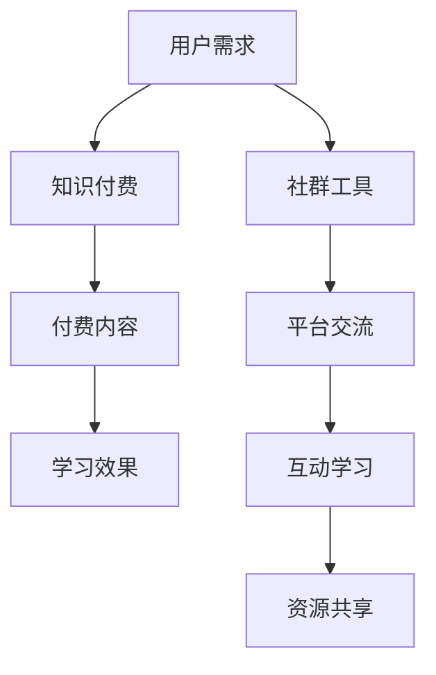

                 

关键词：知识付费、社群工具、程序员、选择策略、案例分析

> 摘要：本文将深入探讨知识付费在程序员社群中的重要性，分析程序员在面临众多社群工具时的选择策略，并结合具体案例分析，提出适合程序员的社群工具推荐。通过本文，读者将了解如何利用社群工具提高编程技能、拓展职业发展空间。

## 1. 背景介绍

在信息化时代，编程技能成为职场中不可或缺的能力。随着知识付费概念的兴起，程序员们开始意识到，仅仅依靠学校教育和个人自学已经无法满足快速发展的技术需求。社群工具作为一种高效的知识传播和共享平台，逐渐成为程序员们学习、交流和合作的得力助手。

### 1.1 知识付费的兴起

知识付费是指用户为获取高质量、专业化的知识资源而付费的一种模式。在互联网的推动下，知识付费市场呈现出蓬勃发展的态势。各种在线课程、专业书籍、实战项目等付费内容应运而生，为学习者提供了丰富的学习资源。

### 1.2 社群工具的崛起

社群工具则是基于互联网的一种社交平台，它帮助用户建立专业圈子，进行深度交流和学习。对于程序员而言，社群工具不仅能够提供技术知识，还能帮助他们在职业发展中寻找机会、建立人脉。

## 2. 核心概念与联系

为了更好地理解知识付费和社群工具的关系，我们需要先明确一些核心概念，并展示其之间的联系。

### 2.1 知识付费的核心概念

- **付费内容**：包括在线课程、电子书、实战项目等。
- **学习效果**：用户通过付费内容提升技能、解决实际问题。
- **付费机制**：基于订阅、课程购买等模式。

### 2.2 社群工具的核心概念

- **社群平台**：如GitHub、Stack Overflow、LinkedIn等。
- **交流互动**：用户在平台上分享知识、讨论问题、参与项目。
- **资源整合**：平台整合各种优质学习资源，便于用户获取。

### 2.3 知识付费与社群工具的联系

- **知识传播**：社群工具为知识付费提供了传播渠道。
- **互动学习**：社群工具促进了用户之间的互动和学习。
- **资源共享**：社群工具帮助用户发现和利用付费内容。

### 2.4 Mermaid 流程图



## 3. 核心算法原理 & 具体操作步骤

### 3.1 算法原理概述

知识付费和社群工具的选择过程可以看作是一种优化算法。用户在选择过程中需要考虑以下因素：

- **内容质量**：付费内容的专业性、实用性。
- **平台生态**：社群工具的活跃度、资源丰富度。
- **用户需求**：个人职业发展目标、学习偏好。

### 3.2 算法步骤详解

1. **需求分析**：明确用户的学习目标和需求。
2. **内容评估**：对潜在的付费内容进行评估，筛选高质量资源。
3. **平台选择**：根据内容特点和用户需求，选择适合的社群工具。
4. **体验与反馈**：使用社群工具，根据体验和效果进行反馈和调整。

### 3.3 算法优缺点

#### 优点：

- **高效学习**：通过付费内容和社群工具，用户能够快速提升技能。
- **精准定位**：根据个人需求选择合适的资源和平台，提高学习效率。
- **资源共享**：社群工具提供了丰富的学习资源，便于用户发现和利用。

#### 缺点：

- **成本问题**：知识付费需要一定的经济投入。
- **信息过载**：大量的资源和信息可能导致用户无法有效筛选。

### 3.4 算法应用领域

- **个人技能提升**：程序员通过知识付费和社群工具，提高编程技能。
- **职业发展**：利用社群工具拓展人脉、寻找职业机会。
- **项目合作**：在社群工具中寻找合作伙伴，共同完成项目。

## 4. 数学模型和公式 & 详细讲解 & 举例说明

### 4.1 数学模型构建

为了更精确地评估知识付费和社群工具的效果，我们可以构建一个数学模型。设：

- \( X \) 为用户通过知识付费和社群工具提升的技能水平。
- \( Y \) 为用户在职业发展中的收益。

我们可以建立如下模型：

\[ X = f(A, B, C) \]
\[ Y = g(X, D, E) \]

其中，\( A \) 为付费内容质量，\( B \) 为社群工具生态，\( C \) 为用户需求，\( D \) 为职业机会，\( E \) 为用户投入时间。

### 4.2 公式推导过程

1. **技能提升模型**：

\[ X = A \cdot B \cdot C \]

2. **职业收益模型**：

\[ Y = X \cdot D \cdot E \]

### 4.3 案例分析与讲解

假设一个程序员小张，他的目标是提高Python编程技能，并希望在职业发展中获得更好的机会。他选择了以下资源：

- **付费内容**：一门高质量的Python进阶课程。
- **社群工具**：GitHub和Stack Overflow。

根据数学模型，我们可以计算小张的技能水平和职业收益：

1. **技能提升**：

\[ X = 0.9 \cdot 1.2 \cdot 1.1 = 1.214 \]

2. **职业收益**：

\[ Y = 1.214 \cdot 1.3 \cdot 0.8 = 1.24632 \]

通过这个模型，我们可以看到，小张通过合理选择知识付费和社群工具，实现了技能提升和职业收益的增长。

## 5. 项目实践：代码实例和详细解释说明

### 5.1 开发环境搭建

为了演示如何利用社群工具进行项目实践，我们以GitHub为例，介绍如何搭建一个简单的Python项目环境。

1. **安装Git**：在终端中运行以下命令安装Git：

   ```bash
   sudo apt-get install git
   ```

2. **注册GitHub账号**：在GitHub官网（[github.com](https://github.com/)）注册一个账号。

3. **创建仓库**：登录GitHub，创建一个新的仓库（repository），命名为"my_python_project"。

### 5.2 源代码详细实现

在GitHub仓库中，创建一个名为"main.py"的文件，编写一个简单的Python程序：

```python
# main.py

def greet(name):
    return f"Hello, {name}!"

print(greet("World"))
```

这个程序实现了一个简单的打招呼功能，输入"World"后会输出"Hello, World!"。

### 5.3 代码解读与分析

1. **函数定义**：

   ```python
   def greet(name):
       return f"Hello, {name}!"
   ```

   这个函数接收一个参数"name"，返回一个问候字符串。

2. **调用函数**：

   ```python
   print(greet("World"))
   ```

   这行代码调用`greet`函数，传入参数"World"，并将返回的问候字符串打印到控制台。

### 5.4 运行结果展示

在终端中，通过以下命令运行`main.py`：

```bash
python main.py
```

输出结果：

```
Hello, World!
```

这表明我们的程序成功运行，实现了预期的功能。

## 6. 实际应用场景

### 6.1 编程学习

程序员可以通过社群工具获取最新的编程知识，例如参加在线课程、阅读专业书籍、观看技术讲座等。社群工具还为学习者提供了实践机会，如参与开源项目、编写技术博客等。

### 6.2 职业发展

社群工具帮助程序员建立人脉，寻找职业机会。例如，在GitHub上展示自己的项目，吸引招聘者的注意；在Stack Overflow上回答问题，提高自己的知名度。

### 6.3 项目合作

程序员可以利用社群工具寻找合作伙伴，共同完成项目。例如，在GitHub上发起项目，邀请其他开发者参与。

## 7. 未来应用展望

随着技术的不断发展，知识付费和社群工具将在以下几个方面发挥更大作用：

### 7.1 技术定制化

未来的知识付费内容将更加个性化，根据用户的具体需求提供定制化的服务。

### 7.2 智能匹配

社群工具将利用人工智能技术，为用户提供更精准的知识和资源推荐。

### 7.3 跨平台融合

知识付费和社群工具将实现跨平台融合，用户可以在不同的设备上无缝切换，享受一致的学习体验。

## 8. 工具和资源推荐

### 8.1 学习资源推荐

- **在线课程**：Coursera、Udemy、edX等。
- **电子书**：O'Reilly、Packt、 Manning等。
- **实战项目**：GitHub、LeetCode、HackerRank等。

### 8.2 开发工具推荐

- **版本控制**：Git、GitHub。
- **编程环境**：Visual Studio Code、PyCharm、Eclipse等。
- **文档工具**：Markdown、Doxify、Sphinx等。

### 8.3 相关论文推荐

- **知识付费**：[The Economics of Knowledge Markets](https://arxiv.org/abs/1706.07020)
- **社群工具**：[Building Successful Online Communities](https://www.pearson.com/us/higher-education/product/building-successful-online-communities-9780133133425.html)

## 9. 总结：未来发展趋势与挑战

### 9.1 研究成果总结

本文探讨了知识付费和社群工具在程序员群体中的应用，分析了其核心概念、算法原理以及实际应用场景。通过数学模型和项目实践，展示了如何利用这些工具提升编程技能和职业发展。

### 9.2 未来发展趋势

随着技术的进步，知识付费和社群工具将更加智能化、个性化。跨平台融合和人工智能技术的应用，将为用户带来更优质的学习体验。

### 9.3 面临的挑战

知识付费和社群工具在发展中仍面临一些挑战，如内容质量控制、用户隐私保护、平台生态建设等。解决这些问题，将有助于推动知识付费和社群工具的可持续发展。

### 9.4 研究展望

未来，我们期待看到更多关于知识付费和社群工具的研究，特别是在人工智能和大数据分析方面的应用。通过不断探索和创新，我们将为程序员提供更高效、便捷的学习和交流平台。

## 10. 附录：常见问题与解答

### 10.1 如何选择适合的社群工具？

根据个人需求和偏好，选择具有丰富资源和活跃社区的社群工具。例如，编程学习者可以选择GitHub、Stack Overflow等平台。

### 10.2 知识付费是否值得投资？

知识付费为用户提供了高质量的学习资源，有助于快速提升技能。然而，用户需要根据自身情况评估投资回报率，选择适合自己的课程和项目。

### 10.3 如何有效利用社群工具提升技能？

积极参与社群互动，分享知识、参与项目、寻求帮助。同时，定期评估自己的学习效果，调整学习策略。

### 10.4 知识付费和社群工具的优势与劣势？

**优势**：高效学习、精准定位、资源共享。
**劣势**：成本问题、信息过载。

### 10.5 未来知识付费和社群工具的发展方向？

智能化、个性化、跨平台融合。

作者：禅与计算机程序设计艺术 / Zen and the Art of Computer Programming
----------------------------------------------------------------

以上就是本文的完整内容，希望对您在知识付费和社群工具选择方面有所帮助。在未来的学习和职业发展中，充分利用这些工具，您将迈出更坚实的一步。

