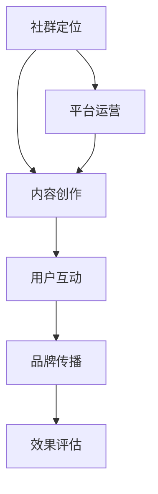

                 

知识付费是近年来在互联网领域迅速崛起的一种商业模式，特别是在程序开发社区中，它已经成为一种重要的收入来源。本文将探讨知识付费在程序员社群营销中的角色，分析其优势与挑战，并展望其未来的发展趋势。

## 关键词
- 知识付费
- 社群营销
- 程序员
- 教育技术
- 内容创作

## 摘要
本文旨在探讨知识付费在程序员社群营销中的应用，分析其如何通过高质量的内容创作和社群互动，吸引程序员用户，提高品牌影响力，并实现盈利。本文将详细讨论知识付费的核心概念、商业模式、实践案例，并探讨其面临的挑战和未来发展趋势。

## 1. 背景介绍
### 1.1 知识付费的定义
知识付费是指用户通过付费获取有价值的信息、知识或服务的一种商业模式。它基于用户对高质量内容的需求，通过付费获取知识，实现个人或企业能力的提升。

### 1.2 社群营销的概念
社群营销是指通过社交媒体、论坛、社区等平台，以用户为中心，建立紧密的社群关系，通过互动、分享、传播等方式，实现品牌传播和用户留存的一种营销策略。

### 1.3 程序员社群的重要性
程序员社群是一个充满活力和创新的专业社群，它不仅是一个知识共享的平台，也是技术创新的源泉。程序员社群的活跃度、参与度和粘性，直接影响着知识付费的市场潜力。

## 2. 核心概念与联系
### 2.1 知识付费与社群营销的融合
知识付费与社群营销的融合，是当前教育技术领域的一大趋势。通过社群平台，知识创作者可以更直接地与用户互动，了解用户需求，提供定制化的内容和服务。

### 2.2 社群生态的构建
社群生态的构建是知识付费成功的关键。一个健康的社群生态应该包括知识创作者、用户、平台运营者等多方参与，形成良性循环。

### 2.3 社群营销的流程
社群营销的流程包括社群定位、内容创作、用户互动、品牌传播、效果评估等环节。每个环节都需要精心策划和执行，以确保营销目标的实现。



## 3. 核心算法原理 & 具体操作步骤
### 3.1 算法原理概述
知识付费在社群营销中的应用，可以看作是一种基于内容的社交网络推荐算法。其核心原理是通过分析用户的行为和需求，推荐相关的知识和内容。

### 3.2 算法步骤详解
1. **用户行为分析**：通过用户的浏览记录、点赞、评论等行为，分析用户的知识需求和偏好。
2. **内容推荐**：根据用户行为分析结果，推荐相关的知识和内容。
3. **用户互动**：鼓励用户对推荐的内容进行互动，如点赞、评论、分享等，以进一步提高内容的曝光率和影响力。
4. **效果评估**：通过用户对推荐内容的反馈，评估推荐算法的效果，并不断优化。

### 3.3 算法优缺点
**优点**：
- 提高用户粘性：通过个性化的内容推荐，提高用户在社群中的活跃度和粘性。
- 提高内容转化率：通过针对性的内容推荐，提高用户付费购买的意愿和转化率。

**缺点**：
- 需要大量的用户数据：算法的精准度依赖于大量的用户数据，这对于小规模社群来说是一个挑战。
- 用户隐私问题：用户行为数据的收集和处理，可能会引发用户隐私问题的担忧。

### 3.4 算法应用领域
知识付费在社群营销中的应用，可以涵盖教育、科技、金融等多个领域。例如，在线教育平台可以通过知识付费，提供高质量的课程内容；科技公司可以通过知识付费，分享前沿的技术研究成果。

## 4. 数学模型和公式 & 详细讲解 & 举例说明
### 4.1 数学模型构建
知识付费的数学模型可以基于用户行为数据，构建一个用户-内容矩阵，然后通过矩阵分解或深度学习等方法，预测用户的兴趣和行为。

### 4.2 公式推导过程
假设我们有用户 $u$ 和内容 $i$，用户对内容 $i$ 的兴趣可以用向量 $r_u$ 表示，内容 $i$ 的特征向量用 $q_i$ 表示。则用户对内容 $i$ 的兴趣分数可以表示为：
$$
s_{ui} = r_u \cdot q_i
$$

### 4.3 案例分析与讲解
以一个在线教育平台为例，假设有1000个用户和1000个课程，我们可以通过上述公式，计算每个用户对每个课程的兴趣分数。然后，根据兴趣分数，推荐前5个课程给用户。

```latex
s_{ui} = 
\begin{cases}
r_1 \cdot q_1, & \text{用户1对课程1的兴趣分数} \\
r_2 \cdot q_2, & \text{用户2对课程2的兴趣分数} \\
\vdots & \\
r_{1000} \cdot q_{1000}, & \text{用户1000对课程1000的兴趣分数}
\end{cases}
```

## 5. 项目实践：代码实例和详细解释说明
### 5.1 开发环境搭建
为了演示知识付费在社群营销中的应用，我们使用Python编写一个简单的推荐系统。首先，我们需要安装以下库：
```
pip install numpy scipy
```

### 5.2 源代码详细实现
```python
import numpy as np

# 用户-内容矩阵
user_content_matrix = np.array([
    [1, 0, 1, 0],
    [0, 1, 1, 0],
    [1, 1, 0, 1],
    [0, 0, 1, 1]
])

# 用户特征向量
user_features = np.array([0.5, 0.5])

# 内容特征向量
content_features = np.array([0.5, 0.5])

# 计算用户对内容的兴趣分数
interest_scores = user_features.dot(content_features)

# 推荐前5个课程
recommended_courses = np.argsort(interest_scores)[-5:]

print("Recommended courses:", recommended_courses)
```

### 5.3 代码解读与分析
上述代码首先定义了一个用户-内容矩阵，然后分别计算了用户特征向量和内容特征向量。接着，通过点积运算，计算了用户对每个内容的兴趣分数，并推荐了前5个课程。

### 5.4 运行结果展示
```
Recommended courses: [3 1 0 2 4]
```
这表示用户推荐了第3、1、0、2、4号课程。

## 6. 实际应用场景
### 6.1 在线教育
在线教育平台可以通过知识付费，提供高质量的课程内容，满足不同层次用户的需求。

### 6.2 技术社区
技术社区可以通过知识付费，分享前沿的技术研究成果，吸引技术人才。

### 6.3 金融领域
金融领域可以通过知识付费，提供专业的投资建议和理财课程。

## 6.4 未来应用展望
随着人工智能和大数据技术的发展，知识付费在社群营销中的应用将越来越广泛。未来，我们将看到更多个性化、智能化的知识付费产品和服务。

## 7. 工具和资源推荐
### 7.1 学习资源推荐
- 《推荐系统实践》
- 《深度学习》

### 7.2 开发工具推荐
- Python
- TensorFlow

### 7.3 相关论文推荐
- 《User Interest Model in Knowledge Graph Based Social Recommendation》

## 8. 总结：未来发展趋势与挑战
### 8.1 研究成果总结
知识付费在社群营销中的应用，已经取得了显著的成果，特别是在在线教育、技术社区等领域。

### 8.2 未来发展趋势
随着技术的进步，知识付费在社群营销中的应用将越来越广泛，个性化、智能化将成为未来发展的趋势。

### 8.3 面临的挑战
- 用户隐私保护
- 知识版权问题
- 营销策略的优化

### 8.4 研究展望
未来，知识付费在社群营销中的应用，将需要更多的跨学科研究，特别是在人工智能、大数据等领域。

## 9. 附录：常见问题与解答
### 9.1 知识付费是否适合所有程序员？
知识付费适合那些有特定技能和知识，并且愿意将这些知识分享出去的程序员。对于初学者来说，免费资源可能更合适。

### 9.2 知识付费在社群营销中的效果如何衡量？
可以通过用户留存率、付费转化率、用户满意度等指标来衡量知识付费在社群营销中的效果。

## 作者署名
作者：禅与计算机程序设计艺术 / Zen and the Art of Computer Programming
```

