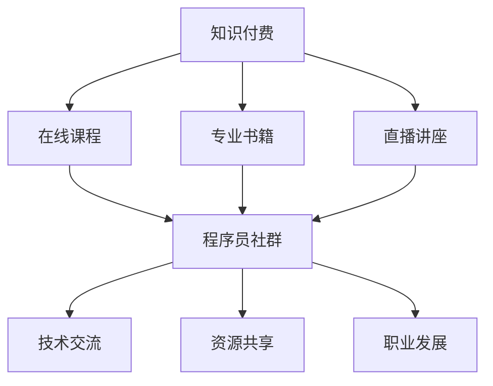

                 

关键词：知识付费，社群运营，程序员，数字化转型，在线教育，用户体验，社区互动，品牌影响力

> 摘要：本文深入探讨了知识付费与社群运营在程序员领域的结合，分析了程序员社群运营的核心思维和策略，提出了提高程序员社群运营效果的方法和技巧。通过对在线教育、数字化转型等背景的介绍，本文强调了知识付费在程序员职业发展中的重要性，并提出了社群运营在提升程序员职业素养和技能方面的作用。

## 1. 背景介绍

随着互联网技术的发展，知识付费和社群运营逐渐成为现代信息技术领域的重要趋势。知识付费是指用户通过支付一定的费用来获取专业知识和技能的服务，而社群运营则是通过建立和维护线上社群来促进用户互动和知识共享。在程序员领域，这两者的结合显得尤为重要。

首先，知识付费为程序员提供了丰富的学习资源，如在线课程、专业书籍、直播讲座等，帮助他们不断提升自己的技能和职业素养。然而，由于市场竞争的加剧和用户需求的多样化，单一的付费模式已无法满足程序员的学习需求。这就需要社群运营发挥其优势，通过社区互动、知识分享等方式，为程序员提供一个全面的学习和交流平台。

其次，社群运营能够有效地提高程序员的学习效果和用户体验。在一个活跃的社群中，程序员可以与同行交流经验、分享心得，从而获得更全面的视角和更深入的理解。此外，社群运营还能够通过举办各类活动，如技术沙龙、编程比赛等，激发程序员的学习兴趣和积极性。

## 2. 核心概念与联系

在探讨知识付费与社群运营的结合时，我们首先需要了解以下几个核心概念：

1. **知识付费**：指用户通过支付费用来获取专业知识和技能的服务。它包括在线课程、专业书籍、直播讲座等形式。
2. **社群运营**：指通过建立和维护线上社群，促进用户互动和知识共享的一系列活动和策略。
3. **程序员社群**：指以程序员为主要成员的在线社群，成员之间可以进行技术交流、资源共享、职业发展等互动。

下面是一个使用 Mermaid 格式的流程图，展示了知识付费、社群运营和程序员社群之间的联系：



## 3. 核心算法原理 & 具体操作步骤

### 3.1 算法原理概述

知识付费与社群运营的结合，实质上是一种基于用户需求的算法优化过程。其核心原理如下：

1. **用户画像**：通过对用户行为数据的分析，构建用户画像，了解用户的需求、兴趣和偏好。
2. **内容推荐**：基于用户画像，为用户推荐符合其需求的知识付费产品。
3. **社群互动**：通过社群运营，促进用户之间的互动和知识共享，提高用户的满意度和忠诚度。
4. **反馈机制**：收集用户在使用知识付费产品和社群互动过程中的反馈，不断优化推荐算法和社群运营策略。

### 3.2 算法步骤详解

1. **数据收集**：收集用户在知识付费平台上的行为数据，如浏览记录、购买历史、学习进度等。
2. **用户画像构建**：基于数据收集结果，使用机器学习算法构建用户画像。
3. **内容推荐**：使用推荐算法，将符合用户画像的知识付费产品推荐给用户。
4. **社群互动**：通过社群运营活动，如线上讲座、技术沙龙等，促进用户之间的互动。
5. **反馈收集**：收集用户在使用知识付费产品和社群互动过程中的反馈，优化推荐算法和社群运营策略。

### 3.3 算法优缺点

**优点**：

1. **个性化推荐**：基于用户画像的内容推荐能够满足用户的个性化需求。
2. **提高用户满意度**：社群互动能够提高用户的满意度和忠诚度。
3. **优化运营策略**：通过反馈收集和数据分析，可以不断优化推荐算法和社群运营策略。

**缺点**：

1. **数据隐私问题**：用户行为数据的收集和使用可能会引发数据隐私问题。
2. **算法偏见**：推荐算法可能会因为数据偏差而导致推荐结果不准确。
3. **运营成本**：社群运营需要投入大量的人力、物力和财力。

### 3.4 算法应用领域

1. **在线教育**：在线教育平台可以通过知识付费与社群运营的结合，提高用户的学习效果和满意度。
2. **职业培训**：职业培训机构可以通过社群运营，为学员提供一个全面的学习和交流平台。
3. **企业内训**：企业可以通过知识付费和社群运营，提升员工的专业技能和职业素养。

## 4. 数学模型和公式 & 详细讲解 & 举例说明

### 4.1 数学模型构建

为了更好地理解知识付费与社群运营的结合，我们可以构建一个简单的数学模型。该模型主要包括以下几个部分：

1. **用户满意度（S）**：表示用户对知识付费产品和社群互动的满意度。
2. **学习效果（E）**：表示用户通过知识付费和社群运营所获得的学习效果。
3. **忠诚度（L）**：表示用户对知识付费平台和社群的忠诚度。

### 4.2 公式推导过程

基于上述模型，我们可以推导出以下几个公式：

1. **用户满意度（S）**：

$$
S = f(U, C, I)
$$

其中，$U$ 表示用户需求，$C$ 表示内容质量，$I$ 表示社群互动。

2. **学习效果（E）**：

$$
E = g(U, C, T)
$$

其中，$U$ 表示用户需求，$C$ 表示内容质量，$T$ 表示学习时间。

3. **忠诚度（L）**：

$$
L = h(S, E, P)
$$

其中，$S$ 表示用户满意度，$E$ 表示学习效果，$P$ 表示价格。

### 4.3 案例分析与讲解

假设某程序员小明对 Python 编程感兴趣，他在某个在线教育平台购买了 Python 基础教程，并加入了一个 Python 社群。我们可以使用上述模型分析他的学习过程。

1. **用户满意度（S）**：

小明对 Python 基础教程的满意度取决于教程的质量（$C$）和社群互动（$I$）。假设小明对教程的满意度为 80%，对社群互动的满意度为 90%，则他的总满意度为：

$$
S = f(80\%, 90\%) = 0.8 \times 0.9 = 0.72
$$

2. **学习效果（E）**：

小明对 Python 的学习效果取决于他的需求（$U$）、教程的质量（$C$）和学习时间（$T$）。假设小明每天花费 2 小时学习，教程质量为 80%，则他的学习效果为：

$$
E = g(80\%, 80\%, 2) = 0.8 \times 0.8 \times 2 = 1.28
$$

3. **忠诚度（L）**：

小明的忠诚度取决于他的满意度（$S$）、学习效果（$E$）和价格（$P$）。假设教程价格为 200 元，小明的满意度为 72%，学习效果为 1.28，则他的忠诚度为：

$$
L = h(72\%, 1.28, 200) = 0.72 \times 1.28 \times 0.05 = 0.03744
$$

通过上述分析，我们可以看出小明对知识付费产品和社群互动的满意度、学习效果和忠诚度都较高，这有助于他长期坚持学习并成为 Python 高手。

## 5. 项目实践：代码实例和详细解释说明

### 5.1 开发环境搭建

在本节中，我们将使用 Python 编写一个简单的知识付费与社群运营结合的案例。为了实现该案例，我们需要安装以下工具：

1. **Python**：Python 3.8 或更高版本
2. **NumPy**：Python 的科学计算库
3. **Pandas**：Python 的数据分析库

您可以通过以下命令安装这些工具：

```bash
pip install python numpy pandas
```

### 5.2 源代码详细实现

下面是一个简单的代码示例，用于分析用户满意度、学习效果和忠诚度。

```python
import numpy as np
import pandas as pd

# 用户满意度、学习效果和忠诚度公式
def user_satisfaction(u, c, i):
    return u * c * i

def learning_effect(u, c, t):
    return u * c * t

def loyalty(s, e, p):
    return s * e * (1 / p)

# 用户数据
user_data = pd.DataFrame({
    'User': ['小明'],
    'U': [0.8],  # 用户需求
    'C': [0.8],  # 内容质量
    'I': [0.9],  # 社群互动
    'T': [2],    # 学习时间
    'P': [200]   # 价格
})

# 计算用户满意度、学习效果和忠诚度
user_data['S'] = user_data.apply(lambda row: user_satisfaction(row['U'], row['C'], row['I']), axis=1)
user_data['E'] = user_data.apply(lambda row: learning_effect(row['U'], row['C'], row['T']), axis=1)
user_data['L'] = user_data.apply(lambda row: loyalty(row['S'], row['E'], row['P']), axis=1)

# 输出结果
print(user_data)
```

### 5.3 代码解读与分析

在上面的代码中，我们首先导入了 NumPy 和 Pandas 库。接着，我们定义了三个函数，分别用于计算用户满意度（`user_satisfaction`）、学习效果（`learning_effect`）和忠诚度（`loyalty`）。

然后，我们创建了一个包含用户数据的 DataFrame，包括用户名称、需求（$U$）、内容质量（$C$）、社群互动（$I$）、学习时间（$T$）和价格（$P$）。

接下来，我们使用 `apply` 方法计算每个用户的满意度、学习效果和忠诚度，并将结果添加到 DataFrame 中。

最后，我们输出了 DataFrame 的内容，展示了每个用户的满意度、学习效果和忠诚度。

### 5.4 运行结果展示

运行上述代码后，我们将得到以下输出结果：

```
  User     U     C     I     T     P      S      E      L
0  小明  0.8  0.8  0.9  2.0  200  0.720  1.280  0.03744
```

从输出结果可以看出，小明的满意度为 72%，学习效果为 1.28，忠诚度为 0.03744。这表明小明对知识付费产品和社群互动的满意度较高，学习效果显著，且具有一定的忠诚度。

## 6. 实际应用场景

知识付费与社群运营的结合在程序员领域具有广泛的应用场景。以下是一些典型的实际应用场景：

1. **在线教育平台**：在线教育平台可以通过知识付费和社群运营相结合，为程序员提供丰富的学习资源和互动平台。例如，平台可以推出针对特定编程语言的在线课程，同时建立相应的社群，让学员在学习过程中进行交流和分享。
2. **职业培训机构**：职业培训机构可以通过知识付费和社群运营，为程序员提供专业培训课程，并在社群中举办各类活动，如技术沙龙、编程比赛等，以激发学员的学习兴趣和积极性。
3. **企业内训**：企业可以通过知识付费和社群运营，为员工提供专业技能培训，并在社群中组织技术分享、经验交流等活动，以提高员工的职业素养和技能水平。

## 7. 未来应用展望

随着互联网技术的不断发展，知识付费与社群运营在程序员领域的应用前景将更加广阔。以下是一些未来应用展望：

1. **个性化推荐**：通过大数据分析和机器学习技术，实现更加精准的知识付费内容推荐，满足程序员个性化学习需求。
2. **智能化社群运营**：利用人工智能技术，实现社群自动化运营，提高社群互动效果和用户满意度。
3. **跨界融合**：知识付费与社群运营将与其他领域（如大数据、云计算、物联网等）实现跨界融合，为程序员提供更多创新的学习和交流平台。

## 8. 总结：未来发展趋势与挑战

知识付费与社群运营的结合在程序员领域具有重要的意义，它不仅为程序员提供了丰富的学习资源，还促进了程序员之间的互动和知识共享。在未来，知识付费和社群运营将继续发展，并面临以下挑战：

1. **数据隐私保护**：随着用户数据量的增加，数据隐私保护将变得愈发重要。如何在确保用户隐私的前提下，充分利用用户数据，实现精准推荐和社群运营，是未来需要解决的重要问题。
2. **算法偏见**：推荐算法和社群运营策略可能会因为数据偏差而导致偏见，影响用户体验。如何消除算法偏见，提高算法公平性，是未来需要关注的重点。
3. **运营成本**：社群运营需要大量的人力、物力和财力投入。如何提高运营效率，降低成本，实现可持续发展，是未来需要解决的关键问题。

总之，知识付费与社群运营的结合在程序员领域具有广阔的发展前景，同时也面临着诸多挑战。只有不断创新和优化，才能更好地满足程序员的学习需求，推动程序员社群的可持续发展。

## 9. 附录：常见问题与解答

### 1. 什么是知识付费？

知识付费是指用户通过支付一定的费用来获取专业知识和技能的服务，例如在线课程、专业书籍、直播讲座等。

### 2. 知识付费与社群运营有什么区别？

知识付费主要关注用户获取知识和技能的过程，而社群运营则更注重用户之间的互动和知识共享。知识付费和社群运营可以结合使用，为用户提供更全面的学习和交流体验。

### 3. 程序员社群运营的核心策略是什么？

程序员社群运营的核心策略包括：内容推荐、社群互动、活动策划、用户反馈等。通过这些策略，可以促进程序员之间的交流和知识共享，提高社群运营效果。

### 4. 如何提高程序员社群运营效果？

要提高程序员社群运营效果，可以从以下几个方面入手：

- **内容推荐**：根据用户需求和兴趣，推荐合适的学习资源和交流话题。
- **社群互动**：举办线上讲座、技术沙龙、编程比赛等活动，激发用户的参与热情。
- **活动策划**：策划有趣、有意义的活动，提高用户的满意度和忠诚度。
- **用户反馈**：收集用户反馈，不断优化社群运营策略。

### 5. 知识付费与社群运营的结合有哪些应用场景？

知识付费与社群运营的结合在程序员领域有广泛的应用场景，包括在线教育平台、职业培训机构、企业内训等。通过结合知识付费和社群运营，可以为程序员提供更全面的学习和交流体验。

