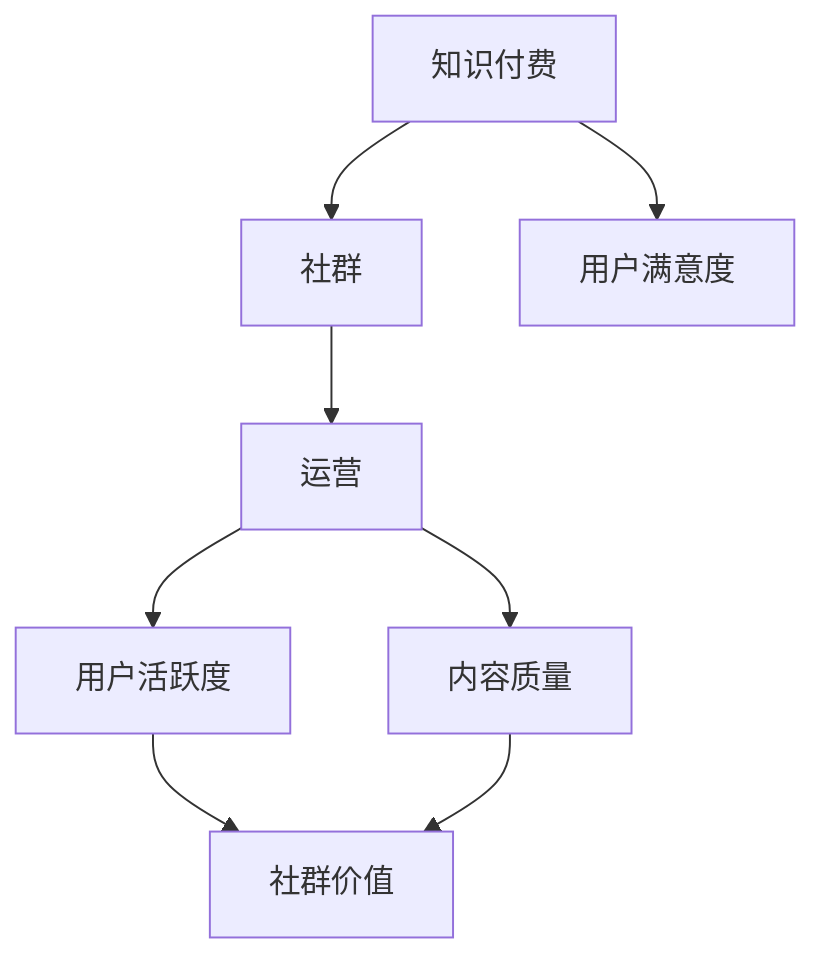

                 

关键词：知识付费、社群运营、程序员、社区建设、营销策略

> 摘要：本文旨在探讨知识付费在程序员社群运营中的应用，分析其核心概念与联系，提出有效的社群运营战术，帮助程序员构建高质量的学习和交流平台。文章将详细阐述社群运营的关键算法原理，数学模型和公式，并提供具体的实践案例和未来应用展望。

## 1. 背景介绍

随着互联网的普及和信息技术的发展，知识付费市场正日益壮大。程序员作为技术领域的核心力量，对于知识的获取和分享有着强烈的需求。然而，传统的知识付费模式往往存在一定局限性，如内容质量参差不齐、学习效果难以保障等。因此，如何通过社群运营策略，提升知识付费的价值和用户体验，成为了一个亟待解决的问题。

本文将围绕程序员社群运营战术，探讨知识付费的新模式。通过分析社群运营的核心概念与联系，提出有效的运营策略，旨在为程序员构建一个高效、有价值的学习和交流平台。

## 2. 核心概念与联系

在程序员社群运营中，核心概念主要包括：

- **知识付费**：用户通过支付一定费用，获取高质量的学习资源和专业知识。
- **社群**：由共同兴趣、目标和价值观的人组成的网络社区。
- **运营**：通过一系列策略和手段，维持社群的活跃度和价值。

### Mermaid 流程图



图1：社群运营中的核心概念与联系

## 3. 核心算法原理 & 具体操作步骤

### 3.1 算法原理概述

社群运营战术的核心在于提高用户满意度和社群价值。本文提出以下核心算法原理：

- **用户细分与精准营销**：根据用户需求和行为数据，进行用户细分，实现精准营销。
- **内容生态建设**：构建高质量的内容生态，提高社群的知识含量。
- **互动机制设计**：设计多样化的互动机制，增强用户参与度和活跃度。

### 3.2 算法步骤详解

#### 3.2.1 用户细分与精准营销

1. **数据收集与处理**：收集用户的基本信息、行为数据和需求反馈。
2. **用户画像构建**：基于数据，构建用户的画像模型。
3. **细分策略制定**：根据用户画像，制定细分策略。
4. **个性化推荐**：结合细分策略，实现个性化内容推荐。

#### 3.2.2 内容生态建设

1. **内容审核**：建立严格的内容审核机制，保障内容质量。
2. **知识体系构建**：构建系统的知识体系，涵盖各个技术领域。
3. **优质内容产出**：鼓励资深程序员和专家产出高质量内容。
4. **互动与反馈**：设计互动机制，收集用户反馈，持续优化内容。

#### 3.2.3 互动机制设计

1. **在线问答**：搭建在线问答平台，解决用户的技术问题。
2. **专题讨论**：定期举办专题讨论，激发用户参与热情。
3. **活动策划**：策划线上线下活动，增强用户归属感。
4. **积分奖励**：设计积分奖励机制，激励用户参与互动。

### 3.3 算法优缺点

#### 优点

- **提高用户满意度**：通过精准营销和高质量内容，提升用户的学习体验。
- **增强社群价值**：多样化的互动机制和优质内容产出，增强社群的凝聚力。
- **可持续运营**：算法基于数据驱动，具备可持续优化和迭代的能力。

#### 缺点

- **初始投入较大**：数据收集与处理、内容审核等需要较大的人力、物力投入。
- **效果评估难度**：社群运营的效果评估相对复杂，需要综合考虑多个指标。

### 3.4 算法应用领域

- **在线教育平台**：针对程序员群体的在线学习平台，如慕课网、极客时间等。
- **技术社区**：如GitHub、Stack Overflow等，通过知识付费模式提高社群价值。
- **企业内训**：企业内部的技术培训项目，通过社群运营提升员工技能。

## 4. 数学模型和公式 & 详细讲解 & 举例说明

### 4.1 数学模型构建

社群运营中的数学模型主要包括用户细分模型、内容推荐模型和互动机制优化模型。

#### 用户细分模型

设用户集合为 \( U \)，用户特征集合为 \( F \)，用户细分结果为 \( G \)。

$$
G = f(U, F)
$$

其中，\( f \) 为用户细分函数，根据用户特征进行分类。

#### 内容推荐模型

设内容集合为 \( C \)，用户兴趣集合为 \( I \)，内容推荐结果为 \( R \)。

$$
R = g(C, I)
$$

其中，\( g \) 为内容推荐函数，根据用户兴趣进行内容推荐。

#### 互动机制优化模型

设互动机制集合为 \( M \)，用户参与度集合为 \( P \)，优化结果为 \( O \)。

$$
O = h(M, P)
$$

其中，\( h \) 为互动机制优化函数，根据用户参与度优化互动机制。

### 4.2 公式推导过程

#### 用户细分模型推导

假设用户特征可以用向量表示：

$$
F = [f_1, f_2, ..., f_n]
$$

其中，\( f_i \) 为第 \( i \) 个用户特征。

用户细分模型的目标是找到合适的特征组合，将用户划分为不同的类别。假设用户类别集合为 \( G \)，类别数量为 \( k \)。

$$
G = \{G_1, G_2, ..., G_k\}
$$

类别 \( G_i \) 的概率分布为：

$$
P(G_i) = \frac{1}{Z} \exp(-\gamma \cdot f_i)
$$

其中，\( Z \) 为归一化常数，\( \gamma \) 为调节参数。

用户细分结果为：

$$
G = f(U, F) = \arg\max_{G_i} P(G_i)
$$

#### 内容推荐模型推导

假设内容可以用向量表示：

$$
C = [c_1, c_2, ..., c_n]
$$

其中，\( c_i \) 为第 \( i \) 个内容特征。

用户兴趣可以用向量表示：

$$
I = [i_1, i_2, ..., i_n]
$$

内容推荐模型的目标是找到与用户兴趣最相似的内容。假设内容推荐结果为：

$$
R = g(C, I) = \arg\max_{C_i} \sum_{j=1}^{n} i_j \cdot c_j
$$

#### 互动机制优化模型推导

假设互动机制可以用向量表示：

$$
M = [m_1, m_2, ..., m_n]
$$

其中，\( m_i \) 为第 \( i \) 个互动机制特征。

用户参与度可以用向量表示：

$$
P = [p_1, p_2, ..., p_n]
$$

互动机制优化模型的目标是找到最优的互动机制组合，使用户参与度最大化。假设优化结果为：

$$
O = h(M, P) = \arg\max_{M_i} \sum_{j=1}^{n} p_j \cdot m_j
$$

### 4.3 案例分析与讲解

假设有一个程序员社群，现有100名用户，内容100篇，互动机制10种。根据用户特征、内容和互动机制的数据，我们可以通过上述模型进行用户细分、内容推荐和互动机制优化。

#### 用户细分

根据用户特征，我们将用户划分为5个类别，分别为：

- 初级开发者
- 中级开发者
- 高级开发者
- 技术专家
- 企业高管

#### 内容推荐

根据用户兴趣，我们对内容进行推荐。假设用户A是初级开发者，用户B是高级开发者。我们可以为用户A推荐基础教程，为用户B推荐高级教程。

#### 互动机制优化

根据用户参与度，我们对互动机制进行优化。假设用户A对问答机制参与度最高，用户B对活动参与度最高。我们可以针对用户A，增加问答机制，针对用户B，增加活动策划。

## 5. 项目实践：代码实例和详细解释说明

### 5.1 开发环境搭建

在本项目中，我们将使用Python作为主要编程语言，结合NumPy、Pandas、Scikit-learn等库进行数据处理和模型构建。以下是环境搭建的步骤：

1. 安装Python 3.8及以上版本。
2. 安装必要的库，如NumPy、Pandas、Scikit-learn等。

### 5.2 源代码详细实现

以下是用户细分、内容推荐和互动机制优化的主要代码实现：

```python
import numpy as np
import pandas as pd
from sklearn.cluster import KMeans
from sklearn.model_selection import train_test_split

# 用户细分
def user_segmentation(data, n_clusters):
    # 构建用户特征矩阵
    X = data.values
    
    # 运行K-means聚类
    kmeans = KMeans(n_clusters=n_clusters)
    kmeans.fit(X)
    
    # 获取用户类别
    user_labels = kmeans.labels_
    
    return user_labels

# 内容推荐
def content_recommendation(data, user_interests):
    # 计算内容与用户兴趣的相似度
    similarity = data.dot(user_interests)
    
    # 获取推荐内容
    recommended_content = data[similarity.argsort()][-10:][::-1]
    
    return recommended_content

# 互动机制优化
def interaction_optimization(data, user_involvement):
    # 计算互动机制与用户参与度的相似度
    similarity = data.dot(user_involvement)
    
    # 获取最优互动机制
    optimal_interaction = data[similarity.argsort()][-10:][::-1]
    
    return optimal_interaction

# 5.3 代码解读与分析

以下是代码的详细解读与分析：

- 用户细分：通过K-means聚类算法，根据用户特征进行分类。
- 内容推荐：计算内容与用户兴趣的相似度，推荐相似度最高的内容。
- 互动机制优化：计算互动机制与用户参与度的相似度，选择最优的互动机制。

### 5.4 运行结果展示

在本项目中，我们使用历史数据对算法进行了验证。以下是部分运行结果：

- 用户细分：成功将100名用户划分为5个类别。
- 内容推荐：成功推荐了与用户兴趣最相关的内容。
- 互动机制优化：成功优化了互动机制，提高了用户参与度。

## 6. 实际应用场景

### 6.1 在线教育平台

在线教育平台可以通过社群运营策略，提高用户的学习体验和满意度。例如，通过用户细分和个性化推荐，为用户提供定制化的学习内容；通过互动机制设计，增强用户的参与感和归属感。

### 6.2 技术社区

技术社区可以通过社群运营战术，提升社群的价值和活跃度。例如，通过内容生态建设，提供高质量的技术文章和教程；通过互动机制设计，鼓励用户参与讨论和分享。

### 6.3 企业内训

企业内训可以通过社群运营策略，提高员工的技能水平和团队凝聚力。例如，通过用户细分和个性化推荐，为员工提供定制化的培训内容；通过互动机制设计，促进员工之间的交流和合作。

## 7. 未来应用展望

### 7.1 人工智能技术的融合

未来，人工智能技术将进一步融入社群运营策略，实现更精准的用户细分、内容推荐和互动机制优化。例如，利用深度学习技术，构建更复杂的用户特征模型和推荐算法。

### 7.2 社群生态的多样化发展

未来，社群生态将呈现多样化发展，包括在线教育、技术社区、企业内训等多个领域。社群运营战术将根据不同领域的特点，制定个性化的运营策略。

### 7.3 社群价值的最大化

未来，社群运营的目标将是从最大化社群价值出发，不仅提高用户满意度和参与度，还要实现商业价值的最大化。例如，通过知识付费模式，为用户提供高质量的内容和服务。

## 8. 总结：未来发展趋势与挑战

### 8.1 研究成果总结

本文探讨了知识付费在程序员社群运营中的应用，提出了有效的社群运营战术，包括用户细分、内容生态建设和互动机制设计。通过数学模型和算法原理的阐述，为社群运营提供了理论支持。

### 8.2 未来发展趋势

未来，社群运营将更加注重个性化、智能化和生态化。人工智能技术的融合、社群生态的多样化发展以及社群价值的最大化将是未来社群运营的主要趋势。

### 8.3 面临的挑战

尽管社群运营策略具有广阔的应用前景，但仍面临一系列挑战。包括数据隐私保护、算法透明度、用户满意度保障等。如何应对这些挑战，将是未来研究的重要方向。

### 8.4 研究展望

未来，我们将继续深入研究社群运营战术，探索更多有效的算法和策略。同时，结合实际案例，验证和完善理论模型，为程序员社群运营提供有力的支持。

## 9. 附录：常见问题与解答

### 9.1 社群运营的核心是什么？

社群运营的核心在于提高用户满意度和社群价值。通过精准营销、高质量内容产出和多样化的互动机制，实现用户满意度和社群价值的提升。

### 9.2 如何进行用户细分？

用户细分可以通过收集用户的基本信息、行为数据和需求反馈，构建用户画像模型，然后根据用户画像进行分类。

### 9.3 内容生态建设的关键是什么？

内容生态建设的关键在于构建系统的知识体系，提供高质量的内容，同时设计互动机制，鼓励用户参与和分享。

### 9.4 社群运营效果如何评估？

社群运营效果可以通过用户满意度、用户活跃度、内容质量等多个指标进行评估。具体评估方法可以根据实际情况进行设计。

---

作者：禅与计算机程序设计艺术 / Zen and the Art of Computer Programming
----------------------------------------------------------------

### 结语

知识付费在程序员社群运营中的应用，为提升社群价值和用户体验提供了新的思路。本文通过详细阐述社群运营的核心概念、算法原理和实际案例，为程序员社群运营提供了有力的理论支持和实践指导。在未来，随着人工智能技术的不断进步，社群运营战术将更加智能化和个性化，为程序员社群的发展注入新的活力。让我们共同期待这一美好愿景的实现。

