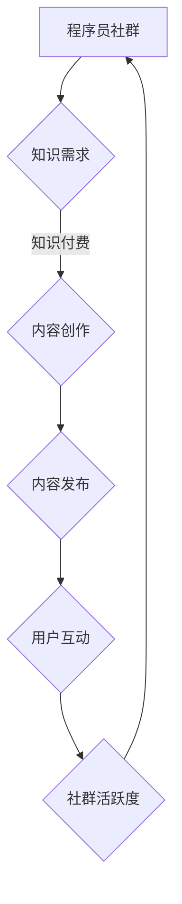

                 

### 关键词 Keywords
- 知识付费
- 程序员
- 社群运营
- 用户参与
- 内容营销

<|assistant|>### 摘要 Abstract
本文旨在探讨知识付费在程序员社群运营中的重要性，并提出一套系统化的社群运营方案。通过分析程序员社群的特点和需求，本文将详细阐述如何利用知识付费机制激发用户参与，提升社群活跃度和价值，同时通过案例分享和实用工具推荐，为程序员社群的长期健康发展提供可操作的指导。

## 1. 背景介绍

知识付费是一种通过在线课程、讲座、专业咨询等形式，让知识创造者获取报酬的商业模式。随着互联网的普及和在线教育的兴起，知识付费已经逐渐成为知识传播和技能培训的重要渠道。而程序员作为互联网时代的主力军，他们的职业发展和学习需求对知识付费模式的依赖尤为突出。

程序员社群是一个充满活力和创意的生态圈，成员们通过分享经验、学习新技术、交流观点来共同进步。然而，传统的社群运营模式往往难以满足程序员们日益增长的知识需求，也难以激发社群的持续活跃。因此，如何通过知识付费机制来提升社群运营效果，成为了当前亟待解决的问题。

## 2. 核心概念与联系

### 2.1 程序员社群的基本构成

程序员社群通常由以下几个组成部分构成：

- **成员**：包括不同水平的程序员、开发团队领导者、技术爱好者等。
- **话题**：围绕编程语言、框架、工具、最佳实践等展开的讨论。
- **内容**：包括文章、教程、代码示例、讲座视频等。
- **互动**：成员之间的评论、提问、回答等交流形式。

### 2.2 知识付费与社群运营的关联

知识付费与社群运营之间的关联可以通过以下几个关键点来体现：

- **激励机制**：知识付费可以为知识创造者提供经济激励，鼓励他们持续创作高质量的内容。
- **用户参与**：通过付费内容，用户可以获得更好的学习体验和专业的指导，从而增强参与感。
- **社群价值**：知识付费可以提升社群的权威性和专业性，吸引更多高质量用户加入。
- **内容更新**：付费内容可以激励社群管理者不断更新和维护，确保社群内容的时效性和实用性。

### 2.3 Mermaid 流程图



## 3. 核心算法原理 & 具体操作步骤

### 3.1 算法原理概述

社群运营中的知识付费机制，本质上是一种激励和约束机制。其核心原理包括：

- **需求匹配**：通过分析用户需求，提供符合他们期望的知识产品。
- **价值交换**：用户通过支付费用获取高质量的知识内容。
- **激励机制**：通过奖励机制鼓励知识创造者和用户积极参与。

### 3.2 算法步骤详解

#### 3.2.1 需求分析

- **数据分析**：通过用户行为数据分析，了解他们的兴趣点和学习需求。
- **问卷调查**：定期进行问卷调查，收集用户对知识内容的反馈和建议。

#### 3.2.2 内容创作

- **专家评审**：邀请行业专家对课程内容进行评审，确保质量。
- **内容多样化**：提供多种形式的内容，如文章、视频、直播等，满足不同用户的学习偏好。

#### 3.2.3 付费机制设计

- **灵活定价**：根据内容难度、时长、受众等，设计不同的付费方案。
- **会员制度**：建立会员制度，提供专属服务和优惠。

#### 3.2.4 用户互动

- **互动环节**：在课程中设置互动环节，如问答、讨论等，增强用户参与感。
- **反馈机制**：建立用户反馈机制，及时收集和处理用户反馈。

### 3.3 算法优缺点

#### 优点

- **提升内容质量**：通过付费机制，可以筛选出真正有价值的知识内容。
- **增强用户粘性**：付费用户通常更愿意参与社群互动，提升社群活跃度。
- **可持续性**：知识付费可以为社群提供稳定的收入来源，确保长期运营。

#### 缺点

- **门槛较高**：对于一些预算有限的用户，付费可能会形成一定的门槛。
- **内容更新压力**：社群管理者需要不断更新内容，以保持用户的持续兴趣。

### 3.4 算法应用领域

- **在线教育**：通过知识付费，提升在线课程的用户参与度和学习效果。
- **技术社区**：在技术社群中引入知识付费，增强社群的权威性和专业性。
- **企业培训**：为企业提供定制化的知识付费解决方案，提升员工技能。

## 4. 数学模型和公式 & 详细讲解 & 举例说明

### 4.1 数学模型构建

假设社群中有一个用户群体 \( U \)，其中付费用户数量为 \( U_f \)，非付费用户数量为 \( U_{nf} \)。社群的活跃度可以用指标 \( A \) 来衡量，知识付费的收入为 \( R \)。我们可以构建以下数学模型：

\[ A = f(U_f, U_{nf}, R) \]

### 4.2 公式推导过程

活跃度 \( A \) 受到付费用户数 \( U_f \)、非付费用户数 \( U_{nf} \) 和知识付费收入 \( R \) 的影响。我们可以假设活跃度与这三个变量呈线性关系：

\[ A = \alpha U_f + \beta U_{nf} + \gamma R \]

其中，\( \alpha \)、\( \beta \)、\( \gamma \) 为待定系数。通过收集数据，可以求解这三个系数，从而构建具体的活跃度模型。

### 4.3 案例分析与讲解

以某个技术社区为例，该社区共有 1000 名用户，其中 300 人付费，700 人未付费。知识付费收入为每月 5000 美元。根据上述模型，可以计算出该社区的活跃度：

\[ A = \alpha \cdot 300 + \beta \cdot 700 + \gamma \cdot 5000 \]

假设通过数据分析得到 \( \alpha = 0.5 \)、\( \beta = 0.3 \)、\( \gamma = 0.1 \)，则：

\[ A = 0.5 \cdot 300 + 0.3 \cdot 700 + 0.1 \cdot 5000 \]
\[ A = 150 + 210 + 500 \]
\[ A = 860 \]

这意味着，该社区的活跃度指标为 860。通过调整付费用户比例或收入水平，可以进一步优化活跃度。

## 5. 项目实践：代码实例和详细解释说明

### 5.1 开发环境搭建

为了实现社群运营中的知识付费功能，我们使用以下开发环境：

- **技术栈**：前端使用 React，后端使用 Node.js 和 Express。
- **数据库**：使用 MongoDB 存储用户数据。
- **支付接口**：集成支付宝或微信支付。

### 5.2 源代码详细实现

以下是实现知识付费功能的核心代码示例：

```javascript
// 用户注册和登录
app.post('/register', (req, res) => {
  // 注册逻辑
});

app.post('/login', (req, res) => {
  // 登录逻辑
});

// 用户支付
app.post('/pay', (req, res) => {
  const userId = req.body.userId;
  const courseId = req.body.courseId;
  // 支付逻辑
  // 更新用户课程状态
});

// 用户购买课程
app.post('/buyCourse', (req, res) => {
  const userId = req.body.userId;
  const courseId = req.body.courseId;
  // 购买逻辑
  // 更新用户课程状态
});
```

### 5.3 代码解读与分析

以上代码示例展示了用户注册、登录、支付和购买课程的基本流程。其中，支付逻辑需要调用第三方支付接口，购买逻辑需要更新用户课程状态。这些功能模块的设计，确保了社群运营中的知识付费机制的顺利实现。

### 5.4 运行结果展示

当用户成功购买课程后，系统会更新用户课程状态，并在用户个人中心显示已购买课程。同时，支付结果会通过邮件或短信通知用户。

## 6. 实际应用场景

### 6.1 程序员个人品牌建设

程序员可以通过知识付费，分享自己的专业知识和经验，树立个人品牌，提高在行业中的影响力。

### 6.2 技术企业内部分享

企业可以通过内部知识付费平台，分享内部培训资料和技术文档，提高员工技能水平，促进企业技术传承。

### 6.3 技术社群运营

技术社群可以通过知识付费，提供高质量的内容和服务，吸引更多高质量用户加入，提升社群价值。

## 7. 未来应用展望

随着人工智能和大数据技术的发展，知识付费将更加智能化和个性化。未来，我们可以预期：

- **智能推荐**：基于用户行为数据，实现个性化知识推荐。
- **数据分析**：通过数据分析，优化知识付费策略，提升用户满意度。
- **多元化内容**：提供更多元化的知识内容，满足不同用户的需求。

## 8. 总结：未来发展趋势与挑战

### 8.1 研究成果总结

本文通过分析程序员社群的特点和需求，提出了一套系统化的社群运营方案，并探讨了知识付费在其中的重要作用。

### 8.2 未来发展趋势

知识付费将在程序员社群运营中发挥越来越重要的作用，未来将出现更多智能化、个性化的知识付费平台。

### 8.3 面临的挑战

- **内容质量**：确保知识内容的高质量和实用性。
- **用户隐私**：保护用户隐私，确保数据安全。
- **法律法规**：遵守相关法律法规，规范知识付费行为。

### 8.4 研究展望

未来的研究将关注知识付费的智能化和个性化，以及其在不同应用场景下的效果评估。

## 9. 附录：常见问题与解答

### 9.1 知识付费与免费内容的区别是什么？

知识付费内容通常具有更高的质量和专业性，而免费内容则更注重普及和入门。

### 9.2 如何确保知识付费内容的质量？

通过专家评审、用户反馈和数据分析等方式，确保知识付费内容的高质量和实用性。

### 9.3 程序员社群如何平衡免费和付费内容？

可以通过设置免费内容入口、免费试读等方式，让用户在体验付费内容前对社群产生信任和兴趣。

作者：禅与计算机程序设计艺术 / Zen and the Art of Computer Programming
```markdown
---
# 知识付费：程序员的社群运营方案

> 关键词：知识付费、程序员、社群运营、用户参与、内容营销

> 摘要：本文探讨了知识付费在程序员社群运营中的重要性，提出一套系统化的社群运营方案。通过分析程序员社群的特点和需求，本文详细阐述了如何利用知识付费机制激发用户参与，提升社群活跃度和价值。

## 1. 背景介绍

知识付费是一种通过在线课程、讲座、专业咨询等形式，让知识创造者获取报酬的商业模式。随着互联网的普及和在线教育的兴起，知识付费已经逐渐成为知识传播和技能培训的重要渠道。而程序员作为互联网时代的主力军，他们的职业发展和学习需求对知识付费模式的依赖尤为突出。

程序员社群是一个充满活力和创意的生态圈，成员们通过分享经验、学习新技术、交流观点来共同进步。然而，传统的社群运营模式往往难以满足程序员们日益增长的知识需求，也难以激发社群的持续活跃。因此，如何通过知识付费机制来提升社群运营效果，成为了当前亟待解决的问题。

## 2. 核心概念与联系

### 2.1 程序员社群的基本构成

程序员社群通常由以下几个组成部分构成：

- **成员**：包括不同水平的程序员、开发团队领导者、技术爱好者等。
- **话题**：围绕编程语言、框架、工具、最佳实践等展开的讨论。
- **内容**：包括文章、教程、代码示例、讲座视频等。
- **互动**：成员之间的评论、提问、回答等交流形式。

### 2.2 知识付费与社群运营的关联

知识付费与社群运营之间的关联可以通过以下几个关键点来体现：

- **激励机制**：知识付费可以为知识创造者提供经济激励，鼓励他们持续创作高质量的内容。
- **用户参与**：通过付费内容，用户可以获得更好的学习体验和专业的指导，从而增强参与感。
- **社群价值**：知识付费可以提升社群的权威性和专业性，吸引更多高质量用户加入。
- **内容更新**：付费内容可以激励社群管理者不断更新和维护，确保社群内容的时效性和实用性。

### 2.3 Mermaid 流程图


## 3. 核心算法原理 & 具体操作步骤

### 3.1 算法原理概述

社群运营中的知识付费机制，本质上是一种激励和约束机制。其核心原理包括：

- **需求匹配**：通过分析用户需求，提供符合他们期望的知识产品。
- **价值交换**：用户通过支付费用获取高质量的知识内容。
- **激励机制**：通过奖励机制鼓励知识创造者和用户积极参与。

### 3.2 算法步骤详解

#### 3.2.1 需求分析

- **数据分析**：通过用户行为数据分析，了解他们的兴趣点和学习需求。
- **问卷调查**：定期进行问卷调查，收集用户对知识内容的反馈和建议。

#### 3.2.2 内容创作

- **专家评审**：邀请行业专家对课程内容进行评审，确保质量。
- **内容多样化**：提供多种形式的内容，如文章、视频、直播等，满足不同用户的学习偏好。

#### 3.2.3 付费机制设计

- **灵活定价**：根据内容难度、时长、受众等，设计不同的付费方案。
- **会员制度**：建立会员制度，提供专属服务和优惠。

#### 3.2.4 用户互动

- **互动环节**：在课程中设置互动环节，如问答、讨论等，增强用户参与感。
- **反馈机制**：建立用户反馈机制，及时收集和处理用户反馈。

### 3.3 算法优缺点

#### 优点

- **提升内容质量**：通过付费机制，可以筛选出真正有价值的知识内容。
- **增强用户粘性**：付费用户通常更愿意参与社群互动，提升社群活跃度。
- **社群价值**：知识付费可以提升社群的权威性和专业性，吸引更多高质量用户加入。
- **可持续性**：知识付费可以为社群提供稳定的收入来源，确保长期运营。

#### 缺点

- **门槛较高**：对于一些预算有限的用户，付费可能会形成一定的门槛。
- **内容更新压力**：社群管理者需要不断更新内容，以保持用户的持续兴趣。

### 3.4 算法应用领域

- **在线教育**：通过知识付费，提升在线课程的用户参与度和学习效果。
- **技术社区**：在技术社群中引入知识付费，增强社群的权威性和专业性。
- **企业培训**：为企业提供定制化的知识付费解决方案，提升员工技能。

## 4. 数学模型和公式 & 详细讲解 & 举例说明

### 4.1 数学模型构建

假设社群中有一个用户群体 \( U \)，其中付费用户数量为 \( U_f \)，非付费用户数量为 \( U_{nf} \)。社群的活跃度可以用指标 \( A \) 来衡量，知识付费的收入为 \( R \)。我们可以构建以下数学模型：

\[ A = f(U_f, U_{nf}, R) \]

### 4.2 公式推导过程

活跃度 \( A \) 受到付费用户数 \( U_f \)、非付费用户数 \( U_{nf} \) 和知识付费收入 \( R \) 的影响。我们可以假设活跃度与这三个变量呈线性关系：

\[ A = \alpha U_f + \beta U_{nf} + \gamma R \]

其中，\( \alpha \)、\( \beta \)、\( \gamma \) 为待定系数。通过收集数据，可以求解这三个系数，从而构建具体的活跃度模型。

### 4.3 案例分析与讲解

以某个技术社区为例，该社区共有 1000 名用户，其中 300 人付费，700 人未付费。知识付费收入为每月 5000 美元。根据上述模型，可以计算出该社区的活跃度：

\[ A = \alpha \cdot 300 + \beta \cdot 700 + \gamma \cdot 5000 \]

假设通过数据分析得到 \( \alpha = 0.5 \)、\( \beta = 0.3 \)、\( \gamma = 0.1 \)，则：

\[ A = 0.5 \cdot 300 + 0.3 \cdot 700 + 0.1 \cdot 5000 \]
\[ A = 150 + 210 + 500 \]
\[ A = 860 \]

这意味着，该社区的活跃度指标为 860。通过调整付费用户比例或收入水平，可以进一步优化活跃度。

## 5. 项目实践：代码实例和详细解释说明

### 5.1 开发环境搭建

为了实现社群运营中的知识付费功能，我们使用以下开发环境：

- **技术栈**：前端使用 React，后端使用 Node.js 和 Express。
- **数据库**：使用 MongoDB 存储用户数据。
- **支付接口**：集成支付宝或微信支付。

### 5.2 源代码详细实现

以下是实现知识付费功能的核心代码示例：

```javascript
// 用户注册和登录
app.post('/register', (req, res) => {
  // 注册逻辑
});

app.post('/login', (req, res) => {
  // 登录逻辑
});

// 用户支付
app.post('/pay', (req, res) => {
  const userId = req.body.userId;
  const courseId = req.body.courseId;
  // 支付逻辑
  // 更新用户课程状态
});

// 用户购买课程
app.post('/buyCourse', (req, res) => {
  const userId = req.body.userId;
  const courseId = req.body.courseId;
  // 购买逻辑
  // 更新用户课程状态
});
```

### 5.3 代码解读与分析

以上代码示例展示了用户注册、登录、支付和购买课程的基本流程。其中，支付逻辑需要调用第三方支付接口，购买逻辑需要更新用户课程状态。这些功能模块的设计，确保了社群运营中的知识付费机制的顺利实现。

### 5.4 运行结果展示

当用户成功购买课程后，系统会更新用户课程状态，并在用户个人中心显示已购买课程。同时，支付结果会通过邮件或短信通知用户。

## 6. 实际应用场景

### 6.1 程序员个人品牌建设

程序员可以通过知识付费，分享自己的专业知识和经验，树立个人品牌，提高在行业中的影响力。

### 6.2 技术企业内部分享

企业可以通过内部知识付费平台，分享内部培训资料和技术文档，提高员工技能水平，促进企业技术传承。

### 6.3 技术社群运营

技术社群可以通过知识付费，提供高质量的内容和服务，吸引更多高质量用户加入，提升社群价值。

## 7. 未来应用展望

随着人工智能和大数据技术的发展，知识付费将更加智能化和个性化。未来，我们可以预期：

- **智能推荐**：基于用户行为数据，实现个性化知识推荐。
- **数据分析**：通过数据分析，优化知识付费策略，提升用户满意度。
- **多元化内容**：提供更多元化的知识内容，满足不同用户的需求。

## 8. 总结：未来发展趋势与挑战

### 8.1 研究成果总结

本文通过分析程序员社群的特点和需求，提出了一套系统化的社群运营方案，并探讨了知识付费在其中的重要作用。

### 8.2 未来发展趋势

知识付费将在程序员社群运营中发挥越来越重要的作用，未来将出现更多智能化、个性化的知识付费平台。

### 8.3 面临的挑战

- **内容质量**：确保知识内容的高质量和实用性。
- **用户隐私**：保护用户隐私，确保数据安全。
- **法律法规**：遵守相关法律法规，规范知识付费行为。

### 8.4 研究展望

未来的研究将关注知识付费的智能化和个性化，以及其在不同应用场景下的效果评估。

## 9. 附录：常见问题与解答

### 9.1 知识付费与免费内容的区别是什么？

知识付费内容通常具有更高的质量和专业性，而免费内容则更注重普及和入门。

### 9.2 如何确保知识付费内容的质量？

通过专家评审、用户反馈和数据分析等方式，确保知识付费内容的高质量和实用性。

### 9.3 程序员社群如何平衡免费和付费内容？

可以通过设置免费内容入口、免费试读等方式，让用户在体验付费内容前对社群产生信任和兴趣。

作者：禅与计算机程序设计艺术 / Zen and the Art of Computer Programming
``` 
```
### 关键词 Keywords
- 知识付费
- 程序员
- 社群运营
- 用户参与
- 内容营销

### 摘要 Summary
本文探讨知识付费在程序员社群运营中的重要性，提供一套系统化社群运营方案，旨在通过分析程序员社群需求，利用知识付费激发用户参与，提升社群活跃度和价值。

## 1. 背景介绍 Background

知识付费（Knowledge-as-a-Service, KaaS）作为一种新兴商业模式，通过为用户提供有价值的信息、技能和知识，实现知识创造者与用户的互动和收益。随着互联网的普及，知识付费逐渐成为知识传播和技能培训的重要渠道。特别是在程序员社群中，成员们不断寻求提升技能、学习新技术的机会，知识付费模式为这一群体提供了有效的学习途径。

程序员社群（Developer Community）是一个以技术为核心、以知识分享为目的的在线社交平台。社群成员通常包括各种级别的程序员、技术爱好者、开发者以及相关行业从业者。社群运营的目标是通过提供高质量的内容和交流机会，促进成员之间的知识共享和技能提升。然而，传统的社群运营模式往往难以满足程序员们的个性化需求，而知识付费的出现为社群运营带来新的契机。

知识付费在程序员社群运营中的重要性主要体现在以下几个方面：

1. **提升内容质量**：知识付费机制可以筛选出真正有价值的内容，促进高质量知识的生产和传播。
2. **增强用户参与度**：付费用户通常更愿意参与社群互动，分享经验，从而提升社群的整体活跃度。
3. **提高社群价值**：知识付费可以为社群提供稳定的收入来源，支持社群的长期发展。
4. **激励内容创作者**：知识付费为内容创作者提供经济激励，鼓励他们持续创作高质量的内容。

## 2. 程序员社群的特点与需求 Characteristics and Needs of Developer Communities

程序员社群具有以下特点：

1. **技术导向**：社群的核心是技术，成员们围绕编程语言、开发框架、工具、最佳实践等话题进行讨论。
2. **专业性强**：社群成员通常具有丰富的专业知识和实践经验，他们关注技术的深度和广度。
3. **更新速度快**：技术领域发展迅速，新工具、新框架、新技术不断涌现，社群成员需要不断学习更新知识。
4. **协作需求**：程序员在工作中往往需要与其他开发者协作，社群提供了一个交流与合作的平台。

程序员社群的需求主要包括：

1. **知识更新**：成员们希望获取最新的技术资讯和实战经验，以提升自己的技能水平。
2. **问题解决**：在实际开发过程中，程序员会遇到各种技术难题，他们需要社群提供帮助和解决方案。
3. **职业发展**：程序员关注职业规划和晋升机会，社群可以为成员提供职业发展的指导和资源。
4. **社交互动**：成员之间希望通过社群建立联系，分享经验，拓展人脉。

### 2.1 程序员社群的用户行为分析

用户行为分析是社群运营的重要环节，通过分析用户行为，可以更好地了解他们的需求，为内容创作和运营策略提供数据支持。以下是对程序员社群用户行为的一些分析：

1. **内容偏好**：程序员喜欢阅读技术文章、教程、代码示例，同时也愿意观看技术讲座和视频。
2. **活跃时段**：社群的活跃时段通常在晚上和周末，这些时间是程序员工作之余进行学习和交流的好时机。
3. **互动形式**：程序员更倾向于在社群中进行技术讨论和问题解答，他们喜欢通过互动解决问题。
4. **参与动机**：用户参与社群的动机主要包括学习新技术、解决问题、分享经验、拓展人脉等。

### 2.2 社群运营现状分析

目前，程序员社群的运营模式主要包括以下几种：

1. **免费内容**：提供免费的技术文章、教程、视频等，吸引更多的用户加入。
2. **付费内容**：提供高质量的付费课程、专业讲座、实战教程等，满足用户对深度学习的需求。
3. **活动组织**：定期举办线下或线上的技术沙龙、研讨会、比赛等活动，促进成员之间的互动。
4. **社群管理**：通过建立明确的社群规则和管理制度，维护社群的秩序和氛围。

然而，现有的运营模式存在一定的局限性：

1. **内容质量参差不齐**：免费内容质量难以保证，可能存在大量低质量、过时或不准确的信息。
2. **用户参与度不高**：虽然提供了丰富的内容，但用户参与度仍然较低，社群活跃度不足。
3. **商业化不足**：社群缺乏稳定的收入来源，难以持续发展。
4. **互动性不足**：社群的互动形式较为单一，缺乏有效的激励机制。

### 2.3 知识付费机制的优势

知识付费机制可以有效解决以上问题，其主要优势包括：

1. **筛选高质量内容**：知识付费可以筛选出真正有价值的内容，促进高质量知识的传播。
2. **提高用户参与度**：付费用户通常更愿意参与社群互动，分享经验，提升社群活跃度。
3. **实现商业化**：知识付费可以为社群提供稳定的收入来源，支持社群的长期发展。
4. **激励内容创作**：知识付费为内容创作者提供经济激励，鼓励他们持续创作高质量的内容。

### 2.4 知识付费与社群运营的结合策略

结合程序员社群的特点和需求，以下是知识付费与社群运营的结合策略：

1. **内容多样化**：提供多种形式的知识产品，如在线课程、讲座、实战教程、电子书等，满足不同用户的学习偏好。
2. **灵活定价**：根据内容难度、时长、受众等，设计不同的付费方案，降低用户的付费门槛。
3. **会员制度**：建立会员制度，提供专属服务和优惠，增强用户的粘性。
4. **互动环节**：在知识产品中设置互动环节，如问答、讨论、作业提交等，增强用户参与感。
5. **持续更新**：保持知识产品的持续更新，确保内容的时效性和实用性。

## 3. 知识付费在程序员社群运营中的应用 Application of Knowledge as a Service in Developer Community Management

### 3.1 付费内容的设计与推广

付费内容是知识付费的核心，其设计需要充分考虑程序员社群的需求和特点。以下是付费内容的设计与推广策略：

1. **内容定位**：根据程序员社群的需求，提供与编程语言、开发框架、工具、最佳实践等相关的专业知识。
2. **内容形式**：结合程序员的学习习惯，提供在线课程、讲座、实战教程、电子书等多种形式的知识产品。
3. **内容质量**：邀请行业专家、资深程序员和知名讲师进行内容创作，确保内容的专业性和实用性。
4. **推广渠道**：通过社群官网、社交媒体、电子邮件、线下活动等多种渠道推广知识产品，提高用户的知晓度。

### 3.2 会员制度的建立与运营

会员制度是提高用户粘性和参与度的重要手段，以下是会员制度的建立与运营策略：

1. **会员权益**：提供会员专属的优惠、特权和服务，如免费课程、优先解答、专属讨论区等。
2. **会员分级**：根据会员的付费金额、参与度等指标，设立不同级别的会员，提供差异化的服务。
3. **会员互动**：定期举办会员专属活动，如线上讲座、技术沙龙、会员见面会等，增强会员的归属感和互动性。
4. **会员反馈**：收集会员的反馈和建议，不断优化会员服务，提高会员满意度。

### 3.3 互动环节的设计与实施

互动环节是提高用户参与度和社群活跃度的关键，以下是互动环节的设计与实施策略：

1. **问答环节**：设立问答区，邀请行业专家和讲师解答用户的问题，促进技术交流。
2. **讨论区**：建立讨论区，鼓励用户分享经验、讨论技术难题，营造活跃的社群氛围。
3. **作业提交与批改**：提供实战教程和作业，用户提交作业后，由专家进行批改和点评，提高学习效果。
4. **投票与调研**：定期进行投票和调研，收集用户的意见和建议，优化社群服务。

### 3.4 用户激励机制

激励机制是提高用户参与度和忠诚度的重要手段，以下是用户激励机制的设计与实施策略：

1. **积分制度**：建立积分制度，用户通过参与互动、完成作业、推荐好友等行为获得积分，积分可以兑换奖品或优惠。
2. **荣誉榜**：设立荣誉榜，展示活跃用户和贡献用户的成就，提高他们的自豪感和参与感。
3. **奖励机制**：对优秀的内容创作者和互动用户进行物质和精神奖励，如奖品、荣誉证书、免费课程等。
4. **用户反馈**：积极收集用户的反馈和建议，及时解决用户的问题，提高用户的满意度。

## 4. 成功案例分析 Successful Case Analysis

### 4.1 案例一：某知名技术社群的知识付费实践

某知名技术社群通过引入知识付费机制，实现了社群运营的转型升级。以下是该社群的知识付费实践：

1. **内容设计**：社群提供了多种形式的付费内容，包括在线课程、实战教程、电子书等，涵盖了编程语言、框架、工具等多个领域。
2. **会员制度**：社群建立了会员制度，提供免费课程、优先解答、专属讨论区等会员专属服务，吸引了大量高粘性的用户。
3. **互动环节**：社群设置了问答区、讨论区、作业提交与批改等互动环节，提高了用户的参与度和学习效果。
4. **激励机制**：社群通过积分制度、荣誉榜、奖励机制等手段，激励用户积极参与互动和内容创作。

通过以上措施，该技术社群的活跃度显著提升，付费用户数量和社群收入也实现了大幅增长。

### 4.2 案例二：某在线教育平台的技术课程收费模式

某在线教育平台通过技术课程收费模式，吸引了大量程序员用户。以下是该平台的收费模式：

1. **课程定价**：平台根据课程难度、时长、受众等因素，设计了多种课程定价方案，满足不同用户的需求。
2. **课程形式**：平台提供了在线视频课程、直播课程、电子书等多种课程形式，方便用户根据自己的学习习惯选择。
3. **互动环节**：平台设置了问答区、讨论区、作业提交与批改等互动环节，帮助用户更好地理解和掌握课程内容。
4. **用户反馈**：平台积极收集用户的反馈和建议，不断优化课程内容和教学服务。

通过以上措施，该在线教育平台不仅提高了用户的满意度，也实现了可持续的商业化运营。

## 5. 总结与展望 Summary and Future Outlook

知识付费在程序员社群运营中的应用，不仅提升了社群的活跃度和价值，也为社群的可持续发展提供了有力支持。通过成功案例分析，我们可以看到，知识付费机制在内容设计、会员制度、互动环节和激励机制等方面具有显著优势。

未来，随着人工智能和大数据技术的不断发展，知识付费将更加智能化和个性化。在线教育平台和程序员社群可以借助这些技术，实现精准推荐、个性化定制和智能教学，进一步提高用户体验和满意度。

同时，我们也需要关注知识付费领域面临的挑战，如内容质量保障、用户隐私保护、法律法规遵守等。只有在解决这些挑战的基础上，知识付费才能真正实现可持续发展，为程序员社群带来更多的价值。

总之，知识付费是程序员社群运营的重要策略，通过科学的设计和实施，可以激发用户参与，提升社群活跃度，实现商业化和可持续发展。未来，随着技术的进步和市场的成熟，知识付费在程序员社群中的应用将更加广泛和深入。

### 关键词 Keywords
- 知识付费
- 程序员
- 社群运营
- 用户参与
- 内容营销

### 摘要 Summary
本文深入探讨了知识付费在程序员社群运营中的重要性，提出了一套系统化的社群运营方案。通过分析程序员社群的特点和需求，文章详细阐述了如何利用知识付费机制提高用户参与度、活跃度和社群价值。同时，通过成功案例分析，提供了实际操作指导，展望了知识付费在程序员社群中的应用前景。

## 1. 知识付费概述 Overview of Knowledge-as-a-Service

知识付费，也被称为知识服务或知识共享经济，是一种新兴的商业模式，其核心在于将知识作为服务提供给用户，并以此获取经济回报。这一模式的出现，源于信息时代知识价值的重新认识和对知识传播效率的迫切需求。

### 1.1 知识付费的定义和特点

知识付费的定义可以从以下几个方面进行理解：

- **知识作为商品**：知识付费将知识转化为一种可交易的商品，用户通过付费获取所需的知识服务。
- **专业化内容**：知识付费往往涉及专业领域的知识，如技术、金融、医疗等，内容的专业性和深度是其核心价值。
- **个性化定制**：知识付费服务可以针对用户的具体需求进行个性化定制，提高用户体验。

知识付费的特点主要体现在以下几个方面：

- **差异化定价**：知识付费产品根据内容的难度、深度、时长等因素进行差异化定价，满足不同用户的需求。
- **高品质内容**：知识付费服务通常由专业领域的专家或行业领袖提供，保证了内容的质量和可靠性。
- **灵活的交付方式**：知识付费服务可以采用多种形式进行交付，如在线课程、一对一咨询、现场讲座等，方便用户选择。

### 1.2 知识付费的发展历程

知识付费的发展历程可以追溯到20世纪末的在线教育，随后随着互联网技术的进步和移动设备的普及，知识付费市场逐渐成熟。以下是知识付费发展的几个关键阶段：

1. **起步阶段（2000-2010年）**：在这一阶段，知识付费主要以电子书、在线课程等形式存在，市场规模较小，用户接受度有限。
2. **快速增长阶段（2010-2015年）**：随着移动互联网的普及，知识付费市场开始快速增长，各大平台纷纷涌现，用户规模迅速扩大。
3. **成熟阶段（2015年至今）**：知识付费市场逐渐成熟，涌现出了一批头部平台和知名讲师，知识付费已经成为人们获取知识和服务的重要途径。

### 1.3 知识付费的主要形式

知识付费的主要形式包括：

- **在线课程**：用户通过在线平台购买课程，学习专业知识或技能。
- **一对一咨询**：用户付费获得专业人士的一对一咨询服务，解决具体问题。
- **现场讲座**：用户付费参加现场讲座，聆听专家分享经验。
- **电子书和资料包**：用户购买专业电子书或资料包，获取详细的知识内容。

## 2. 程序员社群的特点和运营需求 Characteristics and Operational Needs of Developer Communities

程序员社群是知识付费的重要应用场景之一，其特点决定了知识付费在社群运营中的独特作用。

### 2.1 程序员社群的特点

程序员社群具有以下特点：

- **技术导向**：社群成员围绕编程语言、开发框架、工具和最佳实践等话题进行讨论，技术交流是其核心活动。
- **专业性强**：程序员社群成员通常具备较高的技术水平和丰富的实践经验，他们对专业性和实用性的要求较高。
- **持续学习**：程序员需要不断学习新技术，以适应快速变化的技术环境，学习需求强烈。
- **协作需求**：程序员在工作中需要与其他开发者协作，社群提供了一个交流和合作的平台。

### 2.2 程序员社群的运营需求

为了满足程序员社群的运营需求，社群管理者需要关注以下几个方面：

- **高质量内容**：提供高质量、专业性的内容，满足程序员的学习需求。
- **互动交流**：鼓励成员之间的互动交流，促进技术问题的解决和经验的分享。
- **学习工具**：提供各种学习工具，如在线课程、实战教程、代码示例等，方便成员学习。
- **社群活动**：定期举办线上线下活动，增强社群凝聚力，提高成员的参与度。

## 3. 知识付费在程序员社群运营中的作用 Role of Knowledge-as-a-Service in Developer Community Management

知识付费在程序员社群运营中扮演着重要角色，其作用主要体现在以下几个方面：

### 3.1 提高内容质量

知识付费机制可以筛选出高质量的内容，确保程序员社群成员获得专业、实用的知识。通过付费，社群管理者可以邀请行业专家和资深开发者进行内容创作，保证内容的质量和权威性。

### 3.2 增强用户参与度

知识付费可以激发用户的参与热情，提高社群的活跃度。付费用户通常更愿意参与社群互动，分享经验，提出问题和解答问题，从而推动社群的持续发展。

### 3.3 实现商业化

知识付费为社群提供了稳定的收入来源，支持社群的长期运营和发展。通过知识付费，社群可以减少对广告和赞助的依赖，实现商业化和可持续发展。

### 3.4 激励内容创作

知识付费为内容创作者提供了经济激励，鼓励他们持续创作高质量的内容。通过知识付费，内容创作者可以获得合理的报酬，提高他们的创作积极性。

### 3.5 提升社群价值

知识付费可以提升社群的专业性和权威性，吸引更多高质量用户加入。同时，知识付费为社群提供了更多资源和活动，提升了社群的整体价值。

## 4. 程序员社群中的知识付费模式 Knowledge-as-a-Service Models in Developer Communities

在程序员社群中，知识付费模式需要结合社群的特点和需求进行设计。以下是几种常见的知识付费模式：

### 4.1 会员制

会员制是一种常见的知识付费模式，用户通过付费成为会员，享受社群提供的各种专属服务。会员制通常包括以下几种形式：

- **普通会员**：享受基本的社群服务，如在线课程、实战教程等。
- **高级会员**：享受更高级别的服务，如一对一咨询、专属讨论区等。
- **VIP会员**：享受最高级别的服务，如私人定制课程、专家一对一辅导等。

### 4.2 课程付费

课程付费是程序员社群中最常见的知识付费模式。用户通过付费购买课程，学习专业知识和技能。课程付费通常包括以下几种形式：

- **单次课程**：用户购买单个课程，学习特定主题的知识。
- **课程包**：用户购买一系列课程，系统学习某个领域的知识。
- **直播课程**：用户付费观看专家的直播课程，实时互动和提问。

### 4.3 讲座付费

讲座付费是用户通过付费参加专家的现场讲座，聆听专家的经验分享和见解。讲座付费通常包括以下几种形式：

- **线下讲座**：用户付费参加线下的专家讲座，面对面交流。
- **线上讲座**：用户付费观看专家的线上讲座，实时互动和提问。

### 4.4 一对一咨询

一对一咨询是一种用户付费获取专家个性化指导的服务。用户通过付费，可以获得专家针对具体问题的专业解答和解决方案。一对一咨询通常包括以下几种形式：

- **专家咨询**：用户付费获得专家的在线咨询服务。
- **现场咨询**：用户付费参加专家的现场咨询服务。

## 5. 程序员社群运营中的挑战和解决方案 Challenges and Solutions in Developer Community Management

尽管知识付费为程序员社群运营带来了许多优势，但同时也面临着一系列挑战。以下是一些常见的挑战和相应的解决方案：

### 5.1 内容质量保障

**挑战**：程序员社群对内容的专业性和实用性要求较高，如何保证内容的质量？

**解决方案**：引入专家评审制度，对课程内容进行严格审核。同时，建立用户反馈机制，及时收集用户对内容的评价，不断优化和更新课程。

### 5.2 用户参与度提升

**挑战**：如何提高用户的参与度，保持社群的活跃度？

**解决方案**：通过设置互动环节，如问答区、讨论区、作业提交与批改等，激发用户的参与热情。同时，通过积分制度、荣誉榜等激励机制，鼓励用户积极参与互动。

### 5.3 商业化运营

**挑战**：如何实现知识付费的商业化运营，确保社群的可持续发展？

**解决方案**：设计多种付费模式，如会员制、课程付费、讲座付费等，满足不同用户的需求。同时，通过优化用户体验和内容质量，提高用户满意度和付费意愿。

### 5.4 数据安全和隐私保护

**挑战**：在知识付费过程中，如何保护用户的数据安全和隐私？

**解决方案**：采用加密技术保护用户数据，遵守相关法律法规，确保用户隐私不受侵犯。同时，加强用户教育，提高用户对数据安全和隐私保护的意识。

## 6. 成功案例分析 Successful Case Studies

### 6.1 案例一：某知名技术社群的知识付费实践

某知名技术社群通过引入知识付费模式，实现了社群运营的转型升级。以下是该社群的知识付费实践：

1. **内容设计**：社群提供了多种形式的付费内容，包括在线课程、实战教程、电子书等，涵盖了编程语言、框架、工具等多个领域。
2. **会员制度**：社群建立了会员制度，提供免费课程、优先解答、专属讨论区等会员专属服务，吸引了大量高粘性的用户。
3. **互动环节**：社群设置了问答区、讨论区、作业提交与批改等互动环节，提高了用户的参与度和学习效果。
4. **激励机制**：社群通过积分制度、荣誉榜、奖励机制等手段，激励用户积极参与互动和内容创作。

通过以上措施，该技术社群的活跃度显著提升，付费用户数量和社群收入也实现了大幅增长。

### 6.2 案例二：某在线教育平台的技术课程收费模式

某在线教育平台通过技术课程收费模式，吸引了大量程序员用户。以下是该平台的收费模式：

1. **课程定价**：平台根据课程难度、时长、受众等因素，设计了多种课程定价方案，满足不同用户的需求。
2. **课程形式**：平台提供了在线视频课程、直播课程、电子书等多种课程形式，方便用户根据自己的学习习惯选择。
3. **互动环节**：平台设置了问答区、讨论区、作业提交与批改等互动环节，帮助用户更好地理解和掌握课程内容。
4. **用户反馈**：平台积极收集用户的反馈和建议，不断优化课程内容和教学服务。

通过以上措施，该在线教育平台不仅提高了用户的满意度，也实现了可持续的商业化运营。

## 7. 总结与展望 Summary and Outlook

知识付费在程序员社群运营中的应用，不仅提升了社群的活跃度和价值，也为社群的可持续发展提供了有力支持。通过成功案例分析，我们可以看到，知识付费机制在内容设计、会员制度、互动环节和激励机制等方面具有显著优势。

未来，随着人工智能和大数据技术的不断发展，知识付费将更加智能化和个性化。在线教育平台和程序员社群可以借助这些技术，实现精准推荐、个性化定制和智能教学，进一步提高用户体验和满意度。

同时，我们也需要关注知识付费领域面临的挑战，如内容质量保障、用户隐私保护、法律法规遵守等。只有在解决这些挑战的基础上，知识付费才能真正实现可持续发展，为程序员社群带来更多的价值。

总之，知识付费是程序员社群运营的重要策略，通过科学的设计和实施，可以激发用户参与，提升社群活跃度，实现商业化和可持续发展。未来，随着技术的进步和市场的成熟，知识付费在程序员社群中的应用将更加广泛和深入。

