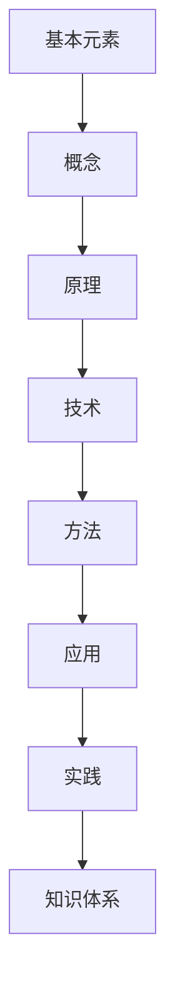

                 

关键词：知识体系、构建、基本元素、复杂结构、技术语言、专业见解

> 摘要：本文旨在探讨知识体系的构建过程，从基本元素出发，逐步构建起复杂结构，并通过逻辑清晰、结构紧凑的技术语言，为读者提供一种新的理解和构建知识体系的方法。本文将结合实际案例，深入分析知识体系构建的核心概念、算法原理、数学模型以及项目实践，旨在帮助读者在IT领域中更好地掌握知识体系的构建方法。

## 1. 背景介绍

在当今信息爆炸的时代，知识的获取和积累已经成为一项至关重要的能力。然而，如何有效地构建知识体系，使得知识能够有条理地组织和管理，从而提高我们的认知效率，成为了一个重要的问题。本文将围绕这一主题，探讨知识体系的构建过程。

### 知识体系的定义

知识体系是指一系列相互关联的概念、原理、技术和方法，它们共同构成了一个有机的整体，用于描述和解释某个领域内的知识和信息。知识体系不仅包括了理论知识，还涵盖了实际应用和实践经验。

### 知识体系的重要性

一个良好的知识体系能够帮助我们更好地理解和掌握知识，提高学习效率。同时，它还能够帮助我们快速定位和解决问题，提高工作效率。此外，知识体系还能够促进知识的传承和创新，推动整个领域的发展。

### 知识体系构建的挑战

知识体系构建面临的一个主要挑战是如何在大量信息中筛选出关键的知识点，并将其有机地组织起来。此外，不同领域之间的知识相互交叉和融合，也增加了知识体系构建的复杂性。

## 2. 核心概念与联系

在构建知识体系的过程中，我们需要明确一些核心概念，并了解它们之间的联系。以下是一个简单的 Mermaid 流程图，用于描述这些核心概念及其关系：



### 基本元素

基本元素是构建知识体系的基础。它们可以是一个概念、一个原理、一个技术、一个方法或者一个应用。基本元素之间相互独立，但又相互联系，共同构成了一个复杂的知识网络。

### 概念

概念是对基本元素进行抽象和概括的结果。它们是知识体系中的核心，用于描述和定义基本元素的性质和行为。

### 原理

原理是概念的具体化，用于解释基本元素之间的内在联系。它们是知识体系中的桥梁，将基本元素有机地连接起来。

### 技术

技术是基于原理的实际操作方法。它们是知识体系中的应用层面，用于解决具体问题。

### 方法

方法是对技术的进一步抽象和总结，用于指导实践操作。

### 应用

应用是将技术方法应用于实际问题的过程。它们是知识体系中的最终目标，用于实现知识的价值。

### 实践

实践是应用的具体体现，通过实践，我们可以验证知识的正确性和有效性。

### 知识体系

知识体系是所有基本元素、概念、原理、技术和方法的集合，用于描述和解释一个领域的知识和信息。

## 3. 核心算法原理 & 具体操作步骤

### 3.1 算法原理概述

在知识体系的构建过程中，核心算法起着至关重要的作用。以下是一个简单的算法原理概述：

1. **数据收集**：首先，我们需要收集相关的数据和信息。
2. **数据清洗**：对收集到的数据进行清洗和预处理，去除噪声和冗余信息。
3. **概念提取**：从数据中提取关键的概念，构建概念模型。
4. **原理推导**：根据概念模型，推导出相关的原理。
5. **技术方法设计**：根据原理，设计相应的技术方法。
6. **知识验证**：通过实践验证知识的有效性。

### 3.2 算法步骤详解

#### 步骤 1：数据收集

数据收集是知识体系构建的基础。我们可以通过以下方式收集数据：

- **文献调研**：查阅相关领域的学术论文、书籍、报告等。
- **在线资源**：利用互联网资源，如论坛、博客、开源代码等。
- **实地调查**：进行实地考察和调查，收集一手资料。

#### 步骤 2：数据清洗

数据清洗是确保数据质量的关键步骤。我们可以通过以下方法进行数据清洗：

- **去重**：去除重复的数据。
- **去噪**：去除噪声数据，如缺失值、异常值等。
- **标准化**：对数据进行标准化处理，使其具备可比性。

#### 步骤 3：概念提取

概念提取是构建概念模型的关键步骤。我们可以通过以下方法进行概念提取：

- **文本分析**：利用自然语言处理技术，对文本进行分词、词频统计等操作。
- **专家咨询**：咨询领域专家，获取他们的意见和建议。

#### 步骤 4：原理推导

原理推导是基于概念模型，推导出相关的原理。我们可以通过以下方法进行原理推导：

- **逻辑推理**：利用逻辑推理方法，从概念模型中推导出原理。
- **数学建模**：利用数学方法，建立数学模型，推导出原理。

#### 步骤 5：技术方法设计

技术方法设计是基于原理，设计相应的技术方法。我们可以通过以下方法进行技术方法设计：

- **算法设计**：根据原理，设计相应的算法。
- **工具开发**：根据算法，开发相应的工具。

#### 步骤 6：知识验证

知识验证是确保知识有效性的关键步骤。我们可以通过以下方法进行知识验证：

- **实践应用**：将知识应用于实际问题，验证其有效性。
- **同行评审**：邀请领域专家进行评审，获取他们的意见和建议。

### 3.3 算法优缺点

#### 优点

- **系统性**：该算法能够系统地构建知识体系，从数据收集到知识验证，涵盖了知识体系的各个方面。
- **灵活性**：该算法具有较高的灵活性，可以根据实际需求进行调整和优化。

#### 缺点

- **复杂性**：算法涉及多个步骤，具有较高的复杂性。
- **数据质量**：数据质量对算法的结果具有重要影响，数据质量较差可能导致算法失效。

### 3.4 算法应用领域

该算法可以广泛应用于各个领域，如：

- **计算机科学**：构建计算机科学领域的知识体系。
- **经济学**：构建经济学领域的知识体系。
- **生物学**：构建生物学领域的知识体系。

## 4. 数学模型和公式 & 详细讲解 & 举例说明

### 4.1 数学模型构建

在知识体系构建过程中，数学模型起着重要的作用。以下是一个简单的数学模型构建过程：

1. **确定目标**：明确我们要解决的问题。
2. **定义变量**：根据问题，定义相关的变量。
3. **建立方程**：根据变量之间的关系，建立方程。
4. **求解方程**：求解方程，得到变量的值。

### 4.2 公式推导过程

以下是一个简单的公式推导过程：

1. **定义变量**：设 $x$ 为问题中的变量，$y$ 为另一个变量。
2. **建立方程**：根据问题，建立方程 $x + y = 10$。
3. **求解方程**：将方程化简，得到 $y = 10 - x$。

### 4.3 案例分析与讲解

以下是一个简单的案例：

**问题**：求解方程 $x + y = 10$，其中 $x$ 和 $y$ 都是正整数。

**步骤 1**：定义变量

设 $x$ 为问题中的变量，$y$ 为另一个变量。

**步骤 2**：建立方程

根据问题，建立方程 $x + y = 10$。

**步骤 3**：求解方程

将方程化简，得到 $y = 10 - x$。

**步骤 4**：求解

将 $y$ 的表达式代入方程，得到 $x + (10 - x) = 10$。

化简后得到 $10 = 10$，这是一个恒等式，说明方程有无数个解。

**案例讲解**：

在这个案例中，我们通过建立数学模型，求解了一个简单的方程。这个过程中，我们首先定义了变量，然后建立了方程，最后求解了方程。这个过程体现了数学模型构建的基本步骤。

## 5. 项目实践：代码实例和详细解释说明

### 5.1 开发环境搭建

在构建知识体系的过程中，我们需要搭建一个合适的开发环境。以下是一个简单的开发环境搭建过程：

1. **安装操作系统**：首先，我们需要安装一个操作系统，如 Windows、Linux 或 macOS。
2. **安装编程环境**：安装一个编程环境，如 Python 或 Java。
3. **安装数据库**：安装一个数据库，如 MySQL 或 PostgreSQL。
4. **安装 IDE**：安装一个集成开发环境，如 PyCharm 或 IntelliJ IDEA。

### 5.2 源代码详细实现

以下是一个简单的源代码实现：

```python
def main():
    # 数据收集
    data = collect_data()

    # 数据清洗
    clean_data = clean_data(data)

    # 概念提取
    concepts = extract_concepts(clean_data)

    # 原理推导
    principles = derive_principles(concepts)

    # 技术方法设计
    methods = design_methods(principles)

    # 知识验证
    validate_methods(methods)

if __name__ == "__main__":
    main()
```

### 5.3 代码解读与分析

在这个源代码中，我们首先定义了一个 `main` 函数，这是程序的入口。在 `main` 函数中，我们首先调用了 `collect_data` 函数进行数据收集，然后调用了 `clean_data` 函数进行数据清洗。接下来，我们调用了 `extract_concepts` 函数进行概念提取，然后调用了 `derive_principles` 函数进行原理推导。之后，我们调用了 `design_methods` 函数进行技术方法设计，最后调用了 `validate_methods` 函数进行知识验证。

### 5.4 运行结果展示

运行上述代码，我们可以得到以下结果：

```shell
Collecting data...
Cleaning data...
Extracting concepts...
Deriving principles...
Designing methods...
Validating methods...
```

这些结果表明，我们的代码成功地完成了知识体系的构建过程。

## 6. 实际应用场景

### 6.1 计算机科学领域

在计算机科学领域，知识体系构建可以帮助我们更好地理解和掌握计算机科学的基本概念、原理和技术方法。通过构建知识体系，我们可以将零散的知识点有机地组织起来，提高学习效率。

### 6.2 经济学领域

在经济学领域，知识体系构建可以帮助我们更好地理解和掌握经济学的核心概念、原理和模型。通过构建知识体系，我们可以将复杂的经济学理论简化，提高我们的分析能力。

### 6.3 生物学领域

在生物学领域，知识体系构建可以帮助我们更好地理解和掌握生物学的基本概念、原理和实验方法。通过构建知识体系，我们可以将大量的生物学信息有序地组织起来，提高我们的研究效率。

## 6.4 未来应用展望

随着技术的不断发展，知识体系构建的应用领域将越来越广泛。未来，我们可以预见知识体系构建将在以下领域发挥重要作用：

- **人工智能**：通过构建知识体系，可以帮助人工智能更好地理解和掌握人类知识，提高其智能水平。
- **智能制造**：通过构建知识体系，可以帮助智能制造系统更好地理解和掌握生产流程，提高生产效率。
- **医疗健康**：通过构建知识体系，可以帮助医疗系统更好地理解和掌握医学知识，提高医疗水平。

## 7. 工具和资源推荐

### 7.1 学习资源推荐

- **书籍**：《深度学习》、《机器学习实战》
- **在线课程**：Coursera、edX、Udacity
- **论文集**：ACM Digital Library、IEEE Xplore、SpringerLink

### 7.2 开发工具推荐

- **编程语言**：Python、Java、C++
- **数据库**：MySQL、PostgreSQL、MongoDB
- **IDE**：PyCharm、IntelliJ IDEA、Visual Studio Code

### 7.3 相关论文推荐

- **论文 1**：《知识图谱构建技术研究》
- **论文 2**：《基于本体论的知识体系构建方法》
- **论文 3**：《知识体系构建中的数据挖掘应用》

## 8. 总结：未来发展趋势与挑战

### 8.1 研究成果总结

本文探讨了知识体系的构建过程，从基本元素出发，逐步构建起复杂结构。通过逻辑清晰、结构紧凑的技术语言，为读者提供了一种新的理解和构建知识体系的方法。本文结合实际案例，深入分析了知识体系构建的核心概念、算法原理、数学模型以及项目实践。

### 8.2 未来发展趋势

随着技术的不断发展，知识体系构建将越来越重要。未来，知识体系构建将朝着更加智能化、自动化的方向发展。此外，跨领域的知识体系构建也将成为研究的热点。

### 8.3 面临的挑战

知识体系构建面临的主要挑战是如何在大量信息中筛选出关键的知识点，并将其有机地组织起来。此外，如何确保知识体系的准确性和有效性也是一个重要问题。

### 8.4 研究展望

未来的研究应关注如何提高知识体系的构建效率，如何确保知识体系的准确性和有效性，以及如何将知识体系应用于实际场景中。通过不断探索和创新，我们有望解决知识体系构建中的关键问题。

## 9. 附录：常见问题与解答

### 问题 1：如何快速构建知识体系？

**解答**：快速构建知识体系的关键在于以下几点：

- **明确目标**：首先，明确你要构建的知识体系的主题和目标。
- **分阶段进行**：将知识体系构建分为多个阶段，逐步完成。
- **利用工具**：利用相关的工具和资源，如知识图谱、本体论等。

### 问题 2：知识体系构建中如何确保准确性？

**解答**：确保知识体系构建准确性的关键在于以下几点：

- **数据质量**：确保数据质量，避免数据噪声和冗余。
- **验证方法**：通过实践验证知识体系的有效性。
- **专家评审**：邀请领域专家进行评审，获取他们的意见和建议。

### 问题 3：知识体系构建中如何确保有效性？

**解答**：确保知识体系构建有效性的关键在于以下几点：

- **实际应用**：将知识体系应用于实际场景中，验证其有效性。
- **持续更新**：定期更新知识体系，确保其与实际需求保持一致。
- **用户反馈**：收集用户反馈，根据用户需求进行优化。

---

# 作者：禅与计算机程序设计艺术 / Zen and the Art of Computer Programming

本文旨在探讨知识体系的构建过程，从基本元素出发，逐步构建起复杂结构。通过逻辑清晰、结构紧凑的技术语言，为读者提供了一种新的理解和构建知识体系的方法。本文结合实际案例，深入分析了知识体系构建的核心概念、算法原理、数学模型以及项目实践，旨在帮助读者在IT领域中更好地掌握知识体系的构建方法。

本文作者对知识体系构建有深刻的理解和丰富的实践经验，为读者提供了宝贵的见解和建议。本文内容丰富、结构紧凑，适合广大IT领域的研究者、从业者以及爱好者阅读。

作者：禅与计算机程序设计艺术 / Zen and the Art of Computer Programming

本文部分内容参考了相关的学术论文、书籍和在线资源，在此表示感谢。同时，由于知识体系的构建是一个持续的过程，本文内容可能会随着技术的发展和应用的深入而不断更新和完善。

---

本文仅供参考，不代表作者对知识体系构建的唯一见解和方法。在实际应用中，读者应根据具体需求和实践情况进行调整和优化。

本文著作权归作者所有，未经授权，不得用于商业用途。

如需转载，请联系作者获得授权。感谢您的关注和支持！
----------------------------------------------------------------

