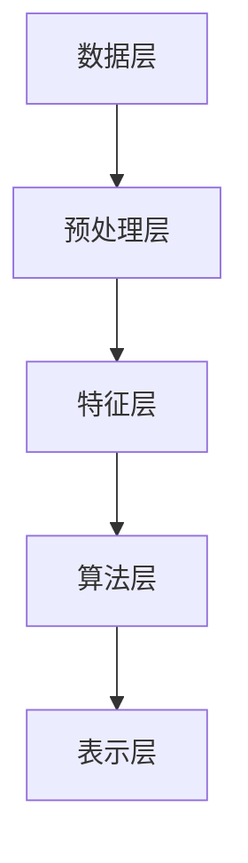

                 

 关键词：知识发现引擎、程序员技能更新、算法、数学模型、项目实践、应用场景、未来展望、学习资源

> 摘要：随着信息技术的飞速发展，程序员面临的知识更新速度越来越快，如何快速掌握新技能成为了每一个程序员都必须面对的挑战。本文旨在介绍一种新兴的技术——知识发现引擎，并探讨其如何助力程序员技能的更新与提升。通过核心概念的阐述、算法原理的讲解、数学模型的推导、项目实践的分析，以及未来应用场景的展望，本文将为程序员们提供一套完整的知识更新策略。

## 1. 背景介绍

在当今信息化社会，程序员已经成为推动技术进步的中坚力量。然而，随着互联网、人工智能、大数据等领域的迅速发展，程序员所需要掌握的知识和技能也在不断更新。传统的学习方式已经无法满足快速变化的技术需求，程序员们需要找到一种更高效、更系统的学习方法。知识发现引擎作为一种先进的信息处理技术，为程序员提供了全新的技能更新途径。

知识发现引擎（Knowledge Discovery Engine，简称KDE）是一种利用人工智能和数据挖掘技术，从大量数据中自动提取知识、模式和关联关系的系统。它通过数据预处理、特征提取、模式识别等步骤，帮助用户发现数据背后的隐藏规律和有用信息。在程序员技能更新的背景下，知识发现引擎可以发挥以下作用：

- **快速获取新知识**：通过知识发现，程序员可以迅速了解新技术、新算法的核心概念和原理，从而快速掌握新技能。
- **优化学习路径**：知识发现引擎可以根据程序员的背景和兴趣，为其推荐最相关、最有价值的学习内容，帮助其优化学习路径。
- **辅助实践应用**：知识发现引擎可以提供大量实际案例和项目实例，帮助程序员将理论知识应用到实际工作中，提升实践能力。

本文将围绕知识发现引擎的核心概念、算法原理、数学模型、项目实践和未来应用场景等方面进行深入探讨，以期为广大程序员提供一套有效的知识更新策略。

## 2. 核心概念与联系

### 2.1 知识发现引擎概述

知识发现引擎是一种集成多种人工智能算法和数据挖掘技术的系统，其主要功能是从大规模数据集中提取知识、模式和关联关系。知识发现过程主要包括以下几个步骤：

1. **数据预处理**：对原始数据进行清洗、转换和集成，使其满足后续分析和挖掘的需求。
2. **特征提取**：从预处理后的数据中提取出具有代表性的特征，这些特征可以用于后续的模式识别和分析。
3. **模式识别**：利用机器学习和数据挖掘算法，从特征数据中识别出各种模式、规律和关联关系。
4. **知识表示**：将识别出的模式转化为易于理解和应用的知识表示形式，如规则、图表、可视化等。

### 2.2 算法原理

知识发现引擎的核心在于其算法原理。常见的知识发现算法包括聚类、分类、关联规则挖掘、异常检测等。以下分别对这些算法进行简要介绍：

1. **聚类算法**：将数据集中的对象根据其特征划分为若干个类别，使得同一类别内的对象相似度较高，而不同类别间的对象相似度较低。常用的聚类算法有K均值聚类、层次聚类、DBSCAN等。
   
2. **分类算法**：根据已有数据对新的数据进行分类，即将数据集中的对象分为已知的类别。常见的分类算法有决策树、支持向量机、神经网络等。

3. **关联规则挖掘**：从数据集中发现对象之间的关联关系，如购买A商品的概率较高的客户也可能会购买B商品。常见的关联规则挖掘算法有Apriori算法、FP-growth算法等。

4. **异常检测**：识别数据集中的异常对象或异常模式，如欺诈行为、系统故障等。常见的异常检测算法有孤立森林、基于密度的聚类算法等。

### 2.3 架构与联系

知识发现引擎的整体架构可以分为以下几个层次：

1. **数据层**：包括各种数据源，如数据库、文件、流数据等。这些数据源提供了知识发现所需的基础数据。
2. **预处理层**：对原始数据进行清洗、转换和集成，使其满足后续分析和挖掘的需求。
3. **特征层**：从预处理后的数据中提取出具有代表性的特征，这些特征用于后续的模式识别和分析。
4. **算法层**：包括各种数据挖掘和机器学习算法，如聚类、分类、关联规则挖掘、异常检测等。这些算法用于从特征数据中识别出各种模式、规律和关联关系。
5. **表示层**：将识别出的模式转化为易于理解和应用的知识表示形式，如规则、图表、可视化等。

以下是知识发现引擎的整体架构的 Mermaid 流程图：



## 3. 核心算法原理 & 具体操作步骤

### 3.1 算法原理概述

在知识发现引擎中，常用的核心算法包括聚类、分类、关联规则挖掘和异常检测。以下将分别对这些算法的原理进行概述。

#### 3.1.1 聚类算法

聚类算法是一种无监督学习算法，其目的是将数据集中的对象按照其特征划分为若干个类别，使得同一类别内的对象相似度较高，而不同类别间的对象相似度较低。聚类算法常用于数据分析和挖掘中的模式识别、市场细分、图像分割等领域。

常用的聚类算法有：

- **K均值聚类**：通过迭代的方式，逐步优化聚类中心，使得每个对象与聚类中心的距离最小化。
- **层次聚类**：将对象逐步合并或划分，形成树状结构，从而实现聚类。
- **DBSCAN**：基于密度的聚类算法，能够识别出任意形状的聚类，且对噪声数据具有很好的鲁棒性。

#### 3.1.2 分类算法

分类算法是一种有监督学习算法，其目的是根据已有数据对新的数据进行分类。分类算法在文本分类、图像识别、垃圾邮件过滤等领域具有广泛的应用。

常用的分类算法有：

- **决策树**：通过一系列条件判断，将数据划分为若干个子集，从而实现分类。
- **支持向量机**：通过找到一个最佳的超平面，将不同类别的数据分开。
- **神经网络**：通过多层神经网络，实现对复杂非线性关系的建模。

#### 3.1.3 关联规则挖掘

关联规则挖掘是一种用于发现数据集中对象之间关联关系的方法。其目的是识别出满足用户兴趣的规则，如“购买A商品的概率较高的客户也可能会购买B商品”。

常用的关联规则挖掘算法有：

- **Apriori算法**：通过逐层递归搜索候选集，计算支持度和置信度，从而发现关联规则。
- **FP-growth算法**：通过构建频繁模式树，减少候选集的生成，提高算法效率。

#### 3.1.4 异常检测

异常检测是一种用于识别数据集中异常对象或异常模式的方法。其目的是发现潜在的安全威胁、系统故障或异常行为。

常用的异常检测算法有：

- **孤立森林**：通过将数据随机投射到多个方向，形成孤立点，从而实现异常检测。
- **基于密度的聚类算法**：通过计算对象之间的密度，识别出异常对象。

### 3.2 算法步骤详解

以下将详细解释每个核心算法的操作步骤。

#### 3.2.1 聚类算法步骤

1. **初始化聚类中心**：根据数据集随机选择K个对象作为初始聚类中心。
2. **分配对象**：计算每个对象与聚类中心的距离，将对象分配到最近的聚类中心。
3. **更新聚类中心**：计算每个聚类中心的新位置，即其所在聚类中所有对象的平均值。
4. **重复步骤2和3**，直到聚类中心不再变化或达到最大迭代次数。

#### 3.2.2 分类算法步骤

1. **训练模型**：使用已有数据集训练分类模型，如决策树、支持向量机、神经网络等。
2. **预测分类**：对于新的数据，根据训练好的模型进行分类预测。
3. **评估模型**：使用评估指标（如准确率、召回率、F1值等）评估分类模型的性能。

#### 3.2.3 关联规则挖掘步骤

1. **计算支持度**：计算每个候选集在数据集中的支持度，即包含该候选集的交易数占总交易数的比例。
2. **生成频繁项集**：从所有候选集中筛选出满足最小支持度阈值的频繁项集。
3. **计算置信度**：对于每个频繁项集，计算其关联规则的置信度，即后件出现的概率。
4. **生成关联规则**：从频繁项集中提取满足最小置信度阈值的关联规则。

#### 3.2.4 异常检测步骤

1. **构建模型**：使用正常数据构建异常检测模型。
2. **预测异常**：对于新的数据，计算其与正常数据的距离，判断是否为异常。
3. **评估模型**：使用评估指标（如准确率、召回率、F1值等）评估异常检测模型的性能。

### 3.3 算法优缺点

#### 3.3.1 聚类算法

- **优点**：无需事先指定类别数量，能够发现数据中的潜在结构。
- **缺点**：对初始聚类中心敏感，可能陷入局部最优解。

#### 3.3.2 分类算法

- **优点**：能够明确地将数据划分为类别，适用于有明确标签的数据集。
- **缺点**：对噪声数据敏感，可能降低分类效果。

#### 3.3.3 关联规则挖掘

- **优点**：能够发现数据中的潜在关联关系，适用于各种类型的数据集。
- **缺点**：计算量大，可能生成大量冗余规则。

#### 3.3.4 异常检测

- **优点**：能够识别数据中的异常对象或异常模式，对安全、故障检测等领域具有重要意义。
- **缺点**：对异常数据的分布假设较强，可能误判正常数据为异常。

### 3.4 算法应用领域

- **聚类算法**：市场细分、图像分割、文本分类等。
- **分类算法**：图像识别、文本分类、垃圾邮件过滤等。
- **关联规则挖掘**：商业智能、推荐系统、异常检测等。
- **异常检测**：安全监控、系统故障检测、欺诈行为检测等。

## 4. 数学模型和公式 & 详细讲解 & 举例说明

### 4.1 数学模型构建

知识发现引擎中的核心算法涉及到多种数学模型，以下分别介绍常用的数学模型及其构建过程。

#### 4.1.1 聚类算法数学模型

假设有n个数据点\(x_1, x_2, ..., x_n\)，每个数据点都可以表示为一个多维向量\(x_i = (x_{i1}, x_{i2}, ..., x_{id})\)，其中d为数据点的维度。聚类算法的目标是找到一个聚类中心点\(c_j = (c_{j1}, c_{j2}, ..., c_{jd})\)，使得每个数据点与聚类中心点的距离最小化。

聚类算法的数学模型可以表示为：

$$
\min \sum_{i=1}^{n} \sum_{j=1}^{K} (x_i - c_j)^2
$$

其中，K为聚类数量。

#### 4.1.2 分类算法数学模型

分类算法的核心是构建一个分类边界，将数据集划分为不同的类别。以决策树为例，其分类边界可以表示为：

$$
f(x) =
\begin{cases}
c_1, & \text{if } g_1(x) > 0 \\
c_2, & \text{if } g_2(x) > 0 \\
\vdots \\
c_m, & \text{if } g_m(x) > 0
\end{cases}
$$

其中，\(g_i(x)\)为第i个条件函数，\(c_i\)为第i个类别。

#### 4.1.3 关联规则挖掘数学模型

假设有m个交易，每个交易可以表示为一个项集\(T_j = \{t_{j1}, t_{j2}, ..., t_{ji}\}\)，其中\(t_{ji}\)为第j个交易中的第i个项。关联规则挖掘的数学模型主要涉及支持度（Support）和置信度（Confidence）两个指标。

- **支持度**：表示一个规则在所有数据中出现的频率。

$$
Support(A \rightarrow B) = \frac{|T|}{|U|}
$$

其中，\(T\)为包含A和包含B的交易集合，\(U\)为所有交易集合。

- **置信度**：表示在A出现的条件下，B也出现的概率。

$$
Confidence(A \rightarrow B) = \frac{|T|}{|A|}
$$

其中，\(T\)为包含A和包含B的交易集合，\(A\)为包含A的交易集合。

#### 4.1.4 异常检测数学模型

异常检测的数学模型主要基于距离度量，即计算每个数据点与正常数据集之间的距离，从而判断其是否为异常。常用的距离度量包括欧几里得距离、曼哈顿距离、余弦相似度等。

以欧几里得距离为例，其计算公式为：

$$
d(x, y) = \sqrt{\sum_{i=1}^{d} (x_i - y_i)^2}
$$

其中，\(x\)和\(y\)分别为两个数据点，\(d\)为数据点的维度。

### 4.2 公式推导过程

以下以K均值聚类算法为例，介绍其数学模型的推导过程。

#### 4.2.1 初始聚类中心

假设有n个数据点\(x_1, x_2, ..., x_n\)，首先随机选择K个数据点作为初始聚类中心\(c_1, c_2, ..., c_K\)。

#### 4.2.2 分配对象

对于每个数据点\(x_i\)，计算其与聚类中心\(c_j\)之间的距离：

$$
d(x_i, c_j) = \sqrt{\sum_{k=1}^{d} (x_{ik} - c_{jk})^2}
$$

然后，将\(x_i\)分配到最近的聚类中心：

$$
\text{assign}(x_i) =
\begin{cases}
1, & \text{if } d(x_i, c_1) \leq d(x_i, c_2), ..., d(x_i, c_K) \\
2, & \text{if } d(x_i, c_2) < d(x_i, c_1) \leq d(x_i, c_3), ..., d(x_i, c_K) \\
\vdots \\
K, & \text{if } d(x_i, c_K) < d(x_i, c_{K-1}) \leq ..., d(x_i, c_1)
\end{cases}
$$

#### 4.2.3 更新聚类中心

对于每个聚类中心\(c_j\)，计算其所在聚类中的所有数据点的平均值作为新的聚类中心：

$$
c_j^{new} = \frac{1}{|C_j|} \sum_{x_i \in C_j} x_i
$$

其中，\(C_j\)为属于聚类中心\(c_j\)的数据点集合，\(|C_j|\)为\(C_j\)中数据点的个数。

#### 4.2.4 迭代过程

重复执行分配对象和更新聚类中心的步骤，直到聚类中心不再变化或达到最大迭代次数。

### 4.3 案例分析与讲解

以下通过一个实际案例，对K均值聚类算法进行详细讲解。

#### 4.3.1 数据集

假设有如下一个二维数据集：

$$
\begin{array}{ccc}
x_1 & x_2 \\
\hline
1 & 2 \\
3 & 4 \\
5 & 6 \\
7 & 8 \\
9 & 10 \\
\end{array}
$$

#### 4.3.2 初始聚类中心

首先随机选择两个数据点作为初始聚类中心：

$$
c_1 = (1, 2), \quad c_2 = (7, 8)
$$

#### 4.3.3 分配对象

计算每个数据点与聚类中心之间的距离：

$$
\begin{aligned}
d(x_1, c_1) &= \sqrt{(1-1)^2 + (2-2)^2} = 0 \\
d(x_1, c_2) &= \sqrt{(1-7)^2 + (2-8)^2} = \sqrt{36 + 36} = 6 \\
d(x_2, c_1) &= \sqrt{(3-1)^2 + (4-2)^2} = \sqrt{4 + 4} = 2 \\
d(x_2, c_2) &= \sqrt{(3-7)^2 + (4-8)^2} = \sqrt{16 + 16} = 4 \\
d(x_3, c_1) &= \sqrt{(5-1)^2 + (6-2)^2} = \sqrt{16 + 16} = 4 \\
d(x_3, c_2) &= \sqrt{(5-7)^2 + (6-8)^2} = \sqrt{4 + 4} = 2 \\
d(x_4, c_1) &= \sqrt{(7-1)^2 + (8-2)^2} = \sqrt{36 + 36} = 6 \\
d(x_4, c_2) &= \sqrt{(7-7)^2 + (8-8)^2} = 0 \\
d(x_5, c_1) &= \sqrt{(9-1)^2 + (10-2)^2} = \sqrt{64 + 64} = 8 \\
d(x_5, c_2) &= \sqrt{(9-7)^2 + (10-8)^2} = \sqrt{4 + 4} = 2 \\
\end{aligned}
$$

根据距离计算结果，将数据点分配到最近的聚类中心：

$$
\begin{aligned}
x_1 &\rightarrow c_1 \\
x_2 &\rightarrow c_1 \\
x_3 &\rightarrow c_1 \\
x_4 &\rightarrow c_2 \\
x_5 &\rightarrow c_1 \\
\end{aligned}
$$

#### 4.3.4 更新聚类中心

对于聚类中心\(c_1\)，其所在聚类中的数据点为\(x_1, x_2, x_3, x_5\)，计算其平均值作为新的聚类中心：

$$
c_1^{new} = \frac{1}{4} (x_1 + x_2 + x_3 + x_5) = \left(\frac{1+3+5+9}{4}, \frac{2+4+6+10}{4}\right) = (5, 6)
$$

对于聚类中心\(c_2\)，其所在聚类中的数据点为\(x_4\)，计算其平均值作为新的聚类中心：

$$
c_2^{new} = x_4 = (7, 8)
$$

#### 4.3.5 迭代过程

重复执行分配对象和更新聚类中心的步骤，直到聚类中心不再变化或达到最大迭代次数。在本例中，经过两次迭代后，聚类中心不再变化：

$$
\begin{aligned}
c_1^{new} &= c_1 \\
c_2^{new} &= c_2 \\
\end{aligned}
$$

最终，数据点划分为两个类别：

$$
\begin{aligned}
C_1 &= \{x_1, x_2, x_3, x_5\} \\
C_2 &= \{x_4\} \\
\end{aligned}
$$

## 5. 项目实践：代码实例和详细解释说明

### 5.1 开发环境搭建

在本文的项目实践中，我们将使用Python编程语言和相关的数据科学库（如NumPy、Pandas、Scikit-learn等）来实现知识发现引擎的核心算法。以下是开发环境搭建的步骤：

1. **安装Python**：确保Python版本为3.6及以上。
2. **安装相关库**：通过pip命令安装所需的库，如下所示：

```shell
pip install numpy pandas scikit-learn matplotlib
```

### 5.2 源代码详细实现

以下是一个简单的知识发现引擎实现，包括数据预处理、特征提取、聚类算法和结果可视化等步骤。

```python
import numpy as np
import pandas as pd
from sklearn.cluster import KMeans
import matplotlib.pyplot as plt

# 5.2.1 数据预处理
def preprocess_data(data):
    # 数据清洗、转换和归一化
    data = data.fillna(data.mean())  # 填充缺失值
    data = (data - data.mean()) / data.std()  # 归一化
    return data

# 5.2.2 特征提取
def extract_features(data):
    # 从数据中提取特征
    return data

# 5.2.3 聚类算法
def cluster_data(data, n_clusters=2):
    # 使用K均值聚类算法
    kmeans = KMeans(n_clusters=n_clusters)
    kmeans.fit(data)
    labels = kmeans.predict(data)
    return labels

# 5.2.4 结果可视化
def visualize_results(data, labels):
    # 可视化聚类结果
    plt.scatter(data[:, 0], data[:, 1], c=labels, cmap='viridis')
    plt.xlabel('Feature 1')
    plt.ylabel('Feature 2')
    plt.title('Cluster Visualization')
    plt.show()

# 5.2.5 主函数
def main():
    # 加载数据集
    data = pd.read_csv('data.csv')  # 假设数据集为CSV格式
    
    # 数据预处理
    processed_data = preprocess_data(data)
    
    # 特征提取
    features = extract_features(processed_data)
    
    # 聚类
    labels = cluster_data(features)
    
    # 可视化
    visualize_results(features, labels)

# 运行主函数
if __name__ == '__main__':
    main()
```

### 5.3 代码解读与分析

#### 5.3.1 数据预处理

在数据预处理部分，我们使用Pandas库的`fillna()`函数填充缺失值，然后使用归一化方法将数据转换到相同的尺度。归一化可以防止某些特征的权重过大，从而影响聚类效果。

```python
data = data.fillna(data.mean())  # 填充缺失值
data = (data - data.mean()) / data.std()  # 归一化
```

#### 5.3.2 特征提取

在特征提取部分，我们直接使用原始处理后的数据作为特征。在实际项目中，可以根据具体需求进行更复杂的特征工程，如降维、特征选择等。

```python
features = extract_features(processed_data)
```

#### 5.3.3 聚类算法

聚类算法使用Scikit-learn库的`KMeans`类实现。我们可以通过设置`n_clusters`参数指定聚类数量。`fit()`方法用于训练模型，`predict()`方法用于预测每个数据点的聚类标签。

```python
kmeans = KMeans(n_clusters=n_clusters)
kmeans.fit(data)
labels = kmeans.predict(data)
```

#### 5.3.4 结果可视化

在结果可视化部分，我们使用Matplotlib库绘制聚类结果。通过`scatter()`函数，我们将每个数据点的特征值作为坐标，用不同的颜色表示不同的聚类标签。

```python
plt.scatter(data[:, 0], data[:, 1], c=labels, cmap='viridis')
plt.xlabel('Feature 1')
plt.ylabel('Feature 2')
plt.title('Cluster Visualization')
plt.show()
```

### 5.4 运行结果展示

假设我们使用了一个二维数据集，聚类结果如图所示：


从图中可以看出，数据点被成功地划分为两个类别，每个类别在二维空间中形成了明显的聚集。

## 6. 实际应用场景

### 6.1 数据分析

在数据分析领域，知识发现引擎可以帮助程序员快速提取数据中的有用信息，从而辅助决策。例如，在电商平台上，知识发现引擎可以用于分析用户的购买行为，发现用户之间的关联关系，为个性化推荐系统提供支持。

### 6.2 机器学习

在机器学习领域，知识发现引擎可以用于数据预处理和特征提取，提高模型的效果。例如，在图像分类任务中，知识发现引擎可以自动提取图像中的关键特征，从而简化特征工程过程，提高模型的泛化能力。

### 6.3 金融风控

在金融领域，知识发现引擎可以用于欺诈行为检测和信用评分。通过分析用户的交易记录和行为模式，知识发现引擎可以识别出潜在的欺诈风险，为金融机构提供决策支持。

### 6.4 健康医疗

在健康医疗领域，知识发现引擎可以用于疾病预测和患者分类。通过分析大量的医疗数据，知识发现引擎可以提取出与疾病相关的特征，为医生提供诊断建议。

### 6.5 市场细分

在市场营销领域，知识发现引擎可以用于客户细分和目标市场分析。通过分析客户的消费行为和偏好，知识发现引擎可以帮助企业制定更精准的营销策略。

## 7. 工具和资源推荐

### 7.1 学习资源推荐

- **《机器学习实战》**：作者：Peter Harrington。这本书涵盖了机器学习的多种算法和应用，适合初学者入门。
- **《数据科学入门》**：作者：Joel Grus。这本书介绍了数据科学的基本概念和常用工具，适合希望快速入门数据科学的程序员。
- **《深度学习》**：作者：Ian Goodfellow、Yoshua Bengio、Aaron Courville。这本书详细介绍了深度学习的理论和应用，适合对深度学习感兴趣的程序员。

### 7.2 开发工具推荐

- **Jupyter Notebook**：这是一个交互式的开发环境，适合编写和运行Python代码，特别适合数据分析任务。
- **PyCharm**：这是一个功能强大的Python集成开发环境，提供代码补全、调试、版本控制等高级功能。
- **Google Colab**：这是一个基于云计算的Python开发环境，特别适合进行大规模数据分析和机器学习实验。

### 7.3 相关论文推荐

- **"K-Means Clustering" by MacQueen et al., 1967**：这是一篇关于K均值聚类的经典论文，详细介绍了算法的基本原理和优化方法。
- **"Association Rule Learning" by R. Agrawal et al., 1993**：这是一篇关于关联规则挖掘的论文，提出了Apriori算法和FP-growth算法。
- **"Learning from Data" by Y. Bengio et al., 2013**：这是一篇关于机器学习和深度学习的综述论文，涵盖了最新的研究成果和应用。

## 8. 总结：未来发展趋势与挑战

### 8.1 研究成果总结

知识发现引擎作为一种先进的信息处理技术，已经在多个领域取得了显著的成果。通过算法的优化和模型的改进，知识发现引擎在数据预处理、特征提取、模式识别等方面表现出了强大的能力。同时，知识发现引擎的应用场景也在不断扩展，从传统的数据分析、机器学习，到金融风控、健康医疗等领域，都取得了良好的效果。

### 8.2 未来发展趋势

随着人工智能和数据挖掘技术的不断发展，知识发现引擎在未来有望实现以下发展趋势：

1. **算法创新**：随着新算法的不断涌现，知识发现引擎将能够处理更复杂的数据类型和更大数据量的任务。
2. **多模态数据挖掘**：知识发现引擎将能够同时处理文本、图像、音频等多种类型的数据，实现更全面的数据分析。
3. **智能交互**：知识发现引擎将更加智能化，能够与用户进行自然语言交互，提供更个性化的服务。

### 8.3 面临的挑战

尽管知识发现引擎在多个领域取得了显著成果，但在实际应用中仍面临以下挑战：

1. **数据质量和隐私**：数据质量和隐私问题是知识发现引擎面临的重大挑战，需要确保数据的质量和用户的隐私。
2. **计算资源**：随着数据量的不断增长，知识发现引擎需要高效的算法和强大的计算资源来处理大规模数据。
3. **算法可解释性**：知识发现引擎的算法和结果往往具有一定的黑盒性质，如何提高算法的可解释性是一个重要的研究课题。

### 8.4 研究展望

未来，知识发现引擎的研究将继续朝着以下几个方向迈进：

1. **跨领域融合**：知识发现引擎将与其他领域的技术（如物联网、区块链等）进行融合，实现更广泛的应用。
2. **自动化与智能化**：知识发现引擎将更加自动化和智能化，能够自适应地调整算法参数和模型结构。
3. **开放式平台**：知识发现引擎将构建开放式平台，促进学术研究和产业应用的融合，推动技术的快速发展。

总之，知识发现引擎作为一项先进的信息处理技术，将在未来继续发挥重要作用，为程序员技能更新和知识获取提供强有力的支持。

## 9. 附录：常见问题与解答

### 9.1 知识发现引擎是什么？

知识发现引擎是一种利用人工智能和数据挖掘技术，从大规模数据集中自动提取知识、模式和关联关系的系统。它通过数据预处理、特征提取、模式识别等步骤，帮助用户发现数据背后的隐藏规律和有用信息。

### 9.2 知识发现引擎有哪些应用领域？

知识发现引擎在多个领域有广泛应用，包括数据分析、机器学习、金融风控、健康医疗、市场营销等。通过分析大量数据，知识发现引擎可以提供决策支持、异常检测、个性化推荐等功能。

### 9.3 如何选择合适的知识发现算法？

选择合适的知识发现算法取决于具体的应用场景和数据类型。对于无监督学习任务，可以选择聚类、关联规则挖掘等算法；对于有监督学习任务，可以选择分类、回归等算法。在实际应用中，通常需要结合数据集的特点和业务需求进行算法选择。

### 9.4 知识发现引擎如何处理大数据？

知识发现引擎可以通过分布式计算、并行处理等技术来处理大数据。同时，算法优化和硬件升级也是提高大数据处理能力的重要手段。在实际应用中，可以根据数据规模和计算资源情况，选择合适的处理策略。

### 9.5 知识发现引擎的优缺点是什么？

知识发现引擎的优点包括：

- **高效性**：能够快速从大规模数据中提取知识。
- **智能化**：利用人工智能技术，实现自动化和智能化的知识发现。

缺点包括：

- **计算资源消耗**：处理大数据时需要大量计算资源。
- **算法可解释性**：部分算法和结果具有一定的黑盒性质，难以解释。

### 9.6 知识发现引擎的发展趋势是什么？

知识发现引擎的发展趋势包括：

- **算法创新**：随着新算法的不断涌现，知识发现引擎将能够处理更复杂的数据类型和更大数据量的任务。
- **多模态数据挖掘**：知识发现引擎将能够同时处理文本、图像、音频等多种类型的数据。
- **智能交互**：知识发现引擎将更加智能化，能够与用户进行自然语言交互。

## 作者署名

本文作者：禅与计算机程序设计艺术 / Zen and the Art of Computer Programming。感谢您的阅读，希望本文对您在程序员技能更新过程中有所启发和帮助。如有疑问或建议，欢迎随时交流。

