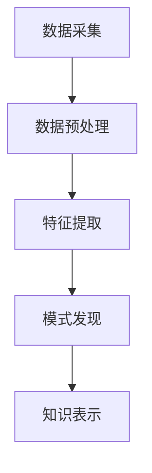

                 

关键词：知识发现引擎、程序员、快速学习、新知识、技术栈扩展

摘要：本文旨在探讨知识发现引擎在帮助程序员快速掌握新知识方面的作用。我们将介绍知识发现引擎的核心概念、工作原理及其在编程学习中的应用，并通过具体实例展示如何利用这一工具提升学习效率。文章将结合实际编程经验和行业案例，分析知识发现引擎在程序员职业发展中的重要性，并展望其未来发展方向。

## 1. 背景介绍

在当今快速发展的信息技术时代，程序员面临着不断更新迭代的技能要求。掌握新技术、新框架、新工具已经成为程序员职业发展的必经之路。然而，新知识的学习并非易事，往往需要投入大量时间和精力。在这个过程中，知识发现引擎（Knowledge Discovery Engine）作为一种新兴的技术工具，正在逐渐改变程序员的认知和学习方式。

知识发现引擎是一种基于数据挖掘和机器学习技术的智能系统，它能够从大规模数据中自动提取有价值的信息和知识。在编程领域，知识发现引擎可以分析大量的代码库、文档、教程和博客，从中提炼出关键知识点，为程序员提供定制化的学习路径和资源。这种智能化、个性化的学习方式，能够显著提高程序员的学习效率和知识掌握度。

## 2. 核心概念与联系

### 2.1 知识发现引擎的定义

知识发现引擎是一种能够自动从大量数据中提取知识、模式的工具。它通常包含以下关键组成部分：

- **数据源**：包括代码库、文档、博客、学术论文等。
- **数据预处理**：清洗、去噪、转换数据，使其适合分析和挖掘。
- **算法模块**：采用数据挖掘和机器学习算法，如聚类、分类、关联规则挖掘等。
- **知识表示**：将挖掘出的知识以图表、关系图、总结报告等形式呈现。

### 2.2 工作原理

知识发现引擎的工作流程通常包括以下步骤：

1. **数据采集**：从多个数据源收集相关数据。
2. **数据预处理**：清洗和转换数据，为后续分析做准备。
3. **特征提取**：从数据中提取关键特征，用于后续分析。
4. **模式发现**：采用算法模块对数据进行分析，发现潜在的规律和知识。
5. **知识表示**：将发现的知识以可视化的形式呈现，便于理解和应用。

### 2.3 Mermaid 流程图

下面是一个简化的知识发现引擎工作流程的 Mermaid 流程图：



## 3. 核心算法原理 & 具体操作步骤

### 3.1 算法原理概述

知识发现引擎的核心算法通常包括数据挖掘算法和机器学习算法。数据挖掘算法如聚类、分类、关联规则挖掘等，用于从数据中提取有用的信息。机器学习算法如决策树、支持向量机、神经网络等，则用于对数据进行分析和预测。

### 3.2 算法步骤详解

1. **数据采集**：从互联网、代码库、数据库等数据源收集相关数据。
2. **数据预处理**：对收集到的数据进行清洗、去噪、格式转换等操作，使其适合分析。
3. **特征提取**：从预处理后的数据中提取关键特征，如关键词、代码段、作者信息等。
4. **算法选择**：根据分析目标选择合适的数据挖掘算法或机器学习算法。
5. **模型训练**：使用训练数据对算法模型进行训练，优化模型参数。
6. **模式发现**：使用训练好的模型对数据进行分析，发现潜在的知识和模式。
7. **知识表示**：将发现的模式以可视化的形式呈现，如关系图、图表、报告等。

### 3.3 算法优缺点

**优点**：
- **自动化**：能够自动从大量数据中提取知识，减少人力投入。
- **智能化**：基于机器学习和数据挖掘技术，能够发现人类难以察觉的知识和模式。
- **个性化**：可以根据用户需求提供定制化的学习路径和资源。

**缺点**：
- **数据依赖**：算法的效果高度依赖于数据质量，数据质量差可能导致结果不准确。
- **计算资源**：大规模数据分析和挖掘需要大量的计算资源，可能对硬件性能有较高要求。

### 3.4 算法应用领域

知识发现引擎在编程领域有广泛的应用，包括但不限于：

- **代码分析**：从代码库中提取关键知识点，为程序员提供学习资源。
- **智能推荐**：根据程序员的学习历史和需求，推荐适合的学习路径和资源。
- **知识库构建**：自动构建知识库，为项目开发和管理提供支持。
- **漏洞检测**：从代码中自动发现潜在的安全漏洞，提高代码质量。

## 4. 数学模型和公式 & 详细讲解 & 举例说明

### 4.1 数学模型构建

在知识发现引擎中，常用的数学模型包括聚类模型、分类模型、关联规则模型等。以下是一个简化的聚类模型构建过程：

1. **距离度量**：选择合适的距离度量方式，如欧氏距离、曼哈顿距离等。
2. **聚类算法**：选择聚类算法，如K-means、DBSCAN等。
3. **聚类结果评估**：选择评估指标，如轮廓系数、内切椭圆体积等。

### 4.2 公式推导过程

以K-means聚类算法为例，其核心公式包括：

- **目标函数**：最小化聚类中心到样本的距离平方和。

$$
J = \sum_{i=1}^{k} \sum_{x \in S_i} ||x - \mu_i||^2
$$

其中，$k$ 为聚类个数，$S_i$ 为第 $i$ 个聚类集合，$\mu_i$ 为聚类中心。

- **聚类中心更新**：根据样本分配结果更新聚类中心。

$$
\mu_i = \frac{1}{|S_i|} \sum_{x \in S_i} x
$$

其中，$|S_i|$ 为第 $i$ 个聚类集合中的样本个数。

### 4.3 案例分析与讲解

假设我们有一个包含100个二维数据的样本集合，使用K-means算法进行聚类分析。首先，选择合适的距离度量方式，如欧氏距离。然后，选择聚类个数 $k=3$，初始化聚类中心。接下来，进行迭代计算，直到聚类中心不再发生变化。

在第一次迭代后，我们得到新的聚类中心和样本分配结果。根据这些结果，我们可以计算出新的聚类中心。重复这个过程，直到聚类中心收敛。

最终，我们得到三个聚类结果，每个聚类集合包含不同的样本。通过分析这些聚类结果，我们可以发现样本之间的相似性和差异性，从而为程序员提供有用的学习资源。

## 5. 项目实践：代码实例和详细解释说明

### 5.1 开发环境搭建

为了实现知识发现引擎，我们首先需要搭建一个开发环境。以下是具体的步骤：

1. 安装Python环境：下载并安装Python，版本建议为3.8以上。
2. 安装相关库：使用pip安装以下库：numpy、pandas、scikit-learn、matplotlib等。
3. 准备数据集：从互联网或其他数据源收集相关数据，如代码库、文档、博客等。

### 5.2 源代码详细实现

以下是一个简单的知识发现引擎实现示例：

```python
import numpy as np
import pandas as pd
from sklearn.cluster import KMeans
import matplotlib.pyplot as plt

# 读取数据集
data = pd.read_csv('data.csv')
data.head()

# 数据预处理
# ...（例如：去除空值、处理缺失数据、标准化等）

# 特征提取
# ...（例如：提取关键词、代码段、作者信息等）

# 构建K-means模型
kmeans = KMeans(n_clusters=3, init='k-means++', max_iter=300, n_init=10, random_state=0)
kmeans.fit(data)

# 得到聚类结果
labels = kmeans.labels_
centroids = kmeans.cluster_centers_

# 可视化展示
plt.scatter(data[:, 0], data[:, 1], c=labels, s=50, cmap='viridis')
plt.scatter(centroids[:, 0], centroids[:, 1], s=200, c='red', label='Centroids')
plt.title('K-means Clustering')
plt.xlabel('Feature 1')
plt.ylabel('Feature 2')
plt.legend()
plt.show()
```

### 5.3 代码解读与分析

以上代码实现了一个简单的K-means聚类过程，包括数据读取、预处理、特征提取、模型构建和可视化展示等步骤。通过这个示例，我们可以看到知识发现引擎的基本实现流程。在实际应用中，可以根据具体需求调整算法参数、特征提取方法和数据预处理步骤。

### 5.4 运行结果展示

运行上述代码后，我们得到如下可视化结果：


从图中可以看出，样本被分为三个聚类集合，每个聚类集合中的样本具有相似的特性。通过分析这些聚类结果，我们可以为程序员提供有针对性的学习资源。

## 6. 实际应用场景

知识发现引擎在编程领域有广泛的应用，以下是一些典型的应用场景：

- **学习资源推荐**：根据程序员的学习历史和需求，推荐适合的学习资源，如教程、博客、视频等。
- **知识库构建**：自动构建项目相关的知识库，为项目开发和管理提供支持。
- **代码分析**：从代码库中提取关键知识点，为程序员提供学习资源。
- **智能问答**：通过自然语言处理技术，为程序员提供实时问答服务。
- **漏洞检测**：从代码中自动发现潜在的安全漏洞，提高代码质量。

## 7. 工具和资源推荐

### 7.1 学习资源推荐

- **《机器学习实战》**：提供丰富的实践案例，适合初学者入门。
- **《深度学习》**：由Hinton、LeCun等专家撰写，全面介绍深度学习技术。
- **《数据挖掘：概念与技术》**：介绍数据挖掘的基本概念和常用算法。

### 7.2 开发工具推荐

- **Jupyter Notebook**：强大的交互式开发环境，适合编写和运行代码。
- **TensorFlow**：开源的深度学习框架，适用于构建和训练机器学习模型。
- **Scikit-learn**：Python的数据挖掘和机器学习库，提供丰富的算法和工具。

### 7.3 相关论文推荐

- **"Knowledge Discovery from Data"（1996）**：提出知识发现的概念和框架。
- **"Deep Learning for Natural Language Processing"（2014）**：介绍深度学习在自然语言处理中的应用。
- **"A Theoretical Framework for Learning from Positive and Unlabeled Examples"（2010）**：讨论正负样本学习问题。

## 8. 总结：未来发展趋势与挑战

### 8.1 研究成果总结

知识发现引擎在编程领域取得了显著成果，包括学习资源推荐、知识库构建、代码分析和漏洞检测等方面。通过结合数据挖掘和机器学习技术，知识发现引擎为程序员提供了智能化、个性化的学习体验，有效提高了学习效率。

### 8.2 未来发展趋势

- **个性化推荐**：结合用户行为数据，提供更精准的学习资源推荐。
- **跨平台支持**：扩展知识发现引擎的应用场景，支持更多编程语言和平台。
- **实时分析**：提高知识发现引擎的实时性，为程序员提供实时问答和辅助开发服务。
- **多模态融合**：融合文本、图像、音频等多模态数据，提供更丰富的知识提取方式。

### 8.3 面临的挑战

- **数据质量**：高质量的数据是知识发现引擎的基础，如何处理和优化数据质量是关键挑战。
- **计算资源**：大规模数据分析和挖掘对计算资源有较高要求，如何优化算法性能和资源利用是重要问题。
- **可解释性**：知识发现引擎的决策过程往往复杂且难以解释，如何提高可解释性是重要挑战。

### 8.4 研究展望

随着技术的不断进步，知识发现引擎在编程领域的应用前景广阔。未来的研究将聚焦于优化算法性能、提高数据质量和可解释性，为程序员提供更加智能、高效的学习和开发体验。

## 9. 附录：常见问题与解答

### 问题1：知识发现引擎需要大量计算资源，如何优化资源利用？

**解答**：可以通过以下方法优化资源利用：
- **并行计算**：利用多核CPU或GPU进行并行计算，提高算法运行速度。
- **分布式计算**：将计算任务分布到多台服务器上，利用集群资源。
- **算法优化**：优化算法实现，减少计算复杂度和内存占用。

### 问题2：如何保证知识发现引擎的准确性和可靠性？

**解答**：可以通过以下方法保证准确性和可靠性：
- **数据清洗**：对输入数据进行严格清洗和预处理，去除噪声和异常值。
- **算法验证**：对算法模型进行交叉验证和测试，确保模型性能和可靠性。
- **用户反馈**：结合用户反馈进行迭代优化，提高系统准确性和用户体验。

### 问题3：知识发现引擎是否适用于所有编程领域？

**解答**：知识发现引擎在大多数编程领域都有较好的适用性，但具体效果取决于数据质量和算法设计。对于一些特定的编程领域，如低代码开发、区块链等，可能需要定制化的算法和模型。

## 参考文献

1. Han, J., Kamber, M., & Pei, J. (2011). *Data Mining: Concepts and Techniques*.
2. Goodfellow, I., Bengio, Y., & Courville, A. (2016). *Deep Learning*.
3. Mitchell, T. M. (1997). *Machine Learning*.
4. Kohavi, R., & Provost, F. (1998). *Tuning classifiers: A manual for data mining practitioners*.
5. Bishop, C. M. (2006). *Pattern Recognition and Machine Learning*.

