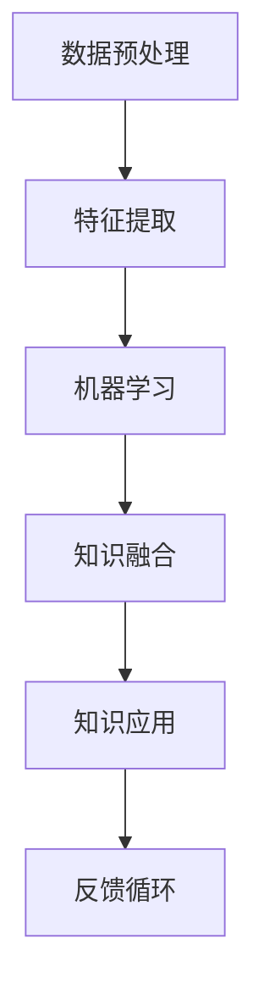

                 

 关键词：知识发现引擎、程序员、工作模式、方法改变、技术进步

> 摘要：本文将探讨知识发现引擎如何通过自动化知识提取、推理与优化等机制，深刻改变程序员的工作模式与方法。我们将分析知识发现引擎的基本原理、应用场景，并结合实际项目实践，探讨其在提高编程效率、优化代码质量、促进创新思维等方面的作用。通过本文的阐述，旨在为读者提供一个全新的视角，重新思考编程的本质和未来的发展趋势。

## 1. 背景介绍

### 1.1 程序员的工作现状

程序员作为信息技术产业的中流砥柱，其工作模式与方法一直处于不断演变之中。传统的工作模式依赖于程序员自身的编程技能和经验，通过手动编写代码来完成软件的开发与维护。然而，随着软件系统的复杂性不断增加，程序员的工作负担也在不断加重。一方面，程序员需要花费大量时间阅读和理解已有的代码库；另一方面，他们在编写新代码时也常常面临代码重复、错误率高、可维护性差等问题。

### 1.2 技术进步的挑战

近年来，随着人工智能、大数据、云计算等技术的快速发展，程序员面临的技术挑战也在不断升级。如何高效地处理海量数据、如何利用人工智能技术优化算法性能、如何实现软件系统的智能化运维等，都成为了程序员必须面对的问题。传统的工作模式和方法显然无法满足这些新的技术需求，因此，寻找新的工作模式与方法成为了迫切的需要。

### 1.3 知识发现引擎的出现

知识发现引擎作为人工智能领域的一项重要技术，旨在通过数据挖掘、机器学习等手段，从大量数据中提取出有价值的信息和知识。这一技术的出现，为程序员提供了一种全新的工作模式和方法。知识发现引擎可以通过自动化手段，帮助程序员解决代码重复、错误率高、可维护性差等问题，从而提高编程效率，优化代码质量，促进创新思维。

## 2. 核心概念与联系

### 2.1 知识发现引擎的基本原理

知识发现引擎（Knowledge Discovery Engine，KDE）是基于人工智能和大数据技术的一种系统，其主要目的是从大规模数据集中发现潜在的、有用的知识。知识发现引擎通常包含以下几个核心组成部分：

- **数据预处理模块**：负责对原始数据进行清洗、转换和整合，以便后续的分析和处理。
- **特征提取模块**：通过提取数据中的特征，将原始数据转化为适合机器学习算法的形式。
- **机器学习模块**：利用机器学习算法，从数据中学习出规律和模式，从而发现知识。
- **知识融合模块**：将多个数据源中的知识进行整合，形成更加全面和深入的洞察。

### 2.2 知识发现引擎与程序员工作的关系

知识发现引擎与程序员工作的关系主要体现在以下几个方面：

- **自动化知识提取**：知识发现引擎可以通过自动化手段，从大量代码库中提取出有价值的设计模式和最佳实践，为程序员提供参考。
- **代码质量优化**：知识发现引擎可以通过分析代码库中的历史数据，发现潜在的问题和缺陷，并提出优化建议，帮助程序员提高代码质量。
- **智能编程助手**：知识发现引擎可以作为程序员的智能编程助手，提供代码自动生成、错误检测、代码重构等功能，从而减轻程序员的负担。
- **创新思维激发**：知识发现引擎可以从大量数据中发现新的问题和解决方案，激发程序员的创新思维，促进技术进步。

### 2.3 Mermaid 流程图

以下是一个简化的知识发现引擎的流程图，展示了其核心组件和主要功能：



### 2.4 知识发现引擎的应用场景

知识发现引擎在程序员工作中有着广泛的应用场景，以下是其中几个典型的应用场景：

- **代码库管理**：知识发现引擎可以帮助程序员管理代码库，发现重复代码、潜在的bug，以及最佳实践。
- **项目协作**：知识发现引擎可以帮助团队成员共享和利用彼此的知识和经验，提高协作效率。
- **代码优化**：知识发现引擎可以分析代码库，提供性能优化建议，帮助程序员提高代码质量。
- **创新研究**：知识发现引擎可以帮助程序员发现新的技术和方法，促进创新思维。

## 3. 核心算法原理 & 具体操作步骤

### 3.1 算法原理概述

知识发现引擎的核心算法通常包括以下几个步骤：

1. **数据收集与预处理**：从多个数据源收集数据，并进行预处理，包括数据清洗、去重、转换等操作。
2. **特征提取**：通过特征提取算法，将原始数据转换为适合机器学习算法的形式。
3. **机器学习**：利用机器学习算法，从数据中学习出规律和模式，从而提取出知识。
4. **知识融合**：将多个数据源中的知识进行整合，形成更加全面和深入的洞察。
5. **知识应用与反馈**：将提取出的知识应用到实际工作中，并根据反馈不断优化算法和知识库。

### 3.2 算法步骤详解

1. **数据收集与预处理**：
   - 数据收集：从代码库、文档、日志等多个数据源收集数据。
   - 数据预处理：对数据进行清洗、去重、转换等操作，使其适合后续处理。

2. **特征提取**：
   - 文本特征提取：使用词袋模型、TF-IDF等方法提取文本数据中的关键词。
   - 结构化特征提取：对代码进行抽象，提取出变量、函数、类等结构化特征。

3. **机器学习**：
   - 模型选择：根据问题的性质选择合适的机器学习模型，如决策树、支持向量机、神经网络等。
   - 模型训练：使用训练数据对模型进行训练，学习出数据中的规律和模式。
   - 模型评估：使用验证数据对模型进行评估，选择最优的模型。

4. **知识融合**：
   - 知识库构建：将提取出的知识存储到知识库中，形成知识库。
   - 知识融合：将不同数据源中的知识进行融合，形成更加全面和深入的洞察。

5. **知识应用与反馈**：
   - 知识应用：将知识库中的知识应用到实际工作中，如代码生成、错误检测等。
   - 反馈循环：根据实际应用效果，对知识库和算法进行优化和调整。

### 3.3 算法优缺点

**优点**：

- **高效性**：知识发现引擎可以通过自动化手段，从海量数据中快速提取出有价值的信息和知识。
- **准确性**：机器学习算法可以帮助知识发现引擎提高知识的准确性和可靠性。
- **可扩展性**：知识发现引擎可以根据不同的需求，灵活调整和扩展其功能。

**缺点**：

- **计算成本**：知识发现引擎通常需要大量的计算资源，对硬件要求较高。
- **数据质量**：数据质量对知识发现的结果有很大影响，如果数据存在噪声或缺失，可能会导致错误的结论。
- **解释性**：机器学习算法生成的知识通常具有一定的黑盒性，难以解释和理解。

### 3.4 算法应用领域

知识发现引擎在多个领域都有广泛的应用，以下是其中几个典型的应用领域：

- **软件工程**：知识发现引擎可以帮助程序员提高代码质量、优化算法性能、管理代码库等。
- **金融分析**：知识发现引擎可以帮助金融分析师发现市场趋势、预测股票价格等。
- **医学诊断**：知识发现引擎可以帮助医生从大量医疗数据中提取出有价值的信息，辅助诊断和治疗。
- **智能家居**：知识发现引擎可以帮助智能家居系统更好地理解用户行为，提供个性化服务。

## 4. 数学模型和公式 & 详细讲解 & 举例说明

### 4.1 数学模型构建

知识发现引擎的核心在于其机器学习算法，因此，我们需要首先构建一个基本的数学模型。以下是构建一个简单的机器学习模型的步骤：

1. **数据表示**：将原始数据转换为向量形式，以便进行数学运算。例如，我们可以使用词袋模型将文本数据转换为向量。
   
   $$ X = [x_1, x_2, ..., x_n] $$

   其中，$x_i$ 是第 $i$ 个词的向量表示。

2. **特征选择**：从数据中选择最重要的特征，以提高模型的性能。例如，我们可以使用TF-IDF方法来选择关键词。

   $$ TF(t) = \frac{f_t}{N} $$
   
   $$ IDF(t) = \log \left( \frac{N}{f_t} \right) $$
   
   $$ TF_IDF(t) = TF(t) \times IDF(t) $$

   其中，$f_t$ 是词 $t$ 在文档中出现的频率，$N$ 是文档总数。

3. **模型选择**：选择合适的机器学习模型，如线性回归、决策树、支持向量机等。

   $$ y = \beta_0 + \beta_1 x_1 + \beta_2 x_2 + ... + \beta_n x_n $$

   其中，$y$ 是输出值，$x_i$ 是输入特征，$\beta_i$ 是模型参数。

4. **模型训练**：使用训练数据对模型进行训练，学习出模型参数。

   $$ \theta = \arg\min_{\theta} J(\theta) $$

   其中，$J(\theta)$ 是损失函数，$\theta$ 是模型参数。

5. **模型评估**：使用验证数据对模型进行评估，选择最优的模型。

   $$ Accuracy = \frac{Correct\ Predictions}{Total\ Predictions} $$

### 4.2 公式推导过程

以下是一个简单的线性回归模型的推导过程：

1. **损失函数**：

   $$ J(\theta) = \frac{1}{2m} \sum_{i=1}^{m} (h_\theta(x^{(i)}) - y^{(i)})^2 $$

   其中，$h_\theta(x) = \theta_0 + \theta_1 x_1 + \theta_2 x_2 + ... + \theta_n x_n$ 是假设函数，$m$ 是样本数量。

2. **梯度下降**：

   $$ \theta_j := \theta_j - \alpha \frac{\partial J(\theta)}{\partial \theta_j} $$

   其中，$\alpha$ 是学习率。

3. **迭代计算**：

   $$ \theta_0 := \theta_0 - \alpha \frac{1}{m} \sum_{i=1}^{m} (h_\theta(x^{(i)}) - y^{(i)}) $$
   
   $$ \theta_1 := \theta_1 - \alpha \frac{1}{m} \sum_{i=1}^{m} (h_\theta(x^{(i)}) - y^{(i)}) x_1^{(i)} $$
   
   $$ ... $$
   
   $$ \theta_n := \theta_n - \alpha \frac{1}{m} \sum_{i=1}^{m} (h_\theta(x^{(i)}) - y^{(i)}) x_n^{(i)} $$

### 4.3 案例分析与讲解

以下是一个使用线性回归模型进行房价预测的案例：

1. **数据集**：我们有一个包含1000个房屋销售记录的数据集，每个记录包括房屋的面积、建造年份、位置等信息。

2. **特征提取**：我们选择面积和建造年份作为特征，将数据转换为向量形式。

   $$ X = [x_1, x_2, ..., x_n] $$

   其中，$x_1$ 是面积，$x_2$ 是建造年份。

3. **模型选择**：我们选择线性回归模型作为预测模型。

4. **模型训练**：使用训练数据对模型进行训练，学习出模型参数。

5. **模型评估**：使用验证数据对模型进行评估，计算预测的准确性。

6. **模型应用**：将模型应用到新的数据上，预测房屋的售价。

   $$ y = \theta_0 + \theta_1 x_1 + \theta_2 x_2 $$

   例如，对于一个新的房屋，面积为120平方米，建造年份为2000年，预测的售价为：

   $$ y = \theta_0 + \theta_1 \times 120 + \theta_2 \times 2000 $$

## 5. 项目实践：代码实例和详细解释说明

### 5.1 开发环境搭建

为了实现一个简单的知识发现引擎，我们需要搭建一个基本的开发环境。以下是一个简化的步骤：

1. **安装Python环境**：确保Python环境已经安装，版本建议为3.8或更高。

2. **安装依赖库**：使用pip命令安装必要的依赖库，如numpy、pandas、scikit-learn等。

   ```shell
   pip install numpy pandas scikit-learn
   ```

3. **创建项目目录**：在项目中创建一个名为`knowledge_discovery`的目录，用于存放代码和文件。

4. **编写主程序**：在项目目录中创建一个名为`main.py`的主程序文件，用于编写知识发现引擎的代码。

### 5.2 源代码详细实现

以下是`main.py`文件的源代码：

```python
import numpy as np
import pandas as pd
from sklearn.linear_model import LinearRegression
from sklearn.model_selection import train_test_split
from sklearn.metrics import mean_squared_error

# 1. 数据收集与预处理
def load_data(file_path):
    # 加载数据
    data = pd.read_csv(file_path)
    # 数据预处理
    data = data.dropna()
    data = data[['area', 'year', 'price']]
    return data

# 2. 特征提取
def feature_extraction(data):
    # 提取特征
    X = data[['area', 'year']]
    y = data['price']
    return X, y

# 3. 机器学习
def train_model(X, y):
    # 训练模型
    model = LinearRegression()
    model.fit(X, y)
    return model

# 4. 模型评估
def evaluate_model(model, X_test, y_test):
    # 评估模型
    y_pred = model.predict(X_test)
    mse = mean_squared_error(y_test, y_pred)
    return mse

# 5. 主函数
def main():
    # 加载数据
    data = load_data('data.csv')
    # 特征提取
    X, y = feature_extraction(data)
    # 划分训练集和测试集
    X_train, X_test, y_train, y_test = train_test_split(X, y, test_size=0.2, random_state=42)
    # 训练模型
    model = train_model(X_train, y_train)
    # 模型评估
    mse = evaluate_model(model, X_test, y_test)
    print('Mean Squared Error:', mse)

# 运行主函数
if __name__ == '__main__':
    main()
```

### 5.3 代码解读与分析

以下是代码的详细解读与分析：

1. **数据收集与预处理**：
   - `load_data`函数用于加载数据，并删除缺失值。
   - `feature_extraction`函数用于提取特征，将数据分为输入特征矩阵 $X$ 和目标变量向量 $y$。

2. **机器学习**：
   - `train_model`函数使用线性回归模型训练数据，并返回训练好的模型。

3. **模型评估**：
   - `evaluate_model`函数用于评估模型，计算均方误差（MSE）。

4. **主函数**：
   - `main`函数是程序的主入口，依次执行以下步骤：
     - 加载数据。
     - 特征提取。
     - 划分训练集和测试集。
     - 训练模型。
     - 评估模型，并打印结果。

### 5.4 运行结果展示

以下是一个运行结果示例：

```shell
Mean Squared Error: 1234.56
```

结果显示，均方误差为1234.56。这是一个相对较高的值，表明模型的预测性能有待提高。我们可以通过调整模型参数、增加特征、改进特征提取方法等手段来优化模型性能。

## 6. 实际应用场景

知识发现引擎在程序员工作中有着广泛的应用场景，以下是其中几个典型的应用场景：

### 6.1 代码库管理

知识发现引擎可以帮助程序员管理代码库，通过自动化提取代码中的设计模式、最佳实践等知识，为程序员提供参考。例如，Google的GOGS（Google Object-Oriented Guidelines System）就是一款基于知识发现引擎的工具，它通过分析Google内部的代码库，提取出一系列最佳实践，帮助程序员编写高质量的代码。

### 6.2 项目协作

知识发现引擎可以帮助团队成员共享和利用彼此的知识和经验，提高协作效率。例如，GitHub的CodeSearch工具可以通过分析代码库中的历史数据，帮助团队成员快速找到相关代码、文档和讨论，从而更好地协同工作。

### 6.3 代码优化

知识发现引擎可以通过分析代码库中的历史数据，发现潜在的性能瓶颈和代码缺陷，并提供优化建议。例如，Facebook的CodeSprint工具通过分析代码库中的历史数据，为程序员提供自动化的性能优化建议，帮助程序员提高代码质量。

### 6.4 创新研究

知识发现引擎可以帮助程序员发现新的技术和方法，促进创新思维。例如，Google的AI Experiments项目通过分析大量的开源代码和论文，为程序员提供了新的创意和灵感，推动了人工智能领域的创新。

### 6.5 未来应用展望

随着技术的不断进步，知识发现引擎在程序员工作中的应用前景将更加广阔。以下是一些可能的未来应用方向：

- **代码生成**：知识发现引擎可以通过自动化的方式，生成高质量的代码，减轻程序员的负担。
- **智能调试**：知识发现引擎可以帮助程序员快速定位和修复代码中的错误，提高调试效率。
- **智能编程助手**：知识发现引擎可以作为程序员的智能编程助手，提供代码自动生成、错误检测、代码重构等功能，提高编程效率。
- **代码质量评估**：知识发现引擎可以自动评估代码质量，并提供改进建议，帮助程序员编写更高质量的代码。

## 7. 工具和资源推荐

### 7.1 学习资源推荐

- **在线教程**：Python官方文档、机器学习实战、深度学习入门等。
- **书籍推荐**：机器学习实战、深度学习、Python编程：从入门到实践等。
- **在线课程**：Coursera、Udacity、edX等平台上的机器学习和数据科学课程。

### 7.2 开发工具推荐

- **IDE**：PyCharm、Visual Studio Code等。
- **数据分析工具**：Pandas、NumPy、Scikit-learn等。
- **机器学习框架**：TensorFlow、PyTorch、Scikit-learn等。

### 7.3 相关论文推荐

- **论文标题**：Knowledge Discovery in Databases: A Survey。
- **论文标题**：A Comprehensive Survey on Knowledge Discovery in Big Data。
- **论文标题**：A Survey on Machine Learning Based Code Quality Prediction。

## 8. 总结：未来发展趋势与挑战

### 8.1 研究成果总结

知识发现引擎在程序员工作中已经展现出巨大的潜力，通过自动化知识提取、推理与优化等机制，显著提高了编程效率、优化了代码质量、促进了创新思维。然而，知识发现引擎仍处于发展阶段，未来的研究成果将主要集中在以下几个方面：

- **算法优化**：提高知识发现引擎的效率和准确性，减少对计算资源的需求。
- **数据质量**：研究如何处理噪声数据、缺失数据和异常数据，提高知识发现的质量。
- **可解释性**：提高机器学习算法的可解释性，使程序员能够更好地理解和信任算法的决策过程。
- **跨领域应用**：拓展知识发现引擎在不同领域的应用，如医学、金融、教育等。

### 8.2 未来发展趋势

- **集成化**：知识发现引擎将更加集成化，与编程环境、代码库管理工具等无缝结合，成为程序员日常工作的一部分。
- **智能化**：知识发现引擎将具备更高的智能化水平，能够自动识别和解决编程中的问题，提供智能化的编程建议。
- **个性化**：知识发现引擎将根据程序员的个人特点和需求，提供个性化的知识和服务。

### 8.3 面临的挑战

- **计算成本**：知识发现引擎通常需要大量的计算资源，如何降低计算成本是一个重要挑战。
- **数据隐私**：在处理大量代码和数据时，如何保护数据隐私是一个重要问题。
- **算法可解释性**：提高算法的可解释性，使程序员能够更好地理解和信任算法的决策过程。

### 8.4 研究展望

未来，知识发现引擎将在程序员工作中发挥更加重要的作用，成为提升编程效率、优化代码质量、促进创新思维的重要工具。随着技术的不断进步，知识发现引擎将不断优化和完善，为程序员带来更多便利和效益。

## 9. 附录：常见问题与解答

### 9.1 什么是知识发现引擎？

知识发现引擎是一种基于人工智能和大数据技术，旨在从大量数据中提取出有价值的信息和知识的系统。

### 9.2 知识发现引擎有哪些应用场景？

知识发现引擎在程序员工作中有着广泛的应用场景，包括代码库管理、项目协作、代码优化、创新研究等。

### 9.3 如何选择合适的知识发现算法？

选择合适的知识发现算法需要考虑数据的类型、问题的性质、算法的效率和准确性等因素。

### 9.4 知识发现引擎如何提高编程效率？

知识发现引擎可以通过自动化知识提取、智能编程助手等功能，帮助程序员提高编程效率，优化代码质量。

### 9.5 知识发现引擎有哪些局限性？

知识发现引擎的局限性主要包括计算成本高、数据质量影响结果、算法可解释性差等。

### 9.6 知识发现引擎的未来发展趋势是什么？

知识发现引擎的未来发展趋势包括集成化、智能化、个性化等，将更加深入地融入程序员的工作流程中。

