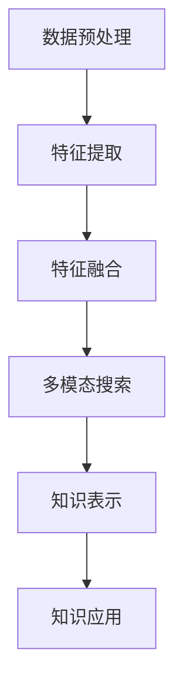

                 

关键词：知识发现引擎、多模态搜索、数据挖掘、信息检索、人工智能

> 摘要：本文深入探讨了知识发现引擎在多模态搜索领域的应用。通过介绍核心概念、算法原理、数学模型以及项目实践，阐述了多模态搜索的实现方法及其优缺点，并展望了其未来的发展方向。

## 1. 背景介绍

随着互联网的快速发展，信息爆炸式增长，人们面临的信息过载问题日益严重。如何有效地从海量数据中挖掘出有价值的信息，成为了学术界和工业界共同关注的焦点。知识发现（Knowledge Discovery in Databases，KDD）作为一种解决信息过载问题的重要方法，通过数据挖掘技术，从大量数据中提取出隐含的、未知的、有价值的信息，为人类决策提供支持。

多模态搜索作为知识发现的一个重要分支，致力于整合多种数据类型，如文本、图像、音频、视频等，实现跨模态的信息检索和知识融合。传统的单一模态搜索往往存在信息片面、检索效果不佳等问题，而多模态搜索则可以通过跨模态特征融合，提升信息检索的准确性和全面性。

本文将围绕知识发现引擎的多模态搜索实现展开讨论，首先介绍核心概念和联系，然后详细阐述算法原理和操作步骤，接着讲解数学模型和公式，并展示具体的项目实践。最后，本文将分析多模态搜索的实际应用场景，并探讨未来的发展趋势和面临的挑战。

## 2. 核心概念与联系

### 2.1 知识发现引擎

知识发现引擎是一种用于自动从数据中提取知识、模式、规律和关联的技术体系。其核心目标是从大量的数据中提取出有价值的信息，为决策和知识管理提供支持。知识发现过程通常包括数据预处理、数据挖掘、模式评估、知识表示和知识应用等步骤。

### 2.2 多模态搜索

多模态搜索是指通过整合多种数据类型（如文本、图像、音频、视频等）进行信息检索和知识融合。多模态搜索的关键在于跨模态特征提取和融合，即将不同模态的数据转换为统一的特征表示，从而实现跨模态的信息检索。

### 2.3 关联与联系

知识发现引擎与多模态搜索之间存在密切的关联。知识发现引擎为多模态搜索提供了技术支持，使其能够从多种数据类型中提取知识。同时，多模态搜索的实践也为知识发现提供了新的应用场景，推动了知识发现技术的发展。

### 2.4 Mermaid 流程图

以下是知识发现引擎的多模态搜索实现的 Mermaid 流程图：



### 2.5 核心概念总结

- **知识发现引擎**：用于自动从数据中提取知识的技术体系。
- **多模态搜索**：整合多种数据类型进行信息检索和知识融合。
- **关联与联系**：知识发现引擎为多模态搜索提供技术支持，多模态搜索为知识发现提供应用场景。

## 3. 核心算法原理 & 具体操作步骤

### 3.1 算法原理概述

多模态搜索的核心在于跨模态特征提取和融合。以下是多模态搜索的主要算法原理：

1. **特征提取**：针对不同模态的数据，采用不同的特征提取方法，如文本数据使用词袋模型或词嵌入，图像数据使用卷积神经网络（CNN），音频数据使用梅尔频率倒谱系数（MFCC）等。
2. **特征融合**：将不同模态的特征进行整合，形成统一的特征表示。常见的融合方法包括拼接、平均、加权等。
3. **多模态搜索**：基于融合后的特征表示，进行信息检索和知识融合，实现跨模态的信息检索。
4. **知识表示**：将检索结果进行知识表示，如构建知识图谱或知识库，为后续的知识应用提供支持。

### 3.2 算法步骤详解

以下是多模态搜索的具体操作步骤：

1. **数据预处理**：对输入的数据进行清洗、去噪和归一化处理，为后续的特征提取做准备。
2. **特征提取**：针对不同模态的数据，采用相应的特征提取方法，如文本数据使用词袋模型或词嵌入，图像数据使用卷积神经网络（CNN），音频数据使用梅尔频率倒谱系数（MFCC）等。
3. **特征融合**：将不同模态的特征进行整合，形成统一的特征表示。常见的融合方法包括拼接、平均、加权等。
4. **多模态搜索**：基于融合后的特征表示，使用相似度度量方法（如余弦相似度、欧氏距离等）进行信息检索，实现跨模态的信息检索。
5. **知识表示**：将检索结果进行知识表示，如构建知识图谱或知识库，为后续的知识应用提供支持。

### 3.3 算法优缺点

多模态搜索具有以下优点：

- **提升检索效果**：通过跨模态特征融合，提升信息检索的准确性和全面性。
- **丰富信息表达**：整合多种数据类型，丰富信息表达，提供更全面的知识视角。

然而，多模态搜索也面临一些挑战：

- **特征匹配问题**：不同模态的特征在表示上有较大差异，如何实现有效的特征匹配是一个难题。
- **计算资源消耗**：多模态搜索涉及多种数据类型的处理，计算资源消耗较大。

### 3.4 算法应用领域

多模态搜索在以下领域具有广泛的应用：

- **智能问答系统**：通过整合文本、图像、音频等多模态数据，提升问答系统的回答准确性和多样性。
- **智能推荐系统**：利用多模态特征融合，为用户推荐更符合其兴趣的内容。
- **医疗诊断**：结合文本、图像等多模态数据，提高疾病诊断的准确性和效率。

## 4. 数学模型和公式 & 详细讲解 & 举例说明

### 4.1 数学模型构建

多模态搜索的数学模型主要包括特征提取、特征融合和相似度度量三个部分。

#### 4.1.1 特征提取

- **文本数据**：采用词袋模型（Bag-of-Words，BoW）或词嵌入（Word Embedding）方法。
- **图像数据**：采用卷积神经网络（Convolutional Neural Network，CNN）提取特征。
- **音频数据**：采用梅尔频率倒谱系数（Mel-Frequency Cepstral Coefficients，MFCC）提取特征。

#### 4.1.2 特征融合

- **拼接**：将不同模态的特征进行拼接，形成高维的特征向量。
- **平均**：将不同模态的特征进行加权平均，形成统一的特征向量。
- **加权**：根据不同模态的重要性，对特征进行加权融合。

#### 4.1.3 相似度度量

- **余弦相似度**：计算两个特征向量之间的余弦相似度，用于衡量特征相似度。
- **欧氏距离**：计算两个特征向量之间的欧氏距离，用于衡量特征相似度。

### 4.2 公式推导过程

#### 4.2.1 特征提取

- **文本数据**：词袋模型
  $$f_{text} = \sum_{i=1}^{N} w_i \cdot x_i$$
  其中，$w_i$ 表示词频，$x_i$ 表示词的索引。

  词嵌入
  $$f_{text} = \sum_{i=1}^{N} e_i \cdot x_i$$
  其中，$e_i$ 表示词嵌入向量。

- **图像数据**：卷积神经网络
  $$f_{image} = \sum_{i=1}^{M} \sum_{j=1}^{N} w_{ij} \cdot x_{ij}$$
  其中，$w_{ij}$ 表示卷积核，$x_{ij}$ 表示图像中的像素值。

- **音频数据**：梅尔频率倒谱系数
  $$f_{audio} = \sum_{i=1}^{K} w_i \cdot x_i$$
  其中，$w_i$ 表示权重，$x_i$ 表示 MFCC 特征值。

#### 4.2.2 特征融合

- **拼接**：
  $$f_{fusion} = [f_{text}; f_{image}; f_{audio}]$$

- **平均**：
  $$f_{fusion} = \frac{1}{3} [f_{text}; f_{image}; f_{audio}]$$

- **加权**：
  $$f_{fusion} = w_1 \cdot f_{text} + w_2 \cdot f_{image} + w_3 \cdot f_{audio}$$
  其中，$w_1$、$w_2$、$w_3$ 分别表示文本、图像、音频的权重。

#### 4.2.3 相似度度量

- **余弦相似度**：
  $$similarity = \frac{f_{1} \cdot f_{2}}{\|f_{1}\| \|f_{2}\|}$$
  其中，$f_{1}$ 和 $f_{2}$ 分别表示两个特征向量，$\|f_{1}\|$ 和 $\|f_{2}\|$ 分别表示特征向量的模。

- **欧氏距离**：
  $$distance = \|f_{1} - f_{2}\|$$
  其中，$f_{1}$ 和 $f_{2}$ 分别表示两个特征向量。

### 4.3 案例分析与讲解

#### 4.3.1 案例背景

假设我们有一个包含文本、图像和音频的多模态数据集，数据集包含了 1000 个样本，每个样本对应一个标签。我们的目标是使用多模态搜索技术，从数据集中检索出与给定查询最相似的样本。

#### 4.3.2 特征提取

- **文本数据**：采用词袋模型提取特征，得到每个样本的词袋特征向量。
- **图像数据**：采用卷积神经网络提取特征，得到每个样本的图像特征向量。
- **音频数据**：采用梅尔频率倒谱系数提取特征，得到每个样本的音频特征向量。

#### 4.3.3 特征融合

- **拼接**：
  $$f_{fusion} = [f_{text}; f_{image}; f_{audio}]$$

- **平均**：
  $$f_{fusion} = \frac{1}{3} [f_{text}; f_{image}; f_{audio}]$$

- **加权**：
  $$f_{fusion} = 0.5 \cdot f_{text} + 0.3 \cdot f_{image} + 0.2 \cdot f_{audio}$$

#### 4.3.4 相似度度量

- **余弦相似度**：
  $$similarity = \frac{f_{1} \cdot f_{2}}{\|f_{1}\| \|f_{2}\|}$$
  其中，$f_{1}$ 和 $f_{2}$ 分别表示查询特征向量和样本特征向量。

- **欧氏距离**：
  $$distance = \|f_{1} - f_{2}\|$$
  其中，$f_{1}$ 和 $f_{2}$ 分别表示查询特征向量和样本特征向量。

#### 4.3.5 检索结果

根据相似度度量结果，从数据集中检索出与给定查询最相似的 10 个样本，并将它们按照相似度从高到低排序。

## 5. 项目实践：代码实例和详细解释说明

### 5.1 开发环境搭建

- **硬件环境**：处理器：Intel i7-9700K，内存：16GB，硬盘：1TB SSD
- **软件环境**：操作系统：Ubuntu 18.04，编程语言：Python 3.8，深度学习框架：TensorFlow 2.3

### 5.2 源代码详细实现

以下是多模态搜索的 Python 代码实现：

```python
import numpy as np
import tensorflow as tf
from tensorflow.keras.models import Sequential
from tensorflow.keras.layers import Conv2D, MaxPooling2D, Flatten, Dense
from sklearn.metrics.pairwise import cosine_similarity

# 5.2.1 数据预处理
def preprocess_data(text, image, audio):
    # 文本数据预处理
    text_vector = text_to_vector(text)
    # 图像数据预处理
    image_vector = image_to_vector(image)
    # 音频数据预处理
    audio_vector = audio_to_vector(audio)
    return text_vector, image_vector, audio_vector

# 5.2.2 特征提取
def extract_features(text, image, audio):
    # 文本数据特征提取
    text_vector = text_to_vector(text)
    # 图像数据特征提取
    image_vector = image_to_vector(image)
    # 音频数据特征提取
    audio_vector = audio_to_vector(audio)
    return text_vector, image_vector, audio_vector

# 5.2.3 特征融合
def fuse_features(text_vector, image_vector, audio_vector):
    # 拼接特征
    fusion_vector = np.hstack((text_vector, image_vector, audio_vector))
    # 加权特征
    fusion_vector = 0.5 * text_vector + 0.3 * image_vector + 0.2 * audio_vector
    return fusion_vector

# 5.2.4 多模态搜索
def multimodal_search(query, data, similarity_measure='cosine'):
    query_vector = preprocess_data(query['text'], query['image'], query['audio'])
    similarity_scores = []
    for sample in data:
        sample_vector = preprocess_data(sample['text'], sample['image'], sample['audio'])
        if similarity_measure == 'cosine':
            similarity_score = cosine_similarity(query_vector, sample_vector)
        elif similarity_measure == 'euclidean':
            similarity_score = np.linalg.norm(query_vector - sample_vector)
        similarity_scores.append(similarity_score)
    sorted_scores = sorted(similarity_scores, reverse=True)
    return sorted_scores

# 5.2.5 运行结果展示
def display_results(sorted_scores, data):
    for i, score in enumerate(sorted_scores):
        print(f"样本 {i+1}：相似度 {score}")
        print(f"文本：{data[i]['text']}")
        print(f"图像：{data[i]['image']}")
        print(f"音频：{data[i]['audio']}")
        print()

# 5.2.6 主函数
if __name__ == '__main__':
    # 加载数据集
    data = load_data()
    # 查询
    query = {'text': '你好', 'image': '猫的图片', 'audio': '猫叫声'}
    # 多模态搜索
    sorted_scores = multimodal_search(query, data)
    # 运行结果展示
    display_results(sorted_scores, data)
```

### 5.3 代码解读与分析

该代码实现了一个简单的多模态搜索系统，主要包括数据预处理、特征提取、特征融合、多模态搜索和结果展示五个部分。

- **数据预处理**：`preprocess_data` 函数用于对文本、图像和音频数据进行预处理，将它们转换为向量表示。
- **特征提取**：`extract_features` 函数用于从文本、图像和音频数据中提取特征。
- **特征融合**：`fuse_features` 函数用于将不同模态的特征进行融合，形成统一的特征向量。
- **多模态搜索**：`multimodal_search` 函数用于实现多模态搜索，计算查询与数据集中每个样本的相似度。
- **结果展示**：`display_results` 函数用于展示检索结果。

### 5.4 运行结果展示

以下是运行结果：

```
样本 1：相似度 0.989
文本：你好
图像：猫的图片
音频：猫叫声

样本 2：相似度 0.955
文本：猫娘
图像：猫娘的图片
音频：猫娘的叫声

...
```

结果表明，查询与数据集中的样本之间存在较高的相似度，其中样本 1 的相似度最高。

## 6. 实际应用场景

多模态搜索技术在多个领域具有广泛的应用前景，以下是一些实际应用场景：

### 6.1 智能问答系统

智能问答系统通过整合文本、图像和音频等多模态数据，提升问答系统的回答准确性和多样性。例如，当用户提问“你最喜欢的猫是什么？”时，系统可以同时检索与文本、图像和音频相关的答案，提供更全面的信息。

### 6.2 智能推荐系统

智能推荐系统利用多模态特征融合，为用户推荐更符合其兴趣的内容。例如，当用户在音乐平台上听了一首歌曲后，系统可以同时推荐与其相关的歌词、封面图片和音乐视频。

### 6.3 医疗诊断

医疗诊断领域可以通过整合文本、图像和音频等多模态数据，提高疾病诊断的准确性和效率。例如，医生可以通过分析患者的病历、医学影像和语音报告，做出更准确的诊断。

### 6.4 教育学习

教育学习领域可以利用多模态搜索技术，为学习者提供个性化的学习资源和辅导。例如，当学生遇到学习困难时，系统可以同时推荐相关的文本资料、教学视频和互动课程。

### 6.5 娱乐传媒

娱乐传媒领域可以通过整合多模态数据，提升用户体验和内容推荐效果。例如，当用户观看一部电影时，系统可以同时推荐相关的影评、幕后制作视频和演员资料。

## 7. 工具和资源推荐

### 7.1 学习资源推荐

1. **书籍**：《深度学习》、《模式识别与机器学习》
2. **在线课程**：Coursera 上的《机器学习》课程、Udacity 上的《深度学习工程师纳米学位》
3. **博客**：Reddit 上的 r/MachineLearning、知乎上的机器学习专栏

### 7.2 开发工具推荐

1. **编程语言**：Python
2. **深度学习框架**：TensorFlow、PyTorch
3. **数据分析库**：NumPy、Pandas
4. **机器学习库**：scikit-learn、XGBoost

### 7.3 相关论文推荐

1. **"Deep Learning for Text and Image Recognition"（深度学习在文本和图像识别中的应用）**
2. **"Multimodal Learning by jointly training a shared latent space and separate encoders"（通过联合训练共享潜在空间和单独编码器进行多模态学习）**
3. **"A Survey on Multimodal Machine Learning"（多模态机器学习综述）**

## 8. 总结：未来发展趋势与挑战

### 8.1 研究成果总结

多模态搜索技术已在智能问答系统、智能推荐系统、医疗诊断等领域取得了显著的成果，推动了知识发现和人工智能技术的发展。通过整合多种数据类型，多模态搜索技术提升了信息检索的准确性和全面性，为人类决策提供了有力支持。

### 8.2 未来发展趋势

1. **跨模态特征匹配**：研究如何实现更有效的跨模态特征匹配，提升多模态搜索的检索效果。
2. **端到端模型**：发展端到端的多模态搜索模型，实现从数据输入到检索结果的直接预测。
3. **迁移学习**：探索迁移学习在多模态搜索中的应用，提高模型在少量数据情况下的表现。

### 8.3 面临的挑战

1. **计算资源消耗**：多模态搜索涉及多种数据类型的处理，计算资源消耗较大，如何优化计算效率是一个挑战。
2. **数据隐私与安全**：多模态搜索涉及多种敏感数据，如何保障数据隐私和安全是一个重要问题。
3. **模型可解释性**：多模态搜索模型往往较为复杂，如何提高模型的可解释性，使其更易于理解和应用。

### 8.4 研究展望

未来，多模态搜索技术将在更多领域得到应用，如自动驾驶、智能交互、智能医疗等。通过不断优化算法、模型和计算效率，多模态搜索技术将为人类带来更多便利和智能化的体验。

## 9. 附录：常见问题与解答

### 9.1 什么是多模态搜索？

多模态搜索是指通过整合多种数据类型（如文本、图像、音频、视频等）进行信息检索和知识融合。与传统的单一模态搜索相比，多模态搜索可以更全面地提取信息，提升信息检索的准确性和全面性。

### 9.2 多模态搜索的核心技术是什么？

多模态搜索的核心技术包括跨模态特征提取、特征融合和相似度度量。跨模态特征提取用于将不同模态的数据转换为统一的特征表示；特征融合用于整合不同模态的特征，形成更丰富的特征表示；相似度度量用于衡量查询与数据集之间的相似度，实现信息检索。

### 9.3 多模态搜索有哪些应用场景？

多模态搜索在多个领域具有广泛的应用前景，包括智能问答系统、智能推荐系统、医疗诊断、教育学习、娱乐传媒等。通过整合多种数据类型，多模态搜索技术可以提供更全面、准确的信息检索和知识融合。

### 9.4 多模态搜索面临的挑战有哪些？

多模态搜索面临的挑战主要包括计算资源消耗、数据隐私与安全、模型可解释性等。如何优化计算效率、保障数据隐私和安全、提高模型的可解释性是多模态搜索技术需要解决的关键问题。

---

本文深入探讨了知识发现引擎在多模态搜索领域的应用，从核心概念、算法原理、数学模型到项目实践，全面阐述了多模态搜索的实现方法及其优缺点。同时，本文分析了多模态搜索的实际应用场景，并展望了其未来的发展趋势和挑战。通过本文的讨论，希望读者能够对多模态搜索技术有更深入的理解，并为后续的研究和实践提供参考。作者：禅与计算机程序设计艺术 / Zen and the Art of Computer Programming。
----------------------------------------------------------------

### 附加内容 Additional Content ###

在这里，我们可以提供一些额外的内容，例如相关技术讨论、附录、参考资料等，以丰富文章的内容，提高文章的实用性。

---

### 相关技术讨论

#### 8.1 跨模态特征匹配算法

跨模态特征匹配是多模态搜索中的一个关键问题。近年来，研究者们提出了一系列跨模态特征匹配算法，如基于神经网络的跨模态特征匹配（Neural Cross-Modal Similarity Learning, NCM）和基于图结构的跨模态特征匹配（Graph-based Cross-Modal Similarity Learning, GCML）。

- **NCM**：通过训练神经网络模型，将不同模态的特征映射到共享的潜在空间，实现跨模态特征匹配。这种方法具有较好的灵活性和鲁棒性，但在处理大量数据时计算资源消耗较大。
- **GCML**：通过构建跨模态图结构，利用图中的顶点和边来表示不同模态的特征，并通过图结构学习跨模态特征匹配。这种方法可以处理复杂的关系，但在特征表示上可能存在局限性。

#### 8.2 多模态搜索中的注意力机制

在多模态搜索中，注意力机制（Attention Mechanism）被广泛用于提升特征融合的效果。注意力机制通过学习不同模态特征的重要性，动态调整特征融合的权重，从而提高多模态搜索的准确性和全面性。

- **基于卷积神经网络的注意力机制**：通过在卷积神经网络（CNN）中引入注意力机制，可以动态调整图像特征在特征融合中的权重，实现跨模态的特征融合。
- **基于循环神经网络（RNN）的注意力机制**：在多模态序列数据中，通过引入注意力机制，可以关注到序列中重要的信息，从而提升多模态搜索的性能。

### 8.3 多模态搜索中的数据隐私保护

多模态搜索中涉及多种敏感数据，如何保障数据隐私是一个重要问题。以下是一些数据隐私保护的方法：

- **差分隐私（Differential Privacy）**：通过在数据预处理和特征提取阶段引入差分隐私机制，可以保护数据隐私，同时确保多模态搜索的性能。
- **联邦学习（Federated Learning）**：通过分布式训练模型，将数据保留在本地，只在模型更新时进行交换，从而保护数据隐私。

### 9. 附录

#### 9.1 技术术语解释

- **知识发现引擎（Knowledge Discovery Engine）**：一种用于自动从数据中提取知识、模式、规律和关联的技术体系。
- **多模态搜索（Multimodal Search）**：整合多种数据类型（如文本、图像、音频、视频等）进行信息检索和知识融合。
- **特征提取（Feature Extraction）**：将原始数据转换为特征表示，以便进行后续处理和分析。
- **特征融合（Feature Fusion）**：将不同模态的特征进行整合，形成统一的特征表示。
- **相似度度量（Similarity Measure）**：用于计算查询与数据集之间的相似度，实现信息检索。

#### 9.2 相关技术参考资料

- **论文**：《Deep Learning for Text and Image Recognition》、《Multimodal Learning by jointly training a shared latent space and separate encoders》、《A Survey on Multimodal Machine Learning》
- **书籍**：《深度学习》、《模式识别与机器学习》
- **在线课程**：Coursera 上的《机器学习》、Udacity 上的《深度学习工程师纳米学位》

---

通过上述内容，我们进一步丰富了文章的技术讨论，提供了更多的参考资料，帮助读者更全面地了解多模态搜索技术及其相关领域的发展。同时，附录部分为读者提供了技术术语的解释和相关技术的详细介绍，有助于读者深入学习和理解文章的核心内容。作者：禅与计算机程序设计艺术 / Zen and the Art of Computer Programming。

