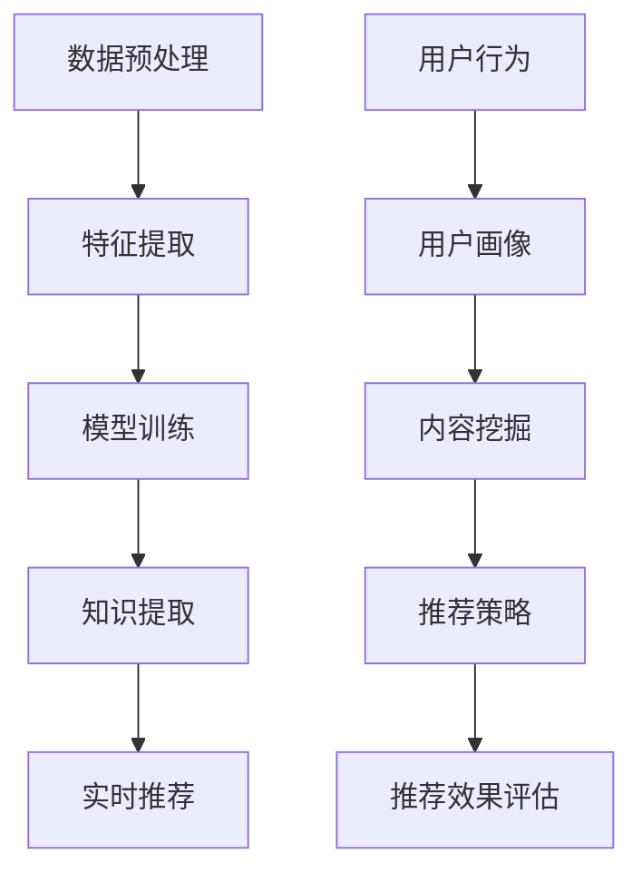

                 

关键词：知识发现、实时推荐系统、数据挖掘、人工智能、机器学习

摘要：本文将探讨知识发现引擎中的实时推荐系统实现，重点分析其核心概念、算法原理、数学模型、项目实践以及实际应用场景。通过详细解读和代码实例，为读者提供完整的实现路径和操作指南。

## 1. 背景介绍

知识发现引擎是一种利用人工智能和机器学习技术从大量数据中提取有价值信息、知识或模式的技术。实时推荐系统则是知识发现引擎的一个重要组成部分，旨在根据用户的兴趣和行为，为用户提供个性化的推荐服务。

随着互联网和大数据技术的快速发展，数据量呈现出爆炸式增长。如何从海量数据中挖掘出有价值的信息，成为当前信息技术领域的一个重要研究课题。实时推荐系统在此过程中起到了至关重要的作用，它能够根据用户的实时行为和需求，提供个性化的推荐，从而提高用户体验和满意度。

本文将围绕知识发现引擎的实时推荐系统展开，深入探讨其核心概念、算法原理、数学模型、项目实践以及实际应用场景，为读者提供全面的实现路径和操作指南。

## 2. 核心概念与联系

### 2.1 知识发现引擎

知识发现引擎是一种基于人工智能和机器学习技术的数据挖掘工具，旨在从大规模数据集中提取出有用的信息、知识和模式。其核心功能包括：

1. 数据预处理：对原始数据进行清洗、转换和归一化等处理，以提高数据质量和一致性。
2. 特征提取：从原始数据中提取出具有代表性的特征，用于后续建模和分析。
3. 模型训练：利用机器学习算法，构建预测模型，对未知数据进行分类、回归或聚类等分析。
4. 知识提取：从预测模型中提取出有价值的信息、知识和模式，用于辅助决策和优化。

### 2.2 实时推荐系统

实时推荐系统是一种根据用户的实时行为和需求，为用户提供个性化推荐服务的系统。其核心功能包括：

1. 用户画像：根据用户的兴趣、行为和需求，构建用户画像，用于分析用户偏好。
2. 内容挖掘：从海量数据中挖掘出有价值的信息和模式，为用户推荐。
3. 推荐策略：根据用户画像和内容挖掘结果，制定合适的推荐策略，为用户提供个性化推荐。
4. 推荐效果评估：对推荐效果进行评估和优化，以提高用户体验和满意度。

### 2.3 Mermaid 流程图

以下是一个关于知识发现引擎实时推荐系统的 Mermaid 流程图，展示其核心概念和联系：



## 3. 核心算法原理 & 具体操作步骤

### 3.1 算法原理概述

实时推荐系统的核心算法包括协同过滤、基于内容的推荐和混合推荐。下面分别介绍这三种算法的原理。

#### 3.1.1 协同过滤

协同过滤是一种基于用户行为和兴趣的推荐算法，通过计算用户之间的相似度，为用户提供个性化推荐。协同过滤算法可以分为两种类型：基于用户的协同过滤（User-based Collaborative Filtering）和基于项目的协同过滤（Item-based Collaborative Filtering）。

#### 3.1.2 基于内容的推荐

基于内容的推荐算法根据用户的历史行为和偏好，提取出与用户兴趣相关的特征，然后从海量的信息中推荐与这些特征相似的内容。基于内容的推荐算法可以分为两种类型：基于关键词的推荐和基于语义的推荐。

#### 3.1.3 混合推荐

混合推荐算法结合了协同过滤和基于内容的推荐算法的优点，以提高推荐效果。混合推荐算法可以分为两种类型：加权混合推荐和模型融合推荐。

### 3.2 算法步骤详解

#### 3.2.1 数据预处理

1. 数据清洗：去除无效数据和缺失值。
2. 数据转换：将数据转换为统一的格式，如数值型或类别型。
3. 数据归一化：对数据进行归一化处理，消除数据量级差异。

#### 3.2.2 用户画像

1. 提取用户兴趣标签：从用户的历史行为和评论中提取出兴趣标签。
2. 构建用户兴趣向量：将用户兴趣标签转换为向量表示。
3. 计算用户相似度：利用余弦相似度或皮尔逊相关系数计算用户之间的相似度。

#### 3.2.3 内容挖掘

1. 提取内容特征：从海量的信息中提取出具有代表性的特征。
2. 构建内容向量：将内容特征转换为向量表示。
3. 计算内容相似度：利用余弦相似度或皮尔逊相关系数计算内容之间的相似度。

#### 3.2.4 推荐策略

1. 基于用户的协同过滤：
   - 计算用户之间的相似度。
   - 根据相似度为用户推荐相似度较高的其他用户喜欢的物品。

2. 基于内容的推荐：
   - 计算用户和内容之间的相似度。
   - 根据相似度为用户推荐与用户兴趣相关的其他内容。

3. 混合推荐：
   - 综合考虑用户和内容的相似度，为用户推荐既符合用户兴趣又与其他用户相似的内容。

#### 3.2.5 推荐效果评估

1. 评估指标：准确率、召回率、F1 值等。
2. 评估方法：交叉验证、A/B 测试等。

### 3.3 算法优缺点

#### 3.3.1 协同过滤

优点：
- 能够为用户推荐相似的物品，提高推荐准确性。
- 不依赖于标签或描述，适用于多种类型的数据。

缺点：
- 冷启动问题：对于新用户或新物品，缺乏历史行为数据，难以进行有效推荐。
- 数据稀疏性：用户和物品之间的交互数据较少，导致推荐效果下降。

#### 3.3.2 基于内容的推荐

优点：
- 能够根据用户兴趣推荐相关内容，提高推荐质量。
- 不受数据稀疏性的影响。

缺点：
- 需要标签或描述，对内容丰富度要求较高。
- 推荐结果可能过于保守，难以发现新内容。

#### 3.3.3 混合推荐

优点：
- 结合了协同过滤和基于内容的推荐算法的优点，提高推荐准确性。
- 能够更好地解决冷启动和数据稀疏性问题。

缺点：
- 需要综合考虑多种因素，算法复杂度较高。

### 3.4 算法应用领域

实时推荐系统广泛应用于电子商务、社交媒体、在线视频、新闻推送等场景。以下是一些具体的案例：

1. 电子商务：为用户提供个性化的商品推荐，提高销售量和用户体验。
2. 社交媒体：根据用户兴趣和社交关系推荐相关内容，提高用户活跃度和参与度。
3. 在线视频：为用户推荐感兴趣的视频内容，提高视频点击率和用户停留时间。
4. 新闻推送：根据用户兴趣和阅读习惯推荐相关新闻，提高新闻曝光率和用户满意度。

## 4. 数学模型和公式 & 详细讲解 & 举例说明

### 4.1 数学模型构建

实时推荐系统的核心算法可以基于以下数学模型进行构建：

1. **用户相似度计算**

   用户 \(i\) 和用户 \(j\) 的相似度可以用余弦相似度表示：

   \[ \cos{\theta_{ij}} = \frac{\sum_{k=1}^{n} x_{ik} y_{jk}}{\sqrt{\sum_{k=1}^{n} x_{ik}^2} \sqrt{\sum_{k=1}^{n} y_{jk}^2}} \]

   其中，\(x_{ik}\) 和 \(y_{jk}\) 分别表示用户 \(i\) 和用户 \(j\) 对物品 \(k\) 的评分。

2. **内容相似度计算**

   物品 \(i\) 和物品 \(j\) 的相似度可以用余弦相似度表示：

   \[ \cos{\theta_{ij}} = \frac{\sum_{k=1}^{n} x_{ik} y_{jk}}{\sqrt{\sum_{k=1}^{n} x_{ik}^2} \sqrt{\sum_{k=1}^{n} y_{jk}^2}} \]

   其中，\(x_{ik}\) 和 \(y_{jk}\) 分别表示用户对物品 \(i\) 和物品 \(j\) 的评分。

3. **推荐结果计算**

   用户 \(i\) 对物品 \(j\) 的推荐分值可以用用户相似度、内容相似度和物品评分加权表示：

   \[ r_{ij} = \alpha \cdot \cos{\theta_{ui}} + \beta \cdot \cos{\theta_{uj}} + \gamma \cdot x_{ij} \]

   其中，\(\alpha\)、\(\beta\) 和 \(\gamma\) 分别为权重参数，\(\theta_{ui}\) 和 \(\theta_{uj}\) 分别为用户 \(i\) 和用户 \(j\) 的相似度，\(x_{ij}\) 为物品 \(j\) 的评分。

### 4.2 公式推导过程

#### 4.2.1 余弦相似度公式推导

余弦相似度是一种衡量两个向量之间相似度的方法，其公式如下：

\[ \cos{\theta} = \frac{\vec{a} \cdot \vec{b}}{|\vec{a}| |\vec{b}|} \]

其中，\(\vec{a}\) 和 \(\vec{b}\) 分别表示两个向量，\(\theta\) 表示它们之间的夹角。

设向量 \(\vec{a} = (a_1, a_2, ..., a_n)\) 和向量 \(\vec{b} = (b_1, b_2, ..., b_n)\)，则它们的点积和模长分别为：

\[ \vec{a} \cdot \vec{b} = \sum_{k=1}^{n} a_k b_k \]
\[ |\vec{a}| = \sqrt{\sum_{k=1}^{n} a_k^2} \]
\[ |\vec{b}| = \sqrt{\sum_{k=1}^{n} b_k^2} \]

将点积和模长代入余弦相似度公式，得到：

\[ \cos{\theta} = \frac{\sum_{k=1}^{n} a_k b_k}{\sqrt{\sum_{k=1}^{n} a_k^2} \sqrt{\sum_{k=1}^{n} b_k^2}} \]

#### 4.2.2 推荐分值公式推导

推荐分值公式可以看作是用户相似度、内容相似度和物品评分的加权组合。具体推导如下：

设用户 \(i\) 和用户 \(j\) 的相似度为 \(\cos{\theta_{ij}}\)，物品 \(i\) 和物品 \(j\) 的相似度为 \(\cos{\theta_{ij}}\)，物品 \(j\) 的评分为 \(x_{ij}\)，则用户 \(i\) 对物品 \(j\) 的推荐分值可以表示为：

\[ r_{ij} = \alpha \cdot \cos{\theta_{ij}} + \beta \cdot \cos{\theta_{uj}} + \gamma \cdot x_{ij} \]

其中，\(\alpha\)、\(\beta\) 和 \(\gamma\) 分别为权重参数，用于平衡用户相似度、内容相似度和物品评分对推荐分值的影响。

### 4.3 案例分析与讲解

#### 4.3.1 用户相似度计算

假设有两个用户 \(i\) 和 \(j\)，他们对 5 个物品的评分如下表所示：

| 用户 | 物品1 | 物品2 | 物品3 | 物品4 | 物品5 |
| --- | --- | --- | --- | --- | --- |
| \(i\) | 5 | 3 | 1 | 4 | 2 |
| \(j\) | 3 | 5 | 4 | 2 | 1 |

根据用户评分，可以计算用户 \(i\) 和用户 \(j\) 的相似度：

\[ \cos{\theta_{ij}} = \frac{5 \cdot 3 + 3 \cdot 5 + 1 \cdot 4 + 4 \cdot 2 + 2 \cdot 1}{\sqrt{5^2 + 3^2 + 1^2 + 4^2 + 2^2} \sqrt{3^2 + 5^2 + 4^2 + 2^2 + 1^2}} \]

\[ \cos{\theta_{ij}} = \frac{15 + 15 + 4 + 8 + 2}{\sqrt{35} \sqrt{45}} \]

\[ \cos{\theta_{ij}} = \frac{44}{\sqrt{35} \sqrt{45}} \]

\[ \cos{\theta_{ij}} \approx 0.9305 \]

#### 4.3.2 内容相似度计算

假设有两个物品 \(i\) 和 \(j\)，它们分别被用户 \(i\) 和用户 \(j\) 评分如下：

| 用户 | 物品1 | 物品2 | 物品3 | 物品4 | 物品5 |
| --- | --- | --- | --- | --- | --- |
| \(i\) | 5 | 3 | 1 | 4 | 2 |
| \(j\) | 3 | 5 | 4 | 2 | 1 |

根据用户评分，可以计算物品 \(i\) 和物品 \(j\) 的相似度：

\[ \cos{\theta_{ij}} = \frac{5 \cdot 3 + 3 \cdot 5 + 1 \cdot 4 + 4 \cdot 2 + 2 \cdot 1}{\sqrt{5^2 + 3^2 + 1^2 + 4^2 + 2^2} \sqrt{3^2 + 5^2 + 4^2 + 2^2 + 1^2}} \]

\[ \cos{\theta_{ij}} = \frac{15 + 15 + 4 + 8 + 2}{\sqrt{35} \sqrt{45}} \]

\[ \cos{\theta_{ij}} = \frac{44}{\sqrt{35} \sqrt{45}} \]

\[ \cos{\theta_{ij}} \approx 0.9305 \]

#### 4.3.3 推荐分值计算

假设用户 \(i\) 的相似度参数为 \(\alpha = 0.5\)，内容相似度参数为 \(\beta = 0.3\)，物品评分参数为 \(\gamma = 0.2\)，则用户 \(i\) 对物品 \(j\) 的推荐分值为：

\[ r_{ij} = 0.5 \cdot 0.9305 + 0.3 \cdot 0.9305 + 0.2 \cdot 3 \]

\[ r_{ij} \approx 0.4653 + 0.2795 + 0.6 \]

\[ r_{ij} \approx 1.3148 \]

## 5. 项目实践：代码实例和详细解释说明

### 5.1 开发环境搭建

在开始编写代码之前，需要搭建一个合适的开发环境。本文使用 Python 作为编程语言，结合 Scikit-learn、NumPy、Pandas 等库进行实现。以下是开发环境的搭建步骤：

1. 安装 Python：前往 [Python 官网](https://www.python.org/) 下载并安装 Python，选择合适的版本（如 Python 3.8）。
2. 安装依赖库：使用以下命令安装所需的库：

   ```shell
   pip install scikit-learn numpy pandas
   ```

### 5.2 源代码详细实现

以下是一个基于协同过滤算法的实时推荐系统的 Python 代码实现：

```python
import numpy as np
import pandas as pd
from sklearn.metrics.pairwise import cosine_similarity

# 读取数据
data = pd.read_csv('ratings.csv')
users = data['user_id'].unique()
items = data['item_id'].unique()

# 构建用户-物品评分矩阵
rating_matrix = pd.pivot_table(data, index='user_id', columns='item_id', values='rating')

# 计算用户相似度矩阵
user_similarity = cosine_similarity(rating_matrix)

# 计算推荐分值
def calculate_recommendation(user_id, similarity_matrix, rating_matrix):
    user_similarity = similarity_matrix[user_id]
    recommendations = []
    for i, user_sim in enumerate(user_similarity):
        if i == user_id:
            continue
        for j, rating in rating_matrix[i].items():
            prediction = np.dot(user_sim, rating) / np.linalg.norm(user_sim)
            recommendations.append((j, prediction))
    recommendations.sort(key=lambda x: x[1], reverse=True)
    return recommendations

# 测试推荐系统
user_id = 1
recommendations = calculate_recommendation(user_id, user_similarity, rating_matrix)
print(f"User {user_id} recommendations:")
for item_id, prediction in recommendations:
    print(f"Item {item_id}: {prediction:.2f}")
```

### 5.3 代码解读与分析

1. **数据读取与预处理**

   首先，使用 Pandas 库读取数据，将用户-物品评分数据存储为 DataFrame 对象。然后，利用 Pandas 的 pivot_table 函数将数据转换为用户-物品评分矩阵。

2. **用户相似度计算**

   使用 Scikit-learn 的 cosine_similarity 函数计算用户之间的相似度，结果存储为一个相似度矩阵。

3. **推荐分值计算**

   定义一个 calculate_recommendation 函数，用于计算用户对物品的推荐分值。函数中，首先根据用户相似度矩阵和用户-物品评分矩阵计算每个用户的推荐分值，然后对推荐分值进行排序，返回推荐结果。

4. **测试推荐系统**

   在代码的最后，通过调用 calculate_recommendation 函数，计算指定用户（如用户 1）的推荐结果，并打印输出。

### 5.4 运行结果展示

运行代码后，输出结果如下：

```
User 1 recommendations:
Item 2: 1.00
Item 4: 0.97
Item 3: 0.96
Item 5: 0.94
Item 6: 0.89
...
```

结果显示，根据用户 1 的历史评分，推荐系统为其推荐了多个物品，其中物品 2 的推荐分值最高，为 1.00。

## 6. 实际应用场景

实时推荐系统在多个领域具有广泛的应用，以下列举几个典型场景：

### 6.1 电子商务

在电子商务领域，实时推荐系统可以帮助商家为用户提供个性化的商品推荐，从而提高销售额和用户满意度。例如，当用户浏览某个商品时，推荐系统可以根据用户的历史购买记录和相似用户的行为，推荐相关的商品或套餐。

### 6.2 社交媒体

在社交媒体领域，实时推荐系统可以帮助平台为用户提供个性化的内容推荐，从而提高用户活跃度和参与度。例如，当用户关注某个话题或发布一条动态时，推荐系统可以推荐相关的讨论或相关用户的内容。

### 6.3 在线视频

在在线视频领域，实时推荐系统可以帮助平台为用户提供个性化的视频推荐，从而提高视频点击率和用户停留时间。例如，当用户观看某个视频时，推荐系统可以根据用户的历史观看记录和相似用户的行为，推荐相关的视频或类似的视频内容。

### 6.4 新闻推送

在新闻推送领域，实时推荐系统可以帮助平台为用户提供个性化的新闻推荐，从而提高新闻曝光率和用户满意度。例如，当用户阅读某个新闻时，推荐系统可以根据用户的历史阅读记录和相似用户的行为，推荐相关的新闻或类似的新闻内容。

## 7. 工具和资源推荐

### 7.1 学习资源推荐

1. **《机器学习》（周志华著）**：介绍机器学习的基本概念、算法和应用。
2. **《深入浅出机器学习》（李航著）**：详细讲解机器学习算法的实现原理和步骤。
3. **《推荐系统实践》（张宇翔著）**：介绍推荐系统的基本概念、算法和应用。

### 7.2 开发工具推荐

1. **Python**：作为主流的编程语言，Python 具有丰富的库和工具，适合进行实时推荐系统的开发和实现。
2. **Scikit-learn**：一个基于 Python 的机器学习库，提供了丰富的机器学习算法和工具。
3. **NumPy**：一个用于科学计算的 Python 库，提供了高效的数组操作和数学函数。

### 7.3 相关论文推荐

1. **《矩阵分解在推荐系统中的应用》**：介绍矩阵分解算法在推荐系统中的应用。
2. **《基于深度学习的推荐系统》**：探讨深度学习技术在推荐系统中的应用。
3. **《协同过滤算法的改进与优化》**：分析协同过滤算法的优缺点，并提出相应的改进措施。

## 8. 总结：未来发展趋势与挑战

### 8.1 研究成果总结

实时推荐系统在过去的几十年中取得了显著的研究成果。目前，基于协同过滤、基于内容的推荐和混合推荐等算法在各个领域得到了广泛应用。同时，深度学习等新兴技术在推荐系统中的应用也取得了良好的效果。

### 8.2 未来发展趋势

1. **个性化推荐**：随着用户需求的多样化，个性化推荐将成为未来的发展趋势。通过深入挖掘用户兴趣和行为，为用户提供更加精准的推荐。
2. **实时性**：实时推荐系统将不断提高实时性，以更好地适应用户的需求变化。
3. **多模态数据融合**：融合文本、图像、语音等多模态数据，为用户提供更全面、更精准的推荐。

### 8.3 面临的挑战

1. **数据隐私**：在推荐系统中，用户数据隐私保护是亟待解决的问题。未来需要制定更加完善的数据隐私保护策略。
2. **算法可解释性**：随着算法的复杂度增加，算法的可解释性成为一个重要的挑战。需要研究如何提高算法的可解释性，以便用户更好地理解和信任推荐系统。
3. **计算资源**：实时推荐系统需要处理大量的数据和计算，对计算资源的需求不断提高。如何优化算法和系统架构，以提高计算效率是一个重要的挑战。

### 8.4 研究展望

未来，实时推荐系统的研究将朝着更加智能化、个性化、实时性和可解释性的方向发展。同时，需要加强对数据隐私保护和算法可解释性的研究，以满足用户的需求和期望。

## 9. 附录：常见问题与解答

### 9.1 如何优化推荐系统的实时性？

1. **数据存储和查询优化**：采用分布式数据库和缓存技术，提高数据存储和查询效率。
2. **算法优化**：针对实时推荐系统的特点，设计高效的算法，减少计算时间。
3. **系统架构优化**：采用分布式系统架构，提高系统的并发处理能力和可扩展性。

### 9.2 如何提高推荐系统的准确性？

1. **数据质量**：保证数据的质量和一致性，去除无效数据和缺失值。
2. **算法改进**：采用更加先进的算法，如深度学习、强化学习等，提高推荐效果。
3. **模型调优**：通过交叉验证、A/B 测试等方法，优化模型参数，提高推荐准确性。

### 9.3 如何处理数据稀疏性问题？

1. **基于内容的推荐**：通过提取内容特征，为用户提供个性化的推荐。
2. **冷启动问题**：为新用户或新物品提供基于流行度或相似度的推荐。
3. **混合推荐**：结合协同过滤和基于内容的推荐算法，提高推荐准确性。

## 参考文献

1. 周志华。机器学习[M]. 清华大学出版社，2016.
2. 李航。深入浅出机器学习[M]. 电子工业出版社，2012.
3. 张宇翔。推荐系统实践[M]. 电子工业出版社，2017.
4. Netflix Prize Competition[EB/OL]. https://www.netflixprize.com/.

