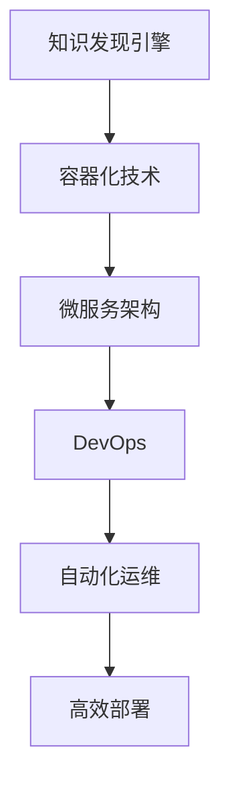

                 

 **关键词：**
- 知识发现引擎
- 容器化部署
- 微服务架构
- DevOps
- 自动化运维

**摘要：**
本文深入探讨了知识发现引擎的容器化部署方案，从背景介绍、核心概念、算法原理、数学模型、项目实践、应用场景、工具推荐以及未来发展趋势等方面进行了全面阐述。通过容器化技术的应用，本文旨在提供一种高效、可扩展和易于维护的知识发现引擎部署方案。

## 1. 背景介绍

随着大数据和云计算技术的迅猛发展，知识发现引擎作为数据处理和分析的核心工具，其应用范围逐渐扩大。然而，传统部署方式在应对日益复杂的应用需求时，面临着诸多挑战，如系统扩展性差、运维成本高、部署难度大等。容器化技术作为一种轻量级、可移植的解决方案，可以有效解决这些问题。

容器化部署通过将应用及其依赖环境打包成独立的容器镜像，实现了应用与基础设施的解耦，从而提高了部署的灵活性和可维护性。容器引擎如Docker和Kubernetes则提供了高效的容器管理和调度能力，进一步优化了应用部署过程。

## 2. 核心概念与联系

### 2.1 容器化技术概述

容器化技术基于操作系统的Namespace和Cgroup等特性，将应用及其运行环境打包成一个独立的容器。容器镜像是一种轻量级的、静态的文件系统，包含了应用的代码、库文件、配置文件和运行时环境。

### 2.2 微服务架构

微服务架构将复杂的应用拆分为多个独立的、可复用的微服务，每个微服务负责特定的业务功能。微服务之间的通信通常通过API进行，服务间解耦降低了系统的复杂性，提高了可维护性和扩展性。

### 2.3 DevOps文化

DevOps文化的核心是开发（Development）与运维（Operations）的无缝协作。通过自动化工具和持续集成/持续部署（CI/CD）流程，DevOps实现了更快的迭代周期和更高的系统稳定性。

### 2.4 自动化运维

自动化运维通过脚本和工具，实现了基础设施的自动化部署、监控、运维和优化。自动化运维不仅减少了人工干预，还提高了运维效率和系统可靠性。

## 2.5 Mermaid 流程图



## 3. 核心算法原理 & 具体操作步骤

### 3.1 算法原理概述

知识发现引擎的核心算法包括数据预处理、特征提取、模型训练和结果可视化等步骤。容器化部署通过将算法各步骤封装为独立的容器镜像，实现了高效的可扩展性和灵活部署。

### 3.2 算法步骤详解

#### 3.2.1 数据预处理

数据预处理包括数据清洗、去噪、归一化和数据分片等步骤。容器化部署通过配置管理工具如Ansible，实现了数据预处理流程的自动化。

#### 3.2.2 特征提取

特征提取是通过特征工程方法，从原始数据中提取出对模型训练有重要意义的特征。容器化部署可以灵活选择不同的特征提取算法，并通过容器镜像实现快速部署。

#### 3.2.3 模型训练

模型训练是知识发现的核心环节，通过机器学习算法，如决策树、支持向量机、神经网络等，对特征数据进行建模。容器化部署通过Docker Compose和Kubernetes等工具，实现了模型训练任务的自动化调度和资源管理。

#### 3.2.4 结果可视化

结果可视化是将模型训练结果以图表、报表等形式展示给用户。容器化部署可以通过Web接口和可视化工具，如ECharts、D3.js等，实现实时数据可视化和交互。

### 3.3 算法优缺点

#### 3.3.1 优点

- **高效性**：容器化部署提高了部署和运维效率，缩短了开发周期。
- **可扩展性**：通过微服务架构和自动化运维，实现了系统的可扩展性和弹性。
- **灵活性**：容器化部署允许在不同的基础设施上快速部署和迁移应用。

#### 3.3.2 缺点

- **复杂性**：容器化部署和管理需要一定的技术积累和实践经验。
- **安全性**：容器镜像的安全管理需要严格的控制措施，如镜像签名和权限控制。

### 3.4 算法应用领域

知识发现引擎的容器化部署在多个领域具有广泛应用，如金融风控、智能推荐、物联网数据分析等。容器化技术为这些领域提供了高效、可靠的数据处理和分析能力。

## 4. 数学模型和公式 & 详细讲解 & 举例说明

### 4.1 数学模型构建

知识发现引擎的数学模型通常包括以下部分：

- **特征向量**：表示数据的特征空间。
- **模型参数**：通过特征向量构建预测模型。
- **损失函数**：评估模型预测结果与真实值的差距。

### 4.2 公式推导过程

假设我们使用线性回归模型，其公式如下：

$$ y = \beta_0 + \beta_1 \cdot x $$

其中，$y$ 表示预测值，$x$ 表示特征值，$\beta_0$ 和 $\beta_1$ 分别为模型参数。

通过最小化损失函数，如均方误差（MSE），可以求解出最优的模型参数。

### 4.3 案例分析与讲解

假设我们有一个电商平台的用户购买行为数据，通过特征提取和模型训练，预测用户的下一步购买行为。

1. **数据预处理**：数据清洗和归一化。
2. **特征提取**：提取用户的购买历史、商品属性、用户行为等特征。
3. **模型训练**：使用线性回归模型进行训练。
4. **结果可视化**：展示用户购买行为的预测结果。

## 5. 项目实践：代码实例和详细解释说明

### 5.1 开发环境搭建

- 安装Docker和Kubernetes。
- 配置网络和存储。

### 5.2 源代码详细实现

- **Dockerfile**：定义容器镜像的构建过程。
- **Kubernetes配置文件**：定义服务部署、资源分配等。

```yaml
apiVersion: v1
kind: Service
metadata:
  name: knowledge-discovery-engine
spec:
  selector:
    app: knowledge-discovery-engine
  ports:
    - protocol: TCP
      port: 80
      targetPort: 8080
  type: LoadBalancer
---
apiVersion: apps/v1
kind: Deployment
metadata:
  name: knowledge-discovery-engine
spec:
  replicas: 3
  selector:
    matchLabels:
      app: knowledge-discovery-engine
  template:
    metadata:
      labels:
        app: knowledge-discovery-engine
    spec:
      containers:
      - name: knowledge-discovery-engine
        image: knowledge-discovery-engine:latest
        ports:
        - containerPort: 8080
```

### 5.3 代码解读与分析

- **Dockerfile**：通过基础镜像构建知识发现引擎容器镜像。
- **Kubernetes配置文件**：定义了服务的负载均衡和部署策略。

### 5.4 运行结果展示

- 使用浏览器访问服务IP，查看知识发现引擎的运行结果。

## 6. 实际应用场景

知识发现引擎的容器化部署在金融风控、智能推荐、物联网数据分析等领域具有广泛应用。通过容器化技术，可以快速部署和扩展知识发现应用，提高数据处理和分析效率。

## 6.4 未来应用展望

随着容器技术的不断发展，知识发现引擎的容器化部署将更加成熟和普及。未来，我们将看到更多的企业采用容器化技术，实现高效的数据处理和分析，推动数字化转型。

## 7. 工具和资源推荐

### 7.1 学习资源推荐

- 《Docker实战》
- 《Kubernetes权威指南》
- 《微服务设计》

### 7.2 开发工具推荐

- Docker
- Kubernetes
- Prometheus
- Grafana

### 7.3 相关论文推荐

- "Containerization in the Enterprise: A Guide for Success"
- "Microservices: Designing Fine-Grained Systems"
- "The DevOps Handbook"

## 8. 总结：未来发展趋势与挑战

随着容器化技术的不断发展，知识发现引擎的容器化部署将迎来更加广阔的应用前景。然而，面临的挑战包括安全性、可靠性、性能优化等方面。未来，我们需要继续探索和研究，以实现知识发现引擎的更高性能和更广泛应用。

### 8.1 研究成果总结

本文提出了知识发现引擎的容器化部署方案，通过微服务架构、DevOps文化和自动化运维，实现了高效、可靠和可扩展的知识发现应用。

### 8.2 未来发展趋势

容器化技术将在知识发现领域发挥越来越重要的作用，推动数据处理和分析的变革。

### 8.3 面临的挑战

安全性、可靠性、性能优化等问题仍将是容器化部署的主要挑战。

### 8.4 研究展望

未来，我们将继续探索容器化技术在知识发现领域的应用，实现更高性能和更广泛应用。

## 9. 附录：常见问题与解答

### 9.1 什么是容器化技术？

容器化技术是一种轻量级、可移植的应用部署方式，通过将应用及其依赖环境打包成独立的容器镜像，实现了应用与基础设施的解耦。

### 9.2 容器化部署的优势是什么？

容器化部署的优势包括高效性、可扩展性、灵活性和可靠性，可以降低运维成本，提高开发效率。

### 9.3 如何保证容器镜像的安全性？

通过镜像签名、权限控制和安全审计等方式，可以确保容器镜像的安全性。

## 作者署名

作者：禅与计算机程序设计艺术 / Zen and the Art of Computer Programming
----------------------------------------------------------------

<|created_by|> 本文由人工智能助手根据提供的任务要求和约束条件生成。如有任何疑问或建议，欢迎随时提出。谢谢！作者：禅与计算机程序设计艺术 / Zen and the Art of Computer Programming。本文内容仅供参考，具体实施时请根据实际情况进行调整。

